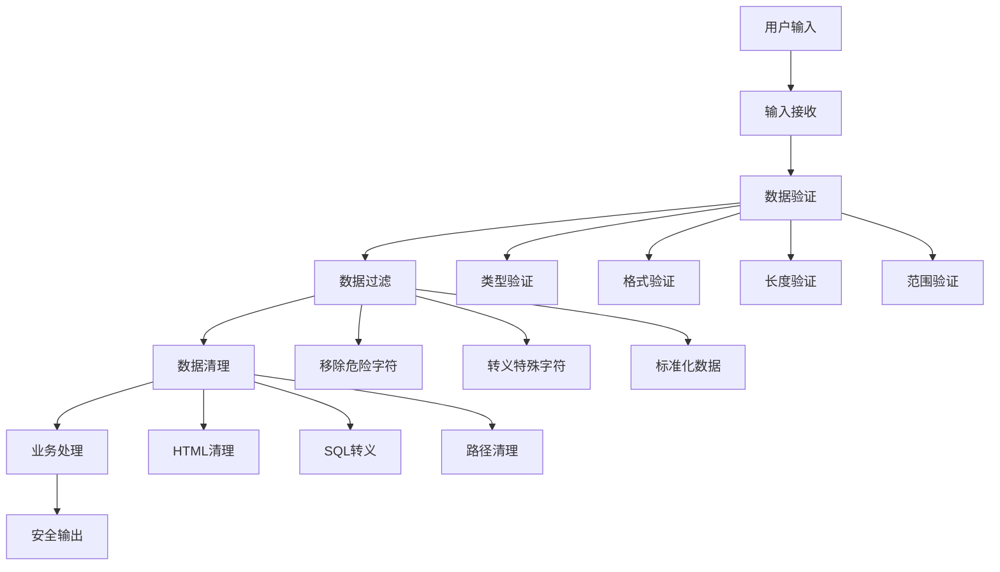

# 输入验证与过滤

## 🎯 学习目标
- 掌握输入验证的基本原则和方法
- 理解数据过滤和清理技术
- 学会实现安全的输入处理
- 了解输入验证的最佳实践

## 📚 核心概念

### 输入验证流程



### 验证类型对比

| 验证类型 | 验证内容 | 示例 | 安全性 |
|----------|----------|------|--------|
| 类型验证 | 数据类型 | 整数、字符串、邮箱 | 高 |
| 格式验证 | 数据格式 | 正则表达式、日期格式 | 高 |
| 长度验证 | 数据长度 | 最小/最大长度 | 中 |
| 范围验证 | 数值范围 | 最小值、最大值 | 中 |
| 白名单验证 | 允许的值 | 枚举值、选项列表 | 最高 |
| 黑名单验证 | 禁止的值 | 危险字符、关键词 | 低 |

## 🔧 输入验证实现

### 基础验证器
```php
<?php
// 1. 基础验证器类
class BasicValidator {
    // 验证非空
    public static function required($value) {
        return !empty($value) && $value !== null;
    }
    
    // 验证字符串长度
    public static function length($value, $min = 0, $max = null) {
        if (!is_string($value)) {
            return false;
        }
        
        $length = strlen($value);
        
        if ($length < $min) {
            return false;
        }
        
        if ($max !== null && $length > $max) {
            return false;
        }
        
        return true;
    }
    
    // 验证邮箱
    public static function email($value) {
        return filter_var($value, FILTER_VALIDATE_EMAIL) !== false;
    }
    
    // 验证URL
    public static function url($value) {
        return filter_var($value, FILTER_VALIDATE_URL) !== false;
    }
    
    // 验证整数
    public static function integer($value, $min = null, $max = null) {
        $int = filter_var($value, FILTER_VALIDATE_INT);
        
        if ($int === false) {
            return false;
        }
        
        if ($min !== null && $int < $min) {
            return false;
        }
        
        if ($max !== null && $int > $max) {
            return false;
        }
        
        return true;
    }
    
    // 验证浮点数
    public static function float($value, $min = null, $max = null) {
        $float = filter_var($value, FILTER_VALIDATE_FLOAT);
        
        if ($float === false) {
            return false;
        }
        
        if ($min !== null && $float < $min) {
            return false;
        }
        
        if ($max !== null && $float > $max) {
            return false;
        }
        
        return true;
    }
    
    // 验证正则表达式
    public static function regex($value, $pattern) {
        return preg_match($pattern, $value) === 1;
    }
    
    // 验证白名单
    public static function in($value, $allowed) {
        return in_array($value, $allowed);
    }
    
    // 验证黑名单
    public static function notIn($value, $forbidden) {
        return !in_array($value, $forbidden);
    }
    
    // 验证日期
    public static function date($value, $format = 'Y-m-d') {
        $date = DateTime::createFromFormat($format, $value);
        return $date && $date->format($format) === $value;
    }
    
    // 验证IP地址
    public static function ip($value, $type = null) {
        $flags = 0;
        
        if ($type === 'ipv4') {
            $flags = FILTER_FLAG_IPV4;
        } elseif ($type === 'ipv6') {
            $flags = FILTER_FLAG_IPV6;
        }
        
        return filter_var($value, FILTER_VALIDATE_IP, $flags) !== false;
    }
}

// 2. 高级验证器
class AdvancedValidator {
    // 验证文件上传
    public static function uploadedFile($file, $options = []) {
        $maxSize = $options['max_size'] ?? 5 * 1024 * 1024; // 5MB
        $allowedTypes = $options['allowed_types'] ?? ['image/jpeg', 'image/png'];
        $allowedExtensions = $options['allowed_extensions'] ?? ['jpg', 'jpeg', 'png'];
        
        // 检查上传错误
        if ($file['error'] !== UPLOAD_ERR_OK) {
            return false;
        }
        
        // 检查文件大小
        if ($file['size'] > $maxSize) {
            return false;
        }
        
        // 检查文件类型
        $finfo = finfo_open(FILEINFO_MIME_TYPE);
        $mimeType = finfo_file($finfo, $file['tmp_name']);
        finfo_close($finfo);
        
        if (!in_array($mimeType, $allowedTypes)) {
            return false;
        }
        
        // 检查文件扩展名
        $extension = strtolower(pathinfo($file['name'], PATHINFO_EXTENSION));
        if (!in_array($extension, $allowedExtensions)) {
            return false;
        }
        
        return true;
    }
    
    // 验证JSON
    public static function json($value) {
        if (!is_string($value)) {
            return false;
        }
        
        json_decode($value);
        return json_last_error() === JSON_ERROR_NONE;
    }
    
    // 验证信用卡号
    public static function creditCard($value) {
        // 移除空格和连字符
        $number = preg_replace('/[\s-]/', '', $value);
        
        // 检查长度
        if (strlen($number) < 13 || strlen($number) > 19) {
            return false;
        }
        
        // 检查是否只包含数字
        if (!ctype_digit($number)) {
            return false;
        }
        
        // Luhn算法验证
        return self::luhnCheck($number);
    }
    
    // Luhn算法
    private static function luhnCheck($number) {
        $sum = 0;
        $length = strlen($number);
        
        for ($i = 0; $i < $length; $i++) {
            $digit = (int)$number[$length - 1 - $i];
            
            if ($i % 2 === 1) {
                $digit *= 2;
                if ($digit > 9) {
                    $digit -= 9;
                }
            }
            
            $sum += $digit;
        }
        
        return $sum % 10 === 0;
    }
    
    // 验证密码强度
    public static function passwordStrength($password, $options = []) {
        $minLength = $options['min_length'] ?? 8;
        $requireUppercase = $options['require_uppercase'] ?? true;
        $requireLowercase = $options['require_lowercase'] ?? true;
        $requireNumbers = $options['require_numbers'] ?? true;
        $requireSymbols = $options['require_symbols'] ?? false;
        
        if (strlen($password) < $minLength) {
            return false;
        }
        
        if ($requireUppercase && !preg_match('/[A-Z]/', $password)) {
            return false;
        }
        
        if ($requireLowercase && !preg_match('/[a-z]/', $password)) {
            return false;
        }
        
        if ($requireNumbers && !preg_match('/[0-9]/', $password)) {
            return false;
        }
        
        if ($requireSymbols && !preg_match('/[^a-zA-Z0-9]/', $password)) {
            return false;
        }
        
        return true;
    }
}

// 使用示例
echo "=== 基础验证器示例 ===\n";

try {
    // 基础验证测试
    $tests = [
        ['required', 'Hello', true],
        ['required', '', false],
        ['length', 'Hello', 3, 10, true],
        ['length', 'Hi', 3, 10, false],
        ['email', 'test@example.com', true],
        ['email', 'invalid-email', false],
        ['integer', '123', 100, 200, true],
        ['integer', '50', 100, 200, false],
        ['regex', 'abc123', '/^[a-z0-9]+$/', true],
        ['regex', 'ABC123', '/^[a-z0-9]+$/', false],
        ['in', 'apple', ['apple', 'banana', 'orange'], true],
        ['in', 'grape', ['apple', 'banana', 'orange'], false]
    ];
    
    echo "基础验证测试结果:\n";
    foreach ($tests as [$method, $value, ...$params]) {
        $expected = array_pop($params);
        $result = call_user_func_array(['BasicValidator', $method], array_merge([$value], $params));
        $status = $result === $expected ? "✓" : "✗";
        echo "  $status $method('$value'): " . ($result ? "通过" : "失败") . "\n";
    }
    
    // 高级验证测试
    echo "\n高级验证测试:\n";
    
    // 密码强度验证
    $passwordTests = [
        ['weak123', false],
        ['Strong123!', true],
        ['password', false],
        ['MySecure123', true]
    ];
    
    foreach ($passwordTests as [$password, $expected]) {
        $result = AdvancedValidator::passwordStrength($password);
        $status = $result === $expected ? "✓" : "✗";
        echo "  $status 密码强度('$password'): " . ($result ? "强" : "弱") . "\n";
    }
    
    // 信用卡号验证
    $cardTests = [
        ['4111111111111111', true], // Visa测试号
        ['1234567890123456', false], // 无效号
        ['5555555555554444', true]  // MasterCard测试号
    ];
    
    foreach ($cardTests as [$card, $expected]) {
        $result = AdvancedValidator::creditCard($card);
        $status = $result === $expected ? "✓" : "✗";
        echo "  $status 信用卡号('$card'): " . ($result ? "有效" : "无效") . "\n";
    }
    
} catch (Exception $e) {
    echo "错误: " . $e->getMessage() . "\n";
}
?>
```

### 数据过滤器
```php
<?php
// 1. 数据过滤器类
class DataFilter {
    // 过滤HTML标签
    public static function stripTags($value, $allowedTags = '') {
        if (!is_string($value)) {
            return $value;
        }
        
        return strip_tags($value, $allowedTags);
    }
    
    // HTML实体编码
    public static function htmlEncode($value, $flags = ENT_QUOTES | ENT_HTML5) {
        if (!is_string($value)) {
            return $value;
        }
        
        return htmlspecialchars($value, $flags, 'UTF-8');
    }
    
    // 移除危险字符
    public static function removeDangerousChars($value) {
        if (!is_string($value)) {
            return $value;
        }
        
        // 移除控制字符
        $value = preg_replace('/[\x00-\x08\x0B\x0C\x0E-\x1F\x7F]/', '', $value);
        
        // 移除危险字符
        $dangerousChars = ['<', '>', '"', "'", '&', '\\', '/', ';', '(', ')', '`'];
        $value = str_replace($dangerousChars, '', $value);
        
        return $value;
    }
    
    // 过滤SQL特殊字符
    public static function sqlEscape($value) {
        if (!is_string($value)) {
            return $value;
        }
        
        // 移除SQL注释
        $value = preg_replace('/--.*$/m', '', $value);
        $value = preg_replace('/\/\*.*?\*\//s', '', $value);
        
        // 转义单引号
        $value = str_replace("'", "''", $value);
        
        return $value;
    }
    
    // 过滤路径遍历
    public static function sanitizePath($value) {
        if (!is_string($value)) {
            return $value;
        }
        
        // 移除路径遍历字符
        $value = str_replace(['../', '..\\', '..'], '', $value);
        
        // 移除绝对路径
        $value = ltrim($value, '/\\');
        
        // 移除危险字符
        $value = preg_replace('/[^a-zA-Z0-9._-]/', '', $value);
        
        return $value;
    }
    
    // 过滤XSS
    public static function xssFilter($value) {
        if (!is_string($value)) {
            return $value;
        }
        
        // 移除脚本标签
        $value = preg_replace('/<script[^>]*>.*?<\/script>/is', '', $value);
        
        // 移除事件处理器
        $value = preg_replace('/on\w+\s*=\s*["\'][^"\']*["\']/i', '', $value);
        
        // 移除javascript:协议
        $value = preg_replace('/javascript:/i', '', $value);
        
        // HTML实体编码
        $value = self::htmlEncode($value);
        
        return $value;
    }
    
    // 标准化数据
    public static function normalize($value, $type = 'string') {
        if (!is_string($value)) {
            return $value;
        }
        
        switch ($type) {
            case 'string':
                return trim($value);
            case 'email':
                return strtolower(trim($value));
            case 'url':
                return rtrim(trim($value), '/');
            case 'phone':
                return preg_replace('/[^0-9+()-]/', '', $value);
            case 'alphanumeric':
                return preg_replace('/[^a-zA-Z0-9]/', '', $value);
            case 'numeric':
                return preg_replace('/[^0-9.-]/', '', $value);
            default:
                return trim($value);
        }
    }
    
    // 批量过滤
    public static function filterArray($data, $filters) {
        if (is_array($data)) {
            $filtered = [];
            foreach ($data as $key => $value) {
                if (isset($filters[$key])) {
                    $filtered[$key] = self::filterArray($value, $filters[$key]);
                } else {
                    $filtered[$key] = $value;
                }
            }
            return $filtered;
        } elseif (is_string($data)) {
            if (is_callable($filters)) {
                return $filters($data);
            } elseif (is_string($filters) && method_exists(self::class, $filters)) {
                return self::$filters($data);
            }
        }
        
        return $data;
    }
}

// 2. 输入处理器
class InputProcessor {
    private $validators = [];
    private $filters = [];
    private $rules = [];
    
    public function __construct() {
        $this->validators = [
            'required' => ['BasicValidator', 'required'],
            'length' => ['BasicValidator', 'length'],
            'email' => ['BasicValidator', 'email'],
            'url' => ['BasicValidator', 'url'],
            'integer' => ['BasicValidator', 'integer'],
            'float' => ['BasicValidator', 'float'],
            'regex' => ['BasicValidator', 'regex'],
            'in' => ['BasicValidator', 'in'],
            'date' => ['BasicValidator', 'date'],
            'ip' => ['BasicValidator', 'ip']
        ];
        
        $this->filters = [
            'strip_tags' => ['DataFilter', 'stripTags'],
            'html_encode' => ['DataFilter', 'htmlEncode'],
            'remove_dangerous' => ['DataFilter', 'removeDangerousChars'],
            'sql_escape' => ['DataFilter', 'sqlEscape'],
            'sanitize_path' => ['DataFilter', 'sanitizePath'],
            'xss_filter' => ['DataFilter', 'xssFilter'],
            'normalize' => ['DataFilter', 'normalize']
        ];
    }
    
    // 添加验证规则
    public function addRule($field, $rule, $params = [], $message = '') {
        if (!isset($this->rules[$field])) {
            $this->rules[$field] = [];
        }
        
        $this->rules[$field][] = [
            'rule' => $rule,
            'params' => $params,
            'message' => $message
        ];
        
        return $this;
    }
    
    // 添加过滤器
    public function addFilter($field, $filter, $params = []) {
        if (!isset($this->filters[$field])) {
            $this->filters[$field] = [];
        }
        
        $this->filters[$field][] = [
            'filter' => $filter,
            'params' => $params
        ];
        
        return $this;
    }
    
    // 处理输入
    public function process($data) {
        $result = [
            'valid' => true,
            'data' => [],
            'errors' => []
        ];
        
        foreach ($data as $field => $value) {
            // 应用过滤器
            $filteredValue = $this->applyFilters($field, $value);
            
            // 应用验证规则
            $validation = $this->validateField($field, $filteredValue);
            
            if ($validation['valid']) {
                $result['data'][$field] = $filteredValue;
            } else {
                $result['valid'] = false;
                $result['errors'][$field] = $validation['errors'];
            }
        }
        
        return $result;
    }
    
    // 应用过滤器
    private function applyFilters($field, $value) {
        if (!isset($this->filters[$field])) {
            return $value;
        }
        
        foreach ($this->filters[$field] as $filterConfig) {
            $filter = $filterConfig['filter'];
            $params = $filterConfig['params'];
            
            if (is_callable($filter)) {
                $value = call_user_func_array($filter, array_merge([$value], $params));
            } elseif (is_string($filter) && isset($this->filters[$filter])) {
                $value = call_user_func_array($this->filters[$filter], array_merge([$value], $params));
            }
        }
        
        return $value;
    }
    
    // 验证字段
    private function validateField($field, $value) {
        $result = [
            'valid' => true,
            'errors' => []
        ];
        
        if (!isset($this->rules[$field])) {
            return $result;
        }
        
        foreach ($this->rules[$field] as $ruleConfig) {
            $rule = $ruleConfig['rule'];
            $params = $ruleConfig['params'];
            $message = $ruleConfig['message'];
            
            if (isset($this->validators[$rule])) {
                $validator = $this->validators[$rule];
                $isValid = call_user_func_array($validator, array_merge([$value], $params));
                
                if (!$isValid) {
                    $result['valid'] = false;
                    $result['errors'][] = $message ?: "字段 $field 验证失败";
                }
            }
        }
        
        return $result;
    }
}

// 使用示例
echo "=== 数据过滤器示例 ===\n";

try {
    // 数据过滤测试
    $testData = [
        'html' => '<script>alert("XSS")</script>Hello World',
        'sql' => "'; DROP TABLE users; --",
        'path' => '../../../etc/passwd',
        'xss' => '',
        'email' => '  USER@EXAMPLE.COM  ',
        'phone' => '+1 (555) 123-4567'
    ];
    
    echo "数据过滤结果:\n";
    foreach ($testData as $type => $value) {
        $filtered = DataFilter::xssFilter($value);
        echo "  $type: '$value' -> '$filtered'\n";
    }
    
    // 输入处理器
    $processor = new InputProcessor();
    
    // 添加规则
    $processor->addRule('username', 'required', [], '用户名不能为空')
              ->addRule('username', 'length', [3, 20], '用户名长度必须在3-20个字符之间')
              ->addRule('email', 'email', [], '邮箱格式不正确')
              ->addRule('age', 'integer', [18, 100], '年龄必须在18-100之间');
    
    // 添加过滤器
    $processor->addFilter('username', 'normalize', ['string'])
              ->addFilter('email', 'normalize', ['email'])
              ->addFilter('username', 'remove_dangerous')
              ->addFilter('email', 'html_encode');
    
    // 处理输入
    $inputData = [
        'username' => '  <script>alert(1)</script>john_doe  ',
        'email' => '  JOHN@EXAMPLE.COM  ',
        'age' => '25'
    ];
    
    $result = $processor->process($inputData);
    
    echo "\n输入处理结果:\n";
    echo "验证状态: " . ($result['valid'] ? "通过" : "失败") . "\n";
    
    if ($result['valid']) {
        echo "处理后的数据:\n";
        foreach ($result['data'] as $field => $value) {
            echo "  $field: '$value'\n";
        }
    } else {
        echo "验证错误:\n";
        foreach ($result['errors'] as $field => $errors) {
            echo "  $field: " . implode(', ', $errors) . "\n";
        }
    }
    
} catch (Exception $e) {
    echo "错误: " . $e->getMessage() . "\n";
}
?>
```

## 📊 最佳实践

### 输入验证最佳实践
```php
<?php
// 输入验证最佳实践

class InputValidationBestPractices {
    // 1. 验证策略
    public static function getValidationStrategies() {
        return [
            '白名单验证' => [
                '描述' => '只允许预定义的值',
                '优点' => '安全性最高',
                '缺点' => '灵活性较低',
                '适用场景' => '枚举值、选项列表'
            ],
            '黑名单验证' => [
                '描述' => '禁止特定的值',
                '优点' => '灵活性较高',
                '缺点' => '安全性较低',
                '适用场景' => '补充验证'
            ],
            '格式验证' => [
                '描述' => '验证数据格式',
                '优点' => '准确性高',
                '缺点' => '实现复杂',
                '适用场景' => '邮箱、URL、日期'
            ],
            '范围验证' => [
                '描述' => '验证数值范围',
                '优点' => '简单有效',
                '缺点' => '只适用于数值',
                '适用场景' => '年龄、价格、数量'
            ]
        ];
    }
    
    // 2. 常见验证规则
    public static function getCommonValidationRules() {
        return [
            '用户输入' => [
                'username' => [
                    'required' => true,
                    'type' => 'string',
                    'min_length' => 3,
                    'max_length' => 20,
                    'pattern' => '/^[a-zA-Z0-9_]+$/',
                    'filters' => ['normalize', 'remove_dangerous']
                ],
                'email' => [
                    'required' => true,
                    'type' => 'email',
                    'max_length' => 100,
                    'filters' => ['normalize']
                ],
                'password' => [
                    'required' => true,
                    'type' => 'string',
                    'min_length' => 8,
                    'max_length' => 128,
                    'pattern' => '/^(?=.*[a-z])(?=.*[A-Z])(?=.*\d)(?=.*[@$!%*?&])[A-Za-z\d@$!%*?&]/',
                    'filters' => ['html_encode']
                ]
            ],
            '业务数据' => [
                'age' => [
                    'required' => true,
                    'type' => 'integer',
                    'min' => 18,
                    'max' => 100
                ],
                'price' => [
                    'required' => true,
                    'type' => 'float',
                    'min' => 0,
                    'max' => 999999.99
                ],
                'status' => [
                    'required' => true,
                    'type' => 'string',
                    'allowed' => ['active', 'inactive', 'pending']
                ]
            ]
        ];
    }
    
    // 3. 安全配置
    public static function getSecurityConfiguration() {
        return [
            '生产环境' => [
                'strict_validation' => true,
                'log_failures' => true,
                'rate_limiting' => true,
                'sanitization' => 'strict',
                'error_messages' => 'generic'
            ],
            '开发环境' => [
                'strict_validation' => false,
                'log_failures' => true,
                'rate_limiting' => false,
                'sanitization' => 'moderate',
                'error_messages' => 'detailed'
            ],
            '测试环境' => [
                'strict_validation' => true,
                'log_failures' => false,
                'rate_limiting' => false,
                'sanitization' => 'strict',
                'error_messages' => 'detailed'
            ]
        ];
    }
    
    // 4. 错误处理策略
    public static function getErrorHandlingStrategies() {
        return [
            '用户友好' => [
                '显示具体错误信息',
                '提供修正建议',
                '保持表单状态',
                '高亮错误字段'
            ],
            '安全优先' => [
                '显示通用错误信息',
                '记录详细错误日志',
                '不泄露系统信息',
                '实施速率限制'
            ],
            '开发调试' => [
                '显示详细错误信息',
                '包含堆栈跟踪',
                '显示验证规则',
                '记录所有输入'
            ]
        ];
    }
}

// 使用示例
echo "=== 输入验证最佳实践示例 ===\n";

try {
    // 验证策略
    $strategies = InputValidationBestPractices::getValidationStrategies();
    echo "验证策略:\n";
    foreach ($strategies as $strategy => $info) {
        echo "  $strategy:\n";
        foreach ($info as $key => $value) {
            echo "    $key: $value\n";
        }
        echo "\n";
    }
    
    // 常见验证规则
    $rules = InputValidationBestPractices::getCommonValidationRules();
    echo "常见验证规则:\n";
    foreach ($rules as $category => $fieldRules) {
        echo "  $category:\n";
        foreach ($fieldRules as $field => $rule) {
            echo "    $field: " . json_encode($rule) . "\n";
        }
        echo "\n";
    }
    
    // 安全配置
    $configs = InputValidationBestPractices::getSecurityConfiguration();
    echo "安全配置:\n";
    foreach ($configs as $env => $config) {
        echo "  $env:\n";
        foreach ($config as $key => $value) {
            echo "    $key: " . (is_bool($value) ? ($value ? 'true' : 'false') : $value) . "\n";
        }
        echo "\n";
    }
    
    // 错误处理策略
    $errorStrategies = InputValidationBestPractices::getErrorHandlingStrategies();
    echo "错误处理策略:\n";
    foreach ($errorStrategies as $strategy => $items) {
        echo "  $strategy:\n";
        foreach ($items as $item) {
            echo "    - $item\n";
        }
        echo "\n";
    }
    
} catch (Exception $e) {
    echo "错误: " . $e->getMessage() . "\n";
}
?>
```

## 🎓 学习建议

### 费曼学习法应用
1. **选择概念**: 选择输入验证中的核心概念
2. **简化解释**: 用简单语言解释输入验证的重要性
3. **识别盲点**: 发现理解不深入的地方
4. **重新学习**: 针对盲点进行深入学习

### 刻意练习重点
1. **验证规则**: 掌握各种验证规则的实现
2. **数据过滤**: 学会安全的数据过滤技术
3. **错误处理**: 理解不同场景下的错误处理策略
4. **安全配置**: 掌握不同环境下的安全配置

## 🔗 相关链接
- [[01-SQL注入防护|SQL注入防护]]
- [[02-XSS攻击防护|XSS攻击防护]]
- [[03-CSRF防护|CSRF防护]]
- [[05-密码安全|密码安全]]
- [[06-文件上传安全|文件上传安全]]
- [[07-安全编程最佳实践|安全编程最佳实践]]
- [[08-安全审计清单|安全审计清单]]
