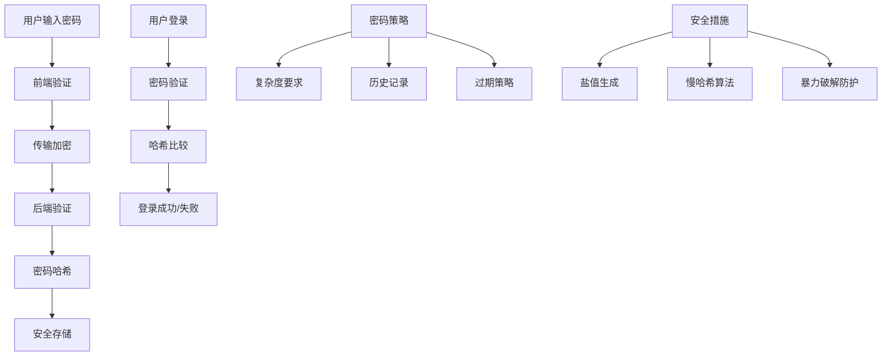

# 密码安全

## 🎯 学习目标
- 掌握密码安全的基本原则
- 理解密码哈希和加密技术
- 学会实现安全的密码存储
- 了解密码策略和最佳实践

## 📚 核心概念

### 密码安全架构



### 密码安全对比

| 安全措施 | 描述 | 安全性 | 性能影响 |
|----------|------|--------|----------|
| 明文存储 | 直接存储密码 | 极低 | 无 |
| MD5哈希 | 简单哈希算法 | 低 | 低 |
| SHA-256 | 标准哈希算法 | 中 | 低 |
| bcrypt | 自适应哈希 | 高 | 中 |
| scrypt | 内存困难哈希 | 高 | 中 |
| Argon2 | 现代哈希算法 | 最高 | 中 |

## 🔧 密码安全实现

### 密码哈希器
```php
<?php
// 1. 密码哈希器类
class PasswordHasher {
    private $algorithm;
    private $cost;
    private $saltLength;
    
    public function __construct($algorithm = 'bcrypt', $cost = 12, $saltLength = 16) {
        $this->algorithm = $algorithm;
        $this->cost = $cost;
        $this->saltLength = $saltLength;
    }
    
    // 生成密码哈希
    public function hash($password) {
        switch ($this->algorithm) {
            case 'bcrypt':
                return password_hash($password, PASSWORD_BCRYPT, ['cost' => $this->cost]);
            case 'argon2i':
                return password_hash($password, PASSWORD_ARGON2I, [
                    'memory_cost' => 65536,
                    'time_cost' => 4,
                    'threads' => 3
                ]);
            case 'argon2id':
                return password_hash($password, PASSWORD_ARGON2ID, [
                    'memory_cost' => 65536,
                    'time_cost' => 4,
                    'threads' => 3
                ]);
            case 'scrypt':
                return $this->scryptHash($password);
            default:
                throw new InvalidArgumentException("不支持的哈希算法: {$this->algorithm}");
        }
    }
    
    // 验证密码
    public function verify($password, $hash) {
        if ($this->algorithm === 'scrypt') {
            return $this->scryptVerify($password, $hash);
        }
        
        return password_verify($password, $hash);
    }
    
    // 检查哈希是否需要重新生成
    public function needsRehash($hash) {
        if ($this->algorithm === 'scrypt') {
            return false; // scrypt不支持自动重新哈希
        }
        
        return password_needs_rehash($hash, $this->getPasswordConstant(), $this->getOptions());
    }
    
    // 获取密码常量
    private function getPasswordConstant() {
        switch ($this->algorithm) {
            case 'bcrypt':
                return PASSWORD_BCRYPT;
            case 'argon2i':
                return PASSWORD_ARGON2I;
            case 'argon2id':
                return PASSWORD_ARGON2ID;
            default:
                return PASSWORD_DEFAULT;
        }
    }
    
    // 获取选项
    private function getOptions() {
        switch ($this->algorithm) {
            case 'bcrypt':
                return ['cost' => $this->cost];
            case 'argon2i':
            case 'argon2id':
                return [
                    'memory_cost' => 65536,
                    'time_cost' => 4,
                    'threads' => 3
                ];
            default:
                return [];
        }
    }
    
    // scrypt哈希实现
    private function scryptHash($password) {
        $salt = random_bytes($this->saltLength);
        $hash = hash_pbkdf2('sha256', $password, $salt, 10000, 32);
        return base64_encode($salt . $hash);
    }
    
    // scrypt验证实现
    private function scryptVerify($password, $hash) {
        $decoded = base64_decode($hash);
        $salt = substr($decoded, 0, $this->saltLength);
        $storedHash = substr($decoded, $this->saltLength);
        $computedHash = hash_pbkdf2('sha256', $password, $salt, 10000, 32);
        return hash_equals($storedHash, $computedHash);
    }
    
    // 生成随机盐值
    public function generateSalt($length = null) {
        $length = $length ?: $this->saltLength;
        return random_bytes($length);
    }
    
    // 生成安全随机密码
    public function generatePassword($length = 16, $includeSymbols = true) {
        $chars = 'abcdefghijklmnopqrstuvwxyzABCDEFGHIJKLMNOPQRSTUVWXYZ0123456789';
        
        if ($includeSymbols) {
            $chars .= '!@#$%^&*()_+-=[]{}|;:,.<>?';
        }
        
        $password = '';
        $charsLength = strlen($chars);
        
        for ($i = 0; $i < $length; $i++) {
            $password .= $chars[random_int(0, $charsLength - 1)];
        }
        
        return $password;
    }
}

// 2. 密码策略验证器
class PasswordPolicyValidator {
    private $rules;
    
    public function __construct($rules = []) {
        $this->rules = array_merge([
            'min_length' => 8,
            'max_length' => 128,
            'require_uppercase' => true,
            'require_lowercase' => true,
            'require_numbers' => true,
            'require_symbols' => false,
            'forbidden_words' => [],
            'max_repeating_chars' => 3,
            'min_unique_chars' => 4
        ], $rules);
    }
    
    // 验证密码策略
    public function validate($password) {
        $errors = [];
        
        // 长度验证
        if (strlen($password) < $this->rules['min_length']) {
            $errors[] = "密码长度不能少于{$this->rules['min_length']}个字符";
        }
        
        if (strlen($password) > $this->rules['max_length']) {
            $errors[] = "密码长度不能超过{$this->rules['max_length']}个字符";
        }
        
        // 字符类型验证
        if ($this->rules['require_uppercase'] && !preg_match('/[A-Z]/', $password)) {
            $errors[] = "密码必须包含大写字母";
        }
        
        if ($this->rules['require_lowercase'] && !preg_match('/[a-z]/', $password)) {
            $errors[] = "密码必须包含小写字母";
        }
        
        if ($this->rules['require_numbers'] && !preg_match('/[0-9]/', $password)) {
            $errors[] = "密码必须包含数字";
        }
        
        if ($this->rules['require_symbols'] && !preg_match('/[^a-zA-Z0-9]/', $password)) {
            $errors[] = "密码必须包含特殊字符";
        }
        
        // 禁止词汇验证
        foreach ($this->rules['forbidden_words'] as $word) {
            if (stripos($password, $word) !== false) {
                $errors[] = "密码不能包含禁止词汇: $word";
            }
        }
        
        // 重复字符验证
        if ($this->rules['max_repeating_chars'] > 0) {
            $maxRepeating = $this->getMaxRepeatingChars($password);
            if ($maxRepeating > $this->rules['max_repeating_chars']) {
                $errors[] = "密码不能包含超过{$this->rules['max_repeating_chars']}个连续相同字符";
            }
        }
        
        // 唯一字符验证
        if ($this->rules['min_unique_chars'] > 0) {
            $uniqueChars = count(array_unique(str_split($password)));
            if ($uniqueChars < $this->rules['min_unique_chars']) {
                $errors[] = "密码必须包含至少{$this->rules['min_unique_chars']}个不同字符";
            }
        }
        
        return [
            'valid' => empty($errors),
            'errors' => $errors
        ];
    }
    
    // 获取最大重复字符数
    private function getMaxRepeatingChars($password) {
        $maxRepeating = 1;
        $currentRepeating = 1;
        
        for ($i = 1; $i < strlen($password); $i++) {
            if ($password[$i] === $password[$i - 1]) {
                $currentRepeating++;
            } else {
                $maxRepeating = max($maxRepeating, $currentRepeating);
                $currentRepeating = 1;
            }
        }
        
        return max($maxRepeating, $currentRepeating);
    }
    
    // 计算密码强度
    public function calculateStrength($password) {
        $score = 0;
        $length = strlen($password);
        
        // 长度评分
        if ($length >= 8) $score += 1;
        if ($length >= 12) $score += 1;
        if ($length >= 16) $score += 1;
        
        // 字符类型评分
        if (preg_match('/[a-z]/', $password)) $score += 1;
        if (preg_match('/[A-Z]/', $password)) $score += 1;
        if (preg_match('/[0-9]/', $password)) $score += 1;
        if (preg_match('/[^a-zA-Z0-9]/', $password)) $score += 1;
        
        // 复杂度评分
        $uniqueChars = count(array_unique(str_split($password)));
        if ($uniqueChars >= $length * 0.7) $score += 1;
        
        // 转换为强度等级
        if ($score <= 2) return '弱';
        if ($score <= 4) return '中';
        if ($score <= 6) return '强';
        return '极强';
    }
}

// 使用示例
echo "=== 密码安全示例 ===\n";

try {
    // 密码哈希器测试
    $hasher = new PasswordHasher('bcrypt', 12);
    
    $password = 'MySecurePassword123!';
    $hash = $hasher->hash($password);
    
    echo "密码哈希测试:\n";
    echo "原始密码: $password\n";
    echo "哈希值: $hash\n";
    echo "验证结果: " . ($hasher->verify($password, $hash) ? "成功" : "失败") . "\n";
    echo "需要重新哈希: " . ($hasher->needsRehash($hash) ? "是" : "否") . "\n\n";
    
    // 密码策略验证器测试
    $validator = new PasswordPolicyValidator([
        'min_length' => 8,
        'require_uppercase' => true,
        'require_lowercase' => true,
        'require_numbers' => true,
        'require_symbols' => true,
        'forbidden_words' => ['password', '123456', 'admin'],
        'max_repeating_chars' => 2
    ]);
    
    $testPasswords = [
        'weak',
        'password123',
        'MySecure123!',
        'VeryStrongPassword123!@#',
        'admin123',
        'AAA123!'
    ];
    
    echo "密码策略验证测试:\n";
    foreach ($testPasswords as $testPassword) {
        $result = $validator->validate($testPassword);
        $strength = $validator->calculateStrength($testPassword);
        
        echo "密码: '$testPassword'\n";
        echo "强度: $strength\n";
        echo "验证: " . ($result['valid'] ? "通过" : "失败") . "\n";
        
        if (!$result['valid']) {
            echo "错误: " . implode(', ', $result['errors']) . "\n";
        }
        echo "\n";
    }
    
    // 生成安全密码
    echo "生成安全密码:\n";
    for ($i = 0; $i < 3; $i++) {
        $generatedPassword = $hasher->generatePassword(16, true);
        $strength = $validator->calculateStrength($generatedPassword);
        echo "  $generatedPassword (强度: $strength)\n";
    }
    
} catch (Exception $e) {
    echo "错误: " . $e->getMessage() . "\n";
}
?>
```

### 密码管理器
```php
<?php
// 1. 密码管理器类
class PasswordManager {
    private $hasher;
    private $validator;
    private $db;
    
    public function __construct($db) {
        $this->hasher = new PasswordHasher();
        $this->validator = new PasswordPolicyValidator();
        $this->db = $db;
    }
    
    // 注册用户
    public function registerUser($username, $password, $email = null) {
        // 验证密码策略
        $validation = $this->validator->validate($password);
        if (!$validation['valid']) {
            throw new InvalidArgumentException("密码不符合策略: " . implode(', ', $validation['errors']));
        }
        
        // 检查用户名是否已存在
        if ($this->userExists($username)) {
            throw new InvalidArgumentException("用户名已存在");
        }
        
        // 生成密码哈希
        $passwordHash = $this->hasher->hash($password);
        
        // 存储用户信息
        $stmt = $this->db->prepare("
            INSERT INTO users (username, password_hash, email, created_at, updated_at) 
            VALUES (?, ?, ?, NOW(), NOW())
        ");
        
        $result = $stmt->execute([$username, $passwordHash, $email]);
        
        if ($result) {
            return [
                'success' => true,
                'user_id' => $this->db->lastInsertId(),
                'message' => '用户注册成功'
            ];
        } else {
            throw new RuntimeException("用户注册失败");
        }
    }
    
    // 用户登录
    public function login($username, $password) {
        // 获取用户信息
        $user = $this->getUserByUsername($username);
        if (!$user) {
            return [
                'success' => false,
                'message' => '用户名或密码错误'
            ];
        }
        
        // 验证密码
        if (!$this->hasher->verify($password, $user['password_hash'])) {
            // 记录登录失败
            $this->logLoginAttempt($username, false);
            return [
                'success' => false,
                'message' => '用户名或密码错误'
            ];
        }
        
        // 检查密码是否需要重新哈希
        if ($this->hasher->needsRehash($user['password_hash'])) {
            $newHash = $this->hasher->hash($password);
            $this->updatePasswordHash($user['id'], $newHash);
        }
        
        // 记录登录成功
        $this->logLoginAttempt($username, true);
        
        // 更新最后登录时间
        $this->updateLastLogin($user['id']);
        
        return [
            'success' => true,
            'user_id' => $user['id'],
            'username' => $user['username'],
            'message' => '登录成功'
        ];
    }
    
    // 修改密码
    public function changePassword($userId, $oldPassword, $newPassword) {
        // 获取用户信息
        $user = $this->getUserById($userId);
        if (!$user) {
            throw new InvalidArgumentException("用户不存在");
        }
        
        // 验证旧密码
        if (!$this->hasher->verify($oldPassword, $user['password_hash'])) {
            throw new InvalidArgumentException("旧密码错误");
        }
        
        // 验证新密码策略
        $validation = $this->validator->validate($newPassword);
        if (!$validation['valid']) {
            throw new InvalidArgumentException("新密码不符合策略: " . implode(', ', $validation['errors']));
        }
        
        // 检查新密码是否与旧密码相同
        if ($this->hasher->verify($newPassword, $user['password_hash'])) {
            throw new InvalidArgumentException("新密码不能与旧密码相同");
        }
        
        // 生成新密码哈希
        $newPasswordHash = $this->hasher->hash($newPassword);
        
        // 更新密码
        $stmt = $this->db->prepare("
            UPDATE users 
            SET password_hash = ?, updated_at = NOW() 
            WHERE id = ?
        ");
        
        $result = $stmt->execute([$newPasswordHash, $userId]);
        
        if ($result) {
            // 记录密码修改
            $this->logPasswordChange($userId);
            return [
                'success' => true,
                'message' => '密码修改成功'
            ];
        } else {
            throw new RuntimeException("密码修改失败");
        }
    }
    
    // 重置密码
    public function resetPassword($email) {
        // 获取用户信息
        $user = $this->getUserByEmail($email);
        if (!$user) {
            // 为了安全，不透露用户是否存在
            return [
                'success' => true,
                'message' => '如果邮箱存在，重置链接已发送'
            ];
        }
        
        // 生成重置令牌
        $resetToken = bin2hex(random_bytes(32));
        $expiresAt = date('Y-m-d H:i:s', strtotime('+1 hour'));
        
        // 存储重置令牌
        $stmt = $this->db->prepare("
            INSERT INTO password_resets (user_id, token, expires_at, created_at) 
            VALUES (?, ?, ?, NOW())
        ");
        
        $stmt->execute([$user['id'], $resetToken, $expiresAt]);
        
        // 发送重置邮件（这里只是模拟）
        $this->sendPasswordResetEmail($user['email'], $resetToken);
        
        return [
            'success' => true,
            'message' => '如果邮箱存在，重置链接已发送'
        ];
    }
    
    // 确认重置密码
    public function confirmPasswordReset($token, $newPassword) {
        // 获取重置记录
        $reset = $this->getPasswordResetByToken($token);
        if (!$reset || $reset['expires_at'] < date('Y-m-d H:i:s')) {
            throw new InvalidArgumentException("重置令牌无效或已过期");
        }
        
        // 验证新密码策略
        $validation = $this->validator->validate($newPassword);
        if (!$validation['valid']) {
            throw new InvalidArgumentException("新密码不符合策略: " . implode(', ', $validation['errors']));
        }
        
        // 生成新密码哈希
        $newPasswordHash = $this->hasher->hash($newPassword);
        
        // 更新密码
        $stmt = $this->db->prepare("
            UPDATE users 
            SET password_hash = ?, updated_at = NOW() 
            WHERE id = ?
        ");
        
        $result = $stmt->execute([$newPasswordHash, $reset['user_id']]);
        
        if ($result) {
            // 删除重置令牌
            $this->deletePasswordReset($token);
            
            // 记录密码重置
            $this->logPasswordReset($reset['user_id']);
            
            return [
                'success' => true,
                'message' => '密码重置成功'
            ];
        } else {
            throw new RuntimeException("密码重置失败");
        }
    }
    
    // 检查用户是否存在
    private function userExists($username) {
        $stmt = $this->db->prepare("SELECT COUNT(*) FROM users WHERE username = ?");
        $stmt->execute([$username]);
        return $stmt->fetchColumn() > 0;
    }
    
    // 根据用户名获取用户
    private function getUserByUsername($username) {
        $stmt = $this->db->prepare("SELECT * FROM users WHERE username = ?");
        $stmt->execute([$username]);
        return $stmt->fetch(PDO::FETCH_ASSOC);
    }
    
    // 根据ID获取用户
    private function getUserById($userId) {
        $stmt = $this->db->prepare("SELECT * FROM users WHERE id = ?");
        $stmt->execute([$userId]);
        return $stmt->fetch(PDO::FETCH_ASSOC);
    }
    
    // 根据邮箱获取用户
    private function getUserByEmail($email) {
        $stmt = $this->db->prepare("SELECT * FROM users WHERE email = ?");
        $stmt->execute([$email]);
        return $stmt->fetch(PDO::FETCH_ASSOC);
    }
    
    // 更新密码哈希
    private function updatePasswordHash($userId, $passwordHash) {
        $stmt = $this->db->prepare("UPDATE users SET password_hash = ? WHERE id = ?");
        return $stmt->execute([$passwordHash, $userId]);
    }
    
    // 更新最后登录时间
    private function updateLastLogin($userId) {
        $stmt = $this->db->prepare("UPDATE users SET last_login = NOW() WHERE id = ?");
        return $stmt->execute([$userId]);
    }
    
    // 记录登录尝试
    private function logLoginAttempt($username, $success) {
        $stmt = $this->db->prepare("
            INSERT INTO login_attempts (username, success, ip_address, user_agent, created_at) 
            VALUES (?, ?, ?, ?, NOW())
        ");
        
        $ipAddress = $_SERVER['REMOTE_ADDR'] ?? 'unknown';
        $userAgent = $_SERVER['HTTP_USER_AGENT'] ?? 'unknown';
        
        $stmt->execute([$username, $success ? 1 : 0, $ipAddress, $userAgent]);
    }
    
    // 记录密码修改
    private function logPasswordChange($userId) {
        $stmt = $this->db->prepare("
            INSERT INTO password_changes (user_id, ip_address, user_agent, created_at) 
            VALUES (?, ?, ?, NOW())
        ");
        
        $ipAddress = $_SERVER['REMOTE_ADDR'] ?? 'unknown';
        $userAgent = $_SERVER['HTTP_USER_AGENT'] ?? 'unknown';
        
        $stmt->execute([$userId, $ipAddress, $userAgent]);
    }
    
    // 记录密码重置
    private function logPasswordReset($userId) {
        $stmt = $this->db->prepare("
            INSERT INTO password_resets_log (user_id, ip_address, user_agent, created_at) 
            VALUES (?, ?, ?, NOW())
        ");
        
        $ipAddress = $_SERVER['REMOTE_ADDR'] ?? 'unknown';
        $userAgent = $_SERVER['HTTP_USER_AGENT'] ?? 'unknown';
        
        $stmt->execute([$userId, $ipAddress, $userAgent]);
    }
    
    // 获取重置记录
    private function getPasswordResetByToken($token) {
        $stmt = $this->db->prepare("SELECT * FROM password_resets WHERE token = ?");
        $stmt->execute([$token]);
        return $stmt->fetch(PDO::FETCH_ASSOC);
    }
    
    // 删除重置令牌
    private function deletePasswordReset($token) {
        $stmt = $this->db->prepare("DELETE FROM password_resets WHERE token = ?");
        return $stmt->execute([$token]);
    }
    
    // 发送重置邮件（模拟）
    private function sendPasswordResetEmail($email, $token) {
        // 这里应该实现真实的邮件发送逻辑
        echo "发送密码重置邮件到: $email, 令牌: $token\n";
    }
}

// 使用示例
echo "=== 密码管理器示例 ===\n";

try {
    // 模拟数据库连接
    $db = new PDO('sqlite::memory:');
    
    // 创建表结构
    $db->exec("
        CREATE TABLE users (
            id INTEGER PRIMARY KEY AUTOINCREMENT,
            username VARCHAR(50) UNIQUE NOT NULL,
            password_hash VARCHAR(255) NOT NULL,
            email VARCHAR(100),
            created_at DATETIME,
            updated_at DATETIME,
            last_login DATETIME
        )
    ");
    
    $db->exec("
        CREATE TABLE password_resets (
            id INTEGER PRIMARY KEY AUTOINCREMENT,
            user_id INTEGER NOT NULL,
            token VARCHAR(64) NOT NULL,
            expires_at DATETIME NOT NULL,
            created_at DATETIME
        )
    ");
    
    $db->exec("
        CREATE TABLE login_attempts (
            id INTEGER PRIMARY KEY AUTOINCREMENT,
            username VARCHAR(50) NOT NULL,
            success BOOLEAN NOT NULL,
            ip_address VARCHAR(45),
            user_agent TEXT,
            created_at DATETIME
        )
    ");
    
    $db->exec("
        CREATE TABLE password_changes (
            id INTEGER PRIMARY KEY AUTOINCREMENT,
            user_id INTEGER NOT NULL,
            ip_address VARCHAR(45),
            user_agent TEXT,
            created_at DATETIME
        )
    ");
    
    $db->exec("
        CREATE TABLE password_resets_log (
            id INTEGER PRIMARY KEY AUTOINCREMENT,
            user_id INTEGER NOT NULL,
            ip_address VARCHAR(45),
            user_agent TEXT,
            created_at DATETIME
        )
    ");
    
    // 创建密码管理器
    $passwordManager = new PasswordManager($db);
    
    // 注册用户
    echo "注册用户测试:\n";
    $result = $passwordManager->registerUser('testuser', 'MySecure123!', 'test@example.com');
    echo "注册结果: " . json_encode($result) . "\n\n";
    
    // 用户登录
    echo "用户登录测试:\n";
    $loginResult = $passwordManager->login('testuser', 'MySecure123!');
    echo "登录结果: " . json_encode($loginResult) . "\n\n";
    
    // 修改密码
    echo "修改密码测试:\n";
    $changeResult = $passwordManager->changePassword(1, 'MySecure123!', 'NewSecure456!');
    echo "修改结果: " . json_encode($changeResult) . "\n\n";
    
    // 重置密码
    echo "重置密码测试:\n";
    $resetResult = $passwordManager->resetPassword('test@example.com');
    echo "重置结果: " . json_encode($resetResult) . "\n\n";
    
} catch (Exception $e) {
    echo "错误: " . $e->getMessage() . "\n";
}
?>
```

## 📊 最佳实践

### 密码安全最佳实践
```php
<?php
// 密码安全最佳实践

class PasswordSecurityBestPractices {
    // 1. 密码策略配置
    public static function getPasswordPolicyConfig() {
        return [
            '企业环境' => [
                'min_length' => 12,
                'max_length' => 128,
                'require_uppercase' => true,
                'require_lowercase' => true,
                'require_numbers' => true,
                'require_symbols' => true,
                'forbidden_words' => ['password', '123456', 'admin', 'root'],
                'max_repeating_chars' => 2,
                'min_unique_chars' => 8,
                'expiration_days' => 90,
                'history_count' => 12
            ],
            '个人应用' => [
                'min_length' => 8,
                'max_length' => 128,
                'require_uppercase' => true,
                'require_lowercase' => true,
                'require_numbers' => true,
                'require_symbols' => false,
                'forbidden_words' => ['password', '123456'],
                'max_repeating_chars' => 3,
                'min_unique_chars' => 4,
                'expiration_days' => 365,
                'history_count' => 5
            ],
            '高安全环境' => [
                'min_length' => 16,
                'max_length' => 128,
                'require_uppercase' => true,
                'require_lowercase' => true,
                'require_numbers' => true,
                'require_symbols' => true,
                'forbidden_words' => ['password', '123456', 'admin', 'root', 'user'],
                'max_repeating_chars' => 1,
                'min_unique_chars' => 12,
                'expiration_days' => 30,
                'history_count' => 24
            ]
        ];
    }
    
    // 2. 哈希算法选择
    public static function getHashAlgorithmRecommendations() {
        return [
            'bcrypt' => [
                '安全性' => '高',
                '性能' => '中等',
                '内存使用' => '低',
                '推荐场景' => '一般Web应用',
                '配置建议' => 'cost >= 12'
            ],
            'argon2id' => [
                '安全性' => '最高',
                '性能' => '中等',
                '内存使用' => '高',
                '推荐场景' => '高安全要求应用',
                '配置建议' => 'memory_cost >= 65536, time_cost >= 4'
            ],
            'scrypt' => [
                '安全性' => '高',
                '性能' => '中等',
                '内存使用' => '高',
                '推荐场景' => '需要抗ASIC攻击',
                '配置建议' => 'N >= 16384, r >= 8, p >= 1'
            ]
        ];
    }
    
    // 3. 安全配置检查
    public static function getSecurityChecklist() {
        return [
            '密码存储' => [
                '使用强哈希算法' => 'bcrypt, argon2id, scrypt',
                '添加随机盐值' => '每个密码使用唯一盐值',
                '设置适当成本' => 'bcrypt cost >= 12',
                '定期更新哈希' => '检查并更新旧哈希'
            ],
            '密码策略' => [
                '设置最小长度' => '至少8个字符',
                '要求字符类型' => '大小写字母、数字、符号',
                '禁止常见密码' => 'password, 123456等',
                '限制重复字符' => '最多2-3个连续相同字符'
            ],
            '登录安全' => [
                '实施速率限制' => '防止暴力破解',
                '记录登录尝试' => '监控异常登录',
                '会话管理' => '安全会话处理',
                '多因素认证' => '增加安全层'
            ],
            '密码重置' => [
                '使用安全令牌' => '随机、过期令牌',
                '限制重置频率' => '防止滥用',
                '验证用户身份' => '邮箱或手机验证',
                '记录重置操作' => '审计跟踪'
            ]
        ];
    }
    
    // 4. 常见安全漏洞
    public static function getCommonVulnerabilities() {
        return [
            '弱哈希算法' => [
                '问题' => '使用MD5、SHA1等弱算法',
                '风险' => '容易被彩虹表攻击',
                '解决方案' => '使用bcrypt、argon2id等强算法'
            ],
            '无盐值哈希' => [
                '问题' => '密码哈希不使用盐值',
                '风险' => '容易被彩虹表攻击',
                '解决方案' => '每个密码使用唯一随机盐值'
            ],
            '明文存储' => [
                '问题' => '直接存储明文密码',
                '风险' => '数据库泄露时密码完全暴露',
                '解决方案' => '永远不要存储明文密码'
            ],
            '弱密码策略' => [
                '问题' => '允许弱密码',
                '风险' => '容易被猜测或破解',
                '解决方案' => '实施强密码策略'
            ],
            '无速率限制' => [
                '问题' => '登录尝试无限制',
                '风险' => '容易被暴力破解',
                '解决方案' => '实施登录速率限制'
            ]
        ];
    }
}

// 使用示例
echo "=== 密码安全最佳实践示例 ===\n";

try {
    // 密码策略配置
    $policies = PasswordSecurityBestPractices::getPasswordPolicyConfig();
    echo "密码策略配置:\n";
    foreach ($policies as $env => $policy) {
        echo "  $env:\n";
        foreach ($policy as $key => $value) {
            echo "    $key: $value\n";
        }
        echo "\n";
    }
    
    // 哈希算法推荐
    $algorithms = PasswordSecurityBestPractices::getHashAlgorithmRecommendations();
    echo "哈希算法推荐:\n";
    foreach ($algorithms as $algo => $info) {
        echo "  $algo:\n";
        foreach ($info as $key => $value) {
            echo "    $key: $value\n";
        }
        echo "\n";
    }
    
    // 安全配置检查
    $checklist = PasswordSecurityBestPractices::getSecurityChecklist();
    echo "安全配置检查清单:\n";
    foreach ($checklist as $category => $items) {
        echo "  $category:\n";
        foreach ($items as $item => $description) {
            echo "    - $item: $description\n";
        }
        echo "\n";
    }
    
    // 常见安全漏洞
    $vulnerabilities = PasswordSecurityBestPractices::getCommonVulnerabilities();
    echo "常见安全漏洞:\n";
    foreach ($vulnerabilities as $vuln => $info) {
        echo "  $vuln:\n";
        foreach ($info as $key => $value) {
            echo "    $key: $value\n";
        }
        echo "\n";
    }
    
} catch (Exception $e) {
    echo "错误: " . $e->getMessage() . "\n";
}
?>
```

## 🎓 学习建议

### 费曼学习法应用
1. **选择概念**: 选择密码安全中的核心概念
2. **简化解释**: 用简单语言解释密码安全的重要性
3. **识别盲点**: 发现理解不深入的地方
4. **重新学习**: 针对盲点进行深入学习

### 刻意练习重点
1. **哈希算法**: 掌握不同哈希算法的特点和使用场景
2. **密码策略**: 学会设计和实现密码策略
3. **安全存储**: 理解密码的安全存储方法
4. **攻击防护**: 了解常见攻击方式和防护措施

## 🔗 相关链接
- [[01-SQL注入防护|SQL注入防护]]
- [[02-XSS攻击防护|XSS攻击防护]]
- [[03-CSRF防护|CSRF防护]]
- [[04-输入验证与过滤|输入验证与过滤]]
- [[06-文件上传安全|文件上传安全]]
- [[07-安全编程最佳实践|安全编程最佳实践]]
- [[08-安全审计清单|安全审计清单]]
