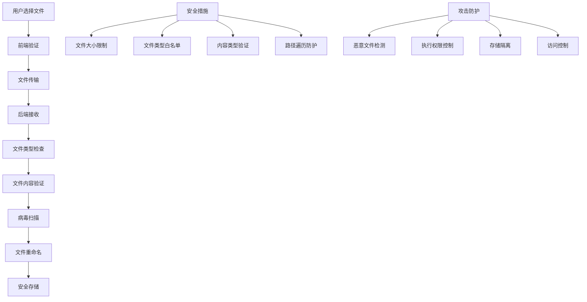

# 文件上传安全

## 🎯 学习目标
- 掌握文件上传安全的基本原则
- 理解文件类型验证和内容检查
- 学会实现安全的文件上传功能
- 了解文件上传攻击防护

## 📚 核心概念

### 文件上传安全架构



### 文件上传安全对比

| 安全措施 | 描述 | 安全性 | 性能影响 |
|----------|------|--------|----------|
| 文件扩展名检查 | 检查文件后缀 | 低 | 无 |
| MIME类型检查 | 检查Content-Type | 中 | 低 |
| 文件头检查 | 检查文件魔数 | 高 | 低 |
| 内容扫描 | 扫描文件内容 | 高 | 中 |
| 病毒扫描 | 杀毒软件检查 | 最高 | 高 |
| 沙箱执行 | 隔离环境执行 | 最高 | 高 |

## 🔧 文件上传安全实现

### 安全文件上传器
```php
<?php
// 1. 安全文件上传器类
class SecureFileUploader {
    private $uploadDir;
    private $maxFileSize;
    private $allowedTypes;
    private $allowedExtensions;
    private $scanForViruses;
    private $renameFiles;
    
    public function __construct($config = []) {
        $this->uploadDir = $config['upload_dir'] ?? 'uploads/';
        $this->maxFileSize = $config['max_file_size'] ?? 5 * 1024 * 1024; // 5MB
        $this->allowedTypes = $config['allowed_types'] ?? ['image/jpeg', 'image/png', 'image/gif'];
        $this->allowedExtensions = $config['allowed_extensions'] ?? ['jpg', 'jpeg', 'png', 'gif'];
        $this->scanForViruses = $config['scan_for_viruses'] ?? false;
        $this->renameFiles = $config['rename_files'] ?? true;
        
        // 确保上传目录存在
        if (!is_dir($this->uploadDir)) {
            mkdir($this->uploadDir, 0755, true);
        }
    }
    
    // 上传文件
    public function upload($file, $options = []) {
        try {
            // 基础验证
            $validation = $this->validateFile($file);
            if (!$validation['valid']) {
                return [
                    'success' => false,
                    'error' => $validation['error']
                ];
            }
            
            // 文件类型验证
            $typeValidation = $this->validateFileType($file);
            if (!$typeValidation['valid']) {
                return [
                    'success' => false,
                    'error' => $typeValidation['error']
                ];
            }
            
            // 文件内容验证
            $contentValidation = $this->validateFileContent($file);
            if (!$contentValidation['valid']) {
                return [
                    'success' => false,
                    'error' => $contentValidation['error']
                ];
            }
            
            // 病毒扫描
            if ($this->scanForViruses) {
                $virusScan = $this->scanForViruses($file);
                if (!$virusScan['clean']) {
                    return [
                        'success' => false,
                        'error' => '文件包含恶意内容'
                    ];
                }
            }
            
            // 生成安全文件名
            $safeFileName = $this->generateSafeFileName($file, $options);
            $targetPath = $this->uploadDir . $safeFileName;
            
            // 移动文件
            if (move_uploaded_file($file['tmp_name'], $targetPath)) {
                // 设置文件权限
                chmod($targetPath, 0644);
                
                // 记录上传日志
                $this->logUpload($file, $safeFileName);
                
                return [
                    'success' => true,
                    'filename' => $safeFileName,
                    'path' => $targetPath,
                    'size' => $file['size'],
                    'type' => $file['type']
                ];
            } else {
                return [
                    'success' => false,
                    'error' => '文件上传失败'
                ];
            }
            
        } catch (Exception $e) {
            return [
                'success' => false,
                'error' => '上传过程中发生错误: ' . $e->getMessage()
            ];
        }
    }
    
    // 验证文件基础信息
    private function validateFile($file) {
        // 检查上传错误
        if ($file['error'] !== UPLOAD_ERR_OK) {
            $errorMessages = [
                UPLOAD_ERR_INI_SIZE => '文件大小超过服务器限制',
                UPLOAD_ERR_FORM_SIZE => '文件大小超过表单限制',
                UPLOAD_ERR_PARTIAL => '文件上传不完整',
                UPLOAD_ERR_NO_FILE => '没有选择文件',
                UPLOAD_ERR_NO_TMP_DIR => '临时目录不存在',
                UPLOAD_ERR_CANT_WRITE => '无法写入文件',
                UPLOAD_ERR_EXTENSION => '文件上传被扩展阻止'
            ];
            
            return [
                'valid' => false,
                'error' => $errorMessages[$file['error']] ?? '未知上传错误'
            ];
        }
        
        // 检查文件大小
        if ($file['size'] > $this->maxFileSize) {
            return [
                'valid' => false,
                'error' => '文件大小超过限制'
            ];
        }
        
        // 检查文件是否为空
        if ($file['size'] === 0) {
            return [
                'valid' => false,
                'error' => '文件为空'
            ];
        }
        
        return ['valid' => true];
    }
    
    // 验证文件类型
    private function validateFileType($file) {
        // 检查MIME类型
        $finfo = finfo_open(FILEINFO_MIME_TYPE);
        $mimeType = finfo_file($finfo, $file['tmp_name']);
        finfo_close($finfo);
        
        if (!in_array($mimeType, $this->allowedTypes)) {
            return [
                'valid' => false,
                'error' => '不允许的文件类型: ' . $mimeType
            ];
        }
        
        // 检查文件扩展名
        $extension = strtolower(pathinfo($file['name'], PATHINFO_EXTENSION));
        if (!in_array($extension, $this->allowedExtensions)) {
            return [
                'valid' => false,
                'error' => '不允许的文件扩展名: ' . $extension
            ];
        }
        
        // 验证MIME类型与扩展名是否匹配
        if (!$this->validateMimeExtensionMatch($mimeType, $extension)) {
            return [
                'valid' => false,
                'error' => '文件类型与扩展名不匹配'
            ];
        }
        
        return ['valid' => true];
    }
    
    // 验证MIME类型与扩展名匹配
    private function validateMimeExtensionMatch($mimeType, $extension) {
        $mimeExtensionMap = [
            'image/jpeg' => ['jpg', 'jpeg'],
            'image/png' => ['png'],
            'image/gif' => ['gif'],
            'image/webp' => ['webp'],
            'application/pdf' => ['pdf'],
            'text/plain' => ['txt'],
            'application/zip' => ['zip'],
            'application/x-rar-compressed' => ['rar']
        ];
        
        if (!isset($mimeExtensionMap[$mimeType])) {
            return false;
        }
        
        return in_array($extension, $mimeExtensionMap[$mimeType]);
    }
    
    // 验证文件内容
    private function validateFileContent($file) {
        $content = file_get_contents($file['tmp_name']);
        
        // 检查文件头（魔数）
        $fileHeader = substr($content, 0, 16);
        $allowedHeaders = [
            'image/jpeg' => "\xFF\xD8\xFF",
            'image/png' => "\x89\x50\x4E\x47",
            'image/gif' => "GIF87a",
            'image/gif' => "GIF89a",
            'application/pdf' => "%PDF",
            'application/zip' => "PK\x03\x04"
        ];
        
        $mimeType = $this->getMimeType($file);
        if (isset($allowedHeaders[$mimeType])) {
            $expectedHeader = $allowedHeaders[$mimeType];
            if (strpos($fileHeader, $expectedHeader) !== 0) {
                return [
                    'valid' => false,
                    'error' => '文件内容与类型不匹配'
                ];
            }
        }
        
        // 检查恶意内容
        $maliciousPatterns = [
            '/<\?php/i',
            '/<script/i',
            '/javascript:/i',
            '/vbscript:/i',
            '/onload=/i',
            '/onerror=/i'
        ];
        
        foreach ($maliciousPatterns as $pattern) {
            if (preg_match($pattern, $content)) {
                return [
                    'valid' => false,
                    'error' => '文件包含恶意内容'
                ];
            }
        }
        
        return ['valid' => true];
    }
    
    // 获取MIME类型
    private function getMimeType($file) {
        $finfo = finfo_open(FILEINFO_MIME_TYPE);
        $mimeType = finfo_file($finfo, $file['tmp_name']);
        finfo_close($finfo);
        return $mimeType;
    }
    
    // 病毒扫描
    private function scanForViruses($file) {
        // 这里应该集成真实的病毒扫描引擎
        // 例如 ClamAV、Sophos 等
        
        // 模拟病毒扫描
        $suspiciousPatterns = [
            '/eval\s*\(/i',
            '/base64_decode/i',
            '/system\s*\(/i',
            '/exec\s*\(/i',
            '/shell_exec/i',
            '/passthru/i'
        ];
        
        $content = file_get_contents($file['tmp_name']);
        
        foreach ($suspiciousPatterns as $pattern) {
            if (preg_match($pattern, $content)) {
                return ['clean' => false];
            }
        }
        
        return ['clean' => true];
    }
    
    // 生成安全文件名
    private function generateSafeFileName($file, $options = []) {
        $extension = strtolower(pathinfo($file['name'], PATHINFO_EXTENSION));
        
        if ($this->renameFiles) {
            // 生成随机文件名
            $randomName = bin2hex(random_bytes(16));
            return $randomName . '.' . $extension;
        } else {
            // 清理原始文件名
            $originalName = pathinfo($file['name'], PATHINFO_FILENAME);
            $cleanName = preg_replace('/[^a-zA-Z0-9._-]/', '', $originalName);
            $cleanName = substr($cleanName, 0, 50); // 限制长度
            
            if (empty($cleanName)) {
                $cleanName = 'file';
            }
            
            return $cleanName . '.' . $extension;
        }
    }
    
    // 记录上传日志
    private function logUpload($file, $filename) {
        $logEntry = [
            'timestamp' => date('Y-m-d H:i:s'),
            'original_name' => $file['name'],
            'filename' => $filename,
            'size' => $file['size'],
            'type' => $file['type'],
            'ip_address' => $_SERVER['REMOTE_ADDR'] ?? 'unknown',
            'user_agent' => $_SERVER['HTTP_USER_AGENT'] ?? 'unknown'
        ];
        
        $logFile = $this->uploadDir . 'upload_log.txt';
        file_put_contents($logFile, json_encode($logEntry) . "\n", FILE_APPEND | LOCK_EX);
    }
    
    // 删除文件
    public function deleteFile($filename) {
        $filePath = $this->uploadDir . $filename;
        
        if (file_exists($filePath)) {
            return unlink($filePath);
        }
        
        return false;
    }
    
    // 获取文件信息
    public function getFileInfo($filename) {
        $filePath = $this->uploadDir . $filename;
        
        if (!file_exists($filePath)) {
            return null;
        }
        
        return [
            'filename' => $filename,
            'path' => $filePath,
            'size' => filesize($filePath),
            'type' => mime_content_type($filePath),
            'modified' => date('Y-m-d H:i:s', filemtime($filePath))
        ];
    }
}

// 2. 文件上传管理器
class FileUploadManager {
    private $uploader;
    private $db;
    
    public function __construct($db, $config = []) {
        $this->uploader = new SecureFileUploader($config);
        $this->db = $db;
    }
    
    // 处理文件上传
    public function handleUpload($file, $userId = null, $metadata = []) {
        // 上传文件
        $uploadResult = $this->uploader->upload($file);
        
        if (!$uploadResult['success']) {
            return $uploadResult;
        }
        
        // 保存文件记录到数据库
        $fileRecord = $this->saveFileRecord($uploadResult, $userId, $metadata);
        
        if ($fileRecord) {
            $uploadResult['file_id'] = $fileRecord['id'];
            $uploadResult['metadata'] = $metadata;
        }
        
        return $uploadResult;
    }
    
    // 保存文件记录
    private function saveFileRecord($uploadResult, $userId, $metadata) {
        $stmt = $this->db->prepare("
            INSERT INTO uploaded_files (
                filename, original_name, file_path, file_size, mime_type, 
                user_id, metadata, created_at
            ) VALUES (?, ?, ?, ?, ?, ?, ?, NOW())
        ");
        
        $result = $stmt->execute([
            $uploadResult['filename'],
            $uploadResult['original_name'] ?? $uploadResult['filename'],
            $uploadResult['path'],
            $uploadResult['size'],
            $uploadResult['type'],
            $userId,
            json_encode($metadata)
        ]);
        
        if ($result) {
            return [
                'id' => $this->db->lastInsertId(),
                'filename' => $uploadResult['filename']
            ];
        }
        
        return null;
    }
    
    // 获取用户文件列表
    public function getUserFiles($userId, $limit = 50, $offset = 0) {
        $stmt = $this->db->prepare("
            SELECT * FROM uploaded_files 
            WHERE user_id = ? 
            ORDER BY created_at DESC 
            LIMIT ? OFFSET ?
        ");
        
        $stmt->execute([$userId, $limit, $offset]);
        return $stmt->fetchAll(PDO::FETCH_ASSOC);
    }
    
    // 删除文件记录
    public function deleteFile($fileId, $userId = null) {
        // 获取文件信息
        $stmt = $this->db->prepare("SELECT * FROM uploaded_files WHERE id = ?");
        $stmt->execute([$fileId]);
        $file = $stmt->fetch(PDO::FETCH_ASSOC);
        
        if (!$file) {
            return ['success' => false, 'error' => '文件不存在'];
        }
        
        // 检查权限
        if ($userId && $file['user_id'] != $userId) {
            return ['success' => false, 'error' => '无权限删除此文件'];
        }
        
        // 删除物理文件
        if ($this->uploader->deleteFile($file['filename'])) {
            // 删除数据库记录
            $stmt = $this->db->prepare("DELETE FROM uploaded_files WHERE id = ?");
            $stmt->execute([$fileId]);
            
            return ['success' => true, 'message' => '文件删除成功'];
        } else {
            return ['success' => false, 'error' => '文件删除失败'];
        }
    }
    
    // 获取文件统计
    public function getFileStats($userId = null) {
        $whereClause = $userId ? "WHERE user_id = ?" : "";
        $params = $userId ? [$userId] : [];
        
        $stmt = $this->db->prepare("
            SELECT 
                COUNT(*) as total_files,
                SUM(file_size) as total_size,
                AVG(file_size) as avg_size,
                MAX(created_at) as last_upload
            FROM uploaded_files 
            $whereClause
        ");
        
        $stmt->execute($params);
        return $stmt->fetch(PDO::FETCH_ASSOC);
    }
}

// 使用示例
echo "=== 文件上传安全示例 ===\n";

try {
    // 创建上传器配置
    $uploadConfig = [
        'upload_dir' => 'uploads/',
        'max_file_size' => 2 * 1024 * 1024, // 2MB
        'allowed_types' => ['image/jpeg', 'image/png', 'image/gif'],
        'allowed_extensions' => ['jpg', 'jpeg', 'png', 'gif'],
        'scan_for_viruses' => true,
        'rename_files' => true
    ];
    
    // 创建安全文件上传器
    $uploader = new SecureFileUploader($uploadConfig);
    
    // 模拟文件上传
    $testFiles = [
        [
            'name' => 'test.jpg',
            'type' => 'image/jpeg',
            'tmp_name' => '/tmp/test.jpg',
            'error' => UPLOAD_ERR_OK,
            'size' => 1024
        ],
        [
            'name' => 'malicious.php',
            'type' => 'application/x-php',
            'tmp_name' => '/tmp/malicious.php',
            'error' => UPLOAD_ERR_OK,
            'size' => 512
        ]
    ];
    
    echo "文件上传测试:\n";
    foreach ($testFiles as $file) {
        echo "测试文件: {$file['name']}\n";
        
        // 模拟文件内容
        if ($file['name'] === 'test.jpg') {
            file_put_contents($file['tmp_name'], "\xFF\xD8\xFF" . str_repeat('x', 1021));
        } else {
            file_put_contents($file['tmp_name'], '<?php system($_GET["cmd"]); ?>');
        }
        
        $result = $uploader->upload($file);
        
        if ($result['success']) {
            echo "  上传成功: {$result['filename']}\n";
        } else {
            echo "  上传失败: {$result['error']}\n";
        }
        
        // 清理临时文件
        if (file_exists($file['tmp_name'])) {
            unlink($file['tmp_name']);
        }
        
        echo "\n";
    }
    
    // 文件管理器测试
    $db = new PDO('sqlite::memory:');
    $db->exec("
        CREATE TABLE uploaded_files (
            id INTEGER PRIMARY KEY AUTOINCREMENT,
            filename VARCHAR(255) NOT NULL,
            original_name VARCHAR(255),
            file_path VARCHAR(500) NOT NULL,
            file_size INTEGER NOT NULL,
            mime_type VARCHAR(100),
            user_id INTEGER,
            metadata TEXT,
            created_at DATETIME
        )
    ");
    
    $manager = new FileUploadManager($db, $uploadConfig);
    
    // 获取文件统计
    $stats = $manager->getFileStats();
    echo "文件统计:\n";
    echo "  总文件数: {$stats['total_files']}\n";
    echo "  总大小: {$stats['total_size']} bytes\n";
    echo "  平均大小: " . round($stats['avg_size'], 2) . " bytes\n";
    echo "  最后上传: {$stats['last_upload']}\n";
    
} catch (Exception $e) {
    echo "错误: " . $e->getMessage() . "\n";
}
?>
```

## 📊 最佳实践

### 文件上传安全最佳实践
```php
<?php
// 文件上传安全最佳实践

class FileUploadSecurityBestPractices {
    // 1. 安全配置
    public static function getSecurityConfiguration() {
        return [
            '生产环境' => [
                'upload_dir' => '/var/www/uploads/',
                'max_file_size' => 5 * 1024 * 1024, // 5MB
                'allowed_types' => ['image/jpeg', 'image/png', 'image/gif'],
                'allowed_extensions' => ['jpg', 'jpeg', 'png', 'gif'],
                'scan_for_viruses' => true,
                'rename_files' => true,
                'chmod' => 0644,
                'quarantine_suspicious' => true
            ],
            '开发环境' => [
                'upload_dir' => 'uploads/',
                'max_file_size' => 10 * 1024 * 1024, // 10MB
                'allowed_types' => ['image/jpeg', 'image/png', 'image/gif', 'text/plain'],
                'allowed_extensions' => ['jpg', 'jpeg', 'png', 'gif', 'txt'],
                'scan_for_viruses' => false,
                'rename_files' => false,
                'chmod' => 0644,
                'quarantine_suspicious' => false
            ]
        ];
    }
    
    // 2. 文件类型安全
    public static function getFileTypeSecurity() {
        return [
            '安全文件类型' => [
                'image/jpeg' => ['jpg', 'jpeg'],
                'image/png' => ['png'],
                'image/gif' => ['gif'],
                'image/webp' => ['webp'],
                'application/pdf' => ['pdf'],
                'text/plain' => ['txt'],
                'application/zip' => ['zip']
            ],
            '危险文件类型' => [
                'application/x-php' => 'PHP脚本',
                'application/x-executable' => '可执行文件',
                'application/x-msdownload' => 'Windows可执行文件',
                'application/x-sh' => 'Shell脚本',
                'text/html' => 'HTML文件',
                'application/javascript' => 'JavaScript文件'
            ],
            '验证方法' => [
                'MIME类型检查' => '检查Content-Type头',
                '文件扩展名检查' => '检查文件后缀',
                '文件头检查' => '检查文件魔数',
                '内容扫描' => '扫描文件内容'
            ]
        ];
    }
    
    // 3. 攻击防护
    public static function getAttackProtection() {
        return [
            '路径遍历攻击' => [
                '问题' => '使用../等字符访问系统文件',
                '防护' => '过滤危险字符，限制上传目录',
                '实现' => 'preg_replace(\'/\.\.\/\', \'\', $filename)'
            ],
            '文件包含攻击' => [
                '问题' => '上传PHP文件并执行',
                '防护' => '禁止PHP文件上传，设置执行权限',
                '实现' => 'chmod($file, 0644)'
            ],
            '恶意文件上传' => [
                '问题' => '上传包含恶意代码的文件',
                '防护' => '内容扫描，病毒检测',
                '实现' => '扫描文件内容，检查危险模式'
            ],
            '拒绝服务攻击' => [
                '问题' => '上传大文件消耗服务器资源',
                '防护' => '限制文件大小，设置超时',
                '实现' => 'max_file_size, upload_max_filesize'
            ]
        ];
    }
    
    // 4. 监控和日志
    public static function getMonitoringAndLogging() {
        return [
            '上传日志' => [
                '记录内容' => '文件名、大小、类型、IP地址、时间',
                '存储位置' => '数据库或日志文件',
                '保留期限' => '90天',
                '分析指标' => '上传频率、文件类型分布、异常行为'
            ],
            '安全监控' => [
                '异常检测' => '大量上传、可疑文件类型、重复IP',
                '告警机制' => '邮件通知、系统日志、监控面板',
                '响应措施' => '临时限制、IP封禁、人工审核'
            ],
            '性能监控' => [
                '上传速度' => '监控上传处理时间',
                '存储使用' => '监控磁盘空间使用',
                '系统负载' => '监控CPU和内存使用'
            ]
        ];
    }
}

// 使用示例
echo "=== 文件上传安全最佳实践示例 ===\n";

try {
    // 安全配置
    $configs = FileUploadSecurityBestPractices::getSecurityConfiguration();
    echo "安全配置:\n";
    foreach ($configs as $env => $config) {
        echo "  $env:\n";
        foreach ($config as $key => $value) {
            if (is_bool($value)) {
                $value = $value ? 'true' : 'false';
            } elseif (is_int($value)) {
                $value = number_format($value) . ' bytes';
            }
            echo "    $key: $value\n";
        }
        echo "\n";
    }
    
    // 文件类型安全
    $fileTypeSecurity = FileUploadSecurityBestPractices::getFileTypeSecurity();
    echo "文件类型安全:\n";
    foreach ($fileTypeSecurity as $category => $types) {
        echo "  $category:\n";
        foreach ($types as $type => $info) {
            if (is_array($info)) {
                echo "    $type: " . implode(', ', $info) . "\n";
            } else {
                echo "    $type: $info\n";
            }
        }
        echo "\n";
    }
    
    // 攻击防护
    $attackProtection = FileUploadSecurityBestPractices::getAttackProtection();
    echo "攻击防护:\n";
    foreach ($attackProtection as $attack => $info) {
        echo "  $attack:\n";
        foreach ($info as $key => $value) {
            echo "    $key: $value\n";
        }
        echo "\n";
    }
    
    // 监控和日志
    $monitoring = FileUploadSecurityBestPractices::getMonitoringAndLogging();
    echo "监控和日志:\n";
    foreach ($monitoring as $category => $info) {
        echo "  $category:\n";
        foreach ($info as $key => $value) {
            if (is_array($value)) {
                echo "    $key:\n";
                foreach ($value as $subKey => $subValue) {
                    echo "      $subKey: $subValue\n";
                }
            } else {
                echo "    $key: $value\n";
            }
        }
        echo "\n";
    }
    
} catch (Exception $e) {
    echo "错误: " . $e->getMessage() . "\n";
}
?>
```

## 🎓 学习建议

### 费曼学习法应用
1. **选择概念**: 选择文件上传安全中的核心概念
2. **简化解释**: 用简单语言解释文件上传安全的重要性
3. **识别盲点**: 发现理解不深入的地方
4. **重新学习**: 针对盲点进行深入学习

### 刻意练习重点
1. **文件验证**: 掌握文件类型和内容验证技术
2. **安全存储**: 理解文件的安全存储方法
3. **攻击防护**: 了解常见攻击方式和防护措施
4. **监控日志**: 学会建立有效的监控和日志系统

## 🔗 相关链接
- [[01-SQL注入防护|SQL注入防护]]
- [[02-XSS攻击防护|XSS攻击防护]]
- [[03-CSRF防护|CSRF防护]]
- [[04-输入验证与过滤|输入验证与过滤]]
- [[05-密码安全|密码安全]]
- [[07-安全编程最佳实践|安全编程最佳实践]]
- [[08-安全审计清单|安全审计清单]]
