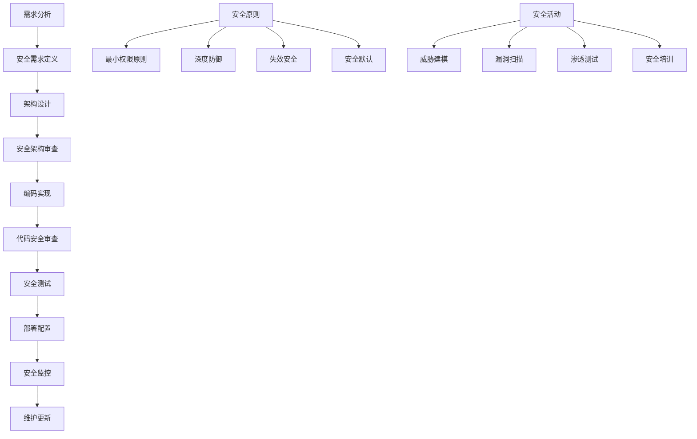

# 安全编程最佳实践

## 🎯 学习目标
- 掌握安全编程的基本原则和方法
- 理解安全开发生命周期(SDLC)
- 学会实施安全编码规范
- 了解安全测试和审计技术

## 📚 核心概念

### 安全开发生命周期



### 安全编程原则对比

| 安全原则 | 描述 | 重要性 | 实施难度 |
|----------|------|--------|----------|
| 最小权限 | 只授予必要的权限 | 高 | 中 |
| 深度防御 | 多层安全防护 | 高 | 高 |
| 失效安全 | 失败时保持安全状态 | 高 | 中 |
| 安全默认 | 默认配置是安全的 | 高 | 低 |
| 输入验证 | 验证所有输入数据 | 高 | 中 |
| 输出编码 | 编码所有输出数据 | 高 | 中 |
| 错误处理 | 安全处理错误信息 | 中 | 低 |
| 日志记录 | 记录安全相关事件 | 中 | 低 |

## 🔧 安全编程实现

### 安全编码框架
```php
<?php
// 1. 安全编码框架
class SecureCodingFramework {
    private $config;
    private $logger;
    private $validator;
    
    public function __construct($config = []) {
        $this->config = array_merge([
            'enable_csrf_protection' => true,
            'enable_xss_protection' => true,
            'enable_sql_injection_protection' => true,
            'enable_input_validation' => true,
            'enable_output_encoding' => true,
            'enable_error_handling' => true,
            'enable_logging' => true,
            'log_level' => 'INFO'
        ], $config);
        
        $this->logger = new SecurityLogger();
        $this->validator = new InputValidator();
    }
    
    // 安全初始化
    public function secureInit() {
        // 设置安全头
        $this->setSecurityHeaders();
        
        // 配置错误处理
        if ($this->config['enable_error_handling']) {
            $this->configureErrorHandling();
        }
        
        // 初始化会话安全
        $this->initSecureSession();
        
        // 设置时区
        date_default_timezone_set('UTC');
        
        // 禁用危险函数
        $this->disableDangerousFunctions();
    }
    
    // 设置安全头
    private function setSecurityHeaders() {
        // 防止XSS攻击
        header('X-XSS-Protection: 1; mode=block');
        
        // 防止点击劫持
        header('X-Frame-Options: DENY');
        
        // 防止MIME类型嗅探
        header('X-Content-Type-Options: nosniff');
        
        // 强制HTTPS
        header('Strict-Transport-Security: max-age=31536000; includeSubDomains');
        
        // 内容安全策略
        header("Content-Security-Policy: default-src 'self'; script-src 'self' 'unsafe-inline'; style-src 'self' 'unsafe-inline'");
        
        // 引用者策略
        header('Referrer-Policy: strict-origin-when-cross-origin');
    }
    
    // 配置错误处理
    private function configureErrorHandling() {
        // 生产环境不显示错误
        if ($this->isProduction()) {
            error_reporting(0);
            ini_set('display_errors', 0);
            ini_set('log_errors', 1);
        } else {
            error_reporting(E_ALL);
            ini_set('display_errors', 1);
        }
        
        // 设置错误处理函数
        set_error_handler([$this, 'handleError']);
        set_exception_handler([$this, 'handleException']);
        register_shutdown_function([$this, 'handleShutdown']);
    }
    
    // 初始化安全会话
    private function initSecureSession() {
        // 设置会话安全参数
        ini_set('session.cookie_httponly', 1);
        ini_set('session.cookie_secure', $this->isHttps() ? 1 : 0);
        ini_set('session.use_strict_mode', 1);
        ini_set('session.cookie_samesite', 'Strict');
        
        // 生成安全的会话ID
        if (session_status() === PHP_SESSION_NONE) {
            session_start();
        }
        
        // 验证会话ID
        if (!$this->validateSessionId()) {
            session_regenerate_id(true);
        }
    }
    
    // 禁用危险函数
    private function disableDangerousFunctions() {
        $dangerousFunctions = [
            'exec', 'system', 'shell_exec', 'passthru',
            'eval', 'assert', 'create_function',
            'file_get_contents', 'file_put_contents',
            'fopen', 'fwrite', 'fread'
        ];
        
        foreach ($dangerousFunctions as $func) {
            if (function_exists($func)) {
                $this->logger->logWarning("危险函数 $func 可用");
            }
        }
    }
    
    // 错误处理
    public function handleError($severity, $message, $file, $line) {
        $error = [
            'type' => 'PHP Error',
            'severity' => $severity,
            'message' => $message,
            'file' => $file,
            'line' => $line,
            'timestamp' => date('Y-m-d H:i:s'),
            'ip' => $_SERVER['REMOTE_ADDR'] ?? 'unknown'
        ];
        
        $this->logger->logError($error);
        
        if ($this->isProduction()) {
            // 生产环境显示通用错误页面
            $this->showGenericErrorPage();
        } else {
            // 开发环境显示详细错误
            echo "<pre>Error: $message in $file on line $line</pre>";
        }
        
        return true;
    }
    
    // 异常处理
    public function handleException($exception) {
        $error = [
            'type' => 'PHP Exception',
            'message' => $exception->getMessage(),
            'file' => $exception->getFile(),
            'line' => $exception->getLine(),
            'trace' => $exception->getTraceAsString(),
            'timestamp' => date('Y-m-d H:i:s'),
            'ip' => $_SERVER['REMOTE_ADDR'] ?? 'unknown'
        ];
        
        $this->logger->logError($error);
        
        if ($this->isProduction()) {
            $this->showGenericErrorPage();
        } else {
            echo "<pre>Exception: " . $exception->getMessage() . "</pre>";
        }
    }
    
    // 关闭处理
    public function handleShutdown() {
        $error = error_get_last();
        if ($error && $error['type'] === E_ERROR) {
            $this->handleError($error['type'], $error['message'], $error['file'], $error['line']);
        }
    }
    
    // 验证会话ID
    private function validateSessionId() {
        $sessionId = session_id();
        
        // 检查会话ID长度
        if (strlen($sessionId) < 32) {
            return false;
        }
        
        // 检查会话ID格式
        if (!preg_match('/^[a-zA-Z0-9]+$/', $sessionId)) {
            return false;
        }
        
        return true;
    }
    
    // 检查是否为生产环境
    private function isProduction() {
        return $this->config['environment'] === 'production';
    }
    
    // 检查是否为HTTPS
    private function isHttps() {
        return isset($_SERVER['HTTPS']) && $_SERVER['HTTPS'] === 'on';
    }
    
    // 显示通用错误页面
    private function showGenericErrorPage() {
        http_response_code(500);
        echo "<!DOCTYPE html><html><head><title>系统错误</title></head><body><h1>系统暂时不可用</h1><p>请稍后再试。</p></body></html>";
        exit;
    }
}

// 2. 安全日志记录器
class SecurityLogger {
    private $logFile;
    private $logLevel;
    
    public function __construct($logFile = 'security.log', $logLevel = 'INFO') {
        $this->logFile = $logFile;
        $this->logLevel = $logLevel;
    }
    
    // 记录信息日志
    public function logInfo($message, $context = []) {
        $this->log('INFO', $message, $context);
    }
    
    // 记录警告日志
    public function logWarning($message, $context = []) {
        $this->log('WARNING', $message, $context);
    }
    
    // 记录错误日志
    public function logError($message, $context = []) {
        $this->log('ERROR', $message, $context);
    }
    
    // 记录安全事件
    public function logSecurityEvent($event, $details = []) {
        $logEntry = [
            'timestamp' => date('Y-m-d H:i:s'),
            'level' => 'SECURITY',
            'event' => $event,
            'details' => $details,
            'ip' => $_SERVER['REMOTE_ADDR'] ?? 'unknown',
            'user_agent' => $_SERVER['HTTP_USER_AGENT'] ?? 'unknown',
            'request_uri' => $_SERVER['REQUEST_URI'] ?? 'unknown'
        ];
        
        $this->writeLog($logEntry);
    }
    
    // 记录日志
    private function log($level, $message, $context = []) {
        $logEntry = [
            'timestamp' => date('Y-m-d H:i:s'),
            'level' => $level,
            'message' => $message,
            'context' => $context,
            'ip' => $_SERVER['REMOTE_ADDR'] ?? 'unknown'
        ];
        
        $this->writeLog($logEntry);
    }
    
    // 写入日志文件
    private function writeLog($logEntry) {
        $logLine = json_encode($logEntry) . "\n";
        file_put_contents($this->logFile, $logLine, FILE_APPEND | LOCK_EX);
    }
    
    // 获取安全事件统计
    public function getSecurityStats($days = 7) {
        $stats = [
            'total_events' => 0,
            'events_by_type' => [],
            'events_by_ip' => [],
            'recent_events' => []
        ];
        
        if (!file_exists($this->logFile)) {
            return $stats;
        }
        
        $lines = file($this->logFile, FILE_IGNORE_NEW_LINES);
        $cutoffDate = date('Y-m-d H:i:s', strtotime("-$days days"));
        
        foreach ($lines as $line) {
            $entry = json_decode($line, true);
            if (!$entry) continue;
            
            if ($entry['timestamp'] < $cutoffDate) continue;
            
            $stats['total_events']++;
            
            // 按类型统计
            $type = $entry['event'] ?? $entry['level'];
            $stats['events_by_type'][$type] = ($stats['events_by_type'][$type] ?? 0) + 1;
            
            // 按IP统计
            $ip = $entry['ip'];
            $stats['events_by_ip'][$ip] = ($stats['events_by_ip'][$ip] ?? 0) + 1;
            
            // 最近事件
            if (count($stats['recent_events']) < 10) {
                $stats['recent_events'][] = $entry;
            }
        }
        
        return $stats;
    }
}

// 3. 输入验证器
class InputValidator {
    private $rules;
    
    public function __construct() {
        $this->rules = [
            'required' => function($value) { return !empty($value); },
            'email' => function($value) { return filter_var($value, FILTER_VALIDATE_EMAIL) !== false; },
            'url' => function($value) { return filter_var($value, FILTER_VALIDATE_URL) !== false; },
            'integer' => function($value) { return filter_var($value, FILTER_VALIDATE_INT) !== false; },
            'float' => function($value) { return filter_var($value, FILTER_VALIDATE_FLOAT) !== false; },
            'alphanumeric' => function($value) { return ctype_alnum($value); },
            'numeric' => function($value) { return is_numeric($value); }
        ];
    }
    
    // 验证输入
    public function validate($data, $rules) {
        $errors = [];
        
        foreach ($rules as $field => $fieldRules) {
            $value = $data[$field] ?? null;
            
            foreach ($fieldRules as $rule => $params) {
                if (isset($this->rules[$rule])) {
                    $validator = $this->rules[$rule];
                    
                    if (is_array($params)) {
                        $isValid = call_user_func_array($validator, array_merge([$value], $params));
                    } else {
                        $isValid = $validator($value);
                    }
                    
                    if (!$isValid) {
                        $errors[$field][] = "字段 $field 验证失败: $rule";
                    }
                }
            }
        }
        
        return [
            'valid' => empty($errors),
            'errors' => $errors
        ];
    }
    
    // 清理输入
    public function sanitize($data) {
        $sanitized = [];
        
        foreach ($data as $key => $value) {
            if (is_string($value)) {
                // 移除危险字符
                $value = preg_replace('/[<>"\']/', '', $value);
                
                // 转义特殊字符
                $value = htmlspecialchars($value, ENT_QUOTES, 'UTF-8');
                
                // 移除控制字符
                $value = preg_replace('/[\x00-\x08\x0B\x0C\x0E-\x1F\x7F]/', '', $value);
            }
            
            $sanitized[$key] = $value;
        }
        
        return $sanitized;
    }
}

// 使用示例
echo "=== 安全编程框架示例 ===\n";

try {
    // 创建安全编码框架
    $framework = new SecureCodingFramework([
        'environment' => 'development',
        'enable_csrf_protection' => true,
        'enable_xss_protection' => true,
        'enable_sql_injection_protection' => true
    ]);
    
    // 安全初始化
    $framework->secureInit();
    
    // 创建输入验证器
    $validator = new InputValidator();
    
    // 测试输入验证
    $testData = [
        'username' => 'testuser',
        'email' => 'test@example.com',
        'age' => '25'
    ];
    
    $validationRules = [
        'username' => ['required', 'alphanumeric'],
        'email' => ['required', 'email'],
        'age' => ['required', 'integer']
    ];
    
    $validationResult = $validator->validate($testData, $validationRules);
    
    echo "输入验证结果:\n";
    if ($validationResult['valid']) {
        echo "  验证通过\n";
    } else {
        echo "  验证失败:\n";
        foreach ($validationResult['errors'] as $field => $errors) {
            echo "    $field: " . implode(', ', $errors) . "\n";
        }
    }
    
    // 测试输入清理
    $dirtyData = [
        'name' => '<script>alert("XSS")</script>John',
        'comment' => 'Hello "World" & Friends'
    ];
    
    $cleanData = $validator->sanitize($dirtyData);
    
    echo "\n输入清理结果:\n";
    foreach ($cleanData as $key => $value) {
        echo "  $key: $value\n";
    }
    
    // 测试安全日志
    $logger = new SecurityLogger();
    $logger->logInfo('用户登录成功', ['user_id' => 123]);
    $logger->logWarning('可疑登录尝试', ['ip' => '192.168.1.100']);
    $logger->logSecurityEvent('SQL注入尝试', ['query' => "'; DROP TABLE users; --"]);
    
    echo "\n安全日志已记录\n";
    
} catch (Exception $e) {
    echo "错误: " . $e->getMessage() . "\n";
}
?>
```

### 安全测试框架
```php
<?php
// 1. 安全测试框架
class SecurityTestingFramework {
    private $testResults;
    private $logger;
    
    public function __construct() {
        $this->testResults = [];
        $this->logger = new SecurityLogger();
    }
    
    // 运行所有安全测试
    public function runAllTests($targetUrl) {
        $tests = [
            'SQL注入测试' => [$this, 'testSqlInjection'],
            'XSS测试' => [$this, 'testXss'],
            'CSRF测试' => [$this, 'testCsrf'],
            '文件上传测试' => [$this, 'testFileUpload'],
            '认证绕过测试' => [$this, 'testAuthenticationBypass'],
            '权限提升测试' => [$this, 'testPrivilegeEscalation'],
            '信息泄露测试' => [$this, 'testInformationDisclosure']
        ];
        
        foreach ($tests as $testName => $testMethod) {
            echo "运行 $testName...\n";
            $result = $testMethod($targetUrl);
            $this->testResults[$testName] = $result;
            
            if ($result['vulnerable']) {
                $this->logger->logSecurityEvent("安全测试发现漏洞", [
                    'test' => $testName,
                    'severity' => $result['severity'],
                    'details' => $result['details']
                ]);
            }
        }
        
        return $this->generateReport();
    }
    
    // SQL注入测试
    public function testSqlInjection($targetUrl) {
        $payloads = [
            "' OR '1'='1",
            "'; DROP TABLE users; --",
            "' UNION SELECT * FROM users --",
            "1' AND (SELECT COUNT(*) FROM information_schema.tables) > 0 --"
        ];
        
        $vulnerable = false;
        $details = [];
        
        foreach ($payloads as $payload) {
            $response = $this->sendRequest($targetUrl, ['id' => $payload]);
            
            if ($this->detectSqlError($response)) {
                $vulnerable = true;
                $details[] = "SQL注入漏洞: $payload";
            }
        }
        
        return [
            'vulnerable' => $vulnerable,
            'severity' => $vulnerable ? 'HIGH' : 'NONE',
            'details' => $details
        ];
    }
    
    // XSS测试
    public function testXss($targetUrl) {
        $payloads = [
            '<script>alert("XSS")</script>',
            '',
            'javascript:alert("XSS")',
            '<svg onload=alert("XSS")>'
        ];
        
        $vulnerable = false;
        $details = [];
        
        foreach ($payloads as $payload) {
            $response = $this->sendRequest($targetUrl, ['name' => $payload]);
            
            if (strpos($response, $payload) !== false) {
                $vulnerable = true;
                $details[] = "XSS漏洞: $payload";
            }
        }
        
        return [
            'vulnerable' => $vulnerable,
            'severity' => $vulnerable ? 'MEDIUM' : 'NONE',
            'details' => $details
        ];
    }
    
    // CSRF测试
    public function testCsrf($targetUrl) {
        // 检查是否存在CSRF令牌
        $response = $this->sendRequest($targetUrl);
        
        $hasCsrfToken = strpos($response, 'csrf_token') !== false || 
                        strpos($response, '_token') !== false;
        
        return [
            'vulnerable' => !$hasCsrfToken,
            'severity' => !$hasCsrfToken ? 'MEDIUM' : 'NONE',
            'details' => $hasCsrfToken ? ['CSRF保护已启用'] : ['缺少CSRF保护']
        ];
    }
    
    // 文件上传测试
    public function testFileUpload($targetUrl) {
        $maliciousFiles = [
            'test.php' => '<?php system($_GET["cmd"]); ?>',
            'test.jsp' => '<% Runtime.getRuntime().exec("calc"); %>',
            'test.asp' => '<% Response.Write("Hello World") %>'
        ];
        
        $vulnerable = false;
        $details = [];
        
        foreach ($maliciousFiles as $filename => $content) {
            $response = $this->uploadFile($targetUrl, $filename, $content);
            
            if ($response['success']) {
                $vulnerable = true;
                $details[] = "文件上传漏洞: $filename";
            }
        }
        
        return [
            'vulnerable' => $vulnerable,
            'severity' => $vulnerable ? 'HIGH' : 'NONE',
            'details' => $details
        ];
    }
    
    // 认证绕过测试
    public function testAuthenticationBypass($targetUrl) {
        $bypassAttempts = [
            'admin' => 'admin',
            'admin' => '',
            'admin' => 'password',
            'admin' => '123456',
            '' => '',
            'admin' => 'admin\' OR \'1\'=\'1'
        ];
        
        $vulnerable = false;
        $details = [];
        
        foreach ($bypassAttempts as $username => $password) {
            $response = $this->sendRequest($targetUrl . '/login', [
                'username' => $username,
                'password' => $password
            ]);
            
            if ($this->detectSuccessfulLogin($response)) {
                $vulnerable = true;
                $details[] = "认证绕过: $username:$password";
            }
        }
        
        return [
            'vulnerable' => $vulnerable,
            'severity' => $vulnerable ? 'HIGH' : 'NONE',
            'details' => $details
        ];
    }
    
    // 权限提升测试
    public function testPrivilegeEscalation($targetUrl) {
        // 测试普通用户访问管理员功能
        $adminEndpoints = [
            '/admin/users',
            '/admin/settings',
            '/admin/logs',
            '/admin/backup'
        ];
        
        $vulnerable = false;
        $details = [];
        
        foreach ($adminEndpoints as $endpoint) {
            $response = $this->sendRequest($targetUrl . $endpoint);
            
            if ($this->detectAdminAccess($response)) {
                $vulnerable = true;
                $details[] = "权限提升漏洞: $endpoint";
            }
        }
        
        return [
            'vulnerable' => $vulnerable,
            'severity' => $vulnerable ? 'HIGH' : 'NONE',
            'details' => $details
        ];
    }
    
    // 信息泄露测试
    public function testInformationDisclosure($targetUrl) {
        $sensitiveEndpoints = [
            '/.env',
            '/config.php',
            '/phpinfo.php',
            '/.git/config',
            '/backup.sql',
            '/error_log'
        ];
        
        $vulnerable = false;
        $details = [];
        
        foreach ($sensitiveEndpoints as $endpoint) {
            $response = $this->sendRequest($targetUrl . $endpoint);
            
            if ($this->detectSensitiveInfo($response)) {
                $vulnerable = true;
                $details[] = "信息泄露: $endpoint";
            }
        }
        
        return [
            'vulnerable' => $vulnerable,
            'severity' => $vulnerable ? 'MEDIUM' : 'NONE',
            'details' => $details
        ];
    }
    
    // 发送HTTP请求
    private function sendRequest($url, $data = []) {
        $ch = curl_init();
        curl_setopt($ch, CURLOPT_URL, $url);
        curl_setopt($ch, CURLOPT_RETURNTRANSFER, true);
        curl_setopt($ch, CURLOPT_FOLLOWLOCATION, true);
        curl_setopt($ch, CURLOPT_TIMEOUT, 10);
        
        if (!empty($data)) {
            curl_setopt($ch, CURLOPT_POST, true);
            curl_setopt($ch, CURLOPT_POSTFIELDS, http_build_query($data));
        }
        
        $response = curl_exec($ch);
        $httpCode = curl_getinfo($ch, CURLINFO_HTTP_CODE);
        curl_close($ch);
        
        return $response;
    }
    
    // 上传文件
    private function uploadFile($url, $filename, $content) {
        $ch = curl_init();
        curl_setopt($ch, CURLOPT_URL, $url . '/upload');
        curl_setopt($ch, CURLOPT_RETURNTRANSFER, true);
        curl_setopt($ch, CURLOPT_POST, true);
        
        $postData = [
            'file' => new CURLFile($content, 'application/octet-stream', $filename)
        ];
        
        curl_setopt($ch, CURLOPT_POSTFIELDS, $postData);
        
        $response = curl_exec($ch);
        $httpCode = curl_getinfo($ch, CURLINFO_HTTP_CODE);
        curl_close($ch);
        
        return [
            'success' => $httpCode === 200,
            'response' => $response
        ];
    }
    
    // 检测SQL错误
    private function detectSqlError($response) {
        $errorPatterns = [
            'mysql_fetch_array',
            'Warning: mysql_',
            'You have an error in your SQL syntax',
            'mysql_num_rows()',
            'mysql_query()',
            'mysql_connect()'
        ];
        
        foreach ($errorPatterns as $pattern) {
            if (stripos($response, $pattern) !== false) {
                return true;
            }
        }
        
        return false;
    }
    
    // 检测成功登录
    private function detectSuccessfulLogin($response) {
        $successPatterns = [
            'Welcome',
            'Dashboard',
            'Logout',
            'Profile',
            'success'
        ];
        
        foreach ($successPatterns as $pattern) {
            if (stripos($response, $pattern) !== false) {
                return true;
            }
        }
        
        return false;
    }
    
    // 检测管理员访问
    private function detectAdminAccess($response) {
        $adminPatterns = [
            'Admin Panel',
            'User Management',
            'System Settings',
            'Administrator'
        ];
        
        foreach ($adminPatterns as $pattern) {
            if (stripos($response, $pattern) !== false) {
                return true;
            }
        }
        
        return false;
    }
    
    // 检测敏感信息
    private function detectSensitiveInfo($response) {
        $sensitivePatterns = [
            'password',
            'database',
            'config',
            'secret',
            'key',
            'token'
        ];
        
        foreach ($sensitivePatterns as $pattern) {
            if (stripos($response, $pattern) !== false) {
                return true;
            }
        }
        
        return false;
    }
    
    // 生成测试报告
    private function generateReport() {
        $report = [
            'summary' => [
                'total_tests' => count($this->testResults),
                'vulnerable_tests' => 0,
                'high_severity' => 0,
                'medium_severity' => 0,
                'low_severity' => 0
            ],
            'details' => $this->testResults
        ];
        
        foreach ($this->testResults as $result) {
            if ($result['vulnerable']) {
                $report['summary']['vulnerable_tests']++;
                
                switch ($result['severity']) {
                    case 'HIGH':
                        $report['summary']['high_severity']++;
                        break;
                    case 'MEDIUM':
                        $report['summary']['medium_severity']++;
                        break;
                    case 'LOW':
                        $report['summary']['low_severity']++;
                        break;
                }
            }
        }
        
        return $report;
    }
}

// 使用示例
echo "=== 安全测试框架示例 ===\n";

try {
    // 创建安全测试框架
    $tester = new SecurityTestingFramework();
    
    // 运行安全测试
    $targetUrl = 'http://localhost/test-app';
    $report = $tester->runAllTests($targetUrl);
    
    // 显示测试报告
    echo "安全测试报告:\n";
    echo "总测试数: {$report['summary']['total_tests']}\n";
    echo "发现漏洞: {$report['summary']['vulnerable_tests']}\n";
    echo "高危漏洞: {$report['summary']['high_severity']}\n";
    echo "中危漏洞: {$report['summary']['medium_severity']}\n";
    echo "低危漏洞: {$report['summary']['low_severity']}\n\n";
    
    // 显示详细结果
    foreach ($report['details'] as $testName => $result) {
        echo "$testName:\n";
        echo "  状态: " . ($result['vulnerable'] ? '存在漏洞' : '安全') . "\n";
        echo "  严重程度: {$result['severity']}\n";
        
        if (!empty($result['details'])) {
            echo "  详情:\n";
            foreach ($result['details'] as $detail) {
                echo "    - $detail\n";
            }
        }
        echo "\n";
    }
    
} catch (Exception $e) {
    echo "错误: " . $e->getMessage() . "\n";
}
?>
```

## 📊 最佳实践

### 安全编程最佳实践
```php
<?php
// 安全编程最佳实践

class SecurityBestPractices {
    // 1. 安全编码规范
    public static function getCodingStandards() {
        return [
            '输入验证' => [
                '验证所有输入' => '使用白名单验证，拒绝所有未明确允许的输入',
                '验证数据类型' => '确保输入符合预期的数据类型和格式',
                '验证数据长度' => '限制输入数据的最大长度',
                '验证数据范围' => '检查数值是否在允许的范围内'
            ],
            '输出编码' => [
                'HTML编码' => '使用htmlspecialchars()编码HTML输出',
                'URL编码' => '使用urlencode()编码URL参数',
                'JSON编码' => '使用json_encode()编码JSON数据',
                'SQL编码' => '使用预处理语句防止SQL注入'
            ],
            '错误处理' => [
                '不泄露敏感信息' => '生产环境不显示详细错误信息',
                '记录错误日志' => '记录所有错误到安全日志文件',
                '统一错误处理' => '使用统一的错误处理机制',
                '错误恢复' => '实现安全的错误恢复机制'
            ],
            '会话管理' => [
                '安全会话ID' => '使用强随机数生成会话ID',
                '会话超时' => '设置合理的会话超时时间',
                '会话固定' => '登录后重新生成会话ID',
                '安全Cookie' => '设置HttpOnly和Secure标志'
            ]
        ];
    }
    
    // 2. 安全架构原则
    public static function getArchitecturePrinciples() {
        return [
            '最小权限原则' => [
                '描述' => '只授予必要的权限',
                '实现' => '使用最小权限的数据库用户，限制文件系统访问',
                '好处' => '减少攻击面，限制潜在损害'
            ],
            '深度防御' => [
                '描述' => '多层安全防护',
                '实现' => '网络层、应用层、数据层多重防护',
                '好处' => '即使一层被突破，其他层仍能提供保护'
            ],
            '失效安全' => [
                '描述' => '失败时保持安全状态',
                '实现' => '认证失败时拒绝访问，数据库错误时回滚事务',
                '好处' => '确保系统在异常情况下仍保持安全'
            ],
            '安全默认' => [
                '描述' => '默认配置是安全的',
                '实现' => '默认禁用危险功能，默认启用安全功能',
                '好处' => '减少配置错误导致的安全问题'
            ]
        ];
    }
    
    // 3. 安全测试策略
    public static function getTestingStrategy() {
        return [
            '静态代码分析' => [
                '工具' => 'PHPStan, Psalm, SonarQube',
                '检查内容' => '代码质量、安全漏洞、编码规范',
                '频率' => '每次代码提交',
                '自动化' => '集成到CI/CD流程'
            ],
            '动态安全测试' => [
                '工具' => 'OWASP ZAP, Burp Suite, Nikto',
                '检查内容' => '运行时漏洞、配置问题',
                '频率' => '每次发布前',
                '自动化' => '定期扫描'
            ],
            '渗透测试' => [
                '工具' => 'Metasploit, Nmap, Custom Scripts',
                '检查内容' => '模拟真实攻击场景',
                '频率' => '每季度或重大更新后',
                '自动化' => '手动执行'
            ],
            '代码审查' => [
                '工具' => 'GitHub, GitLab, Review Board',
                '检查内容' => '代码逻辑、安全实现',
                '频率' => '每次代码合并',
                '自动化' => '强制代码审查'
            ]
        ];
    }
    
    // 4. 安全监控和响应
    public static function getMonitoringAndResponse() {
        return [
            '安全监控' => [
                '日志监控' => '监控异常登录、错误日志、安全事件',
                '性能监控' => '监控系统性能异常、资源使用',
                '网络监控' => '监控网络流量、异常连接',
                '应用监控' => '监控应用行为、API调用'
            ],
            '告警机制' => [
                '实时告警' => '严重安全事件立即通知',
                '阈值告警' => '达到预设阈值时告警',
                '趋势告警' => '检测到异常趋势时告警',
                '多渠道通知' => '邮件、短信、即时消息'
            ],
            '应急响应' => [
                '事件分类' => '按严重程度分类安全事件',
                '响应流程' => '定义标准响应流程和责任人',
                '隔离措施' => '快速隔离受影响的系统',
                '恢复计划' => '制定系统恢复和业务连续性计划'
            ]
        ];
    }
}

// 使用示例
echo "=== 安全编程最佳实践示例 ===\n";

try {
    // 安全编码规范
    $codingStandards = SecurityBestPractices::getCodingStandards();
    echo "安全编码规范:\n";
    foreach ($codingStandards as $category => $standards) {
        echo "  $category:\n";
        foreach ($standards as $standard => $description) {
            echo "    - $standard: $description\n";
        }
        echo "\n";
    }
    
    // 安全架构原则
    $architecturePrinciples = SecurityBestPractices::getArchitecturePrinciples();
    echo "安全架构原则:\n";
    foreach ($architecturePrinciples as $principle => $info) {
        echo "  $principle:\n";
        foreach ($info as $key => $value) {
            echo "    $key: $value\n";
        }
        echo "\n";
    }
    
    // 安全测试策略
    $testingStrategy = SecurityBestPractices::getTestingStrategy();
    echo "安全测试策略:\n";
    foreach ($testingStrategy as $strategy => $info) {
        echo "  $strategy:\n";
        foreach ($info as $key => $value) {
            echo "    $key: $value\n";
        }
        echo "\n";
    }
    
    // 安全监控和响应
    $monitoring = SecurityBestPractices::getMonitoringAndResponse();
    echo "安全监控和响应:\n";
    foreach ($monitoring as $category => $info) {
        echo "  $category:\n";
        foreach ($info as $key => $value) {
            if (is_array($value)) {
                echo "    $key:\n";
                foreach ($value as $subKey => $subValue) {
                    echo "      - $subValue\n";
                }
            } else {
                echo "    $key: $value\n";
            }
        }
        echo "\n";
    }
    
} catch (Exception $e) {
    echo "错误: " . $e->getMessage() . "\n";
}
?>
```

## 🎓 学习建议

### 费曼学习法应用
1. **选择概念**: 选择安全编程中的核心概念
2. **简化解释**: 用简单语言解释安全编程的重要性
3. **识别盲点**: 发现理解不深入的地方
4. **重新学习**: 针对盲点进行深入学习

### 刻意练习重点
1. **安全原则**: 掌握安全编程的基本原则
2. **编码规范**: 学会实施安全编码规范
3. **测试方法**: 理解各种安全测试方法
4. **监控响应**: 建立有效的安全监控和响应机制

## 🔗 相关链接
- [[01-SQL注入防护|SQL注入防护]]
- [[02-XSS攻击防护|XSS攻击防护]]
- [[03-CSRF防护|CSRF防护]]
- [[04-输入验证与过滤|输入验证与过滤]]
- [[05-密码安全|密码安全]]
- [[06-文件上传安全|文件上传安全]]
- [[08-安全审计清单|安全审计清单]]
