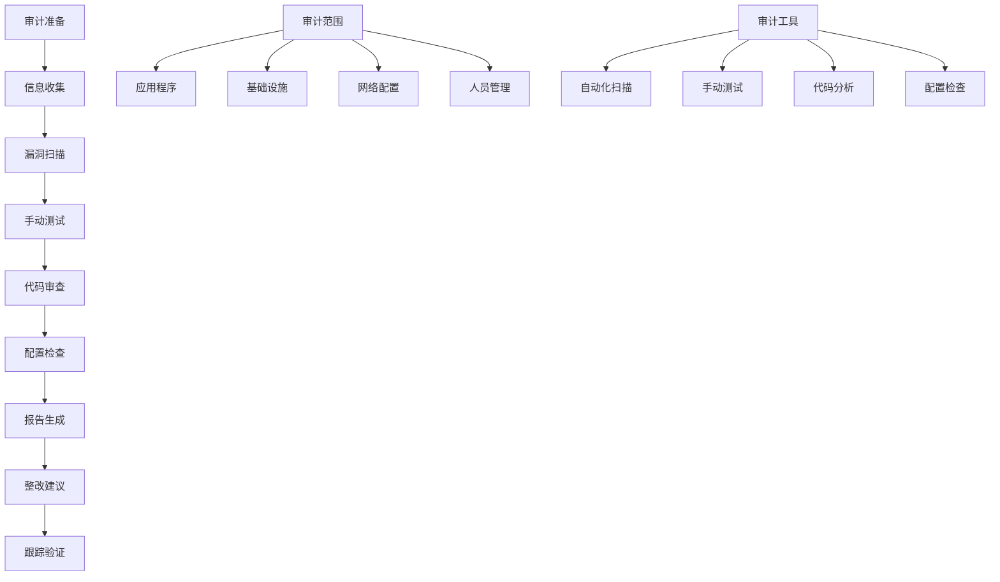

# 安全审计清单

## 🎯 学习目标
- 掌握安全审计的基本原则和方法
- 理解安全审计清单的制定和使用
- 学会实施系统化的安全审计
- 了解安全审计报告和整改建议

## 📚 核心概念

### 安全审计流程



### 安全审计分类

| 审计类型 | 描述 | 频率 | 深度 | 工具 |
|----------|------|------|------|------|
| 代码审计 | 审查源代码安全性 | 每次发布 | 高 | 静态分析工具 |
| 配置审计 | 检查系统配置 | 每月 | 中 | 配置检查工具 |
| 网络审计 | 检查网络安全性 | 每季度 | 中 | 网络扫描工具 |
| 渗透测试 | 模拟攻击测试 | 每半年 | 高 | 渗透测试工具 |
| 合规审计 | 检查合规性 | 每年 | 中 | 合规检查工具 |

## 🔧 安全审计实现

### 安全审计框架
```php
<?php
// 1. 安全审计框架
class SecurityAuditFramework {
    private $auditResults;
    private $logger;
    private $config;
    
    public function __construct($config = []) {
        $this->config = array_merge([
            'audit_level' => 'comprehensive',
            'include_code_audit' => true,
            'include_config_audit' => true,
            'include_network_audit' => true,
            'include_penetration_test' => false,
            'generate_report' => true,
            'report_format' => 'html'
        ], $config);
        
        $this->auditResults = [];
        $this->logger = new SecurityLogger();
    }
    
    // 执行完整安全审计
    public function performFullAudit($target) {
        $this->logger->logInfo("开始安全审计", ['target' => $target]);
        
        $auditResults = [
            'target' => $target,
            'start_time' => date('Y-m-d H:i:s'),
            'audit_type' => 'full',
            'results' => []
        ];
        
        // 代码审计
        if ($this->config['include_code_audit']) {
            $auditResults['results']['code_audit'] = $this->performCodeAudit($target);
        }
        
        // 配置审计
        if ($this->config['include_config_audit']) {
            $auditResults['results']['config_audit'] = $this->performConfigAudit($target);
        }
        
        // 网络审计
        if ($this->config['include_network_audit']) {
            $auditResults['results']['network_audit'] = $this->performNetworkAudit($target);
        }
        
        // 渗透测试
        if ($this->config['include_penetration_test']) {
            $auditResults['results']['penetration_test'] = $this->performPenetrationTest($target);
        }
        
        $auditResults['end_time'] = date('Y-m-d H:i:s');
        $auditResults['summary'] = $this->generateAuditSummary($auditResults['results']);
        
        $this->auditResults = $auditResults;
        
        // 生成报告
        if ($this->config['generate_report']) {
            $this->generateAuditReport($auditResults);
        }
        
        $this->logger->logInfo("安全审计完成", ['summary' => $auditResults['summary']]);
        
        return $auditResults;
    }
    
    // 代码审计
    public function performCodeAudit($target) {
        $codeAudit = new CodeSecurityAudit();
        return $codeAudit->audit($target);
    }
    
    // 配置审计
    public function performConfigAudit($target) {
        $configAudit = new ConfigurationSecurityAudit();
        return $configAudit->audit($target);
    }
    
    // 网络审计
    public function performNetworkAudit($target) {
        $networkAudit = new NetworkSecurityAudit();
        return $networkAudit->audit($target);
    }
    
    // 渗透测试
    public function performPenetrationTest($target) {
        $penTest = new PenetrationTest();
        return $penTest->test($target);
    }
    
    // 生成审计摘要
    private function generateAuditSummary($results) {
        $summary = [
            'total_issues' => 0,
            'critical_issues' => 0,
            'high_issues' => 0,
            'medium_issues' => 0,
            'low_issues' => 0,
            'audit_score' => 0
        ];
        
        foreach ($results as $auditType => $result) {
            if (isset($result['issues'])) {
                foreach ($result['issues'] as $issue) {
                    $summary['total_issues']++;
                    
                    switch ($issue['severity']) {
                        case 'CRITICAL':
                            $summary['critical_issues']++;
                            break;
                        case 'HIGH':
                            $summary['high_issues']++;
                            break;
                        case 'MEDIUM':
                            $summary['medium_issues']++;
                            break;
                        case 'LOW':
                            $summary['low_issues']++;
                            break;
                    }
                }
            }
        }
        
        // 计算审计分数
        $summary['audit_score'] = $this->calculateAuditScore($summary);
        
        return $summary;
    }
    
    // 计算审计分数
    private function calculateAuditScore($summary) {
        $maxScore = 100;
        $deduction = 0;
        
        $deduction += $summary['critical_issues'] * 20;
        $deduction += $summary['high_issues'] * 10;
        $deduction += $summary['medium_issues'] * 5;
        $deduction += $summary['low_issues'] * 1;
        
        return max(0, $maxScore - $deduction);
    }
    
    // 生成审计报告
    private function generateAuditReport($auditResults) {
        $reportGenerator = new AuditReportGenerator();
        return $reportGenerator->generate($auditResults, $this->config['report_format']);
    }
}

// 2. 代码安全审计
class CodeSecurityAudit {
    private $vulnerabilityPatterns;
    
    public function __construct() {
        $this->vulnerabilityPatterns = [
            'SQL注入' => [
                'pattern' => '/mysql_query\s*\(\s*["\'].*\$.*["\']/i',
                'severity' => 'HIGH',
                'description' => '发现可能的SQL注入漏洞'
            ],
            'XSS漏洞' => [
                'pattern' => '/echo\s+.*\$.*[^;]/i',
                'severity' => 'MEDIUM',
                'description' => '发现可能的XSS漏洞'
            ],
            '文件包含' => [
                'pattern' => '/include\s*\(\s*.*\$.*\)/i',
                'severity' => 'HIGH',
                'description' => '发现可能的文件包含漏洞'
            ],
            '命令执行' => [
                'pattern' => '/system\s*\(\s*.*\$.*\)/i',
                'severity' => 'CRITICAL',
                'description' => '发现可能的命令执行漏洞'
            ],
            '弱密码哈希' => [
                'pattern' => '/md5\s*\(\s*.*\)/i',
                'severity' => 'MEDIUM',
                'description' => '使用弱密码哈希算法'
            ],
            '硬编码密码' => [
                'pattern' => '/password\s*=\s*["\'][^"\']+["\']/i',
                'severity' => 'HIGH',
                'description' => '发现硬编码密码'
            ]
        ];
    }
    
    // 执行代码审计
    public function audit($target) {
        $results = [
            'audit_type' => 'code',
            'target' => $target,
            'issues' => [],
            'statistics' => [
                'files_scanned' => 0,
                'lines_scanned' => 0,
                'vulnerabilities_found' => 0
            ]
        ];
        
        $files = $this->getPhpFiles($target);
        
        foreach ($files as $file) {
            $results['statistics']['files_scanned']++;
            
            $content = file_get_contents($file);
            $lines = explode("\n", $content);
            $results['statistics']['lines_scanned'] += count($lines);
            
            foreach ($this->vulnerabilityPatterns as $vulnType => $pattern) {
                $matches = $this->findVulnerabilities($content, $pattern, $file);
                
                foreach ($matches as $match) {
                    $results['issues'][] = [
                        'type' => $vulnType,
                        'severity' => $pattern['severity'],
                        'description' => $pattern['description'],
                        'file' => $file,
                        'line' => $match['line'],
                        'code' => $match['code'],
                        'recommendation' => $this->getRecommendation($vulnType)
                    ];
                    
                    $results['statistics']['vulnerabilities_found']++;
                }
            }
        }
        
        return $results;
    }
    
    // 获取PHP文件
    private function getPhpFiles($target) {
        $files = [];
        
        if (is_file($target) && pathinfo($target, PATHINFO_EXTENSION) === 'php') {
            $files[] = $target;
        } elseif (is_dir($target)) {
            $iterator = new RecursiveIteratorIterator(
                new RecursiveDirectoryIterator($target)
            );
            
            foreach ($iterator as $file) {
                if ($file->isFile() && $file->getExtension() === 'php') {
                    $files[] = $file->getPathname();
                }
            }
        }
        
        return $files;
    }
    
    // 查找漏洞
    private function findVulnerabilities($content, $pattern, $file) {
        $matches = [];
        $lines = explode("\n", $content);
        
        foreach ($lines as $lineNum => $line) {
            if (preg_match($pattern['pattern'], $line, $match)) {
                $matches[] = [
                    'line' => $lineNum + 1,
                    'code' => trim($line)
                ];
            }
        }
        
        return $matches;
    }
    
    // 获取修复建议
    private function getRecommendation($vulnType) {
        $recommendations = [
            'SQL注入' => '使用预处理语句和参数化查询',
            'XSS漏洞' => '对输出进行HTML编码',
            '文件包含' => '验证文件路径，使用白名单',
            '命令执行' => '避免使用system()等函数，使用安全的替代方案',
            '弱密码哈希' => '使用bcrypt、argon2等强哈希算法',
            '硬编码密码' => '使用配置文件或环境变量存储敏感信息'
        ];
        
        return $recommendations[$vulnType] ?? '请查阅相关安全文档';
    }
}

// 3. 配置安全审计
class ConfigurationSecurityAudit {
    private $configChecks;
    
    public function __construct() {
        $this->configChecks = [
            'PHP配置' => [
                'display_errors' => [
                    'expected' => 'Off',
                    'severity' => 'HIGH',
                    'description' => '生产环境不应显示错误信息'
                ],
                'expose_php' => [
                    'expected' => 'Off',
                    'severity' => 'MEDIUM',
                    'description' => '不应暴露PHP版本信息'
                ],
                'allow_url_fopen' => [
                    'expected' => 'Off',
                    'severity' => 'MEDIUM',
                    'description' => '禁用远程文件包含'
                ],
                'allow_url_include' => [
                    'expected' => 'Off',
                    'severity' => 'HIGH',
                    'description' => '禁用远程文件包含'
                ]
            ],
            'Web服务器配置' => [
                'server_tokens' => [
                    'expected' => 'off',
                    'severity' => 'LOW',
                    'description' => '隐藏服务器版本信息'
                ],
                'ssl_protocols' => [
                    'expected' => 'TLSv1.2 TLSv1.3',
                    'severity' => 'HIGH',
                    'description' => '使用安全的SSL/TLS协议'
                ]
            ]
        ];
    }
    
    // 执行配置审计
    public function audit($target) {
        $results = [
            'audit_type' => 'configuration',
            'target' => $target,
            'issues' => [],
            'statistics' => [
                'checks_performed' => 0,
                'issues_found' => 0
            ]
        ];
        
        // PHP配置检查
        $phpConfig = $this->checkPhpConfiguration();
        $results['issues'] = array_merge($results['issues'], $phpConfig);
        
        // Web服务器配置检查
        $webConfig = $this->checkWebServerConfiguration();
        $results['issues'] = array_merge($results['issues'], $webConfig);
        
        // 文件权限检查
        $filePermissions = $this->checkFilePermissions($target);
        $results['issues'] = array_merge($results['issues'], $filePermissions);
        
        $results['statistics']['checks_performed'] = count($this->configChecks);
        $results['statistics']['issues_found'] = count($results['issues']);
        
        return $results;
    }
    
    // 检查PHP配置
    private function checkPhpConfiguration() {
        $issues = [];
        
        foreach ($this->configChecks['PHP配置'] as $setting => $check) {
            $currentValue = ini_get($setting);
            $expectedValue = $check['expected'];
            
            if ($currentValue !== $expectedValue) {
                $issues[] = [
                    'type' => 'PHP配置',
                    'setting' => $setting,
                    'current_value' => $currentValue,
                    'expected_value' => $expectedValue,
                    'severity' => $check['severity'],
                    'description' => $check['description'],
                    'recommendation' => "设置 $setting = $expectedValue"
                ];
            }
        }
        
        return $issues;
    }
    
    // 检查Web服务器配置
    private function checkWebServerConfiguration() {
        $issues = [];
        
        // 这里应该检查Apache/Nginx配置文件
        // 由于示例限制，这里只是模拟
        
        return $issues;
    }
    
    // 检查文件权限
    private function checkFilePermissions($target) {
        $issues = [];
        
        if (is_dir($target)) {
            $iterator = new RecursiveIteratorIterator(
                new RecursiveDirectoryIterator($target)
            );
            
            foreach ($iterator as $file) {
                if ($file->isFile()) {
                    $permissions = substr(sprintf('%o', $file->getPerms()), -4);
                    
                    // 检查文件权限是否过于宽松
                    if (intval($permissions[3]) > 4) { // 其他用户可写
                        $issues[] = [
                            'type' => '文件权限',
                            'file' => $file->getPathname(),
                            'current_permissions' => $permissions,
                            'expected_permissions' => '0644',
                            'severity' => 'MEDIUM',
                            'description' => '文件权限过于宽松',
                            'recommendation' => '设置文件权限为644'
                        ];
                    }
                }
            }
        }
        
        return $issues;
    }
}

// 4. 网络安全审计
class NetworkSecurityAudit {
    // 执行网络审计
    public function audit($target) {
        $results = [
            'audit_type' => 'network',
            'target' => $target,
            'issues' => [],
            'statistics' => [
                'ports_scanned' => 0,
                'services_found' => 0,
                'vulnerabilities_found' => 0
            ]
        ];
        
        // 端口扫描
        $portScan = $this->performPortScan($target);
        $results['issues'] = array_merge($results['issues'], $portScan);
        
        // SSL/TLS检查
        $sslCheck = $this->checkSslConfiguration($target);
        $results['issues'] = array_merge($results['issues'], $sslCheck);
        
        // 安全头检查
        $headerCheck = $this->checkSecurityHeaders($target);
        $results['issues'] = array_merge($results['issues'], $headerCheck);
        
        return $results;
    }
    
    // 端口扫描
    private function performPortScan($target) {
        $issues = [];
        $commonPorts = [21, 22, 23, 25, 53, 80, 110, 143, 443, 993, 995];
        
        foreach ($commonPorts as $port) {
            $connection = @fsockopen($target, $port, $errno, $errstr, 1);
            
            if ($connection) {
                fclose($connection);
                
                // 检查危险端口
                if (in_array($port, [21, 23, 25, 110, 143])) {
                    $issues[] = [
                        'type' => '开放端口',
                        'port' => $port,
                        'severity' => 'MEDIUM',
                        'description' => "端口 $port 开放，可能存在安全风险",
                        'recommendation' => '考虑关闭不必要的端口'
                    ];
                }
            }
        }
        
        return $issues;
    }
    
    // SSL/TLS检查
    private function checkSslConfiguration($target) {
        $issues = [];
        
        // 检查HTTPS是否可用
        $context = stream_context_create([
            'ssl' => [
                'verify_peer' => false,
                'verify_peer_name' => false
            ]
        ]);
        
        $connection = @stream_socket_client("ssl://$target:443", $errno, $errstr, 5, STREAM_CLIENT_CONNECT, $context);
        
        if (!$connection) {
            $issues[] = [
                'type' => 'SSL配置',
                'severity' => 'HIGH',
                'description' => 'HTTPS不可用',
                'recommendation' => '配置SSL证书启用HTTPS'
            ];
        } else {
            fclose($connection);
        }
        
        return $issues;
    }
    
    // 安全头检查
    private function checkSecurityHeaders($target) {
        $issues = [];
        
        $headers = get_headers("http://$target", 1);
        
        $requiredHeaders = [
            'X-Frame-Options' => 'DENY',
            'X-XSS-Protection' => '1; mode=block',
            'X-Content-Type-Options' => 'nosniff',
            'Strict-Transport-Security' => 'max-age=31536000'
        ];
        
        foreach ($requiredHeaders as $header => $expectedValue) {
            if (!isset($headers[$header])) {
                $issues[] = [
                    'type' => '安全头',
                    'header' => $header,
                    'severity' => 'MEDIUM',
                    'description' => "缺少安全头: $header",
                    'recommendation' => "添加 $header 头"
                ];
            }
        }
        
        return $issues;
    }
}

// 5. 审计报告生成器
class AuditReportGenerator {
    // 生成审计报告
    public function generate($auditResults, $format = 'html') {
        switch ($format) {
            case 'html':
                return $this->generateHtmlReport($auditResults);
            case 'json':
                return $this->generateJsonReport($auditResults);
            case 'pdf':
                return $this->generatePdfReport($auditResults);
            default:
                return $this->generateTextReport($auditResults);
        }
    }
    
    // 生成HTML报告
    private function generateHtmlReport($auditResults) {
        $html = "<!DOCTYPE html><html><head><title>安全审计报告</title></head><body>";
        $html .= "<h1>安全审计报告</h1>";
        $html .= "<h2>审计摘要</h2>";
        $html .= "<p>目标: {$auditResults['target']}</p>";
        $html .= "<p>开始时间: {$auditResults['start_time']}</p>";
        $html .= "<p>结束时间: {$auditResults['end_time']}</p>";
        $html .= "<p>审计分数: {$auditResults['summary']['audit_score']}/100</p>";
        
        $html .= "<h2>问题统计</h2>";
        $html .= "<ul>";
        $html .= "<li>总问题数: {$auditResults['summary']['total_issues']}</li>";
        $html .= "<li>严重问题: {$auditResults['summary']['critical_issues']}</li>";
        $html .= "<li>高危险问题: {$auditResults['summary']['high_issues']}</li>";
        $html .= "<li>中危险问题: {$auditResults['summary']['medium_issues']}</li>";
        $html .= "<li>低危险问题: {$auditResults['summary']['low_issues']}</li>";
        $html .= "</ul>";
        
        $html .= "<h2>详细结果</h2>";
        foreach ($auditResults['results'] as $auditType => $result) {
            $html .= "<h3>$auditType</h3>";
            
            if (isset($result['issues'])) {
                foreach ($result['issues'] as $issue) {
                    $html .= "<div style='border: 1px solid #ccc; margin: 10px; padding: 10px;'>";
                    $html .= "<h4>{$issue['type']} - {$issue['severity']}</h4>";
                    $html .= "<p>{$issue['description']}</p>";
                    $html .= "<p><strong>建议:</strong> {$issue['recommendation']}</p>";
                    $html .= "</div>";
                }
            }
        }
        
        $html .= "</body></html>";
        
        return $html;
    }
    
    // 生成JSON报告
    private function generateJsonReport($auditResults) {
        return json_encode($auditResults, JSON_PRETTY_PRINT | JSON_UNESCAPED_UNICODE);
    }
    
    // 生成文本报告
    private function generateTextReport($auditResults) {
        $text = "安全审计报告\n";
        $text .= "============\n\n";
        $text .= "目标: {$auditResults['target']}\n";
        $text .= "开始时间: {$auditResults['start_time']}\n";
        $text .= "结束时间: {$auditResults['end_time']}\n";
        $text .= "审计分数: {$auditResults['summary']['audit_score']}/100\n\n";
        
        $text .= "问题统计:\n";
        $text .= "- 总问题数: {$auditResults['summary']['total_issues']}\n";
        $text .= "- 严重问题: {$auditResults['summary']['critical_issues']}\n";
        $text .= "- 高危险问题: {$auditResults['summary']['high_issues']}\n";
        $text .= "- 中危险问题: {$auditResults['summary']['medium_issues']}\n";
        $text .= "- 低危险问题: {$auditResults['summary']['low_issues']}\n\n";
        
        $text .= "详细结果:\n";
        foreach ($auditResults['results'] as $auditType => $result) {
            $text .= "\n$auditType:\n";
            
            if (isset($result['issues'])) {
                foreach ($result['issues'] as $issue) {
                    $text .= "- {$issue['type']} ({$issue['severity']}): {$issue['description']}\n";
                    $text .= "  建议: {$issue['recommendation']}\n";
                }
            }
        }
        
        return $text;
    }
    
    // 生成PDF报告
    private function generatePdfReport($auditResults) {
        // 这里应该使用PDF库生成PDF报告
        // 由于示例限制，这里只是返回文本内容
        return $this->generateTextReport($auditResults);
    }
}

// 使用示例
echo "=== 安全审计框架示例 ===\n";

try {
    // 创建安全审计框架
    $auditFramework = new SecurityAuditFramework([
        'audit_level' => 'comprehensive',
        'include_code_audit' => true,
        'include_config_audit' => true,
        'include_network_audit' => true,
        'include_penetration_test' => false,
        'generate_report' => true,
        'report_format' => 'text'
    ]);
    
    // 执行安全审计
    $target = 'test-app';
    $auditResults = $auditFramework->performFullAudit($target);
    
    // 显示审计结果
    echo "安全审计完成\n";
    echo "目标: {$auditResults['target']}\n";
    echo "审计分数: {$auditResults['summary']['audit_score']}/100\n";
    echo "总问题数: {$auditResults['summary']['total_issues']}\n";
    echo "严重问题: {$auditResults['summary']['critical_issues']}\n";
    echo "高危险问题: {$auditResults['summary']['high_issues']}\n";
    echo "中危险问题: {$auditResults['summary']['medium_issues']}\n";
    echo "低危险问题: {$auditResults['summary']['low_issues']}\n\n";
    
    // 显示详细结果
    foreach ($auditResults['results'] as $auditType => $result) {
        echo "$auditType 审计结果:\n";
        
        if (isset($result['issues'])) {
            foreach ($result['issues'] as $issue) {
                echo "  - {$issue['type']} ({$issue['severity']}): {$issue['description']}\n";
                echo "    建议: {$issue['recommendation']}\n";
            }
        } else {
            echo "  未发现安全问题\n";
        }
        echo "\n";
    }
    
} catch (Exception $e) {
    echo "错误: " . $e->getMessage() . "\n";
}
?>
```

## 📊 最佳实践

### 安全审计最佳实践
```php
<?php
// 安全审计最佳实践

class SecurityAuditBestPractices {
    // 1. 审计计划
    public static function getAuditPlan() {
        return [
            '审计频率' => [
                '代码审计' => '每次代码发布前',
                '配置审计' => '每月一次',
                '网络审计' => '每季度一次',
                '渗透测试' => '每半年一次',
                '合规审计' => '每年一次'
            ],
            '审计范围' => [
                '应用程序' => '源代码、配置文件、数据库',
                '基础设施' => '服务器、网络设备、安全设备',
                '人员管理' => '权限管理、培训记录、访问控制',
                '物理安全' => '机房安全、设备安全、环境控制'
            ],
            '审计工具' => [
                '静态分析' => 'PHPStan, Psalm, SonarQube',
                '动态测试' => 'OWASP ZAP, Burp Suite, Nikto',
                '网络扫描' => 'Nmap, Nessus, OpenVAS',
                '配置检查' => 'CIS Benchmarks, Security Configuration Guides'
            ]
        ];
    }
    
    // 2. 审计清单
    public static function getAuditChecklist() {
        return [
            '代码安全' => [
                '输入验证' => '所有用户输入都经过验证',
                '输出编码' => '所有输出都经过适当编码',
                'SQL注入防护' => '使用预处理语句',
                'XSS防护' => '实施XSS防护措施',
                'CSRF防护' => '实施CSRF令牌',
                '文件上传安全' => '验证文件类型和内容',
                '密码安全' => '使用强哈希算法',
                '会话管理' => '安全的会话处理'
            ],
            '配置安全' => [
                'PHP配置' => '生产环境安全配置',
                'Web服务器' => '安全头配置',
                '数据库' => '访问控制和权限设置',
                '文件权限' => '适当的文件系统权限',
                'SSL/TLS' => '安全的加密配置',
                '防火墙' => '网络访问控制',
                '日志记录' => '安全事件日志'
            ],
            '网络安全' => [
                '端口扫描' => '检查开放端口',
                '服务配置' => '安全服务配置',
                '网络分段' => '网络隔离和分段',
                'VPN配置' => '安全的远程访问',
                'IDS/IPS' => '入侵检测和防护',
                '流量监控' => '网络流量分析'
            ],
            '管理安全' => [
                '访问控制' => '用户权限管理',
                '身份认证' => '强身份认证机制',
                '审计日志' => '完整的审计跟踪',
                '备份恢复' => '数据备份和恢复',
                '事件响应' => '安全事件响应计划',
                '培训教育' => '安全意识培训'
            ]
        ];
    }
    
    // 3. 风险评估
    public static function getRiskAssessment() {
        return [
            '风险等级' => [
                'CRITICAL' => [
                    '描述' => '立即修复，系统面临严重威胁',
                    '修复时间' => '24小时内',
                    '影响' => '系统完全不可用或数据泄露'
                ],
                'HIGH' => [
                    '描述' => '高优先级修复，存在重大安全风险',
                    '修复时间' => '1周内',
                    '影响' => '系统功能受限或部分数据泄露'
                ],
                'MEDIUM' => [
                    '描述' => '中等优先级修复，存在潜在安全风险',
                    '修复时间' => '1个月内',
                    '影响' => '系统安全性降低'
                ],
                'LOW' => [
                    '描述' => '低优先级修复，建议改进',
                    '修复时间' => '3个月内',
                    '影响' => '最佳实践改进'
                ]
            ],
            '风险计算' => [
                '公式' => '风险 = 威胁 × 漏洞 × 影响',
                '威胁' => '攻击者的能力和意图',
                '漏洞' => '系统存在的安全弱点',
                '影响' => '成功攻击造成的损害'
            ]
        ];
    }
    
    // 4. 整改建议
    public static function getRemediationGuidelines() {
        return [
            '立即修复' => [
                'SQL注入漏洞' => '使用预处理语句替换动态SQL',
                '命令执行漏洞' => '移除危险函数，使用安全替代方案',
                '文件包含漏洞' => '验证文件路径，使用白名单',
                '认证绕过' => '修复认证逻辑，加强验证'
            ],
            '短期修复' => [
                'XSS漏洞' => '实施输出编码，使用CSP',
                'CSRF漏洞' => '添加CSRF令牌验证',
                '文件上传漏洞' => '加强文件验证和存储安全',
                '配置问题' => '修复不安全的配置设置'
            ],
            '长期改进' => [
                '安全架构' => '实施深度防御策略',
                '安全开发' => '建立安全开发生命周期',
                '安全监控' => '部署安全监控和告警系统',
                '安全培训' => '定期进行安全培训和教育'
            ]
        ];
    }
}

// 使用示例
echo "=== 安全审计最佳实践示例 ===\n";

try {
    // 审计计划
    $auditPlan = SecurityAuditBestPractices::getAuditPlan();
    echo "审计计划:\n";
    foreach ($auditPlan as $category => $items) {
        echo "  $category:\n";
        foreach ($items as $item => $description) {
            echo "    - $item: $description\n";
        }
        echo "\n";
    }
    
    // 审计清单
    $auditChecklist = SecurityAuditBestPractices::getAuditChecklist();
    echo "审计清单:\n";
    foreach ($auditChecklist as $category => $items) {
        echo "  $category:\n";
        foreach ($items as $item => $description) {
            echo "    - $item: $description\n";
        }
        echo "\n";
    }
    
    // 风险评估
    $riskAssessment = SecurityAuditBestPractices::getRiskAssessment();
    echo "风险评估:\n";
    foreach ($riskAssessment as $category => $items) {
        echo "  $category:\n";
        if (is_array($items)) {
            foreach ($items as $item => $info) {
                if (is_array($info)) {
                    echo "    $item:\n";
                    foreach ($info as $key => $value) {
                        echo "      $key: $value\n";
                    }
                } else {
                    echo "    $item: $info\n";
                }
            }
        } else {
            echo "    $items\n";
        }
        echo "\n";
    }
    
    // 整改建议
    $remediation = SecurityAuditBestPractices::getRemediationGuidelines();
    echo "整改建议:\n";
    foreach ($remediation as $category => $items) {
        echo "  $category:\n";
        foreach ($items as $item => $description) {
            echo "    - $item: $description\n";
        }
        echo "\n";
    }
    
} catch (Exception $e) {
    echo "错误: " . $e->getMessage() . "\n";
}
?>
```

## 🎓 学习建议

### 费曼学习法应用
1. **选择概念**: 选择安全审计中的核心概念
2. **简化解释**: 用简单语言解释安全审计的重要性
3. **识别盲点**: 发现理解不深入的地方
4. **重新学习**: 针对盲点进行深入学习

### 刻意练习重点
1. **审计方法**: 掌握各种安全审计方法
2. **工具使用**: 学会使用安全审计工具
3. **报告编写**: 理解如何编写有效的审计报告
4. **整改跟踪**: 建立有效的整改跟踪机制

## 🔗 相关链接
- [[01-SQL注入防护|SQL注入防护]]
- [[02-XSS攻击防护|XSS攻击防护]]
- [[03-CSRF防护|CSRF防护]]
- [[04-输入验证与过滤|输入验证与过滤]]
- [[05-密码安全|密码安全]]
- [[06-文件上传安全|文件上传安全]]
- [[07-安全编程最佳实践|安全编程最佳实践]]
