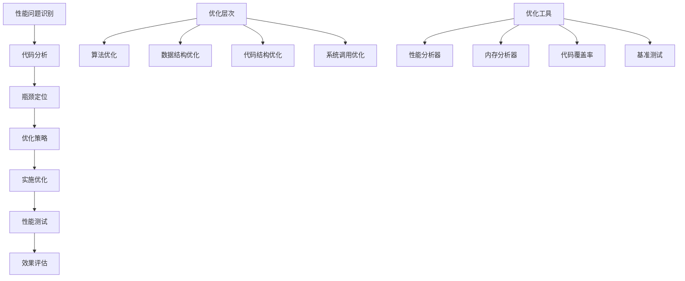

# 代码优化技巧

## 🎯 学习目标
- 掌握PHP代码优化的基本原则和方法
- 理解性能瓶颈的识别和分析
- 学会使用性能分析工具
- 了解代码优化的最佳实践

## 📚 核心概念

### 性能优化架构



### 性能优化对比

| 优化类型 | 描述 | 性能提升 | 实施难度 | 风险 |
|----------|------|----------|----------|------|
| 算法优化 | 改进算法复杂度 | 高 | 高 | 中 |
| 数据结构优化 | 选择合适的数据结构 | 中 | 中 | 低 |
| 代码结构优化 | 重构代码结构 | 中 | 中 | 中 |
| 缓存优化 | 减少重复计算 | 高 | 低 | 低 |
| 数据库优化 | 优化查询和索引 | 高 | 中 | 低 |
| 内存优化 | 减少内存使用 | 中 | 中 | 中 |

## 🔧 代码优化实现

### 性能分析器
```php
<?php
// 1. 性能分析器类
class PerformanceProfiler {
    private $startTime;
    private $startMemory;
    private $checkpoints;
    private $functions;
    
    public function __construct() {
        $this->startTime = microtime(true);
        $this->startMemory = memory_get_usage();
        $this->checkpoints = [];
        $this->functions = [];
    }
    
    // 开始性能分析
    public function start() {
        $this->startTime = microtime(true);
        $this->startMemory = memory_get_usage();
        $this->checkpoints = [];
        $this->functions = [];
    }
    
    // 添加检查点
    public function checkpoint($name) {
        $currentTime = microtime(true);
        $currentMemory = memory_get_usage();
        
        $this->checkpoints[$name] = [
            'time' => $currentTime - $this->startTime,
            'memory' => $currentMemory - $this->startMemory,
            'peak_memory' => memory_get_peak_usage() - $this->startMemory
        ];
    }
    
    // 函数性能分析
    public function profileFunction($functionName, $callback, $args = []) {
        $startTime = microtime(true);
        $startMemory = memory_get_usage();
        
        $result = call_user_func_array($callback, $args);
        
        $endTime = microtime(true);
        $endMemory = memory_get_usage();
        
        $this->functions[$functionName] = [
            'execution_time' => $endTime - $startTime,
            'memory_used' => $endMemory - $startMemory,
            'peak_memory' => memory_get_peak_usage() - $startMemory,
            'call_count' => ($this->functions[$functionName]['call_count'] ?? 0) + 1
        ];
        
        return $result;
    }
    
    // 获取性能报告
    public function getReport() {
        $totalTime = microtime(true) - $this->startTime;
        $totalMemory = memory_get_usage() - $this->startMemory;
        $peakMemory = memory_get_peak_usage() - $this->startMemory;
        
        return [
            'total_execution_time' => $totalTime,
            'total_memory_used' => $totalMemory,
            'peak_memory_used' => $peakMemory,
            'checkpoints' => $this->checkpoints,
            'functions' => $this->functions,
            'memory_efficiency' => $this->calculateMemoryEfficiency(),
            'time_efficiency' => $this->calculateTimeEfficiency()
        ];
    }
    
    // 计算内存效率
    private function calculateMemoryEfficiency() {
        $totalMemory = memory_get_usage() - $this->startMemory;
        $peakMemory = memory_get_peak_usage() - $this->startMemory;
        
        if ($peakMemory > 0) {
            return ($totalMemory / $peakMemory) * 100;
        }
        
        return 100;
    }
    
    // 计算时间效率
    private function calculateTimeEfficiency() {
        $totalTime = microtime(true) - $this->startTime;
        $functionTime = 0;
        
        foreach ($this->functions as $func) {
            $functionTime += $func['execution_time'];
        }
        
        if ($totalTime > 0) {
            return ($functionTime / $totalTime) * 100;
        }
        
        return 100;
    }
    
    // 输出性能报告
    public function outputReport() {
        $report = $this->getReport();
        
        echo "=== 性能分析报告 ===\n";
        echo "总执行时间: " . number_format($report['total_execution_time'], 4) . " 秒\n";
        echo "总内存使用: " . $this->formatBytes($report['total_memory_used']) . "\n";
        echo "峰值内存使用: " . $this->formatBytes($report['peak_memory_used']) . "\n";
        echo "内存效率: " . number_format($report['memory_efficiency'], 2) . "%\n";
        echo "时间效率: " . number_format($report['time_efficiency'], 2) . "%\n\n";
        
        if (!empty($report['checkpoints'])) {
            echo "检查点:\n";
            foreach ($report['checkpoints'] as $name => $data) {
                echo "  $name: " . number_format($data['time'], 4) . "s, " . $this->formatBytes($data['memory']) . "\n";
            }
            echo "\n";
        }
        
        if (!empty($report['functions'])) {
            echo "函数性能:\n";
            foreach ($report['functions'] as $name => $data) {
                echo "  $name: " . number_format($data['execution_time'], 4) . "s, " . $this->formatBytes($data['memory_used']) . " (调用 {$data['call_count']} 次)\n";
            }
        }
    }
    
    // 格式化字节数
    private function formatBytes($bytes) {
        $units = ['B', 'KB', 'MB', 'GB'];
        $unitIndex = 0;
        
        while ($bytes >= 1024 && $unitIndex < count($units) - 1) {
            $bytes /= 1024;
            $unitIndex++;
        }
        
        return number_format($bytes, 2) . ' ' . $units[$unitIndex];
    }
}

// 2. 代码优化器
class CodeOptimizer {
    private $profiler;
    
    public function __construct() {
        $this->profiler = new PerformanceProfiler();
    }
    
    // 优化循环
    public function optimizeLoops($data) {
        $this->profiler->start();
        
        // 原始循环 - 低效
        $result1 = [];
        foreach ($data as $item) {
            if ($item > 0) {
                $result1[] = $item * 2;
            }
        }
        $this->profiler->checkpoint('原始循环');
        
        // 优化循环 - 使用array_filter和array_map
        $result2 = array_map(function($item) {
            return $item * 2;
        }, array_filter($data, function($item) {
            return $item > 0;
        }));
        $this->profiler->checkpoint('优化循环');
        
        // 进一步优化 - 使用生成器
        $result3 = [];
        foreach ($this->filterAndMap($data) as $item) {
            $result3[] = $item;
        }
        $this->profiler->checkpoint('生成器优化');
        
        return [
            'original' => $result1,
            'optimized' => $result2,
            'generator' => $result3
        ];
    }
    
    // 生成器函数
    private function filterAndMap($data) {
        foreach ($data as $item) {
            if ($item > 0) {
                yield $item * 2;
            }
        }
    }
    
    // 优化字符串操作
    public function optimizeStringOperations($strings) {
        $this->profiler->start();
        
        // 原始字符串拼接
        $result1 = '';
        foreach ($strings as $str) {
            $result1 .= $str . ' ';
        }
        $this->profiler->checkpoint('原始字符串拼接');
        
        // 优化字符串拼接 - 使用implode
        $result2 = implode(' ', $strings);
        $this->profiler->checkpoint('implode优化');
        
        // 进一步优化 - 使用sprintf
        $result3 = sprintf('%s', implode(' ', $strings));
        $this->profiler->checkpoint('sprintf优化');
        
        return [
            'original' => $result1,
            'optimized' => $result2,
            'sprintf' => $result3
        ];
    }
    
    // 优化数组操作
    public function optimizeArrayOperations($data) {
        $this->profiler->start();
        
        // 原始数组操作
        $result1 = [];
        foreach ($data as $key => $value) {
            if ($value > 10) {
                $result1[$key] = $value * 2;
            }
        }
        $this->profiler->checkpoint('原始数组操作');
        
        // 优化数组操作 - 使用array_walk
        $result2 = $data;
        array_walk($result2, function(&$value, $key) {
            if ($value > 10) {
                $value *= 2;
            } else {
                unset($result2[$key]);
            }
        });
        $this->profiler->checkpoint('array_walk优化');
        
        // 进一步优化 - 使用array_filter和array_map
        $result3 = array_map(function($value) {
            return $value * 2;
        }, array_filter($data, function($value) {
            return $value > 10;
        }));
        $this->profiler->checkpoint('函数式优化');
        
        return [
            'original' => $result1,
            'optimized' => $result2,
            'functional' => $result3
        ];
    }
    
    // 优化数据库查询
    public function optimizeDatabaseQueries($db) {
        $this->profiler->start();
        
        // 原始查询 - N+1问题
        $users = $db->query("SELECT * FROM users")->fetchAll();
        foreach ($users as $user) {
            $posts = $db->query("SELECT * FROM posts WHERE user_id = {$user['id']}")->fetchAll();
            $user['posts'] = $posts;
        }
        $this->profiler->checkpoint('原始查询');
        
        // 优化查询 - 使用JOIN
        $optimizedUsers = $db->query("
            SELECT u.*, p.id as post_id, p.title, p.content 
            FROM users u 
            LEFT JOIN posts p ON u.id = p.user_id
        ")->fetchAll();
        $this->profiler->checkpoint('JOIN优化');
        
        // 进一步优化 - 使用预处理语句
        $stmt = $db->prepare("
            SELECT u.*, p.id as post_id, p.title, p.content 
            FROM users u 
            LEFT JOIN posts p ON u.id = p.user_id
        ");
        $stmt->execute();
        $preparedUsers = $stmt->fetchAll();
        $this->profiler->checkpoint('预处理语句优化');
        
        return [
            'original' => $users,
            'optimized' => $optimizedUsers,
            'prepared' => $preparedUsers
        ];
    }
    
    // 优化内存使用
    public function optimizeMemoryUsage($data) {
        $this->profiler->start();
        
        // 原始内存使用 - 创建大数组
        $result1 = [];
        for ($i = 0; $i < 10000; $i++) {
            $result1[] = $i * 2;
        }
        $this->profiler->checkpoint('原始内存使用');
        
        // 优化内存使用 - 使用生成器
        $result2 = [];
        foreach ($this->generateNumbers(10000) as $number) {
            $result2[] = $number;
        }
        $this->profiler->checkpoint('生成器内存优化');
        
        // 进一步优化 - 流式处理
        $result3 = [];
        $this->processStream($data, function($item) use (&$result3) {
            $result3[] = $item * 2;
        });
        $this->profiler->checkpoint('流式处理优化');
        
        return [
            'original' => count($result1),
            'generator' => count($result2),
            'stream' => count($result3)
        ];
    }
    
    // 生成器函数
    private function generateNumbers($count) {
        for ($i = 0; $i < $count; $i++) {
            yield $i * 2;
        }
    }
    
    // 流式处理
    private function processStream($data, $callback) {
        foreach ($data as $item) {
            $callback($item);
        }
    }
    
    // 获取优化报告
    public function getOptimizationReport() {
        return $this->profiler->getReport();
    }
}

// 使用示例
echo "=== 代码优化技巧示例 ===\n";

try {
    // 创建代码优化器
    $optimizer = new CodeOptimizer();
    
    // 测试数据
    $testData = range(1, 1000);
    $testStrings = ['Hello', 'World', 'PHP', 'Optimization', 'Performance'];
    
    // 优化循环
    echo "循环优化测试:\n";
    $loopResults = $optimizer->optimizeLoops($testData);
    $optimizer->getOptimizationReport();
    
    // 优化字符串操作
    echo "\n字符串操作优化测试:\n";
    $stringResults = $optimizer->optimizeStringOperations($testStrings);
    $optimizer->getOptimizationReport();
    
    // 优化数组操作
    echo "\n数组操作优化测试:\n";
    $arrayResults = $optimizer->optimizeArrayOperations($testData);
    $optimizer->getOptimizationReport();
    
    // 优化内存使用
    echo "\n内存使用优化测试:\n";
    $memoryResults = $optimizer->optimizeMemoryUsage($testData);
    $optimizer->getOptimizationReport();
    
} catch (Exception $e) {
    echo "错误: " . $e->getMessage() . "\n";
}
?>
```

### 性能基准测试
```php
<?php
// 1. 基准测试框架
class BenchmarkFramework {
    private $tests;
    private $results;
    
    public function __construct() {
        $this->tests = [];
        $this->results = [];
    }
    
    // 添加测试
    public function addTest($name, $callback, $iterations = 1000) {
        $this->tests[$name] = [
            'callback' => $callback,
            'iterations' => $iterations
        ];
    }
    
    // 运行所有测试
    public function runAllTests() {
        foreach ($this->tests as $name => $test) {
            $this->results[$name] = $this->runTest($name, $test['callback'], $test['iterations']);
        }
        
        return $this->results;
    }
    
    // 运行单个测试
    private function runTest($name, $callback, $iterations) {
        $times = [];
        $memory = [];
        
        // 预热
        for ($i = 0; $i < 10; $i++) {
            $callback();
        }
        
        // 正式测试
        for ($i = 0; $i < $iterations; $i++) {
            $startTime = microtime(true);
            $startMemory = memory_get_usage();
            
            $callback();
            
            $endTime = microtime(true);
            $endMemory = memory_get_usage();
            
            $times[] = $endTime - $startTime;
            $memory[] = $endMemory - $startMemory;
        }
        
        return [
            'name' => $name,
            'iterations' => $iterations,
            'total_time' => array_sum($times),
            'average_time' => array_sum($times) / count($times),
            'min_time' => min($times),
            'max_time' => max($times),
            'total_memory' => array_sum($memory),
            'average_memory' => array_sum($memory) / count($memory),
            'peak_memory' => memory_get_peak_usage()
        ];
    }
    
    // 生成基准测试报告
    public function generateReport() {
        $report = "=== 基准测试报告 ===\n\n";
        
        // 按执行时间排序
        uasort($this->results, function($a, $b) {
            return $a['average_time'] <=> $b['average_time'];
        });
        
        $report .= "性能排名 (按平均执行时间):\n";
        $rank = 1;
        foreach ($this->results as $name => $result) {
            $report .= sprintf(
                "%d. %s: %.6f秒 (%.2f%% 相对最快)\n",
                $rank++,
                $name,
                $result['average_time'],
                ($result['average_time'] / $this->results[array_key_first($this->results)]['average_time']) * 100
            );
        }
        
        $report .= "\n详细结果:\n";
        foreach ($this->results as $name => $result) {
            $report .= "\n$name:\n";
            $report .= "  迭代次数: {$result['iterations']}\n";
            $report .= "  总执行时间: " . number_format($result['total_time'], 6) . " 秒\n";
            $report .= "  平均执行时间: " . number_format($result['average_time'], 6) . " 秒\n";
            $report .= "  最小执行时间: " . number_format($result['min_time'], 6) . " 秒\n";
            $report .= "  最大执行时间: " . number_format($result['max_time'], 6) . " 秒\n";
            $report .= "  平均内存使用: " . $this->formatBytes($result['average_memory']) . "\n";
            $report .= "  峰值内存使用: " . $this->formatBytes($result['peak_memory']) . "\n";
        }
        
        return $report;
    }
    
    // 格式化字节数
    private function formatBytes($bytes) {
        $units = ['B', 'KB', 'MB', 'GB'];
        $unitIndex = 0;
        
        while ($bytes >= 1024 && $unitIndex < count($units) - 1) {
            $bytes /= 1024;
            $unitIndex++;
        }
        
        return number_format($bytes, 2) . ' ' . $units[$unitIndex];
    }
}

// 2. 性能优化示例
class PerformanceOptimizationExamples {
    
    // 字符串拼接优化
    public static function stringConcatenationOptimization() {
        $benchmark = new BenchmarkFramework();
        
        $strings = array_fill(0, 100, 'test');
        
        // 原始方法 - 字符串拼接
        $benchmark->addTest('字符串拼接', function() use ($strings) {
            $result = '';
            foreach ($strings as $str) {
                $result .= $str;
            }
            return $result;
        });
        
        // 优化方法 - implode
        $benchmark->addTest('implode', function() use ($strings) {
            return implode('', $strings);
        });
        
        // 进一步优化 - sprintf
        $benchmark->addTest('sprintf', function() use ($strings) {
            return sprintf('%s', implode('', $strings));
        });
        
        return $benchmark->runAllTests();
    }
    
    // 数组操作优化
    public static function arrayOperationOptimization() {
        $benchmark = new BenchmarkFramework();
        
        $data = range(1, 1000);
        
        // 原始方法 - foreach循环
        $benchmark->addTest('foreach循环', function() use ($data) {
            $result = [];
            foreach ($data as $item) {
                if ($item % 2 === 0) {
                    $result[] = $item * 2;
                }
            }
            return $result;
        });
        
        // 优化方法 - array_filter + array_map
        $benchmark->addTest('array_filter+array_map', function() use ($data) {
            return array_map(function($item) {
                return $item * 2;
            }, array_filter($data, function($item) {
                return $item % 2 === 0;
            }));
        });
        
        // 进一步优化 - 生成器
        $benchmark->addTest('生成器', function() use ($data) {
            $result = [];
            foreach (self::filterAndMapGenerator($data) as $item) {
                $result[] = $item;
            }
            return $result;
        });
        
        return $benchmark->runAllTests();
    }
    
    // 生成器函数
    private static function filterAndMapGenerator($data) {
        foreach ($data as $item) {
            if ($item % 2 === 0) {
                yield $item * 2;
            }
        }
    }
    
    // 数学计算优化
    public static function mathCalculationOptimization() {
        $benchmark = new BenchmarkFramework();
        
        $numbers = range(1, 1000);
        
        // 原始方法 - 循环计算
        $benchmark->addTest('循环计算', function() use ($numbers) {
            $sum = 0;
            foreach ($numbers as $num) {
                $sum += $num * $num;
            }
            return $sum;
        });
        
        // 优化方法 - array_sum + array_map
        $benchmark->addTest('array_sum+array_map', function() use ($numbers) {
            return array_sum(array_map(function($num) {
                return $num * $num;
            }, $numbers));
        });
        
        // 进一步优化 - 数学公式
        $benchmark->addTest('数学公式', function() use ($numbers) {
            $n = count($numbers);
            return $n * ($n + 1) * (2 * $n + 1) / 6;
        });
        
        return $benchmark->runAllTests();
    }
    
    // 文件操作优化
    public static function fileOperationOptimization() {
        $benchmark = new BenchmarkFramework();
        
        $filename = 'test_file.txt';
        $content = str_repeat('Hello World! ', 1000);
        
        // 原始方法 - 逐行写入
        $benchmark->addTest('逐行写入', function() use ($filename, $content) {
            $lines = explode(' ', $content);
            $handle = fopen($filename, 'w');
            foreach ($lines as $line) {
                fwrite($handle, $line . "\n");
            }
            fclose($handle);
        });
        
        // 优化方法 - 批量写入
        $benchmark->addTest('批量写入', function() use ($filename, $content) {
            file_put_contents($filename, $content);
        });
        
        // 进一步优化 - 流式写入
        $benchmark->addTest('流式写入', function() use ($filename, $content) {
            $handle = fopen($filename, 'w');
            fwrite($handle, $content);
            fclose($handle);
        });
        
        return $benchmark->runAllTests();
    }
}

// 使用示例
echo "=== 性能基准测试示例 ===\n";

try {
    // 字符串拼接优化测试
    echo "字符串拼接优化测试:\n";
    $stringResults = PerformanceOptimizationExamples::stringConcatenationOptimization();
    $benchmark = new BenchmarkFramework();
    $benchmark->results = $stringResults;
    echo $benchmark->generateReport();
    
    // 数组操作优化测试
    echo "\n数组操作优化测试:\n";
    $arrayResults = PerformanceOptimizationExamples::arrayOperationOptimization();
    $benchmark->results = $arrayResults;
    echo $benchmark->generateReport();
    
    // 数学计算优化测试
    echo "\n数学计算优化测试:\n";
    $mathResults = PerformanceOptimizationExamples::mathCalculationOptimization();
    $benchmark->results = $mathResults;
    echo $benchmark->generateReport();
    
    // 文件操作优化测试
    echo "\n文件操作优化测试:\n";
    $fileResults = PerformanceOptimizationExamples::fileOperationOptimization();
    $benchmark->results = $fileResults;
    echo $benchmark->generateReport();
    
} catch (Exception $e) {
    echo "错误: " . $e->getMessage() . "\n";
}
?>
```

## 📊 最佳实践

### 代码优化最佳实践
```php
<?php
// 代码优化最佳实践

class CodeOptimizationBestPractices {
    // 1. 性能优化原则
    public static function getOptimizationPrinciples() {
        return [
            '测量优先' => [
                '原则' => '先测量，后优化',
                '方法' => '使用性能分析工具识别瓶颈',
                '工具' => 'Xdebug, Blackfire, XHProf'
            ],
            '算法优化' => [
                '原则' => '选择最优算法',
                '方法' => '分析时间复杂度，选择合适的数据结构',
                '示例' => 'O(n²) → O(n log n) → O(n)'
            ],
            '缓存策略' => [
                '原则' => '减少重复计算',
                '方法' => '使用内存缓存、文件缓存、数据库缓存',
                '工具' => 'APCu, Redis, Memcached'
            ],
            '资源管理' => [
                '原则' => '合理使用系统资源',
                '方法' => '及时释放内存，优化数据库连接',
                '技巧' => '使用生成器，流式处理'
            ]
        ];
    }
    
    // 2. 常见性能问题
    public static function getCommonPerformanceIssues() {
        return [
            'N+1查询问题' => [
                '问题' => '循环中执行数据库查询',
                '解决方案' => '使用JOIN或批量查询',
                '示例' => 'foreach($users as $user) { $posts = $db->query("SELECT * FROM posts WHERE user_id = {$user['id']}"); }'
            ],
            '内存泄漏' => [
                '问题' => '大量数据加载到内存',
                '解决方案' => '使用生成器，分页处理',
                '示例' => 'foreach($this->getAllUsers() as $user) { /* 处理用户 */ }'
            ],
            '字符串拼接' => [
                '问题' => '循环中拼接字符串',
                '解决方案' => '使用implode或数组收集后拼接',
                '示例' => '$result = implode("", $strings);'
            ],
            '重复计算' => [
                '问题' => '相同计算重复执行',
                '解决方案' => '缓存计算结果',
                '示例' => 'if (!isset($cache[$key])) { $cache[$key] = expensiveCalculation(); }'
            ]
        ];
    }
    
    // 3. 优化技巧
    public static function getOptimizationTechniques() {
        return [
            '循环优化' => [
                '技巧' => '减少循环内部的计算',
                '方法' => '将不变的计算移到循环外',
                '示例' => '$count = count($array); for($i = 0; $i < $count; $i++) { /* 处理 */ }'
            ],
            '条件优化' => [
                '技巧' => '优化条件判断顺序',
                '方法' => '将最可能为真的条件放在前面',
                '示例' => 'if ($likelyCondition && $unlikelyCondition) { /* 处理 */ }'
            ],
            '函数调用优化' => [
                '技巧' => '减少函数调用开销',
                '方法' => '使用内置函数，避免不必要的函数调用',
                '示例' => 'isset($array[$key]) 而不是 array_key_exists($key, $array)'
            ],
            '数据结构优化' => [
                '技巧' => '选择合适的数据结构',
                '方法' => '根据使用场景选择数组、对象或Spl数据结构',
                '示例' => 'SplFixedArray for fixed-size arrays'
            ]
        ];
    }
    
    // 4. 性能监控
    public static function getPerformanceMonitoring() {
        return [
            '关键指标' => [
                '响应时间' => '页面加载时间，API响应时间',
                '吞吐量' => '每秒请求数，并发处理能力',
                '内存使用' => '峰值内存，内存泄漏检测',
                'CPU使用' => 'CPU占用率，热点函数分析'
            ],
            '监控工具' => [
                '应用层' => 'New Relic, AppDynamics, Blackfire',
                '系统层' => 'htop, iostat, netstat',
                '数据库层' => 'MySQL慢查询日志, EXPLAIN分析',
                '网络层' => 'tcpdump, Wireshark, nginx日志'
            ],
            '告警机制' => [
                '阈值设置' => '响应时间 > 2秒，内存使用 > 80%',
                '告警方式' => '邮件、短信、即时消息',
                '响应流程' => '自动扩容、降级处理、人工介入'
            ]
        ];
    }
}

// 使用示例
echo "=== 代码优化最佳实践示例 ===\n";

try {
    // 性能优化原则
    $principles = CodeOptimizationBestPractices::getOptimizationPrinciples();
    echo "性能优化原则:\n";
    foreach ($principles as $principle => $info) {
        echo "  $principle:\n";
        foreach ($info as $key => $value) {
            echo "    $key: $value\n";
        }
        echo "\n";
    }
    
    // 常见性能问题
    $issues = CodeOptimizationBestPractices::getCommonPerformanceIssues();
    echo "常见性能问题:\n";
    foreach ($issues as $issue => $info) {
        echo "  $issue:\n";
        foreach ($info as $key => $value) {
            echo "    $key: $value\n";
        }
        echo "\n";
    }
    
    // 优化技巧
    $techniques = CodeOptimizationBestPractices::getOptimizationTechniques();
    echo "优化技巧:\n";
    foreach ($techniques as $technique => $info) {
        echo "  $technique:\n";
        foreach ($info as $key => $value) {
            echo "    $key: $value\n";
        }
        echo "\n";
    }
    
    // 性能监控
    $monitoring = CodeOptimizationBestPractices::getPerformanceMonitoring();
    echo "性能监控:\n";
    foreach ($monitoring as $category => $info) {
        echo "  $category:\n";
        foreach ($info as $key => $value) {
            if (is_array($value)) {
                echo "    $key:\n";
                foreach ($value as $subKey => $subValue) {
                    echo "      $subKey: $subValue\n";
                }
            } else {
                echo "    $key: $value\n";
            }
        }
        echo "\n";
    }
    
} catch (Exception $e) {
    echo "错误: " . $e->getMessage() . "\n";
}
?>
```

## 🎓 学习建议

### 费曼学习法应用
1. **选择概念**: 选择代码优化中的核心概念
2. **简化解释**: 用简单语言解释代码优化的重要性
3. **识别盲点**: 发现理解不深入的地方
4. **重新学习**: 针对盲点进行深入学习

### 刻意练习重点
1. **性能分析**: 掌握性能分析工具的使用
2. **瓶颈识别**: 学会识别和定位性能瓶颈
3. **优化技巧**: 理解各种代码优化技巧
4. **基准测试**: 建立有效的性能测试机制

## 🔗 相关链接
- [[02-内存管理|内存管理]]
- [[03-缓存策略|缓存策略]]
- [[04-数据库查询优化|数据库查询优化]]
- [[05-服务器配置优化|服务器配置优化]]
- [[06-性能监控指标|性能监控指标]]
