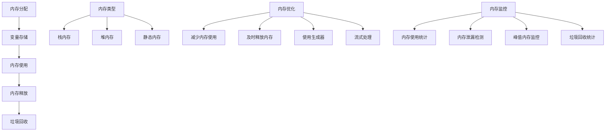

# 内存管理

## 🎯 学习目标
- 掌握PHP内存管理的基本原理
- 理解内存泄漏的识别和预防
- 学会优化内存使用
- 了解垃圾回收机制

## 📚 核心概念

### 内存管理架构



### 内存管理对比

| 内存类型 | 描述 | 生命周期 | 管理方式 | 性能 |
|----------|------|----------|----------|------|
| 栈内存 | 局部变量存储 | 函数执行期间 | 自动管理 | 高 |
| 堆内存 | 动态分配内存 | 手动控制 | 手动管理 | 中 |
| 静态内存 | 全局变量存储 | 程序执行期间 | 自动管理 | 高 |
| 共享内存 | 进程间共享 | 手动控制 | 手动管理 | 高 |

## 🔧 内存管理实现

### 内存管理器
```php
<?php
// 1. 内存管理器类
class MemoryManager {
    private $memoryUsage;
    private $peakMemory;
    private $allocations;
    private $deallocations;
    
    public function __construct() {
        $this->memoryUsage = memory_get_usage();
        $this->peakMemory = memory_get_peak_usage();
        $this->allocations = 0;
        $this->deallocations = 0;
    }
    
    // 开始内存监控
    public function startMonitoring() {
        $this->memoryUsage = memory_get_usage();
        $this->peakMemory = memory_get_peak_usage();
        $this->allocations = 0;
        $this->deallocations = 0;
    }
    
    // 记录内存分配
    public function recordAllocation($size = null) {
        $this->allocations++;
        $currentMemory = memory_get_usage();
        
        if ($size) {
            $this->memoryUsage += $size;
        } else {
            $this->memoryUsage = $currentMemory;
        }
        
        if ($currentMemory > $this->peakMemory) {
            $this->peakMemory = $currentMemory;
        }
    }
    
    // 记录内存释放
    public function recordDeallocation($size = null) {
        $this->deallocations++;
        $currentMemory = memory_get_usage();
        
        if ($size) {
            $this->memoryUsage -= $size;
        } else {
            $this->memoryUsage = $currentMemory;
        }
    }
    
    // 获取内存统计
    public function getMemoryStats() {
        $currentMemory = memory_get_usage();
        $currentPeak = memory_get_peak_usage();
        
        return [
            'current_usage' => $currentMemory,
            'peak_usage' => $currentPeak,
            'allocations' => $this->allocations,
            'deallocations' => $this->deallocations,
            'net_allocations' => $this->allocations - $this->deallocations,
            'memory_efficiency' => $this->calculateMemoryEfficiency()
        ];
    }
    
    // 计算内存效率
    private function calculateMemoryEfficiency() {
        if ($this->allocations > 0) {
            return ($this->deallocations / $this->allocations) * 100;
        }
        return 100;
    }
    
    // 强制垃圾回收
    public function forceGarbageCollection() {
        $beforeMemory = memory_get_usage();
        gc_collect_cycles();
        $afterMemory = memory_get_usage();
        
        return [
            'before_memory' => $beforeMemory,
            'after_memory' => $afterMemory,
            'freed_memory' => $beforeMemory - $afterMemory
        ];
    }
    
    // 内存使用报告
    public function generateMemoryReport() {
        $stats = $this->getMemoryStats();
        
        $report = "=== 内存使用报告 ===\n";
        $report .= "当前内存使用: " . $this->formatBytes($stats['current_usage']) . "\n";
        $report .= "峰值内存使用: " . $this->formatBytes($stats['peak_usage']) . "\n";
        $report .= "内存分配次数: {$stats['allocations']}\n";
        $report .= "内存释放次数: {$stats['deallocations']}\n";
        $report .= "净分配次数: {$stats['net_allocations']}\n";
        $report .= "内存效率: " . number_format($stats['memory_efficiency'], 2) . "%\n";
        
        return $report;
    }
    
    // 格式化字节数
    private function formatBytes($bytes) {
        $units = ['B', 'KB', 'MB', 'GB'];
        $unitIndex = 0;
        
        while ($bytes >= 1024 && $unitIndex < count($units) - 1) {
            $bytes /= 1024;
            $unitIndex++;
        }
        
        return number_format($bytes, 2) . ' ' . $units[$unitIndex];
    }
}

// 2. 内存优化器
class MemoryOptimizer {
    private $memoryManager;
    
    public function __construct() {
        $this->memoryManager = new MemoryManager();
    }
    
    // 优化大数组处理
    public function optimizeLargeArrayProcessing($data) {
        $this->memoryManager->startMonitoring();
        
        // 原始方法 - 加载所有数据到内存
        $result1 = [];
        foreach ($data as $item) {
            $result1[] = $item * 2;
        }
        $this->memoryManager->recordAllocation();
        
        // 优化方法 - 使用生成器
        $result2 = [];
        foreach ($this->processArrayGenerator($data) as $item) {
            $result2[] = $item;
        }
        $this->memoryManager->recordDeallocation();
        
        // 进一步优化 - 流式处理
        $result3 = [];
        $this->processArrayStream($data, function($item) use (&$result3) {
            $result3[] = $item * 2;
        });
        $this->memoryManager->recordDeallocation();
        
        return [
            'original' => count($result1),
            'generator' => count($result2),
            'stream' => count($result3),
            'memory_stats' => $this->memoryManager->getMemoryStats()
        ];
    }
    
    // 生成器处理数组
    private function processArrayGenerator($data) {
        foreach ($data as $item) {
            yield $item * 2;
        }
    }
    
    // 流式处理数组
    private function processArrayStream($data, $callback) {
        foreach ($data as $item) {
            $callback($item);
        }
    }
    
    // 优化字符串处理
    public function optimizeStringProcessing($strings) {
        $this->memoryManager->startMonitoring();
        
        // 原始方法 - 字符串拼接
        $result1 = '';
        foreach ($strings as $str) {
            $result1 .= $str . ' ';
        }
        $this->memoryManager->recordAllocation();
        
        // 优化方法 - 使用implode
        $result2 = implode(' ', $strings);
        $this->memoryManager->recordDeallocation();
        
        // 进一步优化 - 使用StringBuilder
        $result3 = $this->buildString($strings);
        $this->memoryManager->recordDeallocation();
        
        return [
            'original' => strlen($result1),
            'implode' => strlen($result2),
            'stringbuilder' => strlen($result3),
            'memory_stats' => $this->memoryManager->getMemoryStats()
        ];
    }
    
    // 字符串构建器
    private function buildString($strings) {
        $buffer = [];
        foreach ($strings as $str) {
            $buffer[] = $str;
        }
        return implode(' ', $buffer);
    }
    
    // 优化对象处理
    public function optimizeObjectProcessing($objects) {
        $this->memoryManager->startMonitoring();
        
        // 原始方法 - 创建新对象
        $result1 = [];
        foreach ($objects as $obj) {
            $result1[] = new stdClass();
        }
        $this->memoryManager->recordAllocation();
        
        // 优化方法 - 对象池
        $result2 = [];
        $objectPool = new ObjectPool();
        foreach ($objects as $obj) {
            $result2[] = $objectPool->getObject();
        }
        $this->memoryManager->recordDeallocation();
        
        // 进一步优化 - 复用对象
        $result3 = [];
        $reusableObject = new stdClass();
        foreach ($objects as $obj) {
            $reusableObject->data = $obj;
            $result3[] = clone $reusableObject;
        }
        $this->memoryManager->recordDeallocation();
        
        return [
            'original' => count($result1),
            'object_pool' => count($result2),
            'reusable' => count($result3),
            'memory_stats' => $this->memoryManager->getMemoryStats()
        ];
    }
    
    // 优化文件处理
    public function optimizeFileProcessing($filename) {
        $this->memoryManager->startMonitoring();
        
        // 原始方法 - 读取整个文件
        $content1 = file_get_contents($filename);
        $this->memoryManager->recordAllocation();
        
        // 优化方法 - 逐行读取
        $content2 = '';
        $handle = fopen($filename, 'r');
        while (($line = fgets($handle)) !== false) {
            $content2 .= $line;
        }
        fclose($handle);
        $this->memoryManager->recordDeallocation();
        
        // 进一步优化 - 流式处理
        $content3 = '';
        $this->processFileStream($filename, function($line) use (&$content3) {
            $content3 .= $line;
        });
        $this->memoryManager->recordDeallocation();
        
        return [
            'original' => strlen($content1),
            'line_by_line' => strlen($content2),
            'stream' => strlen($content3),
            'memory_stats' => $this->memoryManager->getMemoryStats()
        ];
    }
    
    // 流式文件处理
    private function processFileStream($filename, $callback) {
        $handle = fopen($filename, 'r');
        while (($line = fgets($handle)) !== false) {
            $callback($line);
        }
        fclose($handle);
    }
    
    // 获取优化报告
    public function getOptimizationReport() {
        return $this->memoryManager->generateMemoryReport();
    }
}

// 3. 对象池
class ObjectPool {
    private $pool;
    private $maxSize;
    
    public function __construct($maxSize = 100) {
        $this->pool = [];
        $this->maxSize = $maxSize;
    }
    
    // 获取对象
    public function getObject() {
        if (!empty($this->pool)) {
            return array_pop($this->pool);
        }
        
        return new stdClass();
    }
    
    // 归还对象
    public function returnObject($object) {
        if (count($this->pool) < $this->maxSize) {
            $this->pool[] = $object;
        }
    }
    
    // 获取池状态
    public function getPoolStats() {
        return [
            'pool_size' => count($this->pool),
            'max_size' => $this->maxSize,
            'utilization' => (count($this->pool) / $this->maxSize) * 100
        ];
    }
}

// 4. 内存泄漏检测器
class MemoryLeakDetector {
    private $snapshots;
    private $threshold;
    
    public function __construct($threshold = 0.1) {
        $this->snapshots = [];
        $this->threshold = $threshold; // 10%增长阈值
    }
    
    // 创建内存快照
    public function createSnapshot($label) {
        $snapshot = [
            'label' => $label,
            'memory_usage' => memory_get_usage(),
            'peak_memory' => memory_get_peak_usage(),
            'timestamp' => microtime(true)
        ];
        
        $this->snapshots[] = $snapshot;
        return $snapshot;
    }
    
    // 检测内存泄漏
    public function detectLeaks() {
        $leaks = [];
        
        for ($i = 1; $i < count($this->snapshots); $i++) {
            $current = $this->snapshots[$i];
            $previous = $this->snapshots[$i - 1];
            
            $memoryGrowth = $current['memory_usage'] - $previous['memory_usage'];
            $growthPercentage = ($memoryGrowth / $previous['memory_usage']) * 100;
            
            if ($growthPercentage > $this->threshold * 100) {
                $leaks[] = [
                    'from' => $previous['label'],
                    'to' => $current['label'],
                    'memory_growth' => $memoryGrowth,
                    'growth_percentage' => $growthPercentage,
                    'severity' => $this->getLeakSeverity($growthPercentage)
                ];
            }
        }
        
        return $leaks;
    }
    
    // 获取泄漏严重程度
    private function getLeakSeverity($growthPercentage) {
        if ($growthPercentage > 50) {
            return 'CRITICAL';
        } elseif ($growthPercentage > 20) {
            return 'HIGH';
        } elseif ($growthPercentage > 10) {
            return 'MEDIUM';
        } else {
            return 'LOW';
        }
    }
    
    // 生成泄漏报告
    public function generateLeakReport() {
        $leaks = $this->detectLeaks();
        
        if (empty($leaks)) {
            return "未检测到内存泄漏\n";
        }
        
        $report = "=== 内存泄漏检测报告 ===\n";
        $report .= "检测到 " . count($leaks) . " 个潜在内存泄漏:\n\n";
        
        foreach ($leaks as $leak) {
            $report .= "泄漏点: {$leak['from']} → {$leak['to']}\n";
            $report .= "内存增长: " . $this->formatBytes($leak['memory_growth']) . "\n";
            $report .= "增长百分比: " . number_format($leak['growth_percentage'], 2) . "%\n";
            $report .= "严重程度: {$leak['severity']}\n\n";
        }
        
        return $report;
    }
    
    // 格式化字节数
    private function formatBytes($bytes) {
        $units = ['B', 'KB', 'MB', 'GB'];
        $unitIndex = 0;
        
        while ($bytes >= 1024 && $unitIndex < count($units) - 1) {
            $bytes /= 1024;
            $unitIndex++;
        }
        
        return number_format($bytes, 2) . ' ' . $units[$unitIndex];
    }
}

// 使用示例
echo "=== 内存管理示例 ===\n";

try {
    // 创建内存优化器
    $optimizer = new MemoryOptimizer();
    
    // 测试大数组处理
    echo "大数组处理优化测试:\n";
    $largeArray = range(1, 10000);
    $arrayResults = $optimizer->optimizeLargeArrayProcessing($largeArray);
    echo "原始方法: {$arrayResults['original']} 项\n";
    echo "生成器方法: {$arrayResults['generator']} 项\n";
    echo "流式处理方法: {$arrayResults['stream']} 项\n";
    echo $optimizer->getOptimizationReport();
    
    // 测试字符串处理
    echo "\n字符串处理优化测试:\n";
    $testStrings = array_fill(0, 1000, 'test string');
    $stringResults = $optimizer->optimizeStringProcessing($testStrings);
    echo "原始方法: {$stringResults['original']} 字符\n";
    echo "implode方法: {$stringResults['implode']} 字符\n";
    echo "StringBuilder方法: {$stringResults['stringbuilder']} 字符\n";
    echo $optimizer->getOptimizationReport();
    
    // 测试对象处理
    echo "\n对象处理优化测试:\n";
    $testObjects = range(1, 1000);
    $objectResults = $optimizer->optimizeObjectProcessing($testObjects);
    echo "原始方法: {$objectResults['original']} 对象\n";
    echo "对象池方法: {$objectResults['object_pool']} 对象\n";
    echo "复用对象方法: {$objectResults['reusable']} 对象\n";
    echo $optimizer->getOptimizationReport();
    
    // 内存泄漏检测
    echo "\n内存泄漏检测测试:\n";
    $detector = new MemoryLeakDetector();
    
    $detector->createSnapshot('初始状态');
    
    // 模拟内存泄漏
    $leakyData = [];
    for ($i = 0; $i < 1000; $i++) {
        $leakyData[] = str_repeat('x', 1000);
    }
    $detector->createSnapshot('创建大量数据');
    
    // 模拟内存释放
    unset($leakyData);
    $detector->createSnapshot('释放数据');
    
    echo $detector->generateLeakReport();
    
} catch (Exception $e) {
    echo "错误: " . $e->getMessage() . "\n";
}
?>
```

### 垃圾回收优化
```php
<?php
// 1. 垃圾回收管理器
class GarbageCollectionManager {
    private $gcStats;
    private $gcThreshold;
    
    public function __construct() {
        $this->gcStats = [
            'cycles_collected' => 0,
            'total_memory_freed' => 0,
            'gc_time' => 0
        ];
        $this->gcThreshold = 10000; // 10MB阈值
    }
    
    // 智能垃圾回收
    public function smartGarbageCollection() {
        $currentMemory = memory_get_usage();
        
        // 检查是否需要垃圾回收
        if ($currentMemory > $this->gcThreshold) {
            return $this->forceGarbageCollection();
        }
        
        return [
            'gc_performed' => false,
            'reason' => '内存使用未达到阈值',
            'current_memory' => $currentMemory,
            'threshold' => $this->gcThreshold
        ];
    }
    
    // 强制垃圾回收
    public function forceGarbageCollection() {
        $startTime = microtime(true);
        $beforeMemory = memory_get_usage();
        
        $cyclesCollected = gc_collect_cycles();
        
        $endTime = microtime(true);
        $afterMemory = memory_get_usage();
        
        $memoryFreed = $beforeMemory - $afterMemory;
        $gcTime = $endTime - $startTime;
        
        // 更新统计信息
        $this->gcStats['cycles_collected'] += $cyclesCollected;
        $this->gcStats['total_memory_freed'] += $memoryFreed;
        $this->gcStats['gc_time'] += $gcTime;
        
        return [
            'gc_performed' => true,
            'cycles_collected' => $cyclesCollected,
            'memory_freed' => $memoryFreed,
            'gc_time' => $gcTime,
            'before_memory' => $beforeMemory,
            'after_memory' => $afterMemory
        ];
    }
    
    // 设置垃圾回收阈值
    public function setGCThreshold($threshold) {
        $this->gcThreshold = $threshold;
    }
    
    // 获取垃圾回收统计
    public function getGCStats() {
        return array_merge($this->gcStats, [
            'current_memory' => memory_get_usage(),
            'peak_memory' => memory_get_peak_usage(),
            'gc_threshold' => $this->gcThreshold
        ]);
    }
    
    // 生成垃圾回收报告
    public function generateGCReport() {
        $stats = $this->getGCStats();
        
        $report = "=== 垃圾回收报告 ===\n";
        $report .= "当前内存使用: " . $this->formatBytes($stats['current_memory']) . "\n";
        $report .= "峰值内存使用: " . $this->formatBytes($stats['peak_memory']) . "\n";
        $report .= "垃圾回收阈值: " . $this->formatBytes($stats['gc_threshold']) . "\n";
        $report .= "回收周期数: {$stats['cycles_collected']}\n";
        $report .= "释放内存总量: " . $this->formatBytes($stats['total_memory_freed']) . "\n";
        $report .= "垃圾回收总时间: " . number_format($stats['gc_time'], 4) . " 秒\n";
        
        if ($stats['gc_time'] > 0) {
            $report .= "平均每次回收时间: " . number_format($stats['gc_time'] / max(1, $stats['cycles_collected']), 4) . " 秒\n";
        }
        
        return $report;
    }
    
    // 格式化字节数
    private function formatBytes($bytes) {
        $units = ['B', 'KB', 'MB', 'GB'];
        $unitIndex = 0;
        
        while ($bytes >= 1024 && $unitIndex < count($units) - 1) {
            $bytes /= 1024;
            $unitIndex++;
        }
        
        return number_format($bytes, 2) . ' ' . $units[$unitIndex];
    }
}

// 2. 内存池管理器
class MemoryPoolManager {
    private $pools;
    private $maxPoolSize;
    
    public function __construct($maxPoolSize = 1000) {
        $this->pools = [];
        $this->maxPoolSize = $maxPoolSize;
    }
    
    // 创建内存池
    public function createPool($name, $size) {
        $this->pools[$name] = [
            'size' => $size,
            'used' => 0,
            'free' => $size,
            'allocations' => 0,
            'deallocations' => 0
        ];
    }
    
    // 从池中分配内存
    public function allocateFromPool($poolName, $size) {
        if (!isset($this->pools[$poolName])) {
            throw new InvalidArgumentException("内存池 $poolName 不存在");
        }
        
        $pool = &$this->pools[$poolName];
        
        if ($pool['free'] >= $size) {
            $pool['used'] += $size;
            $pool['free'] -= $size;
            $pool['allocations']++;
            
            return [
                'success' => true,
                'allocated_size' => $size,
                'remaining_free' => $pool['free']
            ];
        }
        
        return [
            'success' => false,
            'reason' => '内存池空间不足',
            'requested_size' => $size,
            'available_size' => $pool['free']
        ];
    }
    
    // 释放内存到池
    public function deallocateToPool($poolName, $size) {
        if (!isset($this->pools[$poolName])) {
            throw new InvalidArgumentException("内存池 $poolName 不存在");
        }
        
        $pool = &$this->pools[$poolName];
        
        $pool['used'] -= $size;
        $pool['free'] += $size;
        $pool['deallocations']++;
        
        return [
            'success' => true,
            'deallocated_size' => $size,
            'remaining_free' => $pool['free']
        ];
    }
    
    // 获取池状态
    public function getPoolStatus($poolName = null) {
        if ($poolName) {
            return $this->pools[$poolName] ?? null;
        }
        
        return $this->pools;
    }
    
    // 清理内存池
    public function cleanupPool($poolName) {
        if (isset($this->pools[$poolName])) {
            unset($this->pools[$poolName]);
            return true;
        }
        
        return false;
    }
    
    // 生成内存池报告
    public function generatePoolReport() {
        $report = "=== 内存池报告 ===\n";
        
        foreach ($this->pools as $name => $pool) {
            $report .= "池名称: $name\n";
            $report .= "  总大小: " . $this->formatBytes($pool['size']) . "\n";
            $report .= "  已使用: " . $this->formatBytes($pool['used']) . "\n";
            $report .= "  剩余: " . $this->formatBytes($pool['free']) . "\n";
            $report .= "  使用率: " . number_format(($pool['used'] / $pool['size']) * 100, 2) . "%\n";
            $report .= "  分配次数: {$pool['allocations']}\n";
            $report .= "  释放次数: {$pool['deallocations']}\n\n";
        }
        
        return $report;
    }
    
    // 格式化字节数
    private function formatBytes($bytes) {
        $units = ['B', 'KB', 'MB', 'GB'];
        $unitIndex = 0;
        
        while ($bytes >= 1024 && $unitIndex < count($units) - 1) {
            $bytes /= 1024;
            $unitIndex++;
        }
        
        return number_format($bytes, 2) . ' ' . $units[$unitIndex];
    }
}

// 使用示例
echo "=== 垃圾回收和内存池示例 ===\n";

try {
    // 垃圾回收管理器测试
    echo "垃圾回收管理器测试:\n";
    $gcManager = new GarbageCollectionManager();
    
    // 设置较低的阈值进行测试
    $gcManager->setGCThreshold(1024 * 1024); // 1MB
    
    // 创建一些数据
    $data = [];
    for ($i = 0; $i < 1000; $i++) {
        $data[] = str_repeat('x', 1000);
    }
    
    // 智能垃圾回收
    $gcResult = $gcManager->smartGarbageCollection();
    echo "垃圾回收结果: " . json_encode($gcResult) . "\n";
    
    // 释放数据
    unset($data);
    
    // 强制垃圾回收
    $forceGCResult = $gcManager->forceGarbageCollection();
    echo "强制垃圾回收结果: " . json_encode($forceGCResult) . "\n";
    
    echo $gcManager->generateGCReport();
    
    // 内存池管理器测试
    echo "\n内存池管理器测试:\n";
    $poolManager = new MemoryPoolManager();
    
    // 创建内存池
    $poolManager->createPool('test_pool', 1024 * 1024); // 1MB
    
    // 分配内存
    $allocation1 = $poolManager->allocateFromPool('test_pool', 512 * 1024); // 512KB
    echo "分配1: " . json_encode($allocation1) . "\n";
    
    $allocation2 = $poolManager->allocateFromPool('test_pool', 256 * 1024); // 256KB
    echo "分配2: " . json_encode($allocation2) . "\n";
    
    // 释放内存
    $deallocation1 = $poolManager->deallocateToPool('test_pool', 256 * 1024);
    echo "释放1: " . json_encode($deallocation1) . "\n";
    
    echo $poolManager->generatePoolReport();
    
} catch (Exception $e) {
    echo "错误: " . $e->getMessage() . "\n";
}
?>
```

## 📊 最佳实践

### 内存管理最佳实践
```php
<?php
// 内存管理最佳实践

class MemoryManagementBestPractices {
    // 1. 内存优化策略
    public static function getMemoryOptimizationStrategies() {
        return [
            '减少内存使用' => [
                '使用生成器' => '避免一次性加载大量数据到内存',
                '流式处理' => '逐块处理数据，及时释放内存',
                '对象池' => '复用对象，减少对象创建开销',
                '延迟加载' => '按需加载数据，避免预加载'
            ],
            '及时释放内存' => [
                'unset()' => '及时释放不再使用的变量',
                'null赋值' => '将变量设置为null释放引用',
                '数组清理' => '使用array_splice()清理数组元素',
                '对象销毁' => '实现__destruct()方法清理资源'
            ],
            '内存监控' => [
                '内存使用统计' => '定期检查memory_get_usage()',
                '峰值内存监控' => '监控memory_get_peak_usage()',
                '内存泄漏检测' => '使用内存快照对比检测泄漏',
                '垃圾回收统计' => '监控gc_collect_cycles()效果'
            ],
            '配置优化' => [
                '内存限制' => '合理设置memory_limit',
                '垃圾回收' => '调整垃圾回收参数',
                'OPcache' => '启用OPcache减少内存使用',
                '扩展管理' => '禁用不必要的PHP扩展'
            ]
        ];
    }
    
    // 2. 常见内存问题
    public static function getCommonMemoryIssues() {
        return [
            '内存泄漏' => [
                '问题' => '内存使用持续增长不释放',
                '原因' => '循环引用、全局变量、静态变量',
                '解决方案' => '使用弱引用、及时清理、避免循环引用'
            ],
            '内存碎片' => [
                '问题' => '内存分配和释放导致碎片化',
                '原因' => '频繁的小块内存分配',
                '解决方案' => '使用内存池、批量分配、对象复用'
            ],
            '大对象' => [
                '问题' => '单个对象占用大量内存',
                '原因' => '数据结构设计不合理',
                '解决方案' => '对象拆分、延迟加载、流式处理'
            ],
            '数组膨胀' => [
                '问题' => '数组占用内存过大',
                '原因' => '存储大量数据、重复数据',
                '解决方案' => '使用生成器、数据压缩、索引优化'
            ]
        ];
    }
    
    // 3. 内存优化技巧
    public static function getMemoryOptimizationTips() {
        return [
            '数据结构优化' => [
                '选择合适的数据结构' => '根据使用场景选择最优结构',
                '避免嵌套结构' => '减少深层嵌套降低内存开销',
                '使用Spl数据结构' => 'SplFixedArray等高效结构',
                '压缩存储' => '使用序列化、压缩减少存储空间'
            ],
            '变量管理' => [
                '及时unset' => '不再使用的变量及时释放',
                '避免全局变量' => '减少全局变量的使用',
                '使用引用' => '大对象使用引用传递',
                '变量作用域' => '合理控制变量作用域'
            ],
            '函数优化' => [
                '减少参数传递' => '避免传递大对象作为参数',
                '返回值优化' => '避免返回大对象',
                '递归优化' => '避免深度递归导致栈溢出',
                '闭包管理' => '及时释放闭包引用'
            ],
            '文件处理' => [
                '流式读取' => '使用fgets()逐行读取',
                '分块处理' => '大文件分块处理',
                '及时关闭' => '文件句柄及时关闭',
                '内存映射' => '使用mmap()处理大文件'
            ]
        ];
    }
    
    // 4. 内存监控工具
    public static function getMemoryMonitoringTools() {
        return [
            'PHP内置函数' => [
                'memory_get_usage()' => '获取当前内存使用量',
                'memory_get_peak_usage()' => '获取峰值内存使用量',
                'memory_limit' => '获取内存限制设置',
                'gc_collect_cycles()' => '强制垃圾回收'
            ],
            '第三方工具' => [
                'Xdebug' => '内存分析和调试',
                'Blackfire' => '性能分析和内存监控',
                'XHProf' => '函数级性能分析',
                'Valgrind' => '内存泄漏检测'
            ],
            '系统工具' => [
                'htop' => '系统资源监控',
                'free' => '内存使用统计',
                'ps' => '进程内存使用',
                'pmap' => '进程内存映射'
            ],
            '自定义监控' => [
                '内存快照' => '定期创建内存使用快照',
                '内存趋势' => '分析内存使用趋势',
                '泄漏检测' => '对比快照检测泄漏',
                '告警机制' => '内存使用超阈值告警'
            ]
        ];
    }
}

// 使用示例
echo "=== 内存管理最佳实践示例 ===\n";

try {
    // 内存优化策略
    $strategies = MemoryManagementBestPractices::getMemoryOptimizationStrategies();
    echo "内存优化策略:\n";
    foreach ($strategies as $category => $items) {
        echo "  $category:\n";
        foreach ($items as $item => $description) {
            echo "    - $item: $description\n";
        }
        echo "\n";
    }
    
    // 常见内存问题
    $issues = MemoryManagementBestPractices::getCommonMemoryIssues();
    echo "常见内存问题:\n";
    foreach ($issues as $issue => $info) {
        echo "  $issue:\n";
        foreach ($info as $key => $value) {
            echo "    $key: $value\n";
        }
        echo "\n";
    }
    
    // 内存优化技巧
    $tips = MemoryManagementBestPractices::getMemoryOptimizationTips();
    echo "内存优化技巧:\n";
    foreach ($tips as $category => $items) {
        echo "  $category:\n";
        foreach ($items as $item => $description) {
            echo "    - $item: $description\n";
        }
        echo "\n";
    }
    
    // 内存监控工具
    $tools = MemoryManagementBestPractices::getMemoryMonitoringTools();
    echo "内存监控工具:\n";
    foreach ($tools as $category => $items) {
        echo "  $category:\n";
        foreach ($items as $item => $description) {
            echo "    - $item: $description\n";
        }
        echo "\n";
    }
    
} catch (Exception $e) {
    echo "错误: " . $e->getMessage() . "\n";
}
?>
```

## 🎓 学习建议

### 费曼学习法应用
1. **选择概念**: 选择内存管理中的核心概念
2. **简化解释**: 用简单语言解释内存管理的重要性
3. **识别盲点**: 发现理解不深入的地方
4. **重新学习**: 针对盲点进行深入学习

### 刻意练习重点
1. **内存监控**: 掌握内存使用监控方法
2. **内存优化**: 学会各种内存优化技巧
3. **泄漏检测**: 理解内存泄漏的检测和预防
4. **垃圾回收**: 了解垃圾回收机制和优化

## 🔗 相关链接
- [[01-代码优化技巧|代码优化技巧]]
- [[03-缓存策略|缓存策略]]
- [[04-数据库查询优化|数据库查询优化]]
- [[05-服务器配置优化|服务器配置优化]]
- [[06-性能监控指标|性能监控指标]]
