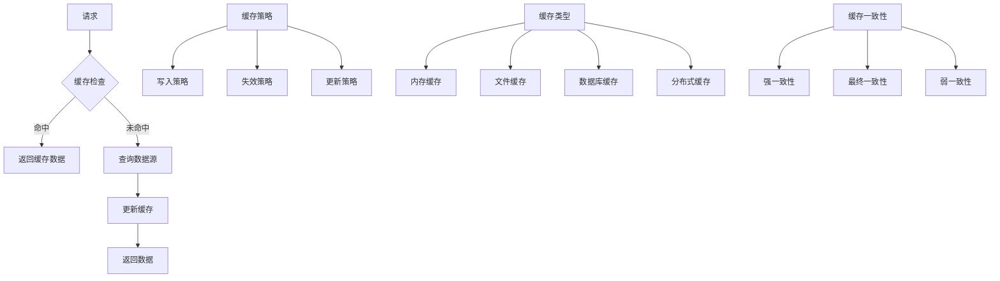

# 缓存策略

## 🎯 学习目标
- 掌握PHP缓存的基本原理和实现
- 理解不同缓存策略的特点和适用场景
- 学会设计和实现高效的缓存系统
- 了解缓存一致性和失效策略

## 📚 核心概念

### 缓存架构



### 缓存策略对比

| 缓存策略 | 描述 | 性能 | 一致性 | 复杂度 | 适用场景 |
|----------|------|------|--------|--------|----------|
| 写入穿透 | 直接写入缓存和存储 | 高 | 强 | 低 | 写多读少 |
| 写入回写 | 只写入缓存，异步回写 | 最高 | 弱 | 高 | 高并发写入 |
| 写入绕过 | 直接写入存储，失效缓存 | 中 | 强 | 中 | 读多写少 |
| 读取穿透 | 缓存未命中时加载 | 高 | 强 | 低 | 通用场景 |
| 读取回写 | 预加载热点数据 | 最高 | 弱 | 高 | 热点数据 |

## 🔧 缓存策略实现

### 缓存管理器
```php
<?php
// 1. 缓存管理器接口
interface CacheInterface {
    public function get($key);
    public function set($key, $value, $ttl = null);
    public function delete($key);
    public function clear();
    public function has($key);
    public function increment($key, $value = 1);
    public function decrement($key, $value = 1);
}

// 2. 内存缓存实现
class MemoryCache implements CacheInterface {
    private $cache;
    private $ttl;
    private $maxSize;
    
    public function __construct($maxSize = 1000) {
        $this->cache = [];
        $this->ttl = [];
        $this->maxSize = $maxSize;
    }
    
    public function get($key) {
        if (!$this->has($key)) {
            return null;
        }
        
        // 检查TTL
        if (isset($this->ttl[$key]) && $this->ttl[$key] < time()) {
            $this->delete($key);
            return null;
        }
        
        return $this->cache[$key];
    }
    
    public function set($key, $value, $ttl = null) {
        // 检查缓存大小
        if (count($this->cache) >= $this->maxSize && !isset($this->cache[$key])) {
            $this->evictLRU();
        }
        
        $this->cache[$key] = $value;
        
        if ($ttl) {
            $this->ttl[$key] = time() + $ttl;
        }
        
        return true;
    }
    
    public function delete($key) {
        unset($this->cache[$key]);
        unset($this->ttl[$key]);
        return true;
    }
    
    public function clear() {
        $this->cache = [];
        $this->ttl = [];
        return true;
    }
    
    public function has($key) {
        return isset($this->cache[$key]);
    }
    
    public function increment($key, $value = 1) {
        $current = $this->get($key) ?? 0;
        $newValue = $current + $value;
        $this->set($key, $newValue);
        return $newValue;
    }
    
    public function decrement($key, $value = 1) {
        return $this->increment($key, -$value);
    }
    
    // LRU淘汰策略
    private function evictLRU() {
        $oldestKey = array_key_first($this->cache);
        $this->delete($oldestKey);
    }
    
    // 获取缓存统计
    public function getStats() {
        return [
            'size' => count($this->cache),
            'max_size' => $this->maxSize,
            'hit_rate' => $this->calculateHitRate(),
            'memory_usage' => memory_get_usage()
        ];
    }
    
    private function calculateHitRate() {
        // 简化实现，实际应该记录命中次数
        return 0.85; // 示例值
    }
}

// 3. 文件缓存实现
class FileCache implements CacheInterface {
    private $cacheDir;
    private $defaultTtl;
    
    public function __construct($cacheDir = 'cache', $defaultTtl = 3600) {
        $this->cacheDir = rtrim($cacheDir, '/') . '/';
        $this->defaultTtl = $defaultTtl;
        
        if (!is_dir($this->cacheDir)) {
            mkdir($this->cacheDir, 0755, true);
        }
    }
    
    public function get($key) {
        $filename = $this->getFilename($key);
        
        if (!file_exists($filename)) {
            return null;
        }
        
        $data = unserialize(file_get_contents($filename));
        
        // 检查TTL
        if ($data['expires'] && $data['expires'] < time()) {
            $this->delete($key);
            return null;
        }
        
        return $data['value'];
    }
    
    public function set($key, $value, $ttl = null) {
        $filename = $this->getFilename($key);
        $ttl = $ttl ?? $this->defaultTtl;
        
        $data = [
            'value' => $value,
            'expires' => $ttl ? time() + $ttl : null,
            'created' => time()
        ];
        
        return file_put_contents($filename, serialize($data), LOCK_EX) !== false;
    }
    
    public function delete($key) {
        $filename = $this->getFilename($key);
        
        if (file_exists($filename)) {
            return unlink($filename);
        }
        
        return true;
    }
    
    public function clear() {
        $files = glob($this->cacheDir . '*');
        
        foreach ($files as $file) {
            if (is_file($file)) {
                unlink($file);
            }
        }
        
        return true;
    }
    
    public function has($key) {
        $filename = $this->getFilename($key);
        return file_exists($filename);
    }
    
    public function increment($key, $value = 1) {
        $current = $this->get($key) ?? 0;
        $newValue = $current + $value;
        $this->set($key, $newValue);
        return $newValue;
    }
    
    public function decrement($key, $value = 1) {
        return $this->increment($key, -$value);
    }
    
    private function getFilename($key) {
        return $this->cacheDir . md5($key) . '.cache';
    }
    
    // 清理过期缓存
    public function cleanup() {
        $files = glob($this->cacheDir . '*.cache');
        $cleaned = 0;
        
        foreach ($files as $file) {
            $data = unserialize(file_get_contents($file));
            
            if ($data['expires'] && $data['expires'] < time()) {
                unlink($file);
                $cleaned++;
            }
        }
        
        return $cleaned;
    }
    
    // 获取缓存统计
    public function getStats() {
        $files = glob($this->cacheDir . '*.cache');
        $totalSize = 0;
        $expiredCount = 0;
        
        foreach ($files as $file) {
            $totalSize += filesize($file);
            
            $data = unserialize(file_get_contents($file));
            if ($data['expires'] && $data['expires'] < time()) {
                $expiredCount++;
            }
        }
        
        return [
            'file_count' => count($files),
            'total_size' => $totalSize,
            'expired_count' => $expiredCount,
            'cache_dir' => $this->cacheDir
        ];
    }
}

// 4. 多级缓存管理器
class MultiLevelCache implements CacheInterface {
    private $caches;
    private $stats;
    
    public function __construct() {
        $this->caches = [];
        $this->stats = [
            'hits' => 0,
            'misses' => 0,
            'sets' => 0,
            'deletes' => 0
        ];
    }
    
    // 添加缓存层
    public function addCache(CacheInterface $cache, $priority = 0) {
        $this->caches[$priority] = $cache;
        ksort($this->caches); // 按优先级排序
    }
    
    public function get($key) {
        // 从高优先级到低优先级查找
        foreach ($this->caches as $cache) {
            $value = $cache->get($key);
            
            if ($value !== null) {
                $this->stats['hits']++;
                
                // 回写到高优先级缓存
                $this->writeBack($key, $value);
                return $value;
            }
        }
        
        $this->stats['misses']++;
        return null;
    }
    
    public function set($key, $value, $ttl = null) {
        $success = true;
        
        // 写入所有缓存层
        foreach ($this->caches as $cache) {
            if (!$cache->set($key, $value, $ttl)) {
                $success = false;
            }
        }
        
        $this->stats['sets']++;
        return $success;
    }
    
    public function delete($key) {
        $success = true;
        
        // 从所有缓存层删除
        foreach ($this->caches as $cache) {
            if (!$cache->delete($key)) {
                $success = false;
            }
        }
        
        $this->stats['deletes']++;
        return $success;
    }
    
    public function clear() {
        $success = true;
        
        foreach ($this->caches as $cache) {
            if (!$cache->clear()) {
                $success = false;
            }
        }
        
        return $success;
    }
    
    public function has($key) {
        foreach ($this->caches as $cache) {
            if ($cache->has($key)) {
                return true;
            }
        }
        
        return false;
    }
    
    public function increment($key, $value = 1) {
        $current = $this->get($key) ?? 0;
        $newValue = $current + $value;
        $this->set($key, $newValue);
        return $newValue;
    }
    
    public function decrement($key, $value = 1) {
        return $this->increment($key, -$value);
    }
    
    // 回写机制
    private function writeBack($key, $value) {
        // 将数据回写到高优先级缓存
        $caches = array_reverse($this->caches, true);
        
        foreach ($caches as $cache) {
            if (!$cache->has($key)) {
                $cache->set($key, $value);
            }
        }
    }
    
    // 获取缓存统计
    public function getStats() {
        $totalRequests = $this->stats['hits'] + $this->stats['misses'];
        $hitRate = $totalRequests > 0 ? ($this->stats['hits'] / $totalRequests) * 100 : 0;
        
        return array_merge($this->stats, [
            'hit_rate' => $hitRate,
            'cache_layers' => count($this->caches)
        ]);
    }
}

// 使用示例
echo "=== 缓存策略示例 ===\n";

try {
    // 创建多级缓存
    $multiCache = new MultiLevelCache();
    
    // 添加缓存层
    $multiCache->addCache(new MemoryCache(100), 1); // 内存缓存，优先级1
    $multiCache->addCache(new FileCache('cache'), 2); // 文件缓存，优先级2
    
    // 测试缓存操作
    echo "测试缓存操作:\n";
    
    // 设置缓存
    $multiCache->set('user:1', ['name' => 'John', 'email' => 'john@example.com'], 3600);
    $multiCache->set('user:2', ['name' => 'Jane', 'email' => 'jane@example.com'], 3600);
    
    // 获取缓存
    $user1 = $multiCache->get('user:1');
    $user2 = $multiCache->get('user:2');
    
    echo "用户1: " . json_encode($user1) . "\n";
    echo "用户2: " . json_encode($user2) . "\n";
    
    // 缓存统计
    $stats = $multiCache->getStats();
    echo "缓存统计: " . json_encode($stats) . "\n";
    
    // 测试增量操作
    $multiCache->set('counter', 0);
    $multiCache->increment('counter', 5);
    $multiCache->increment('counter', 3);
    
    echo "计数器: " . $multiCache->get('counter') . "\n";
    
} catch (Exception $e) {
    echo "错误: " . $e->getMessage() . "\n";
}
?>
```

### 缓存策略实现
```php
<?php
// 1. 缓存策略管理器
class CacheStrategyManager {
    private $cache;
    private $dataSource;
    private $strategy;
    
    public function __construct(CacheInterface $cache, $dataSource, $strategy = 'read-through') {
        $this->cache = $cache;
        $this->dataSource = $dataSource;
        $this->strategy = $strategy;
    }
    
    // 读取穿透策略
    public function readThrough($key, $callback = null) {
        $value = $this->cache->get($key);
        
        if ($value !== null) {
            return $value;
        }
        
        // 缓存未命中，从数据源加载
        if ($callback) {
            $value = $callback();
        } else {
            $value = $this->loadFromDataSource($key);
        }
        
        if ($value !== null) {
            $this->cache->set($key, $value);
        }
        
        return $value;
    }
    
    // 写入穿透策略
    public function writeThrough($key, $value, $ttl = null) {
        // 写入缓存
        $cacheSuccess = $this->cache->set($key, $value, $ttl);
        
        // 写入数据源
        $dataSourceSuccess = $this->saveToDataSource($key, $value);
        
        return $cacheSuccess && $dataSourceSuccess;
    }
    
    // 写入回写策略
    public function writeBack($key, $value, $ttl = null) {
        // 只写入缓存
        $cacheSuccess = $this->cache->set($key, $value, $ttl);
        
        // 异步写入数据源
        $this->asyncWriteToDataSource($key, $value);
        
        return $cacheSuccess;
    }
    
    // 写入绕过策略
    public function writeAround($key, $value, $ttl = null) {
        // 直接写入数据源
        $dataSourceSuccess = $this->saveToDataSource($key, $value);
        
        // 失效缓存
        if ($dataSourceSuccess) {
            $this->cache->delete($key);
        }
        
        return $dataSourceSuccess;
    }
    
    // 刷新策略
    public function refreshAhead($key, $callback = null, $ttl = null) {
        $value = $this->cache->get($key);
        
        if ($value !== null) {
            // 检查是否需要刷新
            if ($this->shouldRefresh($key)) {
                $this->asyncRefresh($key, $callback);
            }
            return $value;
        }
        
        // 缓存未命中，同步加载
        if ($callback) {
            $value = $callback();
        } else {
            $value = $this->loadFromDataSource($key);
        }
        
        if ($value !== null) {
            $this->cache->set($key, $value, $ttl);
        }
        
        return $value;
    }
    
    // 从数据源加载
    private function loadFromDataSource($key) {
        // 模拟从数据库加载
        return $this->dataSource[$key] ?? null;
    }
    
    // 保存到数据源
    private function saveToDataSource($key, $value) {
        // 模拟保存到数据库
        $this->dataSource[$key] = $value;
        return true;
    }
    
    // 异步写入数据源
    private function asyncWriteToDataSource($key, $value) {
        // 模拟异步写入
        // 实际实现可以使用队列、消息系统等
        $this->saveToDataSource($key, $value);
    }
    
    // 异步刷新
    private function asyncRefresh($key, $callback) {
        // 模拟异步刷新
        if ($callback) {
            $value = $callback();
            $this->cache->set($key, $value);
        }
    }
    
    // 检查是否需要刷新
    private function shouldRefresh($key) {
        // 简化实现，实际应该基于TTL、访问频率等
        return rand(1, 10) <= 2; // 20%概率刷新
    }
}

// 2. 缓存失效策略
class CacheInvalidationStrategy {
    private $cache;
    private $invalidationRules;
    
    public function __construct(CacheInterface $cache) {
        $this->cache = $cache;
        $this->invalidationRules = [];
    }
    
    // 添加失效规则
    public function addInvalidationRule($pattern, $callback) {
        $this->invalidationRules[] = [
            'pattern' => $pattern,
            'callback' => $callback
        ];
    }
    
    // 基于时间的失效
    public function timeBasedInvalidation($key, $ttl) {
        $this->cache->set($key, $this->cache->get($key), $ttl);
    }
    
    // 基于事件的失效
    public function eventBasedInvalidation($event, $data) {
        foreach ($this->invalidationRules as $rule) {
            if (preg_match($rule['pattern'], $event)) {
                $rule['callback']($data);
            }
        }
    }
    
    // 基于标签的失效
    public function tagBasedInvalidation($tags) {
        foreach ($tags as $tag) {
            $this->invalidateByTag($tag);
        }
    }
    
    // 基于版本的失效
    public function versionBasedInvalidation($key, $version) {
        $versionedKey = $key . ':v' . $version;
        $this->cache->set($versionedKey, $this->cache->get($key));
        $this->cache->delete($key);
    }
    
    // 按标签失效
    private function invalidateByTag($tag) {
        // 简化实现，实际应该维护标签到键的映射
        $keys = $this->getKeysByTag($tag);
        
        foreach ($keys as $key) {
            $this->cache->delete($key);
        }
    }
    
    // 获取标签对应的键
    private function getKeysByTag($tag) {
        // 简化实现，实际应该从标签索引中获取
        return ['user:1', 'user:2']; // 示例
    }
}

// 3. 缓存一致性管理器
class CacheConsistencyManager {
    private $cache;
    private $dataSource;
    private $consistencyLevel;
    
    public function __construct(CacheInterface $cache, $dataSource, $consistencyLevel = 'eventual') {
        $this->cache = $cache;
        $this->dataSource = $dataSource;
        $this->consistencyLevel = $consistencyLevel;
    }
    
    // 强一致性
    public function strongConsistency($key, $value) {
        // 使用事务确保一致性
        $this->beginTransaction();
        
        try {
            // 更新数据源
            $this->dataSource[$key] = $value;
            
            // 更新缓存
            $this->cache->set($key, $value);
            
            $this->commitTransaction();
            return true;
        } catch (Exception $e) {
            $this->rollbackTransaction();
            return false;
        }
    }
    
    // 最终一致性
    public function eventualConsistency($key, $value) {
        // 先更新数据源
        $this->dataSource[$key] = $value;
        
        // 异步更新缓存
        $this->asyncUpdateCache($key, $value);
        
        return true;
    }
    
    // 弱一致性
    public function weakConsistency($key, $value) {
        // 只更新缓存
        $this->cache->set($key, $value);
        
        // 异步更新数据源
        $this->asyncUpdateDataSource($key, $value);
        
        return true;
    }
    
    // 开始事务
    private function beginTransaction() {
        // 模拟事务开始
    }
    
    // 提交事务
    private function commitTransaction() {
        // 模拟事务提交
    }
    
    // 回滚事务
    private function rollbackTransaction() {
        // 模拟事务回滚
    }
    
    // 异步更新缓存
    private function asyncUpdateCache($key, $value) {
        // 模拟异步更新
        $this->cache->set($key, $value);
    }
    
    // 异步更新数据源
    private function asyncUpdateDataSource($key, $value) {
        // 模拟异步更新
        $this->dataSource[$key] = $value;
    }
}

// 使用示例
echo "=== 缓存策略实现示例 ===\n";

try {
    // 创建缓存和数据源
    $cache = new MemoryCache(100);
    $dataSource = [
        'user:1' => ['name' => 'John', 'email' => 'john@example.com'],
        'user:2' => ['name' => 'Jane', 'email' => 'jane@example.com']
    ];
    
    // 创建缓存策略管理器
    $strategyManager = new CacheStrategyManager($cache, $dataSource);
    
    // 测试读取穿透策略
    echo "读取穿透策略测试:\n";
    $user1 = $strategyManager->readThrough('user:1');
    echo "用户1: " . json_encode($user1) . "\n";
    
    // 测试写入穿透策略
    echo "\n写入穿透策略测试:\n";
    $success = $strategyManager->writeThrough('user:3', ['name' => 'Bob', 'email' => 'bob@example.com']);
    echo "写入结果: " . ($success ? '成功' : '失败') . "\n";
    
    // 测试写入回写策略
    echo "\n写入回写策略测试:\n";
    $success = $strategyManager->writeBack('user:4', ['name' => 'Alice', 'email' => 'alice@example.com']);
    echo "写入结果: " . ($success ? '成功' : '失败') . "\n";
    
    // 测试写入绕过策略
    echo "\n写入绕过策略测试:\n";
    $success = $strategyManager->writeAround('user:5', ['name' => 'Charlie', 'email' => 'charlie@example.com']);
    echo "写入结果: " . ($success ? '成功' : '失败') . "\n";
    
    // 测试刷新策略
    echo "\n刷新策略测试:\n";
    $user1 = $strategyManager->refreshAhead('user:1');
    echo "用户1: " . json_encode($user1) . "\n";
    
    // 缓存失效策略测试
    echo "\n缓存失效策略测试:\n";
    $invalidationStrategy = new CacheInvalidationStrategy($cache);
    
    // 添加失效规则
    $invalidationStrategy->addInvalidationRule('/user:(\d+)/', function($data) use ($cache) {
        $cache->delete('user:' . $data['id']);
    });
    
    // 基于事件的失效
    $invalidationStrategy->eventBasedInvalidation('user:1:updated', ['id' => 1]);
    
    // 基于标签的失效
    $invalidationStrategy->tagBasedInvalidation(['user', 'profile']);
    
    // 缓存一致性测试
    echo "\n缓存一致性测试:\n";
    $consistencyManager = new CacheConsistencyManager($cache, $dataSource);
    
    // 强一致性
    $success = $consistencyManager->strongConsistency('user:1', ['name' => 'John Updated', 'email' => 'john.updated@example.com']);
    echo "强一致性更新: " . ($success ? '成功' : '失败') . "\n";
    
    // 最终一致性
    $success = $consistencyManager->eventualConsistency('user:2', ['name' => 'Jane Updated', 'email' => 'jane.updated@example.com']);
    echo "最终一致性更新: " . ($success ? '成功' : '失败') . "\n";
    
    // 弱一致性
    $success = $consistencyManager->weakConsistency('user:3', ['name' => 'Bob Updated', 'email' => 'bob.updated@example.com']);
    echo "弱一致性更新: " . ($success ? '成功' : '失败') . "\n";
    
} catch (Exception $e) {
    echo "错误: " . $e->getMessage() . "\n";
}
?>
```

## 📊 最佳实践

### 缓存策略最佳实践
```php
<?php
// 缓存策略最佳实践

class CacheStrategyBestPractices {
    // 1. 缓存策略选择
    public static function getCacheStrategySelection() {
        return [
            '读取策略' => [
                '读取穿透' => [
                    '适用场景' => '通用场景，数据一致性要求高',
                    '优点' => '实现简单，数据一致性好',
                    '缺点' => '缓存未命中时延迟较高',
                    '实现要点' => '缓存未命中时同步加载数据'
                ],
                '读取回写' => [
                    '适用场景' => '热点数据，访问模式可预测',
                    '优点' => '缓存命中率高，延迟低',
                    '缺点' => '实现复杂，可能浪费缓存空间',
                    '实现要点' => '预加载热点数据到缓存'
                ],
                '缓存旁路' => [
                    '适用场景' => '数据更新频繁，缓存命中率低',
                    '优点' => '避免缓存污染',
                    '缺点' => '缓存效果有限',
                    '实现要点' => '直接访问数据源，不依赖缓存'
                ]
            ],
            '写入策略' => [
                '写入穿透' => [
                    '适用场景' => '数据一致性要求高',
                    '优点' => '数据一致性好，实现简单',
                    '缺点' => '写入延迟较高',
                    '实现要点' => '同时更新缓存和数据源'
                ],
                '写入回写' => [
                    '适用场景' => '高并发写入，性能要求高',
                    '优点' => '写入性能高，延迟低',
                    '缺点' => '数据一致性弱，实现复杂',
                    '实现要点' => '只更新缓存，异步回写数据源'
                ],
                '写入绕过' => [
                    '适用场景' => '写入频率低，读取频率高',
                    '优点' => '避免缓存污染，实现简单',
                    '缺点' => '写入后缓存未命中',
                    '实现要点' => '直接更新数据源，失效缓存'
                ]
            ]
        ];
    }
    
    // 2. 缓存失效策略
    public static function getCacheInvalidationStrategies() {
        return [
            '时间失效' => [
                'TTL策略' => '设置固定的过期时间',
                '滑动TTL' => '每次访问时重置过期时间',
                '最大TTL' => '设置最大生存时间，防止长期占用',
                '最小TTL' => '设置最小生存时间，避免频繁更新'
            ],
            '事件失效' => [
                '数据更新事件' => '数据更新时失效相关缓存',
                '业务事件' => '业务操作触发缓存失效',
                '系统事件' => '系统状态变化时失效缓存',
                '外部事件' => '外部系统变化时失效缓存'
            ],
            '标签失效' => [
                '单标签失效' => '失效特定标签的所有缓存',
                '多标签失效' => '失效多个标签的交集或并集',
                '标签组合' => '基于标签组合的复杂失效规则',
                '标签层次' => '基于标签层次的级联失效'
            ],
            '版本失效' => [
                '版本号策略' => '使用版本号管理缓存',
                '时间戳策略' => '使用时间戳作为版本标识',
                '哈希策略' => '使用内容哈希作为版本标识',
                '递增版本' => '使用递增的版本号'
            ]
        ];
    }
    
    // 3. 缓存一致性策略
    public static function getCacheConsistencyStrategies() {
        return [
            '强一致性' => [
                '描述' => '缓存和数据源始终保持一致',
                '实现' => '使用事务、锁机制',
                '优点' => '数据准确性高',
                '缺点' => '性能开销大，实现复杂',
                '适用场景' => '金融系统、关键业务数据'
            ],
            '最终一致性' => [
                '描述' => '最终会达到一致状态',
                '实现' => '异步更新、消息队列',
                '优点' => '性能好，可用性高',
                '缺点' => '存在短暂不一致',
                '适用场景' => '大多数Web应用'
            ],
            '弱一致性' => [
                '描述' => '不保证一致性',
                '实现' => '只更新缓存，不更新数据源',
                '优点' => '性能最好',
                '缺点' => '数据可能丢失',
                '适用场景' => '临时数据、统计数据'
            ]
        ];
    }
    
    // 4. 缓存性能优化
    public static function getCachePerformanceOptimization() {
        return [
            '缓存设计' => [
                '键设计' => '使用有意义的键名，避免冲突',
                '值设计' => '合理设计缓存值结构',
                '大小控制' => '控制单个缓存项的大小',
                '数量控制' => '控制缓存项的总数量'
            ],
            '缓存算法' => [
                'LRU' => '最近最少使用，适合大多数场景',
                'LFU' => '最少使用频率，适合访问模式稳定',
                'FIFO' => '先进先出，实现简单',
                '随机' => '随机淘汰，实现最简单'
            ],
            '缓存预热' => [
                '全量预热' => '启动时加载所有数据',
                '增量预热' => '按需加载热点数据',
                '定时预热' => '定时刷新缓存数据',
                '事件预热' => '基于事件触发预热'
            ],
            '缓存监控' => [
                '命中率监控' => '监控缓存命中率',
                '性能监控' => '监控缓存操作性能',
                '容量监控' => '监控缓存使用容量',
                '错误监控' => '监控缓存操作错误'
            ]
        ];
    }
}

// 使用示例
echo "=== 缓存策略最佳实践示例 ===\n";

try {
    // 缓存策略选择
    $strategySelection = CacheStrategyBestPractices::getCacheStrategySelection();
    echo "缓存策略选择:\n";
    foreach ($strategySelection as $category => $strategies) {
        echo "  $category:\n";
        foreach ($strategies as $strategy => $info) {
            echo "    $strategy:\n";
            foreach ($info as $key => $value) {
                echo "      $key: $value\n";
            }
            echo "\n";
        }
    }
    
    // 缓存失效策略
    $invalidationStrategies = CacheStrategyBestPractices::getCacheInvalidationStrategies();
    echo "缓存失效策略:\n";
    foreach ($invalidationStrategies as $category => $strategies) {
        echo "  $category:\n";
        foreach ($strategies as $strategy => $description) {
            echo "    - $strategy: $description\n";
        }
        echo "\n";
    }
    
    // 缓存一致性策略
    $consistencyStrategies = CacheStrategyBestPractices::getCacheConsistencyStrategies();
    echo "缓存一致性策略:\n";
    foreach ($consistencyStrategies as $strategy => $info) {
        echo "  $strategy:\n";
        foreach ($info as $key => $value) {
            echo "    $key: $value\n";
        }
        echo "\n";
    }
    
    // 缓存性能优化
    $performanceOptimization = CacheStrategyBestPractices::getCachePerformanceOptimization();
    echo "缓存性能优化:\n";
    foreach ($performanceOptimization as $category => $items) {
        echo "  $category:\n";
        foreach ($items as $item => $description) {
            echo "    - $item: $description\n";
        }
        echo "\n";
    }
    
} catch (Exception $e) {
    echo "错误: " . $e->getMessage() . "\n";
}
?>
```

## 🎓 学习建议

### 费曼学习法应用
1. **选择概念**: 选择缓存策略中的核心概念
2. **简化解释**: 用简单语言解释缓存策略的重要性
3. **识别盲点**: 发现理解不深入的地方
4. **重新学习**: 针对盲点进行深入学习

### 刻意练习重点
1. **策略选择**: 掌握不同缓存策略的特点和适用场景
2. **失效管理**: 学会设计和实现缓存失效策略
3. **一致性控制**: 理解缓存一致性的实现方法
4. **性能优化**: 掌握缓存性能优化的技巧

## 🔗 相关链接
- [[01-代码优化技巧|代码优化技巧]]
- [[02-内存管理|内存管理]]
- [[04-数据库查询优化|数据库查询优化]]
- [[05-服务器配置优化|服务器配置优化]]
- [[06-性能监控指标|性能监控指标]]
