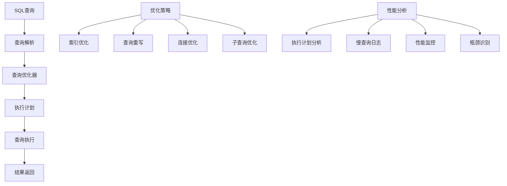

# 数据库查询优化

## 🎯 学习目标
- 掌握数据库查询优化的基本原则和方法
- 理解索引设计和查询计划分析
- 学会识别和解决性能瓶颈
- 了解数据库优化最佳实践

## 📚 核心概念

### 查询优化架构



### 优化策略对比

| 优化策略 | 描述 | 性能提升 | 实施难度 | 风险 |
|----------|------|----------|----------|------|
| 索引优化 | 添加和优化索引 | 高 | 中 | 低 |
| 查询重写 | 重写SQL查询语句 | 中 | 高 | 中 |
| 连接优化 | 优化表连接方式 | 高 | 中 | 低 |
| 子查询优化 | 优化子查询结构 | 中 | 中 | 低 |
| 分页优化 | 优化分页查询 | 中 | 低 | 低 |
| 缓存优化 | 查询结果缓存 | 高 | 低 | 低 |

## 🔧 查询优化实现

### 查询优化器
```php
<?php
// 1. 查询优化器类
class QueryOptimizer {
    private $db;
    private $cache;
    private $slowQueryLog;
    
    public function __construct($db, $cache = null) {
        $this->db = $db;
        $this->cache = $cache;
        $this->slowQueryLog = [];
    }
    
    // 执行优化查询
    public function executeOptimizedQuery($sql, $params = [], $options = []) {
        $startTime = microtime(true);
        
        // 查询缓存检查
        if ($this->cache && $options['use_cache'] ?? true) {
            $cacheKey = $this->generateCacheKey($sql, $params);
            $cachedResult = $this->cache->get($cacheKey);
            
            if ($cachedResult !== null) {
                return $cachedResult;
            }
        }
        
        // 查询优化
        $optimizedSql = $this->optimizeQuery($sql);
        
        // 执行查询
        $result = $this->executeQuery($optimizedSql, $params);
        
        // 记录执行时间
        $executionTime = microtime(true) - $startTime;
        
        // 慢查询记录
        if ($executionTime > ($options['slow_query_threshold'] ?? 1.0)) {
            $this->logSlowQuery($sql, $params, $executionTime);
        }
        
        // 缓存结果
        if ($this->cache && $options['use_cache'] ?? true) {
            $cacheKey = $this->generateCacheKey($sql, $params);
            $this->cache->set($cacheKey, $result, $options['cache_ttl'] ?? 3600);
        }
        
        return $result;
    }
    
    // 优化查询
    private function optimizeQuery($sql) {
        // 移除多余的空格
        $sql = preg_replace('/\s+/', ' ', trim($sql));
        
        // 优化SELECT语句
        if (preg_match('/^SELECT/i', $sql)) {
            $sql = $this->optimizeSelectQuery($sql);
        }
        
        // 优化UPDATE语句
        if (preg_match('/^UPDATE/i', $sql)) {
            $sql = $this->optimizeUpdateQuery($sql);
        }
        
        // 优化DELETE语句
        if (preg_match('/^DELETE/i', $sql)) {
            $sql = $this->optimizeDeleteQuery($sql);
        }
        
        return $sql;
    }
    
    // 优化SELECT查询
    private function optimizeSelectQuery($sql) {
        // 添加LIMIT限制
        if (!preg_match('/LIMIT\s+\d+/i', $sql)) {
            $sql .= ' LIMIT 1000';
        }
        
        // 优化ORDER BY
        $sql = $this->optimizeOrderBy($sql);
        
        // 优化GROUP BY
        $sql = $this->optimizeGroupBy($sql);
        
        return $sql;
    }
    
    // 优化ORDER BY
    private function optimizeOrderBy($sql) {
        // 如果ORDER BY字段没有索引，建议添加
        if (preg_match('/ORDER BY\s+(\w+)/i', $sql, $matches)) {
            $orderField = $matches[1];
            // 这里可以检查索引并给出建议
        }
        
        return $sql;
    }
    
    // 优化GROUP BY
    private function optimizeGroupBy($sql) {
        // 优化GROUP BY子句
        return $sql;
    }
    
    // 优化UPDATE查询
    private function optimizeUpdateQuery($sql) {
        // 添加WHERE条件检查
        if (!preg_match('/WHERE/i', $sql)) {
            // 警告：UPDATE语句缺少WHERE条件
        }
        
        return $sql;
    }
    
    // 优化DELETE查询
    private function optimizeDeleteQuery($sql) {
        // 添加WHERE条件检查
        if (!preg_match('/WHERE/i', $sql)) {
            // 警告：DELETE语句缺少WHERE条件
        }
        
        return $sql;
    }
    
    // 执行查询
    private function executeQuery($sql, $params) {
        try {
            $stmt = $this->db->prepare($sql);
            $stmt->execute($params);
            
            if (preg_match('/^SELECT/i', $sql)) {
                return $stmt->fetchAll(PDO::FETCH_ASSOC);
            }
            
            return $stmt->rowCount();
        } catch (PDOException $e) {
            throw new Exception("查询执行失败: " . $e->getMessage());
        }
    }
    
    // 生成缓存键
    private function generateCacheKey($sql, $params) {
        return 'query:' . md5($sql . serialize($params));
    }
    
    // 记录慢查询
    private function logSlowQuery($sql, $params, $executionTime) {
        $this->slowQueryLog[] = [
            'sql' => $sql,
            'params' => $params,
            'execution_time' => $executionTime,
            'timestamp' => date('Y-m-d H:i:s')
        ];
    }
    
    // 获取慢查询日志
    public function getSlowQueryLog() {
        return $this->slowQueryLog;
    }
    
    // 分析查询性能
    public function analyzeQueryPerformance($sql) {
        $analysis = [
            'sql' => $sql,
            'suggestions' => [],
            'warnings' => [],
            'performance_score' => 100
        ];
        
        // 检查SELECT *
        if (preg_match('/SELECT\s+\*/i', $sql)) {
            $analysis['warnings'][] = '避免使用SELECT *，指定具体字段';
            $analysis['performance_score'] -= 10;
        }
        
        // 检查缺少WHERE条件
        if (preg_match('/^(UPDATE|DELETE)/i', $sql) && !preg_match('/WHERE/i', $sql)) {
            $analysis['warnings'][] = 'UPDATE/DELETE语句缺少WHERE条件';
            $analysis['performance_score'] -= 20;
        }
        
        // 检查子查询
        if (preg_match('/\(SELECT/i', $sql)) {
            $analysis['suggestions'][] = '考虑使用JOIN替代子查询';
            $analysis['performance_score'] -= 5;
        }
        
        // 检查LIKE查询
        if (preg_match('/LIKE\s+[\'"]%/', $sql)) {
            $analysis['warnings'][] = '避免使用前导通配符%';
            $analysis['performance_score'] -= 15;
        }
        
        return $analysis;
    }
}

// 2. 索引优化器
class IndexOptimizer {
    private $db;
    
    public function __construct($db) {
        $this->db = $db;
    }
    
    // 分析表索引
    public function analyzeTableIndexes($tableName) {
        $indexes = $this->getTableIndexes($tableName);
        $analysis = [
            'table' => $tableName,
            'indexes' => $indexes,
            'suggestions' => [],
            'warnings' => []
        ];
        
        // 检查主键
        $hasPrimaryKey = false;
        foreach ($indexes as $index) {
            if ($index['Key_name'] === 'PRIMARY') {
                $hasPrimaryKey = true;
                break;
            }
        }
        
        if (!$hasPrimaryKey) {
            $analysis['warnings'][] = '表缺少主键';
        }
        
        // 检查外键索引
        $foreignKeys = $this->getForeignKeys($tableName);
        foreach ($foreignKeys as $fk) {
            $hasIndex = false;
            foreach ($indexes as $index) {
                if (in_array($fk['COLUMN_NAME'], $index['Column_name'])) {
                    $hasIndex = true;
                    break;
                }
            }
            
            if (!$hasIndex) {
                $analysis['suggestions'][] = "为外键 {$fk['COLUMN_NAME']} 添加索引";
            }
        }
        
        return $analysis;
    }
    
    // 获取表索引
    private function getTableIndexes($tableName) {
        $sql = "SHOW INDEX FROM `$tableName`";
        $stmt = $this->db->query($sql);
        return $stmt->fetchAll(PDO::FETCH_ASSOC);
    }
    
    // 获取外键
    private function getForeignKeys($tableName) {
        $sql = "
            SELECT COLUMN_NAME, REFERENCED_TABLE_NAME, REFERENCED_COLUMN_NAME
            FROM INFORMATION_SCHEMA.KEY_COLUMN_USAGE
            WHERE TABLE_SCHEMA = DATABASE()
            AND TABLE_NAME = '$tableName'
            AND REFERENCED_TABLE_NAME IS NOT NULL
        ";
        
        $stmt = $this->db->query($sql);
        return $stmt->fetchAll(PDO::FETCH_ASSOC);
    }
    
    // 建议索引
    public function suggestIndexes($tableName, $queries) {
        $suggestions = [];
        
        foreach ($queries as $query) {
            // 分析WHERE条件
            if (preg_match('/WHERE\s+(.+?)(?:\s+ORDER\s+BY|\s+GROUP\s+BY|\s+LIMIT|$)/i', $query, $matches)) {
                $whereClause = $matches[1];
                
                // 提取字段名
                if (preg_match_all('/(\w+)\s*[=<>!]/', $whereClause, $fieldMatches)) {
                    foreach ($fieldMatches[1] as $field) {
                        $suggestions[] = [
                            'type' => 'WHERE条件索引',
                            'field' => $field,
                            'suggestion' => "为字段 $field 添加索引"
                        ];
                    }
                }
            }
            
            // 分析ORDER BY
            if (preg_match('/ORDER\s+BY\s+(\w+)/i', $query, $matches)) {
                $orderField = $matches[1];
                $suggestions[] = [
                    'type' => 'ORDER BY索引',
                    'field' => $orderField,
                    'suggestion' => "为ORDER BY字段 $orderField 添加索引"
                ];
            }
            
            // 分析GROUP BY
            if (preg_match('/GROUP\s+BY\s+(\w+)/i', $query, $matches)) {
                $groupField = $matches[1];
                $suggestions[] = [
                    'type' => 'GROUP BY索引',
                    'field' => $groupField,
                    'suggestion' => "为GROUP BY字段 $groupField 添加索引"
                ];
            }
        }
        
        return $suggestions;
    }
}

// 使用示例
echo "=== 数据库查询优化示例 ===\n";

try {
    // 模拟数据库连接
    $db = new PDO('sqlite::memory:');
    
    // 创建测试表
    $db->exec("
        CREATE TABLE users (
            id INTEGER PRIMARY KEY,
            name VARCHAR(100),
            email VARCHAR(100),
            age INTEGER,
            created_at DATETIME
        )
    ");
    
    // 插入测试数据
    for ($i = 1; $i <= 1000; $i++) {
        $db->exec("INSERT INTO users (name, email, age, created_at) VALUES ('User$i', 'user$i@example.com', " . rand(18, 80) . ", datetime('now'))");
    }
    
    // 创建查询优化器
    $optimizer = new QueryOptimizer($db);
    
    // 测试查询优化
    echo "查询优化测试:\n";
    
    $sql = "SELECT * FROM users WHERE age > 30 ORDER BY created_at DESC LIMIT 10";
    $result = $optimizer->executeOptimizedQuery($sql);
    
    echo "查询结果: " . count($result) . " 条记录\n";
    
    // 分析查询性能
    $analysis = $optimizer->analyzeQueryPerformance($sql);
    echo "性能分析:\n";
    echo "性能分数: {$analysis['performance_score']}\n";
    
    if (!empty($analysis['warnings'])) {
        echo "警告:\n";
        foreach ($analysis['warnings'] as $warning) {
            echo "  - $warning\n";
        }
    }
    
    if (!empty($analysis['suggestions'])) {
        echo "建议:\n";
        foreach ($analysis['suggestions'] as $suggestion) {
            echo "  - $suggestion\n";
        }
    }
    
    // 索引优化测试
    echo "\n索引优化测试:\n";
    $indexOptimizer = new IndexOptimizer($db);
    
    $indexAnalysis = $indexOptimizer->analyzeTableIndexes('users');
    echo "表索引分析:\n";
    echo "索引数量: " . count($indexAnalysis['indexes']) . "\n";
    
    if (!empty($indexAnalysis['warnings'])) {
        echo "警告:\n";
        foreach ($indexAnalysis['warnings'] as $warning) {
            echo "  - $warning\n";
        }
    }
    
    if (!empty($indexAnalysis['suggestions'])) {
        echo "建议:\n";
        foreach ($indexAnalysis['suggestions'] as $suggestion) {
            echo "  - $suggestion\n";
        }
    }
    
    // 索引建议
    $queries = [
        "SELECT * FROM users WHERE age > 30",
        "SELECT * FROM users ORDER BY created_at DESC",
        "SELECT age, COUNT(*) FROM users GROUP BY age"
    ];
    
    $indexSuggestions = $indexOptimizer->suggestIndexes('users', $queries);
    echo "\n索引建议:\n";
    foreach ($indexSuggestions as $suggestion) {
        echo "  - {$suggestion['suggestion']} ({$suggestion['type']})\n";
    }
    
} catch (Exception $e) {
    echo "错误: " . $e->getMessage() . "\n";
}
?>
```

## 📊 最佳实践

### 数据库优化最佳实践
```php
<?php
// 数据库优化最佳实践

class DatabaseOptimizationBestPractices {
    // 1. 查询优化原则
    public static function getQueryOptimizationPrinciples() {
        return [
            '索引优化' => [
                '主键索引' => '每个表都应该有主键',
                '唯一索引' => '为唯一字段创建唯一索引',
                '复合索引' => '为经常一起查询的字段创建复合索引',
                '覆盖索引' => '创建包含所有查询字段的覆盖索引'
            ],
            '查询重写' => [
                '避免SELECT *' => '只选择需要的字段',
                '使用LIMIT' => '限制返回结果数量',
                '优化WHERE' => '使用索引字段作为WHERE条件',
                '避免函数' => '避免在WHERE子句中使用函数'
            ],
            '连接优化' => [
                '内连接优先' => '优先使用INNER JOIN',
                '小表驱动' => '让小表驱动大表',
                '索引连接' => '确保连接字段有索引',
                '避免笛卡尔积' => '避免产生笛卡尔积'
            ],
            '子查询优化' => [
                'JOIN替代' => '使用JOIN替代子查询',
                'EXISTS优化' => '使用EXISTS替代IN',
                '避免嵌套' => '避免深层嵌套子查询',
                '相关子查询' => '优化相关子查询'
            ]
        ];
    }
    
    // 2. 性能监控指标
    public static function getPerformanceMetrics() {
        return [
            '查询性能' => [
                '执行时间' => '单次查询执行时间',
                '扫描行数' => '查询扫描的数据行数',
                '返回行数' => '查询返回的结果行数',
                '索引使用率' => '索引被使用的频率'
            ],
            '系统性能' => [
                '连接数' => '当前数据库连接数',
                '缓存命中率' => '查询缓存命中率',
                '锁等待时间' => '锁等待的平均时间',
                '磁盘IO' => '磁盘读写操作次数'
            ],
            '资源使用' => [
                'CPU使用率' => '数据库CPU使用率',
                '内存使用率' => '数据库内存使用率',
                '磁盘使用率' => '磁盘空间使用率',
                '网络IO' => '网络输入输出量'
            ]
        ];
    }
    
    // 3. 常见性能问题
    public static function getCommonPerformanceIssues() {
        return [
            'N+1查询问题' => [
                '问题描述' => '循环中执行数据库查询',
                '解决方案' => '使用JOIN或批量查询',
                '预防措施' => '使用ORM的预加载功能'
            ],
            '全表扫描' => [
                '问题描述' => '查询没有使用索引',
                '解决方案' => '添加适当的索引',
                '预防措施' => '定期分析查询执行计划'
            ],
            '锁等待' => [
                '问题描述' => '查询被锁阻塞',
                '解决方案' => '优化事务，减少锁持有时间',
                '预防措施' => '使用合适的隔离级别'
            ],
            '内存不足' => [
                '问题描述' => '查询消耗过多内存',
                '解决方案' => '优化查询，使用分页',
                '预防措施' => '监控内存使用情况'
            ]
        ];
    }
    
    // 4. 优化工具和方法
    public static function getOptimizationTools() {
        return [
            '分析工具' => [
                'EXPLAIN' => '分析查询执行计划',
                'SHOW PROFILE' => '分析查询性能',
                '慢查询日志' => '记录执行时间长的查询',
                '性能模式' => 'MySQL性能监控'
            ],
            '监控工具' => [
                'MySQL Workbench' => '图形化数据库管理工具',
                'phpMyAdmin' => 'Web数据库管理工具',
                'Percona Toolkit' => '数据库优化工具集',
                'pt-query-digest' => '慢查询分析工具'
            ],
            '优化方法' => [
                '索引优化' => '添加、删除、修改索引',
                '查询重写' => '重写低效的SQL查询',
                '表结构优化' => '优化表结构和字段类型',
                '配置调优' => '调整数据库配置参数'
            ]
        ];
    }
}

// 使用示例
echo "=== 数据库优化最佳实践示例 ===\n";

try {
    // 查询优化原则
    $principles = DatabaseOptimizationBestPractices::getQueryOptimizationPrinciples();
    echo "查询优化原则:\n";
    foreach ($principles as $category => $items) {
        echo "  $category:\n";
        foreach ($items as $item => $description) {
            echo "    - $item: $description\n";
        }
        echo "\n";
    }
    
    // 性能监控指标
    $metrics = DatabaseOptimizationBestPractices::getPerformanceMetrics();
    echo "性能监控指标:\n";
    foreach ($metrics as $category => $items) {
        echo "  $category:\n";
        foreach ($items as $item => $description) {
            echo "    - $item: $description\n";
        }
        echo "\n";
    }
    
    // 常见性能问题
    $issues = DatabaseOptimizationBestPractices::getCommonPerformanceIssues();
    echo "常见性能问题:\n";
    foreach ($issues as $issue => $info) {
        echo "  $issue:\n";
        foreach ($info as $key => $value) {
            echo "    $key: $value\n";
        }
        echo "\n";
    }
    
    // 优化工具
    $tools = DatabaseOptimizationBestPractices::getOptimizationTools();
    echo "优化工具:\n";
    foreach ($tools as $category => $items) {
        echo "  $category:\n";
        foreach ($items as $item => $description) {
            echo "    - $item: $description\n";
        }
        echo "\n";
    }
    
} catch (Exception $e) {
    echo "错误: " . $e->getMessage() . "\n";
}
?>
```

## 🎓 学习建议

### 费曼学习法应用
1. **选择概念**: 选择数据库查询优化中的核心概念
2. **简化解释**: 用简单语言解释查询优化的重要性
3. **识别盲点**: 发现理解不深入的地方
4. **重新学习**: 针对盲点进行深入学习

### 刻意练习重点
1. **索引设计**: 掌握索引的设计和优化
2. **查询分析**: 学会分析查询执行计划
3. **性能监控**: 建立有效的性能监控机制
4. **问题诊断**: 掌握性能问题的诊断方法

## 🔗 相关链接
- [[01-代码优化技巧|代码优化技巧]]
- [[02-内存管理|内存管理]]
- [[03-缓存策略|缓存策略]]
- [[05-服务器配置优化|服务器配置优化]]
- [[06-性能监控指标|性能监控指标]]
