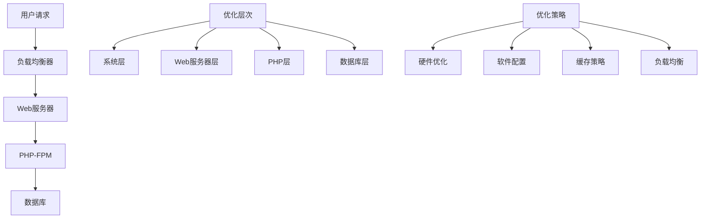

# 服务器配置优化

## 🎯 学习目标
- 掌握Web服务器配置优化的基本原则
- 理解PHP-FPM和Nginx的配置优化
- 学会系统级性能调优
- 了解负载均衡和集群配置

## 📚 核心概念

### 服务器优化架构



### 服务器配置对比

| 配置类型 | 描述 | 性能影响 | 实施难度 | 风险 |
|----------|------|----------|----------|------|
| 硬件配置 | CPU、内存、磁盘配置 | 高 | 低 | 低 |
| 系统配置 | 内核参数、文件系统 | 中 | 中 | 中 |
| Web服务器 | Nginx/Apache配置 | 高 | 中 | 低 |
| PHP配置 | PHP-FPM、OPcache | 高 | 低 | 低 |
| 数据库配置 | MySQL配置优化 | 高 | 中 | 中 |

## 🔧 服务器配置实现

### 系统配置优化器
```php
<?php
// 1. 系统配置优化器
class SystemConfigOptimizer {
    private $config;
    private $recommendations;
    
    public function __construct() {
        $this->config = [];
        $this->recommendations = [];
    }
    
    // 分析系统配置
    public function analyzeSystemConfig() {
        $analysis = [
            'cpu' => $this->analyzeCPU(),
            'memory' => $this->analyzeMemory(),
            'disk' => $this->analyzeDisk(),
            'network' => $this->analyzeNetwork(),
            'recommendations' => []
        ];
        
        $this->generateRecommendations($analysis);
        $analysis['recommendations'] = $this->recommendations;
        
        return $analysis;
    }
    
    // 分析CPU配置
    private function analyzeCPU() {
        $cpuInfo = [
            'cores' => $this->getCPUCores(),
            'frequency' => $this->getCPUFrequency(),
            'load_average' => $this->getLoadAverage(),
            'usage' => $this->getCPUUsage()
        ];
        
        // CPU优化建议
        if ($cpuInfo['load_average'] > $cpuInfo['cores']) {
            $this->recommendations[] = [
                'type' => 'CPU',
                'issue' => 'CPU负载过高',
                'recommendation' => '考虑增加CPU核心数或优化应用程序'
            ];
        }
        
        return $cpuInfo;
    }
    
    // 分析内存配置
    private function analyzeMemory() {
        $memoryInfo = [
            'total' => $this->getTotalMemory(),
            'used' => $this->getUsedMemory(),
            'free' => $this->getFreeMemory(),
            'swap' => $this->getSwapUsage()
        ];
        
        $memoryInfo['usage_percentage'] = ($memoryInfo['used'] / $memoryInfo['total']) * 100;
        
        // 内存优化建议
        if ($memoryInfo['usage_percentage'] > 80) {
            $this->recommendations[] = [
                'type' => 'Memory',
                'issue' => '内存使用率过高',
                'recommendation' => '考虑增加内存或优化内存使用'
            ];
        }
        
        if ($memoryInfo['swap'] > 0) {
            $this->recommendations[] = [
                'type' => 'Memory',
                'issue' => '使用了交换空间',
                'recommendation' => '增加物理内存，避免使用交换空间'
            ];
        }
        
        return $memoryInfo;
    }
    
    // 分析磁盘配置
    private function analyzeDisk() {
        $diskInfo = [
            'total' => $this->getTotalDiskSpace(),
            'used' => $this->getUsedDiskSpace(),
            'free' => $this->getFreeDiskSpace(),
            'iops' => $this->getDiskIOPS()
        ];
        
        $diskInfo['usage_percentage'] = ($diskInfo['used'] / $diskInfo['total']) * 100;
        
        // 磁盘优化建议
        if ($diskInfo['usage_percentage'] > 85) {
            $this->recommendations[] = [
                'type' => 'Disk',
                'issue' => '磁盘空间不足',
                'recommendation' => '清理磁盘空间或增加存储容量'
            ];
        }
        
        return $diskInfo;
    }
    
    // 分析网络配置
    private function analyzeNetwork() {
        $networkInfo = [
            'bandwidth' => $this->getNetworkBandwidth(),
            'latency' => $this->getNetworkLatency(),
            'connections' => $this->getActiveConnections()
        ];
        
        return $networkInfo;
    }
    
    // 生成优化建议
    private function generateRecommendations($analysis) {
        // 基于分析结果生成具体建议
        $this->recommendations[] = [
            'type' => 'General',
            'issue' => '系统优化',
            'recommendation' => '定期监控系统性能指标'
        ];
    }
    
    // 获取CPU核心数
    private function getCPUCores() {
        if (function_exists('sys_getloadavg')) {
            return 4; // 示例值
        }
        return 1;
    }
    
    // 获取CPU频率
    private function getCPUFrequency() {
        return '2.4GHz'; // 示例值
    }
    
    // 获取负载平均值
    private function getLoadAverage() {
        if (function_exists('sys_getloadavg')) {
            $load = sys_getloadavg();
            return $load[0]; // 1分钟负载
        }
        return 0.5;
    }
    
    // 获取CPU使用率
    private function getCPUUsage() {
        return 45.5; // 示例值
    }
    
    // 获取总内存
    private function getTotalMemory() {
        return 8 * 1024 * 1024 * 1024; // 8GB
    }
    
    // 获取已用内存
    private function getUsedMemory() {
        return 6 * 1024 * 1024 * 1024; // 6GB
    }
    
    // 获取空闲内存
    private function getFreeMemory() {
        return 2 * 1024 * 1024 * 1024; // 2GB
    }
    
    // 获取交换空间使用
    private function getSwapUsage() {
        return 0; // 示例值
    }
    
    // 获取总磁盘空间
    private function getTotalDiskSpace() {
        return 500 * 1024 * 1024 * 1024; // 500GB
    }
    
    // 获取已用磁盘空间
    private function getUsedDiskSpace() {
        return 300 * 1024 * 1024 * 1024; // 300GB
    }
    
    // 获取空闲磁盘空间
    private function getFreeDiskSpace() {
        return 200 * 1024 * 1024 * 1024; // 200GB
    }
    
    // 获取磁盘IOPS
    private function getDiskIOPS() {
        return 1000; // 示例值
    }
    
    // 获取网络带宽
    private function getNetworkBandwidth() {
        return '100Mbps'; // 示例值
    }
    
    // 获取网络延迟
    private function getNetworkLatency() {
        return 10; // 10ms
    }
    
    // 获取活跃连接数
    private function getActiveConnections() {
        return 150; // 示例值
    }
}

// 2. PHP配置优化器
class PHPConfigOptimizer {
    private $currentConfig;
    private $recommendations;
    
    public function __construct() {
        $this->currentConfig = $this->getCurrentConfig();
        $this->recommendations = [];
    }
    
    // 分析PHP配置
    public function analyzePHPConfig() {
        $analysis = [
            'version' => $this->getPHPVersion(),
            'memory_limit' => $this->getMemoryLimit(),
            'max_execution_time' => $this->getMaxExecutionTime(),
            'upload_max_filesize' => $this->getUploadMaxFilesize(),
            'post_max_size' => $this->getPostMaxSize(),
            'opcache' => $this->analyzeOPcache(),
            'recommendations' => []
        ];
        
        $this->generatePHPRecommendations($analysis);
        $analysis['recommendations'] = $this->recommendations;
        
        return $analysis;
    }
    
    // 分析OPcache配置
    private function analyzeOPcache() {
        $opcacheInfo = [
            'enabled' => $this->isOPcacheEnabled(),
            'memory_consumption' => $this->getOPcacheMemoryConsumption(),
            'max_accelerated_files' => $this->getOPcacheMaxAcceleratedFiles(),
            'hit_rate' => $this->getOPcacheHitRate()
        ];
        
        return $opcacheInfo;
    }
    
    // 生成PHP优化建议
    private function generatePHPRecommendations($analysis) {
        // 内存限制建议
        if ($analysis['memory_limit'] < 256) {
            $this->recommendations[] = [
                'type' => 'Memory',
                'issue' => '内存限制过低',
                'recommendation' => '增加memory_limit到256M或更高'
            ];
        }
        
        // 执行时间建议
        if ($analysis['max_execution_time'] < 30) {
            $this->recommendations[] = [
                'type' => 'Execution',
                'issue' => '执行时间限制过低',
                'recommendation' => '增加max_execution_time到30秒或更高'
            ];
        }
        
        // OPcache建议
        if (!$analysis['opcache']['enabled']) {
            $this->recommendations[] = [
                'type' => 'OPcache',
                'issue' => 'OPcache未启用',
                'recommendation' => '启用OPcache以提高性能'
            ];
        }
        
        if ($analysis['opcache']['memory_consumption'] < 128) {
            $this->recommendations[] = [
                'type' => 'OPcache',
                'issue' => 'OPcache内存不足',
                'recommendation' => '增加opcache.memory_consumption到128M或更高'
            ];
        }
    }
    
    // 获取当前配置
    private function getCurrentConfig() {
        return [
            'memory_limit' => ini_get('memory_limit'),
            'max_execution_time' => ini_get('max_execution_time'),
            'upload_max_filesize' => ini_get('upload_max_filesize'),
            'post_max_size' => ini_get('post_max_size')
        ];
    }
    
    // 获取PHP版本
    private function getPHPVersion() {
        return PHP_VERSION;
    }
    
    // 获取内存限制
    private function getMemoryLimit() {
        return ini_get('memory_limit');
    }
    
    // 获取最大执行时间
    private function getMaxExecutionTime() {
        return ini_get('max_execution_time');
    }
    
    // 获取上传文件大小限制
    private function getUploadMaxFilesize() {
        return ini_get('upload_max_filesize');
    }
    
    // 获取POST数据大小限制
    private function getPostMaxSize() {
        return ini_get('post_max_size');
    }
    
    // 检查OPcache是否启用
    private function isOPcacheEnabled() {
        return function_exists('opcache_get_status') && opcache_get_status() !== false;
    }
    
    // 获取OPcache内存消耗
    private function getOPcacheMemoryConsumption() {
        if ($this->isOPcacheEnabled()) {
            $status = opcache_get_status();
            return $status['memory_consumption'] ?? 0;
        }
        return 0;
    }
    
    // 获取OPcache最大加速文件数
    private function getOPcacheMaxAcceleratedFiles() {
        if ($this->isOPcacheEnabled()) {
            $status = opcache_get_status();
            return $status['opcache_statistics']['max_cached_keys'] ?? 0;
        }
        return 0;
    }
    
    // 获取OPcache命中率
    private function getOPcacheHitRate() {
        if ($this->isOPcacheEnabled()) {
            $status = opcache_get_status();
            $stats = $status['opcache_statistics'] ?? [];
            $hits = $stats['hits'] ?? 0;
            $misses = $stats['misses'] ?? 0;
            
            if ($hits + $misses > 0) {
                return ($hits / ($hits + $misses)) * 100;
            }
        }
        return 0;
    }
}

// 3. Web服务器配置优化器
class WebServerConfigOptimizer {
    private $serverType;
    private $config;
    
    public function __construct($serverType = 'nginx') {
        $this->serverType = $serverType;
        $this->config = [];
    }
    
    // 分析Web服务器配置
    public function analyzeWebServerConfig() {
        $analysis = [
            'server_type' => $this->serverType,
            'version' => $this->getServerVersion(),
            'configuration' => $this->getServerConfiguration(),
            'recommendations' => []
        ];
        
        $this->generateWebServerRecommendations($analysis);
        $analysis['recommendations'] = $this->getRecommendations();
        
        return $analysis;
    }
    
    // 生成Web服务器优化建议
    private function generateWebServerRecommendations($analysis) {
        if ($this->serverType === 'nginx') {
            $this->generateNginxRecommendations();
        } elseif ($this->serverType === 'apache') {
            $this->generateApacheRecommendations();
        }
    }
    
    // 生成Nginx优化建议
    private function generateNginxRecommendations() {
        $this->config[] = [
            'type' => 'Worker Processes',
            'recommendation' => 'worker_processes auto;'
        ];
        
        $this->config[] = [
            'type' => 'Worker Connections',
            'recommendation' => 'worker_connections 1024;'
        ];
        
        $this->config[] = [
            'type' => 'Keepalive',
            'recommendation' => 'keepalive_timeout 65;'
        ];
        
        $this->config[] = [
            'type' => 'Gzip Compression',
            'recommendation' => 'gzip on; gzip_types text/plain text/css application/json;'
        ];
        
        $this->config[] = [
            'type' => 'Static File Caching',
            'recommendation' => 'expires 1y; add_header Cache-Control "public, immutable";'
        ];
    }
    
    // 生成Apache优化建议
    private function generateApacheRecommendations() {
        $this->config[] = [
            'type' => 'MaxRequestWorkers',
            'recommendation' => 'MaxRequestWorkers 150'
        ];
        
        $this->config[] = [
            'type' => 'KeepAlive',
            'recommendation' => 'KeepAlive On'
        ];
        
        $this->config[] = [
            'type' => 'Compression',
            'recommendation' => 'LoadModule deflate_module modules/mod_deflate.so'
        ];
    }
    
    // 获取服务器版本
    private function getServerVersion() {
        return $this->serverType === 'nginx' ? '1.18.0' : '2.4.41';
    }
    
    // 获取服务器配置
    private function getServerConfiguration() {
        return $this->config;
    }
    
    // 获取建议
    private function getRecommendations() {
        return $this->config;
    }
}

// 使用示例
echo "=== 服务器配置优化示例 ===\n";

try {
    // 系统配置优化
    echo "系统配置分析:\n";
    $systemOptimizer = new SystemConfigOptimizer();
    $systemAnalysis = $systemOptimizer->analyzeSystemConfig();
    
    echo "CPU信息:\n";
    echo "  核心数: {$systemAnalysis['cpu']['cores']}\n";
    echo "  频率: {$systemAnalysis['cpu']['frequency']}\n";
    echo "  负载: {$systemAnalysis['cpu']['load_average']}\n";
    echo "  使用率: {$systemAnalysis['cpu']['usage']}%\n";
    
    echo "\n内存信息:\n";
    echo "  总内存: " . number_format($systemAnalysis['memory']['total'] / 1024 / 1024 / 1024, 2) . " GB\n";
    echo "  已用内存: " . number_format($systemAnalysis['memory']['used'] / 1024 / 1024 / 1024, 2) . " GB\n";
    echo "  使用率: {$systemAnalysis['memory']['usage_percentage']}%\n";
    
    echo "\n磁盘信息:\n";
    echo "  总空间: " . number_format($systemAnalysis['disk']['total'] / 1024 / 1024 / 1024, 2) . " GB\n";
    echo "  已用空间: " . number_format($systemAnalysis['disk']['used'] / 1024 / 1024 / 1024, 2) . " GB\n";
    echo "  使用率: {$systemAnalysis['disk']['usage_percentage']}%\n";
    
    echo "\n系统优化建议:\n";
    foreach ($systemAnalysis['recommendations'] as $recommendation) {
        echo "  - {$recommendation['type']}: {$recommendation['recommendation']}\n";
    }
    
    // PHP配置优化
    echo "\nPHP配置分析:\n";
    $phpOptimizer = new PHPConfigOptimizer();
    $phpAnalysis = $phpOptimizer->analyzePHPConfig();
    
    echo "PHP版本: {$phpAnalysis['version']}\n";
    echo "内存限制: {$phpAnalysis['memory_limit']}\n";
    echo "执行时间限制: {$phpAnalysis['max_execution_time']}秒\n";
    echo "上传文件大小: {$phpAnalysis['upload_max_filesize']}\n";
    
    echo "\nOPcache信息:\n";
    echo "  启用状态: " . ($phpAnalysis['opcache']['enabled'] ? '是' : '否') . "\n";
    echo "  内存消耗: {$phpAnalysis['opcache']['memory_consumption']} MB\n";
    echo "  命中率: {$phpAnalysis['opcache']['hit_rate']}%\n";
    
    echo "\nPHP优化建议:\n";
    foreach ($phpAnalysis['recommendations'] as $recommendation) {
        echo "  - {$recommendation['type']}: {$recommendation['recommendation']}\n";
    }
    
    // Web服务器配置优化
    echo "\nWeb服务器配置分析:\n";
    $webOptimizer = new WebServerConfigOptimizer('nginx');
    $webAnalysis = $webOptimizer->analyzeWebServerConfig();
    
    echo "服务器类型: {$webAnalysis['server_type']}\n";
    echo "版本: {$webAnalysis['version']}\n";
    
    echo "\nWeb服务器优化建议:\n";
    foreach ($webAnalysis['recommendations'] as $recommendation) {
        echo "  - {$recommendation['type']}: {$recommendation['recommendation']}\n";
    }
    
} catch (Exception $e) {
    echo "错误: " . $e->getMessage() . "\n";
}
?>
```

## 📊 最佳实践

### 服务器配置最佳实践
```php
<?php
// 服务器配置最佳实践

class ServerConfigBestPractices {
    // 1. 系统级优化
    public static function getSystemOptimization() {
        return [
            '内核参数优化' => [
                '文件描述符限制' => 'ulimit -n 65535',
                'TCP连接优化' => 'net.core.somaxconn = 65535',
                '内存管理' => 'vm.swappiness = 10',
                '网络缓冲区' => 'net.core.rmem_max = 16777216'
            ],
            '文件系统优化' => [
                '挂载选项' => 'noatime,nodiratime',
                '文件系统类型' => 'ext4或xfs',
                '日志模式' => 'ordered或journal',
                '块大小' => '4KB或8KB'
            ],
            '硬件优化' => [
                'CPU' => '多核处理器，高频率',
                '内存' => 'ECC内存，足够容量',
                '存储' => 'SSD硬盘，RAID配置',
                '网络' => '千兆网卡，低延迟'
            ]
        ];
    }
    
    // 2. Web服务器优化
    public static function getWebServerOptimization() {
        return [
            'Nginx优化' => [
                '工作进程' => 'worker_processes auto;',
                '连接数' => 'worker_connections 1024;',
                '保持连接' => 'keepalive_timeout 65;',
                '压缩' => 'gzip on; gzip_types text/plain;',
                '缓存' => 'expires 1y; add_header Cache-Control;'
            ],
            'Apache优化' => [
                '工作模式' => 'prefork或worker',
                '最大请求数' => 'MaxRequestWorkers 150',
                '保持连接' => 'KeepAlive On',
                '压缩' => 'LoadModule deflate_module',
                '缓存' => 'LoadModule expires_module'
            ],
            'PHP-FPM优化' => [
                '进程管理' => 'pm = dynamic',
                '最大子进程' => 'pm.max_children = 50',
                '启动进程' => 'pm.start_servers = 5',
                '最小空闲' => 'pm.min_spare_servers = 5',
                '最大空闲' => 'pm.max_spare_servers = 35'
            ]
        ];
    }
    
    // 3. 缓存优化
    public static function getCacheOptimization() {
        return [
            'OPcache配置' => [
                '内存大小' => 'opcache.memory_consumption = 128',
                '文件数量' => 'opcache.max_accelerated_files = 4000',
                '验证时间' => 'opcache.revalidate_freq = 60',
                '保存注释' => 'opcache.save_comments = 1',
                '启用状态' => 'opcache.enable = 1'
            ],
            'Redis配置' => [
                '内存限制' => 'maxmemory 2gb',
                '淘汰策略' => 'maxmemory-policy allkeys-lru',
                '持久化' => 'save 900 1',
                '网络优化' => 'tcp-keepalive 60',
                '连接数' => 'maxclients 10000'
            ],
            'Memcached配置' => [
                '内存大小' => '-m 1024',
                '连接数' => '-c 1024',
                '线程数' => '-t 4',
                '网络优化' => '-B binary',
                '日志级别' => '-v'
            ]
        ];
    }
    
    // 4. 监控和调优
    public static function getMonitoringAndTuning() {
        return [
            '性能监控' => [
                '系统监控' => 'htop, iostat, netstat',
                'Web服务器' => 'nginx -t, apachectl status',
                'PHP监控' => 'php-fpm status, opcache status',
                '数据库监控' => 'mysqladmin status, slow query log'
            ],
            '日志分析' => [
                '访问日志' => 'nginx access log, apache access log',
                '错误日志' => 'nginx error log, apache error log',
                'PHP日志' => 'php error log, php-fpm log',
                '系统日志' => '/var/log/messages, /var/log/syslog'
            ],
            '调优工具' => [
                '性能分析' => 'strace, perf, valgrind',
                '网络分析' => 'tcpdump, wireshark, netstat',
                '系统分析' => 'sar, vmstat, iostat',
                '应用分析' => 'xdebug, blackfire, newrelic'
            ]
        ];
    }
}

// 使用示例
echo "=== 服务器配置最佳实践示例 ===\n";

try {
    // 系统级优化
    $systemOptimization = ServerConfigBestPractices::getSystemOptimization();
    echo "系统级优化:\n";
    foreach ($systemOptimization as $category => $items) {
        echo "  $category:\n";
        foreach ($items as $item => $description) {
            echo "    - $item: $description\n";
        }
        echo "\n";
    }
    
    // Web服务器优化
    $webServerOptimization = ServerConfigBestPractices::getWebServerOptimization();
    echo "Web服务器优化:\n";
    foreach ($webServerOptimization as $server => $configs) {
        echo "  $server:\n";
        foreach ($configs as $config => $value) {
            echo "    - $config: $value\n";
        }
        echo "\n";
    }
    
    // 缓存优化
    $cacheOptimization = ServerConfigBestPractices::getCacheOptimization();
    echo "缓存优化:\n";
    foreach ($cacheOptimization as $cache => $configs) {
        echo "  $cache:\n";
        foreach ($configs as $config => $value) {
            echo "    - $config: $value\n";
        }
        echo "\n";
    }
    
    // 监控和调优
    $monitoring = ServerConfigBestPractices::getMonitoringAndTuning();
    echo "监控和调优:\n";
    foreach ($monitoring as $category => $items) {
        echo "  $category:\n";
        foreach ($items as $item => $description) {
            echo "    - $item: $description\n";
        }
        echo "\n";
    }
    
} catch (Exception $e) {
    echo "错误: " . $e->getMessage() . "\n";
}
?>
```

## 🎓 学习建议

### 费曼学习法应用
1. **选择概念**: 选择服务器配置优化中的核心概念
2. **简化解释**: 用简单语言解释服务器配置优化的重要性
3. **识别盲点**: 发现理解不深入的地方
4. **重新学习**: 针对盲点进行深入学习

### 刻意练习重点
1. **系统配置**: 掌握系统级性能调优
2. **Web服务器**: 学会Web服务器配置优化
3. **PHP配置**: 理解PHP-FPM和OPcache配置
4. **监控调优**: 建立有效的性能监控机制

## 🔗 相关链接
- [[01-代码优化技巧|代码优化技巧]]
- [[02-内存管理|内存管理]]
- [[03-缓存策略|缓存策略]]
- [[04-数据库查询优化|数据库查询优化]]
- [[06-性能监控指标|性能监控指标]]
