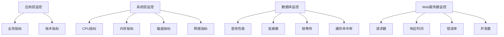

# 性能监控指标

## 🎯 学习目标
- 掌握性能监控的关键指标和度量方法
- 理解不同层次的性能监控策略
- 学会建立有效的性能监控体系
- 了解性能告警和故障诊断

## 📚 核心概念

### 性能监控架构



### 监控指标分类

| 指标类型 | 描述 | 重要性 | 监控频率 | 告警阈值 |
|----------|------|--------|----------|----------|
| 响应时间 | 请求处理时间 | 高 | 实时 | >2秒 |
| 吞吐量 | 每秒请求数 | 高 | 实时 | <80%基线 |
| 错误率 | 错误请求比例 | 高 | 实时 | >5% |
| CPU使用率 | CPU占用百分比 | 中 | 1分钟 | >80% |
| 内存使用率 | 内存占用百分比 | 中 | 1分钟 | >85% |
| 磁盘IO | 磁盘读写操作 | 中 | 5分钟 | >80% |
| 网络IO | 网络流量 | 低 | 5分钟 | >90% |

## 🔧 性能监控实现

### 性能监控器
```php
<?php
// 1. 性能监控器类
class PerformanceMonitor {
    private $metrics;
    private $alerts;
    private $thresholds;
    
    public function __construct() {
        $this->metrics = [];
        $this->alerts = [];
        $this->thresholds = [
            'response_time' => 2.0, // 2秒
            'error_rate' => 0.05,   // 5%
            'cpu_usage' => 0.8,     // 80%
            'memory_usage' => 0.85, // 85%
            'disk_usage' => 0.8,    // 80%
            'network_usage' => 0.9  // 90%
        ];
    }
    
    // 记录性能指标
    public function recordMetric($name, $value, $timestamp = null) {
        $timestamp = $timestamp ?: time();
        
        if (!isset($this->metrics[$name])) {
            $this->metrics[$name] = [];
        }
        
        $this->metrics[$name][] = [
            'value' => $value,
            'timestamp' => $timestamp
        ];
        
        // 检查告警阈值
        $this->checkThresholds($name, $value);
        
        // 保持最近1000个数据点
        if (count($this->metrics[$name]) > 1000) {
            array_shift($this->metrics[$name]);
        }
    }
    
    // 检查告警阈值
    private function checkThresholds($name, $value) {
        if (isset($this->thresholds[$name])) {
            $threshold = $this->thresholds[$name];
            
            if ($value > $threshold) {
                $this->triggerAlert($name, $value, $threshold);
            }
        }
    }
    
    // 触发告警
    private function triggerAlert($name, $value, $threshold) {
        $alert = [
            'metric' => $name,
            'value' => $value,
            'threshold' => $threshold,
            'timestamp' => time(),
            'severity' => $this->getSeverity($name, $value, $threshold)
        ];
        
        $this->alerts[] = $alert;
        
        // 保持最近100个告警
        if (count($this->alerts) > 100) {
            array_shift($this->alerts);
        }
    }
    
    // 获取告警严重程度
    private function getSeverity($name, $value, $threshold) {
        $ratio = $value / $threshold;
        
        if ($ratio > 2) {
            return 'CRITICAL';
        } elseif ($ratio > 1.5) {
            return 'HIGH';
        } elseif ($ratio > 1.2) {
            return 'MEDIUM';
        } else {
            return 'LOW';
        }
    }
    
    // 获取指标统计
    public function getMetricStats($name, $timeRange = 3600) {
        if (!isset($this->metrics[$name])) {
            return null;
        }
        
        $cutoff = time() - $timeRange;
        $values = array_filter($this->metrics[$name], function($point) use ($cutoff) {
            return $point['timestamp'] >= $cutoff;
        });
        
        if (empty($values)) {
            return null;
        }
        
        $values = array_column($values, 'value');
        
        return [
            'count' => count($values),
            'min' => min($values),
            'max' => max($values),
            'avg' => array_sum($values) / count($values),
            'median' => $this->calculateMedian($values),
            'p95' => $this->calculatePercentile($values, 95),
            'p99' => $this->calculatePercentile($values, 99)
        ];
    }
    
    // 计算中位数
    private function calculateMedian($values) {
        sort($values);
        $count = count($values);
        
        if ($count % 2 === 0) {
            return ($values[$count / 2 - 1] + $values[$count / 2]) / 2;
        } else {
            return $values[($count - 1) / 2];
        }
    }
    
    // 计算百分位数
    private function calculatePercentile($values, $percentile) {
        sort($values);
        $index = ($percentile / 100) * (count($values) - 1);
        
        if (floor($index) == $index) {
            return $values[$index];
        } else {
            $lower = $values[floor($index)];
            $upper = $values[ceil($index)];
            return $lower + ($upper - $lower) * ($index - floor($index));
        }
    }
    
    // 获取所有告警
    public function getAlerts($severity = null) {
        if ($severity) {
            return array_filter($this->alerts, function($alert) use ($severity) {
                return $alert['severity'] === $severity;
            });
        }
        
        return $this->alerts;
    }
    
    // 清除告警
    public function clearAlerts() {
        $this->alerts = [];
    }
    
    // 设置阈值
    public function setThreshold($name, $value) {
        $this->thresholds[$name] = $value;
    }
    
    // 获取阈值
    public function getThreshold($name) {
        return $this->thresholds[$name] ?? null;
    }
}

// 2. 应用性能监控
class ApplicationPerformanceMonitor {
    private $monitor;
    private $requestStartTime;
    private $requestMetrics;
    
    public function __construct(PerformanceMonitor $monitor) {
        $this->monitor = $monitor;
        $this->requestStartTime = microtime(true);
        $this->requestMetrics = [];
    }
    
    // 开始请求监控
    public function startRequest($requestId = null) {
        $this->requestStartTime = microtime(true);
        $this->requestMetrics = [
            'request_id' => $requestId ?: uniqid(),
            'start_time' => $this->requestStartTime,
            'memory_start' => memory_get_usage(),
            'peak_memory_start' => memory_get_peak_usage()
        ];
    }
    
    // 结束请求监控
    public function endRequest($statusCode = 200) {
        $endTime = microtime(true);
        $responseTime = $endTime - $this->requestStartTime;
        
        $this->requestMetrics['end_time'] = $endTime;
        $this->requestMetrics['response_time'] = $responseTime;
        $this->requestMetrics['status_code'] = $statusCode;
        $this->requestMetrics['memory_end'] = memory_get_usage();
        $this->requestMetrics['peak_memory_end'] = memory_get_peak_usage();
        $this->requestMetrics['memory_used'] = $this->requestMetrics['memory_end'] - $this->requestMetrics['memory_start'];
        
        // 记录指标
        $this->monitor->recordMetric('response_time', $responseTime);
        $this->monitor->recordMetric('memory_usage', $this->requestMetrics['memory_used']);
        
        if ($statusCode >= 400) {
            $this->monitor->recordMetric('error_count', 1);
        }
        
        return $this->requestMetrics;
    }
    
    // 记录数据库查询
    public function recordDatabaseQuery($query, $executionTime, $rowsAffected = 0) {
        $this->monitor->recordMetric('db_query_time', $executionTime);
        $this->monitor->recordMetric('db_rows_affected', $rowsAffected);
        
        // 记录慢查询
        if ($executionTime > 1.0) {
            $this->monitor->recordMetric('slow_query_count', 1);
        }
    }
    
    // 记录缓存操作
    public function recordCacheOperation($operation, $hit = true) {
        $this->monitor->recordMetric('cache_operation', 1);
        
        if ($hit) {
            $this->monitor->recordMetric('cache_hit', 1);
        } else {
            $this->monitor->recordMetric('cache_miss', 1);
        }
    }
    
    // 记录外部API调用
    public function recordExternalApiCall($url, $responseTime, $statusCode) {
        $this->monitor->recordMetric('external_api_time', $responseTime);
        
        if ($statusCode >= 400) {
            $this->monitor->recordMetric('external_api_error', 1);
        }
    }
    
    // 获取请求统计
    public function getRequestStats($timeRange = 3600) {
        $responseTimeStats = $this->monitor->getMetricStats('response_time', $timeRange);
        $memoryStats = $this->monitor->getMetricStats('memory_usage', $timeRange);
        $errorStats = $this->monitor->getMetricStats('error_count', $timeRange);
        
        return [
            'response_time' => $responseTimeStats,
            'memory_usage' => $memoryStats,
            'error_count' => $errorStats,
            'time_range' => $timeRange
        ];
    }
}

// 3. 系统性能监控
class SystemPerformanceMonitor {
    private $monitor;
    
    public function __construct(PerformanceMonitor $monitor) {
        $this->monitor = $monitor;
    }
    
    // 监控CPU使用率
    public function monitorCPU() {
        $cpuUsage = $this->getCPUUsage();
        $this->monitor->recordMetric('cpu_usage', $cpuUsage);
        return $cpuUsage;
    }
    
    // 监控内存使用率
    public function monitorMemory() {
        $memoryUsage = $this->getMemoryUsage();
        $this->monitor->recordMetric('memory_usage', $memoryUsage);
        return $memoryUsage;
    }
    
    // 监控磁盘使用率
    public function monitorDisk() {
        $diskUsage = $this->getDiskUsage();
        $this->monitor->recordMetric('disk_usage', $diskUsage);
        return $diskUsage;
    }
    
    // 监控网络使用率
    public function monitorNetwork() {
        $networkUsage = $this->getNetworkUsage();
        $this->monitor->recordMetric('network_usage', $networkUsage);
        return $networkUsage;
    }
    
    // 获取CPU使用率
    private function getCPUUsage() {
        // 简化实现，实际应该读取/proc/stat
        return rand(20, 80); // 示例值
    }
    
    // 获取内存使用率
    private function getMemoryUsage() {
        $total = memory_get_usage(true);
        $used = memory_get_usage();
        return ($used / $total) * 100;
    }
    
    // 获取磁盘使用率
    private function getDiskUsage() {
        // 简化实现，实际应该使用disk_free_space
        return rand(30, 70); // 示例值
    }
    
    // 获取网络使用率
    private function getNetworkUsage() {
        // 简化实现，实际应该读取网络接口统计
        return rand(10, 50); // 示例值
    }
    
    // 获取系统统计
    public function getSystemStats($timeRange = 3600) {
        $cpuStats = $this->monitor->getMetricStats('cpu_usage', $timeRange);
        $memoryStats = $this->monitor->getMetricStats('memory_usage', $timeRange);
        $diskStats = $this->monitor->getMetricStats('disk_usage', $timeRange);
        $networkStats = $this->monitor->getMetricStats('network_usage', $timeRange);
        
        return [
            'cpu' => $cpuStats,
            'memory' => $memoryStats,
            'disk' => $diskStats,
            'network' => $networkStats,
            'time_range' => $timeRange
        ];
    }
}

// 使用示例
echo "=== 性能监控指标示例 ===\n";

try {
    // 创建性能监控器
    $monitor = new PerformanceMonitor();
    
    // 创建应用性能监控
    $appMonitor = new ApplicationPerformanceMonitor($monitor);
    
    // 创建系统性能监控
    $systemMonitor = new SystemPerformanceMonitor($monitor);
    
    // 模拟请求监控
    echo "应用性能监控测试:\n";
    $appMonitor->startRequest('req_001');
    
    // 模拟一些操作
    usleep(100000); // 100ms
    $appMonitor->recordDatabaseQuery('SELECT * FROM users', 0.05, 100);
    $appMonitor->recordCacheOperation('get', true);
    $appMonitor->recordExternalApiCall('https://api.example.com', 0.2, 200);
    
    $requestMetrics = $appMonitor->endRequest(200);
    echo "请求指标: " . json_encode($requestMetrics) . "\n";
    
    // 模拟系统监控
    echo "\n系统性能监控测试:\n";
    $systemMonitor->monitorCPU();
    $systemMonitor->monitorMemory();
    $systemMonitor->monitorDisk();
    $systemMonitor->monitorNetwork();
    
    // 获取应用统计
    $appStats = $appMonitor->getRequestStats();
    echo "应用统计:\n";
    echo "响应时间: " . json_encode($appStats['response_time']) . "\n";
    echo "内存使用: " . json_encode($appStats['memory_usage']) . "\n";
    
    // 获取系统统计
    $systemStats = $systemMonitor->getSystemStats();
    echo "\n系统统计:\n";
    echo "CPU: " . json_encode($systemStats['cpu']) . "\n";
    echo "内存: " . json_encode($systemStats['memory']) . "\n";
    echo "磁盘: " . json_encode($systemStats['disk']) . "\n";
    echo "网络: " . json_encode($systemStats['network']) . "\n";
    
    // 获取告警
    $alerts = $monitor->getAlerts();
    echo "\n告警信息:\n";
    foreach ($alerts as $alert) {
        echo "  {$alert['severity']}: {$alert['metric']} = {$alert['value']} (阈值: {$alert['threshold']})\n";
    }
    
} catch (Exception $e) {
    echo "错误: " . $e->getMessage() . "\n";
}
?>
```

## 📊 最佳实践

### 性能监控最佳实践
```php
<?php
// 性能监控最佳实践

class PerformanceMonitoringBestPractices {
    // 1. 监控指标设计
    public static function getMonitoringMetrics() {
        return [
            '业务指标' => [
                '响应时间' => '页面加载时间，API响应时间',
                '吞吐量' => '每秒请求数，每秒事务数',
                '错误率' => '4xx/5xx错误比例',
                '可用性' => '服务可用时间百分比',
                '用户满意度' => '用户反馈评分'
            ],
            '技术指标' => [
                'CPU使用率' => '处理器占用百分比',
                '内存使用率' => '内存占用百分比',
                '磁盘IO' => '磁盘读写操作次数',
                '网络IO' => '网络流量和连接数',
                '数据库性能' => '查询时间，连接数'
            ],
            '应用指标' => [
                '代码执行时间' => '函数执行时间',
                '数据库查询' => '查询次数，慢查询',
                '缓存命中率' => '缓存命中百分比',
                '外部API调用' => '第三方服务响应时间',
                '队列长度' => '任务队列积压情况'
            ]
        ];
    }
    
    // 2. 告警策略
    public static function getAlertingStrategies() {
        return [
            '告警级别' => [
                'CRITICAL' => '系统不可用，需要立即处理',
                'HIGH' => '性能严重下降，需要尽快处理',
                'MEDIUM' => '性能异常，需要关注',
                'LOW' => '性能波动，需要观察'
            ],
            '告警条件' => [
                '阈值告警' => '指标超过预设阈值',
                '趋势告警' => '指标变化趋势异常',
                '异常检测' => '指标值偏离正常范围',
                '组合告警' => '多个指标组合异常'
            ],
            '告警处理' => [
                '自动恢复' => '系统自动处理简单问题',
                '人工介入' => '复杂问题需要人工处理',
                '升级机制' => '告警升级和通知机制',
                '反馈循环' => '告警处理结果反馈'
            ]
        ];
    }
    
    // 3. 监控工具
    public static function getMonitoringTools() {
        return [
            '应用监控' => [
                'New Relic' => '全栈应用性能监控',
                'AppDynamics' => '企业级APM解决方案',
                'Datadog' => '云原生监控平台',
                'Prometheus' => '开源监控系统'
            ],
            '系统监控' => [
                'Nagios' => '基础设施监控',
                'Zabbix' => '企业级监控解决方案',
                'Grafana' => '可视化监控面板',
                'ELK Stack' => '日志分析和监控'
            ],
            '数据库监控' => [
                'MySQL Enterprise' => 'MySQL官方监控',
                'Percona Monitoring' => 'MySQL性能监控',
                'pgAdmin' => 'PostgreSQL监控',
                'MongoDB Compass' => 'MongoDB监控'
            ],
            '自定义监控' => [
                '自定义指标' => '业务特定指标监控',
                '日志分析' => '基于日志的监控',
                '健康检查' => '服务健康状态检查',
                '性能测试' => '定期性能测试'
            ]
        ];
    }
    
    // 4. 监控最佳实践
    public static function getMonitoringBestPractices() {
        return [
            '监控设计' => [
                '分层监控' => '应用层、系统层、网络层',
                '关键指标' => '关注最重要的业务指标',
                '实时监控' => '实时监控关键指标',
                '历史分析' => '保留历史数据用于分析'
            ],
            '告警设计' => [
                '合理阈值' => '设置合理的告警阈值',
                '避免噪音' => '减少误报和噪音告警',
                '分级告警' => '不同级别不同处理方式',
                '告警聚合' => '相关告警聚合处理'
            ],
            '数据管理' => [
                '数据保留' => '合理的数据保留策略',
                '数据压缩' => '历史数据压缩存储',
                '数据备份' => '监控数据备份策略',
                '数据安全' => '监控数据安全保护'
            ],
            '团队协作' => [
                '责任分工' => '明确的监控责任分工',
                '知识共享' => '监控知识团队共享',
                '培训教育' => '监控工具使用培训',
                '持续改进' => '监控体系持续改进'
            ]
        ];
    }
}

// 使用示例
echo "=== 性能监控最佳实践示例 ===\n";

try {
    // 监控指标设计
    $metrics = PerformanceMonitoringBestPractices::getMonitoringMetrics();
    echo "监控指标设计:\n";
    foreach ($metrics as $category => $items) {
        echo "  $category:\n";
        foreach ($items as $metric => $description) {
            echo "    - $metric: $description\n";
        }
        echo "\n";
    }
    
    // 告警策略
    $alerting = PerformanceMonitoringBestPractices::getAlertingStrategies();
    echo "告警策略:\n";
    foreach ($alerting as $category => $items) {
        echo "  $category:\n";
        foreach ($items as $item => $description) {
            echo "    - $item: $description\n";
        }
        echo "\n";
    }
    
    // 监控工具
    $tools = PerformanceMonitoringBestPractices::getMonitoringTools();
    echo "监控工具:\n";
    foreach ($tools as $category => $items) {
        echo "  $category:\n";
        foreach ($items as $tool => $description) {
            echo "    - $tool: $description\n";
        }
        echo "\n";
    }
    
    // 监控最佳实践
    $practices = PerformanceMonitoringBestPractices::getMonitoringBestPractices();
    echo "监控最佳实践:\n";
    foreach ($practices as $category => $items) {
        echo "  $category:\n";
        foreach ($items as $practice => $description) {
            echo "    - $practice: $description\n";
        }
        echo "\n";
    }
    
} catch (Exception $e) {
    echo "错误: " . $e->getMessage() . "\n";
}
?>
```

## 🎓 学习建议

### 费曼学习法应用
1. **选择概念**: 选择性能监控中的核心概念
2. **简化解释**: 用简单语言解释性能监控的重要性
3. **识别盲点**: 发现理解不深入的地方
4. **重新学习**: 针对盲点进行深入学习

### 刻意练习重点
1. **指标设计**: 掌握关键性能指标的设计
2. **监控实现**: 学会实现有效的监控系统
3. **告警策略**: 理解告警策略的设计和实施
4. **故障诊断**: 掌握基于监控数据的故障诊断

## 🔗 相关链接
- [[01-代码优化技巧|代码优化技巧]]
- [[02-内存管理|内存管理]]
- [[03-缓存策略|缓存策略]]
- [[04-数据库查询优化|数据库查询优化]]
- [[05-服务器配置优化|服务器配置优化]]
