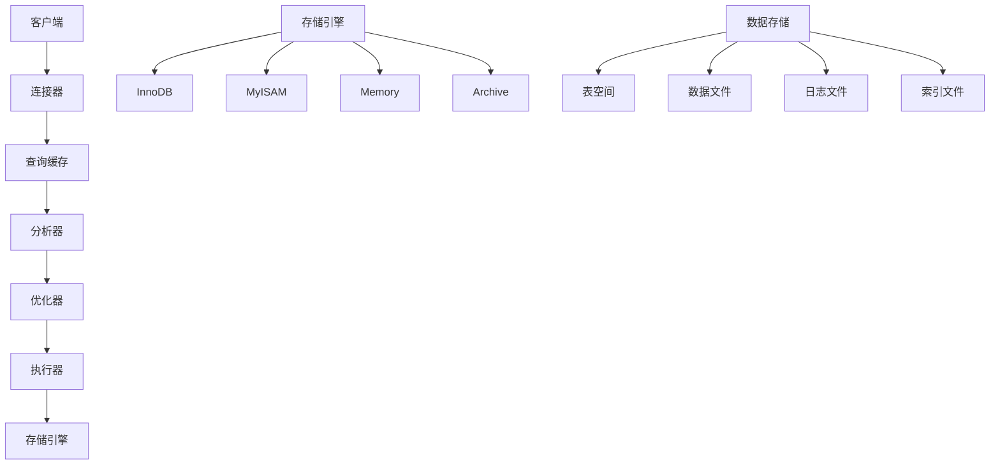

# MySQL基础

## 🎯 学习目标
- 掌握MySQL数据库的基本操作
- 理解SQL语句的编写和执行
- 学会数据库设计和优化
- 了解MySQL的特性和最佳实践

## 📚 核心概念

### MySQL架构



### MySQL数据类型对比

| 数据类型 | 描述 | 存储大小 | 范围 | 适用场景 |
|----------|------|----------|------|----------|
| TINYINT | 小整数 | 1字节 | -128~127 | 状态值、年龄 |
| INT | 整数 | 4字节 | -2^31~2^31-1 | ID、数量 |
| BIGINT | 大整数 | 8字节 | -2^63~2^63-1 | 大ID、时间戳 |
| VARCHAR | 变长字符串 | 1-65535字节 | 0-65535字符 | 姓名、标题 |
| TEXT | 长文本 | 1-65535字节 | 0-65535字符 | 内容、描述 |
| DATETIME | 日期时间 | 8字节 | 1000-01-01~9999-12-31 | 创建时间、更新时间 |
| DECIMAL | 精确小数 | 变长 | 精确计算 | 价格、金额 |

## 🔧 MySQL操作实现

### 数据库连接管理器
```php
<?php
// 1. 数据库连接管理器
class DatabaseManager {
    private $connections;
    private $defaultConnection;
    private $config;
    
    public function __construct($config = []) {
        $this->connections = [];
        $this->config = array_merge([
            'host' => 'localhost',
            'port' => 3306,
            'username' => 'root',
            'password' => '',
            'database' => 'test',
            'charset' => 'utf8mb4',
            'options' => [
                PDO::ATTR_ERRMODE => PDO::ERRMODE_EXCEPTION,
                PDO::ATTR_DEFAULT_FETCH_MODE => PDO::FETCH_ASSOC,
                PDO::ATTR_EMULATE_PREPARES => false
            ]
        ], $config);
    }
    
    // 创建数据库连接
    public function createConnection($name = 'default', $config = []) {
        $config = array_merge($this->config, $config);
        
        $dsn = "mysql:host={$config['host']};port={$config['port']};dbname={$config['database']};charset={$config['charset']}";
        
        try {
            $pdo = new PDO($dsn, $config['username'], $config['password'], $config['options']);
            $this->connections[$name] = $pdo;
            
            if ($name === 'default' || !$this->defaultConnection) {
                $this->defaultConnection = $name;
            }
            
            return $pdo;
        } catch (PDOException $e) {
            throw new Exception("数据库连接失败: " . $e->getMessage());
        }
    }
    
    // 获取连接
    public function getConnection($name = null) {
        $name = $name ?: $this->defaultConnection;
        
        if (!isset($this->connections[$name])) {
            $this->createConnection($name);
        }
        
        return $this->connections[$name];
    }
    
    // 关闭连接
    public function closeConnection($name = null) {
        if ($name) {
            unset($this->connections[$name]);
        } else {
            $this->connections = [];
        }
    }
    
    // 测试连接
    public function testConnection($name = null) {
        try {
            $pdo = $this->getConnection($name);
            $pdo->query('SELECT 1');
            return true;
        } catch (Exception $e) {
            return false;
        }
    }
    
    // 获取连接信息
    public function getConnectionInfo($name = null) {
        $pdo = $this->getConnection($name);
        
        return [
            'version' => $pdo->query('SELECT VERSION()')->fetchColumn(),
            'charset' => $pdo->query('SELECT @@character_set_database')->fetchColumn(),
            'collation' => $pdo->query('SELECT @@collation_database')->fetchColumn(),
            'timezone' => $pdo->query('SELECT @@time_zone')->fetchColumn()
        ];
    }
}

// 2. 数据库操作类
class DatabaseOperations {
    private $db;
    private $tablePrefix;
    
    public function __construct($db, $tablePrefix = '') {
        $this->db = $db;
        $this->tablePrefix = $tablePrefix;
    }
    
    // 执行查询
    public function query($sql, $params = []) {
        try {
            $stmt = $this->db->prepare($sql);
            $stmt->execute($params);
            return $stmt;
        } catch (PDOException $e) {
            throw new Exception("查询执行失败: " . $e->getMessage());
        }
    }
    
    // 获取单行数据
    public function fetchRow($sql, $params = []) {
        $stmt = $this->query($sql, $params);
        return $stmt->fetch();
    }
    
    // 获取多行数据
    public function fetchAll($sql, $params = []) {
        $stmt = $this->query($sql, $params);
        return $stmt->fetchAll();
    }
    
    // 获取单个值
    public function fetchColumn($sql, $params = []) {
        $stmt = $this->query($sql, $params);
        return $stmt->fetchColumn();
    }
    
    // 插入数据
    public function insert($table, $data) {
        $table = $this->tablePrefix . $table;
        $fields = array_keys($data);
        $placeholders = ':' . implode(', :', $fields);
        
        $sql = "INSERT INTO `{$table}` (`" . implode('`, `', $fields) . "`) VALUES ({$placeholders})";
        
        $stmt = $this->query($sql, $data);
        return $this->db->lastInsertId();
    }
    
    // 更新数据
    public function update($table, $data, $where, $whereParams = []) {
        $table = $this->tablePrefix . $table;
        $setClause = [];
        
        foreach ($data as $field => $value) {
            $setClause[] = "`{$field}` = :{$field}";
        }
        
        $sql = "UPDATE `{$table}` SET " . implode(', ', $setClause) . " WHERE {$where}";
        $params = array_merge($data, $whereParams);
        
        $stmt = $this->query($sql, $params);
        return $stmt->rowCount();
    }
    
    // 删除数据
    public function delete($table, $where, $params = []) {
        $table = $this->tablePrefix . $table;
        $sql = "DELETE FROM `{$table}` WHERE {$where}";
        
        $stmt = $this->query($sql, $params);
        return $stmt->rowCount();
    }
    
    // 开始事务
    public function beginTransaction() {
        return $this->db->beginTransaction();
    }
    
    // 提交事务
    public function commit() {
        return $this->db->commit();
    }
    
    // 回滚事务
    public function rollback() {
        return $this->db->rollback();
    }
    
    // 执行事务
    public function transaction($callback) {
        $this->beginTransaction();
        
        try {
            $result = $callback($this);
            $this->commit();
            return $result;
        } catch (Exception $e) {
            $this->rollback();
            throw $e;
        }
    }
    
    // 获取表信息
    public function getTableInfo($table) {
        $table = $this->tablePrefix . $table;
        $sql = "DESCRIBE `{$table}`";
        return $this->fetchAll($sql);
    }
    
    // 获取表索引
    public function getTableIndexes($table) {
        $table = $this->tablePrefix . $table;
        $sql = "SHOW INDEX FROM `{$table}`";
        return $this->fetchAll($sql);
    }
    
    // 检查表是否存在
    public function tableExists($table) {
        $table = $this->tablePrefix . $table;
        $sql = "SHOW TABLES LIKE ?";
        $result = $this->fetchColumn($sql, [$table]);
        return !empty($result);
    }
    
    // 获取数据库大小
    public function getDatabaseSize() {
        $sql = "
            SELECT 
                table_schema AS 'Database',
                ROUND(SUM(data_length + index_length) / 1024 / 1024, 2) AS 'Size (MB)'
            FROM information_schema.tables 
            WHERE table_schema = DATABASE()
            GROUP BY table_schema
        ";
        return $this->fetchRow($sql);
    }
}

// 3. 数据库迁移器
class DatabaseMigrator {
    private $db;
    private $migrationsTable;
    
    public function __construct($db, $migrationsTable = 'migrations') {
        $this->db = $db;
        $this->migrationsTable = $migrationsTable;
        $this->createMigrationsTable();
    }
    
    // 创建迁移表
    private function createMigrationsTable() {
        $sql = "
            CREATE TABLE IF NOT EXISTS `{$this->migrationsTable}` (
                `id` INT AUTO_INCREMENT PRIMARY KEY,
                `migration` VARCHAR(255) NOT NULL,
                `batch` INT NOT NULL,
                `executed_at` TIMESTAMP DEFAULT CURRENT_TIMESTAMP
            )
        ";
        $this->db->query($sql);
    }
    
    // 运行迁移
    public function runMigrations($migrations) {
        $batch = $this->getNextBatchNumber();
        
        foreach ($migrations as $migration) {
            if (!$this->isMigrationExecuted($migration['name'])) {
                $this->executeMigration($migration, $batch);
            }
        }
    }
    
    // 执行迁移
    private function executeMigration($migration, $batch) {
        try {
            $this->db->beginTransaction();
            
            // 执行迁移SQL
            if (isset($migration['up'])) {
                $this->db->query($migration['up']);
            }
            
            // 记录迁移
            $this->recordMigration($migration['name'], $batch);
            
            $this->db->commit();
        } catch (Exception $e) {
            $this->db->rollback();
            throw new Exception("迁移执行失败: " . $e->getMessage());
        }
    }
    
    // 记录迁移
    private function recordMigration($migrationName, $batch) {
        $sql = "INSERT INTO `{$this->migrationsTable}` (migration, batch) VALUES (?, ?)";
        $this->db->query($sql, [$migrationName, $batch]);
    }
    
    // 检查迁移是否已执行
    private function isMigrationExecuted($migrationName) {
        $sql = "SELECT COUNT(*) FROM `{$this->migrationsTable}` WHERE migration = ?";
        return $this->db->fetchColumn($sql, [$migrationName]) > 0;
    }
    
    // 获取下一批次号
    private function getNextBatchNumber() {
        $sql = "SELECT MAX(batch) FROM `{$this->migrationsTable}`";
        $maxBatch = $this->db->fetchColumn($sql);
        return ($maxBatch ?: 0) + 1;
    }
    
    // 回滚迁移
    public function rollbackMigrations($steps = 1) {
        $sql = "SELECT migration FROM `{$this->migrationsTable}` ORDER BY batch DESC, id DESC LIMIT ?";
        $migrations = $this->db->fetchAll($sql, [$steps]);
        
        foreach ($migrations as $migration) {
            $this->rollbackMigration($migration['migration']);
        }
    }
    
    // 回滚单个迁移
    private function rollbackMigration($migrationName) {
        // 这里需要根据迁移名称执行对应的回滚操作
        // 简化实现
        $sql = "DELETE FROM `{$this->migrationsTable}` WHERE migration = ?";
        $this->db->query($sql, [$migrationName]);
    }
}

// 使用示例
echo "=== MySQL基础操作示例 ===\n";

try {
    // 创建数据库管理器
    $dbManager = new DatabaseManager([
        'host' => 'localhost',
        'username' => 'root',
        'password' => '',
        'database' => 'test_db'
    ]);
    
    // 创建连接
    $pdo = $dbManager->createConnection();
    echo "数据库连接成功\n";
    
    // 获取连接信息
    $info = $dbManager->getConnectionInfo();
    echo "MySQL版本: {$info['version']}\n";
    echo "字符集: {$info['charset']}\n";
    echo "排序规则: {$info['collation']}\n";
    
    // 创建数据库操作实例
    $db = new DatabaseOperations($pdo);
    
    // 创建测试表
    $createTableSql = "
        CREATE TABLE IF NOT EXISTS `users` (
            `id` INT AUTO_INCREMENT PRIMARY KEY,
            `name` VARCHAR(100) NOT NULL,
            `email` VARCHAR(100) UNIQUE NOT NULL,
            `age` INT,
            `created_at` TIMESTAMP DEFAULT CURRENT_TIMESTAMP,
            `updated_at` TIMESTAMP DEFAULT CURRENT_TIMESTAMP ON UPDATE CURRENT_TIMESTAMP
        )
    ";
    $db->query($createTableSql);
    echo "测试表创建成功\n";
    
    // 插入数据
    $userId = $db->insert('users', [
        'name' => 'John Doe',
        'email' => 'john@example.com',
        'age' => 30
    ]);
    echo "插入用户ID: $userId\n";
    
    // 查询数据
    $user = $db->fetchRow("SELECT * FROM users WHERE id = ?", [$userId]);
    echo "查询用户: " . json_encode($user) . "\n";
    
    // 更新数据
    $affectedRows = $db->update('users', ['age' => 31], 'id = ?', [$userId]);
    echo "更新影响行数: $affectedRows\n";
    
    // 事务操作
    $result = $db->transaction(function($db) {
        $id1 = $db->insert('users', [
            'name' => 'Jane Doe',
            'email' => 'jane@example.com',
            'age' => 25
        ]);
        
        $id2 = $db->insert('users', [
            'name' => 'Bob Smith',
            'email' => 'bob@example.com',
            'age' => 35
        ]);
        
        return [$id1, $id2];
    });
    echo "事务操作结果: " . json_encode($result) . "\n";
    
    // 获取表信息
    $tableInfo = $db->getTableInfo('users');
    echo "表结构信息:\n";
    foreach ($tableInfo as $column) {
        echo "  {$column['Field']}: {$column['Type']} {$column['Null']} {$column['Key']}\n";
    }
    
    // 获取数据库大小
    $dbSize = $db->getDatabaseSize();
    echo "数据库大小: {$dbSize['Size (MB)']} MB\n";
    
} catch (Exception $e) {
    echo "错误: " . $e->getMessage() . "\n";
}
?>
```

### 数据库设计器
```php
<?php
// 1. 数据库设计器
class DatabaseDesigner {
    private $db;
    private $tables;
    
    public function __construct($db) {
        $this->db = $db;
        $this->tables = [];
    }
    
    // 创建表
    public function createTable($name, $columns, $options = []) {
        $sql = $this->buildCreateTableSQL($name, $columns, $options);
        $this->db->query($sql);
        
        $this->tables[$name] = [
            'columns' => $columns,
            'options' => $options
        ];
        
        return $this;
    }
    
    // 构建创建表SQL
    private function buildCreateTableSQL($name, $columns, $options) {
        $sql = "CREATE TABLE `{$name}` (\n";
        
        $columnDefinitions = [];
        $primaryKeys = [];
        $indexes = [];
        
        foreach ($columns as $columnName => $columnDef) {
            $columnSQL = $this->buildColumnSQL($columnName, $columnDef);
            $columnDefinitions[] = $columnSQL;
            
            if (isset($columnDef['primary']) && $columnDef['primary']) {
                $primaryKeys[] = "`{$columnName}`";
            }
            
            if (isset($columnDef['index'])) {
                $indexes[] = "INDEX `idx_{$columnName}` (`{$columnName}`)";
            }
            
            if (isset($columnDef['unique'])) {
                $indexes[] = "UNIQUE KEY `uk_{$columnName}` (`{$columnName}`)";
            }
        }
        
        // 添加主键
        if (!empty($primaryKeys)) {
            $columnDefinitions[] = "PRIMARY KEY (" . implode(', ', $primaryKeys) . ")";
        }
        
        // 添加索引
        $columnDefinitions = array_merge($columnDefinitions, $indexes);
        
        $sql .= "  " . implode(",\n  ", $columnDefinitions) . "\n";
        $sql .= ")";
        
        // 添加表选项
        if (isset($options['engine'])) {
            $sql .= " ENGINE={$options['engine']}";
        }
        
        if (isset($options['charset'])) {
            $sql .= " DEFAULT CHARSET={$options['charset']}";
        }
        
        if (isset($options['collate'])) {
            $sql .= " COLLATE={$options['collate']}";
        }
        
        return $sql;
    }
    
    // 构建列SQL
    private function buildColumnSQL($name, $definition) {
        $sql = "`{$name}` ";
        
        // 数据类型
        $sql .= $definition['type'];
        
        // 长度
        if (isset($definition['length'])) {
            $sql .= "({$definition['length']})";
        }
        
        // 无符号
        if (isset($definition['unsigned']) && $definition['unsigned']) {
            $sql .= " UNSIGNED";
        }
        
        // 非空
        if (isset($definition['null']) && !$definition['null']) {
            $sql .= " NOT NULL";
        }
        
        // 默认值
        if (isset($definition['default'])) {
            $sql .= " DEFAULT " . $this->formatDefaultValue($definition['default']);
        }
        
        // 自动递增
        if (isset($definition['auto_increment']) && $definition['auto_increment']) {
            $sql .= " AUTO_INCREMENT";
        }
        
        // 注释
        if (isset($definition['comment'])) {
            $sql .= " COMMENT '" . addslashes($definition['comment']) . "'";
        }
        
        return $sql;
    }
    
    // 格式化默认值
    private function formatDefaultValue($value) {
        if ($value === null) {
            return 'NULL';
        } elseif (is_string($value)) {
            return "'" . addslashes($value) . "'";
        } elseif (is_bool($value)) {
            return $value ? '1' : '0';
        } else {
            return $value;
        }
    }
    
    // 添加外键
    public function addForeignKey($table, $column, $referencedTable, $referencedColumn, $options = []) {
        $constraintName = $options['name'] ?? "fk_{$table}_{$column}";
        $onDelete = $options['on_delete'] ?? 'RESTRICT';
        $onUpdate = $options['on_update'] ?? 'RESTRICT';
        
        $sql = "
            ALTER TABLE `{$table}` 
            ADD CONSTRAINT `{$constraintName}` 
            FOREIGN KEY (`{$column}`) 
            REFERENCES `{$referencedTable}` (`{$referencedColumn}`)
            ON DELETE {$onDelete} 
            ON UPDATE {$onUpdate}
        ";
        
        $this->db->query($sql);
        return $this;
    }
    
    // 创建索引
    public function createIndex($table, $columns, $options = []) {
        $indexName = $options['name'] ?? 'idx_' . implode('_', $columns);
        $indexType = $options['type'] ?? 'INDEX';
        
        $columnList = '`' . implode('`, `', $columns) . '`';
        $sql = "ALTER TABLE `{$table}` ADD {$indexType} `{$indexName}` ({$columnList})";
        
        $this->db->query($sql);
        return $this;
    }
    
    // 修改表结构
    public function alterTable($table, $operations) {
        foreach ($operations as $operation) {
            $sql = $this->buildAlterTableSQL($table, $operation);
            $this->db->query($sql);
        }
        
        return $this;
    }
    
    // 构建ALTER TABLE SQL
    private function buildAlterTableSQL($table, $operation) {
        $sql = "ALTER TABLE `{$table}` ";
        
        switch ($operation['action']) {
            case 'add_column':
                $sql .= "ADD COLUMN " . $this->buildColumnSQL($operation['name'], $operation['definition']);
                break;
                
            case 'drop_column':
                $sql .= "DROP COLUMN `{$operation['name']}`";
                break;
                
            case 'modify_column':
                $sql .= "MODIFY COLUMN " . $this->buildColumnSQL($operation['name'], $operation['definition']);
                break;
                
            case 'rename_column':
                $sql .= "CHANGE COLUMN `{$operation['old_name']}` " . $this->buildColumnSQL($operation['new_name'], $operation['definition']);
                break;
        }
        
        return $sql;
    }
    
    // 删除表
    public function dropTable($table) {
        $sql = "DROP TABLE IF EXISTS `{$table}`";
        $this->db->query($sql);
        
        unset($this->tables[$table]);
        return $this;
    }
    
    // 获取表设计
    public function getTableDesign($table) {
        if (isset($this->tables[$table])) {
            return $this->tables[$table];
        }
        
        // 从数据库获取表结构
        $columns = $this->db->getTableInfo($table);
        $indexes = $this->db->getTableIndexes($table);
        
        return [
            'columns' => $columns,
            'indexes' => $indexes
        ];
    }
}

// 使用示例
echo "=== 数据库设计器示例 ===\n";

try {
    // 创建数据库连接
    $pdo = new PDO('sqlite::memory:');
    $db = new DatabaseOperations($pdo);
    $designer = new DatabaseDesigner($db);
    
    // 创建用户表
    $designer->createTable('users', [
        'id' => [
            'type' => 'INT',
            'primary' => true,
            'auto_increment' => true,
            'comment' => '用户ID'
        ],
        'username' => [
            'type' => 'VARCHAR',
            'length' => 50,
            'null' => false,
            'unique' => true,
            'comment' => '用户名'
        ],
        'email' => [
            'type' => 'VARCHAR',
            'length' => 100,
            'null' => false,
            'unique' => true,
            'comment' => '邮箱'
        ],
        'password_hash' => [
            'type' => 'VARCHAR',
            'length' => 255,
            'null' => false,
            'comment' => '密码哈希'
        ],
        'status' => [
            'type' => 'TINYINT',
            'length' => 1,
            'default' => 1,
            'comment' => '状态：1-正常，0-禁用'
        ],
        'created_at' => [
            'type' => 'TIMESTAMP',
            'default' => 'CURRENT_TIMESTAMP',
            'comment' => '创建时间'
        ],
        'updated_at' => [
            'type' => 'TIMESTAMP',
            'default' => 'CURRENT_TIMESTAMP ON UPDATE CURRENT_TIMESTAMP',
            'comment' => '更新时间'
        ]
    ], [
        'engine' => 'InnoDB',
        'charset' => 'utf8mb4',
        'collate' => 'utf8mb4_unicode_ci'
    ]);
    
    echo "用户表创建成功\n";
    
    // 创建文章表
    $designer->createTable('articles', [
        'id' => [
            'type' => 'INT',
            'primary' => true,
            'auto_increment' => true,
            'comment' => '文章ID'
        ],
        'user_id' => [
            'type' => 'INT',
            'null' => false,
            'index' => true,
            'comment' => '作者ID'
        ],
        'title' => [
            'type' => 'VARCHAR',
            'length' => 200,
            'null' => false,
            'comment' => '文章标题'
        ],
        'content' => [
            'type' => 'TEXT',
            'comment' => '文章内容'
        ],
        'status' => [
            'type' => 'ENUM',
            'length' => "'draft','published','archived'",
            'default' => 'draft',
            'comment' => '文章状态'
        ],
        'created_at' => [
            'type' => 'TIMESTAMP',
            'default' => 'CURRENT_TIMESTAMP',
            'comment' => '创建时间'
        ]
    ]);
    
    echo "文章表创建成功\n";
    
    // 添加外键
    $designer->addForeignKey('articles', 'user_id', 'users', 'id', [
        'on_delete' => 'CASCADE',
        'on_update' => 'CASCADE'
    ]);
    
    echo "外键添加成功\n";
    
    // 创建复合索引
    $designer->createIndex('articles', ['user_id', 'status'], [
        'name' => 'idx_user_status'
    ]);
    
    echo "复合索引创建成功\n";
    
    // 修改表结构
    $designer->alterTable('users', [
        [
            'action' => 'add_column',
            'name' => 'last_login_at',
            'definition' => [
                'type' => 'TIMESTAMP',
                'null' => true,
                'comment' => '最后登录时间'
            ]
        ]
    ]);
    
    echo "表结构修改成功\n";
    
    // 获取表设计
    $userDesign = $designer->getTableDesign('users');
    echo "用户表设计:\n";
    foreach ($userDesign['columns'] as $column) {
        echo "  {$column['Field']}: {$column['Type']}\n";
    }
    
} catch (Exception $e) {
    echo "错误: " . $e->getMessage() . "\n";
}
?>
```

## 📊 最佳实践

### MySQL最佳实践
```php
<?php
// MySQL最佳实践

class MySQLBestPractices {
    // 1. 数据库设计原则
    public static function getDatabaseDesignPrinciples() {
        return [
            '规范化设计' => [
                '第一范式' => '每个字段都是原子值，不可再分',
                '第二范式' => '非主键字段完全依赖于主键',
                '第三范式' => '非主键字段不依赖于其他非主键字段',
                '反规范化' => '在特定场景下适度反规范化以提高性能'
            ],
            '命名规范' => [
                '表名' => '使用复数形式，小写字母和下划线',
                '字段名' => '使用小写字母和下划线，具有描述性',
                '索引名' => '使用前缀标识类型，如idx_、uk_、fk_',
                '约束名' => '使用有意义的名称，便于维护'
            ],
            '数据类型选择' => [
                '整数类型' => '根据数据范围选择合适的整数类型',
                '字符串类型' => 'VARCHAR用于变长，CHAR用于定长',
                '日期时间' => 'DATETIME用于本地时间，TIMESTAMP用于UTC',
                '小数类型' => 'DECIMAL用于精确计算，FLOAT用于近似值'
            ],
            '索引设计' => [
                '主键索引' => '每个表都应该有主键',
                '唯一索引' => '为唯一字段创建唯一索引',
                '普通索引' => '为经常查询的字段创建索引',
                '复合索引' => '为多字段查询创建复合索引'
            ]
        ];
    }
    
    // 2. 性能优化策略
    public static function getPerformanceOptimizationStrategies() {
        return [
            '查询优化' => [
                '避免SELECT *' => '只选择需要的字段',
                '使用LIMIT' => '限制返回结果数量',
                '优化WHERE' => '使用索引字段作为WHERE条件',
                '避免函数' => '避免在WHERE子句中使用函数'
            ],
            '索引优化' => [
                '覆盖索引' => '创建包含所有查询字段的索引',
                '前缀索引' => '为长字符串字段创建前缀索引',
                '复合索引' => '根据查询模式设计复合索引',
                '索引维护' => '定期分析和优化索引'
            ],
            '表结构优化' => [
                '字段类型' => '选择合适的数据类型',
                '字段长度' => '设置合理的字段长度',
                'NULL值' => '避免不必要的NULL值',
                '默认值' => '为字段设置合适的默认值'
            ],
            '存储引擎选择' => [
                'InnoDB' => '支持事务，适合OLTP应用',
                'MyISAM' => '查询速度快，适合只读应用',
                'Memory' => '数据存储在内存中，速度快',
                'Archive' => '压缩存储，适合归档数据'
            ]
        ];
    }
    
    // 3. 安全最佳实践
    public static function getSecurityBestPractices() {
        return [
            '访问控制' => [
                '用户权限' => '为不同用户分配最小必要权限',
                '网络访问' => '限制数据库的网络访问',
                'SSL连接' => '使用SSL加密数据库连接',
                '防火墙' => '配置防火墙规则保护数据库'
            ],
            '数据保护' => [
                '数据加密' => '对敏感数据进行加密存储',
                '备份加密' => '对备份文件进行加密',
                '传输加密' => '使用SSL/TLS加密数据传输',
                '日志保护' => '保护数据库日志文件'
            ],
            'SQL注入防护' => [
                '预处理语句' => '使用预处理语句防止SQL注入',
                '参数验证' => '验证和过滤用户输入',
                '错误处理' => '不向用户暴露数据库错误信息',
                '权限控制' => '限制数据库用户权限'
            ],
            '审计和监控' => [
                '访问日志' => '记录数据库访问日志',
                '操作审计' => '审计敏感操作',
                '异常监控' => '监控异常访问模式',
                '定期检查' => '定期检查安全配置'
            ]
        ];
    }
    
    // 4. 维护和监控
    public static function getMaintenanceAndMonitoring() {
        return [
            '定期维护' => [
                '表优化' => '定期执行OPTIMIZE TABLE',
                '索引分析' => '使用ANALYZE TABLE更新统计信息',
                '碎片整理' => '整理表碎片提高性能',
                '日志清理' => '定期清理日志文件'
            ],
            '性能监控' => [
                '慢查询日志' => '启用慢查询日志分析',
                '性能模式' => '使用Performance Schema监控',
                '系统监控' => '监控CPU、内存、磁盘使用',
                '连接监控' => '监控数据库连接数'
            ],
            '备份策略' => [
                '全量备份' => '定期进行全量备份',
                '增量备份' => '使用二进制日志进行增量备份',
                '备份验证' => '定期验证备份文件完整性',
                '恢复测试' => '定期测试备份恢复流程'
            ],
            '故障处理' => [
                '故障诊断' => '建立故障诊断流程',
                '应急响应' => '制定应急响应计划',
                '数据恢复' => '建立数据恢复机制',
                '经验总结' => '总结故障处理经验'
            ]
        ];
    }
}

// 使用示例
echo "=== MySQL最佳实践示例 ===\n";

try {
    // 数据库设计原则
    $designPrinciples = MySQLBestPractices::getDatabaseDesignPrinciples();
    echo "数据库设计原则:\n";
    foreach ($designPrinciples as $category => $principles) {
        echo "  $category:\n";
        foreach ($principles as $principle => $description) {
            echo "    - $principle: $description\n";
        }
        echo "\n";
    }
    
    // 性能优化策略
    $performanceStrategies = MySQLBestPractices::getPerformanceOptimizationStrategies();
    echo "性能优化策略:\n";
    foreach ($performanceStrategies as $category => $strategies) {
        echo "  $category:\n";
        foreach ($strategies as $strategy => $description) {
            echo "    - $strategy: $description\n";
        }
        echo "\n";
    }
    
    // 安全最佳实践
    $securityPractices = MySQLBestPractices::getSecurityBestPractices();
    echo "安全最佳实践:\n";
    foreach ($securityPractices as $category => $practices) {
        echo "  $category:\n";
        foreach ($practices as $practice => $description) {
            echo "    - $practice: $description\n";
        }
        echo "\n";
    }
    
    // 维护和监控
    $maintenance = MySQLBestPractices::getMaintenanceAndMonitoring();
    echo "维护和监控:\n";
    foreach ($maintenance as $category => $items) {
        echo "  $category:\n";
        foreach ($items as $item => $description) {
            echo "    - $item: $description\n";
        }
        echo "\n";
    }
    
} catch (Exception $e) {
    echo "错误: " . $e->getMessage() . "\n";
}
?>
```

## 🎓 学习建议

### 费曼学习法应用
1. **选择概念**: 选择MySQL中的核心概念
2. **简化解释**: 用简单语言解释MySQL的重要性
3. **识别盲点**: 发现理解不深入的地方
4. **重新学习**: 针对盲点进行深入学习

### 刻意练习重点
1. **SQL语句**: 掌握各种SQL语句的编写
2. **数据库设计**: 学会设计合理的数据库结构
3. **性能优化**: 理解MySQL性能优化方法
4. **安全管理**: 掌握数据库安全最佳实践

## 🔗 相关链接
- [[02-PDO数据库抽象层|PDO数据库抽象层]]
- [[03-预处理语句|预处理语句]]
- [[04-事务处理|事务处理]]
- [[05-ORM框架使用|ORM框架使用]]
- [[06-数据库优化|数据库优化]]
- [[07-数据库设计原则|数据库设计原则]]
