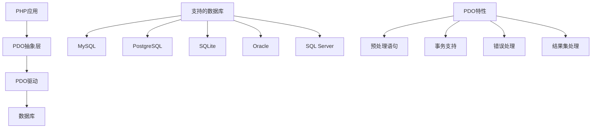

# PDO数据库抽象层

## 🎯 学习目标
- 掌握PDO的基本概念和使用方法
- 理解数据库抽象层的作用和优势
- 学会使用PDO进行数据库操作
- 了解PDO的高级特性和最佳实践

## 📚 核心概念

### PDO架构



### PDO vs MySQLi对比

| 特性 | PDO | MySQLi |
|------|-----|--------|
| 数据库支持 | 多数据库 | 仅MySQL |
| 面向对象 | 完全支持 | 支持 |
| 预处理语句 | 支持 | 支持 |
| 事务支持 | 支持 | 支持 |
| 错误处理 | 多种模式 | 基本支持 |
| 性能 | 中等 | 较高 |
| 学习曲线 | 平缓 | 陡峭 |

## 🔧 PDO实现

### PDO管理器
```php
<?php
// 1. PDO管理器类
class PDOManager {
    private $connections;
    private $defaultConnection;
    private $config;
    
    public function __construct($config = []) {
        $this->connections = [];
        $this->config = array_merge([
            'default' => [
                'dsn' => 'mysql:host=localhost;dbname=test',
                'username' => 'root',
                'password' => '',
                'options' => [
                    PDO::ATTR_ERRMODE => PDO::ERRMODE_EXCEPTION,
                    PDO::ATTR_DEFAULT_FETCH_MODE => PDO::FETCH_ASSOC,
                    PDO::ATTR_EMULATE_PREPARES => false,
                    PDO::MYSQL_ATTR_INIT_COMMAND => "SET NAMES utf8mb4"
                ]
            ]
        ], $config);
    }
    
    // 创建连接
    public function createConnection($name = 'default', $config = null) {
        if ($config === null) {
            $config = $this->config[$name] ?? $this->config['default'];
        }
        
        try {
            $pdo = new PDO(
                $config['dsn'],
                $config['username'],
                $config['password'],
                $config['options']
            );
            
            $this->connections[$name] = $pdo;
            
            if ($name === 'default' || !$this->defaultConnection) {
                $this->defaultConnection = $name;
            }
            
            return $pdo;
        } catch (PDOException $e) {
            throw new Exception("PDO连接失败: " . $e->getMessage());
        }
    }
    
    // 获取连接
    public function getConnection($name = null) {
        $name = $name ?: $this->defaultConnection;
        
        if (!isset($this->connections[$name])) {
            $this->createConnection($name);
        }
        
        return $this->connections[$name];
    }
    
    // 关闭连接
    public function closeConnection($name = null) {
        if ($name) {
            unset($this->connections[$name]);
        } else {
            $this->connections = [];
        }
    }
    
    // 测试连接
    public function testConnection($name = null) {
        try {
            $pdo = $this->getConnection($name);
            $pdo->query('SELECT 1');
            return true;
        } catch (Exception $e) {
            return false;
        }
    }
    
    // 获取连接信息
    public function getConnectionInfo($name = null) {
        $pdo = $this->getConnection($name);
        
        return [
            'driver' => $pdo->getAttribute(PDO::ATTR_DRIVER_NAME),
            'version' => $pdo->getAttribute(PDO::ATTR_SERVER_VERSION),
            'connection_status' => $pdo->getAttribute(PDO::ATTR_CONNECTION_STATUS),
            'autocommit' => $pdo->getAttribute(PDO::ATTR_AUTOCOMMIT)
        ];
    }
}

// 2. PDO查询构建器
class PDOQueryBuilder {
    private $pdo;
    private $table;
    private $select = '*';
    private $where = [];
    private $joins = [];
    private $orderBy = [];
    private $groupBy = [];
    private $having = [];
    private $limit = null;
    private $offset = null;
    
    public function __construct($pdo) {
        $this->pdo = $pdo;
    }
    
    // 设置表名
    public function table($table) {
        $this->table = $table;
        return $this;
    }
    
    // 设置查询字段
    public function select($columns) {
        if (is_array($columns)) {
            $this->select = implode(', ', $columns);
        } else {
            $this->select = $columns;
        }
        return $this;
    }
    
    // 添加WHERE条件
    public function where($column, $operator = null, $value = null) {
        if (func_num_args() === 2) {
            $value = $operator;
            $operator = '=';
        }
        
        $this->where[] = [
            'column' => $column,
            'operator' => $operator,
            'value' => $value,
            'logic' => 'AND'
        ];
        
        return $this;
    }
    
    // 添加OR WHERE条件
    public function orWhere($column, $operator = null, $value = null) {
        if (func_num_args() === 2) {
            $value = $operator;
            $operator = '=';
        }
        
        $this->where[] = [
            'column' => $column,
            'operator' => $operator,
            'value' => $value,
            'logic' => 'OR'
        ];
        
        return $this;
    }
    
    // 添加WHERE IN条件
    public function whereIn($column, $values) {
        $this->where[] = [
            'column' => $column,
            'operator' => 'IN',
            'value' => $values,
            'logic' => 'AND'
        ];
        
        return $this;
    }
    
    // 添加WHERE BETWEEN条件
    public function whereBetween($column, $min, $max) {
        $this->where[] = [
            'column' => $column,
            'operator' => 'BETWEEN',
            'value' => [$min, $max],
            'logic' => 'AND'
        ];
        
        return $this;
    }
    
    // 添加JOIN
    public function join($table, $first, $operator = null, $second = null) {
        if (func_num_args() === 3) {
            $second = $operator;
            $operator = '=';
        }
        
        $this->joins[] = [
            'type' => 'INNER',
            'table' => $table,
            'first' => $first,
            'operator' => $operator,
            'second' => $second
        ];
        
        return $this;
    }
    
    // 添加LEFT JOIN
    public function leftJoin($table, $first, $operator = null, $second = null) {
        if (func_num_args() === 3) {
            $second = $operator;
            $operator = '=';
        }
        
        $this->joins[] = [
            'type' => 'LEFT',
            'table' => $table,
            'first' => $first,
            'operator' => $operator,
            'second' => $second
        ];
        
        return $this;
    }
    
    // 添加ORDER BY
    public function orderBy($column, $direction = 'ASC') {
        $this->orderBy[] = "{$column} {$direction}";
        return $this;
    }
    
    // 添加GROUP BY
    public function groupBy($column) {
        $this->groupBy[] = $column;
        return $this;
    }
    
    // 添加HAVING条件
    public function having($column, $operator, $value) {
        $this->having[] = [
            'column' => $column,
            'operator' => $operator,
            'value' => $value
        ];
        
        return $this;
    }
    
    // 设置LIMIT
    public function limit($limit, $offset = null) {
        $this->limit = $limit;
        if ($offset !== null) {
            $this->offset = $offset;
        }
        return $this;
    }
    
    // 设置OFFSET
    public function offset($offset) {
        $this->offset = $offset;
        return $this;
    }
    
    // 构建SQL
    public function toSql() {
        $sql = "SELECT {$this->select} FROM `{$this->table}`";
        
        // 添加JOIN
        foreach ($this->joins as $join) {
            $sql .= " {$join['type']} JOIN `{$join['table']}` ON {$join['first']} {$join['operator']} {$join['second']}";
        }
        
        // 添加WHERE
        if (!empty($this->where)) {
            $sql .= " WHERE " . $this->buildWhereClause();
        }
        
        // 添加GROUP BY
        if (!empty($this->groupBy)) {
            $sql .= " GROUP BY " . implode(', ', $this->groupBy);
        }
        
        // 添加HAVING
        if (!empty($this->having)) {
            $sql .= " HAVING " . $this->buildHavingClause();
        }
        
        // 添加ORDER BY
        if (!empty($this->orderBy)) {
            $sql .= " ORDER BY " . implode(', ', $this->orderBy);
        }
        
        // 添加LIMIT
        if ($this->limit !== null) {
            $sql .= " LIMIT {$this->limit}";
            if ($this->offset !== null) {
                $sql .= " OFFSET {$this->offset}";
            }
        }
        
        return $sql;
    }
    
    // 构建WHERE子句
    private function buildWhereClause() {
        $conditions = [];
        
        foreach ($this->where as $index => $condition) {
            $logic = $index > 0 ? " {$condition['logic']} " : '';
            
            if ($condition['operator'] === 'IN') {
                $placeholders = str_repeat('?,', count($condition['value']) - 1) . '?';
                $conditions[] = $logic . "{$condition['column']} IN ({$placeholders})";
            } elseif ($condition['operator'] === 'BETWEEN') {
                $conditions[] = $logic . "{$condition['column']} BETWEEN ? AND ?";
            } else {
                $conditions[] = $logic . "{$condition['column']} {$condition['operator']} ?";
            }
        }
        
        return implode('', $conditions);
    }
    
    // 构建HAVING子句
    private function buildHavingClause() {
        $conditions = [];
        
        foreach ($this->having as $condition) {
            $conditions[] = "{$condition['column']} {$condition['operator']} ?";
        }
        
        return implode(' AND ', $conditions);
    }
    
    // 获取参数
    public function getParams() {
        $params = [];
        
        // WHERE参数
        foreach ($this->where as $condition) {
            if ($condition['operator'] === 'IN') {
                $params = array_merge($params, $condition['value']);
            } elseif ($condition['operator'] === 'BETWEEN') {
                $params = array_merge($params, $condition['value']);
            } else {
                $params[] = $condition['value'];
            }
        }
        
        // HAVING参数
        foreach ($this->having as $condition) {
            $params[] = $condition['value'];
        }
        
        return $params;
    }
    
    // 执行查询
    public function get() {
        $sql = $this->toSql();
        $params = $this->getParams();
        
        $stmt = $this->pdo->prepare($sql);
        $stmt->execute($params);
        
        return $stmt->fetchAll();
    }
    
    // 获取单行
    public function first() {
        $this->limit(1);
        $results = $this->get();
        return $results[0] ?? null;
    }
    
    // 获取数量
    public function count() {
        $this->select = 'COUNT(*) as count';
        $result = $this->first();
        return $result['count'] ?? 0;
    }
    
    // 重置构建器
    public function reset() {
        $this->table = null;
        $this->select = '*';
        $this->where = [];
        $this->joins = [];
        $this->orderBy = [];
        $this->groupBy = [];
        $this->having = [];
        $this->limit = null;
        $this->offset = null;
        
        return $this;
    }
}

// 3. PDO事务管理器
class PDOTransactionManager {
    private $pdo;
    private $transactions;
    
    public function __construct($pdo) {
        $this->pdo = $pdo;
        $this->transactions = [];
    }
    
    // 开始事务
    public function begin($name = null) {
        if ($name === null) {
            $name = 'default';
        }
        
        if (isset($this->transactions[$name])) {
            throw new Exception("事务 '{$name}' 已经存在");
        }
        
        $this->transactions[$name] = [
            'level' => $this->pdo->inTransaction() ? 1 : 0,
            'started' => microtime(true)
        ];
        
        if (!$this->pdo->inTransaction()) {
            $this->pdo->beginTransaction();
        }
        
        return $this;
    }
    
    // 提交事务
    public function commit($name = null) {
        if ($name === null) {
            $name = 'default';
        }
        
        if (!isset($this->transactions[$name])) {
            throw new Exception("事务 '{$name}' 不存在");
        }
        
        $transaction = $this->transactions[$name];
        
        if ($transaction['level'] === 0) {
            $this->pdo->commit();
        }
        
        unset($this->transactions[$name]);
        
        return $this;
    }
    
    // 回滚事务
    public function rollback($name = null) {
        if ($name === null) {
            $name = 'default';
        }
        
        if (!isset($this->transactions[$name])) {
            throw new Exception("事务 '{$name}' 不存在");
        }
        
        $transaction = $this->transactions[$name];
        
        if ($transaction['level'] === 0) {
            $this->pdo->rollback();
        }
        
        unset($this->transactions[$name]);
        
        return $this;
    }
    
    // 执行事务
    public function transaction($callback, $name = null) {
        $this->begin($name);
        
        try {
            $result = $callback($this->pdo);
            $this->commit($name);
            return $result;
        } catch (Exception $e) {
            $this->rollback($name);
            throw $e;
        }
    }
    
    // 检查是否在事务中
    public function inTransaction($name = null) {
        if ($name === null) {
            return $this->pdo->inTransaction();
        }
        
        return isset($this->transactions[$name]);
    }
    
    // 获取事务信息
    public function getTransactionInfo($name = null) {
        if ($name === null) {
            $name = 'default';
        }
        
        if (!isset($this->transactions[$name])) {
            return null;
        }
        
        $transaction = $this->transactions[$name];
        $transaction['duration'] = microtime(true) - $transaction['started'];
        
        return $transaction;
    }
}

// 使用示例
echo "=== PDO数据库抽象层示例 ===\n";

try {
    // 创建PDO管理器
    $pdoManager = new PDOManager([
        'default' => [
            'dsn' => 'sqlite::memory:',
            'username' => '',
            'password' => '',
            'options' => [
                PDO::ATTR_ERRMODE => PDO::ERRMODE_EXCEPTION,
                PDO::ATTR_DEFAULT_FETCH_MODE => PDO::FETCH_ASSOC
            ]
        ]
    ]);
    
    // 获取连接
    $pdo = $pdoManager->getConnection();
    echo "PDO连接成功\n";
    
    // 获取连接信息
    $info = $pdoManager->getConnectionInfo();
    echo "驱动: {$info['driver']}\n";
    echo "版本: {$info['version']}\n";
    
    // 创建测试表
    $pdo->exec("
        CREATE TABLE users (
            id INTEGER PRIMARY KEY AUTOINCREMENT,
            name VARCHAR(100) NOT NULL,
            email VARCHAR(100) UNIQUE NOT NULL,
            age INTEGER,
            created_at DATETIME DEFAULT CURRENT_TIMESTAMP
        )
    ");
    
    // 插入测试数据
    $pdo->exec("
        INSERT INTO users (name, email, age) VALUES 
        ('John Doe', 'john@example.com', 30),
        ('Jane Smith', 'jane@example.com', 25),
        ('Bob Johnson', 'bob@example.com', 35)
    ");
    
    // 使用查询构建器
    $queryBuilder = new PDOQueryBuilder($pdo);
    
    // 简单查询
    $users = $queryBuilder->table('users')
                          ->select(['name', 'email'])
                          ->where('age', '>', 25)
                          ->orderBy('name')
                          ->get();
    
    echo "查询结果:\n";
    foreach ($users as $user) {
        echo "  {$user['name']} - {$user['email']}\n";
    }
    
    // 复杂查询
    $queryBuilder->reset();
    $count = $queryBuilder->table('users')
                          ->where('age', 'BETWEEN', [20, 40])
                          ->count();
    
    echo "年龄在20-40之间的用户数量: $count\n";
    
    // 事务管理
    $transactionManager = new PDOTransactionManager($pdo);
    
    $result = $transactionManager->transaction(function($pdo) {
        // 插入新用户
        $stmt = $pdo->prepare("INSERT INTO users (name, email, age) VALUES (?, ?, ?)");
        $stmt->execute(['Alice Brown', 'alice@example.com', 28]);
        
        $userId = $pdo->lastInsertId();
        
        // 更新用户信息
        $stmt = $pdo->prepare("UPDATE users SET age = ? WHERE id = ?");
        $stmt->execute([29, $userId]);
        
        return $userId;
    });
    
    echo "事务执行成功，新用户ID: $result\n";
    
    // 获取所有用户
    $queryBuilder->reset();
    $allUsers = $queryBuilder->table('users')->get();
    
    echo "所有用户:\n";
    foreach ($allUsers as $user) {
        echo "  ID: {$user['id']}, 姓名: {$user['name']}, 邮箱: {$user['email']}, 年龄: {$user['age']}\n";
    }
    
} catch (Exception $e) {
    echo "错误: " . $e->getMessage() . "\n";
}
?>
```

## 📊 最佳实践

### PDO最佳实践
```php
<?php
// PDO最佳实践

class PDOBestPractices {
    // 1. 连接管理
    public static function getConnectionManagement() {
        return [
            '连接配置' => [
                'DSN配置' => '使用完整的DSN字符串',
                '字符集设置' => '明确设置字符集，如utf8mb4',
                '错误模式' => '设置PDO::ERRMODE_EXCEPTION',
                '预处理模式' => '设置PDO::ATTR_EMULATE_PREPARES为false'
            ],
            '连接池' => [
                '单例模式' => '使用单例模式管理连接',
                '连接复用' => '复用数据库连接',
                '连接超时' => '设置连接超时时间',
                '最大连接数' => '限制最大连接数'
            ],
            '安全配置' => [
                'SSL连接' => '使用SSL加密连接',
                '权限控制' => '使用最小权限原则',
                '密码安全' => '安全存储数据库密码',
                '网络隔离' => '限制数据库网络访问'
            ]
        ];
    }
    
    // 2. 查询优化
    public static function getQueryOptimization() {
        return [
            '预处理语句' => [
                '防止SQL注入' => '使用预处理语句防止SQL注入',
                '性能提升' => '预处理语句提高查询性能',
                '参数绑定' => '使用参数绑定传递数据',
                '语句缓存' => '利用预处理语句缓存'
            ],
            '查询构建' => [
                '查询构建器' => '使用查询构建器构建复杂查询',
                '链式调用' => '使用链式调用提高可读性',
                '条件构建' => '动态构建WHERE条件',
                'SQL生成' => '生成可读的SQL语句'
            ],
            '结果处理' => [
                '获取模式' => '选择合适的获取模式',
                '内存优化' => '使用生成器处理大量数据',
                '分页查询' => '实现高效的分页查询',
                '结果缓存' => '缓存查询结果'
            ]
        ];
    }
    
    // 3. 事务管理
    public static function getTransactionManagement() {
        return [
            '事务设计' => [
                '事务边界' => '合理设计事务边界',
                '事务嵌套' => '处理嵌套事务',
                '保存点' => '使用保存点处理复杂事务',
                '事务隔离' => '选择合适的隔离级别'
            ],
            '错误处理' => [
                '异常捕获' => '捕获和处理事务异常',
                '回滚策略' => '实现自动回滚机制',
                '错误日志' => '记录事务错误日志',
                '重试机制' => '实现事务重试机制'
            ],
            '性能优化' => [
                '事务大小' => '控制事务大小',
                '锁等待' => '减少锁等待时间',
                '死锁处理' => '处理死锁情况',
                '并发控制' => '实现并发控制'
            ]
        ];
    }
    
    // 4. 错误处理
    public static function getErrorHandling() {
        return [
            '异常处理' => [
                'PDO异常' => '捕获和处理PDO异常',
                '自定义异常' => '定义自定义异常类型',
                '异常链' => '维护异常链信息',
                '异常日志' => '记录异常详细信息'
            ],
            '错误恢复' => [
                '连接恢复' => '实现连接自动恢复',
                '查询重试' => '实现查询重试机制',
                '降级处理' => '实现服务降级',
                '故障转移' => '实现故障转移'
            ],
            '监控告警' => [
                '错误监控' => '监控数据库错误',
                '性能监控' => '监控查询性能',
                '告警机制' => '实现错误告警',
                '健康检查' => '实现健康检查'
            ]
        ];
    }
}

// 使用示例
echo "=== PDO最佳实践示例 ===\n";

try {
    // 连接管理
    $connectionManagement = PDOBestPractices::getConnectionManagement();
    echo "连接管理:\n";
    foreach ($connectionManagement as $category => $items) {
        echo "  $category:\n";
        foreach ($items as $item => $description) {
            echo "    - $item: $description\n";
        }
        echo "\n";
    }
    
    // 查询优化
    $queryOptimization = PDOBestPractices::getQueryOptimization();
    echo "查询优化:\n";
    foreach ($queryOptimization as $category => $items) {
        echo "  $category:\n";
        foreach ($items as $item => $description) {
            echo "    - $item: $description\n";
        }
        echo "\n";
    }
    
    // 事务管理
    $transactionManagement = PDOBestPractices::getTransactionManagement();
    echo "事务管理:\n";
    foreach ($transactionManagement as $category => $items) {
        echo "  $category:\n";
        foreach ($items as $item => $description) {
            echo "    - $item: $description\n";
        }
        echo "\n";
    }
    
    // 错误处理
    $errorHandling = PDOBestPractices::getErrorHandling();
    echo "错误处理:\n";
    foreach ($errorHandling as $category => $items) {
        echo "  $category:\n";
        foreach ($items as $item => $description) {
            echo "    - $item: $description\n";
        }
        echo "\n";
    }
    
} catch (Exception $e) {
    echo "错误: " . $e->getMessage() . "\n";
}
?>
```

## 🎓 学习建议

### 费曼学习法应用
1. **选择概念**: 选择PDO中的核心概念
2. **简化解释**: 用简单语言解释PDO的重要性
3. **识别盲点**: 发现理解不深入的地方
4. **重新学习**: 针对盲点进行深入学习

### 刻意练习重点
1. **连接管理**: 掌握PDO连接的管理和配置
2. **查询构建**: 学会使用PDO进行数据库查询
3. **事务处理**: 理解PDO事务的使用方法
4. **错误处理**: 掌握PDO错误处理机制

## 🔗 相关链接
- [[01-MySQL基础|MySQL基础]]
- [[03-预处理语句|预处理语句]]
- [[04-事务处理|事务处理]]
- [[05-ORM框架使用|ORM框架使用]]
- [[06-数据库优化|数据库优化]]
- [[07-数据库设计原则|数据库设计原则]]
