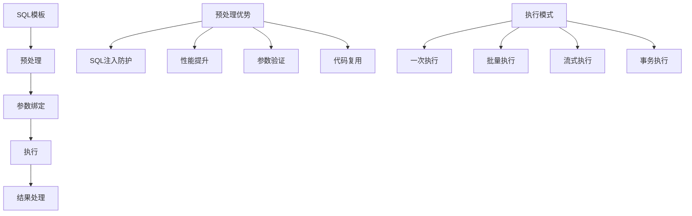

# 预处理语句

## 🎯 学习目标
- 掌握预处理语句的基本概念和使用方法
- 理解预处理语句的安全性和性能优势
- 学会使用PDO预处理语句进行数据库操作
- 了解预处理语句的最佳实践和注意事项

## 📚 核心概念

### 预处理语句流程



### 预处理语句 vs 普通查询

| 特性 | 预处理语句 | 普通查询 |
|------|------------|----------|
| 安全性 | 高（防SQL注入） | 低（易受攻击） |
| 性能 | 高（可缓存） | 低（每次解析） |
| 参数化 | 支持 | 不支持 |
| 复用性 | 高 | 低 |
| 复杂度 | 中等 | 低 |
| 错误处理 | 完善 | 基本 |

## 🔧 预处理语句实现

### 预处理语句管理器
```php
<?php
// 1. 预处理语句管理器
class PreparedStatementManager {
    private $pdo;
    private $statements;
    private $cache;
    
    public function __construct($pdo) {
        $this->pdo = $pdo;
        $this->statements = [];
        $this->cache = [];
    }
    
    // 准备语句
    public function prepare($sql, $options = []) {
        $cacheKey = md5($sql);
        
        // 检查缓存
        if (isset($this->cache[$cacheKey])) {
            return $this->cache[$cacheKey];
        }
        
        try {
            $stmt = $this->pdo->prepare($sql, $options);
            $this->statements[] = $stmt;
            $this->cache[$cacheKey] = $stmt;
            
            return $stmt;
        } catch (PDOException $e) {
            throw new Exception("预处理语句失败: " . $e->getMessage());
        }
    }
    
    // 执行查询
    public function execute($sql, $params = [], $options = []) {
        $stmt = $this->prepare($sql, $options);
        
        try {
            $result = $stmt->execute($params);
            return $stmt;
        } catch (PDOException $e) {
            throw new Exception("语句执行失败: " . $e->getMessage());
        }
    }
    
    // 获取单行数据
    public function fetchRow($sql, $params = [], $fetchMode = PDO::FETCH_ASSOC) {
        $stmt = $this->execute($sql, $params);
        return $stmt->fetch($fetchMode);
    }
    
    // 获取多行数据
    public function fetchAll($sql, $params = [], $fetchMode = PDO::FETCH_ASSOC) {
        $stmt = $this->execute($sql, $params);
        return $stmt->fetchAll($fetchMode);
    }
    
    // 获取单个值
    public function fetchColumn($sql, $params = [], $column = 0) {
        $stmt = $this->execute($sql, $params);
        return $stmt->fetchColumn($column);
    }
    
    // 插入数据
    public function insert($table, $data) {
        $fields = array_keys($data);
        $placeholders = ':' . implode(', :', $fields);
        
        $sql = "INSERT INTO `{$table}` (`" . implode('`, `', $fields) . "`) VALUES ({$placeholders})";
        
        $stmt = $this->execute($sql, $data);
        return $this->pdo->lastInsertId();
    }
    
    // 更新数据
    public function update($table, $data, $where, $whereParams = []) {
        $setClause = [];
        
        foreach ($data as $field => $value) {
            $setClause[] = "`{$field}` = :{$field}";
        }
        
        $sql = "UPDATE `{$table}` SET " . implode(', ', $setClause) . " WHERE {$where}";
        $params = array_merge($data, $whereParams);
        
        $stmt = $this->execute($sql, $params);
        return $stmt->rowCount();
    }
    
    // 删除数据
    public function delete($table, $where, $params = []) {
        $sql = "DELETE FROM `{$table}` WHERE {$where}";
        $stmt = $this->execute($sql, $params);
        return $stmt->rowCount();
    }
    
    // 批量插入
    public function batchInsert($table, $data) {
        if (empty($data)) {
            return 0;
        }
        
        $fields = array_keys($data[0]);
        $placeholders = '(' . str_repeat('?,', count($fields) - 1) . '?)';
        $values = str_repeat($placeholders . ',', count($data) - 1) . $placeholders;
        
        $sql = "INSERT INTO `{$table}` (`" . implode('`, `', $fields) . "`) VALUES {$values}";
        
        $params = [];
        foreach ($data as $row) {
            $params = array_merge($params, array_values($row));
        }
        
        $stmt = $this->execute($sql, $params);
        return $stmt->rowCount();
    }
    
    // 批量更新
    public function batchUpdate($table, $data, $keyField) {
        $updated = 0;
        
        foreach ($data as $row) {
            $where = "`{$keyField}` = :{$keyField}";
            $whereParams = [$keyField => $row[$keyField]];
            unset($row[$keyField]);
            
            $updated += $this->update($table, $row, $where, $whereParams);
        }
        
        return $updated;
    }
    
    // 获取语句信息
    public function getStatementInfo($sql) {
        $cacheKey = md5($sql);
        
        if (isset($this->cache[$cacheKey])) {
            $stmt = $this->cache[$cacheKey];
            
            return [
                'sql' => $sql,
                'column_count' => $stmt->columnCount(),
                'row_count' => $stmt->rowCount(),
                'cached' => true
            ];
        }
        
        return [
            'sql' => $sql,
            'cached' => false
        ];
    }
    
    // 清理缓存
    public function clearCache() {
        $this->cache = [];
    }
    
    // 获取缓存统计
    public function getCacheStats() {
        return [
            'cached_statements' => count($this->cache),
            'total_statements' => count($this->statements)
        ];
    }
}

// 2. 高级预处理语句
class AdvancedPreparedStatement {
    private $manager;
    private $transaction;
    
    public function __construct($pdo) {
        $this->manager = new PreparedStatementManager($pdo);
        $this->transaction = null;
    }
    
    // 事务预处理
    public function transaction($callback) {
        $this->transaction = $this->manager->pdo->beginTransaction();
        
        try {
            $result = $callback($this->manager);
            $this->manager->pdo->commit();
            return $result;
        } catch (Exception $e) {
            $this->manager->pdo->rollback();
            throw $e;
        } finally {
            $this->transaction = null;
        }
    }
    
    // 流式查询
    public function streamQuery($sql, $params = [], $callback = null) {
        $stmt = $this->manager->execute($sql, $params);
        
        if ($callback) {
            while ($row = $stmt->fetch(PDO::FETCH_ASSOC)) {
                $callback($row);
            }
        } else {
            return $stmt;
        }
    }
    
    // 分页查询
    public function paginate($sql, $params = [], $page = 1, $perPage = 20) {
        $offset = ($page - 1) * $perPage;
        
        // 获取总数
        $countSql = "SELECT COUNT(*) FROM ({$sql}) as count_table";
        $total = $this->manager->fetchColumn($countSql, $params);
        
        // 获取数据
        $dataSql = "{$sql} LIMIT {$perPage} OFFSET {$offset}";
        $data = $this->manager->fetchAll($dataSql, $params);
        
        return [
            'data' => $data,
            'total' => $total,
            'page' => $page,
            'per_page' => $perPage,
            'total_pages' => ceil($total / $perPage)
        ];
    }
    
    // 条件查询构建器
    public function buildConditionalQuery($baseSql, $conditions = []) {
        $sql = $baseSql;
        $params = [];
        $whereClauses = [];
        
        foreach ($conditions as $field => $condition) {
            if (is_array($condition)) {
                if (isset($condition['value'])) {
                    $operator = $condition['operator'] ?? '=';
                    $whereClauses[] = "`{$field}` {$operator} :{$field}";
                    $params[$field] = $condition['value'];
                } elseif (isset($condition['in'])) {
                    $placeholders = ':' . $field . '_' . implode(', :' . $field . '_', array_keys($condition['in']));
                    $whereClauses[] = "`{$field}` IN ({$placeholders})";
                    foreach ($condition['in'] as $key => $value) {
                        $params[$field . '_' . $key] = $value;
                    }
                } elseif (isset($condition['between'])) {
                    $whereClauses[] = "`{$field}` BETWEEN :{$field}_min AND :{$field}_max";
                    $params[$field . '_min'] = $condition['between'][0];
                    $params[$field . '_max'] = $condition['between'][1];
                }
            } else {
                $whereClauses[] = "`{$field}` = :{$field}";
                $params[$field] = $condition;
            }
        }
        
        if (!empty($whereClauses)) {
            $sql .= " WHERE " . implode(' AND ', $whereClauses);
        }
        
        return ['sql' => $sql, 'params' => $params];
    }
    
    // 动态查询
    public function dynamicQuery($table, $options = []) {
        $sql = "SELECT * FROM `{$table}`";
        $params = [];
        
        // 添加WHERE条件
        if (isset($options['where'])) {
            $whereResult = $this->buildConditionalQuery('', $options['where']);
            $sql .= $whereResult['sql'];
            $params = array_merge($params, $whereResult['params']);
        }
        
        // 添加ORDER BY
        if (isset($options['order_by'])) {
            $sql .= " ORDER BY " . $options['order_by'];
        }
        
        // 添加LIMIT
        if (isset($options['limit'])) {
            $sql .= " LIMIT " . $options['limit'];
        }
        
        return $this->manager->fetchAll($sql, $params);
    }
    
    // 批量操作
    public function batchOperation($operations) {
        return $this->transaction(function($manager) use ($operations) {
            $results = [];
            
            foreach ($operations as $operation) {
                switch ($operation['type']) {
                    case 'insert':
                        $results[] = $manager->insert($operation['table'], $operation['data']);
                        break;
                    case 'update':
                        $results[] = $manager->update(
                            $operation['table'],
                            $operation['data'],
                            $operation['where'],
                            $operation['where_params'] ?? []
                        );
                        break;
                    case 'delete':
                        $results[] = $manager->delete(
                            $operation['table'],
                            $operation['where'],
                            $operation['params'] ?? []
                        );
                        break;
                }
            }
            
            return $results;
        });
    }
}

// 3. 预处理语句性能监控
class PreparedStatementMonitor {
    private $manager;
    private $metrics;
    
    public function __construct($manager) {
        $this->manager = $manager;
        $this->metrics = [
            'total_queries' => 0,
            'total_time' => 0,
            'cache_hits' => 0,
            'cache_misses' => 0,
            'slow_queries' => 0
        ];
    }
    
    // 监控查询执行
    public function monitorQuery($sql, $params = [], $callback = null) {
        $startTime = microtime(true);
        
        try {
            if ($callback) {
                $result = $callback($sql, $params);
            } else {
                $result = $this->manager->execute($sql, $params);
            }
            
            $executionTime = microtime(true) - $startTime;
            
            $this->updateMetrics($executionTime);
            
            return $result;
        } catch (Exception $e) {
            $this->updateMetrics(microtime(true) - $startTime, true);
            throw $e;
        }
    }
    
    // 更新指标
    private function updateMetrics($executionTime, $error = false) {
        $this->metrics['total_queries']++;
        $this->metrics['total_time'] += $executionTime;
        
        if ($executionTime > 1.0) {
            $this->metrics['slow_queries']++;
        }
        
        // 检查缓存命中
        $cacheStats = $this->manager->getCacheStats();
        if ($cacheStats['cached_statements'] > 0) {
            $this->metrics['cache_hits']++;
        } else {
            $this->metrics['cache_misses']++;
        }
    }
    
    // 获取性能报告
    public function getPerformanceReport() {
        $avgTime = $this->metrics['total_queries'] > 0 
            ? $this->metrics['total_time'] / $this->metrics['total_queries'] 
            : 0;
        
        $cacheHitRate = ($this->metrics['cache_hits'] + $this->metrics['cache_misses']) > 0
            ? ($this->metrics['cache_hits'] / ($this->metrics['cache_hits'] + $this->metrics['cache_misses'])) * 100
            : 0;
        
        return [
            'total_queries' => $this->metrics['total_queries'],
            'total_time' => $this->metrics['total_time'],
            'average_time' => $avgTime,
            'slow_queries' => $this->metrics['slow_queries'],
            'cache_hit_rate' => $cacheHitRate,
            'cache_hits' => $this->metrics['cache_hits'],
            'cache_misses' => $this->metrics['cache_misses']
        ];
    }
    
    // 重置指标
    public function resetMetrics() {
        $this->metrics = [
            'total_queries' => 0,
            'total_time' => 0,
            'cache_hits' => 0,
            'cache_misses' => 0,
            'slow_queries' => 0
        ];
    }
}

// 使用示例
echo "=== 预处理语句示例 ===\n";

try {
    // 创建PDO连接
    $pdo = new PDO('sqlite::memory:');
    $pdo->setAttribute(PDO::ATTR_ERRMODE, PDO::ERRMODE_EXCEPTION);
    
    // 创建测试表
    $pdo->exec("
        CREATE TABLE users (
            id INTEGER PRIMARY KEY AUTOINCREMENT,
            name VARCHAR(100) NOT NULL,
            email VARCHAR(100) UNIQUE NOT NULL,
            age INTEGER,
            created_at DATETIME DEFAULT CURRENT_TIMESTAMP
        )
    ");
    
    // 创建预处理语句管理器
    $manager = new PreparedStatementManager($pdo);
    
    // 插入数据
    $userId = $manager->insert('users', [
        'name' => 'John Doe',
        'email' => 'john@example.com',
        'age' => 30
    ]);
    echo "插入用户ID: $userId\n";
    
    // 查询数据
    $user = $manager->fetchRow("SELECT * FROM users WHERE id = ?", [$userId]);
    echo "查询用户: " . json_encode($user) . "\n";
    
    // 更新数据
    $affected = $manager->update('users', ['age' => 31], 'id = ?', [$userId]);
    echo "更新影响行数: $affected\n";
    
    // 批量插入
    $batchData = [
        ['name' => 'Jane Smith', 'email' => 'jane@example.com', 'age' => 25],
        ['name' => 'Bob Johnson', 'email' => 'bob@example.com', 'age' => 35],
        ['name' => 'Alice Brown', 'email' => 'alice@example.com', 'age' => 28]
    ];
    
    $batchResult = $manager->batchInsert('users', $batchData);
    echo "批量插入影响行数: $batchResult\n";
    
    // 高级预处理语句
    $advanced = new AdvancedPreparedStatement($pdo);
    
    // 分页查询
    $pagination = $advanced->paginate("SELECT * FROM users ORDER BY created_at DESC", [], 1, 2);
    echo "分页查询结果:\n";
    echo "  总数: {$pagination['total']}\n";
    echo "  当前页: {$pagination['page']}\n";
    echo "  每页数量: {$pagination['per_page']}\n";
    echo "  总页数: {$pagination['total_pages']}\n";
    
    // 条件查询
    $conditions = [
        'age' => ['operator' => '>', 'value' => 25],
        'name' => ['in' => ['John Doe', 'Jane Smith']]
    ];
    
    $conditionalResult = $advanced->buildConditionalQuery("SELECT * FROM users", $conditions);
    $users = $manager->fetchAll($conditionalResult['sql'], $conditionalResult['params']);
    echo "条件查询结果: " . count($users) . " 条记录\n";
    
    // 性能监控
    $monitor = new PreparedStatementMonitor($manager);
    
    // 监控查询
    $monitor->monitorQuery("SELECT COUNT(*) FROM users", [], function($sql, $params) use ($manager) {
        return $manager->fetchColumn($sql, $params);
    });
    
    $report = $monitor->getPerformanceReport();
    echo "性能报告:\n";
    echo "  总查询数: {$report['total_queries']}\n";
    echo "  平均执行时间: " . number_format($report['average_time'], 4) . " 秒\n";
    echo "  缓存命中率: " . number_format($report['cache_hit_rate'], 2) . "%\n";
    
} catch (Exception $e) {
    echo "错误: " . $e->getMessage() . "\n";
}
?>
```

## 📊 最佳实践

### 预处理语句最佳实践
```php
<?php
// 预处理语句最佳实践

class PreparedStatementBestPractices {
    // 1. 安全性最佳实践
    public static function getSecurityBestPractices() {
        return [
            'SQL注入防护' => [
                '使用预处理语句' => '始终使用预处理语句处理用户输入',
                '参数绑定' => '使用参数绑定而不是字符串拼接',
                '输入验证' => '验证和过滤用户输入',
                '最小权限' => '使用最小权限的数据库用户'
            ],
            '参数处理' => [
                '类型检查' => '检查参数类型和格式',
                '长度限制' => '限制参数长度',
                '特殊字符' => '处理特殊字符和转义',
                '空值处理' => '正确处理NULL值'
            ],
            '错误处理' => [
                '异常捕获' => '捕获和处理PDO异常',
                '错误日志' => '记录错误信息到日志',
                '用户反馈' => '不向用户暴露敏感错误信息',
                '重试机制' => '实现适当的重试机制'
            ]
        ];
    }
    
    // 2. 性能优化策略
    public static function getPerformanceOptimizationStrategies() {
        return [
            '语句缓存' => [
                '预处理缓存' => '利用PDO的预处理语句缓存',
                '连接复用' => '复用数据库连接',
                '语句复用' => '复用预处理语句对象',
                '缓存清理' => '定期清理不需要的缓存'
            ],
            '查询优化' => [
                '索引使用' => '确保查询使用适当的索引',
                '查询简化' => '简化复杂的查询语句',
                '批量操作' => '使用批量操作减少数据库往返',
                '分页优化' => '优化分页查询性能'
            ],
            '资源管理' => [
                '内存使用' => '控制内存使用，避免内存泄漏',
                '连接管理' => '合理管理数据库连接',
                '结果集处理' => '及时释放结果集资源',
                '事务管理' => '合理使用事务，避免长事务'
            ]
        ];
    }
    
    // 3. 代码组织
    public static function getCodeOrganizationStrategies() {
        return [
            '代码结构' => [
                '分层架构' => '使用分层架构组织代码',
                '职责分离' => '分离数据访问和业务逻辑',
                '接口设计' => '设计清晰的接口和抽象',
                '依赖注入' => '使用依赖注入管理依赖'
            ],
            '错误处理' => [
                '统一异常' => '使用统一的异常处理机制',
                '错误分类' => '分类处理不同类型的错误',
                '日志记录' => '记录详细的错误日志',
                '监控告警' => '实现错误监控和告警'
            ],
            '测试策略' => [
                '单元测试' => '编写单元测试覆盖核心功能',
                '集成测试' => '编写集成测试验证数据库操作',
                '性能测试' => '进行性能测试验证优化效果',
                '安全测试' => '进行安全测试验证防护措施'
            ]
        ];
    }
    
    // 4. 监控和维护
    public static function getMonitoringAndMaintenanceStrategies() {
        return [
            '性能监控' => [
                '查询监控' => '监控查询执行时间和频率',
                '缓存监控' => '监控缓存命中率和效果',
                '资源监控' => '监控数据库资源使用情况',
                '慢查询分析' => '分析和优化慢查询'
            ],
            '日志管理' => [
                '访问日志' => '记录数据库访问日志',
                '错误日志' => '记录错误和异常日志',
                '性能日志' => '记录性能相关日志',
                '日志轮转' => '实现日志轮转和清理'
            ],
            '维护策略' => [
                '定期优化' => '定期优化数据库和查询',
                '索引维护' => '维护和优化数据库索引',
                '统计更新' => '更新数据库统计信息',
                '备份恢复' => '实现数据备份和恢复'
            ]
        ];
    }
}

// 使用示例
echo "=== 预处理语句最佳实践示例 ===\n";

try {
    // 安全性最佳实践
    $securityPractices = PreparedStatementBestPractices::getSecurityBestPractices();
    echo "安全性最佳实践:\n";
    foreach ($securityPractices as $category => $practices) {
        echo "  $category:\n";
        foreach ($practices as $practice => $description) {
            echo "    - $practice: $description\n";
        }
        echo "\n";
    }
    
    // 性能优化策略
    $performanceStrategies = PreparedStatementBestPractices::getPerformanceOptimizationStrategies();
    echo "性能优化策略:\n";
    foreach ($performanceStrategies as $category => $strategies) {
        echo "  $category:\n";
        foreach ($strategies as $strategy => $description) {
            echo "    - $strategy: $description\n";
        }
        echo "\n";
    }
    
    // 代码组织策略
    $codeOrganization = PreparedStatementBestPractices::getCodeOrganizationStrategies();
    echo "代码组织策略:\n";
    foreach ($codeOrganization as $category => $strategies) {
        echo "  $category:\n";
        foreach ($strategies as $strategy => $description) {
            echo "    - $strategy: $description\n";
        }
        echo "\n";
    }
    
    // 监控和维护策略
    $monitoringStrategies = PreparedStatementBestPractices::getMonitoringAndMaintenanceStrategies();
    echo "监控和维护策略:\n";
    foreach ($monitoringStrategies as $category => $strategies) {
        echo "  $category:\n";
        foreach ($strategies as $strategy => $description) {
            echo "    - $strategy: $description\n";
        }
        echo "\n";
    }
    
} catch (Exception $e) {
    echo "错误: " . $e->getMessage() . "\n";
}
?>
```

## 🎓 学习建议

### 费曼学习法应用
1. **选择概念**: 选择预处理语句中的核心概念
2. **简化解释**: 用简单语言解释预处理语句的重要性
3. **识别盲点**: 发现理解不深入的地方
4. **重新学习**: 针对盲点进行深入学习

### 刻意练习重点
1. **安全防护**: 掌握预处理语句的安全防护机制
2. **性能优化**: 学会使用预处理语句优化性能
3. **代码组织**: 理解如何组织预处理语句代码
4. **监控维护**: 建立预处理语句的监控和维护机制

## 🔗 相关链接
- [[01-MySQL基础|MySQL基础]]
- [[02-PDO数据库抽象层|PDO数据库抽象层]]
- [[04-事务处理|事务处理]]
- [[05-ORM框架使用|ORM框架使用]]
- [[06-数据库优化|数据库优化]]
- [[07-数据库设计原则|数据库设计原则]]
