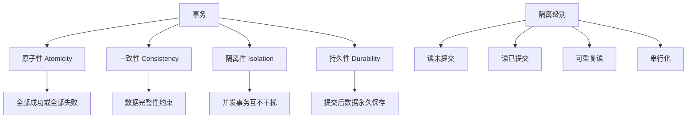

# 事务处理

## 🎯 学习目标
- 掌握数据库事务的基本概念和ACID特性
- 理解事务的隔离级别和并发控制
- 学会使用PDO进行事务管理
- 了解事务的最佳实践和性能优化

## 📚 核心概念

### 事务ACID特性



### 事务隔离级别对比

| 隔离级别 | 脏读 | 不可重复读 | 幻读 | 性能 | 适用场景 |
|----------|------|------------|------|------|----------|
| 读未提交 | 可能 | 可能 | 可能 | 最高 | 对一致性要求极低 |
| 读已提交 | 不可能 | 可能 | 可能 | 高 | 大多数应用 |
| 可重复读 | 不可能 | 不可能 | 可能 | 中 | 需要一致性读取 |
| 串行化 | 不可能 | 不可能 | 不可能 | 最低 | 对一致性要求极高 |

## 🔧 事务处理实现

### 事务管理器
```php
<?php
// 1. 事务管理器类
class TransactionManager {
    private $pdo;
    private $transactions;
    private $savepoints;
    
    public function __construct($pdo) {
        $this->pdo = $pdo;
        $this->transactions = [];
        $this->savepoints = [];
    }
    
    // 开始事务
    public function begin($name = 'default', $isolationLevel = null) {
        if (isset($this->transactions[$name])) {
            throw new Exception("事务 '{$name}' 已经存在");
        }
        
        // 设置隔离级别
        if ($isolationLevel) {
            $this->setIsolationLevel($isolationLevel);
        }
        
        $this->transactions[$name] = [
            'started' => microtime(true),
            'isolation_level' => $isolationLevel,
            'status' => 'active'
        ];
        
        if (!$this->pdo->inTransaction()) {
            $this->pdo->beginTransaction();
        }
        
        return $this;
    }
    
    // 提交事务
    public function commit($name = 'default') {
        if (!isset($this->transactions[$name])) {
            throw new Exception("事务 '{$name}' 不存在");
        }
        
        $transaction = $this->transactions[$name];
        
        if ($transaction['status'] !== 'active') {
            throw new Exception("事务 '{$name}' 状态异常");
        }
        
        try {
            if ($this->isTopLevelTransaction($name)) {
                $this->pdo->commit();
            }
            
            $this->transactions[$name]['status'] = 'committed';
            $this->transactions[$name]['ended'] = microtime(true);
            
            unset($this->transactions[$name]);
            
            return true;
        } catch (PDOException $e) {
            $this->transactions[$name]['status'] = 'failed';
            throw new Exception("事务提交失败: " . $e->getMessage());
        }
    }
    
    // 回滚事务
    public function rollback($name = 'default') {
        if (!isset($this->transactions[$name])) {
            throw new Exception("事务 '{$name}' 不存在");
        }
        
        $transaction = $this->transactions[$name];
        
        try {
            if ($this->isTopLevelTransaction($name)) {
                $this->pdo->rollback();
            }
            
            $this->transactions[$name]['status'] = 'rolled_back';
            $this->transactions[$name]['ended'] = microtime(true);
            
            unset($this->transactions[$name]);
            
            return true;
        } catch (PDOException $e) {
            throw new Exception("事务回滚失败: " . $e->getMessage());
        }
    }
    
    // 执行事务
    public function transaction($callback, $name = 'default', $isolationLevel = null) {
        $this->begin($name, $isolationLevel);
        
        try {
            $result = $callback($this->pdo);
            $this->commit($name);
            return $result;
        } catch (Exception $e) {
            $this->rollback($name);
            throw $e;
        }
    }
    
    // 创建保存点
    public function savepoint($name, $transactionName = 'default') {
        if (!isset($this->transactions[$transactionName])) {
            throw new Exception("事务 '{$transactionName}' 不存在");
        }
        
        $savepointName = "sp_{$transactionName}_{$name}";
        $this->pdo->exec("SAVEPOINT {$savepointName}");
        
        $this->savepoints[$savepointName] = [
            'transaction' => $transactionName,
            'created' => microtime(true)
        ];
        
        return $savepointName;
    }
    
    // 回滚到保存点
    public function rollbackToSavepoint($savepointName) {
        if (!isset($this->savepoints[$savepointName])) {
            throw new Exception("保存点 '{$savepointName}' 不存在");
        }
        
        $this->pdo->exec("ROLLBACK TO SAVEPOINT {$savepointName}");
        
        unset($this->savepoints[$savepointName]);
        
        return true;
    }
    
    // 释放保存点
    public function releaseSavepoint($savepointName) {
        if (!isset($this->savepoints[$savepointName])) {
            throw new Exception("保存点 '{$savepointName}' 不存在");
        }
        
        $this->pdo->exec("RELEASE SAVEPOINT {$savepointName}");
        
        unset($this->savepoints[$savepointName]);
        
        return true;
    }
    
    // 设置隔离级别
    private function setIsolationLevel($level) {
        $levels = [
            'READ UNCOMMITTED' => 'READ UNCOMMITTED',
            'READ COMMITTED' => 'READ COMMITTED',
            'REPEATABLE READ' => 'REPEATABLE READ',
            'SERIALIZABLE' => 'SERIALIZABLE'
        ];
        
        if (!isset($levels[$level])) {
            throw new Exception("无效的隔离级别: {$level}");
        }
        
        $this->pdo->exec("SET TRANSACTION ISOLATION LEVEL {$levels[$level]}");
    }
    
    // 检查是否为顶层事务
    private function isTopLevelTransaction($name) {
        return count($this->transactions) === 1 && isset($this->transactions[$name]);
    }
    
    // 检查是否在事务中
    public function inTransaction($name = null) {
        if ($name) {
            return isset($this->transactions[$name]);
        }
        
        return $this->pdo->inTransaction();
    }
    
    // 获取事务信息
    public function getTransactionInfo($name = 'default') {
        if (!isset($this->transactions[$name])) {
            return null;
        }
        
        $transaction = $this->transactions[$name];
        $transaction['duration'] = microtime(true) - $transaction['started'];
        
        return $transaction;
    }
    
    // 获取所有事务信息
    public function getAllTransactions() {
        $result = [];
        
        foreach ($this->transactions as $name => $transaction) {
            $result[$name] = $this->getTransactionInfo($name);
        }
        
        return $result;
    }
    
    // 获取保存点信息
    public function getSavepoints() {
        return $this->savepoints;
    }
}

// 2. 高级事务处理
class AdvancedTransactionHandler {
    private $transactionManager;
    private $retryConfig;
    
    public function __construct($pdo, $retryConfig = []) {
        $this->transactionManager = new TransactionManager($pdo);
        $this->retryConfig = array_merge([
            'max_retries' => 3,
            'retry_delay' => 100, // 毫秒
            'backoff_multiplier' => 2
        ], $retryConfig);
    }
    
    // 重试事务
    public function retryTransaction($callback, $name = 'default', $isolationLevel = null) {
        $attempts = 0;
        $delay = $this->retryConfig['retry_delay'];
        
        while ($attempts < $this->retryConfig['max_retries']) {
            try {
                return $this->transactionManager->transaction($callback, $name, $isolationLevel);
            } catch (Exception $e) {
                $attempts++;
                
                if ($attempts >= $this->retryConfig['max_retries']) {
                    throw $e;
                }
                
                // 检查是否为可重试的错误
                if (!$this->isRetryableError($e)) {
                    throw $e;
                }
                
                // 等待后重试
                usleep($delay * 1000);
                $delay *= $this->retryConfig['backoff_multiplier'];
            }
        }
    }
    
    // 检查是否为可重试错误
    private function isRetryableError($exception) {
        $retryableErrors = [
            'Deadlock found',
            'Lock wait timeout',
            'Connection lost',
            'Server has gone away'
        ];
        
        $message = $exception->getMessage();
        
        foreach ($retryableErrors as $error) {
            if (strpos($message, $error) !== false) {
                return true;
            }
        }
        
        return false;
    }
    
    // 分布式事务模拟
    public function distributedTransaction($operations) {
        $transactionName = 'distributed_' . uniqid();
        
        return $this->transactionManager->transaction(function($pdo) use ($operations) {
            $results = [];
            $savepoints = [];
            
            try {
                foreach ($operations as $index => $operation) {
                    $savepointName = $this->transactionManager->savepoint("op_{$index}", $transactionName);
                    $savepoints[] = $savepointName;
                    
                    $result = $operation($pdo);
                    $results[] = $result;
                }
                
                return $results;
            } catch (Exception $e) {
                // 回滚所有保存点
                foreach (array_reverse($savepoints) as $savepoint) {
                    $this->transactionManager->rollbackToSavepoint($savepoint);
                }
                
                throw $e;
            }
        }, $transactionName);
    }
    
    // 两阶段提交模拟
    public function twoPhaseCommit($participants) {
        $transactionName = '2pc_' . uniqid();
        
        return $this->transactionManager->transaction(function($pdo) use ($participants) {
            $results = [];
            
            // 阶段1：准备
            foreach ($participants as $participant) {
                $result = $participant['prepare']($pdo);
                $results[] = $result;
            }
            
            // 阶段2：提交
            foreach ($participants as $index => $participant) {
                $participant['commit']($pdo, $results[$index]);
            }
            
            return $results;
        }, $transactionName);
    }
    
    // 乐观锁事务
    public function optimisticLockTransaction($table, $id, $callback, $versionField = 'version') {
        return $this->retryTransaction(function($pdo) use ($table, $id, $callback, $versionField) {
            // 读取当前版本
            $stmt = $pdo->prepare("SELECT {$versionField} FROM {$table} WHERE id = ?");
            $stmt->execute([$id]);
            $currentVersion = $stmt->fetchColumn();
            
            if ($currentVersion === false) {
                throw new Exception("记录不存在");
            }
            
            // 执行业务逻辑
            $result = $callback($pdo, $currentVersion);
            
            // 更新时检查版本
            $stmt = $pdo->prepare("UPDATE {$table} SET {$versionField} = {$versionField} + 1 WHERE id = ? AND {$versionField} = ?");
            $stmt->execute([$id, $currentVersion]);
            
            if ($stmt->rowCount() === 0) {
                throw new Exception("版本冲突，请重试");
            }
            
            return $result;
        });
    }
    
    // 悲观锁事务
    public function pessimisticLockTransaction($table, $id, $callback, $lockType = 'FOR UPDATE') {
        return $this->transactionManager->transaction(function($pdo) use ($table, $id, $callback, $lockType) {
            // 获取行锁
            $stmt = $pdo->prepare("SELECT * FROM {$table} WHERE id = ? {$lockType}");
            $stmt->execute([$id]);
            $record = $stmt->fetch();
            
            if (!$record) {
                throw new Exception("记录不存在");
            }
            
            // 执行业务逻辑
            return $callback($pdo, $record);
        });
    }
}

// 3. 事务监控器
class TransactionMonitor {
    private $transactionManager;
    private $metrics;
    
    public function __construct($transactionManager) {
        $this->transactionManager = $transactionManager;
        $this->metrics = [
            'total_transactions' => 0,
            'committed_transactions' => 0,
            'rolled_back_transactions' => 0,
            'total_duration' => 0,
            'longest_transaction' => 0,
            'deadlocks' => 0,
            'lock_timeouts' => 0
        ];
    }
    
    // 监控事务执行
    public function monitorTransaction($callback, $name = 'default', $isolationLevel = null) {
        $startTime = microtime(true);
        
        try {
            $result = $this->transactionManager->transaction($callback, $name, $isolationLevel);
            
            $duration = microtime(true) - $startTime;
            $this->updateMetrics('success', $duration);
            
            return $result;
        } catch (Exception $e) {
            $duration = microtime(true) - $startTime;
            $this->updateMetrics('failure', $duration, $e);
            
            throw $e;
        }
    }
    
    // 更新指标
    private function updateMetrics($status, $duration, $exception = null) {
        $this->metrics['total_transactions']++;
        $this->metrics['total_duration'] += $duration;
        
        if ($duration > $this->metrics['longest_transaction']) {
            $this->metrics['longest_transaction'] = $duration;
        }
        
        if ($status === 'success') {
            $this->metrics['committed_transactions']++;
        } else {
            $this->metrics['rolled_back_transactions']++;
            
            if ($exception) {
                $message = $exception->getMessage();
                if (strpos($message, 'Deadlock') !== false) {
                    $this->metrics['deadlocks']++;
                } elseif (strpos($message, 'Lock wait timeout') !== false) {
                    $this->metrics['lock_timeouts']++;
                }
            }
        }
    }
    
    // 获取性能报告
    public function getPerformanceReport() {
        $avgDuration = $this->metrics['total_transactions'] > 0 
            ? $this->metrics['total_duration'] / $this->metrics['total_transactions'] 
            : 0;
        
        $successRate = $this->metrics['total_transactions'] > 0
            ? ($this->metrics['committed_transactions'] / $this->metrics['total_transactions']) * 100
            : 0;
        
        return [
            'total_transactions' => $this->metrics['total_transactions'],
            'committed_transactions' => $this->metrics['committed_transactions'],
            'rolled_back_transactions' => $this->metrics['rolled_back_transactions'],
            'success_rate' => $successRate,
            'average_duration' => $avgDuration,
            'longest_transaction' => $this->metrics['longest_transaction'],
            'deadlocks' => $this->metrics['deadlocks'],
            'lock_timeouts' => $this->metrics['lock_timeouts']
        ];
    }
    
    // 重置指标
    public function resetMetrics() {
        $this->metrics = [
            'total_transactions' => 0,
            'committed_transactions' => 0,
            'rolled_back_transactions' => 0,
            'total_duration' => 0,
            'longest_transaction' => 0,
            'deadlocks' => 0,
            'lock_timeouts' => 0
        ];
    }
}

// 使用示例
echo "=== 事务处理示例 ===\n";

try {
    // 创建PDO连接
    $pdo = new PDO('sqlite::memory:');
    $pdo->setAttribute(PDO::ATTR_ERRMODE, PDO::ERRMODE_EXCEPTION);
    
    // 创建测试表
    $pdo->exec("
        CREATE TABLE accounts (
            id INTEGER PRIMARY KEY AUTOINCREMENT,
            name VARCHAR(100) NOT NULL,
            balance DECIMAL(10,2) NOT NULL DEFAULT 0,
            version INTEGER NOT NULL DEFAULT 1
        )
    ");
    
    // 插入测试数据
    $pdo->exec("
        INSERT INTO accounts (name, balance) VALUES 
        ('Alice', 1000.00),
        ('Bob', 500.00)
    ");
    
    // 创建事务管理器
    $transactionManager = new TransactionManager($pdo);
    
    // 简单事务
    $result = $transactionManager->transaction(function($pdo) {
        // 转账操作
        $stmt = $pdo->prepare("UPDATE accounts SET balance = balance - 100 WHERE name = 'Alice'");
        $stmt->execute();
        
        $stmt = $pdo->prepare("UPDATE accounts SET balance = balance + 100 WHERE name = 'Bob'");
        $stmt->execute();
        
        return '转账成功';
    });
    
    echo "简单事务结果: $result\n";
    
    // 保存点事务
    $transactionManager->begin('savepoint_test');
    
    try {
        // 第一个操作
        $stmt = $pdo->prepare("UPDATE accounts SET balance = balance - 50 WHERE name = 'Alice'");
        $stmt->execute();
        
        $transactionManager->savepoint('after_first_operation', 'savepoint_test');
        
        // 第二个操作
        $stmt = $pdo->prepare("UPDATE accounts SET balance = balance + 50 WHERE name = 'Bob'");
        $stmt->execute();
        
        $transactionManager->commit('savepoint_test');
        echo "保存点事务提交成功\n";
        
    } catch (Exception $e) {
        $transactionManager->rollback('savepoint_test');
        echo "保存点事务回滚: " . $e->getMessage() . "\n";
    }
    
    // 高级事务处理
    $advancedHandler = new AdvancedTransactionHandler($pdo);
    
    // 乐观锁事务
    $optimisticResult = $advancedHandler->optimisticLockTransaction('accounts', 1, function($pdo, $version) {
        // 模拟业务逻辑
        usleep(10000); // 10ms
        
        $stmt = $pdo->prepare("UPDATE accounts SET balance = balance + 10 WHERE id = 1");
        $stmt->execute();
        
        return '乐观锁更新成功';
    });
    
    echo "乐观锁事务结果: $optimisticResult\n";
    
    // 悲观锁事务
    $pessimisticResult = $advancedHandler->pessimisticLockTransaction('accounts', 2, function($pdo, $record) {
        // 模拟业务逻辑
        usleep(10000); // 10ms
        
        $stmt = $pdo->prepare("UPDATE accounts SET balance = balance + 20 WHERE id = 2");
        $stmt->execute();
        
        return '悲观锁更新成功';
    });
    
    echo "悲观锁事务结果: $pessimisticResult\n";
    
    // 事务监控
    $monitor = new TransactionMonitor($transactionManager);
    
    // 监控事务执行
    $monitor->monitorTransaction(function($pdo) {
        $stmt = $pdo->prepare("SELECT * FROM accounts");
        $stmt->execute();
        return $stmt->fetchAll();
    });
    
    $report = $monitor->getPerformanceReport();
    echo "事务性能报告:\n";
    echo "  总事务数: {$report['total_transactions']}\n";
    echo "  成功事务数: {$report['committed_transactions']}\n";
    echo "  失败事务数: {$report['rolled_back_transactions']}\n";
    echo "  成功率: " . number_format($report['success_rate'], 2) . "%\n";
    echo "  平均执行时间: " . number_format($report['average_duration'], 4) . " 秒\n";
    echo "  最长事务时间: " . number_format($report['longest_transaction'], 4) . " 秒\n";
    
} catch (Exception $e) {
    echo "错误: " . $e->getMessage() . "\n";
}
?>
```

## 📊 最佳实践

### 事务处理最佳实践
```php
<?php
// 事务处理最佳实践

class TransactionBestPractices {
    // 1. 事务设计原则
    public static function getTransactionDesignPrinciples() {
        return [
            '事务边界' => [
                '最小化事务' => '保持事务尽可能小，减少锁持有时间',
                '业务边界' => '事务边界应该与业务边界一致',
                '避免长事务' => '避免长时间运行的事务',
                '合理嵌套' => '合理使用嵌套事务和保存点'
            ],
            '隔离级别' => [
                '默认级别' => '使用数据库默认的隔离级别',
                '性能考虑' => '根据性能要求选择合适的隔离级别',
                '一致性要求' => '根据一致性要求调整隔离级别',
                '并发控制' => '使用适当的并发控制机制'
            ],
            '错误处理' => [
                '异常捕获' => '捕获和处理事务异常',
                '自动回滚' => '实现自动回滚机制',
                '错误日志' => '记录事务错误日志',
                '重试机制' => '实现适当的重试机制'
            ]
        ];
    }
    
    // 2. 性能优化策略
    public static function getPerformanceOptimizationStrategies() {
        return [
            '锁优化' => [
                '减少锁时间' => '减少锁持有时间',
                '锁顺序' => '保持一致的锁获取顺序',
                '死锁避免' => '避免死锁情况',
                '锁升级' => '避免不必要的锁升级'
            ],
            '并发控制' => [
                '乐观锁' => '使用乐观锁处理并发',
                '悲观锁' => '使用悲观锁保护关键资源',
                '版本控制' => '使用版本号控制并发',
                '时间戳' => '使用时间戳处理并发'
            ],
            '事务优化' => [
                '批量操作' => '使用批量操作减少事务数',
                '异步处理' => '使用异步处理非关键操作',
                '读写分离' => '使用读写分离提高性能',
                '缓存策略' => '使用缓存减少数据库访问'
            ]
        ];
    }
    
    // 3. 安全最佳实践
    public static function getSecurityBestPractices() {
        return [
            '数据完整性' => [
                '约束检查' => '使用数据库约束保证数据完整性',
                '业务规则' => '在事务中检查业务规则',
                '数据验证' => '验证输入数据的有效性',
                '一致性检查' => '实现一致性检查机制'
            ],
            '访问控制' => [
                '权限管理' => '使用最小权限原则',
                '角色分离' => '分离不同角色的权限',
                '审计日志' => '记录事务审计日志',
                '访问监控' => '监控数据库访问'
            ],
            '错误处理' => [
                '敏感信息' => '不暴露敏感的数据库信息',
                '错误分类' => '分类处理不同类型的错误',
                '日志安全' => '保护错误日志的安全',
                '异常处理' => '实现安全的异常处理'
            ]
        ];
    }
    
    // 4. 监控和维护
    public static function getMonitoringAndMaintenanceStrategies() {
        return [
            '性能监控' => [
                '事务监控' => '监控事务执行时间和频率',
                '锁监控' => '监控锁等待和死锁情况',
                '并发监控' => '监控并发访问情况',
                '资源监控' => '监控数据库资源使用'
            ],
            '日志管理' => [
                '事务日志' => '记录事务执行日志',
                '错误日志' => '记录事务错误日志',
                '性能日志' => '记录性能相关日志',
                '审计日志' => '记录审计相关日志'
            ],
            '维护策略' => [
                '定期优化' => '定期优化事务性能',
                '索引维护' => '维护和优化数据库索引',
                '统计更新' => '更新数据库统计信息',
                '备份恢复' => '实现数据备份和恢复'
            ]
        ];
    }
}

// 使用示例
echo "=== 事务处理最佳实践示例 ===\n";

try {
    // 事务设计原则
    $designPrinciples = TransactionBestPractices::getTransactionDesignPrinciples();
    echo "事务设计原则:\n";
    foreach ($designPrinciples as $category => $principles) {
        echo "  $category:\n";
        foreach ($principles as $principle => $description) {
            echo "    - $principle: $description\n";
        }
        echo "\n";
    }
    
    // 性能优化策略
    $performanceStrategies = TransactionBestPractices::getPerformanceOptimizationStrategies();
    echo "性能优化策略:\n";
    foreach ($performanceStrategies as $category => $strategies) {
        echo "  $category:\n";
        foreach ($strategies as $strategy => $description) {
            echo "    - $strategy: $description\n";
        }
        echo "\n";
    }
    
    // 安全最佳实践
    $securityPractices = TransactionBestPractices::getSecurityBestPractices();
    echo "安全最佳实践:\n";
    foreach ($securityPractices as $category => $practices) {
        echo "  $category:\n";
        foreach ($practices as $practice => $description) {
            echo "    - $practice: $description\n";
        }
        echo "\n";
    }
    
    // 监控和维护策略
    $monitoringStrategies = TransactionBestPractices::getMonitoringAndMaintenanceStrategies();
    echo "监控和维护策略:\n";
    foreach ($monitoringStrategies as $category => $strategies) {
        echo "  $category:\n";
        foreach ($strategies as $strategy => $description) {
            echo "    - $strategy: $description\n";
        }
        echo "\n";
    }
    
} catch (Exception $e) {
    echo "错误: " . $e->getMessage() . "\n";
}
?>
```

## 🎓 学习建议

### 费曼学习法应用
1. **选择概念**: 选择事务处理中的核心概念
2. **简化解释**: 用简单语言解释事务处理的重要性
3. **识别盲点**: 发现理解不深入的地方
4. **重新学习**: 针对盲点进行深入学习

### 刻意练习重点
1. **ACID特性**: 掌握事务的ACID特性
2. **隔离级别**: 理解不同隔离级别的特点
3. **并发控制**: 学会处理并发事务
4. **性能优化**: 掌握事务性能优化方法

## 🔗 相关链接
- [[01-MySQL基础|MySQL基础]]
- [[02-PDO数据库抽象层|PDO数据库抽象层]]
- [[03-预处理语句|预处理语句]]
- [[05-ORM框架使用|ORM框架使用]]
- [[06-数据库优化|数据库优化]]
- [[07-数据库设计原则|数据库设计原则]]
