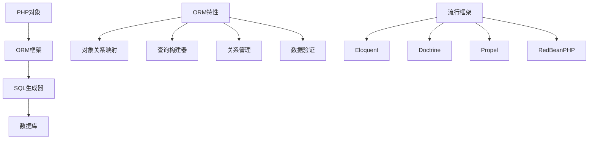

# ORM框架使用

## 🎯 学习目标
- 掌握ORM框架的基本概念和使用方法
- 理解ORM的优势和局限性
- 学会使用流行的PHP ORM框架
- 了解ORM的性能优化和最佳实践

## 📚 核心概念

### ORM架构



### ORM vs 原生SQL对比

| 特性 | ORM | 原生SQL |
|------|-----|---------|
| 开发效率 | 高 | 中 |
| 学习曲线 | 中 | 低 |
| 性能 | 中 | 高 |
| 灵活性 | 中 | 高 |
| 可维护性 | 高 | 中 |
| 数据库无关性 | 高 | 低 |

## 🔧 ORM实现

### 简单ORM框架
```php
<?php
// 1. 基础ORM类
abstract class Model {
    protected $pdo;
    protected $table;
    protected $primaryKey = 'id';
    protected $fillable = [];
    protected $hidden = [];
    protected $attributes = [];
    protected $original = [];
    protected $exists = false;
    
    public function __construct($attributes = []) {
        $this->attributes = $attributes;
        $this->original = $attributes;
        $this->pdo = $this->getConnection();
    }
    
    // 获取数据库连接
    protected function getConnection() {
        return new PDO('sqlite::memory:', null, null, [
            PDO::ATTR_ERRMODE => PDO::ERRMODE_EXCEPTION,
            PDO::ATTR_DEFAULT_FETCH_MODE => PDO::FETCH_ASSOC
        ]);
    }
    
    // 获取表名
    public function getTable() {
        return $this->table ?: strtolower(class_basename($this)) . 's';
    }
    
    // 获取主键
    public function getKeyName() {
        return $this->primaryKey;
    }
    
    // 获取主键值
    public function getKey() {
        return $this->attributes[$this->getKeyName()] ?? null;
    }
    
    // 设置属性
    public function setAttribute($key, $value) {
        $this->attributes[$key] = $value;
    }
    
    // 获取属性
    public function getAttribute($key) {
        return $this->attributes[$key] ?? null;
    }
    
    // 魔术方法
    public function __get($key) {
        return $this->getAttribute($key);
    }
    
    public function __set($key, $value) {
        $this->setAttribute($key, $value);
    }
    
    // 保存模型
    public function save() {
        if ($this->exists) {
            return $this->update();
        } else {
            return $this->insert();
        }
    }
    
    // 插入记录
    protected function insert() {
        $attributes = $this->getFillableAttributes();
        
        $fields = array_keys($attributes);
        $placeholders = ':' . implode(', :', $fields);
        
        $sql = "INSERT INTO `{$this->getTable()}` (`" . implode('`, `', $fields) . "`) VALUES ({$placeholders})";
        
        $stmt = $this->pdo->prepare($sql);
        $stmt->execute($attributes);
        
        $this->attributes[$this->getKeyName()] = $this->pdo->lastInsertId();
        $this->exists = true;
        
        return true;
    }
    
    // 更新记录
    protected function update() {
        $attributes = $this->getFillableAttributes();
        $keyName = $this->getKeyName();
        
        $setClause = [];
        foreach ($attributes as $field => $value) {
            if ($field !== $keyName) {
                $setClause[] = "`{$field}` = :{$field}";
            }
        }
        
        $sql = "UPDATE `{$this->getTable()}` SET " . implode(', ', $setClause) . " WHERE `{$keyName}` = :{$keyName}";
        
        $attributes[$keyName] = $this->getKey();
        
        $stmt = $this->pdo->prepare($sql);
        $stmt->execute($attributes);
        
        return true;
    }
    
    // 删除记录
    public function delete() {
        if (!$this->exists) {
            return false;
        }
        
        $keyName = $this->getKeyName();
        $sql = "DELETE FROM `{$this->getTable()}` WHERE `{$keyName}` = :{$keyName}";
        
        $stmt = $this->pdo->prepare($sql);
        $stmt->execute([$keyName => $this->getKey()]);
        
        $this->exists = false;
        
        return true;
    }
    
    // 获取可填充属性
    protected function getFillableAttributes() {
        $attributes = [];
        
        foreach ($this->attributes as $key => $value) {
            if (in_array($key, $this->fillable) || empty($this->fillable)) {
                $attributes[$key] = $value;
            }
        }
        
        return $attributes;
    }
    
    // 静态方法：查找
    public static function find($id) {
        $model = new static();
        $keyName = $model->getKeyName();
        
        $sql = "SELECT * FROM `{$model->getTable()}` WHERE `{$keyName}` = :{$keyName}";
        $stmt = $model->pdo->prepare($sql);
        $stmt->execute([$keyName => $id]);
        
        $attributes = $stmt->fetch();
        
        if ($attributes) {
            $model->attributes = $attributes;
            $model->original = $attributes;
            $model->exists = true;
            return $model;
        }
        
        return null;
    }
    
    // 静态方法：查找所有
    public static function all() {
        $model = new static();
        
        $sql = "SELECT * FROM `{$model->getTable()}`";
        $stmt = $model->pdo->query($sql);
        
        $results = [];
        while ($attributes = $stmt->fetch()) {
            $instance = new static($attributes);
            $instance->exists = true;
            $results[] = $instance;
        }
        
        return $results;
    }
    
    // 静态方法：创建
    public static function create($attributes) {
        $model = new static($attributes);
        $model->save();
        return $model;
    }
    
    // 静态方法：查询构建器
    public static function query() {
        return new QueryBuilder(new static());
    }
}

// 2. 查询构建器
class QueryBuilder {
    private $model;
    private $wheres = [];
    private $orders = [];
    private $limit = null;
    private $offset = null;
    
    public function __construct($model) {
        $this->model = $model;
    }
    
    // WHERE条件
    public function where($column, $operator = null, $value = null) {
        if (func_num_args() === 2) {
            $value = $operator;
            $operator = '=';
        }
        
        $this->wheres[] = [
            'column' => $column,
            'operator' => $operator,
            'value' => $value,
            'logic' => 'AND'
        ];
        
        return $this;
    }
    
    // OR WHERE条件
    public function orWhere($column, $operator = null, $value = null) {
        if (func_num_args() === 2) {
            $value = $operator;
            $operator = '=';
        }
        
        $this->wheres[] = [
            'column' => $column,
            'operator' => $operator,
            'value' => $value,
            'logic' => 'OR'
        ];
        
        return $this;
    }
    
    // ORDER BY
    public function orderBy($column, $direction = 'ASC') {
        $this->orders[] = "`{$column}` {$direction}";
        return $this;
    }
    
    // LIMIT
    public function limit($limit) {
        $this->limit = $limit;
        return $this;
    }
    
    // OFFSET
    public function offset($offset) {
        $this->offset = $offset;
        return $this;
    }
    
    // 获取结果
    public function get() {
        $sql = "SELECT * FROM `{$this->model->getTable()}`";
        $params = [];
        
        // 添加WHERE条件
        if (!empty($this->wheres)) {
            $whereClause = $this->buildWhereClause($params);
            $sql .= " WHERE {$whereClause}";
        }
        
        // 添加ORDER BY
        if (!empty($this->orders)) {
            $sql .= " ORDER BY " . implode(', ', $this->orders);
        }
        
        // 添加LIMIT
        if ($this->limit !== null) {
            $sql .= " LIMIT {$this->limit}";
        }
        
        // 添加OFFSET
        if ($this->offset !== null) {
            $sql .= " OFFSET {$this->offset}";
        }
        
        $stmt = $this->model->pdo->prepare($sql);
        $stmt->execute($params);
        
        $results = [];
        while ($attributes = $stmt->fetch()) {
            $instance = new $this->model($attributes);
            $instance->exists = true;
            $results[] = $instance;
        }
        
        return $results;
    }
    
    // 获取第一条记录
    public function first() {
        $this->limit(1);
        $results = $this->get();
        return $results[0] ?? null;
    }
    
    // 获取数量
    public function count() {
        $sql = "SELECT COUNT(*) FROM `{$this->model->getTable()}`";
        $params = [];
        
        if (!empty($this->wheres)) {
            $whereClause = $this->buildWhereClause($params);
            $sql .= " WHERE {$whereClause}";
        }
        
        $stmt = $this->model->pdo->prepare($sql);
        $stmt->execute($params);
        
        return $stmt->fetchColumn();
    }
    
    // 构建WHERE子句
    private function buildWhereClause(&$params) {
        $conditions = [];
        
        foreach ($this->wheres as $index => $where) {
            $logic = $index > 0 ? " {$where['logic']} " : '';
            $paramName = "param_{$index}";
            
            $conditions[] = $logic . "`{$where['column']}` {$where['operator']} :{$paramName}";
            $params[$paramName] = $where['value'];
        }
        
        return implode('', $conditions);
    }
}

// 3. 关系管理器
class RelationshipManager {
    private $model;
    
    public function __construct($model) {
        $this->model = $model;
    }
    
    // 一对一关系
    public function hasOne($related, $foreignKey = null, $localKey = null) {
        $relatedModel = new $related();
        $foreignKey = $foreignKey ?: $this->model->getTable() . '_id';
        $localKey = $localKey ?: $this->model->getKeyName();
        
        $sql = "SELECT * FROM `{$relatedModel->getTable()}` WHERE `{$foreignKey}` = :{$foreignKey}";
        $stmt = $this->model->pdo->prepare($sql);
        $stmt->execute([$foreignKey => $this->model->getKey()]);
        
        $attributes = $stmt->fetch();
        
        if ($attributes) {
            $instance = new $related($attributes);
            $instance->exists = true;
            return $instance;
        }
        
        return null;
    }
    
    // 一对多关系
    public function hasMany($related, $foreignKey = null, $localKey = null) {
        $relatedModel = new $related();
        $foreignKey = $foreignKey ?: $this->model->getTable() . '_id';
        $localKey = $localKey ?: $this->model->getKeyName();
        
        $sql = "SELECT * FROM `{$relatedModel->getTable()}` WHERE `{$foreignKey}` = :{$foreignKey}";
        $stmt = $this->model->pdo->prepare($sql);
        $stmt->execute([$foreignKey => $this->model->getKey()]);
        
        $results = [];
        while ($attributes = $stmt->fetch()) {
            $instance = new $related($attributes);
            $instance->exists = true;
            $results[] = $instance;
        }
        
        return $results;
    }
    
    // 多对多关系
    public function belongsToMany($related, $pivotTable, $foreignKey = null, $relatedKey = null) {
        $relatedModel = new $related();
        $foreignKey = $foreignKey ?: $this->model->getTable() . '_id';
        $relatedKey = $relatedKey ?: $relatedModel->getTable() . '_id';
        
        $sql = "
            SELECT r.* FROM `{$relatedModel->getTable()}` r
            INNER JOIN `{$pivotTable}` p ON r.{$relatedModel->getKeyName()} = p.{$relatedKey}
            WHERE p.{$foreignKey} = :{$foreignKey}
        ";
        
        $stmt = $this->model->pdo->prepare($sql);
        $stmt->execute([$foreignKey => $this->model->getKey()]);
        
        $results = [];
        while ($attributes = $stmt->fetch()) {
            $instance = new $related($attributes);
            $instance->exists = true;
            $results[] = $instance;
        }
        
        return $results;
    }
}

// 4. 用户模型示例
class User extends Model {
    protected $table = 'users';
    protected $fillable = ['name', 'email', 'password'];
    
    // 关系方法
    public function posts() {
        return (new RelationshipManager($this))->hasMany(Post::class);
    }
    
    public function profile() {
        return (new RelationshipManager($this))->hasOne(Profile::class);
    }
}

// 5. 文章模型示例
class Post extends Model {
    protected $table = 'posts';
    protected $fillable = ['title', 'content', 'user_id'];
    
    // 关系方法
    public function user() {
        return (new RelationshipManager($this))->hasOne(User::class, 'id', 'user_id');
    }
    
    public function tags() {
        return (new RelationshipManager($this))->belongsToMany(Tag::class, 'post_tags', 'post_id', 'tag_id');
    }
}

// 6. 标签模型示例
class Tag extends Model {
    protected $table = 'tags';
    protected $fillable = ['name'];
}

// 7. 个人资料模型示例
class Profile extends Model {
    protected $table = 'profiles';
    protected $fillable = ['bio', 'avatar', 'user_id'];
}

// 使用示例
echo "=== ORM框架使用示例 ===\n";

try {
    // 创建测试表
    $pdo = new PDO('sqlite::memory:');
    $pdo->setAttribute(PDO::ATTR_ERRMODE, PDO::ERRMODE_EXCEPTION);
    
    $pdo->exec("
        CREATE TABLE users (
            id INTEGER PRIMARY KEY AUTOINCREMENT,
            name VARCHAR(100) NOT NULL,
            email VARCHAR(100) UNIQUE NOT NULL,
            password VARCHAR(255) NOT NULL,
            created_at DATETIME DEFAULT CURRENT_TIMESTAMP
        )
    ");
    
    $pdo->exec("
        CREATE TABLE posts (
            id INTEGER PRIMARY KEY AUTOINCREMENT,
            title VARCHAR(200) NOT NULL,
            content TEXT,
            user_id INTEGER NOT NULL,
            created_at DATETIME DEFAULT CURRENT_TIMESTAMP,
            FOREIGN KEY (user_id) REFERENCES users(id)
        )
    ");
    
    $pdo->exec("
        CREATE TABLE profiles (
            id INTEGER PRIMARY KEY AUTOINCREMENT,
            bio TEXT,
            avatar VARCHAR(255),
            user_id INTEGER NOT NULL,
            FOREIGN KEY (user_id) REFERENCES users(id)
        )
    ");
    
    $pdo->exec("
        CREATE TABLE tags (
            id INTEGER PRIMARY KEY AUTOINCREMENT,
            name VARCHAR(50) NOT NULL
        )
    ");
    
    $pdo->exec("
        CREATE TABLE post_tags (
            post_id INTEGER NOT NULL,
            tag_id INTEGER NOT NULL,
            PRIMARY KEY (post_id, tag_id),
            FOREIGN KEY (post_id) REFERENCES posts(id),
            FOREIGN KEY (tag_id) REFERENCES tags(id)
        )
    ");
    
    // 创建用户
    $user = User::create([
        'name' => 'John Doe',
        'email' => 'john@example.com',
        'password' => password_hash('password123', PASSWORD_DEFAULT)
    ]);
    
    echo "创建用户: {$user->name} (ID: {$user->id})\n";
    
    // 创建文章
    $post = Post::create([
        'title' => 'My First Post',
        'content' => 'This is the content of my first post.',
        'user_id' => $user->id
    ]);
    
    echo "创建文章: {$post->title} (ID: {$post->id})\n";
    
    // 查询用户
    $foundUser = User::find($user->id);
    echo "查询用户: {$foundUser->name}\n";
    
    // 查询构建器
    $users = User::query()
        ->where('name', 'LIKE', '%John%')
        ->orderBy('created_at', 'DESC')
        ->get();
    
    echo "查询结果: " . count($users) . " 个用户\n";
    
    // 更新用户
    $user->name = 'John Smith';
    $user->save();
    
    echo "更新用户: {$user->name}\n";
    
    // 关系查询
    $userPosts = $user->posts();
    echo "用户文章数量: " . count($userPosts) . "\n";
    
    // 创建个人资料
    $profile = Profile::create([
        'bio' => 'Software developer',
        'avatar' => 'avatar.jpg',
        'user_id' => $user->id
    ]);
    
    $userProfile = $user->profile();
    echo "用户个人资料: {$userProfile->bio}\n";
    
    // 创建标签
    $tag1 = Tag::create(['name' => 'PHP']);
    $tag2 = Tag::create(['name' => 'ORM']);
    
    // 关联标签到文章
    $pdo->exec("INSERT INTO post_tags (post_id, tag_id) VALUES ({$post->id}, {$tag1->id})");
    $pdo->exec("INSERT INTO post_tags (post_id, tag_id) VALUES ({$post->id}, {$tag2->id})");
    
    $postTags = $post->tags();
    echo "文章标签: " . implode(', ', array_map(function($tag) { return $tag->name; }, $postTags)) . "\n";
    
    // 删除用户
    $user->delete();
    echo "删除用户成功\n";
    
} catch (Exception $e) {
    echo "错误: " . $e->getMessage() . "\n";
}
?>
```

## 📊 最佳实践

### ORM最佳实践
```php
<?php
// ORM最佳实践

class ORMBestPractices {
    // 1. 模型设计
    public static function getModelDesignPrinciples() {
        return [
            '模型结构' => [
                '单一职责' => '每个模型只负责一个实体',
                '命名规范' => '使用清晰的命名规范',
                '属性定义' => '明确定义模型属性',
                '关系定义' => '正确定义模型关系'
            ],
            '数据验证' => [
                '输入验证' => '验证输入数据的有效性',
                '业务规则' => '实现业务规则验证',
                '数据类型' => '确保数据类型正确',
                '约束检查' => '检查数据约束'
            ],
            '性能考虑' => [
                '延迟加载' => '使用延迟加载优化性能',
                '预加载' => '使用预加载减少查询次数',
                '缓存策略' => '实现适当的缓存策略',
                '查询优化' => '优化ORM查询'
            ]
        ];
    }
    
    // 2. 查询优化
    public static function getQueryOptimizationStrategies() {
        return [
            'N+1问题解决' => [
                '预加载' => '使用预加载解决N+1问题',
                '批量查询' => '使用批量查询减少数据库访问',
                '查询缓存' => '缓存查询结果',
                '延迟加载' => '使用延迟加载按需获取数据'
            ],
            '查询构建' => [
                '索引使用' => '确保查询使用适当的索引',
                '条件优化' => '优化WHERE条件',
                '分页查询' => '实现高效的分页查询',
                '聚合查询' => '使用聚合函数优化查询'
            ],
            '性能监控' => [
                '查询日志' => '记录ORM查询日志',
                '性能分析' => '分析ORM性能瓶颈',
                '慢查询监控' => '监控慢查询',
                '内存使用' => '监控内存使用情况'
            ]
        ];
    }
    
    // 3. 关系管理
    public static function getRelationshipManagementStrategies() {
        return [
            '关系设计' => [
                '关系类型' => '正确选择关系类型',
                '外键设计' => '合理设计外键约束',
                '级联操作' => '设置适当的级联操作',
                '关系命名' => '使用清晰的关系命名'
            ],
            '关系查询' => [
                '预加载关系' => '预加载相关数据',
                '条件查询' => '在关系上添加查询条件',
                '关系过滤' => '过滤关系数据',
                '关系排序' => '对关系数据进行排序'
            ],
            '关系维护' => [
                '数据一致性' => '维护关系数据一致性',
                '关系更新' => '正确更新关系数据',
                '关系删除' => '处理关系删除操作',
                '关系验证' => '验证关系数据有效性'
            ]
        ];
    }
    
    // 4. 安全最佳实践
    public static function getSecurityBestPractices() {
        return [
            '数据保护' => [
                '输入过滤' => '过滤和验证输入数据',
                'SQL注入防护' => '使用参数化查询',
                'XSS防护' => '防止跨站脚本攻击',
                'CSRF防护' => '防止跨站请求伪造'
            ],
            '访问控制' => [
                '权限管理' => '实现细粒度权限控制',
                '角色分离' => '分离不同角色的权限',
                '数据隔离' => '实现数据隔离机制',
                '审计日志' => '记录访问审计日志'
            ],
            '数据安全' => [
                '数据加密' => '加密敏感数据',
                '传输安全' => '使用安全传输协议',
                '存储安全' => '保护数据存储安全',
                '备份安全' => '保护备份数据安全'
            ]
        ];
    }
}

// 使用示例
echo "=== ORM最佳实践示例 ===\n";

try {
    // 模型设计原则
    $modelDesign = ORMBestPractices::getModelDesignPrinciples();
    echo "模型设计原则:\n";
    foreach ($modelDesign as $category => $principles) {
        echo "  $category:\n";
        foreach ($principles as $principle => $description) {
            echo "    - $principle: $description\n";
        }
        echo "\n";
    }
    
    // 查询优化策略
    $queryOptimization = ORMBestPractices::getQueryOptimizationStrategies();
    echo "查询优化策略:\n";
    foreach ($queryOptimization as $category => $strategies) {
        echo "  $category:\n";
        foreach ($strategies as $strategy => $description) {
            echo "    - $strategy: $description\n";
        }
        echo "\n";
    }
    
    // 关系管理策略
    $relationshipManagement = ORMBestPractices::getRelationshipManagementStrategies();
    echo "关系管理策略:\n";
    foreach ($relationshipManagement as $category => $strategies) {
        echo "  $category:\n";
        foreach ($strategies as $strategy => $description) {
            echo "    - $strategy: $description\n";
        }
        echo "\n";
    }
    
    // 安全最佳实践
    $securityPractices = ORMBestPractices::getSecurityBestPractices();
    echo "安全最佳实践:\n";
    foreach ($securityPractices as $category => $practices) {
        echo "  $category:\n";
        foreach ($practices as $practice => $description) {
            echo "    - $practice: $description\n";
        }
        echo "\n";
    }
    
} catch (Exception $e) {
    echo "错误: " . $e->getMessage() . "\n";
}
?>
```

## 🎓 学习建议

### 费曼学习法应用
1. **选择概念**: 选择ORM中的核心概念
2. **简化解释**: 用简单语言解释ORM的重要性
3. **识别盲点**: 发现理解不深入的地方
4. **重新学习**: 针对盲点进行深入学习

### 刻意练习重点
1. **模型设计**: 掌握ORM模型的设计方法
2. **查询优化**: 学会优化ORM查询性能
3. **关系管理**: 理解ORM关系管理机制
4. **安全实践**: 掌握ORM安全最佳实践

## 🔗 相关链接
- [[01-MySQL基础|MySQL基础]]
- [[02-PDO数据库抽象层|PDO数据库抽象层]]
- [[03-预处理语句|预处理语句]]
- [[04-事务处理|事务处理]]
- [[06-数据库优化|数据库优化]]
- [[07-数据库设计原则|数据库设计原则]]
