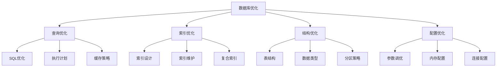

# 数据库优化

## 🎯 学习目标
- 掌握数据库优化的基本原则和方法
- 理解索引设计和查询优化
- 学会数据库性能分析和调优
- 了解数据库优化的最佳实践

## 📚 核心概念

### 数据库优化架构



### 优化策略对比

| 优化策略 | 描述 | 性能提升 | 实施难度 | 风险 |
|----------|------|----------|----------|------|
| 索引优化 | 添加和优化索引 | 高 | 中 | 低 |
| 查询优化 | 优化SQL查询 | 中 | 高 | 中 |
| 结构优化 | 优化表结构 | 中 | 中 | 中 |
| 配置优化 | 调整数据库配置 | 高 | 低 | 低 |
| 缓存优化 | 实现查询缓存 | 高 | 中 | 低 |
| 分区优化 | 表分区策略 | 高 | 高 | 中 |

## 🔧 数据库优化实现

### 数据库优化器
```php
<?php
// 1. 数据库优化器类
class DatabaseOptimizer {
    private $pdo;
    private $config;
    private $metrics;
    
    public function __construct($pdo, $config = []) {
        $this->pdo = $pdo;
        $this->config = array_merge([
            'slow_query_threshold' => 1.0,
            'enable_query_cache' => true,
            'cache_ttl' => 3600,
            'max_connections' => 100
        ], $config);
        $this->metrics = [];
    }
    
    // 分析查询性能
    public function analyzeQuery($sql, $params = []) {
        $startTime = microtime(true);
        
        try {
            $stmt = $this->pdo->prepare($sql);
            $stmt->execute($params);
            $result = $stmt->fetchAll();
            
            $executionTime = microtime(true) - $startTime;
            
            $analysis = [
                'sql' => $sql,
                'execution_time' => $executionTime,
                'row_count' => count($result),
                'is_slow' => $executionTime > $this->config['slow_query_threshold'],
                'suggestions' => $this->generateSuggestions($sql, $executionTime)
            ];
            
            $this->recordMetrics($analysis);
            
            return $analysis;
        } catch (PDOException $e) {
            throw new Exception("查询分析失败: " . $e->getMessage());
        }
    }
    
    // 生成优化建议
    private function generateSuggestions($sql, $executionTime) {
        $suggestions = [];
        
        // 检查SELECT *
        if (preg_match('/SELECT\s+\*/i', $sql)) {
            $suggestions[] = '避免使用SELECT *，指定具体字段';
        }
        
        // 检查缺少WHERE条件
        if (preg_match('/^(UPDATE|DELETE)/i', $sql) && !preg_match('/WHERE/i', $sql)) {
            $suggestions[] = 'UPDATE/DELETE语句缺少WHERE条件';
        }
        
        // 检查子查询
        if (preg_match('/\(SELECT/i', $sql)) {
            $suggestions[] = '考虑使用JOIN替代子查询';
        }
        
        // 检查LIKE查询
        if (preg_match('/LIKE\s+[\'"]%/', $sql)) {
            $suggestions[] = '避免使用前导通配符%';
        }
        
        // 检查ORDER BY
        if (preg_match('/ORDER BY\s+(\w+)/i', $sql, $matches)) {
            $suggestions[] = "为ORDER BY字段 {$matches[1]} 添加索引";
        }
        
        // 检查GROUP BY
        if (preg_match('/GROUP BY\s+(\w+)/i', $sql, $matches)) {
            $suggestions[] = "为GROUP BY字段 {$matches[1]} 添加索引";
        }
        
        return $suggestions;
    }
    
    // 记录性能指标
    private function recordMetrics($analysis) {
        $this->metrics[] = [
            'timestamp' => time(),
            'execution_time' => $analysis['execution_time'],
            'is_slow' => $analysis['is_slow'],
            'row_count' => $analysis['row_count']
        ];
        
        // 保持最近1000条记录
        if (count($this->metrics) > 1000) {
            array_shift($this->metrics);
        }
    }
    
    // 获取性能报告
    public function getPerformanceReport() {
        if (empty($this->metrics)) {
            return null;
        }
        
        $totalQueries = count($this->metrics);
        $slowQueries = array_filter($this->metrics, function($metric) {
            return $metric['is_slow'];
        });
        
        $totalTime = array_sum(array_column($this->metrics, 'execution_time'));
        $avgTime = $totalTime / $totalQueries;
        
        return [
            'total_queries' => $totalQueries,
            'slow_queries' => count($slowQueries),
            'slow_query_rate' => (count($slowQueries) / $totalQueries) * 100,
            'average_execution_time' => $avgTime,
            'total_execution_time' => $totalTime,
            'slowest_query' => max(array_column($this->metrics, 'execution_time'))
        ];
    }
    
    // 优化索引
    public function optimizeIndexes($table) {
        $indexes = $this->getTableIndexes($table);
        $suggestions = [];
        
        // 检查主键
        $hasPrimaryKey = false;
        foreach ($indexes as $index) {
            if ($index['Key_name'] === 'PRIMARY') {
                $hasPrimaryKey = true;
                break;
            }
        }
        
        if (!$hasPrimaryKey) {
            $suggestions[] = [
                'type' => 'PRIMARY KEY',
                'table' => $table,
                'suggestion' => '添加主键索引'
            ];
        }
        
        // 检查外键索引
        $foreignKeys = $this->getForeignKeys($table);
        foreach ($foreignKeys as $fk) {
            $hasIndex = false;
            foreach ($indexes as $index) {
                if (in_array($fk['COLUMN_NAME'], $index['Column_name'])) {
                    $hasIndex = true;
                    break;
                }
            }
            
            if (!$hasIndex) {
                $suggestions[] = [
                    'type' => 'INDEX',
                    'table' => $table,
                    'column' => $fk['COLUMN_NAME'],
                    'suggestion' => "为外键 {$fk['COLUMN_NAME']} 添加索引"
                ];
            }
        }
        
        return $suggestions;
    }
    
    // 获取表索引
    private function getTableIndexes($table) {
        $sql = "SHOW INDEX FROM `{$table}`";
        $stmt = $this->pdo->query($sql);
        return $stmt->fetchAll();
    }
    
    // 获取外键
    private function getForeignKeys($table) {
        $sql = "
            SELECT COLUMN_NAME, REFERENCED_TABLE_NAME, REFERENCED_COLUMN_NAME
            FROM INFORMATION_SCHEMA.KEY_COLUMN_USAGE
            WHERE TABLE_SCHEMA = DATABASE()
            AND TABLE_NAME = '{$table}'
            AND REFERENCED_TABLE_NAME IS NOT NULL
        ";
        
        $stmt = $this->pdo->query($sql);
        return $stmt->fetchAll();
    }
    
    // 分析表结构
    public function analyzeTableStructure($table) {
        $columns = $this->getTableColumns($table);
        $suggestions = [];
        
        foreach ($columns as $column) {
            // 检查数据类型
            if (preg_match('/VARCHAR\((\d+)\)/', $column['Type'], $matches)) {
                $length = $matches[1];
                if ($length > 255) {
                    $suggestions[] = [
                        'type' => 'DATA_TYPE',
                        'column' => $column['Field'],
                        'suggestion' => "考虑使用TEXT类型替代VARCHAR({$length})"
                    ];
                }
            }
            
            // 检查NULL值
            if ($column['Null'] === 'YES' && $column['Default'] === null) {
                $suggestions[] = [
                    'type' => 'NULL_HANDLING',
                    'column' => $column['Field'],
                    'suggestion' => "为字段 {$column['Field']} 设置默认值或NOT NULL约束"
                ];
            }
            
            // 检查索引
            if ($column['Key'] === '') {
                $suggestions[] = [
                    'type' => 'INDEX',
                    'column' => $column['Field'],
                    'suggestion' => "考虑为字段 {$column['Field']} 添加索引"
                ];
            }
        }
        
        return $suggestions;
    }
    
    // 获取表列信息
    private function getTableColumns($table) {
        $sql = "DESCRIBE `{$table}`";
        $stmt = $this->pdo->query($sql);
        return $stmt->fetchAll();
    }
    
    // 优化数据库配置
    public function optimizeConfiguration() {
        $currentConfig = $this->getCurrentConfiguration();
        $suggestions = [];
        
        // 检查内存配置
        if ($currentConfig['innodb_buffer_pool_size'] < 1024 * 1024 * 1024) {
            $suggestions[] = [
                'parameter' => 'innodb_buffer_pool_size',
                'current_value' => $currentConfig['innodb_buffer_pool_size'],
                'suggestion' => '增加InnoDB缓冲池大小到至少1GB'
            ];
        }
        
        // 检查连接数
        if ($currentConfig['max_connections'] < 100) {
            $suggestions[] = [
                'parameter' => 'max_connections',
                'current_value' => $currentConfig['max_connections'],
                'suggestion' => '增加最大连接数到至少100'
            ];
        }
        
        // 检查查询缓存
        if ($currentConfig['query_cache_size'] == 0) {
            $suggestions[] = [
                'parameter' => 'query_cache_size',
                'current_value' => $currentConfig['query_cache_size'],
                'suggestion' => '启用查询缓存'
            ];
        }
        
        return $suggestions;
    }
    
    // 获取当前配置
    private function getCurrentConfiguration() {
        $config = [];
        
        $parameters = [
            'innodb_buffer_pool_size',
            'max_connections',
            'query_cache_size',
            'tmp_table_size',
            'max_heap_table_size'
        ];
        
        foreach ($parameters as $param) {
            $stmt = $this->pdo->query("SHOW VARIABLES LIKE '{$param}'");
            $result = $stmt->fetch();
            $config[$param] = $result['Value'] ?? 0;
        }
        
        return $config;
    }
    
    // 生成优化报告
    public function generateOptimizationReport($tables = []) {
        $report = [
            'performance' => $this->getPerformanceReport(),
            'index_optimization' => [],
            'structure_optimization' => [],
            'configuration_optimization' => $this->optimizeConfiguration(),
            'recommendations' => []
        ];
        
        foreach ($tables as $table) {
            $report['index_optimization'][$table] = $this->optimizeIndexes($table);
            $report['structure_optimization'][$table] = $this->analyzeTableStructure($table);
        }
        
        // 生成总体建议
        $report['recommendations'] = $this->generateOverallRecommendations($report);
        
        return $report;
    }
    
    // 生成总体建议
    private function generateOverallRecommendations($report) {
        $recommendations = [];
        
        if ($report['performance']) {
            $performance = $report['performance'];
            
            if ($performance['slow_query_rate'] > 10) {
                $recommendations[] = '慢查询率过高，需要优化查询和索引';
            }
            
            if ($performance['average_execution_time'] > 0.5) {
                $recommendations[] = '平均执行时间过长，需要优化数据库配置';
            }
        }
        
        $totalIndexSuggestions = 0;
        foreach ($report['index_optimization'] as $table => $suggestions) {
            $totalIndexSuggestions += count($suggestions);
        }
        
        if ($totalIndexSuggestions > 0) {
            $recommendations[] = "发现 {$totalIndexSuggestions} 个索引优化建议";
        }
        
        if (!empty($report['configuration_optimization'])) {
            $recommendations[] = '建议优化数据库配置参数';
        }
        
        return $recommendations;
    }
}

// 2. 查询缓存管理器
class QueryCacheManager {
    private $cache;
    private $config;
    private $stats;
    
    public function __construct($config = []) {
        $this->config = array_merge([
            'ttl' => 3600,
            'max_size' => 1000,
            'enabled' => true
        ], $config);
        
        $this->cache = [];
        $this->stats = [
            'hits' => 0,
            'misses' => 0,
            'sets' => 0,
            'evictions' => 0
        ];
    }
    
    // 获取缓存
    public function get($key) {
        if (!$this->config['enabled']) {
            $this->stats['misses']++;
            return null;
        }
        
        if (isset($this->cache[$key])) {
            $item = $this->cache[$key];
            
            if ($item['expires'] > time()) {
                $this->stats['hits']++;
                return $item['data'];
            } else {
                unset($this->cache[$key]);
            }
        }
        
        $this->stats['misses']++;
        return null;
    }
    
    // 设置缓存
    public function set($key, $data, $ttl = null) {
        if (!$this->config['enabled']) {
            return false;
        }
        
        $ttl = $ttl ?: $this->config['ttl'];
        
        // 检查缓存大小
        if (count($this->cache) >= $this->config['max_size']) {
            $this->evictOldest();
        }
        
        $this->cache[$key] = [
            'data' => $data,
            'expires' => time() + $ttl,
            'created' => time()
        ];
        
        $this->stats['sets']++;
        return true;
    }
    
    // 删除缓存
    public function delete($key) {
        if (isset($this->cache[$key])) {
            unset($this->cache[$key]);
            return true;
        }
        
        return false;
    }
    
    // 清空缓存
    public function clear() {
        $this->cache = [];
        return true;
    }
    
    // 淘汰最旧的缓存项
    private function evictOldest() {
        $oldestKey = null;
        $oldestTime = time();
        
        foreach ($this->cache as $key => $item) {
            if ($item['created'] < $oldestTime) {
                $oldestTime = $item['created'];
                $oldestKey = $key;
            }
        }
        
        if ($oldestKey) {
            unset($this->cache[$oldestKey]);
            $this->stats['evictions']++;
        }
    }
    
    // 获取缓存统计
    public function getStats() {
        $totalRequests = $this->stats['hits'] + $this->stats['misses'];
        $hitRate = $totalRequests > 0 ? ($this->stats['hits'] / $totalRequests) * 100 : 0;
        
        return array_merge($this->stats, [
            'hit_rate' => $hitRate,
            'cache_size' => count($this->cache),
            'max_size' => $this->config['max_size']
        ]);
    }
    
    // 生成缓存键
    public function generateKey($sql, $params = []) {
        return 'query:' . md5($sql . serialize($params));
    }
}

// 3. 数据库性能监控器
class DatabasePerformanceMonitor {
    private $pdo;
    private $metrics;
    private $alerts;
    
    public function __construct($pdo) {
        $this->pdo = $pdo;
        $this->metrics = [];
        $this->alerts = [];
    }
    
    // 监控数据库性能
    public function monitorPerformance() {
        $metrics = [
            'connections' => $this->getConnectionMetrics(),
            'queries' => $this->getQueryMetrics(),
            'locks' => $this->getLockMetrics(),
            'cache' => $this->getCacheMetrics()
        ];
        
        $this->metrics[] = [
            'timestamp' => time(),
            'metrics' => $metrics
        ];
        
        // 保持最近100条记录
        if (count($this->metrics) > 100) {
            array_shift($this->metrics);
        }
        
        // 检查告警
        $this->checkAlerts($metrics);
        
        return $metrics;
    }
    
    // 获取连接指标
    private function getConnectionMetrics() {
        $stmt = $this->pdo->query("SHOW STATUS LIKE 'Threads_connected'");
        $connected = $stmt->fetch()['Value'];
        
        $stmt = $this->pdo->query("SHOW STATUS LIKE 'Max_used_connections'");
        $maxUsed = $stmt->fetch()['Value'];
        
        $stmt = $this->pdo->query("SHOW VARIABLES LIKE 'max_connections'");
        $maxConnections = $stmt->fetch()['Value'];
        
        return [
            'current_connections' => $connected,
            'max_used_connections' => $maxUsed,
            'max_connections' => $maxConnections,
            'connection_usage' => ($connected / $maxConnections) * 100
        ];
    }
    
    // 获取查询指标
    private function getQueryMetrics() {
        $stmt = $this->pdo->query("SHOW STATUS LIKE 'Questions'");
        $questions = $stmt->fetch()['Value'];
        
        $stmt = $this->pdo->query("SHOW STATUS LIKE 'Slow_queries'");
        $slowQueries = $stmt->fetch()['Value'];
        
        return [
            'total_queries' => $questions,
            'slow_queries' => $slowQueries,
            'slow_query_rate' => $questions > 0 ? ($slowQueries / $questions) * 100 : 0
        ];
    }
    
    // 获取锁指标
    private function getLockMetrics() {
        $stmt = $this->pdo->query("SHOW STATUS LIKE 'Table_locks_waited'");
        $tableLocksWaited = $stmt->fetch()['Value'];
        
        $stmt = $this->pdo->query("SHOW STATUS LIKE 'Innodb_deadlocks'");
        $deadlocks = $stmt->fetch()['Value'];
        
        return [
            'table_locks_waited' => $tableLocksWaited,
            'deadlocks' => $deadlocks
        ];
    }
    
    // 获取缓存指标
    private function getCacheMetrics() {
        $stmt = $this->pdo->query("SHOW STATUS LIKE 'Qcache_hits'");
        $cacheHits = $stmt->fetch()['Value'];
        
        $stmt = $this->pdo->query("SHOW STATUS LIKE 'Qcache_inserts'");
        $cacheInserts = $stmt->fetch()['Value'];
        
        $totalRequests = $cacheHits + $cacheInserts;
        $hitRate = $totalRequests > 0 ? ($cacheHits / $totalRequests) * 100 : 0;
        
        return [
            'cache_hits' => $cacheHits,
            'cache_inserts' => $cacheInserts,
            'hit_rate' => $hitRate
        ];
    }
    
    // 检查告警
    private function checkAlerts($metrics) {
        // 连接数告警
        if ($metrics['connections']['connection_usage'] > 80) {
            $this->addAlert('HIGH_CONNECTION_USAGE', $metrics['connections']);
        }
        
        // 慢查询告警
        if ($metrics['queries']['slow_query_rate'] > 10) {
            $this->addAlert('HIGH_SLOW_QUERY_RATE', $metrics['queries']);
        }
        
        // 死锁告警
        if ($metrics['locks']['deadlocks'] > 0) {
            $this->addAlert('DEADLOCKS_DETECTED', $metrics['locks']);
        }
        
        // 缓存命中率告警
        if ($metrics['cache']['hit_rate'] < 50) {
            $this->addAlert('LOW_CACHE_HIT_RATE', $metrics['cache']);
        }
    }
    
    // 添加告警
    private function addAlert($type, $data) {
        $this->alerts[] = [
            'type' => $type,
            'timestamp' => time(),
            'data' => $data
        ];
        
        // 保持最近50条告警
        if (count($this->alerts) > 50) {
            array_shift($this->alerts);
        }
    }
    
    // 获取性能报告
    public function getPerformanceReport() {
        if (empty($this->metrics)) {
            return null;
        }
        
        $latest = end($this->metrics);
        $report = [
            'current_metrics' => $latest['metrics'],
            'alerts' => $this->alerts,
            'trends' => $this->calculateTrends()
        ];
        
        return $report;
    }
    
    // 计算趋势
    private function calculateTrends() {
        if (count($this->metrics) < 2) {
            return null;
        }
        
        $current = end($this->metrics)['metrics'];
        $previous = prev($this->metrics)['metrics'];
        
        return [
            'connection_trend' => $current['connections']['current_connections'] - $previous['connections']['current_connections'],
            'query_trend' => $current['queries']['total_queries'] - $previous['queries']['total_queries'],
            'slow_query_trend' => $current['queries']['slow_queries'] - $previous['queries']['slow_queries']
        ];
    }
}

// 使用示例
echo "=== 数据库优化示例 ===\n";

try {
    // 创建PDO连接
    $pdo = new PDO('sqlite::memory:');
    $pdo->setAttribute(PDO::ATTR_ERRMODE, PDO::ERRMODE_EXCEPTION);
    
    // 创建测试表
    $pdo->exec("
        CREATE TABLE users (
            id INTEGER PRIMARY KEY AUTOINCREMENT,
            name VARCHAR(100) NOT NULL,
            email VARCHAR(100) UNIQUE NOT NULL,
            age INTEGER,
            created_at DATETIME DEFAULT CURRENT_TIMESTAMP
        )
    ");
    
    // 插入测试数据
    for ($i = 1; $i <= 1000; $i++) {
        $pdo->exec("INSERT INTO users (name, email, age) VALUES ('User{$i}', 'user{$i}@example.com', " . rand(18, 80) . ")");
    }
    
    // 创建数据库优化器
    $optimizer = new DatabaseOptimizer($pdo);
    
    // 分析查询性能
    $analysis = $optimizer->analyzeQuery("SELECT * FROM users WHERE age > 30 ORDER BY created_at DESC LIMIT 10");
    
    echo "查询分析结果:\n";
    echo "  执行时间: " . number_format($analysis['execution_time'], 4) . " 秒\n";
    echo "  返回行数: {$analysis['row_count']}\n";
    echo "  是否慢查询: " . ($analysis['is_slow'] ? '是' : '否') . "\n";
    
    if (!empty($analysis['suggestions'])) {
        echo "  优化建议:\n";
        foreach ($analysis['suggestions'] as $suggestion) {
            echo "    - $suggestion\n";
        }
    }
    
    // 优化索引
    $indexSuggestions = $optimizer->optimizeIndexes('users');
    echo "\n索引优化建议:\n";
    foreach ($indexSuggestions as $suggestion) {
        echo "  - {$suggestion['suggestion']}\n";
    }
    
    // 分析表结构
    $structureSuggestions = $optimizer->analyzeTableStructure('users');
    echo "\n表结构优化建议:\n";
    foreach ($structureSuggestions as $suggestion) {
        echo "  - {$suggestion['suggestion']}\n";
    }
    
    // 生成优化报告
    $report = $optimizer->generateOptimizationReport(['users']);
    echo "\n优化报告:\n";
    echo "  性能指标: " . json_encode($report['performance']) . "\n";
    echo "  配置优化: " . count($report['configuration_optimization']) . " 项建议\n";
    echo "  总体建议: " . implode(', ', $report['recommendations']) . "\n";
    
    // 查询缓存测试
    $cacheManager = new QueryCacheManager();
    
    $sql = "SELECT COUNT(*) FROM users WHERE age > 30";
    $cacheKey = $cacheManager->generateKey($sql);
    
    // 第一次查询
    $result1 = $cacheManager->get($cacheKey);
    if ($result1 === null) {
        $stmt = $pdo->query($sql);
        $result1 = $stmt->fetchColumn();
        $cacheManager->set($cacheKey, $result1);
    }
    
    // 第二次查询（从缓存获取）
    $result2 = $cacheManager->get($cacheKey);
    
    echo "\n查询缓存测试:\n";
    echo "  第一次查询结果: $result1\n";
    echo "  第二次查询结果: $result2\n";
    echo "  缓存命中: " . ($result2 !== null ? '是' : '否') . "\n";
    
    $cacheStats = $cacheManager->getStats();
    echo "  缓存统计: " . json_encode($cacheStats) . "\n";
    
} catch (Exception $e) {
    echo "错误: " . $e->getMessage() . "\n";
}
?>
```

## 📊 最佳实践

### 数据库优化最佳实践
```php
<?php
// 数据库优化最佳实践

class DatabaseOptimizationBestPractices {
    // 1. 查询优化原则
    public static function getQueryOptimizationPrinciples() {
        return [
            'SQL优化' => [
                '避免SELECT *' => '只选择需要的字段',
                '使用LIMIT' => '限制返回结果数量',
                '优化WHERE' => '使用索引字段作为WHERE条件',
                '避免函数' => '避免在WHERE子句中使用函数'
            ],
            '索引优化' => [
                '主键索引' => '每个表都应该有主键',
                '唯一索引' => '为唯一字段创建唯一索引',
                '复合索引' => '为经常一起查询的字段创建复合索引',
                '覆盖索引' => '创建包含所有查询字段的覆盖索引'
            ],
            '连接优化' => [
                '内连接优先' => '优先使用INNER JOIN',
                '小表驱动' => '让小表驱动大表',
                '索引连接' => '确保连接字段有索引',
                '避免笛卡尔积' => '避免产生笛卡尔积'
            ]
        ];
    }
    
    // 2. 性能监控策略
    public static function getPerformanceMonitoringStrategies() {
        return [
            '监控指标' => [
                '查询性能' => '监控查询执行时间和频率',
                '连接数' => '监控数据库连接数',
                '锁等待' => '监控锁等待和死锁情况',
                '缓存命中率' => '监控查询缓存命中率'
            ],
            '告警机制' => [
                '慢查询告警' => '慢查询超过阈值时告警',
                '连接数告警' => '连接数接近上限时告警',
                '死锁告警' => '检测到死锁时告警',
                '性能下降告警' => '性能指标异常时告警'
            ],
            '分析工具' => [
                '慢查询日志' => '分析慢查询日志',
                '执行计划' => '分析查询执行计划',
                '性能模式' => '使用Performance Schema',
                '监控工具' => '使用专业监控工具'
            ]
        ];
    }
    
    // 3. 配置优化策略
    public static function getConfigurationOptimizationStrategies() {
        return [
            '内存配置' => [
                '缓冲池大小' => '设置合适的InnoDB缓冲池大小',
                '查询缓存' => '启用和配置查询缓存',
                '临时表大小' => '设置合适的临时表大小',
                '排序缓冲区' => '配置排序缓冲区大小'
            ],
            '连接配置' => [
                '最大连接数' => '设置合适的最大连接数',
                '连接超时' => '配置连接超时时间',
                '等待超时' => '设置等待超时时间',
                '交互超时' => '配置交互超时时间'
            ],
            '日志配置' => [
                '慢查询日志' => '启用慢查询日志',
                '错误日志' => '配置错误日志级别',
                '二进制日志' => '启用二进制日志',
                '中继日志' => '配置中继日志'
            ]
        ];
    }
    
    // 4. 维护策略
    public static function getMaintenanceStrategies() {
        return [
            '定期维护' => [
                '表优化' => '定期执行OPTIMIZE TABLE',
                '索引分析' => '使用ANALYZE TABLE更新统计信息',
                '碎片整理' => '整理表碎片提高性能',
                '日志清理' => '定期清理日志文件'
            ],
            '备份策略' => [
                '全量备份' => '定期进行全量备份',
                '增量备份' => '使用二进制日志进行增量备份',
                '备份验证' => '定期验证备份文件完整性',
                '恢复测试' => '定期测试备份恢复流程'
            ],
            '升级策略' => [
                '版本升级' => '定期升级数据库版本',
                '补丁更新' => '及时安装安全补丁',
                '兼容性测试' => '升级前进行兼容性测试',
                '回滚计划' => '制定升级回滚计划'
            ]
        ];
    }
}

// 使用示例
echo "=== 数据库优化最佳实践示例 ===\n";

try {
    // 查询优化原则
    $queryOptimization = DatabaseOptimizationBestPractices::getQueryOptimizationPrinciples();
    echo "查询优化原则:\n";
    foreach ($queryOptimization as $category => $principles) {
        echo "  $category:\n";
        foreach ($principles as $principle => $description) {
            echo "    - $principle: $description\n";
        }
        echo "\n";
    }
    
    // 性能监控策略
    $performanceMonitoring = DatabaseOptimizationBestPractices::getPerformanceMonitoringStrategies();
    echo "性能监控策略:\n";
    foreach ($performanceMonitoring as $category => $strategies) {
        echo "  $category:\n";
        foreach ($strategies as $strategy => $description) {
            echo "    - $strategy: $description\n";
        }
        echo "\n";
    }
    
    // 配置优化策略
    $configurationOptimization = DatabaseOptimizationBestPractices::getConfigurationOptimizationStrategies();
    echo "配置优化策略:\n";
    foreach ($configurationOptimization as $category => $strategies) {
        echo "  $category:\n";
        foreach ($strategies as $strategy => $description) {
            echo "    - $strategy: $description\n";
        }
        echo "\n";
    }
    
    // 维护策略
    $maintenanceStrategies = DatabaseOptimizationBestPractices::getMaintenanceStrategies();
    echo "维护策略:\n";
    foreach ($maintenanceStrategies as $category => $strategies) {
        echo "  $category:\n";
        foreach ($strategies as $strategy => $description) {
            echo "    - $strategy: $description\n";
        }
        echo "\n";
    }
    
} catch (Exception $e) {
    echo "错误: " . $e->getMessage() . "\n";
}
?>
```

## 🎓 学习建议

### 费曼学习法应用
1. **选择概念**: 选择数据库优化中的核心概念
2. **简化解释**: 用简单语言解释数据库优化的重要性
3. **识别盲点**: 发现理解不深入的地方
4. **重新学习**: 针对盲点进行深入学习

### 刻意练习重点
1. **查询优化**: 掌握SQL查询优化技巧
2. **索引设计**: 学会设计和优化数据库索引
3. **性能监控**: 建立有效的性能监控机制
4. **配置调优**: 掌握数据库配置优化方法

## 🔗 相关链接
- [[01-MySQL基础|MySQL基础]]
- [[02-PDO数据库抽象层|PDO数据库抽象层]]
- [[03-预处理语句|预处理语句]]
- [[04-事务处理|事务处理]]
- [[05-ORM框架使用|ORM框架使用]]
- [[07-数据库设计原则|数据库设计原则]]
