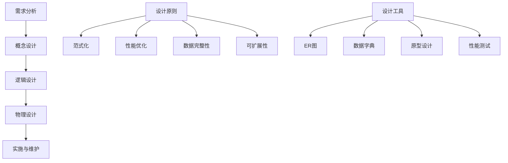

# 数据库设计原则

## 🎯 学习目标
- 掌握数据库设计的基本原则和规范
- 理解数据建模和关系设计
- 学会数据库范式化和反范式化
- 了解数据库设计的最佳实践

## 📚 核心概念

### 数据库设计流程



### 数据库范式对比

| 范式 | 描述 | 优点 | 缺点 | 适用场景 |
|------|------|------|------|----------|
| 1NF | 原子性，不可再分 | 数据一致性 | 可能冗余 | 基础要求 |
| 2NF | 完全函数依赖 | 减少冗余 | 复杂度增加 | 一般应用 |
| 3NF | 消除传递依赖 | 高度规范化 | 查询复杂 | 复杂系统 |
| BCNF | 消除所有依赖 | 最高规范化 | 性能影响 | 理论模型 |
| 反范式 | 适度冗余 | 查询性能高 | 数据一致性 | 高性能需求 |

## 🔧 数据库设计实现

### 数据库设计器
```php
<?php
// 1. 数据库设计器类
class DatabaseDesigner {
    private $tables;
    private $relationships;
    private $constraints;
    private $indexes;
    
    public function __construct() {
        $this->tables = [];
        $this->relationships = [];
        $this->constraints = [];
        $this->indexes = [];
    }
    
    // 创建表
    public function createTable($name, $columns, $options = []) {
        $table = [
            'name' => $name,
            'columns' => $columns,
            'primary_key' => $options['primary_key'] ?? 'id',
            'engine' => $options['engine'] ?? 'InnoDB',
            'charset' => $options['charset'] ?? 'utf8mb4',
            'collate' => $options['collate'] ?? 'utf8mb4_unicode_ci',
            'comment' => $options['comment'] ?? ''
        ];
        
        $this->tables[$name] = $table;
        return $this;
    }
    
    // 添加列
    public function addColumn($tableName, $columnName, $type, $options = []) {
        if (!isset($this->tables[$tableName])) {
            throw new Exception("表 '{$tableName}' 不存在");
        }
        
        $column = [
            'name' => $columnName,
            'type' => $type,
            'null' => $options['null'] ?? true,
            'default' => $options['default'] ?? null,
            'auto_increment' => $options['auto_increment'] ?? false,
            'comment' => $options['comment'] ?? ''
        ];
        
        $this->tables[$tableName]['columns'][$columnName] = $column;
        return $this;
    }
    
    // 添加主键
    public function addPrimaryKey($tableName, $columns) {
        if (!isset($this->tables[$tableName])) {
            throw new Exception("表 '{$tableName}' 不存在");
        }
        
        $this->constraints[] = [
            'type' => 'PRIMARY KEY',
            'table' => $tableName,
            'columns' => is_array($columns) ? $columns : [$columns]
        ];
        
        return $this;
    }
    
    // 添加外键
    public function addForeignKey($tableName, $column, $referencedTable, $referencedColumn, $options = []) {
        if (!isset($this->tables[$tableName])) {
            throw new Exception("表 '{$tableName}' 不存在");
        }
        
        $this->constraints[] = [
            'type' => 'FOREIGN KEY',
            'table' => $tableName,
            'column' => $column,
            'referenced_table' => $referencedTable,
            'referenced_column' => $referencedColumn,
            'on_delete' => $options['on_delete'] ?? 'RESTRICT',
            'on_update' => $options['on_update'] ?? 'RESTRICT'
        ];
        
        return $this;
    }
    
    // 添加唯一约束
    public function addUniqueConstraint($tableName, $columns, $name = null) {
        if (!isset($this->tables[$tableName])) {
            throw new Exception("表 '{$tableName}' 不存在");
        }
        
        $constraintName = $name ?: "uk_{$tableName}_" . implode('_', $columns);
        
        $this->constraints[] = [
            'type' => 'UNIQUE',
            'table' => $tableName,
            'columns' => is_array($columns) ? $columns : [$columns],
            'name' => $constraintName
        ];
        
        return $this;
    }
    
    // 添加索引
    public function addIndex($tableName, $columns, $options = []) {
        if (!isset($this->tables[$tableName])) {
            throw new Exception("表 '{$tableName}' 不存在");
        }
        
        $indexName = $options['name'] ?? "idx_{$tableName}_" . implode('_', $columns);
        
        $this->indexes[] = [
            'table' => $tableName,
            'columns' => is_array($columns) ? $columns : [$columns],
            'name' => $indexName,
            'type' => $options['type'] ?? 'INDEX',
            'unique' => $options['unique'] ?? false
        ];
        
        return $this;
    }
    
    // 生成DDL语句
    public function generateDDL() {
        $ddl = [];
        
        // 生成CREATE TABLE语句
        foreach ($this->tables as $tableName => $table) {
            $ddl[] = $this->generateCreateTableDDL($table);
        }
        
        // 生成约束语句
        foreach ($this->constraints as $constraint) {
            $ddl[] = $this->generateConstraintDDL($constraint);
        }
        
        // 生成索引语句
        foreach ($this->indexes as $index) {
            $ddl[] = $this->generateIndexDDL($index);
        }
        
        return $ddl;
    }
    
    // 生成CREATE TABLE DDL
    private function generateCreateTableDDL($table) {
        $sql = "CREATE TABLE `{$table['name']}` (\n";
        
        $columns = [];
        foreach ($table['columns'] as $columnName => $column) {
            $columnDDL = $this->generateColumnDDL($columnName, $column);
            $columns[] = "  " . $columnDDL;
        }
        
        $sql .= implode(",\n", $columns) . "\n";
        $sql .= ") ENGINE={$table['engine']} DEFAULT CHARSET={$table['charset']} COLLATE={$table['collate']}";
        
        if ($table['comment']) {
            $sql .= " COMMENT='{$table['comment']}'";
        }
        
        return $sql;
    }
    
    // 生成列DDL
    private function generateColumnDDL($columnName, $column) {
        $ddl = "`{$columnName}` {$column['type']}";
        
        if (!$column['null']) {
            $ddl .= " NOT NULL";
        }
        
        if ($column['default'] !== null) {
            $ddl .= " DEFAULT " . $this->formatDefaultValue($column['default']);
        }
        
        if ($column['auto_increment']) {
            $ddl .= " AUTO_INCREMENT";
        }
        
        if ($column['comment']) {
            $ddl .= " COMMENT '{$column['comment']}'";
        }
        
        return $ddl;
    }
    
    // 格式化默认值
    private function formatDefaultValue($value) {
        if ($value === null) {
            return 'NULL';
        } elseif (is_string($value)) {
            return "'" . addslashes($value) . "'";
        } elseif (is_bool($value)) {
            return $value ? '1' : '0';
        } else {
            return $value;
        }
    }
    
    // 生成约束DDL
    private function generateConstraintDDL($constraint) {
        switch ($constraint['type']) {
            case 'PRIMARY KEY':
                $columns = '`' . implode('`, `', $constraint['columns']) . '`';
                return "ALTER TABLE `{$constraint['table']}` ADD PRIMARY KEY ({$columns})";
                
            case 'FOREIGN KEY':
                $constraintName = "fk_{$constraint['table']}_{$constraint['column']}";
                return "ALTER TABLE `{$constraint['table']}` ADD CONSTRAINT `{$constraintName}` " .
                       "FOREIGN KEY (`{$constraint['column']}`) " .
                       "REFERENCES `{$constraint['referenced_table']}` (`{$constraint['referenced_column']}`) " .
                       "ON DELETE {$constraint['on_delete']} ON UPDATE {$constraint['on_update']}";
                       
            case 'UNIQUE':
                $columns = '`' . implode('`, `', $constraint['columns']) . '`';
                return "ALTER TABLE `{$constraint['table']}` ADD CONSTRAINT `{$constraint['name']}` UNIQUE ({$columns})";
        }
        
        return '';
    }
    
    // 生成索引DDL
    private function generateIndexDDL($index) {
        $columns = '`' . implode('`, `', $index['columns']) . '`';
        $type = $index['unique'] ? 'UNIQUE INDEX' : 'INDEX';
        
        return "ALTER TABLE `{$index['table']}` ADD {$type} `{$index['name']}` ({$columns})";
    }
    
    // 验证设计
    public function validateDesign() {
        $errors = [];
        
        // 检查表是否存在
        foreach ($this->constraints as $constraint) {
            if (!isset($this->tables[$constraint['table']])) {
                $errors[] = "约束引用的表 '{$constraint['table']}' 不存在";
            }
        }
        
        // 检查外键引用
        foreach ($this->constraints as $constraint) {
            if ($constraint['type'] === 'FOREIGN KEY') {
                if (!isset($this->tables[$constraint['referenced_table']])) {
                    $errors[] = "外键引用的表 '{$constraint['referenced_table']}' 不存在";
                }
            }
        }
        
        // 检查索引
        foreach ($this->indexes as $index) {
            if (!isset($this->tables[$index['table']])) {
                $errors[] = "索引引用的表 '{$index['table']}' 不存在";
            }
        }
        
        return $errors;
    }
    
    // 获取设计报告
    public function getDesignReport() {
        $report = [
            'tables' => count($this->tables),
            'constraints' => count($this->constraints),
            'indexes' => count($this->indexes),
            'relationships' => count($this->relationships),
            'validation_errors' => $this->validateDesign()
        ];
        
        return $report;
    }
}

// 2. 数据建模器
class DataModeler {
    private $entities;
    private $relationships;
    private $attributes;
    
    public function __construct() {
        $this->entities = [];
        $this->relationships = [];
        $this->attributes = [];
    }
    
    // 创建实体
    public function createEntity($name, $description = '') {
        $entity = [
            'name' => $name,
            'description' => $description,
            'attributes' => [],
            'primary_key' => null
        ];
        
        $this->entities[$name] = $entity;
        return $this;
    }
    
    // 添加属性
    public function addAttribute($entityName, $attributeName, $type, $options = []) {
        if (!isset($this->entities[$entityName])) {
            throw new Exception("实体 '{$entityName}' 不存在");
        }
        
        $attribute = [
            'name' => $attributeName,
            'type' => $type,
            'required' => $options['required'] ?? false,
            'unique' => $options['unique'] ?? false,
            'default' => $options['default'] ?? null,
            'description' => $options['description'] ?? ''
        ];
        
        $this->entities[$entityName]['attributes'][$attributeName] = $attribute;
        
        // 设置主键
        if ($options['primary_key'] ?? false) {
            $this->entities[$entityName]['primary_key'] = $attributeName;
        }
        
        return $this;
    }
    
    // 创建关系
    public function createRelationship($fromEntity, $toEntity, $type, $options = []) {
        $relationship = [
            'from_entity' => $fromEntity,
            'to_entity' => $toEntity,
            'type' => $type, // one-to-one, one-to-many, many-to-many
            'foreign_key' => $options['foreign_key'] ?? null,
            'description' => $options['description'] ?? ''
        ];
        
        $this->relationships[] = $relationship;
        return $this;
    }
    
    // 生成ER图数据
    public function generateERDiagram() {
        $diagram = [
            'entities' => [],
            'relationships' => []
        ];
        
        foreach ($this->entities as $entityName => $entity) {
            $diagram['entities'][] = [
                'name' => $entityName,
                'description' => $entity['description'],
                'attributes' => $entity['attributes'],
                'primary_key' => $entity['primary_key']
            ];
        }
        
        $diagram['relationships'] = $this->relationships;
        
        return $diagram;
    }
    
    // 转换为数据库设计
    public function toDatabaseDesign() {
        $designer = new DatabaseDesigner();
        
        foreach ($this->entities as $entityName => $entity) {
            $tableName = strtolower($entityName) . 's';
            $columns = [];
            
            foreach ($entity['attributes'] as $attrName => $attr) {
                $columns[$attrName] = [
                    'type' => $this->mapAttributeType($attr['type']),
                    'null' => !$attr['required'],
                    'default' => $attr['default'],
                    'comment' => $attr['description']
                ];
            }
            
            $designer->createTable($tableName, $columns);
            
            // 添加主键
            if ($entity['primary_key']) {
                $designer->addPrimaryKey($tableName, $entity['primary_key']);
            }
        }
        
        // 添加关系
        foreach ($this->relationships as $relationship) {
            $fromTable = strtolower($relationship['from_entity']) . 's';
            $toTable = strtolower($relationship['to_entity']) . 's';
            
            if ($relationship['type'] === 'one-to-many') {
                $foreignKey = $relationship['foreign_key'] ?: $relationship['to_entity'] . '_id';
                $designer->addForeignKey($fromTable, $foreignKey, $toTable, 'id');
            }
        }
        
        return $designer;
    }
    
    // 映射属性类型
    private function mapAttributeType($type) {
        $mapping = [
            'string' => 'VARCHAR(255)',
            'text' => 'TEXT',
            'integer' => 'INT',
            'bigint' => 'BIGINT',
            'decimal' => 'DECIMAL(10,2)',
            'boolean' => 'TINYINT(1)',
            'date' => 'DATE',
            'datetime' => 'DATETIME',
            'timestamp' => 'TIMESTAMP'
        ];
        
        return $mapping[$type] ?? 'VARCHAR(255)';
    }
}

// 3. 范式化分析器
class NormalizationAnalyzer {
    private $tables;
    
    public function __construct($tables) {
        $this->tables = $tables;
    }
    
    // 分析第一范式
    public function analyzeFirstNormalForm($tableName) {
        $table = $this->tables[$tableName];
        $violations = [];
        
        foreach ($table['columns'] as $columnName => $column) {
            // 检查是否为原子值
            if ($this->isNonAtomic($column['type'])) {
                $violations[] = [
                    'type' => 'NON_ATOMIC',
                    'column' => $columnName,
                    'description' => '字段包含非原子值'
                ];
            }
        }
        
        return [
            'table' => $tableName,
            'is_1nf' => empty($violations),
            'violations' => $violations
        ];
    }
    
    // 分析第二范式
    public function analyzeSecondNormalForm($tableName) {
        $table = $this->tables[$tableName];
        $violations = [];
        
        // 检查部分函数依赖
        $primaryKey = $table['primary_key'];
        if (is_array($primaryKey)) {
            foreach ($table['columns'] as $columnName => $column) {
                if (!in_array($columnName, $primaryKey)) {
                    // 检查是否只依赖于主键的一部分
                    if ($this->isPartialDependency($columnName, $primaryKey)) {
                        $violations[] = [
                            'type' => 'PARTIAL_DEPENDENCY',
                            'column' => $columnName,
                            'description' => '字段部分依赖于主键'
                        ];
                    }
                }
            }
        }
        
        return [
            'table' => $tableName,
            'is_2nf' => empty($violations),
            'violations' => $violations
        ];
    }
    
    // 分析第三范式
    public function analyzeThirdNormalForm($tableName) {
        $table = $this->tables[$tableName];
        $violations = [];
        
        // 检查传递依赖
        foreach ($table['columns'] as $columnName => $column) {
            if ($this->isTransitiveDependency($columnName, $table)) {
                $violations[] = [
                    'type' => 'TRANSITIVE_DEPENDENCY',
                    'column' => $columnName,
                    'description' => '字段存在传递依赖'
                ];
            }
        }
        
        return [
            'table' => $tableName,
            'is_3nf' => empty($violations),
            'violations' => $violations
        ];
    }
    
    // 检查是否为非原子值
    private function isNonAtomic($type) {
        // 简化实现，实际应该更复杂
        return strpos($type, 'JSON') !== false || strpos($type, 'ARRAY') !== false;
    }
    
    // 检查部分依赖
    private function isPartialDependency($column, $primaryKey) {
        // 简化实现，实际应该分析业务逻辑
        return false;
    }
    
    // 检查传递依赖
    private function isTransitiveDependency($column, $table) {
        // 简化实现，实际应该分析业务逻辑
        return false;
    }
    
    // 生成范式化报告
    public function generateNormalizationReport() {
        $report = [];
        
        foreach ($this->tables as $tableName => $table) {
            $report[$tableName] = [
                '1nf' => $this->analyzeFirstNormalForm($tableName),
                '2nf' => $this->analyzeSecondNormalForm($tableName),
                '3nf' => $this->analyzeThirdNormalForm($tableName)
            ];
        }
        
        return $report;
    }
}

// 使用示例
echo "=== 数据库设计原则示例 ===\n";

try {
    // 创建数据库设计器
    $designer = new DatabaseDesigner();
    
    // 设计用户表
    $designer->createTable('users', [
        'id' => [
            'type' => 'INT',
            'null' => false,
            'auto_increment' => true,
            'comment' => '用户ID'
        ],
        'username' => [
            'type' => 'VARCHAR(50)',
            'null' => false,
            'comment' => '用户名'
        ],
        'email' => [
            'type' => 'VARCHAR(100)',
            'null' => false,
            'comment' => '邮箱'
        ],
        'password_hash' => [
            'type' => 'VARCHAR(255)',
            'null' => false,
            'comment' => '密码哈希'
        ],
        'created_at' => [
            'type' => 'TIMESTAMP',
            'null' => false,
            'default' => 'CURRENT_TIMESTAMP',
            'comment' => '创建时间'
        ]
    ], [
        'comment' => '用户表'
    ]);
    
    // 设计文章表
    $designer->createTable('posts', [
        'id' => [
            'type' => 'INT',
            'null' => false,
            'auto_increment' => true,
            'comment' => '文章ID'
        ],
        'title' => [
            'type' => 'VARCHAR(200)',
            'null' => false,
            'comment' => '文章标题'
        ],
        'content' => [
            'type' => 'TEXT',
            'null' => true,
            'comment' => '文章内容'
        ],
        'user_id' => [
            'type' => 'INT',
            'null' => false,
            'comment' => '作者ID'
        ],
        'created_at' => [
            'type' => 'TIMESTAMP',
            'null' => false,
            'default' => 'CURRENT_TIMESTAMP',
            'comment' => '创建时间'
        ]
    ]);
    
    // 添加主键
    $designer->addPrimaryKey('users', 'id');
    $designer->addPrimaryKey('posts', 'id');
    
    // 添加外键
    $designer->addForeignKey('posts', 'user_id', 'users', 'id', [
        'on_delete' => 'CASCADE',
        'on_update' => 'CASCADE'
    ]);
    
    // 添加唯一约束
    $designer->addUniqueConstraint('users', 'email');
    $designer->addUniqueConstraint('users', 'username');
    
    // 添加索引
    $designer->addIndex('posts', 'user_id');
    $designer->addIndex('posts', 'created_at');
    
    // 生成DDL
    $ddl = $designer->generateDDL();
    echo "生成的DDL语句:\n";
    foreach ($ddl as $sql) {
        echo $sql . ";\n\n";
    }
    
    // 验证设计
    $errors = $designer->validateDesign();
    if (empty($errors)) {
        echo "数据库设计验证通过\n";
    } else {
        echo "设计验证错误:\n";
        foreach ($errors as $error) {
            echo "  - $error\n";
        }
    }
    
    // 获取设计报告
    $report = $designer->getDesignReport();
    echo "\n设计报告:\n";
    echo "  表数量: {$report['tables']}\n";
    echo "  约束数量: {$report['constraints']}\n";
    echo "  索引数量: {$report['indexes']}\n";
    echo "  关系数量: {$report['relationships']}\n";
    
    // 数据建模示例
    $modeler = new DataModeler();
    
    // 创建用户实体
    $modeler->createEntity('User', '用户实体')
            ->addAttribute('User', 'id', 'integer', ['primary_key' => true, 'required' => true])
            ->addAttribute('User', 'username', 'string', ['required' => true, 'unique' => true])
            ->addAttribute('User', 'email', 'string', ['required' => true, 'unique' => true])
            ->addAttribute('User', 'password_hash', 'string', ['required' => true]);
    
    // 创建文章实体
    $modeler->createEntity('Post', '文章实体')
            ->addAttribute('Post', 'id', 'integer', ['primary_key' => true, 'required' => true])
            ->addAttribute('Post', 'title', 'string', ['required' => true])
            ->addAttribute('Post', 'content', 'text', ['required' => false])
            ->addAttribute('Post', 'user_id', 'integer', ['required' => true]);
    
    // 创建关系
    $modeler->createRelationship('User', 'Post', 'one-to-many', [
        'foreign_key' => 'user_id',
        'description' => '用户与文章的一对多关系'
    ]);
    
    // 生成ER图数据
    $erDiagram = $modeler->generateERDiagram();
    echo "\nER图数据:\n";
    echo "  实体数量: " . count($erDiagram['entities']) . "\n";
    echo "  关系数量: " . count($erDiagram['relationships']) . "\n";
    
    // 转换为数据库设计
    $dbDesign = $modeler->toDatabaseDesign();
    $dbReport = $dbDesign->getDesignReport();
    echo "  转换后的表数量: {$dbReport['tables']}\n";
    
} catch (Exception $e) {
    echo "错误: " . $e->getMessage() . "\n";
}
?>
```

## 📊 最佳实践

### 数据库设计最佳实践
```php
<?php
// 数据库设计最佳实践

class DatabaseDesignBestPractices {
    // 1. 设计原则
    public static function getDesignPrinciples() {
        return [
            '数据完整性' => [
                '实体完整性' => '确保每个实体都有唯一标识',
                '参照完整性' => '维护表间关系的一致性',
                '域完整性' => '确保数据值在有效范围内',
                '用户定义完整性' => '实现业务规则约束'
            ],
            '性能优化' => [
                '索引设计' => '为查询字段创建适当索引',
                '数据类型' => '选择合适的数据类型',
                '表结构' => '优化表结构设计',
                '查询优化' => '设计支持高效查询的结构'
            ],
            '可维护性' => [
                '命名规范' => '使用一致的命名规范',
                '文档化' => '充分文档化设计决策',
                '模块化' => '采用模块化设计方法',
                '版本控制' => '使用版本控制管理变更'
            ],
            '可扩展性' => [
                '水平扩展' => '支持水平扩展的设计',
                '垂直扩展' => '支持垂直扩展的设计',
                '分区策略' => '实现适当的分区策略',
                '缓存设计' => '设计支持缓存的结构'
            ]
        ];
    }
    
    // 2. 命名规范
    public static function getNamingConventions() {
        return [
            '表命名' => [
                '规则' => '使用复数形式，小写字母和下划线',
                '示例' => 'users, user_profiles, order_items',
                '避免' => '避免使用保留字和特殊字符',
                '长度' => '表名长度不超过64个字符'
            ],
            '字段命名' => [
                '规则' => '使用小写字母和下划线，具有描述性',
                '示例' => 'user_id, created_at, email_address',
                '避免' => '避免使用缩写和模糊命名',
                '长度' => '字段名长度不超过64个字符'
            ],
            '索引命名' => [
                '规则' => '使用前缀标识类型，如idx_, uk_, fk_',
                '示例' => 'idx_users_email, uk_users_username, fk_posts_user_id',
                '避免' => '避免使用默认索引名',
                '长度' => '索引名长度不超过64个字符'
            ],
            '约束命名' => [
                '规则' => '使用有意义的名称，便于维护',
                '示例' => 'chk_user_age, fk_posts_user_id',
                '避免' => '避免使用系统生成的名称',
                '长度' => '约束名长度不超过64个字符'
            ]
        ];
    }
    
    // 3. 数据类型选择
    public static function getDataTypeGuidelines() {
        return [
            '整数类型' => [
                'TINYINT' => '1字节，范围-128到127，适合状态值',
                'SMALLINT' => '2字节，范围-32768到32767，适合小整数',
                'INT' => '4字节，范围-2^31到2^31-1，适合一般整数',
                'BIGINT' => '8字节，范围-2^63到2^63-1，适合大整数'
            ],
            '字符串类型' => [
                'CHAR' => '定长字符串，适合固定长度数据',
                'VARCHAR' => '变长字符串，适合长度变化的数据',
                'TEXT' => '长文本，适合大段文本内容',
                'ENUM' => '枚举类型，适合有限选项的数据'
            ],
            '数值类型' => [
                'DECIMAL' => '精确小数，适合金额等精确计算',
                'FLOAT' => '单精度浮点数，适合近似值',
                'DOUBLE' => '双精度浮点数，适合高精度近似值'
            ],
            '日期时间类型' => [
                'DATE' => '日期类型，适合存储日期',
                'TIME' => '时间类型，适合存储时间',
                'DATETIME' => '日期时间类型，适合本地时间',
                'TIMESTAMP' => '时间戳类型，适合UTC时间'
            ]
        ];
    }
    
    // 4. 索引设计策略
    public static function getIndexDesignStrategies() {
        return [
            '主键索引' => [
                '原则' => '每个表都应该有主键',
                '选择' => '选择稳定、唯一的字段作为主键',
                '类型' => '通常使用自增整数作为主键',
                '性能' => '主键索引对查询性能影响最大'
            ],
            '唯一索引' => [
                '原则' => '为唯一字段创建唯一索引',
                '应用' => '用户名、邮箱、手机号等唯一字段',
                '性能' => '唯一索引提供快速查找和约束检查',
                '维护' => '唯一索引需要维护数据唯一性'
            ],
            '普通索引' => [
                '原则' => '为经常查询的字段创建索引',
                '应用' => '外键、状态字段、时间字段等',
                '性能' => '普通索引提高查询性能',
                '维护' => '索引需要额外的存储空间和维护开销'
            ],
            '复合索引' => [
                '原则' => '为多字段查询创建复合索引',
                '顺序' => '将选择性高的字段放在前面',
                '应用' => 'WHERE条件中的多字段组合',
                '限制' => '复合索引字段数量不宜过多'
            ]
        ];
    }
}

// 使用示例
echo "=== 数据库设计最佳实践示例 ===\n";

try {
    // 设计原则
    $designPrinciples = DatabaseDesignBestPractices::getDesignPrinciples();
    echo "设计原则:\n";
    foreach ($designPrinciples as $category => $principles) {
        echo "  $category:\n";
        foreach ($principles as $principle => $description) {
            echo "    - $principle: $description\n";
        }
        echo "\n";
    }
    
    // 命名规范
    $namingConventions = DatabaseDesignBestPractices::getNamingConventions();
    echo "命名规范:\n";
    foreach ($namingConventions as $category => $conventions) {
        echo "  $category:\n";
        foreach ($conventions as $convention => $description) {
            echo "    - $convention: $description\n";
        }
        echo "\n";
    }
    
    // 数据类型选择
    $dataTypeGuidelines = DatabaseDesignBestPractices::getDataTypeGuidelines();
    echo "数据类型选择:\n";
    foreach ($dataTypeGuidelines as $category => $types) {
        echo "  $category:\n";
        foreach ($types as $type => $description) {
            echo "    - $type: $description\n";
        }
        echo "\n";
    }
    
    // 索引设计策略
    $indexDesignStrategies = DatabaseDesignBestPractices::getIndexDesignStrategies();
    echo "索引设计策略:\n";
    foreach ($indexDesignStrategies as $category => $strategies) {
        echo "  $category:\n";
        foreach ($strategies as $strategy => $description) {
            echo "    - $strategy: $description\n";
        }
        echo "\n";
    }
    
} catch (Exception $e) {
    echo "错误: " . $e->getMessage() . "\n";
}
?>
```

## 🎓 学习建议

### 费曼学习法应用
1. **选择概念**: 选择数据库设计中的核心概念
2. **简化解释**: 用简单语言解释数据库设计的重要性
3. **识别盲点**: 发现理解不深入的地方
4. **重新学习**: 针对盲点进行深入学习

### 刻意练习重点
1. **设计原则**: 掌握数据库设计的基本原则
2. **数据建模**: 学会进行数据建模和关系设计
3. **范式化**: 理解数据库范式化和反范式化
4. **最佳实践**: 掌握数据库设计的最佳实践

## 🔗 相关链接
- [[01-MySQL基础|MySQL基础]]
- [[02-PDO数据库抽象层|PDO数据库抽象层]]
- [[03-预处理语句|预处理语句]]
- [[04-事务处理|事务处理]]
- [[05-ORM框架使用|ORM框架使用]]
- [[06-数据库优化|数据库优化]]
