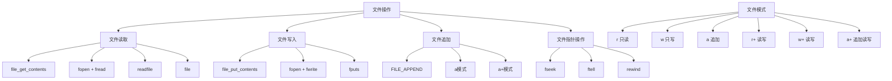

# 文件读写操作

## 🎯 学习目标
- 掌握PHP中文件读写的基本操作
- 理解不同文件操作模式的特点
- 学会处理文件操作的异常情况
- 了解文件操作的最佳实践

## 📚 核心概念

### 文件操作概述



### 文件操作模式对比

| 模式 | 描述 | 文件不存在 | 文件存在 | 指针位置 | 用途 |
|------|------|------------|----------|----------|------|
| r | 只读 | 失败 | 打开 | 开头 | 读取文件 |
| w | 只写 | 创建 | 清空 | 开头 | 写入文件 |
| a | 追加 | 创建 | 打开 | 末尾 | 追加内容 |
| r+ | 读写 | 失败 | 打开 | 开头 | 读写文件 |
| w+ | 读写 | 创建 | 清空 | 开头 | 读写文件 |
| a+ | 追加读写 | 创建 | 打开 | 末尾 | 追加读写 |
| x | 只写 | 创建 | 失败 | 开头 | 创建新文件 |
| x+ | 读写 | 创建 | 失败 | 开头 | 创建新文件 |

## 🔧 基本文件操作

### 文件读取
```php
<?php
// 1. file_get_contents - 读取整个文件
function readFileContent($filename) {
    if (!file_exists($filename)) {
        throw new Exception("文件不存在: $filename");
    }
    
    $content = file_get_contents($filename);
    if ($content === false) {
        throw new Exception("文件读取失败: $filename");
    }
    
    return $content;
}

// 2. fopen + fread - 逐行读取
function readFileLineByLine($filename) {
    $handle = fopen($filename, 'r');
    if (!$handle) {
        throw new Exception("无法打开文件: $filename");
    }
    
    $lines = [];
    while (($line = fgets($handle)) !== false) {
        $lines[] = trim($line);
    }
    
    fclose($handle);
    return $lines;
}

// 3. file - 读取文件为数组
function readFileAsArray($filename) {
    if (!file_exists($filename)) {
        throw new Exception("文件不存在: $filename");
    }
    
    $lines = file($filename, FILE_IGNORE_NEW_LINES | FILE_SKIP_EMPTY_LINES);
    if ($lines === false) {
        throw new Exception("文件读取失败: $filename");
    }
    
    return $lines;
}

// 4. readfile - 直接输出文件内容
function outputFile($filename) {
    if (!file_exists($filename)) {
        throw new Exception("文件不存在: $filename");
    }
    
    $bytes = readfile($filename);
    if ($bytes === false) {
        throw new Exception("文件输出失败: $filename");
    }
    
    return $bytes;
}

// 5. 大文件读取
function readLargeFile($filename, $chunkSize = 8192) {
    $handle = fopen($filename, 'r');
    if (!$handle) {
        throw new Exception("无法打开文件: $filename");
    }
    
    $content = '';
    while (!feof($handle)) {
        $chunk = fread($handle, $chunkSize);
        if ($chunk === false) {
            fclose($handle);
            throw new Exception("文件读取失败: $filename");
        }
        $content .= $chunk;
    }
    
    fclose($handle);
    return $content;
}

// 使用示例
echo "=== 文件读取示例 ===\n";

try {
    // 创建测试文件
    $testFile = 'test.txt';
    file_put_contents($testFile, "第一行\n第二行\n第三行\n");
    
    // 读取整个文件
    $content = readFileContent($testFile);
    echo "文件内容:\n$content\n";
    
    // 逐行读取
    $lines = readFileLineByLine($testFile);
    echo "逐行读取:\n";
    foreach ($lines as $index => $line) {
        echo "  " . ($index + 1) . ": $line\n";
    }
    
    // 读取为数组
    $array = readFileAsArray($testFile);
    echo "数组形式: " . json_encode($array, JSON_UNESCAPED_UNICODE) . "\n";
    
    // 清理测试文件
    unlink($testFile);
    
} catch (Exception $e) {
    echo "错误: " . $e->getMessage() . "\n";
}
?>
```

### 文件写入
```php
<?php
// 1. file_put_contents - 写入整个文件
function writeFileContent($filename, $content, $append = false) {
    $flags = $append ? FILE_APPEND | LOCK_EX : LOCK_EX;
    $bytes = file_put_contents($filename, $content, $flags);
    
    if ($bytes === false) {
        throw new Exception("文件写入失败: $filename");
    }
    
    return $bytes;
}

// 2. fopen + fwrite - 逐行写入
function writeFileLineByLine($filename, $lines, $append = false) {
    $mode = $append ? 'a' : 'w';
    $handle = fopen($filename, $mode);
    if (!$handle) {
        throw new Exception("无法打开文件: $filename");
    }
    
    $totalBytes = 0;
    foreach ($lines as $line) {
        $bytes = fwrite($handle, $line . "\n");
        if ($bytes === false) {
            fclose($handle);
            throw new Exception("文件写入失败: $filename");
        }
        $totalBytes += $bytes;
    }
    
    fclose($handle);
    return $totalBytes;
}

// 3. 格式化写入
function writeFormattedData($filename, $data, $format = 'json') {
    switch ($format) {
        case 'json':
            $content = json_encode($data, JSON_PRETTY_PRINT | JSON_UNESCAPED_UNICODE);
            break;
        case 'csv':
            $content = arrayToCsv($data);
            break;
        case 'xml':
            $content = arrayToXml($data);
            break;
        default:
            throw new InvalidArgumentException("不支持的格式: $format");
    }
    
    return writeFileContent($filename, $content);
}

// 4. 数组转CSV
function arrayToCsv($data) {
    if (empty($data)) {
        return '';
    }
    
    $output = fopen('php://temp', 'r+');
    
    // 写入标题行
    if (isset($data[0]) && is_array($data[0])) {
        fputcsv($output, array_keys($data[0]));
    }
    
    // 写入数据行
    foreach ($data as $row) {
        fputcsv($output, $row);
    }
    
    rewind($output);
    $csv = stream_get_contents($output);
    fclose($output);
    
    return $csv;
}

// 5. 数组转XML
function arrayToXml($data, $rootElement = 'root') {
    $xml = new SimpleXMLElement("<$rootElement></$rootElement>");
    
    foreach ($data as $key => $value) {
        if (is_array($value)) {
            $child = $xml->addChild($key);
            arrayToXmlRecursive($value, $child);
        } else {
            $xml->addChild($key, htmlspecialchars($value));
        }
    }
    
    return $xml->asXML();
}

function arrayToXmlRecursive($data, $xml) {
    foreach ($data as $key => $value) {
        if (is_array($value)) {
            $child = $xml->addChild($key);
            arrayToXmlRecursive($value, $child);
        } else {
            $xml->addChild($key, htmlspecialchars($value));
        }
    }
}

// 使用示例
echo "=== 文件写入示例 ===\n";

try {
    // 基本写入
    $filename = 'output.txt';
    $content = "这是测试内容\n包含多行\n数据";
    
    $bytes = writeFileContent($filename, $content);
    echo "写入字节数: $bytes\n";
    
    // 追加写入
    $appendContent = "\n这是追加的内容";
    $bytes = writeFileContent($filename, $appendContent, true);
    echo "追加字节数: $bytes\n";
    
    // 逐行写入
    $lines = ['第一行', '第二行', '第三行'];
    $bytes = writeFileLineByLine('lines.txt', $lines);
    echo "逐行写入字节数: $bytes\n";
    
    // 格式化写入
    $data = [
        ['name' => '张三', 'age' => 25, 'city' => '北京'],
        ['name' => '李四', 'age' => 30, 'city' => '上海'],
        ['name' => '王五', 'age' => 28, 'city' => '广州']
    ];
    
    writeFormattedData('data.json', $data, 'json');
    writeFormattedData('data.csv', $data, 'csv');
    writeFormattedData('data.xml', $data, 'xml');
    
    echo "格式化文件写入完成\n";
    
    // 清理测试文件
    $files = ['output.txt', 'lines.txt', 'data.json', 'data.csv', 'data.xml'];
    foreach ($files as $file) {
        if (file_exists($file)) {
            unlink($file);
        }
    }
    
} catch (Exception $e) {
    echo "错误: " . $e->getMessage() . "\n";
}
?>
```

### 文件指针操作
```php
<?php
// 1. 文件指针基础操作
function filePointerOperations($filename) {
    $handle = fopen($filename, 'r+');
    if (!$handle) {
        throw new Exception("无法打开文件: $filename");
    }
    
    // 获取当前位置
    $position = ftell($handle);
    echo "当前位置: $position\n";
    
    // 读取前10个字符
    $content = fread($handle, 10);
    echo "读取内容: $content\n";
    
    // 获取新位置
    $position = ftell($handle);
    echo "读取后位置: $position\n";
    
    // 移动到文件末尾
    fseek($handle, 0, SEEK_END);
    $position = ftell($handle);
    echo "文件末尾位置: $position\n";
    
    // 移动到文件开头
    rewind($handle);
    $position = ftell($handle);
    echo "文件开头位置: $position\n";
    
    fclose($handle);
}

// 2. 随机访问文件
function randomFileAccess($filename) {
    $handle = fopen($filename, 'r');
    if (!$handle) {
        throw new Exception("无法打开文件: $filename");
    }
    
    // 获取文件大小
    fseek($handle, 0, SEEK_END);
    $fileSize = ftell($handle);
    echo "文件大小: $fileSize 字节\n";
    
    // 随机读取位置
    $randomPosition = rand(0, max(0, $fileSize - 20));
    fseek($handle, $randomPosition);
    
    $content = fread($handle, 20);
    echo "随机位置 $randomPosition 的内容: $content\n";
    
    fclose($handle);
}

// 3. 文件截断
function truncateFile($filename, $size) {
    $handle = fopen($filename, 'r+');
    if (!$handle) {
        throw new Exception("无法打开文件: $filename");
    }
    
    // 截断文件到指定大小
    ftruncate($handle, $size);
    
    fclose($handle);
    echo "文件已截断到 $size 字节\n";
}

// 4. 文件锁定
function fileLocking($filename) {
    $handle = fopen($filename, 'r+');
    if (!$handle) {
        throw new Exception("无法打开文件: $filename");
    }
    
    // 获取独占锁
    if (flock($handle, LOCK_EX)) {
        echo "获取文件锁成功\n";
        
        // 模拟文件操作
        sleep(1);
        
        // 释放锁
        flock($handle, LOCK_UN);
        echo "释放文件锁\n";
    } else {
        echo "获取文件锁失败\n";
    }
    
    fclose($handle);
}

// 5. 文件流操作
function fileStreamOperations($filename) {
    // 创建临时流
    $stream = fopen('php://temp', 'r+');
    
    // 写入数据
    fwrite($stream, "临时流数据\n");
    fwrite($stream, "第二行数据\n");
    
    // 重置指针
    rewind($stream);
    
    // 读取数据
    $content = stream_get_contents($stream);
    echo "临时流内容:\n$content";
    
    // 关闭流
    fclose($stream);
}

// 使用示例
echo "=== 文件指针操作示例 ===\n";

try {
    // 创建测试文件
    $testFile = 'pointer_test.txt';
    $content = str_repeat("这是测试内容，包含中文字符。", 10) . "\n";
    file_put_contents($testFile, $content);
    
    // 文件指针操作
    filePointerOperations($testFile);
    
    // 随机访问
    randomFileAccess($testFile);
    
    // 文件截断
    truncateFile($testFile, 50);
    
    // 文件锁定
    fileLocking($testFile);
    
    // 文件流操作
    fileStreamOperations($testFile);
    
    // 清理测试文件
    unlink($testFile);
    
} catch (Exception $e) {
    echo "错误: " . $e->getMessage() . "\n";
}
?>
```

## 🔧 高级文件操作

### 文件操作类
```php
<?php
// 文件操作类
class FileManager {
    private $filename;
    private $handle;
    private $mode;
    private $isOpen;
    
    public function __construct($filename, $mode = 'r') {
        $this->filename = $filename;
        $this->mode = $mode;
        $this->handle = null;
        $this->isOpen = false;
    }
    
    // 打开文件
    public function open() {
        if ($this->isOpen) {
            return true;
        }
        
        $this->handle = fopen($this->filename, $this->mode);
        if (!$this->handle) {
            throw new Exception("无法打开文件: " . $this->filename);
        }
        
        $this->isOpen = true;
        return true;
    }
    
    // 关闭文件
    public function close() {
        if ($this->isOpen && $this->handle) {
            fclose($this->handle);
            $this->isOpen = false;
            $this->handle = null;
        }
    }
    
    // 读取文件
    public function read($length = null) {
        $this->ensureOpen();
        
        if ($length === null) {
            return stream_get_contents($this->handle);
        }
        
        return fread($this->handle, $length);
    }
    
    // 写入文件
    public function write($data) {
        $this->ensureOpen();
        
        $bytes = fwrite($this->handle, $data);
        if ($bytes === false) {
            throw new Exception("文件写入失败: " . $this->filename);
        }
        
        return $bytes;
    }
    
    // 读取一行
    public function readLine() {
        $this->ensureOpen();
        return fgets($this->handle);
    }
    
    // 写入一行
    public function writeLine($data) {
        return $this->write($data . "\n");
    }
    
    // 移动到指定位置
    public function seek($offset, $whence = SEEK_SET) {
        $this->ensureOpen();
        return fseek($this->handle, $offset, $whence);
    }
    
    // 获取当前位置
    public function tell() {
        $this->ensureOpen();
        return ftell($this->handle);
    }
    
    // 重置到开头
    public function rewind() {
        $this->ensureOpen();
        return rewind($this->handle);
    }
    
    // 检查是否到达文件末尾
    public function eof() {
        $this->ensureOpen();
        return feof($this->handle);
    }
    
    // 获取文件大小
    public function size() {
        if (!$this->isOpen) {
            return filesize($this->filename);
        }
        
        $current = $this->tell();
        $this->seek(0, SEEK_END);
        $size = $this->tell();
        $this->seek($current);
        
        return $size;
    }
    
    // 截断文件
    public function truncate($size) {
        $this->ensureOpen();
        return ftruncate($this->handle, $size);
    }
    
    // 获取文件锁
    public function lock($operation) {
        $this->ensureOpen();
        return flock($this->handle, $operation);
    }
    
    // 确保文件已打开
    private function ensureOpen() {
        if (!$this->isOpen) {
            $this->open();
        }
    }
    
    // 析构函数
    public function __destruct() {
        $this->close();
    }
    
    // 静态方法：读取整个文件
    public static function readAll($filename) {
        $manager = new self($filename, 'r');
        $content = $manager->read();
        $manager->close();
        return $content;
    }
    
    // 静态方法：写入整个文件
    public static function writeAll($filename, $content, $append = false) {
        $mode = $append ? 'a' : 'w';
        $manager = new self($filename, $mode);
        $bytes = $manager->write($content);
        $manager->close();
        return $bytes;
    }
    
    // 静态方法：复制文件
    public static function copy($source, $destination) {
        if (!file_exists($source)) {
            throw new Exception("源文件不存在: $source");
        }
        
        $sourceManager = new self($source, 'r');
        $destManager = new self($destination, 'w');
        
        $sourceManager->open();
        $destManager->open();
        
        while (!$sourceManager->eof()) {
            $chunk = $sourceManager->read(8192);
            $destManager->write($chunk);
        }
        
        $sourceManager->close();
        $destManager->close();
        
        return true;
    }
}

// 使用示例
echo "=== 文件操作类示例 ===\n";

try {
    // 创建测试文件
    $testFile = 'file_manager_test.txt';
    $content = "第一行内容\n第二行内容\n第三行内容\n";
    file_put_contents($testFile, $content);
    
    // 使用文件管理器
    $manager = new FileManager($testFile, 'r+');
    $manager->open();
    
    // 读取文件大小
    echo "文件大小: " . $manager->size() . " 字节\n";
    
    // 读取第一行
    $line = $manager->readLine();
    echo "第一行: " . trim($line) . "\n";
    
    // 移动到文件末尾
    $manager->seek(0, SEEK_END);
    
    // 追加内容
    $manager->writeLine("第四行内容");
    
    // 重置到开头
    $manager->rewind();
    
    // 读取所有内容
    $allContent = $manager->read();
    echo "所有内容:\n$allContent";
    
    $manager->close();
    
    // 使用静态方法
    $content = FileManager::readAll($testFile);
    echo "静态方法读取:\n$content";
    
    // 复制文件
    FileManager::copy($testFile, 'copy_' . $testFile);
    echo "文件复制完成\n";
    
    // 清理测试文件
    unlink($testFile);
    unlink('copy_' . $testFile);
    
} catch (Exception $e) {
    echo "错误: " . $e->getMessage() . "\n";
}
?>
```

### 文件操作工具类
```php
<?php
// 文件操作工具类
class FileUtils {
    // 检查文件是否存在
    public static function exists($filename) {
        return file_exists($filename);
    }
    
    // 检查是否为文件
    public static function isFile($filename) {
        return is_file($filename);
    }
    
    // 检查是否为目录
    public static function isDir($filename) {
        return is_dir($filename);
    }
    
    // 检查是否可读
    public static function isReadable($filename) {
        return is_readable($filename);
    }
    
    // 检查是否可写
    public static function isWritable($filename) {
        return is_writable($filename);
    }
    
    // 获取文件大小
    public static function size($filename) {
        if (!self::exists($filename)) {
            throw new Exception("文件不存在: $filename");
        }
        return filesize($filename);
    }
    
    // 获取文件修改时间
    public static function mtime($filename) {
        if (!self::exists($filename)) {
            throw new Exception("文件不存在: $filename");
        }
        return filemtime($filename);
    }
    
    // 获取文件访问时间
    public static function atime($filename) {
        if (!self::exists($filename)) {
            throw new Exception("文件不存在: $filename");
        }
        return fileatime($filename);
    }
    
    // 获取文件创建时间
    public static function ctime($filename) {
        if (!self::exists($filename)) {
            throw new Exception("文件不存在: $filename");
        }
        return filectime($filename);
    }
    
    // 获取文件类型
    public static function type($filename) {
        if (!self::exists($filename)) {
            throw new Exception("文件不存在: $filename");
        }
        return filetype($filename);
    }
    
    // 获取文件权限
    public static function permissions($filename) {
        if (!self::exists($filename)) {
            throw new Exception("文件不存在: $filename");
        }
        return fileperms($filename);
    }
    
    // 设置文件权限
    public static function chmod($filename, $mode) {
        if (!self::exists($filename)) {
            throw new Exception("文件不存在: $filename");
        }
        return chmod($filename, $mode);
    }
    
    // 删除文件
    public static function delete($filename) {
        if (!self::exists($filename)) {
            return false;
        }
        return unlink($filename);
    }
    
    // 重命名文件
    public static function rename($oldname, $newname) {
        if (!self::exists($oldname)) {
            throw new Exception("源文件不存在: $oldname");
        }
        return rename($oldname, $newname);
    }
    
    // 移动文件
    public static function move($source, $destination) {
        return self::rename($source, $destination);
    }
    
    // 复制文件
    public static function copy($source, $destination) {
        if (!self::exists($source)) {
            throw new Exception("源文件不存在: $source");
        }
        return copy($source, $destination);
    }
    
    // 获取文件扩展名
    public static function extension($filename) {
        return pathinfo($filename, PATHINFO_EXTENSION);
    }
    
    // 获取文件名（不含扩展名）
    public static function basename($filename) {
        return pathinfo($filename, PATHINFO_FILENAME);
    }
    
    // 获取目录名
    public static function dirname($filename) {
        return pathinfo($filename, PATHINFO_DIRNAME);
    }
    
    // 获取完整路径信息
    public static function pathInfo($filename) {
        return pathinfo($filename);
    }
    
    // 格式化文件大小
    public static function formatSize($bytes) {
        $units = ['B', 'KB', 'MB', 'GB', 'TB'];
        $bytes = max($bytes, 0);
        $pow = floor(($bytes ? log($bytes) : 0) / log(1024));
        $pow = min($pow, count($units) - 1);
        $bytes /= pow(1024, $pow);
        return round($bytes, 2) . ' ' . $units[$pow];
    }
    
    // 获取文件MIME类型
    public static function mimeType($filename) {
        if (!self::exists($filename)) {
            throw new Exception("文件不存在: $filename");
        }
        return mime_content_type($filename);
    }
    
    // 计算文件MD5
    public static function md5($filename) {
        if (!self::exists($filename)) {
            throw new Exception("文件不存在: $filename");
        }
        return md5_file($filename);
    }
    
    // 计算文件SHA1
    public static function sha1($filename) {
        if (!self::exists($filename)) {
            throw new Exception("文件不存在: $filename");
        }
        return sha1_file($filename);
    }
    
    // 创建临时文件
    public static function tempFile($prefix = 'tmp_', $suffix = '.tmp') {
        return tempnam(sys_get_temp_dir(), $prefix) . $suffix;
    }
    
    // 创建临时目录
    public static function tempDir($prefix = 'tmp_') {
        $tempDir = sys_get_temp_dir() . DIRECTORY_SEPARATOR . $prefix . uniqid();
        if (!mkdir($tempDir, 0755, true)) {
            throw new Exception("无法创建临时目录: $tempDir");
        }
        return $tempDir;
    }
}

// 使用示例
echo "=== 文件操作工具类示例 ===\n";

try {
    // 创建测试文件
    $testFile = 'utils_test.txt';
    $content = "这是测试文件内容\n包含多行数据\n用于测试工具类";
    file_put_contents($testFile, $content);
    
    // 检查文件属性
    echo "文件存在: " . (FileUtils::exists($testFile) ? '是' : '否') . "\n";
    echo "是文件: " . (FileUtils::isFile($testFile) ? '是' : '否') . "\n";
    echo "可读: " . (FileUtils::isReadable($testFile) ? '是' : '否') . "\n";
    echo "可写: " . (FileUtils::isWritable($testFile) ? '是' : '否') . "\n";
    
    // 获取文件信息
    echo "文件大小: " . FileUtils::size($testFile) . " 字节\n";
    echo "格式化大小: " . FileUtils::formatSize(FileUtils::size($testFile)) . "\n";
    echo "修改时间: " . date('Y-m-d H:i:s', FileUtils::mtime($testFile)) . "\n";
    echo "文件类型: " . FileUtils::type($testFile) . "\n";
    echo "MIME类型: " . FileUtils::mimeType($testFile) . "\n";
    
    // 获取路径信息
    $pathInfo = FileUtils::pathInfo($testFile);
    echo "路径信息: " . json_encode($pathInfo, JSON_UNESCAPED_UNICODE) . "\n";
    
    // 计算文件哈希
    echo "MD5: " . FileUtils::md5($testFile) . "\n";
    echo "SHA1: " . FileUtils::sha1($testFile) . "\n";
    
    // 复制文件
    $copyFile = 'copy_' . $testFile;
    FileUtils::copy($testFile, $copyFile);
    echo "文件复制完成\n";
    
    // 重命名文件
    $renameFile = 'renamed_' . $testFile;
    FileUtils::rename($copyFile, $renameFile);
    echo "文件重命名完成\n";
    
    // 清理测试文件
    FileUtils::delete($testFile);
    FileUtils::delete($renameFile);
    
    // 创建临时文件
    $tempFile = FileUtils::tempFile('test_', '.txt');
    file_put_contents($tempFile, "临时文件内容");
    echo "临时文件创建: $tempFile\n";
    FileUtils::delete($tempFile);
    
} catch (Exception $e) {
    echo "错误: " . $e->getMessage() . "\n";
}
?>
```

## 🎯 实际应用

### 配置文件管理器
```php
<?php
// 配置文件管理器
class ConfigFileManager {
    private $configFile;
    private $config;
    
    public function __construct($configFile) {
        $this->configFile = $configFile;
        $this->config = [];
        $this->loadConfig();
    }
    
    // 加载配置文件
    private function loadConfig() {
        if (!FileUtils::exists($this->configFile)) {
            $this->config = [];
            return;
        }
        
        $content = FileUtils::readAll($this->configFile);
        $extension = FileUtils::extension($this->configFile);
        
        switch ($extension) {
            case 'json':
                $this->config = json_decode($content, true) ?: [];
                break;
            case 'ini':
                $this->config = parse_ini_string($content, true) ?: [];
                break;
            case 'yaml':
            case 'yml':
                $this->config = yaml_parse($content) ?: [];
                break;
            default:
                throw new Exception("不支持的配置文件格式: $extension");
        }
    }
    
    // 保存配置文件
    public function saveConfig() {
        $extension = FileUtils::extension($this->configFile);
        
        switch ($extension) {
            case 'json':
                $content = json_encode($this->config, JSON_PRETTY_PRINT | JSON_UNESCAPED_UNICODE);
                break;
            case 'ini':
                $content = $this->arrayToIni($this->config);
                break;
            case 'yaml':
            case 'yml':
                $content = yaml_emit($this->config);
                break;
            default:
                throw new Exception("不支持的配置文件格式: $extension");
        }
        
        return FileUtils::writeAll($this->configFile, $content);
    }
    
    // 数组转INI格式
    private function arrayToIni($array) {
        $ini = '';
        foreach ($array as $key => $value) {
            if (is_array($value)) {
                $ini .= "[$key]\n";
                foreach ($value as $subKey => $subValue) {
                    $ini .= "$subKey = $subValue\n";
                }
                $ini .= "\n";
            } else {
                $ini .= "$key = $value\n";
            }
        }
        return $ini;
    }
    
    // 获取配置值
    public function get($key, $default = null) {
        $keys = explode('.', $key);
        $value = $this->config;
        
        foreach ($keys as $k) {
            if (!isset($value[$k])) {
                return $default;
            }
            $value = $value[$k];
        }
        
        return $value;
    }
    
    // 设置配置值
    public function set($key, $value) {
        $keys = explode('.', $key);
        $config = &$this->config;
        
        foreach ($keys as $k) {
            if (!isset($config[$k]) || !is_array($config[$k])) {
                $config[$k] = [];
            }
            $config = &$config[$k];
        }
        
        $config = $value;
    }
    
    // 删除配置值
    public function delete($key) {
        $keys = explode('.', $key);
        $config = &$this->config;
        
        for ($i = 0; $i < count($keys) - 1; $i++) {
            if (!isset($config[$keys[$i]])) {
                return false;
            }
            $config = &$config[$keys[$i]];
        }
        
        $lastKey = end($keys);
        if (isset($config[$lastKey])) {
            unset($config[$lastKey]);
            return true;
        }
        
        return false;
    }
    
    // 获取所有配置
    public function getAll() {
        return $this->config;
    }
    
    // 设置所有配置
    public function setAll($config) {
        $this->config = $config;
    }
    
    // 检查配置是否存在
    public function has($key) {
        $keys = explode('.', $key);
        $value = $this->config;
        
        foreach ($keys as $k) {
            if (!isset($value[$k])) {
                return false;
            }
            $value = $value[$k];
        }
        
        return true;
    }
}

// 使用示例
echo "=== 配置文件管理器示例 ===\n";

try {
    // 创建JSON配置文件
    $jsonConfig = new ConfigFileManager('config.json');
    $jsonConfig->set('database.host', 'localhost');
    $jsonConfig->set('database.port', 3306);
    $jsonConfig->set('database.name', 'testdb');
    $jsonConfig->set('app.name', 'My Application');
    $jsonConfig->set('app.version', '1.0.0');
    $jsonConfig->saveConfig();
    
    echo "JSON配置保存完成\n";
    
    // 读取配置
    echo "数据库主机: " . $jsonConfig->get('database.host') . "\n";
    echo "应用名称: " . $jsonConfig->get('app.name') . "\n";
    
    // 创建INI配置文件
    $iniConfig = new ConfigFileManager('config.ini');
    $iniConfig->setAll([
        'database' => [
            'host' => 'localhost',
            'port' => 3306,
            'name' => 'testdb'
        ],
        'app' => [
            'name' => 'My Application',
            'version' => '1.0.0'
        ]
    ]);
    $iniConfig->saveConfig();
    
    echo "INI配置保存完成\n";
    
    // 清理测试文件
    FileUtils::delete('config.json');
    FileUtils::delete('config.ini');
    
} catch (Exception $e) {
    echo "错误: " . $e->getMessage() . "\n";
}
?>
```

## 📊 最佳实践

### 文件操作最佳实践
```php
<?php
// 文件操作最佳实践

// 1. 错误处理
function safeFileOperation($filename, $operation) {
    try {
        // 检查文件是否存在
        if (!file_exists($filename)) {
            throw new Exception("文件不存在: $filename");
        }
        
        // 检查文件权限
        if (!is_readable($filename)) {
            throw new Exception("文件不可读: $filename");
        }
        
        // 执行操作
        return $operation($filename);
        
    } catch (Exception $e) {
        // 记录错误日志
        error_log("文件操作错误: " . $e->getMessage());
        return false;
    }
}

// 2. 资源管理
function withFile($filename, $mode, callable $callback) {
    $handle = fopen($filename, $mode);
    if (!$handle) {
        throw new Exception("无法打开文件: $filename");
    }
    
    try {
        return $callback($handle);
    } finally {
        fclose($handle);
    }
}

// 3. 大文件处理
function processLargeFile($filename, callable $processor, $chunkSize = 8192) {
    return withFile($filename, 'r', function($handle) use ($processor, $chunkSize) {
        while (!feof($handle)) {
            $chunk = fread($handle, $chunkSize);
            if ($chunk !== false) {
                $processor($chunk);
            }
        }
    });
}

// 4. 文件备份
function backupFile($filename, $backupDir = 'backups') {
    if (!file_exists($filename)) {
        throw new Exception("文件不存在: $filename");
    }
    
    // 创建备份目录
    if (!is_dir($backupDir)) {
        mkdir($backupDir, 0755, true);
    }
    
    $backupFile = $backupDir . DIRECTORY_SEPARATOR . basename($filename) . '.' . date('Y-m-d_H-i-s');
    return copy($filename, $backupFile);
}

// 5. 文件验证
function validateFile($filename, $options = []) {
    $defaults = [
        'maxSize' => 10 * 1024 * 1024, // 10MB
        'allowedTypes' => ['txt', 'json', 'csv'],
        'required' => true
    ];
    
    $options = array_merge($defaults, $options);
    
    // 检查文件是否存在
    if (!file_exists($filename)) {
        if ($options['required']) {
            throw new Exception("文件不存在: $filename");
        }
        return true;
    }
    
    // 检查文件大小
    $size = filesize($filename);
    if ($size > $options['maxSize']) {
        throw new Exception("文件过大: $size > " . $options['maxSize']);
    }
    
    // 检查文件类型
    $extension = strtolower(pathinfo($filename, PATHINFO_EXTENSION));
    if (!in_array($extension, $options['allowedTypes'])) {
        throw new Exception("不支持的文件类型: $extension");
    }
    
    return true;
}

// 使用示例
echo "=== 文件操作最佳实践示例 ===\n";

try {
    // 创建测试文件
    $testFile = 'best_practice_test.txt';
    file_put_contents($testFile, "测试文件内容\n");
    
    // 安全文件操作
    $result = safeFileOperation($testFile, function($filename) {
        return file_get_contents($filename);
    });
    echo "安全文件操作结果: " . ($result ? "成功" : "失败") . "\n";
    
    // 使用withFile
    $content = withFile($testFile, 'r', function($handle) {
        return fread($handle, filesize($testFile));
    });
    echo "withFile读取内容: $content";
    
    // 文件验证
    validateFile($testFile, [
        'maxSize' => 1024,
        'allowedTypes' => ['txt', 'log']
    ]);
    echo "文件验证通过\n";
    
    // 文件备份
    backupFile($testFile);
    echo "文件备份完成\n";
    
    // 清理测试文件
    unlink($testFile);
    $backupFiles = glob('backups/best_practice_test.txt.*');
    foreach ($backupFiles as $backup) {
        unlink($backup);
    }
    rmdir('backups');
    
} catch (Exception $e) {
    echo "错误: " . $e->getMessage() . "\n";
}
?>
```

## 🎓 学习建议

### 费曼学习法应用
1. **选择概念**: 选择文件读写操作中的核心概念
2. **简化解释**: 用简单语言解释文件操作的作用
3. **识别盲点**: 发现理解不深入的地方
4. **重新学习**: 针对盲点进行深入学习

### 刻意练习重点
1. **概念理解**: 深入理解文件操作的基本概念
2. **实际应用**: 在实际项目中应用文件操作
3. **最佳实践**: 学习文件操作的最佳实践
4. **错误处理**: 掌握文件操作的错误处理

## 🔗 相关链接
- [[02-目录操作|目录操作]]
- [[03-文件上传处理|文件上传处理]]
- [[04-文件下载实现|文件下载实现]]
- [[05-文件权限管理|文件权限管理]]
- [[06-文件操作安全|文件操作安全]]
