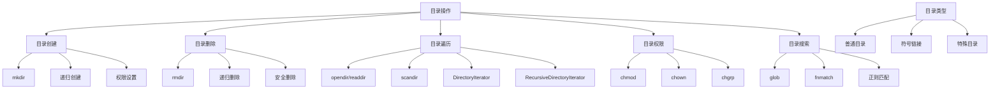

# 目录操作

## 🎯 学习目标
- 掌握PHP中目录操作的基本方法
- 理解目录遍历和文件搜索技术
- 学会目录权限管理和安全操作
- 了解目录操作的最佳实践

## 📚 核心概念

### 目录操作概述



### 目录操作函数对比

| 函数 | 功能 | 返回值 | 特点 | 使用场景 |
|------|------|--------|------|----------|
| mkdir | 创建目录 | bool | 单层创建 | 基本目录创建 |
| rmdir | 删除目录 | bool | 空目录 | 删除空目录 |
| opendir | 打开目录 | resource | 资源句柄 | 目录遍历 |
| readdir | 读取目录项 | string | 逐个读取 | 目录遍历 |
| closedir | 关闭目录 | void | 释放资源 | 资源清理 |
| scandir | 扫描目录 | array | 返回数组 | 快速获取文件列表 |
| is_dir | 检查目录 | bool | 类型判断 | 目录验证 |
| chmod | 修改权限 | bool | 权限设置 | 权限管理 |

## 🔧 基本目录操作

### 目录创建和删除
```php
<?php
// 1. 基本目录创建
function createDirectory($path, $mode = 0755) {
    if (is_dir($path)) {
        return true; // 目录已存在
    }
    
    $result = mkdir($path, $mode);
    if (!$result) {
        throw new Exception("无法创建目录: $path");
    }
    
    return true;
}

// 2. 递归目录创建
function createDirectoryRecursive($path, $mode = 0755) {
    if (is_dir($path)) {
        return true; // 目录已存在
    }
    
    $parent = dirname($path);
    if (!is_dir($parent)) {
        createDirectoryRecursive($parent, $mode);
    }
    
    $result = mkdir($path, $mode);
    if (!$result) {
        throw new Exception("无法创建目录: $path");
    }
    
    return true;
}

// 3. 安全目录创建
function createDirectorySafe($path, $mode = 0755) {
    // 检查路径安全性
    if (strpos($path, '..') !== false) {
        throw new Exception("不安全的路径: $path");
    }
    
    // 规范化路径
    $path = realpath(dirname($path)) . DIRECTORY_SEPARATOR . basename($path);
    
    return createDirectoryRecursive($path, $mode);
}

// 4. 目录删除
function deleteDirectory($path) {
    if (!is_dir($path)) {
        return false; // 目录不存在
    }
    
    $result = rmdir($path);
    if (!$result) {
        throw new Exception("无法删除目录: $path");
    }
    
    return true;
}

// 5. 递归目录删除
function deleteDirectoryRecursive($path) {
    if (!is_dir($path)) {
        return false; // 目录不存在
    }
    
    $items = scandir($path);
    foreach ($items as $item) {
        if ($item === '.' || $item === '..') {
            continue;
        }
        
        $itemPath = $path . DIRECTORY_SEPARATOR . $item;
        
        if (is_dir($itemPath)) {
            deleteDirectoryRecursive($itemPath);
        } else {
            unlink($itemPath);
        }
    }
    
    return rmdir($path);
}

// 6. 安全目录删除
function deleteDirectorySafe($path) {
    // 检查路径安全性
    if (strpos($path, '..') !== false) {
        throw new Exception("不安全的路径: $path");
    }
    
    // 检查是否在允许的目录内
    $allowedBase = realpath(__DIR__);
    $targetPath = realpath($path);
    
    if (!$targetPath || strpos($targetPath, $allowedBase) !== 0) {
        throw new Exception("不允许删除的目录: $path");
    }
    
    return deleteDirectoryRecursive($path);
}

// 使用示例
echo "=== 目录创建和删除示例 ===\n";

try {
    // 创建基本目录
    $dir1 = 'test_dir1';
    createDirectory($dir1);
    echo "目录创建成功: $dir1\n";
    
    // 创建嵌套目录
    $dir2 = 'test_dir2/subdir1/subdir2';
    createDirectoryRecursive($dir2);
    echo "嵌套目录创建成功: $dir2\n";
    
    // 安全创建目录
    $dir3 = 'test_dir3';
    createDirectorySafe($dir3);
    echo "安全目录创建成功: $dir3\n";
    
    // 删除目录
    deleteDirectory($dir1);
    echo "目录删除成功: $dir1\n";
    
    // 递归删除目录
    deleteDirectoryRecursive('test_dir2');
    echo "递归目录删除成功: test_dir2\n";
    
    // 安全删除目录
    deleteDirectorySafe($dir3);
    echo "安全目录删除成功: $dir3\n";
    
} catch (Exception $e) {
    echo "错误: " . $e->getMessage() . "\n";
}
?>
```

### 目录遍历
```php
<?php
// 1. 基本目录遍历
function listDirectory($path) {
    if (!is_dir($path)) {
        throw new Exception("目录不存在: $path");
    }
    
    $handle = opendir($path);
    if (!$handle) {
        throw new Exception("无法打开目录: $path");
    }
    
    $items = [];
    while (($item = readdir($handle)) !== false) {
        if ($item !== '.' && $item !== '..') {
            $items[] = $item;
        }
    }
    
    closedir($handle);
    return $items;
}

// 2. 使用scandir遍历
function scanDirectory($path, $sort = SCANDIR_SORT_ASCENDING) {
    if (!is_dir($path)) {
        throw new Exception("目录不存在: $path");
    }
    
    $items = scandir($path, $sort);
    if ($items === false) {
        throw new Exception("无法扫描目录: $path");
    }
    
    // 过滤掉 . 和 ..
    return array_filter($items, function($item) {
        return $item !== '.' && $item !== '..';
    });
}

// 3. 递归目录遍历
function listDirectoryRecursive($path, $maxDepth = -1, $currentDepth = 0) {
    if (!is_dir($path)) {
        throw new Exception("目录不存在: $path");
    }
    
    if ($maxDepth !== -1 && $currentDepth >= $maxDepth) {
        return [];
    }
    
    $items = [];
    $handle = opendir($path);
    
    while (($item = readdir($handle)) !== false) {
        if ($item === '.' || $item === '..') {
            continue;
        }
        
        $itemPath = $path . DIRECTORY_SEPARATOR . $item;
        $items[] = [
            'name' => $item,
            'path' => $itemPath,
            'type' => is_dir($itemPath) ? 'directory' : 'file',
            'size' => is_file($itemPath) ? filesize($itemPath) : 0,
            'modified' => filemtime($itemPath)
        ];
        
        if (is_dir($itemPath)) {
            $subItems = listDirectoryRecursive($itemPath, $maxDepth, $currentDepth + 1);
            $items = array_merge($items, $subItems);
        }
    }
    
    closedir($handle);
    return $items;
}

// 4. 使用DirectoryIterator遍历
function iterateDirectory($path) {
    if (!is_dir($path)) {
        throw new Exception("目录不存在: $path");
    }
    
    $items = [];
    $iterator = new DirectoryIterator($path);
    
    foreach ($iterator as $item) {
        if ($item->isDot()) {
            continue;
        }
        
        $items[] = [
            'name' => $item->getFilename(),
            'path' => $item->getPathname(),
            'type' => $item->isDir() ? 'directory' : 'file',
            'size' => $item->getSize(),
            'modified' => $item->getMTime(),
            'permissions' => $item->getPerms()
        ];
    }
    
    return $items;
}

// 5. 使用RecursiveDirectoryIterator遍历
function iterateDirectoryRecursive($path, $maxDepth = -1) {
    if (!is_dir($path)) {
        throw new Exception("目录不存在: $path");
    }
    
    $items = [];
    $iterator = new RecursiveDirectoryIterator($path, RecursiveDirectoryIterator::SKIP_DOTS);
    
    if ($maxDepth !== -1) {
        $iterator = new RecursiveIteratorIterator($iterator, RecursiveIteratorIterator::SELF_FIRST);
        $iterator->setMaxDepth($maxDepth);
    } else {
        $iterator = new RecursiveIteratorIterator($iterator, RecursiveIteratorIterator::SELF_FIRST);
    }
    
    foreach ($iterator as $item) {
        $items[] = [
            'name' => $item->getFilename(),
            'path' => $item->getPathname(),
            'type' => $item->isDir() ? 'directory' : 'file',
            'size' => $item->getSize(),
            'modified' => $item->getMTime(),
            'depth' => $iterator->getDepth()
        ];
    }
    
    return $items;
}

// 使用示例
echo "=== 目录遍历示例 ===\n";

try {
    // 创建测试目录结构
    $testDir = 'test_traverse';
    createDirectoryRecursive($testDir . '/subdir1/subdir2');
    createDirectoryRecursive($testDir . '/subdir3');
    
    // 创建测试文件
    file_put_contents($testDir . '/file1.txt', 'content1');
    file_put_contents($testDir . '/subdir1/file2.txt', 'content2');
    file_put_contents($testDir . '/subdir1/subdir2/file3.txt', 'content3');
    
    // 基本目录遍历
    $items = listDirectory($testDir);
    echo "基本遍历结果: " . implode(', ', $items) . "\n";
    
    // 使用scandir遍历
    $items = scanDirectory($testDir);
    echo "scandir遍历结果: " . implode(', ', $items) . "\n";
    
    // 递归目录遍历
    $items = listDirectoryRecursive($testDir, 2);
    echo "递归遍历结果 (" . count($items) . " 项):\n";
    foreach ($items as $item) {
        echo "  " . str_repeat('  ', $item['depth'] ?? 0) . $item['name'] . " (" . $item['type'] . ")\n";
    }
    
    // 使用DirectoryIterator遍历
    $items = iterateDirectory($testDir);
    echo "DirectoryIterator遍历结果 (" . count($items) . " 项):\n";
    foreach ($items as $item) {
        echo "  " . $item['name'] . " (" . $item['type'] . ", " . $item['size'] . " bytes)\n";
    }
    
    // 清理测试目录
    deleteDirectoryRecursive($testDir);
    
} catch (Exception $e) {
    echo "错误: " . $e->getMessage() . "\n";
}
?>
```

### 目录搜索
```php
<?php
// 1. 使用glob搜索
function searchWithGlob($pattern, $path = '.') {
    $fullPattern = $path . DIRECTORY_SEPARATOR . $pattern;
    $results = glob($fullPattern);
    
    if ($results === false) {
        throw new Exception("搜索失败: $pattern");
    }
    
    return $results;
}

// 2. 递归glob搜索
function searchWithGlobRecursive($pattern, $path = '.') {
    $results = [];
    
    // 搜索当前目录
    $currentResults = searchWithGlob($pattern, $path);
    $results = array_merge($results, $currentResults);
    
    // 递归搜索子目录
    $subdirs = glob($path . DIRECTORY_SEPARATOR . '*', GLOB_ONLYDIR);
    foreach ($subdirs as $subdir) {
        $subResults = searchWithGlobRecursive($pattern, $subdir);
        $results = array_merge($results, $subResults);
    }
    
    return $results;
}

// 3. 文件名模式匹配
function searchWithPattern($pattern, $path = '.', $recursive = true) {
    $results = [];
    
    if ($recursive) {
        $iterator = new RecursiveDirectoryIterator($path, RecursiveDirectoryIterator::SKIP_DOTS);
        $iterator = new RecursiveIteratorIterator($iterator);
    } else {
        $iterator = new DirectoryIterator($path);
    }
    
    foreach ($iterator as $item) {
        if ($item->isDot()) {
            continue;
        }
        
        if (fnmatch($pattern, $item->getFilename())) {
            $results[] = $item->getPathname();
        }
    }
    
    return $results;
}

// 4. 正则表达式搜索
function searchWithRegex($pattern, $path = '.', $recursive = true) {
    $results = [];
    
    if ($recursive) {
        $iterator = new RecursiveDirectoryIterator($path, RecursiveDirectoryIterator::SKIP_DOTS);
        $iterator = new RecursiveIteratorIterator($iterator);
    } else {
        $iterator = new DirectoryIterator($path);
    }
    
    foreach ($iterator as $item) {
        if ($item->isDot()) {
            continue;
        }
        
        if (preg_match($pattern, $item->getFilename())) {
            $results[] = $item->getPathname();
        }
    }
    
    return $results;
}

// 5. 高级搜索
function advancedSearch($options = []) {
    $defaults = [
        'path' => '.',
        'pattern' => '*',
        'type' => 'both', // 'file', 'directory', 'both'
        'recursive' => true,
        'maxDepth' => -1,
        'minSize' => 0,
        'maxSize' => -1,
        'modifiedAfter' => 0,
        'modifiedBefore' => 0
    ];
    
    $options = array_merge($defaults, $options);
    $results = [];
    
    if ($options['recursive']) {
        $iterator = new RecursiveDirectoryIterator($options['path'], RecursiveDirectoryIterator::SKIP_DOTS);
        $iterator = new RecursiveIteratorIterator($iterator);
        
        if ($options['maxDepth'] !== -1) {
            $iterator->setMaxDepth($options['maxDepth']);
        }
    } else {
        $iterator = new DirectoryIterator($options['path']);
    }
    
    foreach ($iterator as $item) {
        if ($item->isDot()) {
            continue;
        }
        
        // 类型过滤
        if ($options['type'] === 'file' && $item->isDir()) {
            continue;
        }
        if ($options['type'] === 'directory' && $item->isFile()) {
            continue;
        }
        
        // 文件名模式匹配
        if (!fnmatch($options['pattern'], $item->getFilename())) {
            continue;
        }
        
        // 大小过滤
        if ($item->isFile()) {
            $size = $item->getSize();
            if ($size < $options['minSize'] || ($options['maxSize'] !== -1 && $size > $options['maxSize'])) {
                continue;
            }
        }
        
        // 修改时间过滤
        $modified = $item->getMTime();
        if ($options['modifiedAfter'] > 0 && $modified < $options['modifiedAfter']) {
            continue;
        }
        if ($options['modifiedBefore'] > 0 && $modified > $options['modifiedBefore']) {
            continue;
        }
        
        $results[] = [
            'name' => $item->getFilename(),
            'path' => $item->getPathname(),
            'type' => $item->isDir() ? 'directory' : 'file',
            'size' => $item->getSize(),
            'modified' => $modified,
            'permissions' => $item->getPerms()
        ];
    }
    
    return $results;
}

// 使用示例
echo "=== 目录搜索示例 ===\n";

try {
    // 创建测试目录结构
    $testDir = 'test_search';
    createDirectoryRecursive($testDir . '/subdir1/subdir2');
    createDirectoryRecursive($testDir . '/subdir3');
    
    // 创建测试文件
    file_put_contents($testDir . '/file1.txt', 'content1');
    file_put_contents($testDir . '/file2.log', 'content2');
    file_put_contents($testDir . '/subdir1/file3.txt', 'content3');
    file_put_contents($testDir . '/subdir1/subdir2/file4.log', 'content4');
    file_put_contents($testDir . '/subdir3/file5.txt', 'content5');
    
    // 使用glob搜索
    $results = searchWithGlob('*.txt', $testDir);
    echo "glob搜索txt文件: " . implode(', ', $results) . "\n";
    
    // 递归glob搜索
    $results = searchWithGlobRecursive('*.log', $testDir);
    echo "递归glob搜索log文件: " . implode(', ', $results) . "\n";
    
    // 模式匹配搜索
    $results = searchWithPattern('file*.txt', $testDir, true);
    echo "模式匹配搜索: " . implode(', ', $results) . "\n";
    
    // 正则表达式搜索
    $results = searchWithRegex('/file[1-3]\./', $testDir, true);
    echo "正则表达式搜索: " . implode(', ', $results) . "\n";
    
    // 高级搜索
    $results = advancedSearch([
        'path' => $testDir,
        'pattern' => '*.txt',
        'type' => 'file',
        'recursive' => true,
        'minSize' => 5
    ]);
    echo "高级搜索结果 (" . count($results) . " 项):\n";
    foreach ($results as $result) {
        echo "  " . $result['name'] . " (" . $result['size'] . " bytes)\n";
    }
    
    // 清理测试目录
    deleteDirectoryRecursive($testDir);
    
} catch (Exception $e) {
    echo "错误: " . $e->getMessage() . "\n";
}
?>
```

## 🔧 高级目录操作

### 目录管理器类
```php
<?php
// 目录管理器类
class DirectoryManager {
    private $path;
    private $iterator;
    
    public function __construct($path) {
        $this->path = realpath($path);
        if (!$this->path || !is_dir($this->path)) {
            throw new Exception("无效的目录路径: $path");
        }
    }
    
    // 获取目录信息
    public function getInfo() {
        return [
            'path' => $this->path,
            'name' => basename($this->path),
            'parent' => dirname($this->path),
            'size' => $this->getSize(),
            'modified' => filemtime($this->path),
            'permissions' => fileperms($this->path),
            'readable' => is_readable($this->path),
            'writable' => is_writable($this->path)
        ];
    }
    
    // 获取目录大小
    public function getSize() {
        $size = 0;
        $iterator = new RecursiveDirectoryIterator($this->path, RecursiveDirectoryIterator::SKIP_DOTS);
        $iterator = new RecursiveIteratorIterator($iterator);
        
        foreach ($iterator as $item) {
            if ($item->isFile()) {
                $size += $item->getSize();
            }
        }
        
        return $size;
    }
    
    // 获取文件列表
    public function getFiles($recursive = false, $pattern = '*') {
        $files = [];
        
        if ($recursive) {
            $iterator = new RecursiveDirectoryIterator($this->path, RecursiveDirectoryIterator::SKIP_DOTS);
            $iterator = new RecursiveIteratorIterator($iterator);
        } else {
            $iterator = new DirectoryIterator($this->path);
        }
        
        foreach ($iterator as $item) {
            if ($item->isDot() || $item->isDir()) {
                continue;
            }
            
            if (!fnmatch($pattern, $item->getFilename())) {
                continue;
            }
            
            $files[] = [
                'name' => $item->getFilename(),
                'path' => $item->getPathname(),
                'size' => $item->getSize(),
                'modified' => $item->getMTime(),
                'permissions' => $item->getPerms()
            ];
        }
        
        return $files;
    }
    
    // 获取子目录列表
    public function getSubdirectories($recursive = false) {
        $directories = [];
        
        if ($recursive) {
            $iterator = new RecursiveDirectoryIterator($this->path, RecursiveDirectoryIterator::SKIP_DOTS);
            $iterator = new RecursiveIteratorIterator($iterator, RecursiveIteratorIterator::SELF_FIRST);
        } else {
            $iterator = new DirectoryIterator($this->path);
        }
        
        foreach ($iterator as $item) {
            if ($item->isDot() || !$item->isDir()) {
                continue;
            }
            
            $directories[] = [
                'name' => $item->getFilename(),
                'path' => $item->getPathname(),
                'size' => $this->getDirectorySize($item->getPathname()),
                'modified' => $item->getMTime(),
                'permissions' => $item->getPerms()
            ];
        }
        
        return $directories;
    }
    
    // 获取目录大小
    private function getDirectorySize($path) {
        $size = 0;
        $iterator = new RecursiveDirectoryIterator($path, RecursiveDirectoryIterator::SKIP_DOTS);
        $iterator = new RecursiveIteratorIterator($iterator);
        
        foreach ($iterator as $item) {
            if ($item->isFile()) {
                $size += $item->getSize();
            }
        }
        
        return $size;
    }
    
    // 搜索文件
    public function search($pattern, $type = 'both', $recursive = true) {
        $results = [];
        
        if ($recursive) {
            $iterator = new RecursiveDirectoryIterator($this->path, RecursiveDirectoryIterator::SKIP_DOTS);
            $iterator = new RecursiveIteratorIterator($iterator);
        } else {
            $iterator = new DirectoryIterator($this->path);
        }
        
        foreach ($iterator as $item) {
            if ($item->isDot()) {
                continue;
            }
            
            // 类型过滤
            if ($type === 'file' && $item->isDir()) {
                continue;
            }
            if ($type === 'directory' && $item->isFile()) {
                continue;
            }
            
            // 模式匹配
            if (fnmatch($pattern, $item->getFilename())) {
                $results[] = [
                    'name' => $item->getFilename(),
                    'path' => $item->getPathname(),
                    'type' => $item->isDir() ? 'directory' : 'file',
                    'size' => $item->getSize(),
                    'modified' => $item->getMTime()
                ];
            }
        }
        
        return $results;
    }
    
    // 创建子目录
    public function createSubdirectory($name, $mode = 0755) {
        $path = $this->path . DIRECTORY_SEPARATOR . $name;
        
        if (is_dir($path)) {
            throw new Exception("目录已存在: $name");
        }
        
        if (!mkdir($path, $mode)) {
            throw new Exception("无法创建目录: $name");
        }
        
        return new self($path);
    }
    
    // 删除子目录
    public function deleteSubdirectory($name) {
        $path = $this->path . DIRECTORY_SEPARATOR . $name;
        
        if (!is_dir($path)) {
            throw new Exception("目录不存在: $name");
        }
        
        $this->deleteDirectoryRecursive($path);
        return true;
    }
    
    // 递归删除目录
    private function deleteDirectoryRecursive($path) {
        $items = scandir($path);
        foreach ($items as $item) {
            if ($item === '.' || $item === '..') {
                continue;
            }
            
            $itemPath = $path . DIRECTORY_SEPARATOR . $item;
            
            if (is_dir($itemPath)) {
                $this->deleteDirectoryRecursive($itemPath);
            } else {
                unlink($itemPath);
            }
        }
        
        rmdir($path);
    }
    
    // 复制目录
    public function copyTo($destination) {
        if (!is_dir($destination)) {
            mkdir($destination, 0755, true);
        }
        
        $iterator = new RecursiveDirectoryIterator($this->path, RecursiveDirectoryIterator::SKIP_DOTS);
        $iterator = new RecursiveIteratorIterator($iterator);
        
        foreach ($iterator as $item) {
            $relativePath = substr($item->getPathname(), strlen($this->path) + 1);
            $destPath = $destination . DIRECTORY_SEPARATOR . $relativePath;
            
            if ($item->isDir()) {
                mkdir($destPath, 0755, true);
            } else {
                copy($item->getPathname(), $destPath);
            }
        }
        
        return new self($destination);
    }
    
    // 移动目录
    public function moveTo($destination) {
        $this->copyTo($destination);
        $this->deleteDirectoryRecursive($this->path);
        return new self($destination);
    }
}

// 使用示例
echo "=== 目录管理器类示例 ===\n";

try {
    // 创建测试目录
    $testDir = 'test_manager';
    createDirectoryRecursive($testDir . '/subdir1/subdir2');
    createDirectoryRecursive($testDir . '/subdir3');
    
    // 创建测试文件
    file_put_contents($testDir . '/file1.txt', 'content1');
    file_put_contents($testDir . '/file2.log', 'content2');
    file_put_contents($testDir . '/subdir1/file3.txt', 'content3');
    file_put_contents($testDir . '/subdir1/subdir2/file4.log', 'content4');
    
    // 创建目录管理器
    $manager = new DirectoryManager($testDir);
    
    // 获取目录信息
    $info = $manager->getInfo();
    echo "目录信息:\n";
    foreach ($info as $key => $value) {
        echo "  $key: $value\n";
    }
    
    // 获取文件列表
    $files = $manager->getFiles(true, '*.txt');
    echo "\n文件列表 (" . count($files) . " 项):\n";
    foreach ($files as $file) {
        echo "  " . $file['name'] . " (" . $file['size'] . " bytes)\n";
    }
    
    // 获取子目录列表
    $subdirs = $manager->getSubdirectories(true);
    echo "\n子目录列表 (" . count($subdirs) . " 项):\n";
    foreach ($subdirs as $subdir) {
        echo "  " . $subdir['name'] . " (" . $subdir['size'] . " bytes)\n";
    }
    
    // 搜索文件
    $results = $manager->search('*.log', 'file', true);
    echo "\n搜索结果 (" . count($results) . " 项):\n";
    foreach ($results as $result) {
        echo "  " . $result['name'] . " (" . $result['type'] . ")\n";
    }
    
    // 创建子目录
    $newDir = $manager->createSubdirectory('new_subdir');
    echo "\n创建子目录: " . $newDir->getInfo()['name'] . "\n";
    
    // 复制目录
    $copyDir = 'test_manager_copy';
    $manager->copyTo($copyDir);
    echo "目录复制完成: $copyDir\n";
    
    // 清理测试目录
    deleteDirectoryRecursive($testDir);
    deleteDirectoryRecursive($copyDir);
    
} catch (Exception $e) {
    echo "错误: " . $e->getMessage() . "\n";
}
?>
```

## 🎯 实际应用

### 文件系统监控
```php
<?php
// 文件系统监控类
class FileSystemMonitor {
    private $watchPaths;
    private $callbacks;
    private $lastCheck;
    
    public function __construct() {
        $this->watchPaths = [];
        $this->callbacks = [];
        $this->lastCheck = [];
    }
    
    // 添加监控路径
    public function addPath($path, $recursive = true) {
        if (!is_dir($path)) {
            throw new Exception("监控路径不存在: $path");
        }
        
        $this->watchPaths[$path] = [
            'path' => realpath($path),
            'recursive' => $recursive,
            'files' => $this->getFileSnapshot($path, $recursive)
        ];
        
        return $this;
    }
    
    // 获取文件快照
    private function getFileSnapshot($path, $recursive) {
        $files = [];
        
        if ($recursive) {
            $iterator = new RecursiveDirectoryIterator($path, RecursiveDirectoryIterator::SKIP_DOTS);
            $iterator = new RecursiveIteratorIterator($iterator);
        } else {
            $iterator = new DirectoryIterator($path);
        }
        
        foreach ($iterator as $item) {
            if ($item->isDot()) {
                continue;
            }
            
            $files[$item->getPathname()] = [
                'size' => $item->getSize(),
                'modified' => $item->getMTime(),
                'type' => $item->isDir() ? 'directory' : 'file'
            ];
        }
        
        return $files;
    }
    
    // 添加回调函数
    public function onFileChange(callable $callback) {
        $this->callbacks[] = $callback;
        return $this;
    }
    
    // 检查变化
    public function checkChanges() {
        $changes = [];
        
        foreach ($this->watchPaths as $path => $config) {
            $currentFiles = $this->getFileSnapshot($config['path'], $config['recursive']);
            $previousFiles = $config['files'];
            
            // 检查新增文件
            foreach ($currentFiles as $filePath => $fileInfo) {
                if (!isset($previousFiles[$filePath])) {
                    $changes[] = [
                        'type' => 'created',
                        'path' => $filePath,
                        'info' => $fileInfo
                    ];
                }
            }
            
            // 检查删除文件
            foreach ($previousFiles as $filePath => $fileInfo) {
                if (!isset($currentFiles[$filePath])) {
                    $changes[] = [
                        'type' => 'deleted',
                        'path' => $filePath,
                        'info' => $fileInfo
                    ];
                }
            }
            
            // 检查修改文件
            foreach ($currentFiles as $filePath => $fileInfo) {
                if (isset($previousFiles[$filePath])) {
                    $previousInfo = $previousFiles[$filePath];
                    
                    if ($fileInfo['modified'] !== $previousInfo['modified'] ||
                        $fileInfo['size'] !== $previousInfo['size']) {
                        $changes[] = [
                            'type' => 'modified',
                            'path' => $filePath,
                            'info' => $fileInfo,
                            'previous' => $previousInfo
                        ];
                    }
                }
            }
            
            // 更新快照
            $this->watchPaths[$path]['files'] = $currentFiles;
        }
        
        // 执行回调
        foreach ($this->callbacks as $callback) {
            $callback($changes);
        }
        
        return $changes;
    }
    
    // 开始监控
    public function startMonitoring($interval = 1) {
        echo "开始监控文件系统变化...\n";
        
        while (true) {
            $changes = $this->checkChanges();
            
            if (!empty($changes)) {
                echo "检测到 " . count($changes) . " 个变化:\n";
                foreach ($changes as $change) {
                    echo "  " . $change['type'] . ": " . $change['path'] . "\n";
                }
            }
            
            sleep($interval);
        }
    }
}

// 使用示例
echo "=== 文件系统监控示例 ===\n";

try {
    // 创建测试目录
    $testDir = 'test_monitor';
    createDirectoryRecursive($testDir);
    
    // 创建监控器
    $monitor = new FileSystemMonitor();
    
    // 添加监控路径
    $monitor->addPath($testDir, true);
    
    // 添加回调函数
    $monitor->onFileChange(function($changes) {
        foreach ($changes as $change) {
            echo "文件变化: " . $change['type'] . " - " . $change['path'] . "\n";
        }
    });
    
    // 创建测试文件
    file_put_contents($testDir . '/test1.txt', 'content1');
    file_put_contents($testDir . '/test2.txt', 'content2');
    
    // 检查变化
    $changes = $monitor->checkChanges();
    echo "检测到变化: " . count($changes) . " 个\n";
    
    // 修改文件
    file_put_contents($testDir . '/test1.txt', 'modified content');
    
    // 再次检查变化
    $changes = $monitor->checkChanges();
    echo "检测到变化: " . count($changes) . " 个\n";
    
    // 删除文件
    unlink($testDir . '/test2.txt');
    
    // 最后检查变化
    $changes = $monitor->checkChanges();
    echo "检测到变化: " . count($changes) . " 个\n";
    
    // 清理测试目录
    deleteDirectoryRecursive($testDir);
    
} catch (Exception $e) {
    echo "错误: " . $e->getMessage() . "\n";
}
?>
```

## 📊 最佳实践

### 目录操作最佳实践
```php
<?php
// 目录操作最佳实践

// 1. 安全的目录操作
function safeDirectoryOperation($path, $operation) {
    // 路径验证
    if (strpos($path, '..') !== false) {
        throw new Exception("不安全的路径: $path");
    }
    
    // 路径规范化
    $path = realpath(dirname($path)) . DIRECTORY_SEPARATOR . basename($path);
    
    // 权限检查
    if (!is_dir(dirname($path)) || !is_writable(dirname($path))) {
        throw new Exception("目录权限不足: " . dirname($path));
    }
    
    return $operation($path);
}

// 2. 目录操作包装器
function withDirectory($path, callable $callback) {
    $originalPath = getcwd();
    
    try {
        if (!is_dir($path)) {
            throw new Exception("目录不存在: $path");
        }
        
        chdir($path);
        return $callback($path);
        
    } finally {
        chdir($originalPath);
    }
}

// 3. 目录清理
function cleanDirectory($path, $options = []) {
    $defaults = [
        'recursive' => true,
        'keepFiles' => [],
        'keepDirs' => [],
        'maxAge' => 0
    ];
    
    $options = array_merge($defaults, $options);
    
    if (!is_dir($path)) {
        return false;
    }
    
    $iterator = $options['recursive'] 
        ? new RecursiveDirectoryIterator($path, RecursiveDirectoryIterator::SKIP_DOTS)
        : new DirectoryIterator($path);
    
    if ($options['recursive']) {
        $iterator = new RecursiveIteratorIterator($iterator, RecursiveIteratorIterator::CHILD_FIRST);
    }
    
    foreach ($iterator as $item) {
        if ($item->isDot()) {
            continue;
        }
        
        $itemPath = $item->getPathname();
        $itemName = $item->getFilename();
        
        // 检查保留列表
        if (in_array($itemName, $options['keepFiles']) || 
            in_array($itemName, $options['keepDirs'])) {
            continue;
        }
        
        // 检查文件年龄
        if ($options['maxAge'] > 0) {
            $age = time() - $item->getMTime();
            if ($age < $options['maxAge']) {
                continue;
            }
        }
        
        // 删除项目
        if ($item->isDir()) {
            rmdir($itemPath);
        } else {
            unlink($itemPath);
        }
    }
    
    return true;
}

// 4. 目录备份
function backupDirectory($source, $destination, $options = []) {
    $defaults = [
        'recursive' => true,
        'preservePermissions' => true,
        'exclude' => []
    ];
    
    $options = array_merge($defaults, $options);
    
    if (!is_dir($source)) {
        throw new Exception("源目录不存在: $source");
    }
    
    // 创建目标目录
    if (!is_dir($destination)) {
        mkdir($destination, 0755, true);
    }
    
    $iterator = $options['recursive']
        ? new RecursiveDirectoryIterator($source, RecursiveDirectoryIterator::SKIP_DOTS)
        : new DirectoryIterator($source);
    
    if ($options['recursive']) {
        $iterator = new RecursiveIteratorIterator($iterator);
    }
    
    foreach ($iterator as $item) {
        if ($item->isDot()) {
            continue;
        }
        
        $relativePath = substr($item->getPathname(), strlen($source) + 1);
        $destPath = $destination . DIRECTORY_SEPARATOR . $relativePath;
        
        // 检查排除列表
        $shouldExclude = false;
        foreach ($options['exclude'] as $pattern) {
            if (fnmatch($pattern, $relativePath)) {
                $shouldExclude = true;
                break;
            }
        }
        
        if ($shouldExclude) {
            continue;
        }
        
        // 创建目录
        if ($item->isDir()) {
            if (!is_dir($destPath)) {
                mkdir($destPath, 0755, true);
            }
        } else {
            // 复制文件
            copy($item->getPathname(), $destPath);
        }
        
        // 保持权限
        if ($options['preservePermissions']) {
            chmod($destPath, $item->getPerms());
        }
    }
    
    return true;
}

// 使用示例
echo "=== 目录操作最佳实践示例 ===\n";

try {
    // 创建测试目录
    $testDir = 'test_best_practice';
    createDirectoryRecursive($testDir . '/subdir1/subdir2');
    createDirectoryRecursive($testDir . '/subdir3');
    
    // 创建测试文件
    file_put_contents($testDir . '/file1.txt', 'content1');
    file_put_contents($testDir . '/file2.log', 'content2');
    file_put_contents($testDir . '/subdir1/file3.txt', 'content3');
    
    // 安全目录操作
    $result = safeDirectoryOperation($testDir . '/new_dir', function($path) {
        return mkdir($path, 0755);
    });
    echo "安全目录创建: " . ($result ? "成功" : "失败") . "\n";
    
    // 目录操作包装器
    $result = withDirectory($testDir, function($path) {
        return getcwd();
    });
    echo "目录操作包装器: $result\n";
    
    // 目录清理
    cleanDirectory($testDir, [
        'recursive' => true,
        'keepFiles' => ['file1.txt'],
        'maxAge' => 0
    ]);
    echo "目录清理完成\n";
    
    // 目录备份
    $backupDir = 'test_backup';
    backupDirectory($testDir, $backupDir, [
        'recursive' => true,
        'exclude' => ['*.log']
    ]);
    echo "目录备份完成: $backupDir\n";
    
    // 清理测试目录
    deleteDirectoryRecursive($testDir);
    deleteDirectoryRecursive($backupDir);
    
} catch (Exception $e) {
    echo "错误: " . $e->getMessage() . "\n";
}
?>
```

## 🎓 学习建议

### 费曼学习法应用
1. **选择概念**: 选择目录操作中的核心概念
2. **简化解释**: 用简单语言解释目录操作的作用
3. **识别盲点**: 发现理解不深入的地方
4. **重新学习**: 针对盲点进行深入学习

### 刻意练习重点
1. **概念理解**: 深入理解目录操作的基本概念
2. **实际应用**: 在实际项目中应用目录操作
3. **最佳实践**: 学习目录操作的最佳实践
4. **安全考虑**: 掌握目录操作的安全要点

## 🔗 相关链接
- [[01-文件读写操作|文件读写操作]]
- [[03-文件上传处理|文件上传处理]]
- [[04-文件下载实现|文件下载实现]]
- [[05-文件权限管理|文件权限管理]]
- [[06-文件操作安全|文件操作安全]]
