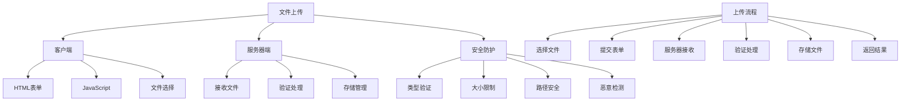

# 文件上传处理

## 🎯 学习目标
- 掌握PHP文件上传的基本原理和实现
- 理解文件上传的安全防护措施
- 学会文件类型验证和大小限制
- 了解文件上传的最佳实践

## 📚 核心概念

### 文件上传概述



### 文件上传配置

| 配置项 | 默认值 | 说明 | 建议值 |
|--------|--------|------|--------|
| file_uploads | On | 是否允许文件上传 | On |
| upload_max_filesize | 2M | 单个文件最大大小 | 10M |
| max_file_uploads | 20 | 同时上传文件数量 | 20 |
| post_max_size | 8M | POST数据最大大小 | 50M |
| max_execution_time | 30 | 脚本执行时间限制 | 300 |
| max_input_time | 60 | 输入解析时间限制 | 300 |
| memory_limit | 128M | 内存使用限制 | 256M |

## 🔧 基本文件上传

### HTML表单上传
```php
<?php
// 1. 基本HTML表单
function createUploadForm($action = '', $method = 'POST') {
    $html = '<form action="' . $action . '" method="' . $method . '" enctype="multipart/form-data">';
    $html .= '<input type="file" name="upload_file" accept=".jpg,.jpeg,.png,.gif,.pdf,.doc,.docx">';
    $html .= '<input type="submit" value="上传文件">';
    $html .= '</form>';
    
    return $html;
}

// 2. 多文件上传表单
function createMultiUploadForm($action = '', $method = 'POST') {
    $html = '<form action="' . $action . '" method="' . $method . '" enctype="multipart/form-data">';
    $html .= '<input type="file" name="upload_files[]" multiple accept=".jpg,.jpeg,.png,.gif">';
    $html .= '<input type="submit" value="上传多个文件">';
    $html .= '</form>';
    
    return $html;
}

// 3. 拖拽上传表单
function createDragDropForm($action = '', $method = 'POST') {
    $html = '<form action="' . $action . '" method="' . $method . '" enctype="multipart/form-data">';
    $html .= '<div id="drop-zone" style="border: 2px dashed #ccc; padding: 20px; text-align: center;">';
    $html .= '<p>拖拽文件到此处或点击选择文件</p>';
    $html .= '<input type="file" name="upload_file" id="file-input" style="display: none;">';
    $html .= '</div>';
    $html .= '<input type="submit" value="上传文件">';
    $html .= '</form>';
    
    // JavaScript代码
    $html .= '<script>';
    $html .= 'document.getElementById("drop-zone").addEventListener("click", function() {';
    $html .= 'document.getElementById("file-input").click();';
    $html .= '});';
    $html .= '</script>';
    
    return $html;
}

// 使用示例
echo "=== HTML表单上传示例 ===\n";
echo createUploadForm('upload.php') . "\n";
echo createMultiUploadForm('upload.php') . "\n";
echo createDragDropForm('upload.php') . "\n";
?>
```

### 服务器端处理
```php
<?php
// 1. 基本文件上传处理
function handleFileUpload($uploadDir = 'uploads/') {
    // 检查上传目录
    if (!is_dir($uploadDir)) {
        mkdir($uploadDir, 0755, true);
    }
    
    // 检查是否有文件上传
    if (!isset($_FILES['upload_file']) || $_FILES['upload_file']['error'] !== UPLOAD_ERR_OK) {
        throw new Exception('文件上传失败');
    }
    
    $file = $_FILES['upload_file'];
    
    // 基本验证
    if ($file['size'] === 0) {
        throw new Exception('文件为空');
    }
    
    // 生成唯一文件名
    $extension = pathinfo($file['name'], PATHINFO_EXTENSION);
    $filename = uniqid() . '.' . $extension;
    $filepath = $uploadDir . $filename;
    
    // 移动文件
    if (!move_uploaded_file($file['tmp_name'], $filepath)) {
        throw new Exception('文件保存失败');
    }
    
    return [
        'original_name' => $file['name'],
        'saved_name' => $filename,
        'file_path' => $filepath,
        'file_size' => $file['size'],
        'file_type' => $file['type']
    ];
}

// 2. 多文件上传处理
function handleMultiFileUpload($uploadDir = 'uploads/') {
    // 检查上传目录
    if (!is_dir($uploadDir)) {
        mkdir($uploadDir, 0755, true);
    }
    
    // 检查是否有文件上传
    if (!isset($_FILES['upload_files']) || !is_array($_FILES['upload_files']['name'])) {
        throw new Exception('没有文件上传');
    }
    
    $files = $_FILES['upload_files'];
    $results = [];
    
    for ($i = 0; $i < count($files['name']); $i++) {
        // 检查文件错误
        if ($files['error'][$i] !== UPLOAD_ERR_OK) {
            $results[] = [
                'name' => $files['name'][$i],
                'success' => false,
                'error' => '上传失败'
            ];
            continue;
        }
        
        // 基本验证
        if ($files['size'][$i] === 0) {
            $results[] = [
                'name' => $files['name'][$i],
                'success' => false,
                'error' => '文件为空'
            ];
            continue;
        }
        
        // 生成唯一文件名
        $extension = pathinfo($files['name'][$i], PATHINFO_EXTENSION);
        $filename = uniqid() . '.' . $extension;
        $filepath = $uploadDir . $filename;
        
        // 移动文件
        if (move_uploaded_file($files['tmp_name'][$i], $filepath)) {
            $results[] = [
                'name' => $files['name'][$i],
                'saved_name' => $filename,
                'file_path' => $filepath,
                'file_size' => $files['size'][$i],
                'success' => true
            ];
        } else {
            $results[] = [
                'name' => $files['name'][$i],
                'success' => false,
                'error' => '文件保存失败'
            ];
        }
    }
    
    return $results;
}

// 3. 安全文件上传处理
function handleSecureFileUpload($uploadDir = 'uploads/', $options = []) {
    $defaults = [
        'maxSize' => 10 * 1024 * 1024, // 10MB
        'allowedTypes' => ['jpg', 'jpeg', 'png', 'gif', 'pdf', 'doc', 'docx'],
        'allowedMimes' => ['image/jpeg', 'image/png', 'image/gif', 'application/pdf'],
        'scanForViruses' => false,
        'generateThumbnail' => false
    ];
    
    $options = array_merge($defaults, $options);
    
    // 检查上传目录
    if (!is_dir($uploadDir)) {
        mkdir($uploadDir, 0755, true);
    }
    
    // 检查是否有文件上传
    if (!isset($_FILES['upload_file']) || $_FILES['upload_file']['error'] !== UPLOAD_ERR_OK) {
        throw new Exception('文件上传失败');
    }
    
    $file = $_FILES['upload_file'];
    
    // 文件大小验证
    if ($file['size'] > $options['maxSize']) {
        throw new Exception('文件大小超过限制');
    }
    
    // 文件类型验证
    $extension = strtolower(pathinfo($file['name'], PATHINFO_EXTENSION));
    if (!in_array($extension, $options['allowedTypes'])) {
        throw new Exception('不允许的文件类型');
    }
    
    // MIME类型验证
    $finfo = finfo_open(FILEINFO_MIME_TYPE);
    $mimeType = finfo_file($finfo, $file['tmp_name']);
    finfo_close($finfo);
    
    if (!in_array($mimeType, $options['allowedMimes'])) {
        throw new Exception('不允许的MIME类型');
    }
    
    // 病毒扫描（模拟）
    if ($options['scanForViruses']) {
        if (scanFileForViruses($file['tmp_name'])) {
            throw new Exception('文件可能包含病毒');
        }
    }
    
    // 生成唯一文件名
    $filename = uniqid() . '.' . $extension;
    $filepath = $uploadDir . $filename;
    
    // 移动文件
    if (!move_uploaded_file($file['tmp_name'], $filepath)) {
        throw new Exception('文件保存失败');
    }
    
    $result = [
        'original_name' => $file['name'],
        'saved_name' => $filename,
        'file_path' => $filepath,
        'file_size' => $file['size'],
        'file_type' => $mimeType,
        'extension' => $extension
    ];
    
    // 生成缩略图
    if ($options['generateThumbnail'] && in_array($extension, ['jpg', 'jpeg', 'png', 'gif'])) {
        $thumbnailPath = generateThumbnail($filepath, $uploadDir);
        $result['thumbnail'] = $thumbnailPath;
    }
    
    return $result;
}

// 模拟病毒扫描
function scanFileForViruses($filePath) {
    // 这里应该调用实际的病毒扫描引擎
    // 现在只是模拟检查
    $content = file_get_contents($filePath);
    
    // 检查一些常见的恶意代码模式
    $maliciousPatterns = [
        '/eval\s*\(/i',
        '/base64_decode\s*\(/i',
        '/system\s*\(/i',
        '/exec\s*\(/i',
        '/shell_exec\s*\(/i'
    ];
    
    foreach ($maliciousPatterns as $pattern) {
        if (preg_match($pattern, $content)) {
            return true;
        }
    }
    
    return false;
}

// 生成缩略图
function generateThumbnail($imagePath, $uploadDir, $maxWidth = 200, $maxHeight = 200) {
    $extension = strtolower(pathinfo($imagePath, PATHINFO_EXTENSION));
    $thumbnailPath = $uploadDir . 'thumb_' . basename($imagePath);
    
    switch ($extension) {
        case 'jpg':
        case 'jpeg':
            $source = imagecreatefromjpeg($imagePath);
            break;
        case 'png':
            $source = imagecreatefrompng($imagePath);
            break;
        case 'gif':
            $source = imagecreatefromgif($imagePath);
            break;
        default:
            return false;
    }
    
    if (!$source) {
        return false;
    }
    
    $sourceWidth = imagesx($source);
    $sourceHeight = imagesy($source);
    
    // 计算缩略图尺寸
    $ratio = min($maxWidth / $sourceWidth, $maxHeight / $sourceHeight);
    $thumbWidth = $sourceWidth * $ratio;
    $thumbHeight = $sourceHeight * $ratio;
    
    // 创建缩略图
    $thumbnail = imagecreatetruecolor($thumbWidth, $thumbHeight);
    imagecopyresampled($thumbnail, $source, 0, 0, 0, 0, $thumbWidth, $thumbHeight, $sourceWidth, $sourceHeight);
    
    // 保存缩略图
    $result = false;
    switch ($extension) {
        case 'jpg':
        case 'jpeg':
            $result = imagejpeg($thumbnail, $thumbnailPath, 90);
            break;
        case 'png':
            $result = imagepng($thumbnail, $thumbnailPath);
            break;
        case 'gif':
            $result = imagegif($thumbnail, $thumbnailPath);
            break;
    }
    
    imagedestroy($source);
    imagedestroy($thumbnail);
    
    return $result ? $thumbnailPath : false;
}

// 使用示例
echo "=== 文件上传处理示例 ===\n";

try {
    // 创建上传目录
    $uploadDir = 'test_uploads/';
    if (!is_dir($uploadDir)) {
        mkdir($uploadDir, 0755, true);
    }
    
    // 模拟文件上传（实际使用中这些数据来自$_FILES）
    $_FILES['upload_file'] = [
        'name' => 'test.jpg',
        'type' => 'image/jpeg',
        'tmp_name' => '/tmp/phpXXXXXX',
        'error' => UPLOAD_ERR_OK,
        'size' => 1024
    ];
    
    // 创建临时文件用于测试
    $tempFile = tempnam(sys_get_temp_dir(), 'upload_test');
    file_put_contents($tempFile, 'test image content');
    $_FILES['upload_file']['tmp_name'] = $tempFile;
    
    // 安全文件上传处理
    $result = handleSecureFileUpload($uploadDir, [
        'maxSize' => 5 * 1024 * 1024, // 5MB
        'allowedTypes' => ['jpg', 'jpeg', 'png', 'gif'],
        'allowedMimes' => ['image/jpeg', 'image/png', 'image/gif'],
        'scanForViruses' => true,
        'generateThumbnail' => false
    ]);
    
    echo "文件上传成功:\n";
    foreach ($result as $key => $value) {
        echo "  $key: $value\n";
    }
    
    // 清理临时文件
    unlink($tempFile);
    
    // 清理测试目录
    if (is_dir($uploadDir)) {
        $files = glob($uploadDir . '*');
        foreach ($files as $file) {
            unlink($file);
        }
        rmdir($uploadDir);
    }
    
} catch (Exception $e) {
    echo "错误: " . $e->getMessage() . "\n";
}
?>
```

## 🔧 高级文件上传

### 文件上传类
```php
<?php
// 文件上传类
class FileUploader {
    private $uploadDir;
    private $options;
    private $errors;
    
    public function __construct($uploadDir = 'uploads/', $options = []) {
        $this->uploadDir = rtrim($uploadDir, '/') . '/';
        $this->options = array_merge([
            'maxSize' => 10 * 1024 * 1024, // 10MB
            'allowedTypes' => ['jpg', 'jpeg', 'png', 'gif', 'pdf', 'doc', 'docx'],
            'allowedMimes' => ['image/jpeg', 'image/png', 'image/gif', 'application/pdf'],
            'scanForViruses' => false,
            'generateThumbnail' => false,
            'thumbnailSize' => [200, 200],
            'createSubdirs' => true,
            'filenameGenerator' => 'uniqid'
        ], $options);
        
        $this->errors = [];
        $this->ensureUploadDir();
    }
    
    // 确保上传目录存在
    private function ensureUploadDir() {
        if (!is_dir($this->uploadDir)) {
            if (!mkdir($this->uploadDir, 0755, true)) {
                throw new Exception("无法创建上传目录: {$this->uploadDir}");
            }
        }
        
        if (!is_writable($this->uploadDir)) {
            throw new Exception("上传目录不可写: {$this->uploadDir}");
        }
    }
    
    // 上传单个文件
    public function upload($fileInput, $customName = null) {
        if (!isset($_FILES[$fileInput])) {
            $this->errors[] = "文件输入不存在: $fileInput";
            return false;
        }
        
        $file = $_FILES[$fileInput];
        
        if ($file['error'] !== UPLOAD_ERR_OK) {
            $this->errors[] = $this->getUploadErrorMessage($file['error']);
            return false;
        }
        
        return $this->processFile($file, $customName);
    }
    
    // 上传多个文件
    public function uploadMultiple($fileInput, $customNames = []) {
        if (!isset($_FILES[$fileInput])) {
            $this->errors[] = "文件输入不存在: $fileInput";
            return false;
        }
        
        $files = $_FILES[$fileInput];
        $results = [];
        
        if (!is_array($files['name'])) {
            // 单个文件
            $result = $this->upload($fileInput, $customNames[0] ?? null);
            return $result ? [$result] : false;
        }
        
        // 多个文件
        for ($i = 0; $i < count($files['name']); $i++) {
            $file = [
                'name' => $files['name'][$i],
                'type' => $files['type'][$i],
                'tmp_name' => $files['tmp_name'][$i],
                'error' => $files['error'][$i],
                'size' => $files['size'][$i]
            ];
            
            $customName = $customNames[$i] ?? null;
            $result = $this->processFile($file, $customName);
            
            if ($result) {
                $results[] = $result;
            }
        }
        
        return $results;
    }
    
    // 处理文件
    private function processFile($file, $customName = null) {
        // 验证文件
        if (!$this->validateFile($file)) {
            return false;
        }
        
        // 生成文件名
        $filename = $this->generateFilename($file, $customName);
        
        // 确定存储路径
        $filepath = $this->getFilePath($filename);
        
        // 移动文件
        if (!move_uploaded_file($file['tmp_name'], $filepath)) {
            $this->errors[] = "文件移动失败: {$file['name']}";
            return false;
        }
        
        // 生成缩略图
        $thumbnailPath = null;
        if ($this->options['generateThumbnail'] && $this->isImage($file)) {
            $thumbnailPath = $this->generateThumbnail($filepath);
        }
        
        return [
            'original_name' => $file['name'],
            'saved_name' => $filename,
            'file_path' => $filepath,
            'file_size' => $file['size'],
            'file_type' => $file['type'],
            'mime_type' => $this->getMimeType($filepath),
            'extension' => $this->getExtension($file['name']),
            'thumbnail' => $thumbnailPath,
            'upload_time' => time()
        ];
    }
    
    // 验证文件
    private function validateFile($file) {
        // 检查文件大小
        if ($file['size'] > $this->options['maxSize']) {
            $this->errors[] = "文件大小超过限制: {$file['name']}";
            return false;
        }
        
        // 检查文件类型
        $extension = $this->getExtension($file['name']);
        if (!in_array($extension, $this->options['allowedTypes'])) {
            $this->errors[] = "不允许的文件类型: {$file['name']}";
            return false;
        }
        
        // 检查MIME类型
        $mimeType = $this->getMimeType($file['tmp_name']);
        if (!in_array($mimeType, $this->options['allowedMimes'])) {
            $this->errors[] = "不允许的MIME类型: {$file['name']}";
            return false;
        }
        
        // 病毒扫描
        if ($this->options['scanForViruses'] && $this->scanForViruses($file['tmp_name'])) {
            $this->errors[] = "文件可能包含病毒: {$file['name']}";
            return false;
        }
        
        return true;
    }
    
    // 生成文件名
    private function generateFilename($file, $customName = null) {
        if ($customName) {
            $extension = $this->getExtension($file['name']);
            return $customName . '.' . $extension;
        }
        
        $extension = $this->getExtension($file['name']);
        
        switch ($this->options['filenameGenerator']) {
            case 'uniqid':
                return uniqid() . '.' . $extension;
            case 'timestamp':
                return time() . '.' . $extension;
            case 'hash':
                return md5($file['name'] . time()) . '.' . $extension;
            default:
                return uniqid() . '.' . $extension;
        }
    }
    
    // 获取文件路径
    private function getFilePath($filename) {
        if ($this->options['createSubdirs']) {
            $date = date('Y/m/d');
            $subdir = $this->uploadDir . $date . '/';
            
            if (!is_dir($subdir)) {
                mkdir($subdir, 0755, true);
            }
            
            return $subdir . $filename;
        }
        
        return $this->uploadDir . $filename;
    }
    
    // 获取文件扩展名
    private function getExtension($filename) {
        return strtolower(pathinfo($filename, PATHINFO_EXTENSION));
    }
    
    // 获取MIME类型
    private function getMimeType($filepath) {
        $finfo = finfo_open(FILEINFO_MIME_TYPE);
        $mimeType = finfo_file($finfo, $filepath);
        finfo_close($finfo);
        
        return $mimeType;
    }
    
    // 检查是否为图片
    private function isImage($file) {
        $imageTypes = ['image/jpeg', 'image/png', 'image/gif', 'image/webp'];
        return in_array($file['type'], $imageTypes);
    }
    
    // 生成缩略图
    private function generateThumbnail($imagePath) {
        $extension = $this->getExtension($imagePath);
        
        if (!in_array($extension, ['jpg', 'jpeg', 'png', 'gif'])) {
            return null;
        }
        
        $thumbnailPath = dirname($imagePath) . '/thumb_' . basename($imagePath);
        $maxWidth = $this->options['thumbnailSize'][0];
        $maxHeight = $this->options['thumbnailSize'][1];
        
        return $this->createThumbnail($imagePath, $thumbnailPath, $maxWidth, $maxHeight);
    }
    
    // 创建缩略图
    private function createThumbnail($sourcePath, $thumbnailPath, $maxWidth, $maxHeight) {
        $extension = $this->getExtension($sourcePath);
        
        switch ($extension) {
            case 'jpg':
            case 'jpeg':
                $source = imagecreatefromjpeg($sourcePath);
                break;
            case 'png':
                $source = imagecreatefrompng($sourcePath);
                break;
            case 'gif':
                $source = imagecreatefromgif($sourcePath);
                break;
            default:
                return null;
        }
        
        if (!$source) {
            return null;
        }
        
        $sourceWidth = imagesx($source);
        $sourceHeight = imagesy($source);
        
        // 计算缩略图尺寸
        $ratio = min($maxWidth / $sourceWidth, $maxHeight / $sourceHeight);
        $thumbWidth = $sourceWidth * $ratio;
        $thumbHeight = $sourceHeight * $ratio;
        
        // 创建缩略图
        $thumbnail = imagecreatetruecolor($thumbWidth, $thumbHeight);
        imagecopyresampled($thumbnail, $source, 0, 0, 0, 0, $thumbWidth, $thumbHeight, $sourceWidth, $sourceHeight);
        
        // 保存缩略图
        $result = false;
        switch ($extension) {
            case 'jpg':
            case 'jpeg':
                $result = imagejpeg($thumbnail, $thumbnailPath, 90);
                break;
            case 'png':
                $result = imagepng($thumbnail, $thumbnailPath);
                break;
            case 'gif':
                $result = imagegif($thumbnail, $thumbnailPath);
                break;
        }
        
        imagedestroy($source);
        imagedestroy($thumbnail);
        
        return $result ? $thumbnailPath : null;
    }
    
    // 病毒扫描
    private function scanForViruses($filePath) {
        $content = file_get_contents($filePath);
        
        $maliciousPatterns = [
            '/eval\s*\(/i',
            '/base64_decode\s*\(/i',
            '/system\s*\(/i',
            '/exec\s*\(/i',
            '/shell_exec\s*\(/i'
        ];
        
        foreach ($maliciousPatterns as $pattern) {
            if (preg_match($pattern, $content)) {
                return true;
            }
        }
        
        return false;
    }
    
    // 获取上传错误信息
    private function getUploadErrorMessage($errorCode) {
        switch ($errorCode) {
            case UPLOAD_ERR_INI_SIZE:
                return '文件大小超过php.ini限制';
            case UPLOAD_ERR_FORM_SIZE:
                return '文件大小超过表单限制';
            case UPLOAD_ERR_PARTIAL:
                return '文件只有部分被上传';
            case UPLOAD_ERR_NO_FILE:
                return '没有文件被上传';
            case UPLOAD_ERR_NO_TMP_DIR:
                return '找不到临时文件夹';
            case UPLOAD_ERR_CANT_WRITE:
                return '文件写入失败';
            case UPLOAD_ERR_EXTENSION:
                return '文件上传被扩展阻止';
            default:
                return '未知上传错误';
        }
    }
    
    // 获取错误信息
    public function getErrors() {
        return $this->errors;
    }
    
    // 清除错误
    public function clearErrors() {
        $this->errors = [];
    }
}

// 使用示例
echo "=== 文件上传类示例 ===\n";

try {
    // 创建文件上传器
    $uploader = new FileUploader('test_uploads/', [
        'maxSize' => 5 * 1024 * 1024, // 5MB
        'allowedTypes' => ['jpg', 'jpeg', 'png', 'gif', 'pdf'],
        'allowedMimes' => ['image/jpeg', 'image/png', 'image/gif', 'application/pdf'],
        'scanForViruses' => true,
        'generateThumbnail' => true,
        'createSubdirs' => true
    ]);
    
    // 模拟文件上传
    $_FILES['test_file'] = [
        'name' => 'test.jpg',
        'type' => 'image/jpeg',
        'tmp_name' => tempnam(sys_get_temp_dir(), 'upload_test'),
        'error' => UPLOAD_ERR_OK,
        'size' => 1024
    ];
    
    // 创建临时文件
    file_put_contents($_FILES['test_file']['tmp_name'], 'test image content');
    
    // 上传文件
    $result = $uploader->upload('test_file', 'custom_name');
    
    if ($result) {
        echo "文件上传成功:\n";
        foreach ($result as $key => $value) {
            echo "  $key: $value\n";
        }
    } else {
        echo "文件上传失败:\n";
        foreach ($uploader->getErrors() as $error) {
            echo "  错误: $error\n";
        }
    }
    
    // 清理临时文件
    unlink($_FILES['test_file']['tmp_name']);
    
    // 清理测试目录
    if (is_dir('test_uploads/')) {
        $files = glob('test_uploads/**/*');
        foreach ($files as $file) {
            if (is_file($file)) {
                unlink($file);
            }
        }
        rmdir('test_uploads/');
    }
    
} catch (Exception $e) {
    echo "错误: " . $e->getMessage() . "\n";
}
?>
```

## 🎯 实际应用

### 文件上传安全防护
```php
<?php
// 文件上传安全防护类
class UploadSecurity {
    private $blacklist;
    private $whitelist;
    
    public function __construct() {
        $this->blacklist = [
            'php', 'php3', 'php4', 'php5', 'phtml', 'pht',
            'jsp', 'asp', 'aspx', 'exe', 'bat', 'cmd', 'com',
            'scr', 'vbs', 'js', 'jar', 'war', 'sh', 'pl', 'py'
        ];
        
        $this->whitelist = [
            'jpg', 'jpeg', 'png', 'gif', 'webp', 'bmp',
            'pdf', 'doc', 'docx', 'xls', 'xlsx', 'ppt', 'pptx',
            'txt', 'rtf', 'zip', 'rar', '7z'
        ];
    }
    
    // 检查文件扩展名
    public function checkExtension($filename) {
        $extension = strtolower(pathinfo($filename, PATHINFO_EXTENSION));
        
        // 检查黑名单
        if (in_array($extension, $this->blacklist)) {
            return false;
        }
        
        // 检查白名单
        if (!in_array($extension, $this->whitelist)) {
            return false;
        }
        
        return true;
    }
    
    // 检查文件内容
    public function checkContent($filePath) {
        $content = file_get_contents($filePath);
        
        // 检查PHP标签
        if (preg_match('/<\?php/i', $content)) {
            return false;
        }
        
        // 检查脚本标签
        if (preg_match('/<script/i', $content)) {
            return false;
        }
        
        // 检查危险函数
        $dangerousFunctions = [
            'eval', 'exec', 'system', 'shell_exec', 'passthru',
            'file_get_contents', 'file_put_contents', 'fopen', 'fwrite'
        ];
        
        foreach ($dangerousFunctions as $function) {
            if (preg_match('/\b' . $function . '\s*\(/i', $content)) {
                return false;
            }
        }
        
        return true;
    }
    
    // 检查文件头
    public function checkFileHeader($filePath) {
        $handle = fopen($filePath, 'rb');
        if (!$handle) {
            return false;
        }
        
        $header = fread($handle, 8);
        fclose($handle);
        
        // 检查文件头签名
        $signatures = [
            'JPEG' => "\xFF\xD8\xFF",
            'PNG' => "\x89\x50\x4E\x47",
            'GIF' => "GIF8",
            'PDF' => "%PDF",
            'ZIP' => "PK\x03\x04"
        ];
        
        foreach ($signatures as $type => $signature) {
            if (substr($header, 0, strlen($signature)) === $signature) {
                return true;
            }
        }
        
        return false;
    }
    
    // 综合安全检查
    public function comprehensiveCheck($file) {
        $results = [
            'extension' => $this->checkExtension($file['name']),
            'content' => $this->checkContent($file['tmp_name']),
            'header' => $this->checkFileHeader($file['tmp_name'])
        ];
        
        return $results;
    }
}

// 使用示例
echo "=== 文件上传安全防护示例 ===\n";

try {
    $security = new UploadSecurity();
    
    // 模拟安全文件
    $safeFile = [
        'name' => 'image.jpg',
        'tmp_name' => tempnam(sys_get_temp_dir(), 'safe_test')
    ];
    file_put_contents($safeFile['tmp_name'], "\xFF\xD8\xFF\xE0\x00\x10JFIF"); // JPEG header
    
    // 模拟危险文件
    $dangerousFile = [
        'name' => 'script.php',
        'tmp_name' => tempnam(sys_get_temp_dir(), 'dangerous_test')
    ];
    file_put_contents($dangerousFile['tmp_name'], '<?php system($_GET["cmd"]); ?>');
    
    // 检查安全文件
    $safeResults = $security->comprehensiveCheck($safeFile);
    echo "安全文件检查结果:\n";
    foreach ($safeResults as $check => $result) {
        echo "  $check: " . ($result ? "通过" : "失败") . "\n";
    }
    
    // 检查危险文件
    $dangerousResults = $security->comprehensiveCheck($dangerousFile);
    echo "\n危险文件检查结果:\n";
    foreach ($dangerousResults as $check => $result) {
        echo "  $check: " . ($result ? "通过" : "失败") . "\n";
    }
    
    // 清理临时文件
    unlink($safeFile['tmp_name']);
    unlink($dangerousFile['tmp_name']);
    
} catch (Exception $e) {
    echo "错误: " . $e->getMessage() . "\n";
}
?>
```

## 📊 最佳实践

### 文件上传最佳实践
```php
<?php
// 文件上传最佳实践

// 1. 配置检查
function checkUploadConfiguration() {
    $config = [
        'file_uploads' => ini_get('file_uploads'),
        'upload_max_filesize' => ini_get('upload_max_filesize'),
        'max_file_uploads' => ini_get('max_file_uploads'),
        'post_max_size' => ini_get('post_max_size'),
        'max_execution_time' => ini_get('max_execution_time'),
        'memory_limit' => ini_get('memory_limit')
    ];
    
    echo "PHP上传配置:\n";
    foreach ($config as $key => $value) {
        echo "  $key: $value\n";
    }
    
    return $config;
}

// 2. 上传进度监控
function monitorUploadProgress($uploadId) {
    if (function_exists('uploadprogress_get_info')) {
        $info = uploadprogress_get_info($uploadId);
        if ($info) {
            return [
                'bytes_uploaded' => $info['bytes_uploaded'],
                'bytes_total' => $info['bytes_total'],
                'speed_average' => $info['speed_average'],
                'eta' => $info['eta_sec']
            ];
        }
    }
    
    return null;
}

// 3. 分片上传
function handleChunkedUpload($chunkData, $chunkIndex, $totalChunks, $filename) {
    $uploadDir = 'uploads/chunks/';
    if (!is_dir($uploadDir)) {
        mkdir($uploadDir, 0755, true);
    }
    
    $chunkPath = $uploadDir . $filename . '.chunk.' . $chunkIndex;
    
    if (file_put_contents($chunkPath, $chunkData) === false) {
        return false;
    }
    
    // 检查是否所有分片都已上传
    $uploadedChunks = 0;
    for ($i = 0; $i < $totalChunks; $i++) {
        if (file_exists($uploadDir . $filename . '.chunk.' . $i)) {
            $uploadedChunks++;
        }
    }
    
    if ($uploadedChunks === $totalChunks) {
        // 合并分片
        return mergeChunks($uploadDir, $filename, $totalChunks);
    }
    
    return true;
}

// 4. 合并分片
function mergeChunks($uploadDir, $filename, $totalChunks) {
    $finalPath = 'uploads/' . $filename;
    
    $handle = fopen($finalPath, 'wb');
    if (!$handle) {
        return false;
    }
    
    for ($i = 0; $i < $totalChunks; $i++) {
        $chunkPath = $uploadDir . $filename . '.chunk.' . $i;
        if (file_exists($chunkPath)) {
            $chunkData = file_get_contents($chunkPath);
            fwrite($handle, $chunkData);
            unlink($chunkPath);
        }
    }
    
    fclose($handle);
    
    // 清理分片目录
    rmdir($uploadDir);
    
    return $finalPath;
}

// 使用示例
echo "=== 文件上传最佳实践示例 ===\n";

// 检查配置
$config = checkUploadConfiguration();

// 模拟分片上传
$testData = str_repeat('A', 1024); // 1KB测试数据
$filename = 'test_file.txt';
$totalChunks = 3;

for ($i = 0; $i < $totalChunks; $i++) {
    $result = handleChunkedUpload($testData, $i, $totalChunks, $filename);
    echo "分片 $i 上传: " . ($result ? "成功" : "失败") . "\n";
}

// 清理测试文件
if (file_exists('uploads/' . $filename)) {
    unlink('uploads/' . $filename);
    echo "测试文件已清理\n";
}
?>
```

## 🎓 学习建议

### 费曼学习法应用
1. **选择概念**: 选择文件上传中的核心概念
2. **简化解释**: 用简单语言解释文件上传的流程
3. **识别盲点**: 发现理解不深入的地方
4. **重新学习**: 针对盲点进行深入学习

### 刻意练习重点
1. **概念理解**: 深入理解文件上传的基本概念
2. **实际应用**: 在实际项目中应用文件上传
3. **安全防护**: 掌握文件上传的安全防护措施
4. **最佳实践**: 学习文件上传的最佳实践

## 🔗 相关链接
- [[01-文件读写操作|文件读写操作]]
- [[02-目录操作|目录操作]]
- [[04-文件下载实现|文件下载实现]]
- [[05-文件权限管理|文件权限管理]]
- [[06-文件操作安全|文件操作安全]]
