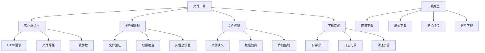

# 文件下载实现

## 🎯 学习目标
- 掌握PHP文件下载的基本实现方法
- 理解文件下载的安全防护措施
- 学会断点续传和分片下载技术
- 了解文件下载的最佳实践

## 📚 核心概念

### 文件下载概述



### 文件下载方式对比

| 下载方式 | 特点 | 适用场景 | 优缺点 |
|----------|------|----------|--------|
| 直接下载 | 简单直接 | 小文件 | 优点：实现简单<br>缺点：内存占用大 |
| 流式下载 | 边读边输出 | 大文件 | 优点：内存占用小<br>缺点：实现复杂 |
| 断点续传 | 支持断点 | 大文件下载 | 优点：用户体验好<br>缺点：实现复杂 |
| 分片下载 | 多线程下载 | 大文件 | 优点：下载速度快<br>缺点：服务器压力大 |

## 🔧 基本文件下载

### 直接文件下载
```php
<?php
// 1. 基本文件下载
function downloadFile($filePath, $downloadName = null) {
    // 检查文件是否存在
    if (!file_exists($filePath)) {
        throw new Exception("文件不存在: $filePath");
    }
    
    // 检查文件是否可读
    if (!is_readable($filePath)) {
        throw new Exception("文件不可读: $filePath");
    }
    
    // 设置下载文件名
    $filename = $downloadName ?: basename($filePath);
    
    // 设置HTTP头信息
    header('Content-Type: application/octet-stream');
    header('Content-Disposition: attachment; filename="' . $filename . '"');
    header('Content-Length: ' . filesize($filePath));
    header('Cache-Control: no-cache, must-revalidate');
    header('Pragma: no-cache');
    
    // 输出文件内容
    readfile($filePath);
    exit;
}

// 2. 安全文件下载
function secureDownloadFile($filePath, $downloadName = null, $options = []) {
    $defaults = [
        'allowedExtensions' => ['pdf', 'doc', 'docx', 'xls', 'xlsx', 'txt'],
        'maxSize' => 100 * 1024 * 1024, // 100MB
        'requireAuth' => false,
        'logDownload' => true
    ];
    
    $options = array_merge($defaults, $options);
    
    // 检查文件是否存在
    if (!file_exists($filePath)) {
        throw new Exception("文件不存在: $filePath");
    }
    
    // 检查文件扩展名
    $extension = strtolower(pathinfo($filePath, PATHINFO_EXTENSION));
    if (!in_array($extension, $options['allowedExtensions'])) {
        throw new Exception("不允许的文件类型: $extension");
    }
    
    // 检查文件大小
    if (filesize($filePath) > $options['maxSize']) {
        throw new Exception("文件大小超过限制");
    }
    
    // 权限检查
    if ($options['requireAuth'] && !isUserAuthenticated()) {
        throw new Exception("需要身份验证");
    }
    
    // 记录下载日志
    if ($options['logDownload']) {
        logDownload($filePath, $downloadName);
    }
    
    // 执行下载
    downloadFile($filePath, $downloadName);
}

// 3. 模拟用户身份验证
function isUserAuthenticated() {
    // 这里应该实现实际的用户身份验证逻辑
    return isset($_SESSION['user_id']) && !empty($_SESSION['user_id']);
}

// 4. 记录下载日志
function logDownload($filePath, $downloadName) {
    $logData = [
        'timestamp' => date('Y-m-d H:i:s'),
        'file_path' => $filePath,
        'download_name' => $downloadName,
        'user_ip' => $_SERVER['REMOTE_ADDR'],
        'user_agent' => $_SERVER['HTTP_USER_AGENT']
    ];
    
    $logFile = 'downloads.log';
    $logEntry = json_encode($logData) . "\n";
    file_put_contents($logFile, $logEntry, FILE_APPEND | LOCK_EX);
}

// 使用示例
echo "=== 基本文件下载示例 ===\n";

try {
    // 创建测试文件
    $testFile = 'test_download.txt';
    file_put_contents($testFile, '这是一个测试下载文件的内容。');
    
    // 基本文件下载
    // downloadFile($testFile, 'custom_name.txt');
    
    // 安全文件下载
    // secureDownloadFile($testFile, 'secure_download.txt', [
    //     'allowedExtensions' => ['txt', 'pdf'],
    //     'maxSize' => 1024 * 1024, // 1MB
    //     'requireAuth' => false,
    //     'logDownload' => true
    // ]);
    
    echo "文件下载功能已准备就绪\n";
    
    // 清理测试文件
    unlink($testFile);
    
} catch (Exception $e) {
    echo "错误: " . $e->getMessage() . "\n";
}
?>
```

### 流式文件下载
```php
<?php
// 1. 流式文件下载
function streamDownloadFile($filePath, $downloadName = null, $chunkSize = 8192) {
    // 检查文件是否存在
    if (!file_exists($filePath)) {
        throw new Exception("文件不存在: $filePath");
    }
    
    // 设置下载文件名
    $filename = $downloadName ?: basename($filePath);
    $fileSize = filesize($filePath);
    
    // 设置HTTP头信息
    header('Content-Type: application/octet-stream');
    header('Content-Disposition: attachment; filename="' . $filename . '"');
    header('Content-Length: ' . $fileSize);
    header('Accept-Ranges: bytes');
    header('Cache-Control: no-cache, must-revalidate');
    header('Pragma: no-cache');
    
    // 打开文件
    $handle = fopen($filePath, 'rb');
    if (!$handle) {
        throw new Exception("无法打开文件: $filePath");
    }
    
    // 流式输出文件内容
    while (!feof($handle)) {
        $chunk = fread($handle, $chunkSize);
        if ($chunk === false) {
            break;
        }
        
        echo $chunk;
        flush();
        
        // 检查连接状态
        if (connection_aborted()) {
            break;
        }
    }
    
    fclose($handle);
    exit;
}

// 2. 带进度显示的文件下载
function downloadFileWithProgress($filePath, $downloadName = null, $chunkSize = 8192) {
    // 检查文件是否存在
    if (!file_exists($filePath)) {
        throw new Exception("文件不存在: $filePath");
    }
    
    // 设置下载文件名
    $filename = $downloadName ?: basename($filePath);
    $fileSize = filesize($filePath);
    
    // 设置HTTP头信息
    header('Content-Type: application/octet-stream');
    header('Content-Disposition: attachment; filename="' . $filename . '"');
    header('Content-Length: ' . $fileSize);
    header('Accept-Ranges: bytes');
    
    // 打开文件
    $handle = fopen($filePath, 'rb');
    if (!$handle) {
        throw new Exception("无法打开文件: $filePath");
    }
    
    $bytesRead = 0;
    $startTime = microtime(true);
    
    // 流式输出文件内容
    while (!feof($handle)) {
        $chunk = fread($handle, $chunkSize);
        if ($chunk === false) {
            break;
        }
        
        echo $chunk;
        flush();
        
        $bytesRead += strlen($chunk);
        
        // 计算下载速度
        $elapsedTime = microtime(true) - $startTime;
        if ($elapsedTime > 0) {
            $speed = $bytesRead / $elapsedTime; // bytes per second
            $progress = ($bytesRead / $fileSize) * 100;
            
            // 记录进度（实际应用中可以通过AJAX显示）
            error_log("下载进度: " . round($progress, 2) . "%, 速度: " . round($speed / 1024, 2) . " KB/s");
        }
        
        // 检查连接状态
        if (connection_aborted()) {
            break;
        }
    }
    
    fclose($handle);
    exit;
}

// 3. 内存优化的文件下载
function memoryOptimizedDownload($filePath, $downloadName = null, $chunkSize = 8192) {
    // 检查文件是否存在
    if (!file_exists($filePath)) {
        throw new Exception("文件不存在: $filePath");
    }
    
    // 设置下载文件名
    $filename = $downloadName ?: basename($filePath);
    $fileSize = filesize($filePath);
    
    // 设置HTTP头信息
    header('Content-Type: application/octet-stream');
    header('Content-Disposition: attachment; filename="' . $filename . '"');
    header('Content-Length: ' . $fileSize);
    header('Accept-Ranges: bytes');
    
    // 打开文件
    $handle = fopen($filePath, 'rb');
    if (!$handle) {
        throw new Exception("无法打开文件: $filePath");
    }
    
    // 流式输出文件内容
    while (!feof($handle)) {
        $chunk = fread($handle, $chunkSize);
        if ($chunk === false) {
            break;
        }
        
        echo $chunk;
        flush();
        
        // 释放内存
        unset($chunk);
        
        // 检查连接状态
        if (connection_aborted()) {
            break;
        }
    }
    
    fclose($handle);
    exit;
}

// 使用示例
echo "=== 流式文件下载示例 ===\n";

try {
    // 创建测试文件
    $testFile = 'test_stream_download.txt';
    $content = str_repeat('A', 1024 * 1024); // 1MB测试数据
    file_put_contents($testFile, $content);
    
    echo "测试文件已创建: $testFile\n";
    echo "文件大小: " . filesize($testFile) . " bytes\n";
    
    // 流式文件下载
    // streamDownloadFile($testFile, 'stream_download.txt');
    
    // 带进度显示的文件下载
    // downloadFileWithProgress($testFile, 'progress_download.txt');
    
    // 内存优化的文件下载
    // memoryOptimizedDownload($testFile, 'optimized_download.txt');
    
    echo "流式下载功能已准备就绪\n";
    
    // 清理测试文件
    unlink($testFile);
    
} catch (Exception $e) {
    echo "错误: " . $e->getMessage() . "\n";
}
?>
```

## 🔧 高级文件下载

### 断点续传下载
```php
<?php
// 1. 断点续传下载
function resumeDownloadFile($filePath, $downloadName = null, $chunkSize = 8192) {
    // 检查文件是否存在
    if (!file_exists($filePath)) {
        throw new Exception("文件不存在: $filePath");
    }
    
    // 设置下载文件名
    $filename = $downloadName ?: basename($filePath);
    $fileSize = filesize($filePath);
    
    // 获取Range头信息
    $range = isset($_SERVER['HTTP_RANGE']) ? $_SERVER['HTTP_RANGE'] : null;
    
    if ($range) {
        // 解析Range头
        $ranges = explode('=', $range);
        if (count($ranges) < 2) {
            throw new Exception("无效的Range头");
        }
        
        $ranges = explode('-', $ranges[1]);
        $start = intval($ranges[0]);
        $end = isset($ranges[1]) && !empty($ranges[1]) ? intval($ranges[1]) : $fileSize - 1;
        
        // 验证范围
        if ($start >= $fileSize || $end >= $fileSize || $start > $end) {
            throw new Exception("无效的文件范围");
        }
        
        $contentLength = $end - $start + 1;
        
        // 设置206 Partial Content头
        header('HTTP/1.1 206 Partial Content');
        header('Content-Type: application/octet-stream');
        header('Content-Disposition: attachment; filename="' . $filename . '"');
        header('Content-Length: ' . $contentLength);
        header('Content-Range: bytes ' . $start . '-' . $end . '/' . $fileSize);
        header('Accept-Ranges: bytes');
        
        // 打开文件并定位到起始位置
        $handle = fopen($filePath, 'rb');
        if (!$handle) {
            throw new Exception("无法打开文件: $filePath");
        }
        
        fseek($handle, $start);
        
        // 输出指定范围的内容
        $bytesToRead = $contentLength;
        while ($bytesToRead > 0 && !feof($handle)) {
            $readSize = min($chunkSize, $bytesToRead);
            $chunk = fread($handle, $readSize);
            
            if ($chunk === false) {
                break;
            }
            
            echo $chunk;
            flush();
            
            $bytesToRead -= strlen($chunk);
            
            // 检查连接状态
            if (connection_aborted()) {
                break;
            }
        }
        
        fclose($handle);
    } else {
        // 完整文件下载
        header('Content-Type: application/octet-stream');
        header('Content-Disposition: attachment; filename="' . $filename . '"');
        header('Content-Length: ' . $fileSize);
        header('Accept-Ranges: bytes');
        
        $handle = fopen($filePath, 'rb');
        if (!$handle) {
            throw new Exception("无法打开文件: $filePath");
        }
        
        while (!feof($handle)) {
            $chunk = fread($handle, $chunkSize);
            if ($chunk === false) {
                break;
            }
            
            echo $chunk;
            flush();
            
            // 检查连接状态
            if (connection_aborted()) {
                break;
            }
        }
        
        fclose($handle);
    }
    
    exit;
}

// 2. 智能断点续传
function smartResumeDownload($filePath, $downloadName = null, $chunkSize = 8192) {
    // 检查文件是否存在
    if (!file_exists($filePath)) {
        throw new Exception("文件不存在: $filePath");
    }
    
    // 设置下载文件名
    $filename = $downloadName ?: basename($filePath);
    $fileSize = filesize($filePath);
    
    // 获取客户端信息
    $userAgent = $_SERVER['HTTP_USER_AGENT'] ?? '';
    $acceptRanges = strpos($userAgent, 'MSIE') === false; // IE不支持断点续传
    
    // 获取Range头信息
    $range = isset($_SERVER['HTTP_RANGE']) ? $_SERVER['HTTP_RANGE'] : null;
    
    if ($range && $acceptRanges) {
        // 解析Range头
        $ranges = explode('=', $range);
        if (count($ranges) < 2) {
            throw new Exception("无效的Range头");
        }
        
        $ranges = explode('-', $ranges[1]);
        $start = intval($ranges[0]);
        $end = isset($ranges[1]) && !empty($ranges[1]) ? intval($ranges[1]) : $fileSize - 1;
        
        // 验证范围
        if ($start >= $fileSize || $end >= $fileSize || $start > $end) {
            throw new Exception("无效的文件范围");
        }
        
        $contentLength = $end - $start + 1;
        
        // 设置206 Partial Content头
        header('HTTP/1.1 206 Partial Content');
        header('Content-Type: application/octet-stream');
        header('Content-Disposition: attachment; filename="' . $filename . '"');
        header('Content-Length: ' . $contentLength);
        header('Content-Range: bytes ' . $start . '-' . $end . '/' . $fileSize);
        header('Accept-Ranges: bytes');
        header('Cache-Control: no-cache');
        
        // 打开文件并定位到起始位置
        $handle = fopen($filePath, 'rb');
        if (!$handle) {
            throw new Exception("无法打开文件: $filePath");
        }
        
        fseek($handle, $start);
        
        // 输出指定范围的内容
        $bytesToRead = $contentLength;
        while ($bytesToRead > 0 && !feof($handle)) {
            $readSize = min($chunkSize, $bytesToRead);
            $chunk = fread($handle, $readSize);
            
            if ($chunk === false) {
                break;
            }
            
            echo $chunk;
            flush();
            
            $bytesToRead -= strlen($chunk);
            
            // 检查连接状态
            if (connection_aborted()) {
                break;
            }
        }
        
        fclose($handle);
    } else {
        // 完整文件下载
        header('Content-Type: application/octet-stream');
        header('Content-Disposition: attachment; filename="' . $filename . '"');
        header('Content-Length: ' . $fileSize);
        header('Accept-Ranges: bytes');
        header('Cache-Control: no-cache');
        
        $handle = fopen($filePath, 'rb');
        if (!$handle) {
            throw new Exception("无法打开文件: $filePath");
        }
        
        while (!feof($handle)) {
            $chunk = fread($handle, $chunkSize);
            if ($chunk === false) {
                break;
            }
            
            echo $chunk;
            flush();
            
            // 检查连接状态
            if (connection_aborted()) {
                break;
            }
        }
        
        fclose($handle);
    }
    
    exit;
}

// 使用示例
echo "=== 断点续传下载示例 ===\n";

try {
    // 创建测试文件
    $testFile = 'test_resume_download.txt';
    $content = str_repeat('ABCDEFGHIJKLMNOPQRSTUVWXYZ', 1000); // 26KB测试数据
    file_put_contents($testFile, $content);
    
    echo "测试文件已创建: $testFile\n";
    echo "文件大小: " . filesize($testFile) . " bytes\n";
    
    // 断点续传下载
    // resumeDownloadFile($testFile, 'resume_download.txt');
    
    // 智能断点续传
    // smartResumeDownload($testFile, 'smart_resume_download.txt');
    
    echo "断点续传下载功能已准备就绪\n";
    
    // 清理测试文件
    unlink($testFile);
    
} catch (Exception $e) {
    echo "错误: " . $e->getMessage() . "\n";
}
?>
```

### 文件下载管理器
```php
<?php
// 文件下载管理器类
class DownloadManager {
    private $downloadDir;
    private $tempDir;
    private $options;
    private $downloads;
    
    public function __construct($downloadDir = 'downloads/', $options = []) {
        $this->downloadDir = rtrim($downloadDir, '/') . '/';
        $this->tempDir = $this->downloadDir . 'temp/';
        $this->options = array_merge([
            'maxConcurrentDownloads' => 10,
            'chunkSize' => 8192,
            'enableResume' => true,
            'logDownloads' => true,
            'cleanupTempFiles' => true
        ], $options);
        
        $this->downloads = [];
        $this->ensureDirectories();
    }
    
    // 确保目录存在
    private function ensureDirectories() {
        if (!is_dir($this->downloadDir)) {
            mkdir($this->downloadDir, 0755, true);
        }
        
        if (!is_dir($this->tempDir)) {
            mkdir($this->tempDir, 0755, true);
        }
    }
    
    // 添加下载任务
    public function addDownload($filePath, $downloadName = null, $options = []) {
        if (!file_exists($filePath)) {
            throw new Exception("文件不存在: $filePath");
        }
        
        $downloadId = uniqid('download_');
        $filename = $downloadName ?: basename($filePath);
        
        $download = [
            'id' => $downloadId,
            'file_path' => $filePath,
            'download_name' => $filename,
            'file_size' => filesize($filePath),
            'status' => 'pending',
            'created_at' => time(),
            'options' => array_merge($this->options, $options)
        ];
        
        $this->downloads[$downloadId] = $download;
        
        return $downloadId;
    }
    
    // 执行下载
    public function executeDownload($downloadId) {
        if (!isset($this->downloads[$downloadId])) {
            throw new Exception("下载任务不存在: $downloadId");
        }
        
        $download = $this->downloads[$downloadId];
        $download['status'] = 'downloading';
        $this->downloads[$downloadId] = $download;
        
        try {
            $this->performDownload($download);
            $download['status'] = 'completed';
            $download['completed_at'] = time();
        } catch (Exception $e) {
            $download['status'] = 'failed';
            $download['error'] = $e->getMessage();
        }
        
        $this->downloads[$downloadId] = $download;
        
        // 记录下载日志
        if ($this->options['logDownloads']) {
            $this->logDownload($download);
        }
        
        return $download;
    }
    
    // 执行实际下载
    private function performDownload($download) {
        $filePath = $download['file_path'];
        $filename = $download['download_name'];
        $fileSize = $download['file_size'];
        $chunkSize = $download['options']['chunkSize'];
        
        // 设置HTTP头信息
        header('Content-Type: application/octet-stream');
        header('Content-Disposition: attachment; filename="' . $filename . '"');
        header('Content-Length: ' . $fileSize);
        header('Accept-Ranges: bytes');
        header('Cache-Control: no-cache');
        
        // 处理断点续传
        if ($download['options']['enableResume']) {
            $this->handleResumeDownload($filePath, $chunkSize);
        } else {
            $this->handleFullDownload($filePath, $chunkSize);
        }
    }
    
    // 处理完整下载
    private function handleFullDownload($filePath, $chunkSize) {
        $handle = fopen($filePath, 'rb');
        if (!$handle) {
            throw new Exception("无法打开文件: $filePath");
        }
        
        while (!feof($handle)) {
            $chunk = fread($handle, $chunkSize);
            if ($chunk === false) {
                break;
            }
            
            echo $chunk;
            flush();
            
            // 检查连接状态
            if (connection_aborted()) {
                break;
            }
        }
        
        fclose($handle);
    }
    
    // 处理断点续传下载
    private function handleResumeDownload($filePath, $chunkSize) {
        $fileSize = filesize($filePath);
        $range = isset($_SERVER['HTTP_RANGE']) ? $_SERVER['HTTP_RANGE'] : null;
        
        if ($range) {
            // 解析Range头
            $ranges = explode('=', $range);
            if (count($ranges) < 2) {
                throw new Exception("无效的Range头");
            }
            
            $ranges = explode('-', $ranges[1]);
            $start = intval($ranges[0]);
            $end = isset($ranges[1]) && !empty($ranges[1]) ? intval($ranges[1]) : $fileSize - 1;
            
            // 验证范围
            if ($start >= $fileSize || $end >= $fileSize || $start > $end) {
                throw new Exception("无效的文件范围");
            }
            
            $contentLength = $end - $start + 1;
            
            // 设置206 Partial Content头
            header('HTTP/1.1 206 Partial Content');
            header('Content-Length: ' . $contentLength);
            header('Content-Range: bytes ' . $start . '-' . $end . '/' . $fileSize);
            
            // 打开文件并定位到起始位置
            $handle = fopen($filePath, 'rb');
            if (!$handle) {
                throw new Exception("无法打开文件: $filePath");
            }
            
            fseek($handle, $start);
            
            // 输出指定范围的内容
            $bytesToRead = $contentLength;
            while ($bytesToRead > 0 && !feof($handle)) {
                $readSize = min($chunkSize, $bytesToRead);
                $chunk = fread($handle, $readSize);
                
                if ($chunk === false) {
                    break;
                }
                
                echo $chunk;
                flush();
                
                $bytesToRead -= strlen($chunk);
                
                // 检查连接状态
                if (connection_aborted()) {
                    break;
                }
            }
            
            fclose($handle);
        } else {
            // 完整文件下载
            $this->handleFullDownload($filePath, $chunkSize);
        }
    }
    
    // 记录下载日志
    private function logDownload($download) {
        $logData = [
            'timestamp' => date('Y-m-d H:i:s'),
            'download_id' => $download['id'],
            'file_path' => $download['file_path'],
            'download_name' => $download['download_name'],
            'file_size' => $download['file_size'],
            'status' => $download['status'],
            'user_ip' => $_SERVER['REMOTE_ADDR'],
            'user_agent' => $_SERVER['HTTP_USER_AGENT']
        ];
        
        $logFile = $this->downloadDir . 'downloads.log';
        $logEntry = json_encode($logData) . "\n";
        file_put_contents($logFile, $logEntry, FILE_APPEND | LOCK_EX);
    }
    
    // 获取下载状态
    public function getDownloadStatus($downloadId) {
        return isset($this->downloads[$downloadId]) ? $this->downloads[$downloadId] : null;
    }
    
    // 获取所有下载任务
    public function getAllDownloads() {
        return $this->downloads;
    }
    
    // 清理临时文件
    public function cleanupTempFiles() {
        if ($this->options['cleanupTempFiles']) {
            $files = glob($this->tempDir . '*');
            foreach ($files as $file) {
                if (is_file($file)) {
                    unlink($file);
                }
            }
        }
    }
    
    // 清理过期下载任务
    public function cleanupExpiredDownloads($maxAge = 3600) {
        $currentTime = time();
        
        foreach ($this->downloads as $downloadId => $download) {
            if ($currentTime - $download['created_at'] > $maxAge) {
                unset($this->downloads[$downloadId]);
            }
        }
    }
}

// 使用示例
echo "=== 文件下载管理器示例 ===\n";

try {
    // 创建下载管理器
    $manager = new DownloadManager('test_downloads/', [
        'maxConcurrentDownloads' => 5,
        'chunkSize' => 4096,
        'enableResume' => true,
        'logDownloads' => true
    ]);
    
    // 创建测试文件
    $testFile = 'test_download_manager.txt';
    $content = str_repeat('Test content for download manager. ', 1000);
    file_put_contents($testFile, $content);
    
    // 添加下载任务
    $downloadId = $manager->addDownload($testFile, 'manager_download.txt');
    echo "下载任务已添加: $downloadId\n";
    
    // 获取下载状态
    $status = $manager->getDownloadStatus($downloadId);
    echo "下载状态: " . $status['status'] . "\n";
    
    // 执行下载
    // $result = $manager->executeDownload($downloadId);
    // echo "下载结果: " . $result['status'] . "\n";
    
    // 获取所有下载任务
    $allDownloads = $manager->getAllDownloads();
    echo "总下载任务数: " . count($allDownloads) . "\n";
    
    // 清理临时文件
    $manager->cleanupTempFiles();
    
    // 清理测试文件
    unlink($testFile);
    
    // 清理测试目录
    if (is_dir('test_downloads/')) {
        $files = glob('test_downloads/**/*');
        foreach ($files as $file) {
            if (is_file($file)) {
                unlink($file);
            }
        }
        rmdir('test_downloads/temp');
        rmdir('test_downloads');
    }
    
} catch (Exception $e) {
    echo "错误: " . $e->getMessage() . "\n";
}
?>
```

## 🎯 实际应用

### 文件下载安全防护
```php
<?php
// 文件下载安全防护类
class DownloadSecurity {
    private $allowedPaths;
    private $blockedExtensions;
    private $maxFileSize;
    private $rateLimits;
    
    public function __construct($options = []) {
        $this->allowedPaths = $options['allowedPaths'] ?? ['uploads/', 'downloads/'];
        $this->blockedExtensions = $options['blockedExtensions'] ?? ['php', 'php3', 'php4', 'php5', 'phtml', 'exe', 'bat', 'cmd'];
        $this->maxFileSize = $options['maxFileSize'] ?? 100 * 1024 * 1024; // 100MB
        $this->rateLimits = $options['rateLimits'] ?? [];
    }
    
    // 验证文件路径
    public function validateFilePath($filePath) {
        // 检查路径是否在允许的目录内
        $isAllowed = false;
        foreach ($this->allowedPaths as $allowedPath) {
            if (strpos($filePath, $allowedPath) === 0) {
                $isAllowed = true;
                break;
            }
        }
        
        if (!$isAllowed) {
            throw new Exception("文件路径不在允许的目录内");
        }
        
        // 检查路径遍历攻击
        if (strpos($filePath, '..') !== false) {
            throw new Exception("检测到路径遍历攻击");
        }
        
        return true;
    }
    
    // 验证文件扩展名
    public function validateFileExtension($filePath) {
        $extension = strtolower(pathinfo($filePath, PATHINFO_EXTENSION));
        
        if (in_array($extension, $this->blockedExtensions)) {
            throw new Exception("不允许的文件类型: $extension");
        }
        
        return true;
    }
    
    // 验证文件大小
    public function validateFileSize($filePath) {
        if (!file_exists($filePath)) {
            throw new Exception("文件不存在");
        }
        
        $fileSize = filesize($filePath);
        if ($fileSize > $this->maxFileSize) {
            throw new Exception("文件大小超过限制");
        }
        
        return true;
    }
    
    // 检查下载频率限制
    public function checkRateLimit($userIp, $filePath) {
        $key = $userIp . '_' . md5($filePath);
        $currentTime = time();
        
        if (!isset($this->rateLimits[$key])) {
            $this->rateLimits[$key] = [
                'count' => 1,
                'lastDownload' => $currentTime
            ];
            return true;
        }
        
        $rateLimit = $this->rateLimits[$key];
        
        // 检查时间窗口（1小时）
        if ($currentTime - $rateLimit['lastDownload'] > 3600) {
            $rateLimit['count'] = 1;
            $rateLimit['lastDownload'] = $currentTime;
            $this->rateLimits[$key] = $rateLimit;
            return true;
        }
        
        // 检查下载次数限制（每小时最多10次）
        if ($rateLimit['count'] >= 10) {
            throw new Exception("下载频率超过限制");
        }
        
        $rateLimit['count']++;
        $rateLimit['lastDownload'] = $currentTime;
        $this->rateLimits[$key] = $rateLimit;
        
        return true;
    }
    
    // 综合安全检查
    public function comprehensiveSecurityCheck($filePath, $userIp) {
        $this->validateFilePath($filePath);
        $this->validateFileExtension($filePath);
        $this->validateFileSize($filePath);
        $this->checkRateLimit($userIp, $filePath);
        
        return true;
    }
    
    // 生成安全的下载链接
    public function generateSecureDownloadLink($filePath, $downloadName = null) {
        $filename = $downloadName ?: basename($filePath);
        $token = $this->generateDownloadToken($filePath);
        
        return "download.php?file=" . urlencode($filePath) . "&name=" . urlencode($filename) . "&token=" . $token;
    }
    
    // 生成下载令牌
    private function generateDownloadToken($filePath) {
        $secret = 'your_secret_key'; // 实际应用中应该从配置文件读取
        $timestamp = time();
        $data = $filePath . $timestamp;
        
        return hash_hmac('sha256', $data, $secret) . '_' . $timestamp;
    }
    
    // 验证下载令牌
    public function validateDownloadToken($filePath, $token) {
        $parts = explode('_', $token);
        if (count($parts) !== 2) {
            return false;
        }
        
        $hash = $parts[0];
        $timestamp = intval($parts[1]);
        
        // 检查令牌是否过期（1小时）
        if (time() - $timestamp > 3600) {
            return false;
        }
        
        $secret = 'your_secret_key'; // 实际应用中应该从配置文件读取
        $data = $filePath . $timestamp;
        $expectedHash = hash_hmac('sha256', $data, $secret);
        
        return hash_equals($expectedHash, $hash);
    }
}

// 使用示例
echo "=== 文件下载安全防护示例 ===\n";

try {
    $security = new DownloadSecurity([
        'allowedPaths' => ['uploads/', 'downloads/'],
        'blockedExtensions' => ['php', 'exe', 'bat'],
        'maxFileSize' => 50 * 1024 * 1024, // 50MB
        'rateLimits' => []
    ]);
    
    // 创建测试文件
    $testFile = 'uploads/test_security.txt';
    if (!is_dir('uploads')) {
        mkdir('uploads', 0755, true);
    }
    file_put_contents($testFile, 'Test security file content.');
    
    // 综合安全检查
    $security->comprehensiveSecurityCheck($testFile, '192.168.1.100');
    echo "安全检查通过\n";
    
    // 生成安全下载链接
    $downloadLink = $security->generateSecureDownloadLink($testFile, 'secure_download.txt');
    echo "安全下载链接: $downloadLink\n";
    
    // 验证下载令牌
    $token = explode('token=', $downloadLink)[1];
    $isValid = $security->validateDownloadToken($testFile, $token);
    echo "令牌验证: " . ($isValid ? "有效" : "无效") . "\n";
    
    // 清理测试文件
    unlink($testFile);
    rmdir('uploads');
    
} catch (Exception $e) {
    echo "错误: " . $e->getMessage() . "\n";
}
?>
```

## 📊 最佳实践

### 文件下载最佳实践
```php
<?php
// 文件下载最佳实践

// 1. 下载统计
function trackDownloadStats($filePath, $downloadName, $userInfo = []) {
    $stats = [
        'timestamp' => date('Y-m-d H:i:s'),
        'file_path' => $filePath,
        'download_name' => $downloadName,
        'file_size' => filesize($filePath),
        'user_ip' => $_SERVER['REMOTE_ADDR'],
        'user_agent' => $_SERVER['HTTP_USER_AGENT'],
        'referer' => $_SERVER['HTTP_REFERER'] ?? '',
        'user_info' => $userInfo
    ];
    
    $statsFile = 'download_stats.json';
    $existingStats = [];
    
    if (file_exists($statsFile)) {
        $existingStats = json_decode(file_get_contents($statsFile), true) ?: [];
    }
    
    $existingStats[] = $stats;
    file_put_contents($statsFile, json_encode($existingStats, JSON_PRETTY_PRINT));
}

// 2. 下载缓存
function getDownloadCache($filePath) {
    $cacheFile = 'download_cache.json';
    
    if (!file_exists($cacheFile)) {
        return [];
    }
    
    $cache = json_decode(file_get_contents($cacheFile), true) ?: [];
    $fileHash = md5($filePath . filemtime($filePath));
    
    return $cache[$fileHash] ?? [];
}

// 3. 设置下载缓存
function setDownloadCache($filePath, $cacheData) {
    $cacheFile = 'download_cache.json';
    $cache = [];
    
    if (file_exists($cacheFile)) {
        $cache = json_decode(file_get_contents($cacheFile), true) ?: [];
    }
    
    $fileHash = md5($filePath . filemtime($filePath));
    $cache[$fileHash] = $cacheData;
    
    file_put_contents($cacheFile, json_encode($cache, JSON_PRETTY_PRINT));
}

// 4. 下载优化
function optimizedDownload($filePath, $downloadName = null) {
    // 检查文件是否存在
    if (!file_exists($filePath)) {
        throw new Exception("文件不存在: $filePath");
    }
    
    $filename = $downloadName ?: basename($filePath);
    $fileSize = filesize($filePath);
    
    // 获取缓存信息
    $cache = getDownloadCache($filePath);
    
    // 设置ETag
    $etag = md5($filePath . filemtime($filePath));
    header('ETag: "' . $etag . '"');
    
    // 检查客户端缓存
    if (isset($_SERVER['HTTP_IF_NONE_MATCH']) && $_SERVER['HTTP_IF_NONE_MATCH'] === '"' . $etag . '"') {
        header('HTTP/1.1 304 Not Modified');
        exit;
    }
    
    // 设置HTTP头信息
    header('Content-Type: application/octet-stream');
    header('Content-Disposition: attachment; filename="' . $filename . '"');
    header('Content-Length: ' . $fileSize);
    header('Accept-Ranges: bytes');
    header('Cache-Control: private, max-age=3600');
    header('Last-Modified: ' . gmdate('D, d M Y H:i:s', filemtime($filePath)) . ' GMT');
    
    // 记录下载统计
    trackDownloadStats($filePath, $filename, [
        'user_id' => $_SESSION['user_id'] ?? null,
        'download_time' => time()
    ]);
    
    // 执行下载
    $handle = fopen($filePath, 'rb');
    if (!$handle) {
        throw new Exception("无法打开文件: $filePath");
    }
    
    while (!feof($handle)) {
        $chunk = fread($handle, 8192);
        if ($chunk === false) {
            break;
        }
        
        echo $chunk;
        flush();
        
        // 检查连接状态
        if (connection_aborted()) {
            break;
        }
    }
    
    fclose($handle);
    exit;
}

// 使用示例
echo "=== 文件下载最佳实践示例 ===\n";

try {
    // 创建测试文件
    $testFile = 'test_optimized_download.txt';
    file_put_contents($testFile, 'Test optimized download content.');
    
    echo "测试文件已创建: $testFile\n";
    echo "文件大小: " . filesize($testFile) . " bytes\n";
    
    // 优化下载
    // optimizedDownload($testFile, 'optimized_download.txt');
    
    echo "优化下载功能已准备就绪\n";
    
    // 清理测试文件
    unlink($testFile);
    
    // 清理统计文件
    if (file_exists('download_stats.json')) {
        unlink('download_stats.json');
    }
    
    if (file_exists('download_cache.json')) {
        unlink('download_cache.json');
    }
    
} catch (Exception $e) {
    echo "错误: " . $e->getMessage() . "\n";
}
?>
```

## 🎓 学习建议

### 费曼学习法应用
1. **选择概念**: 选择文件下载中的核心概念
2. **简化解释**: 用简单语言解释文件下载的流程
3. **识别盲点**: 发现理解不深入的地方
4. **重新学习**: 针对盲点进行深入学习

### 刻意练习重点
1. **概念理解**: 深入理解文件下载的基本概念
2. **实际应用**: 在实际项目中应用文件下载
3. **安全防护**: 掌握文件下载的安全防护措施
4. **性能优化**: 学习文件下载的性能优化技巧

## 🔗 相关链接
- [[01-文件读写操作|文件读写操作]]
- [[02-目录操作|目录操作]]
- [[03-文件上传处理|文件上传处理]]
- [[05-文件权限管理|文件权限管理]]
- [[06-文件操作安全|文件操作安全]]
