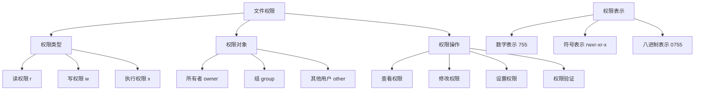

# 文件权限管理

## 🎯 学习目标
- 掌握PHP文件权限的基本概念和操作
- 理解Linux文件权限系统
- 学会文件权限的安全管理
- 了解文件权限的最佳实践

## 📚 核心概念

### 文件权限概述



### 文件权限对照表

| 权限 | 数字 | 二进制 | 说明 |
|------|------|--------|------|
| --- | 0 | 000 | 无权限 |
| --x | 1 | 001 | 仅执行 |
| -w- | 2 | 010 | 仅写入 |
| -wx | 3 | 011 | 写入+执行 |
| r-- | 4 | 100 | 仅读取 |
| r-x | 5 | 101 | 读取+执行 |
| rw- | 6 | 110 | 读取+写入 |
| rwx | 7 | 111 | 全部权限 |

## 🔧 基本权限操作

### 权限查看和设置
```php
<?php
// 1. 查看文件权限
function getFilePermissions($filePath) {
    if (!file_exists($filePath)) {
        throw new Exception("文件不存在: $filePath");
    }
    
    $perms = fileperms($filePath);
    
    return [
        'octal' => substr(sprintf('%o', $perms), -4),
        'symbolic' => getSymbolicPermissions($perms),
        'readable' => is_readable($filePath),
        'writable' => is_writable($filePath),
        'executable' => is_executable($filePath),
        'owner' => posix_getpwuid(fileowner($filePath)),
        'group' => posix_getgrgid(filegroup($filePath))
    ];
}

// 2. 获取符号权限
function getSymbolicPermissions($perms) {
    $info = '';
    
    // 文件类型
    $info .= (($perms & 0xC000) == 0xC000) ? 's' : // Socket
             (($perms & 0xA000) == 0xA000) ? 'l' : // Symbolic Link
             (($perms & 0x8000) == 0x8000) ? '-' : // Regular
             (($perms & 0x6000) == 0x6000) ? 'b' : // Block special
             (($perms & 0x4000) == 0x4000) ? 'd' : // Directory
             (($perms & 0x2000) == 0x2000) ? 'c' : // Character special
             (($perms & 0x1000) == 0x1000) ? 'p' : // FIFO pipe
             'u'; // Unknown
    
    // 所有者权限
    $info .= (($perms & 0x0100) ? 'r' : '-');
    $info .= (($perms & 0x0080) ? 'w' : '-');
    $info .= (($perms & 0x0040) ? (($perms & 0x0800) ? 's' : 'x') : (($perms & 0x0800) ? 'S' : '-'));
    
    // 组权限
    $info .= (($perms & 0x0020) ? 'r' : '-');
    $info .= (($perms & 0x0010) ? 'w' : '-');
    $info .= (($perms & 0x0008) ? (($perms & 0x0400) ? 's' : 'x') : (($perms & 0x0400) ? 'S' : '-'));
    
    // 其他用户权限
    $info .= (($perms & 0x0004) ? 'r' : '-');
    $info .= (($perms & 0x0002) ? 'w' : '-');
    $info .= (($perms & 0x0001) ? (($perms & 0x0200) ? 't' : 'x') : (($perms & 0x0200) ? 'T' : '-'));
    
    return $info;
}

// 3. 设置文件权限
function setFilePermissions($filePath, $mode) {
    if (!file_exists($filePath)) {
        throw new Exception("文件不存在: $filePath");
    }
    
    // 确保权限是八进制
    if (is_string($mode)) {
        $mode = octdec($mode);
    }
    
    $result = chmod($filePath, $mode);
    if (!$result) {
        throw new Exception("无法设置文件权限: $filePath");
    }
    
    return true;
}

// 4. 安全设置文件权限
function secureSetPermissions($filePath, $mode, $options = []) {
    $defaults = [
        'checkOwner' => true,
        'checkGroup' => true,
        'backup' => false,
        'validate' => true
    ];
    
    $options = array_merge($defaults, $options);
    
    if (!file_exists($filePath)) {
        throw new Exception("文件不存在: $filePath");
    }
    
    // 检查所有者
    if ($options['checkOwner'] && !isOwner($filePath)) {
        throw new Exception("无权限修改文件所有者");
    }
    
    // 备份原权限
    if ($options['backup']) {
        $originalPerms = fileperms($filePath);
        $backupFile = $filePath . '.perms_backup';
        file_put_contents($backupFile, $originalPerms);
    }
    
    // 设置权限
    $result = setFilePermissions($filePath, $mode);
    
    // 验证权限设置
    if ($options['validate']) {
        $newPerms = fileperms($filePath);
        $expectedMode = is_string($mode) ? octdec($mode) : $mode;
        
        if (($newPerms & 0777) !== $expectedMode) {
            throw new Exception("权限设置验证失败");
        }
    }
    
    return $result;
}

// 5. 检查文件所有者
function isOwner($filePath) {
    if (!function_exists('posix_getuid')) {
        return true; // Windows系统总是返回true
    }
    
    $fileOwner = fileowner($filePath);
    $currentUser = posix_getuid();
    
    return $fileOwner === $currentUser;
}

// 使用示例
echo "=== 文件权限操作示例 ===\n";

try {
    // 创建测试文件
    $testFile = 'test_permissions.txt';
    file_put_contents($testFile, 'Test permissions file content.');
    
    // 查看文件权限
    $perms = getFilePermissions($testFile);
    echo "文件权限信息:\n";
    foreach ($perms as $key => $value) {
        if (is_array($value)) {
            echo "  $key: " . json_encode($value) . "\n";
        } else {
            echo "  $key: $value\n";
        }
    }
    
    // 设置文件权限
    setFilePermissions($testFile, 0644);
    echo "文件权限已设置为 0644\n";
    
    // 安全设置权限
    secureSetPermissions($testFile, 0755, [
        'checkOwner' => true,
        'backup' => true,
        'validate' => true
    ]);
    echo "文件权限已安全设置为 0755\n";
    
    // 清理测试文件
    unlink($testFile);
    if (file_exists($testFile . '.perms_backup')) {
        unlink($testFile . '.perms_backup');
    }
    
} catch (Exception $e) {
    echo "错误: " . $e->getMessage() . "\n";
}
?>
```

### 目录权限管理
```php
<?php
// 1. 目录权限管理
function manageDirectoryPermissions($dirPath, $options = []) {
    $defaults = [
        'recursive' => false,
        'fileMode' => 0644,
        'dirMode' => 0755,
        'preserveOwner' => true,
        'preserveGroup' => true
    ];
    
    $options = array_merge($defaults, $options);
    
    if (!is_dir($dirPath)) {
        throw new Exception("目录不存在: $dirPath");
    }
    
    $results = [];
    
    if ($options['recursive']) {
        $iterator = new RecursiveDirectoryIterator($dirPath, RecursiveDirectoryIterator::SKIP_DOTS);
        $iterator = new RecursiveIteratorIterator($iterator);
        
        foreach ($iterator as $item) {
            $itemPath = $item->getPathname();
            
            if ($item->isFile()) {
                $result = setFilePermissions($itemPath, $options['fileMode']);
                $results[] = [
                    'path' => $itemPath,
                    'type' => 'file',
                    'success' => $result
                ];
            } elseif ($item->isDir()) {
                $result = setFilePermissions($itemPath, $options['dirMode']);
                $results[] = [
                    'path' => $itemPath,
                    'type' => 'directory',
                    'success' => $result
                ];
            }
        }
    } else {
        // 只处理当前目录
        $result = setFilePermissions($dirPath, $options['dirMode']);
        $results[] = [
            'path' => $dirPath,
            'type' => 'directory',
            'success' => $result
        ];
    }
    
    return $results;
}

// 2. 权限继承设置
function setPermissionInheritance($dirPath, $fileMode = 0644, $dirMode = 0755) {
    if (!is_dir($dirPath)) {
        throw new Exception("目录不存在: $dirPath");
    }
    
    $results = [];
    
    // 设置目录权限
    chmod($dirPath, $dirMode);
    $results[] = [
        'path' => $dirPath,
        'type' => 'directory',
        'mode' => $dirMode,
        'success' => true
    ];
    
    // 递归设置子目录和文件权限
    $iterator = new RecursiveDirectoryIterator($dirPath, RecursiveDirectoryIterator::SKIP_DOTS);
    $iterator = new RecursiveIteratorIterator($iterator);
    
    foreach ($iterator as $item) {
        $itemPath = $item->getPathname();
        
        if ($item->isFile()) {
            chmod($itemPath, $fileMode);
            $results[] = [
                'path' => $itemPath,
                'type' => 'file',
                'mode' => $fileMode,
                'success' => true
            ];
        } elseif ($item->isDir()) {
            chmod($itemPath, $dirMode);
            $results[] = [
                'path' => $itemPath,
                'type' => 'directory',
                'mode' => $dirMode,
                'success' => true
            ];
        }
    }
    
    return $results;
}

// 3. 权限验证
function validatePermissions($filePath, $requiredPermissions) {
    if (!file_exists($filePath)) {
        throw new Exception("文件不存在: $filePath");
    }
    
    $currentPerms = fileperms($filePath);
    $requiredPerms = is_string($requiredPermissions) ? octdec($requiredPermissions) : $requiredPermissions;
    
    $validation = [
        'file' => $filePath,
        'current_permissions' => substr(sprintf('%o', $currentPerms), -4),
        'required_permissions' => substr(sprintf('%o', $requiredPerms), -4),
        'is_readable' => is_readable($filePath),
        'is_writable' => is_writable($filePath),
        'is_executable' => is_executable($filePath),
        'permissions_match' => ($currentPerms & 0777) === $requiredPerms
    ];
    
    return $validation;
}

// 使用示例
echo "=== 目录权限管理示例 ===\n";

try {
    // 创建测试目录结构
    $testDir = 'test_dir_permissions';
    mkdir($testDir, 0755, true);
    mkdir($testDir . '/subdir1', 0755, true);
    mkdir($testDir . '/subdir2', 0755, true);
    
    // 创建测试文件
    file_put_contents($testDir . '/file1.txt', 'content1');
    file_put_contents($testDir . '/subdir1/file2.txt', 'content2');
    file_put_contents($testDir . '/subdir2/file3.txt', 'content3');
    
    // 管理目录权限
    $results = manageDirectoryPermissions($testDir, [
        'recursive' => true,
        'fileMode' => 0644,
        'dirMode' => 0755
    ]);
    
    echo "目录权限管理结果:\n";
    foreach ($results as $result) {
        echo "  " . $result['path'] . " (" . $result['type'] . "): " . ($result['success'] ? "成功" : "失败") . "\n";
    }
    
    // 权限继承设置
    $inheritResults = setPermissionInheritance($testDir, 0644, 0755);
    echo "\n权限继承设置完成: " . count($inheritResults) . " 项\n";
    
    // 权限验证
    $validation = validatePermissions($testDir . '/file1.txt', 0644);
    echo "\n权限验证结果:\n";
    foreach ($validation as $key => $value) {
        echo "  $key: " . ($value ? "是" : "否") . "\n";
    }
    
    // 清理测试目录
    $files = glob($testDir . '/**/*');
    foreach ($files as $file) {
        if (is_file($file)) {
            unlink($file);
        }
    }
    rmdir($testDir . '/subdir1');
    rmdir($testDir . '/subdir2');
    rmdir($testDir);
    
} catch (Exception $e) {
    echo "错误: " . $e->getMessage() . "\n";
}
?>
```

## 🔧 高级权限管理

### 权限管理器类
```php
<?php
// 权限管理器类
class PermissionManager {
    private $defaultFileMode;
    private $defaultDirMode;
    private $securityLevel;
    private $auditLog;
    
    public function __construct($options = []) {
        $this->defaultFileMode = $options['defaultFileMode'] ?? 0644;
        $this->defaultDirMode = $options['defaultDirMode'] ?? 0755;
        $this->securityLevel = $options['securityLevel'] ?? 'medium';
        $this->auditLog = $options['auditLog'] ?? 'permission_audit.log';
    }
    
    // 设置文件权限
    public function setFilePermission($filePath, $mode = null) {
        $mode = $mode ?: $this->defaultFileMode;
        
        if (!file_exists($filePath)) {
            throw new Exception("文件不存在: $filePath");
        }
        
        // 安全检查
        if (!$this->securityCheck($filePath, $mode)) {
            throw new Exception("权限设置未通过安全检查");
        }
        
        $result = chmod($filePath, $mode);
        
        // 记录审计日志
        $this->logAudit('set_file_permission', $filePath, $mode, $result);
        
        return $result;
    }
    
    // 设置目录权限
    public function setDirectoryPermission($dirPath, $mode = null) {
        $mode = $mode ?: $this->defaultDirMode;
        
        if (!is_dir($dirPath)) {
            throw new Exception("目录不存在: $dirPath");
        }
        
        // 安全检查
        if (!$this->securityCheck($dirPath, $mode)) {
            throw new Exception("权限设置未通过安全检查");
        }
        
        $result = chmod($dirPath, $mode);
        
        // 记录审计日志
        $this->logAudit('set_directory_permission', $dirPath, $mode, $result);
        
        return $result;
    }
    
    // 批量设置权限
    public function setBatchPermissions($paths, $fileMode = null, $dirMode = null) {
        $fileMode = $fileMode ?: $this->defaultFileMode;
        $dirMode = $dirMode ?: $this->defaultDirMode;
        
        $results = [];
        
        foreach ($paths as $path) {
            try {
                if (is_file($path)) {
                    $result = $this->setFilePermission($path, $fileMode);
                    $results[] = [
                        'path' => $path,
                        'type' => 'file',
                        'success' => $result
                    ];
                } elseif (is_dir($path)) {
                    $result = $this->setDirectoryPermission($path, $dirMode);
                    $results[] = [
                        'path' => $path,
                        'type' => 'directory',
                        'success' => $result
                    ];
                } else {
                    $results[] = [
                        'path' => $path,
                        'type' => 'unknown',
                        'success' => false,
                        'error' => '路径不存在'
                    ];
                }
            } catch (Exception $e) {
                $results[] = [
                    'path' => $path,
                    'type' => 'error',
                    'success' => false,
                    'error' => $e->getMessage()
                ];
            }
        }
        
        return $results;
    }
    
    // 安全检查
    private function securityCheck($path, $mode) {
        switch ($this->securityLevel) {
            case 'high':
                return $this->highSecurityCheck($path, $mode);
            case 'medium':
                return $this->mediumSecurityCheck($path, $mode);
            case 'low':
                return $this->lowSecurityCheck($path, $mode);
            default:
                return true;
        }
    }
    
    // 高安全级别检查
    private function highSecurityCheck($path, $mode) {
        // 检查危险权限
        if (($mode & 0002) !== 0) { // 其他用户写权限
            return false;
        }
        
        if (($mode & 0020) !== 0) { // 组写权限
            return false;
        }
        
        // 检查系统文件
        $systemPaths = ['/etc/', '/usr/', '/bin/', '/sbin/'];
        foreach ($systemPaths as $systemPath) {
            if (strpos($path, $systemPath) === 0) {
                return false;
            }
        }
        
        return true;
    }
    
    // 中等安全级别检查
    private function mediumSecurityCheck($path, $mode) {
        // 检查危险权限
        if (($mode & 0002) !== 0) { // 其他用户写权限
            return false;
        }
        
        return true;
    }
    
    // 低安全级别检查
    private function lowSecurityCheck($path, $mode) {
        // 基本检查
        return $mode >= 0 && $mode <= 0777;
    }
    
    // 记录审计日志
    private function logAudit($action, $path, $mode, $result) {
        $logEntry = [
            'timestamp' => date('Y-m-d H:i:s'),
            'action' => $action,
            'path' => $path,
            'mode' => substr(sprintf('%o', $mode), -4),
            'result' => $result ? 'success' : 'failed',
            'user' => get_current_user(),
            'ip' => $_SERVER['REMOTE_ADDR'] ?? 'cli'
        ];
        
        $logLine = json_encode($logEntry) . "\n";
        file_put_contents($this->auditLog, $logLine, FILE_APPEND | LOCK_EX);
    }
    
    // 获取权限报告
    public function getPermissionReport($path) {
        if (!file_exists($path)) {
            throw new Exception("路径不存在: $path");
        }
        
        $report = [
            'path' => $path,
            'type' => is_dir($path) ? 'directory' : 'file',
            'permissions' => getFilePermissions($path),
            'security_issues' => $this->checkSecurityIssues($path)
        ];
        
        return $report;
    }
    
    // 检查安全问题
    private function checkSecurityIssues($path) {
        $issues = [];
        $perms = fileperms($path);
        
        // 检查其他用户写权限
        if (($perms & 0002) !== 0) {
            $issues[] = '其他用户具有写权限';
        }
        
        // 检查组写权限
        if (($perms & 0020) !== 0) {
            $issues[] = '组用户具有写权限';
        }
        
        // 检查执行权限
        if (is_file($path) && ($perms & 0001) !== 0) {
            $issues[] = '文件具有执行权限';
        }
        
        return $issues;
    }
}

// 使用示例
echo "=== 权限管理器类示例 ===\n";

try {
    // 创建权限管理器
    $manager = new PermissionManager([
        'defaultFileMode' => 0644,
        'defaultDirMode' => 0755,
        'securityLevel' => 'medium',
        'auditLog' => 'test_audit.log'
    ]);
    
    // 创建测试文件
    $testFile = 'test_permission_manager.txt';
    file_put_contents($testFile, 'Test permission manager content.');
    
    // 设置文件权限
    $result = $manager->setFilePermission($testFile, 0644);
    echo "文件权限设置: " . ($result ? "成功" : "失败") . "\n";
    
    // 获取权限报告
    $report = $manager->getPermissionReport($testFile);
    echo "权限报告:\n";
    echo "  路径: " . $report['path'] . "\n";
    echo "  类型: " . $report['type'] . "\n";
    echo "  权限: " . $report['permissions']['octal'] . "\n";
    echo "  安全问题: " . implode(', ', $report['security_issues']) . "\n";
    
    // 批量设置权限
    $paths = [$testFile];
    $results = $manager->setBatchPermissions($paths, 0644, 0755);
    echo "批量权限设置结果: " . count($results) . " 项\n";
    
    // 清理测试文件
    unlink($testFile);
    if (file_exists('test_audit.log')) {
        unlink('test_audit.log');
    }
    
} catch (Exception $e) {
    echo "错误: " . $e->getMessage() . "\n";
}
?>
```

## 🎯 实际应用

### 安全权限设置
```php
<?php
// 安全权限设置类
class SecurePermissionSetter {
    private $allowedModes;
    private $forbiddenModes;
    private $systemPaths;
    
    public function __construct() {
        $this->allowedModes = [
            'file' => [0644, 0600, 0444, 0400],
            'directory' => [0755, 0700, 0555, 0500]
        ];
        
        $this->forbiddenModes = [
            0002, // 其他用户写权限
            0020, // 组写权限
            0777, // 全部权限
            0666  // 全部读写权限
        ];
        
        $this->systemPaths = [
            '/etc/', '/usr/', '/bin/', '/sbin/', '/var/', '/tmp/'
        ];
    }
    
    // 安全设置文件权限
    public function secureSetFilePermission($filePath, $mode) {
        // 验证文件路径
        if (!$this->validatePath($filePath)) {
            throw new Exception("不安全的文件路径: $filePath");
        }
        
        // 验证权限模式
        if (!$this->validateFileMode($mode)) {
            throw new Exception("不允许的文件权限: " . substr(sprintf('%o', $mode), -4));
        }
        
        // 检查当前权限
        $currentPerms = fileperms($filePath);
        if (!$this->isPermissionDowngrade($currentPerms, $mode)) {
            throw new Exception("权限升级被拒绝");
        }
        
        // 设置权限
        $result = chmod($filePath, $mode);
        if (!$result) {
            throw new Exception("权限设置失败");
        }
        
        // 验证权限设置
        $newPerms = fileperms($filePath);
        if (($newPerms & 0777) !== $mode) {
            throw new Exception("权限设置验证失败");
        }
        
        return true;
    }
    
    // 安全设置目录权限
    public function secureSetDirectoryPermission($dirPath, $mode) {
        // 验证目录路径
        if (!$this->validatePath($dirPath)) {
            throw new Exception("不安全的目录路径: $dirPath");
        }
        
        // 验证权限模式
        if (!$this->validateDirectoryMode($mode)) {
            throw new Exception("不允许的目录权限: " . substr(sprintf('%o', $mode), -4));
        }
        
        // 检查当前权限
        $currentPerms = fileperms($dirPath);
        if (!$this->isPermissionDowngrade($currentPerms, $mode)) {
            throw new Exception("权限升级被拒绝");
        }
        
        // 设置权限
        $result = chmod($dirPath, $mode);
        if (!$result) {
            throw new Exception("权限设置失败");
        }
        
        // 验证权限设置
        $newPerms = fileperms($dirPath);
        if (($newPerms & 0777) !== $mode) {
            throw new Exception("权限设置验证失败");
        }
        
        return true;
    }
    
    // 验证路径安全性
    private function validatePath($path) {
        // 检查系统路径
        foreach ($this->systemPaths as $systemPath) {
            if (strpos($path, $systemPath) === 0) {
                return false;
            }
        }
        
        // 检查路径遍历
        if (strpos($path, '..') !== false) {
            return false;
        }
        
        // 检查绝对路径
        if (strpos($path, '/') === 0 && !strpos($path, getcwd()) === 0) {
            return false;
        }
        
        return true;
    }
    
    // 验证文件权限模式
    private function validateFileMode($mode) {
        // 检查禁止的权限
        foreach ($this->forbiddenModes as $forbiddenMode) {
            if (($mode & $forbiddenMode) === $forbiddenMode) {
                return false;
            }
        }
        
        // 检查允许的权限
        return in_array($mode, $this->allowedModes['file']);
    }
    
    // 验证目录权限模式
    private function validateDirectoryMode($mode) {
        // 检查禁止的权限
        foreach ($this->forbiddenModes as $forbiddenMode) {
            if (($mode & $forbiddenMode) === $forbiddenMode) {
                return false;
            }
        }
        
        // 检查允许的权限
        return in_array($mode, $this->allowedModes['directory']);
    }
    
    // 检查是否为权限降级
    private function isPermissionDowngrade($currentPerms, $newMode) {
        $currentMode = $currentPerms & 0777;
        
        // 检查写权限降级
        $currentWrite = $currentMode & 0002;
        $newWrite = $newMode & 0002;
        
        if ($currentWrite === 0 && $newWrite !== 0) {
            return false; // 写权限升级
        }
        
        // 检查执行权限降级
        $currentExec = $currentMode & 0001;
        $newExec = $newMode & 0001;
        
        if ($currentExec === 0 && $newExec !== 0) {
            return false; // 执行权限升级
        }
        
        return true;
    }
}

// 使用示例
echo "=== 安全权限设置示例 ===\n";

try {
    $secureSetter = new SecurePermissionSetter();
    
    // 创建测试文件
    $testFile = 'test_secure_permissions.txt';
    file_put_contents($testFile, 'Test secure permissions content.');
    
    // 安全设置文件权限
    $result = $secureSetter->secureSetFilePermission($testFile, 0644);
    echo "安全文件权限设置: " . ($result ? "成功" : "失败") . "\n";
    
    // 尝试设置危险权限（应该失败）
    try {
        $secureSetter->secureSetFilePermission($testFile, 0777);
        echo "危险权限设置: 成功（不应该）\n";
    } catch (Exception $e) {
        echo "危险权限设置: 被拒绝 - " . $e->getMessage() . "\n";
    }
    
    // 清理测试文件
    unlink($testFile);
    
} catch (Exception $e) {
    echo "错误: " . $e->getMessage() . "\n";
}
?>
```

## 📊 最佳实践

### 文件权限最佳实践
```php
<?php
// 文件权限最佳实践

// 1. 权限模板
class PermissionTemplates {
    public static function getWebFilePermissions() {
        return [
            'php_files' => 0644,
            'html_files' => 0644,
            'css_files' => 0644,
            'js_files' => 0644,
            'image_files' => 0644,
            'upload_files' => 0644,
            'config_files' => 0600,
            'log_files' => 0644
        ];
    }
    
    public static function getWebDirectoryPermissions() {
        return [
            'web_root' => 0755,
            'upload_dir' => 0755,
            'cache_dir' => 0755,
            'log_dir' => 0755,
            'config_dir' => 0755,
            'temp_dir' => 0755
        ];
    }
    
    public static function getSystemPermissions() {
        return [
            'system_files' => 0644,
            'system_dirs' => 0755,
            'executable_files' => 0755,
            'sensitive_files' => 0600
        ];
    }
}

// 2. 权限检查器
class PermissionChecker {
    public static function checkWebSecurity($webRoot) {
        $issues = [];
        $templates = PermissionTemplates::getWebFilePermissions();
        
        $iterator = new RecursiveDirectoryIterator($webRoot, RecursiveDirectoryIterator::SKIP_DOTS);
        $iterator = new RecursiveIteratorIterator($iterator);
        
        foreach ($iterator as $item) {
            if ($item->isFile()) {
                $path = $item->getPathname();
                $perms = fileperms($path);
                $mode = $perms & 0777;
                
                // 检查危险权限
                if (($mode & 0002) !== 0) { // 其他用户写权限
                    $issues[] = [
                        'type' => 'dangerous_permission',
                        'path' => $path,
                        'issue' => '其他用户具有写权限',
                        'severity' => 'high'
                    ];
                }
                
                // 检查执行权限
                if (($mode & 0001) !== 0 && !self::isExecutableFile($path)) {
                    $issues[] = [
                        'type' => 'unnecessary_execution',
                        'path' => $path,
                        'issue' => '文件具有不必要的执行权限',
                        'severity' => 'medium'
                    ];
                }
            }
        }
        
        return $issues;
    }
    
    private static function isExecutableFile($path) {
        $executableExtensions = ['php', 'pl', 'py', 'sh', 'bat', 'exe'];
        $extension = strtolower(pathinfo($path, PATHINFO_EXTENSION));
        
        return in_array($extension, $executableExtensions);
    }
}

// 3. 权限修复器
class PermissionFixer {
    public static function fixWebPermissions($webRoot) {
        $templates = PermissionTemplates::getWebFilePermissions();
        $dirTemplates = PermissionTemplates::getWebDirectoryPermissions();
        
        $results = [];
        
        $iterator = new RecursiveDirectoryIterator($webRoot, RecursiveDirectoryIterator::SKIP_DOTS);
        $iterator = new RecursiveIteratorIterator($iterator);
        
        foreach ($iterator as $item) {
            $path = $item->getPathname();
            $relativePath = substr($path, strlen($webRoot) + 1);
            
            if ($item->isFile()) {
                $extension = strtolower(pathinfo($path, PATHINFO_EXTENSION));
                $mode = $templates[$extension . '_files'] ?? 0644;
                
                $result = chmod($path, $mode);
                $results[] = [
                    'path' => $relativePath,
                    'type' => 'file',
                    'mode' => substr(sprintf('%o', $mode), -4),
                    'success' => $result
                ];
            } elseif ($item->isDir()) {
                $mode = 0755; // 默认目录权限
                
                $result = chmod($path, $mode);
                $results[] = [
                    'path' => $relativePath,
                    'type' => 'directory',
                    'mode' => substr(sprintf('%o', $mode), -4),
                    'success' => $result
                ];
            }
        }
        
        return $results;
    }
}

// 使用示例
echo "=== 文件权限最佳实践示例 ===\n";

try {
    // 创建测试Web目录结构
    $webRoot = 'test_web_root';
    mkdir($webRoot, 0755, true);
    mkdir($webRoot . '/uploads', 0755, true);
    mkdir($webRoot . '/cache', 0755, true);
    
    // 创建测试文件
    file_put_contents($webRoot . '/index.php', '<?php echo "Hello World"; ?>');
    file_put_contents($webRoot . '/style.css', 'body { margin: 0; }');
    file_put_contents($webRoot . '/script.js', 'console.log("Hello");');
    file_put_contents($webRoot . '/config.ini', 'database=test');
    file_put_contents($webRoot . '/uploads/test.jpg', 'fake image content');
    
    // 检查Web安全
    $issues = PermissionChecker::checkWebSecurity($webRoot);
    echo "安全检查发现 " . count($issues) . " 个问题:\n";
    foreach ($issues as $issue) {
        echo "  " . $issue['severity'] . ": " . $issue['issue'] . " - " . $issue['path'] . "\n";
    }
    
    // 修复权限
    $fixResults = PermissionFixer::fixWebPermissions($webRoot);
    echo "\n权限修复结果: " . count($fixResults) . " 项\n";
    foreach ($fixResults as $result) {
        echo "  " . $result['path'] . " (" . $result['type'] . "): " . $result['mode'] . " - " . ($result['success'] ? "成功" : "失败") . "\n";
    }
    
    // 清理测试目录
    $files = glob($webRoot . '/**/*');
    foreach ($files as $file) {
        if (is_file($file)) {
            unlink($file);
        }
    }
    rmdir($webRoot . '/uploads');
    rmdir($webRoot . '/cache');
    rmdir($webRoot);
    
} catch (Exception $e) {
    echo "错误: " . $e->getMessage() . "\n";
}
?>
```

## 🎓 学习建议

### 费曼学习法应用
1. **选择概念**: 选择文件权限中的核心概念
2. **简化解释**: 用简单语言解释文件权限的作用
3. **识别盲点**: 发现理解不深入的地方
4. **重新学习**: 针对盲点进行深入学习

### 刻意练习重点
1. **概念理解**: 深入理解文件权限的基本概念
2. **实际应用**: 在实际项目中应用文件权限管理
3. **安全防护**: 掌握文件权限的安全防护措施
4. **最佳实践**: 学习文件权限的最佳实践

## 🔗 相关链接
- [[01-文件读写操作|文件读写操作]]
- [[02-目录操作|目录操作]]
- [[03-文件上传处理|文件上传处理]]
- [[04-文件下载实现|文件下载实现]]
- [[06-文件操作安全|文件操作安全]]
