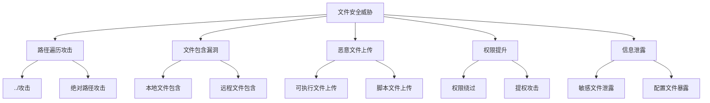

# 文件操作安全

## 🎯 学习目标
- 掌握文件操作的安全防护措施
- 理解常见的文件安全威胁
- 学会安全的文件操作实践
- 了解文件安全审计方法

## 📚 核心概念

### 文件安全威胁



## 🔧 安全防护措施

### 路径安全验证
```php
<?php
// 1. 路径遍历防护
function validatePath($path, $allowedBasePath) {
    // 规范化路径
    $realPath = realpath($path);
    $realBasePath = realpath($allowedBasePath);
    
    // 检查路径是否存在
    if ($realPath === false || $realBasePath === false) {
        throw new Exception("无效路径");
    }
    
    // 检查是否在允许的基础路径内
    if (strpos($realPath, $realBasePath) !== 0) {
        throw new Exception("路径遍历攻击检测");
    }
    
    return true;
}

// 2. 文件名安全过滤
function sanitizeFilename($filename) {
    // 移除危险字符
    $filename = preg_replace('/[^a-zA-Z0-9._-]/', '', $filename);
    
    // 限制文件名长度
    if (strlen($filename) > 255) {
        $filename = substr($filename, 0, 255);
    }
    
    // 检查空文件名
    if (empty($filename)) {
        throw new Exception("无效文件名");
    }
    
    return $filename;
}

// 3. 文件类型验证
function validateFileType($filePath, $allowedTypes) {
    // 检查文件扩展名
    $extension = strtolower(pathinfo($filePath, PATHINFO_EXTENSION));
    if (!in_array($extension, $allowedTypes)) {
        throw new Exception("不允许的文件类型");
    }
    
    // 检查MIME类型
    $finfo = finfo_open(FILEINFO_MIME_TYPE);
    $mimeType = finfo_file($finfo, $filePath);
    finfo_close($finfo);
    
    $allowedMimes = [
        'jpg' => 'image/jpeg',
        'png' => 'image/png',
        'gif' => 'image/gif',
        'pdf' => 'application/pdf',
        'txt' => 'text/plain'
    ];
    
    if (!isset($allowedMimes[$extension]) || $mimeType !== $allowedMimes[$extension]) {
        throw new Exception("文件类型不匹配");
    }
    
    return true;
}

// 4. 恶意内容检测
function scanMaliciousContent($filePath) {
    $content = file_get_contents($filePath);
    
    // 检查恶意代码模式
    $maliciousPatterns = [
        '/eval\s*\(/i',
        '/base64_decode\s*\(/i',
        '/system\s*\(/i',
        '/exec\s*\(/i',
        '/shell_exec\s*\(/i',
        '/<\?php/i',
        '/<script/i'
    ];
    
    foreach ($maliciousPatterns as $pattern) {
        if (preg_match($pattern, $content)) {
            throw new Exception("检测到恶意内容");
        }
    }
    
    return true;
}

// 使用示例
echo "=== 文件安全验证示例 ===\n";

try {
    // 创建测试环境
    $allowedPath = getcwd() . '/safe_uploads';
    if (!is_dir($allowedPath)) {
        mkdir($allowedPath, 0755, true);
    }
    
    // 测试安全文件
    $safeFile = $allowedPath . '/test.txt';
    file_put_contents($safeFile, 'Safe content');
    
    // 路径验证
    validatePath($safeFile, $allowedPath);
    echo "路径验证: 通过\n";
    
    // 文件名过滤
    $cleanName = sanitizeFilename('test file!@#.txt');
    echo "文件名过滤: $cleanName\n";
    
    // 文件类型验证
    validateFileType($safeFile, ['txt']);
    echo "文件类型验证: 通过\n";
    
    // 恶意内容检测
    scanMaliciousContent($safeFile);
    echo "恶意内容检测: 通过\n";
    
    // 清理
    unlink($safeFile);
    rmdir($allowedPath);
    
} catch (Exception $e) {
    echo "错误: " . $e->getMessage() . "\n";
}
?>
```

### 安全文件操作类
```php
<?php
// 安全文件操作类
class SecureFileHandler {
    private $basePath;
    private $allowedExtensions;
    private $maxFileSize;
    
    public function __construct($basePath, $options = []) {
        $this->basePath = realpath($basePath);
        $this->allowedExtensions = $options['allowedExtensions'] ?? ['txt', 'jpg', 'png', 'pdf'];
        $this->maxFileSize = $options['maxFileSize'] ?? 10 * 1024 * 1024; // 10MB
        
        if (!$this->basePath || !is_dir($this->basePath)) {
            throw new Exception("无效的基础路径");
        }
    }
    
    // 安全读取文件
    public function readFile($filename) {
        $filePath = $this->getSecurePath($filename);
        
        if (!file_exists($filePath)) {
            throw new Exception("文件不存在");
        }
        
        if (!is_readable($filePath)) {
            throw new Exception("文件不可读");
        }
        
        return file_get_contents($filePath);
    }
    
    // 安全写入文件
    public function writeFile($filename, $content) {
        $filePath = $this->getSecurePath($filename);
        
        // 检查文件大小
        if (strlen($content) > $this->maxFileSize) {
            throw new Exception("文件大小超过限制");
        }
        
        // 检查内容安全性
        $this->validateContent($content);
        
        $result = file_put_contents($filePath, $content, LOCK_EX);
        if ($result === false) {
            throw new Exception("文件写入失败");
        }
        
        return $result;
    }
    
    // 安全删除文件
    public function deleteFile($filename) {
        $filePath = $this->getSecurePath($filename);
        
        if (!file_exists($filePath)) {
            throw new Exception("文件不存在");
        }
        
        $result = unlink($filePath);
        if (!$result) {
            throw new Exception("文件删除失败");
        }
        
        return true;
    }
    
    // 获取安全路径
    private function getSecurePath($filename) {
        // 过滤文件名
        $filename = sanitizeFilename($filename);
        
        // 构建完整路径
        $filePath = $this->basePath . DIRECTORY_SEPARATOR . $filename;
        
        // 验证路径安全性
        validatePath($filePath, $this->basePath);
        
        // 验证文件扩展名
        $extension = strtolower(pathinfo($filename, PATHINFO_EXTENSION));
        if (!in_array($extension, $this->allowedExtensions)) {
            throw new Exception("不允许的文件类型");
        }
        
        return $filePath;
    }
    
    // 验证内容安全性
    private function validateContent($content) {
        // 检查恶意代码
        $maliciousPatterns = [
            '/eval\s*\(/i',
            '/system\s*\(/i',
            '/exec\s*\(/i',
            '/<\?php/i'
        ];
        
        foreach ($maliciousPatterns as $pattern) {
            if (preg_match($pattern, $content)) {
                throw new Exception("检测到恶意内容");
            }
        }
        
        return true;
    }
}

// 使用示例
echo "=== 安全文件操作类示例 ===\n";

try {
    // 创建安全目录
    $secureDir = 'secure_files';
    if (!is_dir($secureDir)) {
        mkdir($secureDir, 0755, true);
    }
    
    // 创建安全文件处理器
    $handler = new SecureFileHandler($secureDir, [
        'allowedExtensions' => ['txt', 'log'],
        'maxFileSize' => 1024 * 1024 // 1MB
    ]);
    
    // 安全写入文件
    $content = "这是安全的文件内容\n时间: " . date('Y-m-d H:i:s');
    $handler->writeFile('test.txt', $content);
    echo "文件写入成功\n";
    
    // 安全读取文件
    $readContent = $handler->readFile('test.txt');
    echo "文件读取成功: " . strlen($readContent) . " 字节\n";
    
    // 安全删除文件
    $handler->deleteFile('test.txt');
    echo "文件删除成功\n";
    
    // 清理目录
    rmdir($secureDir);
    
} catch (Exception $e) {
    echo "错误: " . $e->getMessage() . "\n";
}
?>
```

## 🎯 安全审计

### 文件安全审计
```php
<?php
// 文件安全审计类
class FileSecurityAuditor {
    private $auditLog;
    private $securityRules;
    
    public function __construct($auditLog = 'security_audit.log') {
        $this->auditLog = $auditLog;
        $this->securityRules = [
            'max_file_size' => 50 * 1024 * 1024, // 50MB
            'forbidden_extensions' => ['php', 'exe', 'bat', 'cmd'],
            'dangerous_permissions' => [0777, 0666, 0002],
            'system_paths' => ['/etc/', '/usr/', '/bin/']
        ];
    }
    
    // 审计目录安全性
    public function auditDirectory($dirPath) {
        $issues = [];
        
        if (!is_dir($dirPath)) {
            throw new Exception("目录不存在: $dirPath");
        }
        
        $iterator = new RecursiveDirectoryIterator($dirPath, RecursiveDirectoryIterator::SKIP_DOTS);
        $iterator = new RecursiveIteratorIterator($iterator);
        
        foreach ($iterator as $item) {
            $itemPath = $item->getPathname();
            $itemIssues = $this->auditFile($itemPath);
            $issues = array_merge($issues, $itemIssues);
        }
        
        // 记录审计结果
        $this->logAuditResult($dirPath, $issues);
        
        return $issues;
    }
    
    // 审计单个文件
    private function auditFile($filePath) {
        $issues = [];
        
        // 检查文件大小
        if (is_file($filePath) && filesize($filePath) > $this->securityRules['max_file_size']) {
            $issues[] = [
                'type' => 'oversized_file',
                'path' => $filePath,
                'severity' => 'medium',
                'description' => '文件大小超过限制'
            ];
        }
        
        // 检查文件扩展名
        $extension = strtolower(pathinfo($filePath, PATHINFO_EXTENSION));
        if (in_array($extension, $this->securityRules['forbidden_extensions'])) {
            $issues[] = [
                'type' => 'dangerous_extension',
                'path' => $filePath,
                'severity' => 'high',
                'description' => '危险的文件扩展名'
            ];
        }
        
        // 检查文件权限
        $perms = fileperms($filePath) & 0777;
        if (in_array($perms, $this->securityRules['dangerous_permissions'])) {
            $issues[] = [
                'type' => 'dangerous_permissions',
                'path' => $filePath,
                'severity' => 'high',
                'description' => '危险的文件权限'
            ];
        }
        
        // 检查系统路径
        foreach ($this->securityRules['system_paths'] as $systemPath) {
            if (strpos($filePath, $systemPath) === 0) {
                $issues[] = [
                    'type' => 'system_path_access',
                    'path' => $filePath,
                    'severity' => 'critical',
                    'description' => '访问系统路径'
                ];
            }
        }
        
        return $issues;
    }
    
    // 记录审计结果
    private function logAuditResult($path, $issues) {
        $auditData = [
            'timestamp' => date('Y-m-d H:i:s'),
            'path' => $path,
            'issues_count' => count($issues),
            'issues' => $issues,
            'auditor' => get_current_user()
        ];
        
        $logEntry = json_encode($auditData) . "\n";
        file_put_contents($this->auditLog, $logEntry, FILE_APPEND | LOCK_EX);
    }
    
    // 生成安全报告
    public function generateSecurityReport($dirPath) {
        $issues = $this->auditDirectory($dirPath);
        
        $report = [
            'audit_time' => date('Y-m-d H:i:s'),
            'audited_path' => $dirPath,
            'total_issues' => count($issues),
            'severity_breakdown' => [
                'critical' => 0,
                'high' => 0,
                'medium' => 0,
                'low' => 0
            ],
            'issue_types' => [],
            'recommendations' => []
        ];
        
        // 统计问题严重程度
        foreach ($issues as $issue) {
            $report['severity_breakdown'][$issue['severity']]++;
            
            if (!isset($report['issue_types'][$issue['type']])) {
                $report['issue_types'][$issue['type']] = 0;
            }
            $report['issue_types'][$issue['type']]++;
        }
        
        // 生成建议
        $report['recommendations'] = $this->generateRecommendations($report);
        
        return $report;
    }
    
    // 生成安全建议
    private function generateRecommendations($report) {
        $recommendations = [];
        
        if ($report['severity_breakdown']['critical'] > 0) {
            $recommendations[] = '立即处理严重安全问题';
        }
        
        if ($report['severity_breakdown']['high'] > 0) {
            $recommendations[] = '尽快处理高风险安全问题';
        }
        
        if (isset($report['issue_types']['dangerous_permissions'])) {
            $recommendations[] = '修复文件权限设置';
        }
        
        if (isset($report['issue_types']['dangerous_extension'])) {
            $recommendations[] = '移除或重命名危险文件';
        }
        
        return $recommendations;
    }
}

// 使用示例
echo "=== 文件安全审计示例 ===\n";

try {
    // 创建测试环境
    $testDir = 'audit_test';
    if (!is_dir($testDir)) {
        mkdir($testDir, 0755, true);
    }
    
    // 创建测试文件
    file_put_contents($testDir . '/safe.txt', 'Safe content');
    file_put_contents($testDir . '/script.php', '<?php echo "test"; ?>');
    
    // 设置危险权限
    chmod($testDir . '/script.php', 0777);
    
    // 创建审计器
    $auditor = new FileSecurityAuditor('test_audit.log');
    
    // 执行安全审计
    $issues = $auditor->auditDirectory($testDir);
    echo "发现安全问题: " . count($issues) . " 个\n";
    
    foreach ($issues as $issue) {
        echo "  " . $issue['severity'] . ": " . $issue['description'] . " - " . $issue['path'] . "\n";
    }
    
    // 生成安全报告
    $report = $auditor->generateSecurityReport($testDir);
    echo "\n安全报告:\n";
    echo "  总问题数: " . $report['total_issues'] . "\n";
    echo "  严重问题: " . $report['severity_breakdown']['critical'] . "\n";
    echo "  高风险问题: " . $report['severity_breakdown']['high'] . "\n";
    echo "  建议: " . implode(', ', $report['recommendations']) . "\n";
    
    // 清理测试文件
    unlink($testDir . '/safe.txt');
    unlink($testDir . '/script.php');
    rmdir($testDir);
    
    if (file_exists('test_audit.log')) {
        unlink('test_audit.log');
    }
    
} catch (Exception $e) {
    echo "错误: " . $e->getMessage() . "\n";
}
?>
```

## 📊 最佳实践

### 文件安全最佳实践清单

1. **输入验证**
   - 验证文件路径和文件名
   - 检查文件类型和扩展名
   - 限制文件大小

2. **权限控制**
   - 使用最小权限原则
   - 定期审计文件权限
   - 避免777权限

3. **内容检查**
   - 扫描恶意代码
   - 验证文件头信息
   - 检查MIME类型

4. **安全存储**
   - 使用安全的存储位置
   - 实施访问控制
   - 定期备份重要文件

## 🎓 学习建议

### 费曼学习法应用
1. **选择概念**: 选择文件安全中的核心概念
2. **简化解释**: 用简单语言解释文件安全的重要性
3. **识别盲点**: 发现理解不深入的地方
4. **重新学习**: 针对盲点进行深入学习

### 刻意练习重点
1. **安全意识**: 培养文件操作的安全意识
2. **实际应用**: 在实际项目中应用安全措施
3. **威胁识别**: 学会识别常见的文件安全威胁
4. **防护实施**: 掌握有效的安全防护措施

## 🔗 相关链接
- [[01-文件读写操作|文件读写操作]]
- [[02-目录操作|目录操作]]
- [[03-文件上传处理|文件上传处理]]
- [[04-文件下载实现|文件下载实现]]
- [[05-文件权限管理|文件权限管理]]
