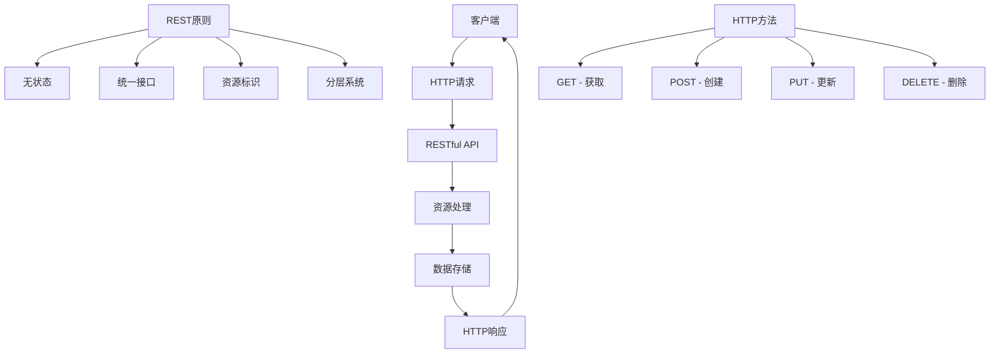

# RESTful API设计

## 🎯 学习目标
- 掌握RESTful API的设计原则和最佳实践
- 理解HTTP方法和状态码的正确使用
- 学会设计RESTful API的URL结构和数据格式
- 了解API版本控制和文档编写

## 📚 核心概念

### REST架构风格



### RESTful API设计对比

| 设计原则 | 正确示例 | 错误示例 | 说明 |
|----------|----------|----------|------|
| 资源命名 | `/users` | `/getUsers` | 使用名词，避免动词 |
| HTTP方法 | `GET /users/123` | `POST /getUser` | 使用正确的HTTP方法 |
| 状态码 | `200 OK` | `200 Error` | 使用标准状态码 |
| 数据格式 | JSON | XML | 使用统一的数据格式 |
| 版本控制 | `/v1/users` | `/users?version=1` | 在URL中体现版本 |

## 🔧 RESTful API实现

### API框架基础
```php
<?php
// 1. RESTful API基础框架
class RestfulAPI {
    private $routes;
    private $middleware;
    private $response;
    
    public function __construct() {
        $this->routes = [];
        $this->middleware = [];
        $this->response = new APIResponse();
    }
    
    // 注册路由
    public function route($method, $path, $handler, $middleware = []) {
        $this->routes[] = [
            'method' => strtoupper($method),
            'path' => $path,
            'handler' => $handler,
            'middleware' => $middleware
        ];
    }
    
    // GET路由
    public function get($path, $handler, $middleware = []) {
        $this->route('GET', $path, $handler, $middleware);
    }
    
    // POST路由
    public function post($path, $handler, $middleware = []) {
        $this->route('POST', $path, $handler, $middleware);
    }
    
    // PUT路由
    public function put($path, $handler, $middleware = []) {
        $this->route('PUT', $path, $handler, $middleware);
    }
    
    // DELETE路由
    public function delete($path, $handler, $middleware = []) {
        $this->route('DELETE', $path, $handler, $middleware);
    }
    
    // 处理请求
    public function handleRequest() {
        $method = $_SERVER['REQUEST_METHOD'];
        $path = parse_url($_SERVER['REQUEST_URI'], PHP_URL_PATH);
        
        $route = $this->findRoute($method, $path);
        
        if (!$route) {
            $this->response->notFound();
            return;
        }
        
        // 执行中间件
        foreach ($route['middleware'] as $middleware) {
            if (!$this->executeMiddleware($middleware)) {
                return;
            }
        }
        
        // 执行处理器
        $this->executeHandler($route['handler'], $this->extractParams($path, $route['path']));
    }
    
    // 查找路由
    private function findRoute($method, $path) {
        foreach ($this->routes as $route) {
            if ($route['method'] === $method && $this->matchPath($path, $route['path'])) {
                return $route;
            }
        }
        return null;
    }
    
    // 路径匹配
    private function matchPath($requestPath, $routePath) {
        $requestParts = explode('/', trim($requestPath, '/'));
        $routeParts = explode('/', trim($routePath, '/'));
        
        if (count($requestParts) !== count($routeParts)) {
            return false;
        }
        
        for ($i = 0; $i < count($requestParts); $i++) {
            if ($routeParts[$i] !== $requestParts[$i] && !preg_match('/\{(\w+)\}/', $routeParts[$i])) {
                return false;
            }
        }
        
        return true;
    }
    
    // 提取参数
    private function extractParams($requestPath, $routePath) {
        $requestParts = explode('/', trim($requestPath, '/'));
        $routeParts = explode('/', trim($routePath, '/'));
        $params = [];
        
        for ($i = 0; $i < count($requestParts); $i++) {
            if (preg_match('/\{(\w+)\}/', $routeParts[$i], $matches)) {
                $params[$matches[1]] = $requestParts[$i];
            }
        }
        
        return $params;
    }
    
    // 执行中间件
    private function executeMiddleware($middleware) {
        if (is_callable($middleware)) {
            return $middleware();
        }
        
        if (is_string($middleware) && isset($this->middleware[$middleware])) {
            return $this->middleware[$middleware]();
        }
        
        return true;
    }
    
    // 执行处理器
    private function executeHandler($handler, $params) {
        if (is_callable($handler)) {
            $handler($params);
        } elseif (is_string($handler) && strpos($handler, '@') !== false) {
            list($controller, $method) = explode('@', $handler);
            $this->callControllerMethod($controller, $method, $params);
        }
    }
    
    // 调用控制器方法
    private function callControllerMethod($controller, $method, $params) {
        $controllerInstance = new $controller();
        if (method_exists($controllerInstance, $method)) {
            $controllerInstance->$method($params);
        } else {
            $this->response->methodNotAllowed();
        }
    }
    
    // 注册中间件
    public function middleware($name, $callback) {
        $this->middleware[$name] = $callback;
    }
}

// 2. API响应类
class APIResponse {
    private $statusCode;
    private $headers;
    private $data;
    
    public function __construct() {
        $this->statusCode = 200;
        $this->headers = ['Content-Type: application/json'];
        $this->data = null;
    }
    
    // 设置状态码
    public function status($code) {
        $this->statusCode = $code;
        return $this;
    }
    
    // 设置头部
    public function header($name, $value) {
        $this->headers[] = "$name: $value";
        return $this;
    }
    
    // 返回JSON数据
    public function json($data, $statusCode = 200) {
        $this->statusCode = $statusCode;
        $this->data = $data;
        $this->send();
    }
    
    // 成功响应
    public function success($data = null, $message = 'Success') {
        $response = [
            'success' => true,
            'message' => $message,
            'data' => $data
        ];
        $this->json($response, 200);
    }
    
    // 创建成功
    public function created($data = null, $message = 'Created successfully') {
        $response = [
            'success' => true,
            'message' => $message,
            'data' => $data
        ];
        $this->json($response, 201);
    }
    
    // 错误响应
    public function error($message = 'Error', $statusCode = 400, $errors = []) {
        $response = [
            'success' => false,
            'message' => $message,
            'errors' => $errors
        ];
        $this->json($response, $statusCode);
    }
    
    // 未找到
    public function notFound($message = 'Resource not found') {
        $this->error($message, 404);
    }
    
    // 方法不允许
    public function methodNotAllowed($message = 'Method not allowed') {
        $this->error($message, 405);
    }
    
    // 未授权
    public function unauthorized($message = 'Unauthorized') {
        $this->error($message, 401);
    }
    
    // 禁止访问
    public function forbidden($message = 'Forbidden') {
        $this->error($message, 403);
    }
    
    // 服务器错误
    public function serverError($message = 'Internal server error') {
        $this->error($message, 500);
    }
    
    // 发送响应
    private function send() {
        http_response_code($this->statusCode);
        
        foreach ($this->headers as $header) {
            header($header);
        }
        
        if ($this->data !== null) {
            echo json_encode($this->data, JSON_UNESCAPED_UNICODE);
        }
        
        exit;
    }
}

// 3. 用户API控制器
class UserController {
    private $response;
    
    public function __construct() {
        $this->response = new APIResponse();
    }
    
    // 获取用户列表
    public function index($params = []) {
        $page = $params['page'] ?? 1;
        $limit = $params['limit'] ?? 10;
        
        // 模拟数据
        $users = [
            ['id' => 1, 'name' => 'John Doe', 'email' => 'john@example.com'],
            ['id' => 2, 'name' => 'Jane Smith', 'email' => 'jane@example.com']
        ];
        
        $data = [
            'users' => $users,
            'pagination' => [
                'page' => $page,
                'limit' => $limit,
                'total' => count($users)
            ]
        ];
        
        $this->response->success($data);
    }
    
    // 获取单个用户
    public function show($params) {
        $userId = $params['id'] ?? null;
        
        if (!$userId) {
            $this->response->error('User ID is required', 400);
            return;
        }
        
        // 模拟数据
        $user = ['id' => $userId, 'name' => 'John Doe', 'email' => 'john@example.com'];
        
        $this->response->success($user);
    }
    
    // 创建用户
    public function store($params) {
        $input = json_decode(file_get_contents('php://input'), true);
        
        if (!$input) {
            $this->response->error('Invalid JSON data', 400);
            return;
        }
        
        // 验证数据
        $errors = $this->validateUserData($input);
        if (!empty($errors)) {
            $this->response->error('Validation failed', 422, $errors);
            return;
        }
        
        // 模拟创建用户
        $user = [
            'id' => rand(1000, 9999),
            'name' => $input['name'],
            'email' => $input['email']
        ];
        
        $this->response->created($user);
    }
    
    // 更新用户
    public function update($params) {
        $userId = $params['id'] ?? null;
        
        if (!$userId) {
            $this->response->error('User ID is required', 400);
            return;
        }
        
        $input = json_decode(file_get_contents('php://input'), true);
        
        if (!$input) {
            $this->response->error('Invalid JSON data', 400);
            return;
        }
        
        // 验证数据
        $errors = $this->validateUserData($input, false);
        if (!empty($errors)) {
            $this->response->error('Validation failed', 422, $errors);
            return;
        }
        
        // 模拟更新用户
        $user = [
            'id' => $userId,
            'name' => $input['name'] ?? 'John Doe',
            'email' => $input['email'] ?? 'john@example.com'
        ];
        
        $this->response->success($user);
    }
    
    // 删除用户
    public function destroy($params) {
        $userId = $params['id'] ?? null;
        
        if (!$userId) {
            $this->response->error('User ID is required', 400);
            return;
        }
        
        // 模拟删除用户
        $this->response->success(null, 'User deleted successfully');
    }
    
    // 验证用户数据
    private function validateUserData($data, $required = true) {
        $errors = [];
        
        if ($required && empty($data['name'])) {
            $errors['name'] = 'Name is required';
        }
        
        if ($required && empty($data['email'])) {
            $errors['email'] = 'Email is required';
        }
        
        if (!empty($data['email']) && !filter_var($data['email'], FILTER_VALIDATE_EMAIL)) {
            $errors['email'] = 'Invalid email format';
        }
        
        return $errors;
    }
}

// 4. 中间件
class Middleware {
    // 认证中间件
    public static function auth() {
        return function() {
            $headers = getallheaders();
            $token = $headers['Authorization'] ?? null;
            
            if (!$token) {
                $response = new APIResponse();
                $response->unauthorized('Authentication token required');
                return false;
            }
            
            // 验证token逻辑
            if (!self::validateToken($token)) {
                $response = new APIResponse();
                $response->unauthorized('Invalid authentication token');
                return false;
            }
            
            return true;
        };
    }
    
    // 验证token
    private static function validateToken($token) {
        // 简化实现，实际应该验证JWT或其他token
        return $token === 'Bearer valid-token';
    }
    
    // CORS中间件
    public static function cors() {
        return function() {
            header('Access-Control-Allow-Origin: *');
            header('Access-Control-Allow-Methods: GET, POST, PUT, DELETE, OPTIONS');
            header('Access-Control-Allow-Headers: Content-Type, Authorization');
            
            if ($_SERVER['REQUEST_METHOD'] === 'OPTIONS') {
                http_response_code(200);
                exit;
            }
            
            return true;
        };
    }
    
    // 日志中间件
    public static function logging() {
        return function() {
            $log = [
                'timestamp' => date('Y-m-d H:i:s'),
                'method' => $_SERVER['REQUEST_METHOD'],
                'uri' => $_SERVER['REQUEST_URI'],
                'ip' => $_SERVER['REMOTE_ADDR'],
                'user_agent' => $_SERVER['HTTP_USER_AGENT'] ?? ''
            ];
            
            error_log(json_encode($log));
            return true;
        };
    }
}

// 使用示例
echo "=== RESTful API设计示例 ===\n";

try {
    // 创建API实例
    $api = new RestfulAPI();
    
    // 注册中间件
    $api->middleware('cors', Middleware::cors());
    $api->middleware('logging', Middleware::logging());
    $api->middleware('auth', Middleware::auth());
    
    // 定义路由
    $api->get('/users', 'UserController@index', ['cors', 'logging']);
    $api->get('/users/{id}', 'UserController@show', ['cors', 'logging']);
    $api->post('/users', 'UserController@store', ['cors', 'logging', 'auth']);
    $api->put('/users/{id}', 'UserController@update', ['cors', 'logging', 'auth']);
    $api->delete('/users/{id}', 'UserController@destroy', ['cors', 'logging', 'auth']);
    
    // 处理请求
    $api->handleRequest();
    
} catch (Exception $e) {
    $response = new APIResponse();
    $response->serverError($e->getMessage());
}
?>
```

### API版本控制
```php
<?php
// 1. API版本管理器
class APIVersionManager {
    private $versions;
    private $currentVersion;
    private $defaultVersion;
    
    public function __construct() {
        $this->versions = [];
        $this->currentVersion = null;
        $this->defaultVersion = 'v1';
    }
    
    // 注册版本
    public function registerVersion($version, $routes) {
        $this->versions[$version] = $routes;
    }
    
    // 设置当前版本
    public function setCurrentVersion($version) {
        if (isset($this->versions[$version])) {
            $this->currentVersion = $version;
        } else {
            throw new Exception("Version {$version} not found");
        }
    }
    
    // 获取当前版本
    public function getCurrentVersion() {
        return $this->currentVersion ?: $this->defaultVersion;
    }
    
    // 获取版本路由
    public function getVersionRoutes($version = null) {
        $version = $version ?: $this->getCurrentVersion();
        return $this->versions[$version] ?? [];
    }
    
    // 解析版本
    public function parseVersion($path) {
        if (preg_match('/^\/v(\d+)\//', $path, $matches)) {
            return 'v' . $matches[1];
        }
        return $this->defaultVersion;
    }
    
    // 获取支持的版本
    public function getSupportedVersions() {
        return array_keys($this->versions);
    }
}

// 2. 版本化API框架
class VersionedAPI {
    private $versionManager;
    private $response;
    
    public function __construct() {
        $this->versionManager = new APIVersionManager();
        $this->response = new APIResponse();
    }
    
    // 注册版本路由
    public function version($version, $callback) {
        $routes = [];
        $callback($routes);
        $this->versionManager->registerVersion($version, $routes);
    }
    
    // 处理请求
    public function handleRequest() {
        $path = parse_url($_SERVER['REQUEST_URI'], PHP_URL_PATH);
        $version = $this->versionManager->parseVersion($path);
        
        try {
            $this->versionManager->setCurrentVersion($version);
        } catch (Exception $e) {
            $this->response->error('Unsupported API version', 400);
            return;
        }
        
        $routes = $this->versionManager->getVersionRoutes();
        $this->processRoutes($routes, $path);
    }
    
    // 处理路由
    private function processRoutes($routes, $path) {
        $method = $_SERVER['REQUEST_METHOD'];
        
        foreach ($routes as $route) {
            if ($route['method'] === $method && $this->matchPath($path, $route['path'])) {
                $this->executeHandler($route['handler'], $this->extractParams($path, $route['path']));
                return;
            }
        }
        
        $this->response->notFound();
    }
    
    // 路径匹配
    private function matchPath($requestPath, $routePath) {
        $requestParts = explode('/', trim($requestPath, '/'));
        $routeParts = explode('/', trim($routePath, '/'));
        
        if (count($requestParts) !== count($routeParts)) {
            return false;
        }
        
        for ($i = 0; $i < count($requestParts); $i++) {
            if ($routeParts[$i] !== $requestParts[$i] && !preg_match('/\{(\w+)\}/', $routeParts[$i])) {
                return false;
            }
        }
        
        return true;
    }
    
    // 提取参数
    private function extractParams($requestPath, $routePath) {
        $requestParts = explode('/', trim($requestPath, '/'));
        $routeParts = explode('/', trim($routePath, '/'));
        $params = [];
        
        for ($i = 0; $i < count($requestParts); $i++) {
            if (preg_match('/\{(\w+)\}/', $routeParts[$i], $matches)) {
                $params[$matches[1]] = $requestParts[$i];
            }
        }
        
        return $params;
    }
    
    // 执行处理器
    private function executeHandler($handler, $params) {
        if (is_callable($handler)) {
            $handler($params);
        }
    }
}

// 3. 版本化控制器
class V1UserController {
    private $response;
    
    public function __construct() {
        $this->response = new APIResponse();
    }
    
    public function index($params) {
        $users = [
            ['id' => 1, 'name' => 'John Doe', 'email' => 'john@example.com']
        ];
        
        $this->response->success($users);
    }
}

class V2UserController {
    private $response;
    
    public function __construct() {
        $this->response = new APIResponse();
    }
    
    public function index($params) {
        $users = [
            [
                'id' => 1,
                'name' => 'John Doe',
                'email' => 'john@example.com',
                'profile' => [
                    'age' => 30,
                    'city' => 'New York'
                ]
            ]
        ];
        
        $this->response->success($users);
    }
}

// 使用示例
echo "=== API版本控制示例 ===\n";

try {
    // 创建版本化API
    $api = new VersionedAPI();
    
    // 注册v1版本
    $api->version('v1', function(&$routes) {
        $routes[] = [
            'method' => 'GET',
            'path' => '/v1/users',
            'handler' => function($params) {
                $controller = new V1UserController();
                $controller->index($params);
            }
        ];
    });
    
    // 注册v2版本
    $api->version('v2', function(&$routes) {
        $routes[] = [
            'method' => 'GET',
            'path' => '/v2/users',
            'handler' => function($params) {
                $controller = new V2UserController();
                $controller->index($params);
            }
        ];
    });
    
    // 处理请求
    $api->handleRequest();
    
} catch (Exception $e) {
    $response = new APIResponse();
    $response->serverError($e->getMessage());
}
?>
```

## 📊 最佳实践

### RESTful API设计最佳实践
```php
<?php
// RESTful API设计最佳实践

class RESTfulAPIBestPractices {
    // 1. 设计原则
    public static function getDesignPrinciples() {
        return [
            '资源设计' => [
                '使用名词' => 'URL应该使用名词而不是动词',
                '复数形式' => '使用复数形式表示资源集合',
                '层次结构' => '使用层次结构表示资源关系',
                '避免深层嵌套' => '避免超过2-3层的嵌套'
            ],
            'HTTP方法' => [
                'GET' => '用于获取资源，应该是幂等的',
                'POST' => '用于创建资源，不是幂等的',
                'PUT' => '用于更新整个资源，是幂等的',
                'DELETE' => '用于删除资源，是幂等的'
            ],
            '状态码' => [
                '2xx成功' => '200 OK, 201 Created, 204 No Content',
                '4xx客户端错误' => '400 Bad Request, 401 Unauthorized, 404 Not Found',
                '5xx服务器错误' => '500 Internal Server Error, 502 Bad Gateway',
                '一致性' => '使用标准HTTP状态码，保持一致性'
            ],
            '数据格式' => [
                'JSON格式' => '使用JSON作为主要数据格式',
                '内容协商' => '支持Accept和Content-Type头部',
                '编码统一' => '使用UTF-8编码',
                '日期格式' => '使用ISO 8601日期格式'
            ]
        ];
    }
    
    // 2. 安全最佳实践
    public static function getSecurityBestPractices() {
        return [
            '认证授权' => [
                'JWT Token' => '使用JWT进行身份认证',
                'OAuth 2.0' => '使用OAuth 2.0进行授权',
                'API Key' => '使用API Key进行简单认证',
                '权限控制' => '实现细粒度的权限控制'
            ],
            '数据保护' => [
                'HTTPS' => '使用HTTPS加密传输',
                '输入验证' => '验证所有输入数据',
                'SQL注入防护' => '使用预处理语句防止SQL注入',
                'XSS防护' => '防止跨站脚本攻击'
            ],
            '访问控制' => [
                'CORS配置' => '正确配置跨域资源共享',
                '速率限制' => '实现API访问速率限制',
                'IP白名单' => '使用IP白名单限制访问',
                '请求签名' => '使用请求签名验证完整性'
            ]
        ];
    }
    
    // 3. 性能优化
    public static function getPerformanceOptimization() {
        return [
            '缓存策略' => [
                'HTTP缓存' => '使用ETag和Last-Modified头部',
                '应用缓存' => '使用Redis或Memcached缓存数据',
                'CDN缓存' => '使用CDN缓存静态资源',
                '数据库缓存' => '优化数据库查询和缓存'
            ],
            '分页和过滤' => [
                '分页参数' => '使用page和limit参数进行分页',
                '排序参数' => '使用sort参数进行排序',
                '过滤参数' => '使用filter参数进行过滤',
                '字段选择' => '使用fields参数选择返回字段'
            ],
            '响应优化' => [
                '数据压缩' => '使用Gzip压缩响应数据',
                '字段限制' => '只返回必要的字段',
                '批量操作' => '支持批量操作减少请求次数',
                '异步处理' => '使用异步处理长时间操作'
            ]
        ];
    }
    
    // 4. 文档和测试
    public static function getDocumentationAndTesting() {
        return [
            'API文档' => [
                'OpenAPI规范' => '使用OpenAPI 3.0规范编写文档',
                '交互式文档' => '提供可交互的API文档',
                '示例代码' => '提供多种语言的示例代码',
                '更新维护' => '及时更新API文档'
            ],
            '测试策略' => [
                '单元测试' => '编写API单元测试',
                '集成测试' => '编写API集成测试',
                '性能测试' => '进行API性能测试',
                '安全测试' => '进行API安全测试'
            ],
            '监控和日志' => [
                '请求日志' => '记录所有API请求日志',
                '错误监控' => '监控API错误和异常',
                '性能监控' => '监控API响应时间和吞吐量',
                '使用统计' => '统计API使用情况'
            ]
        ];
    }
}

// 使用示例
echo "=== RESTful API设计最佳实践示例 ===\n";

try {
    // 设计原则
    $designPrinciples = RESTfulAPIBestPractices::getDesignPrinciples();
    echo "设计原则:\n";
    foreach ($designPrinciples as $category => $principles) {
        echo "  $category:\n";
        foreach ($principles as $principle => $description) {
            echo "    - $principle: $description\n";
        }
        echo "\n";
    }
    
    // 安全最佳实践
    $securityPractices = RESTfulAPIBestPractices::getSecurityBestPractices();
    echo "安全最佳实践:\n";
    foreach ($securityPractices as $category => $practices) {
        echo "  $category:\n";
        foreach ($practices as $practice => $description) {
            echo "    - $practice: $description\n";
        }
        echo "\n";
    }
    
    // 性能优化
    $performanceOptimization = RESTfulAPIBestPractices::getPerformanceOptimization();
    echo "性能优化:\n";
    foreach ($performanceOptimization as $category => $optimizations) {
        echo "  $category:\n";
        foreach ($optimizations as $optimization => $description) {
            echo "    - $optimization: $description\n";
        }
        echo "\n";
    }
    
    // 文档和测试
    $documentationAndTesting = RESTfulAPIBestPractices::getDocumentationAndTesting();
    echo "文档和测试:\n";
    foreach ($documentationAndTesting as $category => $items) {
        echo "  $category:\n";
        foreach ($items as $item => $description) {
            echo "    - $item: $description\n";
        }
        echo "\n";
    }
    
} catch (Exception $e) {
    echo "错误: " . $e->getMessage() . "\n";
}
?>
```

## 🎓 学习建议

### 费曼学习法应用
1. **选择概念**: 选择RESTful API设计中的核心概念
2. **简化解释**: 用简单语言解释RESTful API的重要性
3. **识别盲点**: 发现理解不深入的地方
4. **重新学习**: 针对盲点进行深入学习

### 刻意练习重点
1. **设计原则**: 掌握RESTful API的设计原则
2. **HTTP方法**: 理解HTTP方法的正确使用
3. **状态码**: 学会使用标准HTTP状态码
4. **版本控制**: 掌握API版本控制策略

## 🔗 相关链接
- [[02-GraphQL API|GraphQL API]]
- [[03-API文档编写|API文档编写]]
- [[04-API版本控制|API版本控制]]
- [[05-微服务架构|微服务架构]]
- [[06-API安全与认证|API安全与认证]]
- [[07-API性能优化|API性能优化]]
