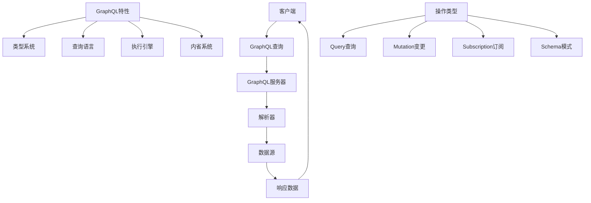

# GraphQL API

## 🎯 学习目标
- 掌握GraphQL的基本概念和语法
- 理解GraphQL与RESTful API的区别和优势
- 学会使用PHP实现GraphQL API
- 了解GraphQL的查询、变更和订阅操作

## 📚 核心概念

### GraphQL架构



### GraphQL vs REST对比

| 特性 | GraphQL | REST |
|------|---------|------|
| 数据获取 | 单次请求获取所需数据 | 多次请求获取相关数据 |
| 版本控制 | 通过Schema演进 | 通过URL版本控制 |
| 缓存 | 需要自定义缓存策略 | 利用HTTP缓存 |
| 学习曲线 | 较陡峭 | 相对平缓 |
| 工具支持 | 丰富的开发工具 | 成熟的工具生态 |
| 性能 | 减少网络请求 | 可能产生N+1问题 |

## 🔧 GraphQL实现

### GraphQL服务器基础
```php
<?php
// 1. GraphQL类型系统
class GraphQLType {
    protected $name;
    protected $description;
    protected $fields;
    
    public function __construct($name, $description = '') {
        $this->name = $name;
        $this->description = $description;
        $this->fields = [];
    }
    
    // 添加字段
    public function addField($name, $type, $description = '', $resolve = null) {
        $this->fields[$name] = [
            'type' => $type,
            'description' => $description,
            'resolve' => $resolve
        ];
        return $this;
    }
    
    // 获取字段
    public function getFields() {
        return $this->fields;
    }
    
    // 获取名称
    public function getName() {
        return $this->name;
    }
    
    // 获取描述
    public function getDescription() {
        return $this->description;
    }
}

// 2. GraphQL标量类型
class GraphQLScalarType extends GraphQLType {
    protected $serialize;
    protected $parseValue;
    protected $parseLiteral;
    
    public function __construct($name, $description = '', $serialize = null, $parseValue = null, $parseLiteral = null) {
        parent::__construct($name, $description);
        $this->serialize = $serialize;
        $this->parseValue = $parseValue;
        $this->parseLiteral = $parseLiteral;
    }
    
    public function serialize($value) {
        if ($this->serialize) {
            return call_user_func($this->serialize, $value);
        }
        return $value;
    }
    
    public function parseValue($value) {
        if ($this->parseValue) {
            return call_user_func($this->parseValue, $value);
        }
        return $value;
    }
    
    public function parseLiteral($ast) {
        if ($this->parseLiteral) {
            return call_user_func($this->parseLiteral, $ast);
        }
        return $ast->value;
    }
}

// 3. GraphQL对象类型
class GraphQLObjectType extends GraphQLType {
    public function __construct($name, $description = '') {
        parent::__construct($name, $description);
    }
}

// 4. GraphQL输入类型
class GraphQLInputType extends GraphQLType {
    public function __construct($name, $description = '') {
        parent::__construct($name, $description);
    }
}

// 5. GraphQL枚举类型
class GraphQLEnumType extends GraphQLType {
    protected $values;
    
    public function __construct($name, $description = '') {
        parent::__construct($name, $description);
        $this->values = [];
    }
    
    public function addValue($name, $value, $description = '') {
        $this->values[$name] = [
            'value' => $value,
            'description' => $description
        ];
        return $this;
    }
    
    public function getValues() {
        return $this->values;
    }
}

// 6. GraphQL Schema
class GraphQLSchema {
    private $queryType;
    private $mutationType;
    private $subscriptionType;
    private $types;
    
    public function __construct($queryType, $mutationType = null, $subscriptionType = null) {
        $this->queryType = $queryType;
        $this->mutationType = $mutationType;
        $this->subscriptionType = $subscriptionType;
        $this->types = [];
    }
    
    public function getQueryType() {
        return $this->queryType;
    }
    
    public function getMutationType() {
        return $this->mutationType;
    }
    
    public function getSubscriptionType() {
        return $this->subscriptionType;
    }
    
    public function addType($type) {
        $this->types[$type->getName()] = $type;
    }
    
    public function getType($name) {
        return $this->types[$name] ?? null;
    }
}

// 7. GraphQL解析器
class GraphQLResolver {
    private $resolvers;
    
    public function __construct() {
        $this->resolvers = [];
    }
    
    // 注册解析器
    public function register($type, $field, $resolver) {
        if (!isset($this->resolvers[$type])) {
            $this->resolvers[$type] = [];
        }
        $this->resolvers[$type][$field] = $resolver;
    }
    
    // 获取解析器
    public function getResolver($type, $field) {
        return $this->resolvers[$type][$field] ?? null;
    }
    
    // 解析字段
    public function resolve($type, $field, $source, $args, $context) {
        $resolver = $this->getResolver($type, $field);
        
        if ($resolver) {
            return call_user_func($resolver, $source, $args, $context);
        }
        
        // 默认解析器
        if (is_array($source) && isset($source[$field])) {
            return $source[$field];
        }
        
        if (is_object($source) && property_exists($source, $field)) {
            return $source->$field;
        }
        
        return null;
    }
}

// 8. GraphQL执行引擎
class GraphQLExecutor {
    private $schema;
    private $resolver;
    
    public function __construct($schema, $resolver) {
        $this->schema = $schema;
        $this->resolver = $resolver;
    }
    
    // 执行查询
    public function execute($query, $variables = [], $operationName = null) {
        try {
            $ast = $this->parse($query);
            $validationErrors = $this->validate($ast);
            
            if (!empty($validationErrors)) {
                return [
                    'errors' => $validationErrors
                ];
            }
            
            $result = $this->executeQuery($ast, $variables, $operationName);
            return $result;
            
        } catch (Exception $e) {
            return [
                'errors' => [
                    [
                        'message' => $e->getMessage(),
                        'locations' => [],
                        'path' => []
                    ]
                ]
            ];
        }
    }
    
    // 解析查询
    private function parse($query) {
        // 简化的解析器，实际应该使用完整的GraphQL解析器
        return [
            'kind' => 'Document',
            'definitions' => [
                [
                    'kind' => 'OperationDefinition',
                    'operation' => 'query',
                    'selectionSet' => [
                        'selections' => $this->parseSelections($query)
                    ]
                ]
            ]
        ];
    }
    
    // 解析选择集
    private function parseSelections($query) {
        $selections = [];
        
        // 简化的解析逻辑
        if (preg_match('/query\s*\{([^}]+)\}/', $query, $matches)) {
            $fields = explode(',', $matches[1]);
            foreach ($fields as $field) {
                $field = trim($field);
                if ($field) {
                    $selections[] = [
                        'kind' => 'Field',
                        'name' => ['value' => $field],
                        'arguments' => []
                    ];
                }
            }
        }
        
        return $selections;
    }
    
    // 验证查询
    private function validate($ast) {
        $errors = [];
        
        // 简化的验证逻辑
        foreach ($ast['definitions'] as $definition) {
            if ($definition['kind'] === 'OperationDefinition') {
                $operationErrors = $this->validateOperation($definition);
                $errors = array_merge($errors, $operationErrors);
            }
        }
        
        return $errors;
    }
    
    // 验证操作
    private function validateOperation($operation) {
        $errors = [];
        
        // 简化的验证逻辑
        if ($operation['operation'] === 'query') {
            $queryType = $this->schema->getQueryType();
            if (!$queryType) {
                $errors[] = [
                    'message' => 'Schema does not define a query type',
                    'locations' => [],
                    'path' => []
                ];
            }
        }
        
        return $errors;
    }
    
    // 执行查询
    private function executeQuery($ast, $variables, $operationName) {
        $operation = $ast['definitions'][0];
        $rootType = $this->schema->getQueryType();
        
        $result = $this->executeSelectionSet(
            $operation['selectionSet'],
            $rootType,
            null,
            $variables
        );
        
        return ['data' => $result];
    }
    
    // 执行选择集
    private function executeSelectionSet($selectionSet, $type, $source, $variables) {
        $result = [];
        
        foreach ($selectionSet['selections'] as $selection) {
            if ($selection['kind'] === 'Field') {
                $fieldName = $selection['name']['value'];
                $fieldResult = $this->executeField($selection, $type, $source, $variables);
                $result[$fieldName] = $fieldResult;
            }
        }
        
        return $result;
    }
    
    // 执行字段
    private function executeField($field, $type, $source, $variables) {
        $fieldName = $field['name']['value'];
        $fieldType = $type->getFields()[$fieldName] ?? null;
        
        if (!$fieldType) {
            return null;
        }
        
        $args = $this->getFieldArguments($field, $variables);
        $resolvedValue = $this->resolver->resolve($type->getName(), $fieldName, $source, $args, []);
        
        return $resolvedValue;
    }
    
    // 获取字段参数
    private function getFieldArguments($field, $variables) {
        $args = [];
        
        if (isset($field['arguments'])) {
            foreach ($field['arguments'] as $argument) {
                $name = $argument['name']['value'];
                $value = $this->getArgumentValue($argument['value'], $variables);
                $args[$name] = $value;
            }
        }
        
        return $args;
    }
    
    // 获取参数值
    private function getArgumentValue($value, $variables) {
        if ($value['kind'] === 'Variable') {
            $variableName = $value['name']['value'];
            return $variables[$variableName] ?? null;
        }
        
        return $value['value'] ?? null;
    }
}

// 9. GraphQL服务器
class GraphQLServer {
    private $schema;
    private $executor;
    
    public function __construct($schema) {
        $this->schema = $schema;
        $resolver = new GraphQLResolver();
        $this->executor = new GraphQLExecutor($schema, $resolver);
    }
    
    // 处理请求
    public function handleRequest() {
        $method = $_SERVER['REQUEST_METHOD'];
        $contentType = $_SERVER['CONTENT_TYPE'] ?? '';
        
        if ($method === 'GET') {
            $this->handleGetRequest();
        } elseif ($method === 'POST') {
            $this->handlePostRequest();
        } else {
            $this->sendError('Method not allowed', 405);
        }
    }
    
    // 处理GET请求
    private function handleGetRequest() {
        $query = $_GET['query'] ?? '';
        $variables = isset($_GET['variables']) ? json_decode($_GET['variables'], true) : [];
        $operationName = $_GET['operationName'] ?? null;
        
        if (!$query) {
            $this->sendError('Query parameter is required', 400);
            return;
        }
        
        $result = $this->executor->execute($query, $variables, $operationName);
        $this->sendResponse($result);
    }
    
    // 处理POST请求
    private function handlePostRequest() {
        $input = json_decode(file_get_contents('php://input'), true);
        
        if (!$input) {
            $this->sendError('Invalid JSON input', 400);
            return;
        }
        
        $query = $input['query'] ?? '';
        $variables = $input['variables'] ?? [];
        $operationName = $input['operationName'] ?? null;
        
        if (!$query) {
            $this->sendError('Query is required', 400);
            return;
        }
        
        $result = $this->executor->execute($query, $variables, $operationName);
        $this->sendResponse($result);
    }
    
    // 发送响应
    private function sendResponse($result) {
        header('Content-Type: application/json');
        echo json_encode($result, JSON_UNESCAPED_UNICODE);
        exit;
    }
    
    // 发送错误
    private function sendError($message, $statusCode = 400) {
        http_response_code($statusCode);
        header('Content-Type: application/json');
        echo json_encode(['error' => $message], JSON_UNESCAPED_UNICODE);
        exit;
    }
}

// 使用示例
echo "=== GraphQL API示例 ===\n";

try {
    // 定义标量类型
    $stringType = new GraphQLScalarType('String', 'String scalar type');
    $intType = new GraphQLScalarType('Int', 'Integer scalar type');
    $booleanType = new GraphQLScalarType('Boolean', 'Boolean scalar type');
    
    // 定义用户类型
    $userType = new GraphQLObjectType('User', 'User type');
    $userType->addField('id', $intType, 'User ID');
    $userType->addField('name', $stringType, 'User name');
    $userType->addField('email', $stringType, 'User email');
    
    // 定义查询类型
    $queryType = new GraphQLObjectType('Query', 'Root query type');
    $queryType->addField('user', $userType, 'Get user by ID');
    $queryType->addField('users', $userType, 'Get all users');
    
    // 创建Schema
    $schema = new GraphQLSchema($queryType);
    
    // 创建解析器
    $resolver = new GraphQLResolver();
    
    // 注册解析器
    $resolver->register('Query', 'user', function($source, $args, $context) {
        $userId = $args['id'] ?? 1;
        return [
            'id' => $userId,
            'name' => 'John Doe',
            'email' => 'john@example.com'
        ];
    });
    
    $resolver->register('Query', 'users', function($source, $args, $context) {
        return [
            [
                'id' => 1,
                'name' => 'John Doe',
                'email' => 'john@example.com'
            ],
            [
                'id' => 2,
                'name' => 'Jane Smith',
                'email' => 'jane@example.com'
            ]
        ];
    });
    
    // 创建执行器
    $executor = new GraphQLExecutor($schema, $resolver);
    
    // 执行查询
    $query = 'query { user { id name email } }';
    $result = $executor->execute($query);
    
    echo "GraphQL查询结果:\n";
    echo json_encode($result, JSON_PRETTY_PRINT | JSON_UNESCAPED_UNICODE) . "\n";
    
    // 执行另一个查询
    $query2 = 'query { users { id name email } }';
    $result2 = $executor->execute($query2);
    
    echo "\nGraphQL查询结果2:\n";
    echo json_encode($result2, JSON_PRETTY_PRINT | JSON_UNESCAPED_UNICODE) . "\n";
    
} catch (Exception $e) {
    echo "错误: " . $e->getMessage() . "\n";
}
?>
```

### GraphQL变更和订阅
```php
<?php
// 1. GraphQL变更类型
class GraphQLMutationType extends GraphQLObjectType {
    public function __construct($name = 'Mutation', $description = 'Root mutation type') {
        parent::__construct($name, $description);
    }
}

// 2. GraphQL订阅类型
class GraphQLSubscriptionType extends GraphQLObjectType {
    public function __construct($name = 'Subscription', $description = 'Root subscription type') {
        parent::__construct($name, $description);
    }
}

// 3. GraphQL变更解析器
class GraphQLMutationResolver {
    private $resolvers;
    
    public function __construct() {
        $this->resolvers = [];
    }
    
    // 注册变更解析器
    public function register($field, $resolver) {
        $this->resolvers[$field] = $resolver;
    }
    
    // 执行变更
    public function execute($field, $args, $context) {
        if (isset($this->resolvers[$field])) {
            return call_user_func($this->resolvers[$field], $args, $context);
        }
        
        throw new Exception("Mutation resolver not found for field: {$field}");
    }
}

// 4. GraphQL订阅管理器
class GraphQLSubscriptionManager {
    private $subscriptions;
    private $events;
    
    public function __construct() {
        $this->subscriptions = [];
        $this->events = [];
    }
    
    // 订阅事件
    public function subscribe($event, $callback) {
        if (!isset($this->subscriptions[$event])) {
            $this->subscriptions[$event] = [];
        }
        
        $this->subscriptions[$event][] = $callback;
    }
    
    // 发布事件
    public function publish($event, $data) {
        if (isset($this->subscriptions[$event])) {
            foreach ($this->subscriptions[$event] as $callback) {
                call_user_func($callback, $data);
            }
        }
    }
    
    // 取消订阅
    public function unsubscribe($event, $callback) {
        if (isset($this->subscriptions[$event])) {
            $index = array_search($callback, $this->subscriptions[$event]);
            if ($index !== false) {
                unset($this->subscriptions[$event][$index]);
            }
        }
    }
}

// 5. 用户变更控制器
class UserMutationController {
    private $users;
    
    public function __construct() {
        $this->users = [
            1 => ['id' => 1, 'name' => 'John Doe', 'email' => 'john@example.com'],
            2 => ['id' => 2, 'name' => 'Jane Smith', 'email' => 'jane@example.com']
        ];
    }
    
    // 创建用户
    public function createUser($args) {
        $id = max(array_keys($this->users)) + 1;
        $user = [
            'id' => $id,
            'name' => $args['name'],
            'email' => $args['email']
        ];
        
        $this->users[$id] = $user;
        
        return $user;
    }
    
    // 更新用户
    public function updateUser($args) {
        $id = $args['id'];
        
        if (!isset($this->users[$id])) {
            throw new Exception("User not found");
        }
        
        if (isset($args['name'])) {
            $this->users[$id]['name'] = $args['name'];
        }
        
        if (isset($args['email'])) {
            $this->users[$id]['email'] = $args['email'];
        }
        
        return $this->users[$id];
    }
    
    // 删除用户
    public function deleteUser($args) {
        $id = $args['id'];
        
        if (!isset($this->users[$id])) {
            throw new Exception("User not found");
        }
        
        $user = $this->users[$id];
        unset($this->users[$id]);
        
        return $user;
    }
    
    // 获取所有用户
    public function getUsers() {
        return array_values($this->users);
    }
    
    // 根据ID获取用户
    public function getUserById($id) {
        return $this->users[$id] ?? null;
    }
}

// 使用示例
echo "=== GraphQL变更和订阅示例 ===\n";

try {
    // 创建用户变更控制器
    $userController = new UserMutationController();
    
    // 创建变更解析器
    $mutationResolver = new GraphQLMutationResolver();
    
    // 注册变更解析器
    $mutationResolver->register('createUser', function($args, $context) use ($userController) {
        return $userController->createUser($args);
    });
    
    $mutationResolver->register('updateUser', function($args, $context) use ($userController) {
        return $userController->updateUser($args);
    });
    
    $mutationResolver->register('deleteUser', function($args, $context) use ($userController) {
        return $userController->deleteUser($args);
    });
    
    // 测试创建用户
    $createArgs = [
        'name' => 'Alice Brown',
        'email' => 'alice@example.com'
    ];
    
    $newUser = $mutationResolver->execute('createUser', $createArgs, []);
    echo "创建用户:\n";
    echo json_encode($newUser, JSON_PRETTY_PRINT | JSON_UNESCAPED_UNICODE) . "\n";
    
    // 测试更新用户
    $updateArgs = [
        'id' => $newUser['id'],
        'name' => 'Alice Johnson'
    ];
    
    $updatedUser = $mutationResolver->execute('updateUser', $updateArgs, []);
    echo "\n更新用户:\n";
    echo json_encode($updatedUser, JSON_PRETTY_PRINT | JSON_UNESCAPED_UNICODE) . "\n";
    
    // 测试删除用户
    $deleteArgs = ['id' => $newUser['id']];
    $deletedUser = $mutationResolver->execute('deleteUser', $deleteArgs, []);
    echo "\n删除用户:\n";
    echo json_encode($deletedUser, JSON_PRETTY_PRINT | JSON_UNESCAPED_UNICODE) . "\n";
    
    // 订阅管理器示例
    $subscriptionManager = new GraphQLSubscriptionManager();
    
    // 订阅用户创建事件
    $subscriptionManager->subscribe('user.created', function($data) {
        echo "用户创建事件: " . json_encode($data) . "\n";
    });
    
    // 订阅用户更新事件
    $subscriptionManager->subscribe('user.updated', function($data) {
        echo "用户更新事件: " . json_encode($data) . "\n";
    });
    
    // 发布事件
    $subscriptionManager->publish('user.created', ['id' => 1, 'name' => 'Test User']);
    $subscriptionManager->publish('user.updated', ['id' => 1, 'name' => 'Updated User']);
    
} catch (Exception $e) {
    echo "错误: " . $e->getMessage() . "\n";
}
?>
```

## 📊 最佳实践

### GraphQL最佳实践
```php
<?php
// GraphQL最佳实践

class GraphQLBestPractices {
    // 1. Schema设计原则
    public static function getSchemaDesignPrinciples() {
        return [
            '类型设计' => [
                '使用描述性名称' => '类型和字段名称应该清晰描述其用途',
                '避免深层嵌套' => '避免超过3-4层的嵌套结构',
                '使用接口' => '使用接口定义通用字段和行为',
                '枚举类型' => '使用枚举类型表示有限的选择'
            ],
            '字段设计' => [
                '单一职责' => '每个字段应该有单一明确的职责',
                '避免冗余' => '避免在多个地方重复相同的数据',
                '合理粒度' => '字段粒度应该适中，既不过细也不过粗',
                '向后兼容' => '新增字段时保持向后兼容性'
            ],
            '查询优化' => [
                '字段选择' => '允许客户端选择需要的字段',
                '分页支持' => '为列表查询提供分页功能',
                '过滤排序' => '提供灵活的过滤和排序选项',
                '批量查询' => '支持批量查询减少网络请求'
            ]
        ];
    }
    
    // 2. 性能优化策略
    public static function getPerformanceOptimizationStrategies() {
        return [
            '查询优化' => [
                '数据加载器' => '使用DataLoader避免N+1查询问题',
                '字段级缓存' => '实现字段级别的缓存机制',
                '查询复杂度' => '限制查询复杂度防止过度查询',
                '查询分析' => '分析查询性能并优化慢查询'
            ],
            '缓存策略' => [
                '查询缓存' => '缓存频繁执行的查询结果',
                '字段缓存' => '缓存计算昂贵的字段值',
                'CDN缓存' => '使用CDN缓存静态查询结果',
                '应用缓存' => '使用Redis等缓存查询结果'
            ],
            '数据库优化' => [
                '索引优化' => '为GraphQL查询创建适当的索引',
                '查询优化' => '优化数据库查询减少响应时间',
                '连接池' => '使用数据库连接池提高性能',
                '读写分离' => '实现读写分离提高并发性能'
            ]
        ];
    }
    
    // 3. 安全最佳实践
    public static function getSecurityBestPractices() {
        return [
            '查询安全' => [
                '查询深度限制' => '限制查询的嵌套深度',
                '查询复杂度限制' => '限制查询的复杂度',
                '字段访问控制' => '实现字段级别的访问控制',
                '查询白名单' => '使用查询白名单限制允许的查询'
            ],
            '认证授权' => [
                'JWT认证' => '使用JWT进行身份认证',
                '角色权限' => '实现基于角色的权限控制',
                '字段权限' => '实现字段级别的权限控制',
                '上下文传递' => '在解析器中传递用户上下文'
            ],
            '数据验证' => [
                '输入验证' => '验证所有输入参数',
                '类型检查' => '严格检查数据类型',
                '业务规则' => '实现业务规则验证',
                '错误处理' => '安全地处理错误信息'
            ]
        ];
    }
    
    // 4. 开发工具和测试
    public static function getDevelopmentToolsAndTesting() {
        return [
            '开发工具' => [
                'GraphiQL' => '使用GraphiQL进行查询测试',
                'Schema生成' => '自动生成Schema文档',
                '类型检查' => '使用TypeScript进行类型检查',
                '代码生成' => '使用代码生成工具生成类型定义'
            ],
            '测试策略' => [
                '单元测试' => '为解析器编写单元测试',
                '集成测试' => '测试完整的GraphQL查询',
                '性能测试' => '测试查询性能',
                '安全测试' => '测试查询安全性'
            ],
            '监控和调试' => [
                '查询日志' => '记录所有GraphQL查询',
                '性能监控' => '监控查询执行时间',
                '错误追踪' => '追踪和记录错误信息',
                '使用分析' => '分析API使用情况'
            ]
        ];
    }
}

// 使用示例
echo "=== GraphQL最佳实践示例 ===\n";

try {
    // Schema设计原则
    $schemaDesign = GraphQLBestPractices::getSchemaDesignPrinciples();
    echo "Schema设计原则:\n";
    foreach ($schemaDesign as $category => $principles) {
        echo "  $category:\n";
        foreach ($principles as $principle => $description) {
            echo "    - $principle: $description\n";
        }
        echo "\n";
    }
    
    // 性能优化策略
    $performanceOptimization = GraphQLBestPractices::getPerformanceOptimizationStrategies();
    echo "性能优化策略:\n";
    foreach ($performanceOptimization as $category => $strategies) {
        echo "  $category:\n";
        foreach ($strategies as $strategy => $description) {
            echo "    - $strategy: $description\n";
        }
        echo "\n";
    }
    
    // 安全最佳实践
    $securityPractices = GraphQLBestPractices::getSecurityBestPractices();
    echo "安全最佳实践:\n";
    foreach ($securityPractices as $category => $practices) {
        echo "  $category:\n";
        foreach ($practices as $practice => $description) {
            echo "    - $practice: $description\n";
        }
        echo "\n";
    }
    
    // 开发工具和测试
    $developmentTools = GraphQLBestPractices::getDevelopmentToolsAndTesting();
    echo "开发工具和测试:\n";
    foreach ($developmentTools as $category => $tools) {
        echo "  $category:\n";
        foreach ($tools as $tool => $description) {
            echo "    - $tool: $description\n";
        }
        echo "\n";
    }
    
} catch (Exception $e) {
    echo "错误: " . $e->getMessage() . "\n";
}
?>
```

## 🎓 学习建议

### 费曼学习法应用
1. **选择概念**: 选择GraphQL中的核心概念
2. **简化解释**: 用简单语言解释GraphQL的重要性
3. **识别盲点**: 发现理解不深入的地方
4. **重新学习**: 针对盲点进行深入学习

### 刻意练习重点
1. **Schema设计**: 掌握GraphQL Schema的设计方法
2. **查询优化**: 学会优化GraphQL查询性能
3. **变更操作**: 理解GraphQL变更操作的设计
4. **订阅机制**: 掌握GraphQL订阅功能的实现

## 🔗 相关链接
- [[01-RESTful API设计|RESTful API设计]]
- [[03-API文档编写|API文档编写]]
- [[04-API版本控制|API版本控制]]
- [[05-微服务架构|微服务架构]]
- [[06-API安全与认证|API安全与认证]]
- [[07-API性能优化|API性能优化]]
