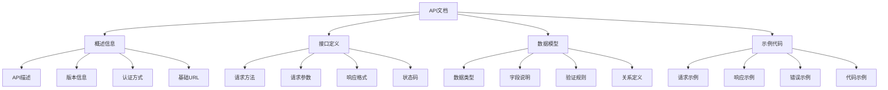

# API文档编写

## 🎯 学习目标
- 掌握API文档编写的基本原则和最佳实践
- 理解OpenAPI规范的使用方法
- 学会使用工具自动生成API文档
- 了解API文档的维护和更新策略

## 📚 核心概念

### API文档架构



### API文档类型对比

| 文档类型 | 描述 | 优点 | 缺点 | 适用场景 |
|----------|------|------|------|----------|
| OpenAPI | 标准化规范 | 工具支持丰富 | 学习成本高 | 企业级API |
| Markdown | 简单易读 | 易于编写维护 | 缺乏标准化 | 小型项目 |
| 交互式文档 | 可在线测试 | 用户体验好 | 开发成本高 | 对外API |
| 代码注释 | 与代码同步 | 维护成本低 | 格式不统一 | 内部API |

## 🔧 API文档实现

### OpenAPI文档生成器
```php
<?php
// 1. OpenAPI文档生成器
class OpenAPIGenerator {
    private $openapi;
    private $paths;
    private $components;
    
    public function __construct($title, $version, $description = '') {
        $this->openapi = [
            'openapi' => '3.0.0',
            'info' => [
                'title' => $title,
                'version' => $version,
                'description' => $description
            ],
            'servers' => [],
            'paths' => [],
            'components' => [
                'schemas' => [],
                'securitySchemes' => []
            ]
        ];
        $this->paths = [];
        $this->components = [];
    }
    
    // 添加服务器
    public function addServer($url, $description = '') {
        $this->openapi['servers'][] = [
            'url' => $url,
            'description' => $description
        ];
    }
    
    // 添加路径
    public function addPath($path, $method, $operation) {
        if (!isset($this->openapi['paths'][$path])) {
            $this->openapi['paths'][$path] = [];
        }
        
        $this->openapi['paths'][$path][strtolower($method)] = $operation;
    }
    
    // 添加组件
    public function addComponent($type, $name, $definition) {
        if (!isset($this->openapi['components'][$type])) {
            $this->openapi['components'][$type] = [];
        }
        
        $this->openapi['components'][$type][$name] = $definition;
    }
    
    // 添加安全方案
    public function addSecurityScheme($name, $scheme) {
        $this->addComponent('securitySchemes', $name, $scheme);
    }
    
    // 生成文档
    public function generate() {
        return $this->openapi;
    }
    
    // 保存为JSON
    public function saveAsJson($filename) {
        $json = json_encode($this->openapi, JSON_PRETTY_PRINT | JSON_UNESCAPED_UNICODE);
        return file_put_contents($filename, $json);
    }
    
    // 保存为YAML
    public function saveAsYaml($filename) {
        $yaml = $this->arrayToYaml($this->openapi);
        return file_put_contents($filename, $yaml);
    }
    
    // 数组转YAML
    private function arrayToYaml($array, $indent = 0) {
        $yaml = '';
        $spaces = str_repeat('  ', $indent);
        
        foreach ($array as $key => $value) {
            if (is_array($value)) {
                if ($this->isAssociativeArray($value)) {
                    $yaml .= $spaces . $key . ":\n";
                    $yaml .= $this->arrayToYaml($value, $indent + 1);
                } else {
                    foreach ($value as $item) {
                        $yaml .= $spaces . "- " . (is_array($item) ? $this->arrayToYaml($item, $indent + 1) : $item) . "\n";
                    }
                }
            } else {
                $yaml .= $spaces . $key . ": " . $value . "\n";
            }
        }
        
        return $yaml;
    }
    
    // 检查是否为关联数组
    private function isAssociativeArray($array) {
        return array_keys($array) !== range(0, count($array) - 1);
    }
}

// 2. API操作构建器
class APIOperationBuilder {
    private $operation;
    
    public function __construct($summary = '', $description = '') {
        $this->operation = [
            'summary' => $summary,
            'description' => $description,
            'parameters' => [],
            'requestBody' => null,
            'responses' => [],
            'tags' => [],
            'security' => []
        ];
    }
    
    // 设置摘要
    public function summary($summary) {
        $this->operation['summary'] = $summary;
        return $this;
    }
    
    // 设置描述
    public function description($description) {
        $this->operation['description'] = $description;
        return $this;
    }
    
    // 添加参数
    public function addParameter($name, $in, $description = '', $required = false, $schema = null) {
        $parameter = [
            'name' => $name,
            'in' => $in,
            'description' => $description,
            'required' => $required
        ];
        
        if ($schema) {
            $parameter['schema'] = $schema;
        }
        
        $this->operation['parameters'][] = $parameter;
        return $this;
    }
    
    // 设置请求体
    public function requestBody($description, $content, $required = false) {
        $this->operation['requestBody'] = [
            'description' => $description,
            'content' => $content,
            'required' => $required
        ];
        return $this;
    }
    
    // 添加响应
    public function addResponse($statusCode, $description, $content = null) {
        $response = [
            'description' => $description
        ];
        
        if ($content) {
            $response['content'] = $content;
        }
        
        $this->operation['responses'][$statusCode] = $response;
        return $this;
    }
    
    // 添加标签
    public function addTag($tag) {
        $this->operation['tags'][] = $tag;
        return $this;
    }
    
    // 添加安全要求
    public function addSecurity($name, $scopes = []) {
        $this->operation['security'][] = [$name => $scopes];
        return $this;
    }
    
    // 构建操作
    public function build() {
        return $this->operation;
    }
}

// 3. Schema构建器
class SchemaBuilder {
    private $schema;
    
    public function __construct($type = 'object') {
        $this->schema = [
            'type' => $type
        ];
    }
    
    // 设置类型
    public function type($type) {
        $this->schema['type'] = $type;
        return $this;
    }
    
    // 设置描述
    public function description($description) {
        $this->schema['description'] = $description;
        return $this;
    }
    
    // 添加属性
    public function addProperty($name, $property) {
        if (!isset($this->schema['properties'])) {
            $this->schema['properties'] = [];
        }
        
        $this->schema['properties'][$name] = $property;
        return $this;
    }
    
    // 设置必需字段
    public function required($fields) {
        $this->schema['required'] = is_array($fields) ? $fields : [$fields];
        return $this;
    }
    
    // 设置示例
    public function example($example) {
        $this->schema['example'] = $example;
        return $this;
    }
    
    // 构建Schema
    public function build() {
        return $this->schema;
    }
}

// 4. 用户API文档生成器
class UserAPIDocumentation {
    private $generator;
    
    public function __construct() {
        $this->generator = new OpenAPIGenerator(
            'User API',
            '1.0.0',
            '用户管理API文档'
        );
        
        $this->setupServers();
        $this->setupSecurity();
        $this->setupSchemas();
        $this->setupPaths();
    }
    
    // 设置服务器
    private function setupServers() {
        $this->generator->addServer('https://api.example.com', '生产环境');
        $this->generator->addServer('https://staging-api.example.com', '测试环境');
    }
    
    // 设置安全方案
    private function setupSecurity() {
        $this->generator->addSecurityScheme('bearerAuth', [
            'type' => 'http',
            'scheme' => 'bearer',
            'bearerFormat' => 'JWT'
        ]);
        
        $this->generator->addSecurityScheme('apiKey', [
            'type' => 'apiKey',
            'in' => 'header',
            'name' => 'X-API-Key'
        ]);
    }
    
    // 设置数据模型
    private function setupSchemas() {
        // 用户模型
        $userSchema = (new SchemaBuilder())
            ->description('用户信息')
            ->addProperty('id', [
                'type' => 'integer',
                'description' => '用户ID',
                'example' => 1
            ])
            ->addProperty('name', [
                'type' => 'string',
                'description' => '用户姓名',
                'example' => 'John Doe'
            ])
            ->addProperty('email', [
                'type' => 'string',
                'format' => 'email',
                'description' => '用户邮箱',
                'example' => 'john@example.com'
            ])
            ->addProperty('created_at', [
                'type' => 'string',
                'format' => 'date-time',
                'description' => '创建时间',
                'example' => '2023-01-01T00:00:00Z'
            ])
            ->required(['id', 'name', 'email'])
            ->build();
        
        $this->generator->addComponent('schemas', 'User', $userSchema);
        
        // 用户列表模型
        $userListSchema = (new SchemaBuilder())
            ->description('用户列表')
            ->addProperty('users', [
                'type' => 'array',
                'items' => ['$ref' => '#/components/schemas/User']
            ])
            ->addProperty('total', [
                'type' => 'integer',
                'description' => '总数量',
                'example' => 100
            ])
            ->addProperty('page', [
                'type' => 'integer',
                'description' => '当前页码',
                'example' => 1
            ])
            ->addProperty('limit', [
                'type' => 'integer',
                'description' => '每页数量',
                'example' => 10
            ])
            ->required(['users', 'total', 'page', 'limit'])
            ->build();
        
        $this->generator->addComponent('schemas', 'UserList', $userListSchema);
        
        // 错误模型
        $errorSchema = (new SchemaBuilder())
            ->description('错误信息')
            ->addProperty('error', [
                'type' => 'string',
                'description' => '错误消息',
                'example' => 'User not found'
            ])
            ->addProperty('code', [
                'type' => 'integer',
                'description' => '错误代码',
                'example' => 404
            ])
            ->required(['error', 'code'])
            ->build();
        
        $this->generator->addComponent('schemas', 'Error', $errorSchema);
    }
    
    // 设置路径
    private function setupPaths() {
        // GET /users - 获取用户列表
        $getUsersOperation = (new APIOperationBuilder('获取用户列表', '获取所有用户的列表'))
            ->addParameter('page', 'query', '页码', false, ['type' => 'integer', 'default' => 1])
            ->addParameter('limit', 'query', '每页数量', false, ['type' => 'integer', 'default' => 10])
            ->addResponse('200', '成功', [
                'application/json' => [
                    'schema' => ['$ref' => '#/components/schemas/UserList']
                ]
            ])
            ->addResponse('401', '未授权', [
                'application/json' => [
                    'schema' => ['$ref' => '#/components/schemas/Error']
                ]
            ])
            ->addTag('users')
            ->addSecurity('bearerAuth')
            ->build();
        
        $this->generator->addPath('/users', 'GET', $getUsersOperation);
        
        // GET /users/{id} - 获取单个用户
        $getUserOperation = (new APIOperationBuilder('获取用户详情', '根据ID获取用户详细信息'))
            ->addParameter('id', 'path', '用户ID', true, ['type' => 'integer'])
            ->addResponse('200', '成功', [
                'application/json' => [
                    'schema' => ['$ref' => '#/components/schemas/User']
                ]
            ])
            ->addResponse('404', '用户不存在', [
                'application/json' => [
                    'schema' => ['$ref' => '#/components/schemas/Error']
                ]
            ])
            ->addTag('users')
            ->addSecurity('bearerAuth')
            ->build();
        
        $this->generator->addPath('/users/{id}', 'GET', $getUserOperation);
        
        // POST /users - 创建用户
        $createUserOperation = (new APIOperationBuilder('创建用户', '创建新用户'))
            ->requestBody('用户信息', [
                'application/json' => [
                    'schema' => [
                        'type' => 'object',
                        'properties' => [
                            'name' => [
                                'type' => 'string',
                                'description' => '用户姓名',
                                'example' => 'John Doe'
                            ],
                            'email' => [
                                'type' => 'string',
                                'format' => 'email',
                                'description' => '用户邮箱',
                                'example' => 'john@example.com'
                            ]
                        ],
                        'required' => ['name', 'email']
                    ]
                ]
            ], true)
            ->addResponse('201', '创建成功', [
                'application/json' => [
                    'schema' => ['$ref' => '#/components/schemas/User']
                ]
            ])
            ->addResponse('400', '请求参数错误', [
                'application/json' => [
                    'schema' => ['$ref' => '#/components/schemas/Error']
                ]
            ])
            ->addTag('users')
            ->addSecurity('bearerAuth')
            ->build();
        
        $this->generator->addPath('/users', 'POST', $createUserOperation);
        
        // PUT /users/{id} - 更新用户
        $updateUserOperation = (new APIOperationBuilder('更新用户', '更新用户信息'))
            ->addParameter('id', 'path', '用户ID', true, ['type' => 'integer'])
            ->requestBody('用户信息', [
                'application/json' => [
                    'schema' => [
                        'type' => 'object',
                        'properties' => [
                            'name' => [
                                'type' => 'string',
                                'description' => '用户姓名',
                                'example' => 'John Doe'
                            ],
                            'email' => [
                                'type' => 'string',
                                'format' => 'email',
                                'description' => '用户邮箱',
                                'example' => 'john@example.com'
                            ]
                        ]
                    ]
                ]
            ], true)
            ->addResponse('200', '更新成功', [
                'application/json' => [
                    'schema' => ['$ref' => '#/components/schemas/User']
                ]
            ])
            ->addResponse('404', '用户不存在', [
                'application/json' => [
                    'schema' => ['$ref' => '#/components/schemas/Error']
                ]
            ])
            ->addTag('users')
            ->addSecurity('bearerAuth')
            ->build();
        
        $this->generator->addPath('/users/{id}', 'PUT', $updateUserOperation);
        
        // DELETE /users/{id} - 删除用户
        $deleteUserOperation = (new APIOperationBuilder('删除用户', '删除指定用户'))
            ->addParameter('id', 'path', '用户ID', true, ['type' => 'integer'])
            ->addResponse('204', '删除成功')
            ->addResponse('404', '用户不存在', [
                'application/json' => [
                    'schema' => ['$ref' => '#/components/schemas/Error']
                ]
            ])
            ->addTag('users')
            ->addSecurity('bearerAuth')
            ->build();
        
        $this->generator->addPath('/users/{id}', 'DELETE', $deleteUserOperation);
    }
    
    // 生成文档
    public function generate() {
        return $this->generator->generate();
    }
    
    // 保存文档
    public function save($filename, $format = 'json') {
        if ($format === 'yaml') {
            return $this->generator->saveAsYaml($filename);
        } else {
            return $this->generator->saveAsJson($filename);
        }
    }
}

// 使用示例
echo "=== API文档编写示例 ===\n";

try {
    // 创建用户API文档
    $userAPI = new UserAPIDocumentation();
    
    // 生成文档
    $documentation = $userAPI->generate();
    
    echo "OpenAPI文档生成成功\n";
    echo "标题: " . $documentation['info']['title'] . "\n";
    echo "版本: " . $documentation['info']['version'] . "\n";
    echo "路径数量: " . count($documentation['paths']) . "\n";
    echo "组件数量: " . count($documentation['components']['schemas']) . "\n";
    
    // 保存为JSON
    $userAPI->save('user-api.json', 'json');
    echo "JSON文档已保存到 user-api.json\n";
    
    // 保存为YAML
    $userAPI->save('user-api.yaml', 'yaml');
    echo "YAML文档已保存到 user-api.yaml\n";
    
    // 显示部分文档内容
    echo "\n文档内容预览:\n";
    echo json_encode($documentation['paths']['/users'], JSON_PRETTY_PRINT | JSON_UNESCAPED_UNICODE) . "\n";
    
} catch (Exception $e) {
    echo "错误: " . $e->getMessage() . "\n";
}
?>
```

### 交互式文档生成器
```php
<?php
// 1. 交互式文档生成器
class InteractiveDocumentationGenerator {
    private $title;
    private $version;
    private $description;
    private $endpoints;
    private $schemas;
    
    public function __construct($title, $version, $description = '') {
        $this->title = $title;
        $this->version = $version;
        $this->description = $description;
        $this->endpoints = [];
        $this->schemas = [];
    }
    
    // 添加端点
    public function addEndpoint($method, $path, $description, $parameters = [], $responses = []) {
        $this->endpoints[] = [
            'method' => strtoupper($method),
            'path' => $path,
            'description' => $description,
            'parameters' => $parameters,
            'responses' => $responses
        ];
    }
    
    // 添加Schema
    public function addSchema($name, $schema) {
        $this->schemas[$name] = $schema;
    }
    
    // 生成HTML文档
    public function generateHTML() {
        $html = $this->getHTMLTemplate();
        
        // 替换标题
        $html = str_replace('{{TITLE}}', $this->title, $html);
        $html = str_replace('{{VERSION}}', $this->version, $html);
        $html = str_replace('{{DESCRIPTION}}', $this->description, $html);
        
        // 生成端点HTML
        $endpointsHTML = $this->generateEndpointsHTML();
        $html = str_replace('{{ENDPOINTS}}', $endpointsHTML, $html);
        
        // 生成Schema HTML
        $schemasHTML = $this->generateSchemasHTML();
        $html = str_replace('{{SCHEMAS}}', $schemasHTML, $html);
        
        return $html;
    }
    
    // 获取HTML模板
    private function getHTMLTemplate() {
        return '<!DOCTYPE html>
<html lang="zh-CN">
<head>
    <meta charset="UTF-8">
    <meta name="viewport" content="width=device-width, initial-scale=1.0">
    <title>{{TITLE}} - API文档</title>
    <style>
        body { font-family: Arial, sans-serif; margin: 0; padding: 20px; background-color: #f5f5f5; }
        .container { max-width: 1200px; margin: 0 auto; background: white; padding: 20px; border-radius: 8px; box-shadow: 0 2px 10px rgba(0,0,0,0.1); }
        .header { border-bottom: 2px solid #007bff; padding-bottom: 20px; margin-bottom: 30px; }
        .title { color: #007bff; margin: 0; font-size: 2.5em; }
        .version { color: #666; font-size: 1.2em; margin: 10px 0; }
        .description { color: #333; font-size: 1.1em; line-height: 1.6; }
        .endpoint { margin-bottom: 30px; padding: 20px; border: 1px solid #ddd; border-radius: 8px; background: #fafafa; }
        .endpoint-header { display: flex; align-items: center; margin-bottom: 15px; }
        .method { padding: 5px 10px; border-radius: 4px; color: white; font-weight: bold; margin-right: 15px; }
        .method.get { background-color: #28a745; }
        .method.post { background-color: #007bff; }
        .method.put { background-color: #ffc107; color: #000; }
        .method.delete { background-color: #dc3545; }
        .path { font-family: monospace; font-size: 1.2em; font-weight: bold; }
        .description { margin: 15px 0; color: #555; }
        .parameters, .responses { margin: 15px 0; }
        .section-title { font-weight: bold; color: #333; margin-bottom: 10px; }
        .parameter, .response { margin: 10px 0; padding: 10px; background: white; border-radius: 4px; border-left: 4px solid #007bff; }
        .parameter-name, .response-code { font-weight: bold; color: #007bff; }
        .parameter-type, .response-type { color: #666; font-style: italic; }
        .schema { margin: 20px 0; padding: 15px; background: #f8f9fa; border-radius: 4px; }
        .schema-name { font-weight: bold; color: #007bff; margin-bottom: 10px; }
        .schema-property { margin: 5px 0; padding-left: 20px; }
        .test-section { margin-top: 20px; padding: 15px; background: #e9ecef; border-radius: 4px; }
        .test-button { background: #007bff; color: white; border: none; padding: 10px 20px; border-radius: 4px; cursor: pointer; }
        .test-button:hover { background: #0056b3; }
        .test-result { margin-top: 15px; padding: 10px; background: white; border-radius: 4px; display: none; }
    </style>
</head>
<body>
    <div class="container">
        <div class="header">
            <h1 class="title">{{TITLE}}</h1>
            <div class="version">版本: {{VERSION}}</div>
            <div class="description">{{DESCRIPTION}}</div>
        </div>
        
        <div class="endpoints">
            <h2>API端点</h2>
            {{ENDPOINTS}}
        </div>
        
        <div class="schemas">
            <h2>数据模型</h2>
            {{SCHEMAS}}
        </div>
    </div>
    
    <script>
        function testEndpoint(method, path) {
            const resultDiv = document.getElementById("result-" + path.replace(/[^a-zA-Z0-9]/g, ""));
            resultDiv.style.display = "block";
            resultDiv.innerHTML = "正在测试...";
            
            // 模拟API调用
            setTimeout(() => {
                resultDiv.innerHTML = "测试结果: 成功 (模拟)";
            }, 1000);
        }
    </script>
</body>
</html>';
    }
    
    // 生成端点HTML
    private function generateEndpointsHTML() {
        $html = '';
        
        foreach ($this->endpoints as $endpoint) {
            $html .= '<div class="endpoint">';
            $html .= '<div class="endpoint-header">';
            $html .= '<span class="method ' . strtolower($endpoint['method']) . '">' . $endpoint['method'] . '</span>';
            $html .= '<span class="path">' . $endpoint['path'] . '</span>';
            $html .= '</div>';
            
            $html .= '<div class="description">' . $endpoint['description'] . '</div>';
            
            if (!empty($endpoint['parameters'])) {
                $html .= '<div class="parameters">';
                $html .= '<div class="section-title">参数</div>';
                foreach ($endpoint['parameters'] as $param) {
                    $html .= '<div class="parameter">';
                    $html .= '<span class="parameter-name">' . $param['name'] . '</span>';
                    $html .= ' <span class="parameter-type">(' . $param['type'] . ')</span>';
                    if (isset($param['description'])) {
                        $html .= ' - ' . $param['description'];
                    }
                    $html .= '</div>';
                }
                $html .= '</div>';
            }
            
            if (!empty($endpoint['responses'])) {
                $html .= '<div class="responses">';
                $html .= '<div class="section-title">响应</div>';
                foreach ($endpoint['responses'] as $code => $response) {
                    $html .= '<div class="response">';
                    $html .= '<span class="response-code">' . $code . '</span>';
                    if (isset($response['description'])) {
                        $html .= ' - ' . $response['description'];
                    }
                    $html .= '</div>';
                }
                $html .= '</div>';
            }
            
            // 添加测试按钮
            $html .= '<div class="test-section">';
            $html .= '<button class="test-button" onclick="testEndpoint(\'' . $endpoint['method'] . '\', \'' . $endpoint['path'] . '\')">测试接口</button>';
            $html .= '<div class="test-result" id="result-' . str_replace(['/', '{', '}'], ['', '', ''], $endpoint['path']) . '"></div>';
            $html .= '</div>';
            
            $html .= '</div>';
        }
        
        return $html;
    }
    
    // 生成Schema HTML
    private function generateSchemasHTML() {
        $html = '';
        
        foreach ($this->schemas as $name => $schema) {
            $html .= '<div class="schema">';
            $html .= '<div class="schema-name">' . $name . '</div>';
            
            if (isset($schema['properties'])) {
                foreach ($schema['properties'] as $propName => $prop) {
                    $html .= '<div class="schema-property">';
                    $html .= '<strong>' . $propName . '</strong>';
                    if (isset($prop['type'])) {
                        $html .= ' (' . $prop['type'] . ')';
                    }
                    if (isset($prop['description'])) {
                        $html .= ' - ' . $prop['description'];
                    }
                    $html .= '</div>';
                }
            }
            
            $html .= '</div>';
        }
        
        return $html;
    }
    
    // 保存HTML文档
    public function saveHTML($filename) {
        $html = $this->generateHTML();
        return file_put_contents($filename, $html);
    }
}

// 使用示例
echo "=== 交互式文档生成示例 ===\n";

try {
    // 创建交互式文档生成器
    $docGenerator = new InteractiveDocumentationGenerator(
        '用户管理API',
        '1.0.0',
        '提供用户管理功能的RESTful API'
    );
    
    // 添加端点
    $docGenerator->addEndpoint(
        'GET',
        '/users',
        '获取用户列表',
        [
            ['name' => 'page', 'type' => 'integer', 'description' => '页码'],
            ['name' => 'limit', 'type' => 'integer', 'description' => '每页数量']
        ],
        [
            '200' => ['description' => '成功获取用户列表'],
            '401' => ['description' => '未授权']
        ]
    );
    
    $docGenerator->addEndpoint(
        'POST',
        '/users',
        '创建新用户',
        [],
        [
            '201' => ['description' => '用户创建成功'],
            '400' => ['description' => '请求参数错误']
        ]
    );
    
    $docGenerator->addEndpoint(
        'GET',
        '/users/{id}',
        '获取用户详情',
        [
            ['name' => 'id', 'type' => 'integer', 'description' => '用户ID']
        ],
        [
            '200' => ['description' => '成功获取用户详情'],
            '404' => ['description' => '用户不存在']
        ]
    );
    
    // 添加Schema
    $docGenerator->addSchema('User', [
        'properties' => [
            'id' => ['type' => 'integer', 'description' => '用户ID'],
            'name' => ['type' => 'string', 'description' => '用户姓名'],
            'email' => ['type' => 'string', 'description' => '用户邮箱'],
            'created_at' => ['type' => 'string', 'description' => '创建时间']
        ]
    ]);
    
    // 生成并保存HTML文档
    $docGenerator->saveHTML('api-documentation.html');
    echo "交互式文档已生成并保存到 api-documentation.html\n";
    
    // 显示部分内容
    $html = $docGenerator->generateHTML();
    echo "文档大小: " . strlen($html) . " 字节\n";
    echo "包含端点数量: " . substr_count($html, 'class="endpoint"') . "\n";
    
} catch (Exception $e) {
    echo "错误: " . $e->getMessage() . "\n";
}
?>
```

## 📊 最佳实践

### API文档编写最佳实践
```php
<?php
// API文档编写最佳实践

class APIDocumentationBestPractices {
    // 1. 文档结构原则
    public static function getDocumentationStructurePrinciples() {
        return [
            '信息完整性' => [
                'API概述' => '提供清晰的API概述和用途说明',
                '认证方式' => '详细说明认证和授权方式',
                '基础URL' => '提供API的基础URL和版本信息',
                '错误处理' => '说明错误码和错误处理方式'
            ],
            '接口描述' => [
                '请求方法' => '明确说明HTTP请求方法',
                '请求参数' => '详细描述所有请求参数',
                '响应格式' => '提供完整的响应格式说明',
                '状态码' => '列出所有可能的HTTP状态码'
            ],
            '示例代码' => [
                '请求示例' => '提供完整的请求示例',
                '响应示例' => '提供真实的响应示例',
                '错误示例' => '提供错误情况的示例',
                '多语言示例' => '提供多种编程语言的示例'
            ],
            '数据模型' => [
                '字段说明' => '详细说明每个字段的含义',
                '数据类型' => '明确指定数据类型和格式',
                '验证规则' => '说明数据验证规则',
                '关系定义' => '描述数据之间的关系'
            ]
        ];
    }
    
    // 2. 文档维护策略
    public static function getDocumentationMaintenanceStrategies() {
        return [
            '版本控制' => [
                '文档版本' => '为文档建立版本控制系统',
                '变更记录' => '记录每次文档变更的内容',
                '向后兼容' => '保持向后兼容性说明',
                '废弃通知' => '及时通知废弃的接口'
            ],
            '自动化生成' => [
                '代码注释' => '从代码注释自动生成文档',
                'Schema驱动' => '基于Schema自动生成文档',
                '测试用例' => '从测试用例生成示例',
                'CI/CD集成' => '在CI/CD流程中自动更新文档'
            ],
            '质量保证' => [
                '文档审查' => '建立文档审查流程',
                '准确性验证' => '定期验证文档的准确性',
                '用户反馈' => '收集用户反馈改进文档',
                '定期更新' => '定期更新和维护文档'
            ]
        ];
    }
    
    // 3. 用户体验优化
    public static function getUserExperienceOptimization() {
        return [
            '可读性' => [
                '清晰结构' => '使用清晰的文档结构',
                '简洁语言' => '使用简洁明了的语言',
                '视觉设计' => '使用良好的视觉设计',
                '导航便利' => '提供便利的导航功能'
            ],
            '交互性' => [
                '在线测试' => '提供在线API测试功能',
                '代码生成' => '提供代码生成工具',
                '搜索功能' => '提供强大的搜索功能',
                '收藏功能' => '允许用户收藏常用接口'
            ],
            '多语言支持' => [
                '国际化' => '支持多语言文档',
                '本地化' => '提供本地化的示例',
                '文化适应' => '适应不同文化背景',
                '术语统一' => '统一技术术语翻译'
            ]
        ];
    }
    
    // 4. 工具和平台
    public static function getToolsAndPlatforms() {
        return [
            '文档生成工具' => [
                'Swagger/OpenAPI' => '最流行的API文档工具',
                'Postman' => 'API测试和文档工具',
                'Insomnia' => 'API客户端和文档工具',
                'Apiary' => '在线API文档平台'
            ],
            '文档平台' => [
                'GitBook' => '现代化的文档平台',
                'Confluence' => '企业级文档平台',
                'Notion' => '协作式文档平台',
                'GitHub Pages' => '基于Git的文档托管'
            ],
            '自动化工具' => [
                'Docusaurus' => 'Facebook开源的文档生成器',
                'VuePress' => 'Vue.js驱动的文档生成器',
                'MkDocs' => 'Python驱动的文档生成器',
                'Sphinx' => 'Python文档生成工具'
            ]
        ];
    }
}

// 使用示例
echo "=== API文档编写最佳实践示例 ===\n";

try {
    // 文档结构原则
    $structurePrinciples = APIDocumentationBestPractices::getDocumentationStructurePrinciples();
    echo "文档结构原则:\n";
    foreach ($structurePrinciples as $category => $principles) {
        echo "  $category:\n";
        foreach ($principles as $principle => $description) {
            echo "    - $principle: $description\n";
        }
        echo "\n";
    }
    
    // 文档维护策略
    $maintenanceStrategies = APIDocumentationBestPractices::getDocumentationMaintenanceStrategies();
    echo "文档维护策略:\n";
    foreach ($maintenanceStrategies as $category => $strategies) {
        echo "  $category:\n";
        foreach ($strategies as $strategy => $description) {
            echo "    - $strategy: $description\n";
        }
        echo "\n";
    }
    
    // 用户体验优化
    $userExperienceOptimization = APIDocumentationBestPractices::getUserExperienceOptimization();
    echo "用户体验优化:\n";
    foreach ($userExperienceOptimization as $category => $optimizations) {
        echo "  $category:\n";
        foreach ($optimizations as $optimization => $description) {
            echo "    - $optimization: $description\n";
        }
        echo "\n";
    }
    
    // 工具和平台
    $toolsAndPlatforms = APIDocumentationBestPractices::getToolsAndPlatforms();
    echo "工具和平台:\n";
    foreach ($toolsAndPlatforms as $category => $tools) {
        echo "  $category:\n";
        foreach ($tools as $tool => $description) {
            echo "    - $tool: $description\n";
        }
        echo "\n";
    }
    
} catch (Exception $e) {
    echo "错误: " . $e->getMessage() . "\n";
}
?>
```

## 🎓 学习建议

### 费曼学习法应用
1. **选择概念**: 选择API文档编写中的核心概念
2. **简化解释**: 用简单语言解释API文档的重要性
3. **识别盲点**: 发现理解不深入的地方
4. **重新学习**: 针对盲点进行深入学习

### 刻意练习重点
1. **文档结构**: 掌握API文档的结构设计
2. **内容编写**: 学会编写清晰准确的文档内容
3. **工具使用**: 熟练使用各种文档生成工具
4. **维护更新**: 建立文档维护和更新机制

## 🔗 相关链接
- [[01-RESTful API设计|RESTful API设计]]
- [[02-GraphQL API|GraphQL API]]
- [[04-API版本控制|API版本控制]]
- [[05-微服务架构|微服务架构]]
- [[06-API安全与认证|API安全与认证]]
- [[07-API性能优化|API性能优化]]
