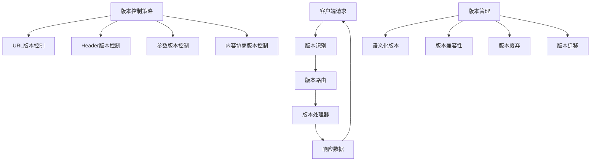

# API版本控制

## 🎯 学习目标
- 掌握API版本控制的基本概念和策略
- 理解不同版本控制方法的优缺点
- 学会实现API版本控制机制
- 了解版本迁移和兼容性管理

## 📚 核心概念

### API版本控制架构



### 版本控制策略对比

| 策略 | 描述 | 优点 | 缺点 | 适用场景 |
|------|------|------|------|----------|
| URL版本控制 | 在URL中体现版本 | 直观明确 | URL冗长 | 重大变更 |
| Header版本控制 | 通过HTTP头指定版本 | URL简洁 | 不够直观 | 渐进式变更 |
| 参数版本控制 | 通过查询参数指定版本 | 简单易用 | 容易遗漏 | 临时版本 |
| 内容协商 | 通过Accept头协商版本 | 标准化 | 复杂度高 | 多格式支持 |

## 🔧 API版本控制实现

### 版本控制器基础
```php
<?php
// 1. API版本管理器
class APIVersionManager {
    private $versions;
    private $defaultVersion;
    private $supportedVersions;
    private $deprecatedVersions;
    
    public function __construct($defaultVersion = 'v1') {
        $this->versions = [];
        $this->defaultVersion = $defaultVersion;
        $this->supportedVersions = [];
        $this->deprecatedVersions = [];
    }
    
    // 注册版本
    public function registerVersion($version, $handler, $options = []) {
        $this->versions[$version] = [
            'handler' => $handler,
            'options' => array_merge([
                'deprecated' => false,
                'sunset_date' => null,
                'description' => '',
                'changelog' => []
            ], $options)
        ];
        
        if (!$options['deprecated']) {
            $this->supportedVersions[] = $version;
        } else {
            $this->deprecatedVersions[] = $version;
        }
        
        return $this;
    }
    
    // 设置默认版本
    public function setDefaultVersion($version) {
        if (isset($this->versions[$version])) {
            $this->defaultVersion = $version;
        } else {
            throw new Exception("Version {$version} not registered");
        }
    }
    
    // 获取版本信息
    public function getVersion($version) {
        return $this->versions[$version] ?? null;
    }
    
    // 获取支持的版本
    public function getSupportedVersions() {
        return $this->supportedVersions;
    }
    
    // 获取废弃的版本
    public function getDeprecatedVersions() {
        return $this->deprecatedVersions;
    }
    
    // 检查版本是否支持
    public function isVersionSupported($version) {
        return isset($this->versions[$version]);
    }
    
    // 检查版本是否废弃
    public function isVersionDeprecated($version) {
        return isset($this->versions[$version]) && $this->versions[$version]['options']['deprecated'];
    }
    
    // 获取版本处理器
    public function getVersionHandler($version) {
        $versionInfo = $this->getVersion($version);
        return $versionInfo ? $versionInfo['handler'] : null;
    }
    
    // 解析版本
    public function parseVersion($request) {
        // 1. 尝试从URL路径解析版本
        $version = $this->parseVersionFromPath($request['path']);
        if ($version) {
            return $version;
        }
        
        // 2. 尝试从Header解析版本
        $version = $this->parseVersionFromHeader($request['headers']);
        if ($version) {
            return $version;
        }
        
        // 3. 尝试从查询参数解析版本
        $version = $this->parseVersionFromQuery($request['query']);
        if ($version) {
            return $version;
        }
        
        // 4. 返回默认版本
        return $this->defaultVersion;
    }
    
    // 从URL路径解析版本
    private function parseVersionFromPath($path) {
        if (preg_match('/^\/v(\d+(?:\.\d+)?)\//', $path, $matches)) {
            return 'v' . $matches[1];
        }
        return null;
    }
    
    // 从Header解析版本
    private function parseVersionFromHeader($headers) {
        $versionHeaders = [
            'X-API-Version',
            'API-Version',
            'Version'
        ];
        
        foreach ($versionHeaders as $header) {
            if (isset($headers[$header])) {
                return $headers[$header];
            }
        }
        
        return null;
    }
    
    // 从查询参数解析版本
    private function parseVersionFromQuery($query) {
        $versionParams = ['version', 'v', 'api_version'];
        
        foreach ($versionParams as $param) {
            if (isset($query[$param])) {
                return $query[$param];
            }
        }
        
        return null;
    }
    
    // 获取版本响应头
    public function getVersionHeaders($version) {
        $headers = [];
        
        if ($this->isVersionDeprecated($version)) {
            $headers['X-API-Deprecated'] = 'true';
            
            $versionInfo = $this->getVersion($version);
            if ($versionInfo['options']['sunset_date']) {
                $headers['X-API-Sunset'] = $versionInfo['options']['sunset_date'];
            }
        }
        
        $headers['X-API-Version'] = $version;
        $headers['X-API-Supported-Versions'] = implode(', ', $this->supportedVersions);
        
        return $headers;
    }
}

// 2. 版本化API路由器
class VersionedAPIRouter {
    private $versionManager;
    private $middleware;
    
    public function __construct($versionManager) {
        $this->versionManager = $versionManager;
        $this->middleware = [];
    }
    
    // 添加中间件
    public function addMiddleware($middleware) {
        $this->middleware[] = $middleware;
    }
    
    // 处理请求
    public function handleRequest($request) {
        try {
            // 解析版本
            $version = $this->versionManager->parseVersion($request);
            
            // 检查版本是否支持
            if (!$this->versionManager->isVersionSupported($version)) {
                return $this->createErrorResponse(400, "Unsupported API version: {$version}");
            }
            
            // 执行中间件
            foreach ($this->middleware as $middleware) {
                $result = $middleware($request, $version);
                if ($result !== true) {
                    return $result;
                }
            }
            
            // 获取版本处理器
            $handler = $this->versionManager->getVersionHandler($version);
            if (!$handler) {
                return $this->createErrorResponse(500, "No handler found for version: {$version}");
            }
            
            // 执行处理器
            $response = $handler($request);
            
            // 添加版本头
            $versionHeaders = $this->versionManager->getVersionHeaders($version);
            foreach ($versionHeaders as $name => $value) {
                $response['headers'][$name] = $value;
            }
            
            return $response;
            
        } catch (Exception $e) {
            return $this->createErrorResponse(500, $e->getMessage());
        }
    }
    
    // 创建错误响应
    private function createErrorResponse($statusCode, $message) {
        return [
            'status_code' => $statusCode,
            'headers' => ['Content-Type' => 'application/json'],
            'body' => json_encode([
                'error' => $message,
                'status_code' => $statusCode
            ])
        ];
    }
}

// 3. 版本化控制器基类
abstract class VersionedController {
    protected $version;
    protected $response;
    
    public function __construct($version) {
        $this->version = $version;
        $this->response = new APIResponse();
    }
    
    // 处理请求
    public function handleRequest($request) {
        $method = $request['method'];
        $path = $request['path'];
        
        // 移除版本前缀
        $path = $this->removeVersionPrefix($path);
        
        // 路由到具体方法
        return $this->route($method, $path, $request);
    }
    
    // 移除版本前缀
    private function removeVersionPrefix($path) {
        return preg_replace('/^\/v\d+(?:\.\d+)?\//', '/', $path);
    }
    
    // 路由方法
    private function route($method, $path, $request) {
        $routes = $this->getRoutes();
        
        foreach ($routes as $route) {
            if ($route['method'] === $method && $this->matchPath($path, $route['path'])) {
                $params = $this->extractParams($path, $route['path']);
                return $this->executeMethod($route['handler'], $params, $request);
            }
        }
        
        return $this->response->notFound();
    }
    
    // 获取路由配置
    abstract protected function getRoutes();
    
    // 路径匹配
    private function matchPath($requestPath, $routePath) {
        $requestParts = explode('/', trim($requestPath, '/'));
        $routeParts = explode('/', trim($routePath, '/'));
        
        if (count($requestParts) !== count($routeParts)) {
            return false;
        }
        
        for ($i = 0; $i < count($requestParts); $i++) {
            if ($routeParts[$i] !== $requestParts[$i] && !preg_match('/\{(\w+)\}/', $routeParts[$i])) {
                return false;
            }
        }
        
        return true;
    }
    
    // 提取参数
    private function extractParams($requestPath, $routePath) {
        $requestParts = explode('/', trim($requestPath, '/'));
        $routeParts = explode('/', trim($routePath, '/'));
        $params = [];
        
        for ($i = 0; $i < count($requestParts); $i++) {
            if (preg_match('/\{(\w+)\}/', $routeParts[$i], $matches)) {
                $params[$matches[1]] = $requestParts[$i];
            }
        }
        
        return $params;
    }
    
    // 执行方法
    private function executeMethod($method, $params, $request) {
        if (method_exists($this, $method)) {
            return $this->$method($params, $request);
        }
        
        return $this->response->methodNotAllowed();
    }
}

// 4. V1用户控制器
class V1UserController extends VersionedController {
    protected function getRoutes() {
        return [
            ['method' => 'GET', 'path' => '/users', 'handler' => 'getUsers'],
            ['method' => 'GET', 'path' => '/users/{id}', 'handler' => 'getUser'],
            ['method' => 'POST', 'path' => '/users', 'handler' => 'createUser'],
            ['method' => 'PUT', 'path' => '/users/{id}', 'handler' => 'updateUser'],
            ['method' => 'DELETE', 'path' => '/users/{id}', 'handler' => 'deleteUser']
        ];
    }
    
    public function getUsers($params, $request) {
        $users = [
            ['id' => 1, 'name' => 'John Doe', 'email' => 'john@example.com'],
            ['id' => 2, 'name' => 'Jane Smith', 'email' => 'jane@example.com']
        ];
        
        return $this->response->success($users);
    }
    
    public function getUser($params, $request) {
        $userId = $params['id'] ?? null;
        
        if (!$userId) {
            return $this->response->error('User ID is required', 400);
        }
        
        $user = ['id' => $userId, 'name' => 'John Doe', 'email' => 'john@example.com'];
        return $this->response->success($user);
    }
    
    public function createUser($params, $request) {
        $input = json_decode($request['body'], true);
        
        if (!$input) {
            return $this->response->error('Invalid JSON data', 400);
        }
        
        $user = [
            'id' => rand(1000, 9999),
            'name' => $input['name'],
            'email' => $input['email']
        ];
        
        return $this->response->created($user);
    }
    
    public function updateUser($params, $request) {
        $userId = $params['id'] ?? null;
        
        if (!$userId) {
            return $this->response->error('User ID is required', 400);
        }
        
        $input = json_decode($request['body'], true);
        
        if (!$input) {
            return $this->response->error('Invalid JSON data', 400);
        }
        
        $user = [
            'id' => $userId,
            'name' => $input['name'] ?? 'John Doe',
            'email' => $input['email'] ?? 'john@example.com'
        ];
        
        return $this->response->success($user);
    }
    
    public function deleteUser($params, $request) {
        $userId = $params['id'] ?? null;
        
        if (!$userId) {
            return $this->response->error('User ID is required', 400);
        }
        
        return $this->response->success(null, 'User deleted successfully');
    }
}

// 5. V2用户控制器
class V2UserController extends VersionedController {
    protected function getRoutes() {
        return [
            ['method' => 'GET', 'path' => '/users', 'handler' => 'getUsers'],
            ['method' => 'GET', 'path' => '/users/{id}', 'handler' => 'getUser'],
            ['method' => 'POST', 'path' => '/users', 'handler' => 'createUser'],
            ['method' => 'PUT', 'path' => '/users/{id}', 'handler' => 'updateUser'],
            ['method' => 'DELETE', 'path' => '/users/{id}', 'handler' => 'deleteUser']
        ];
    }
    
    public function getUsers($params, $request) {
        $users = [
            [
                'id' => 1,
                'name' => 'John Doe',
                'email' => 'john@example.com',
                'profile' => [
                    'age' => 30,
                    'city' => 'New York'
                ],
                'created_at' => '2023-01-01T00:00:00Z'
            ],
            [
                'id' => 2,
                'name' => 'Jane Smith',
                'email' => 'jane@example.com',
                'profile' => [
                    'age' => 25,
                    'city' => 'Los Angeles'
                ],
                'created_at' => '2023-01-02T00:00:00Z'
            ]
        ];
        
        return $this->response->success($users);
    }
    
    public function getUser($params, $request) {
        $userId = $params['id'] ?? null;
        
        if (!$userId) {
            return $this->response->error('User ID is required', 400);
        }
        
        $user = [
            'id' => $userId,
            'name' => 'John Doe',
            'email' => 'john@example.com',
            'profile' => [
                'age' => 30,
                'city' => 'New York'
            ],
            'created_at' => '2023-01-01T00:00:00Z'
        ];
        
        return $this->response->success($user);
    }
    
    public function createUser($params, $request) {
        $input = json_decode($request['body'], true);
        
        if (!$input) {
            return $this->response->error('Invalid JSON data', 400);
        }
        
        $user = [
            'id' => rand(1000, 9999),
            'name' => $input['name'],
            'email' => $input['email'],
            'profile' => $input['profile'] ?? [],
            'created_at' => date('c')
        ];
        
        return $this->response->created($user);
    }
    
    public function updateUser($params, $request) {
        $userId = $params['id'] ?? null;
        
        if (!$userId) {
            return $this->response->error('User ID is required', 400);
        }
        
        $input = json_decode($request['body'], true);
        
        if (!$input) {
            return $this->response->error('Invalid JSON data', 400);
        }
        
        $user = [
            'id' => $userId,
            'name' => $input['name'] ?? 'John Doe',
            'email' => $input['email'] ?? 'john@example.com',
            'profile' => $input['profile'] ?? ['age' => 30, 'city' => 'New York'],
            'created_at' => '2023-01-01T00:00:00Z'
        ];
        
        return $this->response->success($user);
    }
    
    public function deleteUser($params, $request) {
        $userId = $params['id'] ?? null;
        
        if (!$userId) {
            return $this->response->error('User ID is required', 400);
        }
        
        return $this->response->success(null, 'User deleted successfully');
    }
}

// 使用示例
echo "=== API版本控制示例 ===\n";

try {
    // 创建版本管理器
    $versionManager = new APIVersionManager('v1');
    
    // 注册V1版本
    $versionManager->registerVersion('v1', function($request) {
        $controller = new V1UserController('v1');
        return $controller->handleRequest($request);
    }, [
        'description' => 'API版本1，基础功能',
        'deprecated' => false
    ]);
    
    // 注册V2版本
    $versionManager->registerVersion('v2', function($request) {
        $controller = new V2UserController('v2');
        return $controller->handleRequest($request);
    }, [
        'description' => 'API版本2，增强功能',
        'deprecated' => false
    ]);
    
    // 创建路由器
    $router = new VersionedAPIRouter($versionManager);
    
    // 添加中间件
    $router->addMiddleware(function($request, $version) {
        echo "处理版本: $version\n";
        return true;
    });
    
    // 模拟请求
    $requests = [
        [
            'method' => 'GET',
            'path' => '/v1/users',
            'headers' => [],
            'query' => [],
            'body' => ''
        ],
        [
            'method' => 'GET',
            'path' => '/v2/users',
            'headers' => [],
            'query' => [],
            'body' => ''
        ],
        [
            'method' => 'GET',
            'path' => '/users',
            'headers' => ['X-API-Version' => 'v2'],
            'query' => [],
            'body' => ''
        ]
    ];
    
    foreach ($requests as $request) {
        echo "请求: {$request['method']} {$request['path']}\n";
        $response = $router->handleRequest($request);
        echo "响应状态: {$response['status_code']}\n";
        echo "版本头: " . ($response['headers']['X-API-Version'] ?? 'N/A') . "\n";
        echo "响应体: " . substr($response['body'], 0, 100) . "...\n\n";
    }
    
    // 显示版本信息
    echo "支持的版本: " . implode(', ', $versionManager->getSupportedVersions()) . "\n";
    echo "废弃的版本: " . implode(', ', $versionManager->getDeprecatedVersions()) . "\n";
    
} catch (Exception $e) {
    echo "错误: " . $e->getMessage() . "\n";
}
?>
```

### 版本迁移和兼容性管理
```php
<?php
// 1. 版本迁移管理器
class VersionMigrationManager {
    private $migrations;
    private $compatibility;
    
    public function __construct() {
        $this->migrations = [];
        $this->compatibility = [];
    }
    
    // 注册迁移
    public function registerMigration($fromVersion, $toVersion, $migration) {
        $key = "{$fromVersion}_to_{$toVersion}";
        $this->migrations[$key] = $migration;
    }
    
    // 执行迁移
    public function migrate($data, $fromVersion, $toVersion) {
        $key = "{$fromVersion}_to_{$toVersion}";
        
        if (isset($this->migrations[$key])) {
            return $this->migrations[$key]($data);
        }
        
        return $data;
    }
    
    // 设置兼容性
    public function setCompatibility($version, $compatibleVersions) {
        $this->compatibility[$version] = $compatibleVersions;
    }
    
    // 检查兼容性
    public function isCompatible($version1, $version2) {
        if (isset($this->compatibility[$version1])) {
            return in_array($version2, $this->compatibility[$version1]);
        }
        
        if (isset($this->compatibility[$version2])) {
            return in_array($version1, $this->compatibility[$version2]);
        }
        
        return false;
    }
}

// 2. 版本兼容性适配器
class VersionCompatibilityAdapter {
    private $migrationManager;
    private $versionManager;
    
    public function __construct($migrationManager, $versionManager) {
        $this->migrationManager = $migrationManager;
        $this->versionManager = $versionManager;
    }
    
    // 适配请求
    public function adaptRequest($request, $targetVersion) {
        $currentVersion = $this->versionManager->parseVersion($request);
        
        if ($currentVersion === $targetVersion) {
            return $request;
        }
        
        // 执行请求迁移
        return $this->migrateRequest($request, $currentVersion, $targetVersion);
    }
    
    // 适配响应
    public function adaptResponse($response, $fromVersion, $toVersion) {
        if ($fromVersion === $toVersion) {
            return $response;
        }
        
        // 执行响应迁移
        return $this->migrateResponse($response, $fromVersion, $toVersion);
    }
    
    // 迁移请求
    private function migrateRequest($request, $fromVersion, $toVersion) {
        $migratedRequest = $request;
        
        // 迁移请求体
        if (!empty($request['body'])) {
            $data = json_decode($request['body'], true);
            if ($data) {
                $migratedData = $this->migrationManager->migrate($data, $fromVersion, $toVersion);
                $migratedRequest['body'] = json_encode($migratedData);
            }
        }
        
        // 迁移查询参数
        if (!empty($request['query'])) {
            $migratedQuery = $this->migrationManager->migrate($request['query'], $fromVersion, $toVersion);
            $migratedRequest['query'] = $migratedQuery;
        }
        
        return $migratedRequest;
    }
    
    // 迁移响应
    private function migrateResponse($response, $fromVersion, $toVersion) {
        $migratedResponse = $response;
        
        // 迁移响应体
        if (!empty($response['body'])) {
            $data = json_decode($response['body'], true);
            if ($data) {
                $migratedData = $this->migrationManager->migrate($data, $fromVersion, $toVersion);
                $migratedResponse['body'] = json_encode($migratedData);
            }
        }
        
        return $migratedResponse;
    }
}

// 3. 版本废弃管理器
class VersionDeprecationManager {
    private $deprecations;
    private $sunsetDates;
    
    public function __construct() {
        $this->deprecations = [];
        $this->sunsetDates = [];
    }
    
    // 标记版本废弃
    public function deprecateVersion($version, $sunsetDate = null, $reason = '') {
        $this->deprecations[$version] = [
            'deprecated' => true,
            'sunset_date' => $sunsetDate,
            'reason' => $reason,
            'deprecated_at' => date('c')
        ];
        
        if ($sunsetDate) {
            $this->sunsetDates[$version] = $sunsetDate;
        }
    }
    
    // 检查版本是否废弃
    public function isVersionDeprecated($version) {
        return isset($this->deprecations[$version]) && $this->deprecations[$version]['deprecated'];
    }
    
    // 检查版本是否已过期
    public function isVersionSunset($version) {
        if (!isset($this->sunsetDates[$version])) {
            return false;
        }
        
        $sunsetDate = new DateTime($this->sunsetDates[$version]);
        $now = new DateTime();
        
        return $now > $sunsetDate;
    }
    
    // 获取废弃信息
    public function getDeprecationInfo($version) {
        return $this->deprecations[$version] ?? null;
    }
    
    // 获取废弃警告头
    public function getDeprecationHeaders($version) {
        $headers = [];
        
        if ($this->isVersionDeprecated($version)) {
            $headers['X-API-Deprecated'] = 'true';
            
            $info = $this->getDeprecationInfo($version);
            if ($info['sunset_date']) {
                $headers['X-API-Sunset'] = $info['sunset_date'];
            }
            
            if ($info['reason']) {
                $headers['X-API-Deprecation-Reason'] = $info['reason'];
            }
        }
        
        return $headers;
    }
}

// 使用示例
echo "=== 版本迁移和兼容性管理示例 ===\n";

try {
    // 创建迁移管理器
    $migrationManager = new VersionMigrationManager();
    
    // 注册V1到V2的迁移
    $migrationManager->registerMigration('v1', 'v2', function($data) {
        if (isset($data['users'])) {
            foreach ($data['users'] as &$user) {
                // 添加profile字段
                if (!isset($user['profile'])) {
                    $user['profile'] = [
                        'age' => null,
                        'city' => null
                    ];
                }
                
                // 添加created_at字段
                if (!isset($user['created_at'])) {
                    $user['created_at'] = date('c');
                }
            }
        }
        
        return $data;
    });
    
    // 注册V2到V1的迁移
    $migrationManager->registerMigration('v2', 'v1', function($data) {
        if (isset($data['users'])) {
            foreach ($data['users'] as &$user) {
                // 移除profile字段
                unset($user['profile']);
                
                // 移除created_at字段
                unset($user['created_at']);
            }
        }
        
        return $data;
    });
    
    // 设置兼容性
    $migrationManager->setCompatibility('v1', ['v1.1', 'v1.2']);
    $migrationManager->setCompatibility('v2', ['v2.1']);
    
    // 测试迁移
    $v1Data = [
        'users' => [
            ['id' => 1, 'name' => 'John Doe', 'email' => 'john@example.com']
        ]
    ];
    
    $v2Data = $migrationManager->migrate($v1Data, 'v1', 'v2');
    echo "V1到V2迁移结果:\n";
    echo json_encode($v2Data, JSON_PRETTY_PRINT | JSON_UNESCAPED_UNICODE) . "\n";
    
    $v1DataBack = $migrationManager->migrate($v2Data, 'v2', 'v1');
    echo "\nV2到V1迁移结果:\n";
    echo json_encode($v1DataBack, JSON_PRETTY_PRINT | JSON_UNESCAPED_UNICODE) . "\n";
    
    // 测试兼容性
    echo "\n兼容性检查:\n";
    echo "v1与v1.1兼容: " . ($migrationManager->isCompatible('v1', 'v1.1') ? '是' : '否') . "\n";
    echo "v1与v2兼容: " . ($migrationManager->isCompatible('v1', 'v2') ? '是' : '否') . "\n";
    
    // 创建废弃管理器
    $deprecationManager = new VersionDeprecationManager();
    
    // 标记V1版本废弃
    $deprecationManager->deprecateVersion(
        'v1',
        '2024-12-31T23:59:59Z',
        'V1版本已废弃，请升级到V2版本'
    );
    
    // 检查废弃状态
    echo "\n废弃状态检查:\n";
    echo "V1是否废弃: " . ($deprecationManager->isVersionDeprecated('v1') ? '是' : '否') . "\n";
    echo "V1是否过期: " . ($deprecationManager->isVersionSunset('v1') ? '是' : '否') . "\n";
    
    // 获取废弃头
    $headers = $deprecationManager->getDeprecationHeaders('v1');
    echo "废弃头信息:\n";
    foreach ($headers as $name => $value) {
        echo "  $name: $value\n";
    }
    
} catch (Exception $e) {
    echo "错误: " . $e->getMessage() . "\n";
}
?>
```

## 📊 最佳实践

### API版本控制最佳实践
```php
<?php
// API版本控制最佳实践

class APIVersionControlBestPractices {
    // 1. 版本控制策略
    public static function getVersionControlStrategies() {
        return [
            '版本命名' => [
                '语义化版本' => '使用语义化版本号，如v1.0.0',
                '主版本号' => '主版本号表示不兼容的API变更',
                '次版本号' => '次版本号表示向后兼容的功能性新增',
                '修订号' => '修订号表示向后兼容的问题修正'
            ],
            '版本标识' => [
                'URL版本控制' => '在URL中体现版本，如/api/v1/users',
                'Header版本控制' => '通过HTTP头指定版本',
                '参数版本控制' => '通过查询参数指定版本',
                '内容协商' => '通过Accept头协商版本'
            ],
            '版本兼容性' => [
                '向后兼容' => '新版本应该向后兼容旧版本',
                '向前兼容' => '旧版本应该能够处理新版本的数据',
                '兼容性测试' => '建立兼容性测试机制',
                '迁移工具' => '提供数据迁移工具'
            ]
        ];
    }
    
    // 2. 版本管理策略
    public static function getVersionManagementStrategies() {
        return [
            '版本生命周期' => [
                '开发阶段' => '版本开发和测试阶段',
                '发布阶段' => '版本发布和部署阶段',
                '维护阶段' => '版本维护和更新阶段',
                '废弃阶段' => '版本废弃和迁移阶段'
            ],
            '版本废弃' => [
                '废弃通知' => '提前通知版本废弃计划',
                '废弃时间表' => '制定详细的废弃时间表',
                '迁移指南' => '提供详细的迁移指南',
                '支持期限' => '设定废弃版本的支持期限'
            ],
            '版本迁移' => [
                '迁移计划' => '制定详细的迁移计划',
                '迁移工具' => '提供自动化迁移工具',
                '迁移测试' => '进行充分的迁移测试',
                '回滚机制' => '建立回滚机制'
            ]
        ];
    }
    
    // 3. 技术实现策略
    public static function getTechnicalImplementationStrategies() {
        return [
            '架构设计' => [
                '版本路由' => '实现版本路由机制',
                '版本处理器' => '为每个版本实现独立的处理器',
                '版本中间件' => '使用中间件处理版本相关逻辑',
                '版本适配器' => '实现版本间的数据适配'
            ],
            '数据管理' => [
                '数据迁移' => '实现数据迁移机制',
                '数据兼容性' => '确保数据格式兼容性',
                '数据验证' => '实现版本相关的数据验证',
                '数据转换' => '实现数据格式转换'
            ],
            '错误处理' => [
                '版本错误' => '处理版本相关的错误',
                '兼容性错误' => '处理兼容性相关的错误',
                '迁移错误' => '处理迁移过程中的错误',
                '错误恢复' => '实现错误恢复机制'
            ]
        ];
    }
    
    // 4. 监控和维护
    public static function getMonitoringAndMaintenanceStrategies() {
        return [
            '版本监控' => [
                '使用统计' => '监控各版本的使用情况',
                '性能监控' => '监控各版本的性能指标',
                '错误监控' => '监控各版本的错误情况',
                '兼容性监控' => '监控版本兼容性问题'
            ],
            '维护策略' => [
                '定期更新' => '定期更新和维护版本',
                '安全补丁' => '及时发布安全补丁',
                '性能优化' => '持续优化版本性能',
                '功能增强' => '根据需求增强功能'
            ],
            '用户支持' => [
                '文档维护' => '维护版本相关文档',
                '技术支持' => '提供技术支持服务',
                '培训服务' => '提供版本升级培训',
                '社区支持' => '建立社区支持机制'
            ]
        ];
    }
}

// 使用示例
echo "=== API版本控制最佳实践示例 ===\n";

try {
    // 版本控制策略
    $versionControlStrategies = APIVersionControlBestPractices::getVersionControlStrategies();
    echo "版本控制策略:\n";
    foreach ($versionControlStrategies as $category => $strategies) {
        echo "  $category:\n";
        foreach ($strategies as $strategy => $description) {
            echo "    - $strategy: $description\n";
        }
        echo "\n";
    }
    
    // 版本管理策略
    $versionManagementStrategies = APIVersionControlBestPractices::getVersionManagementStrategies();
    echo "版本管理策略:\n";
    foreach ($versionManagementStrategies as $category => $strategies) {
        echo "  $category:\n";
        foreach ($strategies as $strategy => $description) {
            echo "    - $strategy: $description\n";
        }
        echo "\n";
    }
    
    // 技术实现策略
    $technicalImplementationStrategies = APIVersionControlBestPractices::getTechnicalImplementationStrategies();
    echo "技术实现策略:\n";
    foreach ($technicalImplementationStrategies as $category => $strategies) {
        echo "  $category:\n";
        foreach ($strategies as $strategy => $description) {
            echo "    - $strategy: $description\n";
        }
        echo "\n";
    }
    
    // 监控和维护策略
    $monitoringAndMaintenanceStrategies = APIVersionControlBestPractices::getMonitoringAndMaintenanceStrategies();
    echo "监控和维护策略:\n";
    foreach ($monitoringAndMaintenanceStrategies as $category => $strategies) {
        echo "  $category:\n";
        foreach ($strategies as $strategy => $description) {
            echo "    - $strategy: $description\n";
        }
        echo "\n";
    }
    
} catch (Exception $e) {
    echo "错误: " . $e->getMessage() . "\n";
}
?>
```

## 🎓 学习建议

### 费曼学习法应用
1. **选择概念**: 选择API版本控制中的核心概念
2. **简化解释**: 用简单语言解释API版本控制的重要性
3. **识别盲点**: 发现理解不深入的地方
4. **重新学习**: 针对盲点进行深入学习

### 刻意练习重点
1. **版本策略**: 掌握API版本控制策略的选择
2. **技术实现**: 学会实现版本控制机制
3. **兼容性管理**: 理解版本兼容性管理方法
4. **迁移策略**: 掌握版本迁移和废弃策略

## 🔗 相关链接
- [[01-RESTful API设计|RESTful API设计]]
- [[02-GraphQL API|GraphQL API]]
- [[03-API文档编写|API文档编写]]
- [[05-微服务架构|微服务架构]]
- [[06-API安全与认证|API安全与认证]]
- [[07-API性能优化|API性能优化]]
