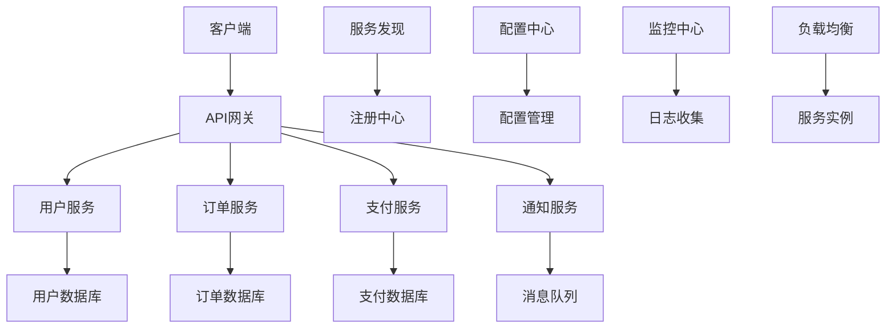

# 微服务架构

## 🎯 学习目标
- 掌握微服务架构的基本概念和设计原则
- 理解微服务与单体架构的区别和优势
- 学会使用PHP实现微服务架构
- 了解微服务的通信、部署和监控策略

## 📚 核心概念

### 微服务架构图



### 微服务 vs 单体架构对比

| 特性 | 微服务架构 | 单体架构 |
|------|------------|----------|
| 部署 | 独立部署 | 整体部署 |
| 扩展 | 按服务扩展 | 整体扩展 |
| 技术栈 | 多样化 | 统一技术栈 |
| 数据管理 | 独立数据库 | 共享数据库 |
| 通信 | 网络调用 | 函数调用 |
| 复杂度 | 高 | 低 |
| 性能 | 网络开销 | 本地调用 |

## 🔧 微服务实现

### 微服务基础框架
```php
<?php
// 1. 微服务基础类
abstract class MicroService {
    protected $name;
    protected $version;
    protected $port;
    protected $dependencies;
    protected $config;
    protected $logger;
    
    public function __construct($name, $version, $port, $config = []) {
        $this->name = $name;
        $this->version = $version;
        $this->port = $port;
        $this->dependencies = [];
        $this->config = $config;
        $this->logger = new ServiceLogger($name);
    }
    
    // 启动服务
    public function start() {
        $this->logger->info("Starting service {$this->name} v{$this->version} on port {$this->port}");
        
        // 注册服务
        $this->registerService();
        
        // 启动HTTP服务器
        $this->startHttpServer();
    }
    
    // 停止服务
    public function stop() {
        $this->logger->info("Stopping service {$this->name}");
        
        // 注销服务
        $this->unregisterService();
    }
    
    // 注册服务
    protected function registerService() {
        $serviceRegistry = new ServiceRegistry();
        $serviceRegistry->register([
            'name' => $this->name,
            'version' => $this->version,
            'port' => $this->port,
            'health_check' => "/health",
            'endpoints' => $this->getEndpoints()
        ]);
    }
    
    // 注销服务
    protected function unregisterService() {
        $serviceRegistry = new ServiceRegistry();
        $serviceRegistry->unregister($this->name, $this->version);
    }
    
    // 启动HTTP服务器
    protected function startHttpServer() {
        $server = new HttpServer($this->port);
        $server->setRoutes($this->getRoutes());
        $server->start();
    }
    
    // 获取端点信息
    abstract protected function getEndpoints();
    
    // 获取路由配置
    abstract protected function getRoutes();
    
    // 健康检查
    public function healthCheck() {
        return [
            'status' => 'healthy',
            'service' => $this->name,
            'version' => $this->version,
            'timestamp' => date('c'),
            'dependencies' => $this->checkDependencies()
        ];
    }
    
    // 检查依赖服务
    protected function checkDependencies() {
        $status = [];
        
        foreach ($this->dependencies as $dependency) {
            $status[$dependency] = $this->checkDependency($dependency);
        }
        
        return $status;
    }
    
    // 检查单个依赖
    protected function checkDependency($serviceName) {
        try {
            $serviceClient = new ServiceClient();
            $response = $serviceClient->get("http://{$serviceName}/health");
            return $response['status'] === 'healthy' ? 'healthy' : 'unhealthy';
        } catch (Exception $e) {
            return 'unavailable';
        }
    }
}

// 2. 服务注册中心
class ServiceRegistry {
    private $services;
    private $storage;
    
    public function __construct() {
        $this->services = [];
        $this->storage = new RedisStorage();
    }
    
    // 注册服务
    public function register($serviceInfo) {
        $key = "service:{$serviceInfo['name']}:{$serviceInfo['version']}";
        $serviceInfo['registered_at'] = time();
        $serviceInfo['last_heartbeat'] = time();
        
        $this->storage->set($key, json_encode($serviceInfo));
        $this->services[$key] = $serviceInfo;
        
        $this->logger->info("Service registered: {$serviceInfo['name']} v{$serviceInfo['version']}");
    }
    
    // 注销服务
    public function unregister($serviceName, $version) {
        $key = "service:{$serviceName}:{$version}";
        $this->storage->delete($key);
        unset($this->services[$key]);
        
        $this->logger->info("Service unregistered: {$serviceName} v{$version}");
    }
    
    // 发现服务
    public function discover($serviceName, $version = null) {
        if ($version) {
            $key = "service:{$serviceName}:{$version}";
            $serviceInfo = $this->storage->get($key);
            return $serviceInfo ? json_decode($serviceInfo, true) : null;
        }
        
        // 返回最新版本
        $pattern = "service:{$serviceName}:*";
        $keys = $this->storage->keys($pattern);
        
        if (empty($keys)) {
            return null;
        }
        
        $latestVersion = null;
        $latestService = null;
        
        foreach ($keys as $key) {
            $serviceInfo = json_decode($this->storage->get($key), true);
            if (!$latestVersion || version_compare($serviceInfo['version'], $latestVersion, '>')) {
                $latestVersion = $serviceInfo['version'];
                $latestService = $serviceInfo;
            }
        }
        
        return $latestService;
    }
    
    // 获取所有服务
    public function getAllServices() {
        $services = [];
        $keys = $this->storage->keys('service:*');
        
        foreach ($keys as $key) {
            $serviceInfo = json_decode($this->storage->get($key), true);
            $services[] = $serviceInfo;
        }
        
        return $services;
    }
    
    // 心跳检测
    public function heartbeat($serviceName, $version) {
        $key = "service:{$serviceName}:{$version}";
        $serviceInfo = json_decode($this->storage->get($key), true);
        
        if ($serviceInfo) {
            $serviceInfo['last_heartbeat'] = time();
            $this->storage->set($key, json_encode($serviceInfo));
        }
    }
    
    // 清理过期服务
    public function cleanupExpiredServices($timeout = 300) {
        $keys = $this->storage->keys('service:*');
        $now = time();
        
        foreach ($keys as $key) {
            $serviceInfo = json_decode($this->storage->get($key), true);
            
            if ($now - $serviceInfo['last_heartbeat'] > $timeout) {
                $this->storage->delete($key);
                $this->logger->warning("Service expired: {$serviceInfo['name']} v{$serviceInfo['version']}");
            }
        }
    }
}

// 3. 服务客户端
class ServiceClient {
    private $httpClient;
    private $serviceRegistry;
    private $loadBalancer;
    
    public function __construct() {
        $this->httpClient = new HttpClient();
        $this->serviceRegistry = new ServiceRegistry();
        $this->loadBalancer = new LoadBalancer();
    }
    
    // 调用服务
    public function call($serviceName, $endpoint, $method = 'GET', $data = null, $version = null) {
        $service = $this->serviceRegistry->discover($serviceName, $version);
        
        if (!$service) {
            throw new Exception("Service not found: {$serviceName}");
        }
        
        $url = "http://{$service['host']}:{$service['port']}{$endpoint}";
        
        return $this->httpClient->request($method, $url, $data);
    }
    
    // 负载均衡调用
    public function callWithLoadBalancing($serviceName, $endpoint, $method = 'GET', $data = null) {
        $services = $this->getServiceInstances($serviceName);
        
        if (empty($services)) {
            throw new Exception("No instances available for service: {$serviceName}");
        }
        
        $service = $this->loadBalancer->select($services);
        $url = "http://{$service['host']}:{$service['port']}{$endpoint}";
        
        return $this->httpClient->request($method, $url, $data);
    }
    
    // 获取服务实例
    private function getServiceInstances($serviceName) {
        $pattern = "service:{$serviceName}:*";
        $keys = $this->serviceRegistry->storage->keys($pattern);
        $services = [];
        
        foreach ($keys as $key) {
            $serviceInfo = json_decode($this->serviceRegistry->storage->get($key), true);
            $services[] = $serviceInfo;
        }
        
        return $services;
    }
}

// 4. 负载均衡器
class LoadBalancer {
    private $strategy;
    
    public function __construct($strategy = 'round_robin') {
        $this->strategy = $strategy;
    }
    
    // 选择服务实例
    public function select($services) {
        switch ($this->strategy) {
            case 'round_robin':
                return $this->roundRobin($services);
            case 'random':
                return $this->random($services);
            case 'weighted':
                return $this->weighted($services);
            default:
                return $this->roundRobin($services);
        }
    }
    
    // 轮询策略
    private function roundRobin($services) {
        static $index = 0;
        $service = $services[$index % count($services)];
        $index++;
        return $service;
    }
    
    // 随机策略
    private function random($services) {
        return $services[array_rand($services)];
    }
    
    // 加权策略
    private function weighted($services) {
        $totalWeight = array_sum(array_column($services, 'weight'));
        $random = mt_rand(1, $totalWeight);
        
        $currentWeight = 0;
        foreach ($services as $service) {
            $currentWeight += $service['weight'];
            if ($random <= $currentWeight) {
                return $service;
            }
        }
        
        return $services[0];
    }
}

// 5. 用户微服务
class UserService extends MicroService {
    private $userRepository;
    
    public function __construct($port = 8001) {
        parent::__construct('user-service', '1.0.0', $port);
        $this->userRepository = new UserRepository();
    }
    
    protected function getEndpoints() {
        return [
            'GET /users' => '获取用户列表',
            'GET /users/{id}' => '获取用户详情',
            'POST /users' => '创建用户',
            'PUT /users/{id}' => '更新用户',
            'DELETE /users/{id}' => '删除用户'
        ];
    }
    
    protected function getRoutes() {
        return [
            'GET /users' => [$this, 'getUsers'],
            'GET /users/{id}' => [$this, 'getUser'],
            'POST /users' => [$this, 'createUser'],
            'PUT /users/{id}' => [$this, 'updateUser'],
            'DELETE /users/{id}' => [$this, 'deleteUser'],
            'GET /health' => [$this, 'healthCheck']
        ];
    }
    
    public function getUsers($request) {
        $users = $this->userRepository->findAll();
        return $this->jsonResponse($users);
    }
    
    public function getUser($request) {
        $userId = $request['params']['id'];
        $user = $this->userRepository->findById($userId);
        
        if (!$user) {
            return $this->jsonResponse(['error' => 'User not found'], 404);
        }
        
        return $this->jsonResponse($user);
    }
    
    public function createUser($request) {
        $userData = json_decode($request['body'], true);
        $user = $this->userRepository->create($userData);
        return $this->jsonResponse($user, 201);
    }
    
    public function updateUser($request) {
        $userId = $request['params']['id'];
        $userData = json_decode($request['body'], true);
        $user = $this->userRepository->update($userId, $userData);
        
        if (!$user) {
            return $this->jsonResponse(['error' => 'User not found'], 404);
        }
        
        return $this->jsonResponse($user);
    }
    
    public function deleteUser($request) {
        $userId = $request['params']['id'];
        $deleted = $this->userRepository->delete($userId);
        
        if (!$deleted) {
            return $this->jsonResponse(['error' => 'User not found'], 404);
        }
        
        return $this->jsonResponse(['message' => 'User deleted successfully']);
    }
    
    private function jsonResponse($data, $statusCode = 200) {
        return [
            'status_code' => $statusCode,
            'headers' => ['Content-Type' => 'application/json'],
            'body' => json_encode($data)
        ];
    }
}

// 6. 订单微服务
class OrderService extends MicroService {
    private $orderRepository;
    private $serviceClient;
    
    public function __construct($port = 8002) {
        parent::__construct('order-service', '1.0.0', $port);
        $this->orderRepository = new OrderRepository();
        $this->serviceClient = new ServiceClient();
        $this->dependencies = ['user-service'];
    }
    
    protected function getEndpoints() {
        return [
            'GET /orders' => '获取订单列表',
            'GET /orders/{id}' => '获取订单详情',
            'POST /orders' => '创建订单',
            'PUT /orders/{id}' => '更新订单',
            'DELETE /orders/{id}' => '删除订单'
        ];
    }
    
    protected function getRoutes() {
        return [
            'GET /orders' => [$this, 'getOrders'],
            'GET /orders/{id}' => [$this, 'getOrder'],
            'POST /orders' => [$this, 'createOrder'],
            'PUT /orders/{id}' => [$this, 'updateOrder'],
            'DELETE /orders/{id}' => [$this, 'deleteOrder'],
            'GET /health' => [$this, 'healthCheck']
        ];
    }
    
    public function getOrders($request) {
        $orders = $this->orderRepository->findAll();
        
        // 获取用户信息
        foreach ($orders as &$order) {
            try {
                $user = $this->serviceClient->call('user-service', "/users/{$order['user_id']}");
                $order['user'] = $user;
            } catch (Exception $e) {
                $order['user'] = null;
            }
        }
        
        return $this->jsonResponse($orders);
    }
    
    public function getOrder($request) {
        $orderId = $request['params']['id'];
        $order = $this->orderRepository->findById($orderId);
        
        if (!$order) {
            return $this->jsonResponse(['error' => 'Order not found'], 404);
        }
        
        // 获取用户信息
        try {
            $user = $this->serviceClient->call('user-service', "/users/{$order['user_id']}");
            $order['user'] = $user;
        } catch (Exception $e) {
            $order['user'] = null;
        }
        
        return $this->jsonResponse($order);
    }
    
    public function createOrder($request) {
        $orderData = json_decode($request['body'], true);
        
        // 验证用户是否存在
        try {
            $user = $this->serviceClient->call('user-service', "/users/{$orderData['user_id']}");
        } catch (Exception $e) {
            return $this->jsonResponse(['error' => 'User not found'], 400);
        }
        
        $order = $this->orderRepository->create($orderData);
        return $this->jsonResponse($order, 201);
    }
    
    public function updateOrder($request) {
        $orderId = $request['params']['id'];
        $orderData = json_decode($request['body'], true);
        $order = $this->orderRepository->update($orderId, $orderData);
        
        if (!$order) {
            return $this->jsonResponse(['error' => 'Order not found'], 404);
        }
        
        return $this->jsonResponse($order);
    }
    
    public function deleteOrder($request) {
        $orderId = $request['params']['id'];
        $deleted = $this->orderRepository->delete($orderId);
        
        if (!$deleted) {
            return $this->jsonResponse(['error' => 'Order not found'], 404);
        }
        
        return $this->jsonResponse(['message' => 'Order deleted successfully']);
    }
    
    private function jsonResponse($data, $statusCode = 200) {
        return [
            'status_code' => $statusCode,
            'headers' => ['Content-Type' => 'application/json'],
            'body' => json_encode($data)
        ];
    }
}

// 使用示例
echo "=== 微服务架构示例 ===\n";

try {
    // 创建用户服务
    $userService = new UserService(8001);
    echo "用户服务创建成功\n";
    
    // 创建订单服务
    $orderService = new OrderService(8002);
    echo "订单服务创建成功\n";
    
    // 启动服务
    $userService->start();
    echo "用户服务已启动\n";
    
    $orderService->start();
    echo "订单服务已启动\n";
    
    // 测试服务发现
    $serviceRegistry = new ServiceRegistry();
    $userServiceInfo = $serviceRegistry->discover('user-service');
    echo "发现用户服务: " . json_encode($userServiceInfo) . "\n";
    
    // 测试服务调用
    $serviceClient = new ServiceClient();
    $users = $serviceClient->call('user-service', '/users');
    echo "调用用户服务: " . json_encode($users) . "\n";
    
    // 测试负载均衡
    $loadBalancer = new LoadBalancer('round_robin');
    $services = [
        ['host' => 'localhost', 'port' => 8001, 'weight' => 1],
        ['host' => 'localhost', 'port' => 8002, 'weight' => 2]
    ];
    
    $selectedService = $loadBalancer->select($services);
    echo "负载均衡选择: " . json_encode($selectedService) . "\n";
    
} catch (Exception $e) {
    echo "错误: " . $e->getMessage() . "\n";
}
?>
```

### API网关和配置管理
```php
<?php
// 1. API网关
class APIGateway {
    private $routes;
    private $middleware;
    private $rateLimiter;
    private $authenticator;
    private $logger;
    
    public function __construct() {
        $this->routes = [];
        $this->middleware = [];
        $this->rateLimiter = new RateLimiter();
        $this->authenticator = new Authenticator();
        $this->logger = new GatewayLogger();
    }
    
    // 添加路由
    public function addRoute($path, $service, $options = []) {
        $this->routes[$path] = [
            'service' => $service,
            'options' => array_merge([
                'auth_required' => true,
                'rate_limit' => 100,
                'timeout' => 30
            ], $options)
        ];
    }
    
    // 添加中间件
    public function addMiddleware($middleware) {
        $this->middleware[] = $middleware;
    }
    
    // 处理请求
    public function handleRequest($request) {
        $startTime = microtime(true);
        
        try {
            // 查找路由
            $route = $this->findRoute($request['path']);
            if (!$route) {
                return $this->createErrorResponse(404, 'Route not found');
            }
            
            // 执行中间件
            foreach ($this->middleware as $middleware) {
                $result = $middleware($request);
                if ($result !== true) {
                    return $result;
                }
            }
            
            // 认证检查
            if ($route['options']['auth_required']) {
                $authResult = $this->authenticator->authenticate($request);
                if (!$authResult['success']) {
                    return $this->createErrorResponse(401, $authResult['message']);
                }
                $request['user'] = $authResult['user'];
            }
            
            // 速率限制
            $rateLimitResult = $this->rateLimiter->checkLimit($request, $route['options']['rate_limit']);
            if (!$rateLimitResult['allowed']) {
                return $this->createErrorResponse(429, 'Rate limit exceeded');
            }
            
            // 转发请求
            $response = $this->forwardRequest($request, $route);
            
            // 记录日志
            $duration = microtime(true) - $startTime;
            $this->logger->log($request, $response, $duration);
            
            return $response;
            
        } catch (Exception $e) {
            $this->logger->error($request, $e);
            return $this->createErrorResponse(500, 'Internal server error');
        }
    }
    
    // 查找路由
    private function findRoute($path) {
        foreach ($this->routes as $routePath => $route) {
            if ($this->matchPath($path, $routePath)) {
                return $route;
            }
        }
        return null;
    }
    
    // 路径匹配
    private function matchPath($requestPath, $routePath) {
        $requestParts = explode('/', trim($requestPath, '/'));
        $routeParts = explode('/', trim($routePath, '/'));
        
        if (count($requestParts) !== count($routeParts)) {
            return false;
        }
        
        for ($i = 0; $i < count($requestParts); $i++) {
            if ($routeParts[$i] !== $requestParts[$i] && !preg_match('/\{(\w+)\}/', $routeParts[$i])) {
                return false;
            }
        }
        
        return true;
    }
    
    // 转发请求
    private function forwardRequest($request, $route) {
        $serviceClient = new ServiceClient();
        $serviceName = $route['service'];
        $endpoint = $request['path'];
        
        return $serviceClient->callWithLoadBalancing($serviceName, $endpoint, $request['method'], $request['body']);
    }
    
    // 创建错误响应
    private function createErrorResponse($statusCode, $message) {
        return [
            'status_code' => $statusCode,
            'headers' => ['Content-Type' => 'application/json'],
            'body' => json_encode(['error' => $message, 'status_code' => $statusCode])
        ];
    }
}

// 2. 配置中心
class ConfigCenter {
    private $configs;
    private $storage;
    private $watchers;
    
    public function __construct() {
        $this->configs = [];
        $this->storage = new RedisStorage();
        $this->watchers = [];
    }
    
    // 设置配置
    public function setConfig($key, $value, $service = null) {
        $configKey = $service ? "config:{$service}:{$key}" : "config:global:{$key}";
        $this->storage->set($configKey, json_encode($value));
        
        // 通知观察者
        $this->notifyWatchers($key, $value, $service);
    }
    
    // 获取配置
    public function getConfig($key, $service = null) {
        $configKey = $service ? "config:{$service}:{$key}" : "config:global:{$key}";
        $value = $this->storage->get($configKey);
        
        return $value ? json_decode($value, true) : null;
    }
    
    // 获取服务配置
    public function getServiceConfigs($service) {
        $pattern = "config:{$service}:*";
        $keys = $this->storage->keys($pattern);
        $configs = [];
        
        foreach ($keys as $key) {
            $configKey = str_replace("config:{$service}:", '', $key);
            $value = json_decode($this->storage->get($key), true);
            $configs[$configKey] = $value;
        }
        
        return $configs;
    }
    
    // 注册配置观察者
    public function watchConfig($key, $callback, $service = null) {
        $watcherKey = $service ? "{$service}:{$key}" : "global:{$key}";
        $this->watchers[$watcherKey][] = $callback;
    }
    
    // 通知观察者
    private function notifyWatchers($key, $value, $service) {
        $watcherKey = $service ? "{$service}:{$key}" : "global:{$key}";
        
        if (isset($this->watchers[$watcherKey])) {
            foreach ($this->watchers[$watcherKey] as $callback) {
                $callback($key, $value, $service);
            }
        }
    }
}

// 3. 消息队列
class MessageQueue {
    private $queues;
    private $storage;
    private $subscribers;
    
    public function __construct() {
        $this->queues = [];
        $this->storage = new RedisStorage();
        $this->subscribers = [];
    }
    
    // 发布消息
    public function publish($topic, $message) {
        $queueKey = "queue:{$topic}";
        $messageData = [
            'id' => uniqid(),
            'topic' => $topic,
            'message' => $message,
            'timestamp' => time(),
            'retries' => 0
        ];
        
        $this->storage->lpush($queueKey, json_encode($messageData));
        
        // 通知订阅者
        $this->notifySubscribers($topic, $messageData);
    }
    
    // 订阅消息
    public function subscribe($topic, $callback) {
        if (!isset($this->subscribers[$topic])) {
            $this->subscribers[$topic] = [];
        }
        
        $this->subscribers[$topic][] = $callback;
    }
    
    // 消费消息
    public function consume($topic, $timeout = 0) {
        $queueKey = "queue:{$topic}";
        $messageData = $this->storage->brpop($queueKey, $timeout);
        
        if ($messageData) {
            return json_decode($messageData[1], true);
        }
        
        return null;
    }
    
    // 通知订阅者
    private function notifySubscribers($topic, $messageData) {
        if (isset($this->subscribers[$topic])) {
            foreach ($this->subscribers[$topic] as $callback) {
                try {
                    $callback($messageData);
                } catch (Exception $e) {
                    $this->logger->error("Error in subscriber callback: " . $e->getMessage());
                }
            }
        }
    }
}

// 使用示例
echo "=== API网关和配置管理示例 ===\n";

try {
    // 创建API网关
    $gateway = new APIGateway();
    
    // 添加路由
    $gateway->addRoute('/users', 'user-service', [
        'auth_required' => true,
        'rate_limit' => 100
    ]);
    
    $gateway->addRoute('/orders', 'order-service', [
        'auth_required' => true,
        'rate_limit' => 50
    ]);
    
    // 添加中间件
    $gateway->addMiddleware(function($request) {
        echo "执行中间件: " . $request['path'] . "\n";
        return true;
    });
    
    // 创建配置中心
    $configCenter = new ConfigCenter();
    
    // 设置全局配置
    $configCenter->setConfig('database.host', 'localhost');
    $configCenter->setConfig('database.port', 3306);
    
    // 设置服务配置
    $configCenter->setConfig('cache.enabled', true, 'user-service');
    $configCenter->setConfig('cache.ttl', 3600, 'user-service');
    
    // 获取配置
    $dbHost = $configCenter->getConfig('database.host');
    echo "数据库主机: $dbHost\n";
    
    $userServiceConfigs = $configCenter->getServiceConfigs('user-service');
    echo "用户服务配置: " . json_encode($userServiceConfigs) . "\n";
    
    // 创建消息队列
    $messageQueue = new MessageQueue();
    
    // 订阅消息
    $messageQueue->subscribe('user.created', function($message) {
        echo "收到用户创建消息: " . json_encode($message) . "\n";
    });
    
    // 发布消息
    $messageQueue->publish('user.created', [
        'user_id' => 123,
        'name' => 'John Doe',
        'email' => 'john@example.com'
    ]);
    
    echo "微服务架构组件创建成功\n";
    
} catch (Exception $e) {
    echo "错误: " . $e->getMessage() . "\n";
}
?>
```

## 📊 最佳实践

### 微服务架构最佳实践
```php
<?php
// 微服务架构最佳实践

class MicroServiceArchitectureBestPractices {
    // 1. 服务设计原则
    public static function getServiceDesignPrinciples() {
        return [
            '单一职责' => [
                '业务边界' => '每个服务应该有一个明确的业务边界',
                '数据所有权' => '每个服务拥有自己的数据',
                '接口设计' => '设计清晰的服务接口',
                '依赖管理' => '最小化服务间依赖'
            ],
            '服务通信' => [
                '同步通信' => '使用HTTP/REST进行同步通信',
                '异步通信' => '使用消息队列进行异步通信',
                '服务发现' => '实现服务发现机制',
                '负载均衡' => '实现负载均衡策略'
            ],
            '数据管理' => [
                '数据库分离' => '每个服务使用独立的数据库',
                '数据一致性' => '实现最终一致性',
                '事务管理' => '使用分布式事务',
                '数据迁移' => '实现数据迁移策略'
            ]
        ];
    }
    
    // 2. 部署和运维
    public static function getDeploymentAndOperationsStrategies() {
        return [
            '容器化部署' => [
                'Docker容器' => '使用Docker容器化服务',
                'Kubernetes编排' => '使用Kubernetes进行服务编排',
                '服务网格' => '使用服务网格管理通信',
                '配置管理' => '实现配置中心管理'
            ],
            '监控和日志' => [
                '分布式追踪' => '实现分布式请求追踪',
                '指标监控' => '监控服务性能指标',
                '日志聚合' => '聚合和分析日志',
                '告警机制' => '建立告警和通知机制'
            ],
            '安全策略' => [
                '服务认证' => '实现服务间认证',
                '访问控制' => '实现细粒度访问控制',
                '数据加密' => '加密传输和存储数据',
                '安全审计' => '实现安全审计机制'
            ]
        ];
    }
    
    // 3. 性能优化
    public static function getPerformanceOptimizationStrategies() {
        return [
            '缓存策略' => [
                '分布式缓存' => '使用Redis等分布式缓存',
                '本地缓存' => '实现本地缓存机制',
                '缓存更新' => '实现缓存更新策略',
                '缓存穿透' => '防止缓存穿透问题'
            ],
            '数据库优化' => [
                '读写分离' => '实现数据库读写分离',
                '分库分表' => '实现数据库分库分表',
                '连接池' => '使用数据库连接池',
                '查询优化' => '优化数据库查询'
            ],
            '网络优化' => [
                '连接复用' => '复用HTTP连接',
                '压缩传输' => '使用数据压缩',
                'CDN加速' => '使用CDN加速静态资源',
                '网络监控' => '监控网络性能'
            ]
        ];
    }
    
    // 4. 故障处理
    public static function getFaultHandlingStrategies() {
        return [
            '容错机制' => [
                '熔断器' => '实现熔断器模式',
                '重试机制' => '实现智能重试机制',
                '降级策略' => '实现服务降级策略',
                '超时控制' => '设置合理的超时时间'
            ],
            '故障恢复' => [
                '健康检查' => '实现服务健康检查',
                '自动重启' => '实现服务自动重启',
                '故障转移' => '实现故障转移机制',
                '数据恢复' => '实现数据恢复策略'
            ],
            '测试策略' => [
                '单元测试' => '编写服务单元测试',
                '集成测试' => '编写服务集成测试',
                '混沌工程' => '实施混沌工程测试',
                '性能测试' => '进行性能压力测试'
            ]
        ];
    }
}

// 使用示例
echo "=== 微服务架构最佳实践示例 ===\n";

try {
    // 服务设计原则
    $serviceDesignPrinciples = MicroServiceArchitectureBestPractices::getServiceDesignPrinciples();
    echo "服务设计原则:\n";
    foreach ($serviceDesignPrinciples as $category => $principles) {
        echo "  $category:\n";
        foreach ($principles as $principle => $description) {
            echo "    - $principle: $description\n";
        }
        echo "\n";
    }
    
    // 部署和运维策略
    $deploymentStrategies = MicroServiceArchitectureBestPractices::getDeploymentAndOperationsStrategies();
    echo "部署和运维策略:\n";
    foreach ($deploymentStrategies as $category => $strategies) {
        echo "  $category:\n";
        foreach ($strategies as $strategy => $description) {
            echo "    - $strategy: $description\n";
        }
        echo "\n";
    }
    
    // 性能优化策略
    $performanceStrategies = MicroServiceArchitectureBestPractices::getPerformanceOptimizationStrategies();
    echo "性能优化策略:\n";
    foreach ($performanceStrategies as $category => $strategies) {
        echo "  $category:\n";
        foreach ($strategies as $strategy => $description) {
            echo "    - $strategy: $description\n";
        }
        echo "\n";
    }
    
    // 故障处理策略
    $faultHandlingStrategies = MicroServiceArchitectureBestPractices::getFaultHandlingStrategies();
    echo "故障处理策略:\n";
    foreach ($faultHandlingStrategies as $category => $strategies) {
        echo "  $category:\n";
        foreach ($strategies as $strategy => $description) {
            echo "    - $strategy: $description\n";
        }
        echo "\n";
    }
    
} catch (Exception $e) {
    echo "错误: " . $e->getMessage() . "\n";
}
?>
```

## 🎓 学习建议

### 费曼学习法应用
1. **选择概念**: 选择微服务架构中的核心概念
2. **简化解释**: 用简单语言解释微服务架构的重要性
3. **识别盲点**: 发现理解不深入的地方
4. **重新学习**: 针对盲点进行深入学习

### 刻意练习重点
1. **服务设计**: 掌握微服务的设计原则
2. **服务通信**: 学会实现服务间通信
3. **部署运维**: 理解微服务的部署和运维
4. **故障处理**: 掌握微服务的故障处理机制

## 🔗 相关链接
- [[01-RESTful API设计|RESTful API设计]]
- [[02-GraphQL API|GraphQL API]]
- [[03-API文档编写|API文档编写]]
- [[04-API版本控制|API版本控制]]
- [[06-API安全与认证|API安全与认证]]
- [[07-API性能优化|API性能优化]]
