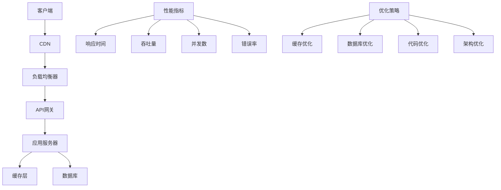

# API性能优化

## 🎯 学习目标
- 掌握API性能优化的基本原则和方法
- 理解性能瓶颈的识别和分析
- 学会实现各种性能优化策略
- 了解性能监控和调优工具

## 📚 核心概念

### API性能优化架构



### 性能优化策略对比

| 优化策略 | 描述 | 性能提升 | 实施难度 | 成本 |
|----------|------|----------|----------|------|
| 缓存优化 | 使用缓存减少重复计算 | 高 | 中 | 低 |
| 数据库优化 | 优化查询和索引 | 高 | 高 | 中 |
| 代码优化 | 优化算法和逻辑 | 中 | 中 | 低 |
| 架构优化 | 分布式和微服务 | 高 | 高 | 高 |
| 硬件升级 | 提升服务器性能 | 中 | 低 | 高 |
| 网络优化 | 优化网络传输 | 中 | 中 | 中 |

## 🔧 API性能优化实现

### 缓存优化系统
```php
<?php
// 1. 多级缓存管理器
class MultiLevelCacheManager {
    private $caches;
    private $config;
    
    public function __construct($config = []) {
        $this->config = array_merge([
            'levels' => ['memory', 'redis', 'database'],
            'default_ttl' => 3600,
            'serializer' => 'json'
        ], $config);
        
        $this->caches = [];
        $this->initializeCaches();
    }
    
    // 初始化缓存
    private function initializeCaches() {
        foreach ($this->config['levels'] as $level) {
            switch ($level) {
                case 'memory':
                    $this->caches[$level] = new MemoryCache();
                    break;
                case 'redis':
                    $this->caches[$level] = new RedisCache();
                    break;
                case 'database':
                    $this->caches[$level] = new DatabaseCache();
                    break;
            }
        }
    }
    
    // 获取缓存
    public function get($key) {
        foreach ($this->config['levels'] as $level) {
            $cache = $this->caches[$level];
            $value = $cache->get($key);
            
            if ($value !== null) {
                // 回填到上级缓存
                $this->backfill($key, $value, $level);
                return $value;
            }
        }
        
        return null;
    }
    
    // 设置缓存
    public function set($key, $value, $ttl = null) {
        $ttl = $ttl ?: $this->config['default_ttl'];
        
        foreach ($this->config['levels'] as $level) {
            $cache = $this->caches[$level];
            $cache->set($key, $value, $ttl);
        }
    }
    
    // 删除缓存
    public function delete($key) {
        foreach ($this->config['levels'] as $level) {
            $cache = $this->caches[$level];
            $cache->delete($key);
        }
    }
    
    // 回填缓存
    private function backfill($key, $value, $excludeLevel) {
        foreach ($this->config['levels'] as $level) {
            if ($level === $excludeLevel) {
                break;
            }
            
            $cache = $this->caches[$level];
            $cache->set($key, $value, $this->config['default_ttl']);
        }
    }
    
    // 清空缓存
    public function clear() {
        foreach ($this->caches as $cache) {
            $cache->clear();
        }
    }
    
    // 获取缓存统计
    public function getStats() {
        $stats = [];
        
        foreach ($this->caches as $level => $cache) {
            $stats[$level] = $cache->getStats();
        }
        
        return $stats;
    }
}

// 2. 智能缓存策略
class SmartCacheStrategy {
    private $cacheManager;
    private $metrics;
    private $policies;
    
    public function __construct($cacheManager) {
        $this->cacheManager = $cacheManager;
        $this->metrics = [];
        $this->policies = [];
    }
    
    // 智能获取
    public function smartGet($key, $fallback = null) {
        $startTime = microtime(true);
        
        // 尝试从缓存获取
        $value = $this->cacheManager->get($key);
        
        if ($value !== null) {
            $this->recordCacheHit($key, microtime(true) - $startTime);
            return $value;
        }
        
        // 缓存未命中，执行回退逻辑
        if ($fallback && is_callable($fallback)) {
            $value = $fallback();
            
            if ($value !== null) {
                // 根据访问模式决定缓存策略
                $ttl = $this->calculateTTL($key);
                $this->cacheManager->set($key, $value, $ttl);
            }
        }
        
        $this->recordCacheMiss($key, microtime(true) - $startTime);
        return $value;
    }
    
    // 计算TTL
    private function calculateTTL($key) {
        $accessCount = $this->metrics[$key]['access_count'] ?? 0;
        $hitRate = $this->metrics[$key]['hit_rate'] ?? 0;
        
        // 根据访问频率和命中率调整TTL
        if ($accessCount > 100 && $hitRate > 0.8) {
            return 7200; // 2小时
        } elseif ($accessCount > 50 && $hitRate > 0.6) {
            return 3600; // 1小时
        } else {
            return 1800; // 30分钟
        }
    }
    
    // 记录缓存命中
    private function recordCacheHit($key, $responseTime) {
        if (!isset($this->metrics[$key])) {
            $this->metrics[$key] = [
                'access_count' => 0,
                'hit_count' => 0,
                'miss_count' => 0,
                'total_response_time' => 0
            ];
        }
        
        $this->metrics[$key]['access_count']++;
        $this->metrics[$key]['hit_count']++;
        $this->metrics[$key]['total_response_time'] += $responseTime;
    }
    
    // 记录缓存未命中
    private function recordCacheMiss($key, $responseTime) {
        if (!isset($this->metrics[$key])) {
            $this->metrics[$key] = [
                'access_count' => 0,
                'hit_count' => 0,
                'miss_count' => 0,
                'total_response_time' => 0
            ];
        }
        
        $this->metrics[$key]['access_count']++;
        $this->metrics[$key]['miss_count']++;
        $this->metrics[$key]['total_response_time'] += $responseTime;
    }
    
    // 获取缓存指标
    public function getMetrics() {
        $result = [];
        
        foreach ($this->metrics as $key => $metric) {
            $result[$key] = [
                'access_count' => $metric['access_count'],
                'hit_count' => $metric['hit_count'],
                'miss_count' => $metric['miss_count'],
                'hit_rate' => $metric['access_count'] > 0 ? $metric['hit_count'] / $metric['access_count'] : 0,
                'avg_response_time' => $metric['access_count'] > 0 ? $metric['total_response_time'] / $metric['access_count'] : 0
            ];
        }
        
        return $result;
    }
}

// 3. 查询优化器
class QueryOptimizer {
    private $queryCache;
    private $queryAnalyzer;
    private $indexRecommender;
    
    public function __construct() {
        $this->queryCache = new QueryCache();
        $this->queryAnalyzer = new QueryAnalyzer();
        $this->indexRecommender = new IndexRecommender();
    }
    
    // 优化查询
    public function optimizeQuery($sql, $params = []) {
        // 分析查询
        $analysis = $this->queryAnalyzer->analyze($sql, $params);
        
        // 检查查询缓存
        $cacheKey = $this->generateCacheKey($sql, $params);
        $cachedResult = $this->queryCache->get($cacheKey);
        
        if ($cachedResult !== null) {
            return $cachedResult;
        }
        
        // 优化查询
        $optimizedQuery = $this->optimizeSQL($sql, $analysis);
        
        // 执行查询
        $result = $this->executeQuery($optimizedQuery, $params);
        
        // 缓存结果
        $this->queryCache->set($cacheKey, $result, $this->calculateCacheTTL($analysis));
        
        return $result;
    }
    
    // 优化SQL
    private function optimizeSQL($sql, $analysis) {
        $optimizedSQL = $sql;
        
        // 添加索引建议
        $indexSuggestions = $this->indexRecommender->recommend($analysis);
        
        // 优化WHERE子句
        $optimizedSQL = $this->optimizeWhereClause($optimizedSQL, $analysis);
        
        // 优化JOIN
        $optimizedSQL = $this->optimizeJoin($optimizedSQL, $analysis);
        
        // 优化ORDER BY
        $optimizedSQL = $this->optimizeOrderBy($optimizedSQL, $analysis);
        
        return $optimizedSQL;
    }
    
    // 优化WHERE子句
    private function optimizeWhereClause($sql, $analysis) {
        // 将选择性高的条件放在前面
        $whereConditions = $analysis['where_conditions'] ?? [];
        
        if (count($whereConditions) > 1) {
            usort($whereConditions, function($a, $b) {
                return $b['selectivity'] <=> $a['selectivity'];
            });
            
            // 重新构建WHERE子句
            $optimizedWhere = implode(' AND ', array_column($whereConditions, 'condition'));
            $sql = preg_replace('/WHERE\s+.*?(?=ORDER|GROUP|LIMIT|$)/i', "WHERE {$optimizedWhere}", $sql);
        }
        
        return $sql;
    }
    
    // 优化JOIN
    private function optimizeJoin($sql, $analysis) {
        $joins = $analysis['joins'] ?? [];
        
        if (count($joins) > 1) {
            // 将小表放在前面
            usort($joins, function($a, $b) {
                return $a['table_size'] <=> $b['table_size'];
            });
            
            // 重新构建JOIN子句
            $optimizedJoins = implode(' ', array_column($joins, 'join_clause'));
            $sql = preg_replace('/JOIN\s+.*?(?=WHERE|ORDER|GROUP|LIMIT|$)/i', $optimizedJoins, $sql);
        }
        
        return $sql;
    }
    
    // 优化ORDER BY
    private function optimizeOrderBy($sql, $analysis) {
        $orderBy = $analysis['order_by'] ?? [];
        
        if (!empty($orderBy)) {
            // 检查是否有对应的索引
            $hasIndex = $this->indexRecommender->hasIndex($orderBy);
            
            if (!$hasIndex) {
                // 建议添加索引
                $this->indexRecommender->suggestIndex($orderBy);
            }
        }
        
        return $sql;
    }
    
    // 生成缓存键
    private function generateCacheKey($sql, $params) {
        return 'query:' . md5($sql . serialize($params));
    }
    
    // 计算缓存TTL
    private function calculateCacheTTL($analysis) {
        $queryType = $analysis['query_type'] ?? 'SELECT';
        
        switch ($queryType) {
            case 'SELECT':
                return 3600; // 1小时
            case 'INSERT':
            case 'UPDATE':
            case 'DELETE':
                return 0; // 不缓存
            default:
                return 1800; // 30分钟
        }
    }
    
    // 执行查询
    private function executeQuery($sql, $params) {
        // 模拟查询执行
        return ['result' => 'query executed', 'sql' => $sql];
    }
}

// 4. 性能监控器
class PerformanceMonitor {
    private $metrics;
    private $alerts;
    private $thresholds;
    
    public function __construct() {
        $this->metrics = [];
        $this->alerts = [];
        $this->thresholds = [
            'response_time' => 1000, // 1秒
            'memory_usage' => 0.8,   // 80%
            'cpu_usage' => 0.8,      // 80%
            'error_rate' => 0.05     // 5%
        ];
    }
    
    // 记录性能指标
    public function recordMetric($name, $value, $tags = []) {
        $timestamp = time();
        
        if (!isset($this->metrics[$name])) {
            $this->metrics[$name] = [];
        }
        
        $this->metrics[$name][] = [
            'value' => $value,
            'timestamp' => $timestamp,
            'tags' => $tags
        ];
        
        // 检查阈值
        $this->checkThresholds($name, $value, $tags);
        
        // 保持最近1000条记录
        if (count($this->metrics[$name]) > 1000) {
            array_shift($this->metrics[$name]);
        }
    }
    
    // 检查阈值
    private function checkThresholds($name, $value, $tags) {
        if (isset($this->thresholds[$name])) {
            $threshold = $this->thresholds[$name];
            
            if ($value > $threshold) {
                $this->triggerAlert($name, $value, $threshold, $tags);
            }
        }
    }
    
    // 触发告警
    private function triggerAlert($metric, $value, $threshold, $tags) {
        $alert = [
            'metric' => $metric,
            'value' => $value,
            'threshold' => $threshold,
            'tags' => $tags,
            'timestamp' => time(),
            'severity' => $this->calculateSeverity($value, $threshold)
        ];
        
        $this->alerts[] = $alert;
        
        // 发送通知
        $this->sendNotification($alert);
    }
    
    // 计算严重程度
    private function calculateSeverity($value, $threshold) {
        $ratio = $value / $threshold;
        
        if ($ratio > 2) {
            return 'critical';
        } elseif ($ratio > 1.5) {
            return 'warning';
        } else {
            return 'info';
        }
    }
    
    // 发送通知
    private function sendNotification($alert) {
        echo "Performance Alert: {$alert['metric']} = {$alert['value']} (threshold: {$alert['threshold']})\n";
    }
    
    // 获取性能报告
    public function getPerformanceReport($timeRange = 3600) {
        $now = time();
        $startTime = $now - $timeRange;
        
        $report = [];
        
        foreach ($this->metrics as $name => $data) {
            $filteredData = array_filter($data, function($item) use ($startTime) {
                return $item['timestamp'] >= $startTime;
            });
            
            if (!empty($filteredData)) {
                $values = array_column($filteredData, 'value');
                
                $report[$name] = [
                    'count' => count($values),
                    'min' => min($values),
                    'max' => max($values),
                    'avg' => array_sum($values) / count($values),
                    'p95' => $this->calculatePercentile($values, 95),
                    'p99' => $this->calculatePercentile($values, 99)
                ];
            }
        }
        
        return $report;
    }
    
    // 计算百分位数
    private function calculatePercentile($values, $percentile) {
        sort($values);
        $index = ($percentile / 100) * (count($values) - 1);
        
        if (floor($index) == $index) {
            return $values[$index];
        } else {
            $lower = $values[floor($index)];
            $upper = $values[ceil($index)];
            return $lower + ($upper - $lower) * ($index - floor($index));
        }
    }
    
    // 获取告警
    public function getAlerts($limit = 100) {
        return array_slice($this->alerts, -$limit);
    }
}

// 使用示例
echo "=== API性能优化示例 ===\n";

try {
    // 创建多级缓存管理器
    $cacheManager = new MultiLevelCacheManager([
        'levels' => ['memory', 'redis'],
        'default_ttl' => 3600
    ]);
    
    // 创建智能缓存策略
    $smartCache = new SmartCacheStrategy($cacheManager);
    
    // 测试智能缓存
    $result = $smartCache->smartGet('user:123', function() {
        echo "执行数据库查询...\n";
        return ['id' => 123, 'name' => 'John Doe', 'email' => 'john@example.com'];
    });
    
    echo "缓存结果: " . json_encode($result) . "\n";
    
    // 再次获取，应该从缓存返回
    $result2 = $smartCache->smartGet('user:123');
    echo "缓存命中结果: " . json_encode($result2) . "\n";
    
    // 获取缓存指标
    $metrics = $smartCache->getMetrics();
    echo "缓存指标: " . json_encode($metrics) . "\n";
    
    // 创建查询优化器
    $queryOptimizer = new QueryOptimizer();
    
    // 测试查询优化
    $sql = "SELECT * FROM users WHERE age > ? AND city = ? ORDER BY created_at DESC";
    $params = [25, 'New York'];
    
    $optimizedResult = $queryOptimizer->optimizeQuery($sql, $params);
    echo "查询优化结果: " . json_encode($optimizedResult) . "\n";
    
    // 创建性能监控器
    $performanceMonitor = new PerformanceMonitor();
    
    // 记录性能指标
    $performanceMonitor->recordMetric('response_time', 500);
    $performanceMonitor->recordMetric('response_time', 1200); // 触发告警
    $performanceMonitor->recordMetric('memory_usage', 0.85);   // 触发告警
    $performanceMonitor->recordMetric('cpu_usage', 0.75);
    
    // 获取性能报告
    $report = $performanceMonitor->getPerformanceReport();
    echo "性能报告: " . json_encode($report) . "\n";
    
    // 获取告警
    $alerts = $performanceMonitor->getAlerts();
    echo "告警数量: " . count($alerts) . "\n";
    
} catch (Exception $e) {
    echo "错误: " . $e->getMessage() . "\n";
}
?>
```

### 异步处理和并发优化
```php
<?php
// 1. 异步任务管理器
class AsyncTaskManager {
    private $taskQueue;
    private $workers;
    private $maxWorkers;
    private $isRunning;
    
    public function __construct($maxWorkers = 4) {
        $this->taskQueue = new SplQueue();
        $this->workers = [];
        $this->maxWorkers = $maxWorkers;
        $this->isRunning = false;
    }
    
    // 添加任务
    public function addTask($task, $priority = 0) {
        $this->taskQueue->enqueue([
            'task' => $task,
            'priority' => $priority,
            'created_at' => time()
        ]);
    }
    
    // 启动工作进程
    public function start() {
        $this->isRunning = true;
        
        for ($i = 0; $i < $this->maxWorkers; $i++) {
            $this->workers[] = $this->createWorker($i);
        }
        
        // 等待所有工作进程完成
        foreach ($this->workers as $worker) {
            $worker->join();
        }
    }
    
    // 停止工作进程
    public function stop() {
        $this->isRunning = false;
    }
    
    // 创建工作进程
    private function createWorker($workerId) {
        return new class($this, $workerId) extends Thread {
            private $taskManager;
            private $workerId;
            
            public function __construct($taskManager, $workerId) {
                $this->taskManager = $taskManager;
                $this->workerId = $workerId;
            }
            
            public function run() {
                while ($this->taskManager->isRunning) {
                    $task = $this->taskManager->getNextTask();
                    
                    if ($task) {
                        $this->executeTask($task);
                    } else {
                        usleep(100000); // 100ms
                    }
                }
            }
            
            private function executeTask($task) {
                try {
                    $task['task']();
                    echo "Worker {$this->workerId} completed task\n";
                } catch (Exception $e) {
                    echo "Worker {$this->workerId} failed: " . $e->getMessage() . "\n";
                }
            }
        };
    }
    
    // 获取下一个任务
    public function getNextTask() {
        if ($this->taskQueue->isEmpty()) {
            return null;
        }
        
        return $this->taskQueue->dequeue();
    }
    
    // 获取队列状态
    public function getQueueStatus() {
        return [
            'queue_size' => $this->taskQueue->count(),
            'active_workers' => count($this->workers),
            'max_workers' => $this->maxWorkers
        ];
    }
}

// 2. 并发请求处理器
class ConcurrentRequestProcessor {
    private $maxConcurrency;
    private $requestQueue;
    private $activeRequests;
    
    public function __construct($maxConcurrency = 10) {
        $this->maxConcurrency = $maxConcurrency;
        $this->requestQueue = new SplQueue();
        $this->activeRequests = [];
    }
    
    // 处理并发请求
    public function processConcurrentRequests($requests) {
        $results = [];
        $promises = [];
        
        foreach ($requests as $index => $request) {
            $promises[$index] = $this->createPromise($request);
        }
        
        // 等待所有请求完成
        foreach ($promises as $index => $promise) {
            $results[$index] = $promise->wait();
        }
        
        return $results;
    }
    
    // 创建Promise
    private function createPromise($request) {
        return new class($request) {
            private $request;
            private $result;
            private $resolved;
            
            public function __construct($request) {
                $this->request = $request;
                $this->resolved = false;
                $this->execute();
            }
            
            private function execute() {
                // 模拟异步请求
                $this->result = $this->simulateRequest($this->request);
                $this->resolved = true;
            }
            
            private function simulateRequest($request) {
                // 模拟网络延迟
                usleep(rand(100000, 500000)); // 100-500ms
                
                return [
                    'status' => 200,
                    'data' => 'Response for ' . $request['url'],
                    'response_time' => microtime(true)
                ];
            }
            
            public function wait() {
                while (!$this->resolved) {
                    usleep(1000); // 1ms
                }
                return $this->result;
            }
        };
    }
    
    // 批量处理请求
    public function batchProcess($requests, $batchSize = 5) {
        $results = [];
        $batches = array_chunk($requests, $batchSize);
        
        foreach ($batches as $batch) {
            $batchResults = $this->processConcurrentRequests($batch);
            $results = array_merge($results, $batchResults);
        }
        
        return $results;
    }
}

// 3. 连接池管理器
class ConnectionPoolManager {
    private $pools;
    private $config;
    
    public function __construct($config = []) {
        $this->config = array_merge([
            'database' => [
                'min_connections' => 5,
                'max_connections' => 20,
                'idle_timeout' => 300
            ],
            'redis' => [
                'min_connections' => 3,
                'max_connections' => 10,
                'idle_timeout' => 180
            ]
        ], $config);
        
        $this->pools = [];
        $this->initializePools();
    }
    
    // 初始化连接池
    private function initializePools() {
        foreach ($this->config as $type => $config) {
            $this->pools[$type] = new ConnectionPool($type, $config);
        }
    }
    
    // 获取连接
    public function getConnection($type) {
        if (!isset($this->pools[$type])) {
            throw new Exception("Unknown connection type: {$type}");
        }
        
        return $this->pools[$type]->getConnection();
    }
    
    // 释放连接
    public function releaseConnection($type, $connection) {
        if (isset($this->pools[$type])) {
            $this->pools[$type]->releaseConnection($connection);
        }
    }
    
    // 获取池状态
    public function getPoolStatus() {
        $status = [];
        
        foreach ($this->pools as $type => $pool) {
            $status[$type] = $pool->getStatus();
        }
        
        return $status;
    }
}

// 4. 连接池
class ConnectionPool {
    private $type;
    private $config;
    private $connections;
    private $activeConnections;
    private $idleConnections;
    
    public function __construct($type, $config) {
        $this->type = $type;
        $this->config = $config;
        $this->connections = [];
        $this->activeConnections = [];
        $this->idleConnections = [];
        
        $this->initializeConnections();
    }
    
    // 初始化连接
    private function initializeConnections() {
        for ($i = 0; $i < $this->config['min_connections']; $i++) {
            $connection = $this->createConnection();
            $this->idleConnections[] = $connection;
        }
    }
    
    // 创建连接
    private function createConnection() {
        switch ($this->type) {
            case 'database':
                return new DatabaseConnection();
            case 'redis':
                return new RedisConnection();
            default:
                throw new Exception("Unknown connection type: {$this->type}");
        }
    }
    
    // 获取连接
    public function getConnection() {
        // 优先使用空闲连接
        if (!empty($this->idleConnections)) {
            $connection = array_pop($this->idleConnections);
            $this->activeConnections[] = $connection;
            return $connection;
        }
        
        // 创建新连接
        if (count($this->connections) < $this->config['max_connections']) {
            $connection = $this->createConnection();
            $this->connections[] = $connection;
            $this->activeConnections[] = $connection;
            return $connection;
        }
        
        // 等待连接可用
        return $this->waitForConnection();
    }
    
    // 释放连接
    public function releaseConnection($connection) {
        $index = array_search($connection, $this->activeConnections);
        
        if ($index !== false) {
            unset($this->activeConnections[$index]);
            $this->activeConnections = array_values($this->activeConnections);
            
            // 检查连接是否仍然有效
            if ($connection->isValid()) {
                $this->idleConnections[] = $connection;
            }
        }
    }
    
    // 等待连接
    private function waitForConnection() {
        $timeout = 5000000; // 5秒
        $startTime = microtime(true);
        
        while ((microtime(true) - $startTime) * 1000000 < $timeout) {
            if (!empty($this->idleConnections)) {
                return $this->getConnection();
            }
            
            usleep(10000); // 10ms
        }
        
        throw new Exception("Connection pool timeout");
    }
    
    // 获取状态
    public function getStatus() {
        return [
            'total_connections' => count($this->connections),
            'active_connections' => count($this->activeConnections),
            'idle_connections' => count($this->idleConnections),
            'max_connections' => $this->config['max_connections']
        ];
    }
}

// 使用示例
echo "=== 异步处理和并发优化示例 ===\n";

try {
    // 创建异步任务管理器
    $taskManager = new AsyncTaskManager(3);
    
    // 添加任务
    for ($i = 0; $i < 10; $i++) {
        $taskManager->addTask(function() use ($i) {
            echo "执行任务 $i\n";
            sleep(1);
        });
    }
    
    // 获取队列状态
    $status = $taskManager->getQueueStatus();
    echo "任务队列状态: " . json_encode($status) . "\n";
    
    // 创建并发请求处理器
    $concurrentProcessor = new ConcurrentRequestProcessor(5);
    
    // 模拟请求
    $requests = [];
    for ($i = 0; $i < 8; $i++) {
        $requests[] = [
            'url' => "http://api.example.com/endpoint{$i}",
            'method' => 'GET',
            'data' => ['id' => $i]
        ];
    }
    
    // 批量处理请求
    $startTime = microtime(true);
    $results = $concurrentProcessor->batchProcess($requests, 3);
    $endTime = microtime(true);
    
    echo "并发处理结果: " . count($results) . " 个请求\n";
    echo "处理时间: " . ($endTime - $startTime) . " 秒\n";
    
    // 创建连接池管理器
    $poolManager = new ConnectionPoolManager();
    
    // 获取连接
    $dbConnection = $poolManager->getConnection('database');
    $redisConnection = $poolManager->getConnection('redis');
    
    echo "获取数据库连接: " . get_class($dbConnection) . "\n";
    echo "获取Redis连接: " . get_class($redisConnection) . "\n";
    
    // 释放连接
    $poolManager->releaseConnection('database', $dbConnection);
    $poolManager->releaseConnection('redis', $redisConnection);
    
    // 获取池状态
    $poolStatus = $poolManager->getPoolStatus();
    echo "连接池状态: " . json_encode($poolStatus) . "\n";
    
} catch (Exception $e) {
    echo "错误: " . $e->getMessage() . "\n";
}
?>
```

## 📊 最佳实践

### API性能优化最佳实践
```php
<?php
// API性能优化最佳实践

class APIPerformanceOptimizationBestPractices {
    // 1. 缓存优化策略
    public static function getCacheOptimizationStrategies() {
        return [
            '缓存策略' => [
                '多级缓存' => '实现内存、Redis、数据库多级缓存',
                '缓存预热' => '在系统启动时预热常用数据',
                '缓存更新' => '实现智能缓存更新策略',
                '缓存穿透' => '防止缓存穿透和雪崩'
            ],
            '缓存设计' => [
                '键设计' => '设计合理的缓存键命名规范',
                '过期策略' => '设置合理的缓存过期时间',
                '容量管理' => '管理缓存容量和内存使用',
                '一致性保证' => '保证缓存与数据库一致性'
            ],
            '缓存监控' => [
                '命中率监控' => '监控缓存命中率指标',
                '性能监控' => '监控缓存性能影响',
                '容量监控' => '监控缓存容量使用',
                '异常监控' => '监控缓存异常情况'
            ]
        ];
    }
    
    // 2. 数据库优化策略
    public static function getDatabaseOptimizationStrategies() {
        return [
            '查询优化' => [
                '索引优化' => '为查询字段创建适当索引',
                '查询重写' => '重写低效的SQL查询',
                '分页优化' => '优化大数据集分页查询',
                '连接优化' => '优化数据库连接使用'
            ],
            '架构优化' => [
                '读写分离' => '实现数据库读写分离',
                '分库分表' => '实现数据库分库分表',
                '连接池' => '使用数据库连接池',
                '主从复制' => '配置数据库主从复制'
            ],
            '监控调优' => [
                '慢查询监控' => '监控和分析慢查询',
                '性能指标监控' => '监控数据库性能指标',
                '容量监控' => '监控数据库容量使用',
                '锁监控' => '监控数据库锁情况'
            ]
        ];
    }
    
    // 3. 代码优化策略
    public static function getCodeOptimizationStrategies() {
        return [
            '算法优化' => [
                '时间复杂度' => '优化算法时间复杂度',
                '空间复杂度' => '优化算法空间复杂度',
                '数据结构' => '选择合适的数据结构',
                '算法选择' => '选择最优算法实现'
            ],
            '代码优化' => [
                '循环优化' => '优化循环逻辑和嵌套',
                '函数优化' => '优化函数调用和参数',
                '内存优化' => '优化内存使用和释放',
                'I/O优化' => '优化文件I/O操作'
            ],
            '架构优化' => [
                '异步处理' => '实现异步处理机制',
                '并发控制' => '实现并发请求处理',
                '负载均衡' => '实现请求负载均衡',
                '服务拆分' => '拆分大型服务为微服务'
            ]
        ];
    }
    
    // 4. 监控和调优
    public static function getMonitoringAndTuningStrategies() {
        return [
            '性能监控' => [
                '响应时间监控' => '监控API响应时间',
                '吞吐量监控' => '监控API吞吐量',
                '错误率监控' => '监控API错误率',
                '资源使用监控' => '监控系统资源使用'
            ],
            '性能分析' => [
                '瓶颈分析' => '分析系统性能瓶颈',
                '热点分析' => '分析代码执行热点',
                '内存分析' => '分析内存使用情况',
                '网络分析' => '分析网络传输性能'
            ],
            '调优策略' => [
                '参数调优' => '调优系统参数配置',
                '代码调优' => '调优代码实现',
                '架构调优' => '调优系统架构设计',
                '硬件调优' => '调优硬件资源配置'
            ]
        ];
    }
}

// 使用示例
echo "=== API性能优化最佳实践示例 ===\n";

try {
    // 缓存优化策略
    $cacheOptimization = APIPerformanceOptimizationBestPractices::getCacheOptimizationStrategies();
    echo "缓存优化策略:\n";
    foreach ($cacheOptimization as $category => $strategies) {
        echo "  $category:\n";
        foreach ($strategies as $strategy => $description) {
            echo "    - $strategy: $description\n";
        }
        echo "\n";
    }
    
    // 数据库优化策略
    $databaseOptimization = APIPerformanceOptimizationBestPractices::getDatabaseOptimizationStrategies();
    echo "数据库优化策略:\n";
    foreach ($databaseOptimization as $category => $strategies) {
        echo "  $category:\n";
        foreach ($strategies as $strategy => $description) {
            echo "    - $strategy: $description\n";
        }
        echo "\n";
    }
    
    // 代码优化策略
    $codeOptimization = APIPerformanceOptimizationBestPractices::getCodeOptimizationStrategies();
    echo "代码优化策略:\n";
    foreach ($codeOptimization as $category => $strategies) {
        echo "  $category:\n";
        foreach ($strategies as $strategy => $description) {
            echo "    - $strategy: $description\n";
        }
        echo "\n";
    }
    
    // 监控和调优策略
    $monitoringAndTuning = APIPerformanceOptimizationBestPractices::getMonitoringAndTuningStrategies();
    echo "监控和调优策略:\n";
    foreach ($monitoringAndTuning as $category => $strategies) {
        echo "  $category:\n";
        foreach ($strategies as $strategy => $description) {
            echo "    - $strategy: $description\n";
        }
        echo "\n";
    }
    
} catch (Exception $e) {
    echo "错误: " . $e->getMessage() . "\n";
}
?>
```

## 🎓 学习建议

### 费曼学习法应用
1. **选择概念**: 选择API性能优化中的核心概念
2. **简化解释**: 用简单语言解释API性能优化的重要性
3. **识别盲点**: 发现理解不深入的地方
4. **重新学习**: 针对盲点进行深入学习

### 刻意练习重点
1. **性能分析**: 掌握性能瓶颈分析方法
2. **缓存优化**: 学会实现高效缓存策略
3. **数据库优化**: 理解数据库性能优化方法
4. **监控调优**: 建立完善的性能监控体系

## 🔗 相关链接
- [[01-RESTful API设计|RESTful API设计]]
- [[02-GraphQL API|GraphQL API]]
- [[03-API文档编写|API文档编写]]
- [[04-API版本控制|API版本控制]]
- [[05-微服务架构|微服务架构]]
- [[06-API安全与认证|API安全与认证]]
