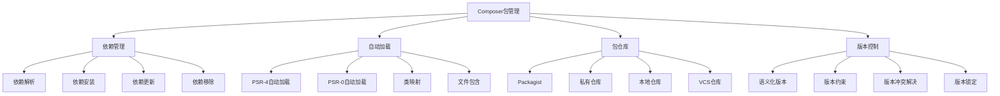

# Composer包管理

## 🎯 学习目标
- 理解Composer的核心概念和工作原理
- 掌握Composer的基本使用方法和命令
- 学会创建和管理自己的Composer包
- 了解Composer的最佳实践和高级特性

## 📚 核心概念

### Composer架构



### Composer核心文件

| 文件 | 描述 | 作用 | 示例 |
|------|------|------|------|
| composer.json | 项目配置文件 | 定义依赖和项目信息 | 依赖声明、自动加载配置 |
| composer.lock | 锁定文件 | 锁定具体版本 | 确保环境一致性 |
| vendor/ | 依赖目录 | 存储安装的包 | 第三方库文件 |
| autoload.php | 自动加载文件 | 自动加载类文件 | 引入自动加载机制 |

## 🔧 Composer包管理实现

### 基础Composer使用
```php
<?php
// 1. Composer项目配置
class ComposerProjectConfig {
    private array $config = [];
    
    public function __construct() {
        $this->config = [
            'name' => 'mycompany/myproject',
            'description' => 'A sample PHP project',
            'type' => 'project',
            'keywords' => ['php', 'composer', 'example'],
            'license' => 'MIT',
            'authors' => [
                [
                    'name' => 'John Doe',
                    'email' => 'john@example.com'
                ]
            ],
            'require' => [
                'php' => '>=7.4',
                'monolog/monolog' => '^2.0',
                'guzzlehttp/guzzle' => '^7.0'
            ],
            'require-dev' => [
                'phpunit/phpunit' => '^9.0',
                'phpstan/phpstan' => '^1.0'
            ],
            'autoload' => [
                'psr-4' => [
                    'MyCompany\\MyProject\\' => 'src/'
                ]
            ],
            'autoload-dev' => [
                'psr-4' => [
                    'MyCompany\\MyProject\\Tests\\' => 'tests/'
                ]
            ],
            'scripts' => [
                'test' => 'phpunit',
                'cs-fix' => 'php-cs-fixer fix',
                'stan' => 'phpstan analyse'
            ],
            'config' => [
                'optimize-autoloader' => true,
                'sort-packages' => true
            ]
        ];
    }
    
    // 生成composer.json内容
    public function generateComposerJson(): string {
        return json_encode($this->config, JSON_PRETTY_PRINT | JSON_UNESCAPED_SLASHES);
    }
    
    // 添加依赖
    public function addDependency(string $package, string $version): void {
        $this->config['require'][$package] = $version;
    }
    
    // 添加开发依赖
    public function addDevDependency(string $package, string $version): void {
        $this->config['require-dev'][$package] = $version;
    }
    
    // 添加自动加载规则
    public function addAutoload(string $namespace, string $path): void {
        $this->config['autoload']['psr-4'][$namespace] = $path;
    }
    
    // 添加脚本
    public function addScript(string $name, string $command): void {
        $this->config['scripts'][$name] = $command;
    }
    
    // 获取配置
    public function getConfig(): array {
        return $this->config;
    }
}

// 2. Composer命令执行器
class ComposerCommandExecutor {
    private string $workingDirectory;
    private array $environment;
    
    public function __construct(string $workingDirectory = '.') {
        $this->workingDirectory = $workingDirectory;
        $this->environment = [
            'COMPOSER_MEMORY_LIMIT' => '-1',
            'COMPOSER_NO_INTERACTION' => '1'
        ];
    }
    
    // 执行Composer命令
    public function executeCommand(string $command, array $options = []): array {
        $fullCommand = "composer {$command}";
        
        if (!empty($options)) {
            $fullCommand .= ' ' . implode(' ', $options);
        }
        
        $descriptorspec = [
            0 => ['pipe', 'r'],
            1 => ['pipe', 'w'],
            2 => ['pipe', 'w']
        ];
        
        $process = proc_open($fullCommand, $descriptorspec, $pipes, $this->workingDirectory, $this->environment);
        
        if (!is_resource($process)) {
            throw new Exception("Failed to execute command: {$fullCommand}");
        }
        
        fclose($pipes[0]);
        
        $output = stream_get_contents($pipes[1]);
        $error = stream_get_contents($pipes[2]);
        
        fclose($pipes[1]);
        fclose($pipes[2]);
        
        $returnCode = proc_close($process);
        
        return [
            'command' => $fullCommand,
            'return_code' => $returnCode,
            'output' => $output,
            'error' => $error,
            'success' => $returnCode === 0
        ];
    }
    
    // 安装依赖
    public function install(array $options = []): array {
        return $this->executeCommand('install', $options);
    }
    
    // 更新依赖
    public function update(array $packages = [], array $options = []): array {
        $command = 'update';
        if (!empty($packages)) {
            $command .= ' ' . implode(' ', $packages);
        }
        return $this->executeCommand($command, $options);
    }
    
    // 添加包
    public function require(string $package, string $version = null, array $options = []): array {
        $command = "require {$package}";
        if ($version) {
            $command .= ":{$version}";
        }
        return $this->executeCommand($command, $options);
    }
    
    // 移除包
    public function remove(string $package, array $options = []): array {
        return $this->executeCommand("remove {$package}", $options);
    }
    
    // 显示已安装的包
    public function show(array $options = []): array {
        return $this->executeCommand('show', $options);
    }
    
    // 验证composer.json
    public function validate(): array {
        return $this->executeCommand('validate');
    }
    
    // 生成自动加载文件
    public function dumpAutoload(array $options = []): array {
        return $this->executeCommand('dump-autoload', $options);
    }
    
    // 清理缓存
    public function clearCache(): array {
        return $this->executeCommand('clear-cache');
    }
    
    // 显示依赖树
    public function showTree(): array {
        return $this->executeCommand('show', ['--tree']);
    }
    
    // 检查过时的包
    public function outdated(): array {
        return $this->executeCommand('outdated');
    }
}

// 3. 包版本管理器
class PackageVersionManager {
    private array $installedPackages = [];
    private array $availableVersions = [];
    
    public function __construct() {
        $this->loadInstalledPackages();
    }
    
    // 加载已安装的包
    private function loadInstalledPackages(): void {
        $lockFile = 'composer.lock';
        if (file_exists($lockFile)) {
            $lockData = json_decode(file_get_contents($lockFile), true);
            if (isset($lockData['packages'])) {
                foreach ($lockData['packages'] as $package) {
                    $this->installedPackages[$package['name']] = [
                        'version' => $package['version'],
                        'source' => $package['source'] ?? null,
                        'dist' => $package['dist'] ?? null,
                        'require' => $package['require'] ?? [],
                        'require-dev' => $package['require-dev'] ?? []
                    ];
                }
            }
        }
    }
    
    // 获取已安装的包
    public function getInstalledPackages(): array {
        return $this->installedPackages;
    }
    
    // 检查包是否已安装
    public function isPackageInstalled(string $packageName): bool {
        return isset($this->installedPackages[$packageName]);
    }
    
    // 获取包版本
    public function getPackageVersion(string $packageName): ?string {
        return $this->installedPackages[$packageName]['version'] ?? null;
    }
    
    // 检查版本约束
    public function checkVersionConstraint(string $version, string $constraint): bool {
        return $this->satisfies($version, $constraint);
    }
    
    // 版本约束检查
    private function satisfies(string $version, string $constraint): bool {
        // 简化的版本约束检查
        if (strpos($constraint, '^') === 0) {
            $baseVersion = substr($constraint, 1);
            return version_compare($version, $baseVersion, '>=') && 
                   version_compare($version, $this->getNextMajorVersion($baseVersion), '<');
        }
        
        if (strpos($constraint, '~') === 0) {
            $baseVersion = substr($constraint, 1);
            return version_compare($version, $baseVersion, '>=') && 
                   version_compare($version, $this->getNextMinorVersion($baseVersion), '<');
        }
        
        if (strpos($constraint, '>=') === 0) {
            $minVersion = substr($constraint, 2);
            return version_compare($version, $minVersion, '>=');
        }
        
        if (strpos($constraint, '<=') === 0) {
            $maxVersion = substr($constraint, 2);
            return version_compare($version, $maxVersion, '<=');
        }
        
        if (strpos($constraint, '>') === 0) {
            $minVersion = substr($constraint, 1);
            return version_compare($version, $minVersion, '>');
        }
        
        if (strpos($constraint, '<') === 0) {
            $maxVersion = substr($constraint, 1);
            return version_compare($version, $maxVersion, '<');
        }
        
        return $version === $constraint;
    }
    
    // 获取下一个主版本
    private function getNextMajorVersion(string $version): string {
        $parts = explode('.', $version);
        $parts[0] = (int)$parts[0] + 1;
        $parts[1] = 0;
        $parts[2] = 0;
        return implode('.', $parts);
    }
    
    // 获取下一个次版本
    private function getNextMinorVersion(string $version): string {
        $parts = explode('.', $version);
        $parts[1] = (int)$parts[1] + 1;
        $parts[2] = 0;
        return implode('.', $parts);
    }
    
    // 分析依赖冲突
    public function analyzeDependencyConflicts(array $requirements): array {
        $conflicts = [];
        
        foreach ($requirements as $package => $constraint) {
            if ($this->isPackageInstalled($package)) {
                $installedVersion = $this->getPackageVersion($package);
                if (!$this->checkVersionConstraint($installedVersion, $constraint)) {
                    $conflicts[] = [
                        'package' => $package,
                        'installed_version' => $installedVersion,
                        'required_constraint' => $constraint,
                        'conflict' => true
                    ];
                }
            }
        }
        
        return $conflicts;
    }
    
    // 获取依赖树
    public function getDependencyTree(string $packageName = null): array {
        if ($packageName) {
            return $this->getPackageDependencyTree($packageName);
        }
        
        $tree = [];
        foreach ($this->installedPackages as $name => $package) {
            $tree[$name] = [
                'version' => $package['version'],
                'dependencies' => $this->getPackageDependencyTree($name)
            ];
        }
        
        return $tree;
    }
    
    // 获取包的依赖树
    private function getPackageDependencyTree(string $packageName): array {
        if (!isset($this->installedPackages[$packageName])) {
            return [];
        }
        
        $package = $this->installedPackages[$packageName];
        $dependencies = [];
        
        foreach ($package['require'] as $dep => $constraint) {
            if (isset($this->installedPackages[$dep])) {
                $dependencies[$dep] = [
                    'version' => $this->installedPackages[$dep]['version'],
                    'constraint' => $constraint,
                    'dependencies' => $this->getPackageDependencyTree($dep)
                ];
            }
        }
        
        return $dependencies;
    }
}

// 使用示例
echo "=== Composer包管理示例 ===\n";

try {
    // 创建Composer项目配置
    $config = new ComposerProjectConfig();
    
    // 添加依赖
    $config->addDependency('symfony/console', '^5.0');
    $config->addDevDependency('phpunit/phpunit', '^9.0');
    
    // 添加自动加载规则
    $config->addAutoload('App\\', 'app/');
    
    // 添加脚本
    $config->addScript('test', 'phpunit tests/');
    $config->addScript('serve', 'php -S localhost:8000');
    
    // 生成composer.json
    $composerJson = $config->generateComposerJson();
    echo "生成的composer.json:\n";
    echo $composerJson . "\n";
    
    // 创建Composer命令执行器
    $executor = new ComposerCommandExecutor();
    
    // 验证composer.json
    $validation = $executor->validate();
    echo "验证结果: " . ($validation['success'] ? '成功' : '失败') . "\n";
    
    if (!$validation['success']) {
        echo "错误信息: " . $validation['error'] . "\n";
    }
    
    // 创建包版本管理器
    $versionManager = new PackageVersionManager();
    
    // 获取已安装的包
    $installedPackages = $versionManager->getInstalledPackages();
    echo "已安装的包数量: " . count($installedPackages) . "\n";
    
    // 检查包是否已安装
    $isInstalled = $versionManager->isPackageInstalled('monolog/monolog');
    echo "monolog/monolog 是否已安装: " . ($isInstalled ? '是' : '否') . "\n";
    
    if ($isInstalled) {
        $version = $versionManager->getPackageVersion('monolog/monolog');
        echo "monolog/monolog 版本: {$version}\n";
    }
    
    // 检查版本约束
    $satisfies = $versionManager->checkVersionConstraint('2.0.0', '^1.0');
    echo "版本 2.0.0 是否满足约束 ^1.0: " . ($satisfies ? '是' : '否') . "\n";
    
    // 分析依赖冲突
    $requirements = [
        'monolog/monolog' => '^2.0',
        'guzzlehttp/guzzle' => '^7.0'
    ];
    
    $conflicts = $versionManager->analyzeDependencyConflicts($requirements);
    echo "依赖冲突分析:\n";
    foreach ($conflicts as $conflict) {
        echo "  包: {$conflict['package']}, 冲突: " . ($conflict['conflict'] ? '是' : '否') . "\n";
    }
    
    // 获取依赖树
    $dependencyTree = $versionManager->getDependencyTree();
    echo "依赖树结构:\n";
    foreach (array_slice($dependencyTree, 0, 3, true) as $package => $info) {
        echo "  {$package}: {$info['version']}\n";
    }
    
} catch (Exception $e) {
    echo "错误: " . $e->getMessage() . "\n";
}
?>
```

## 📊 最佳实践

### Composer包管理最佳实践
```php
<?php
// Composer包管理最佳实践

class ComposerBestPractices {
    // 1. 项目配置最佳实践
    public static function getProjectConfigBestPractices() {
        return [
            'composer.json配置' => [
                '版本约束' => '使用合适的版本约束符号',
                '依赖分类' => '区分生产依赖和开发依赖',
                '自动加载' => '配置PSR-4自动加载规则',
                '脚本定义' => '定义有用的Composer脚本'
            ],
            '版本管理' => [
                '语义化版本' => '遵循语义化版本规范',
                '版本锁定' => '提交composer.lock文件',
                '定期更新' => '定期更新依赖包',
                '安全更新' => '及时应用安全更新'
            ],
            '性能优化' => [
                '自动加载优化' => '使用优化的自动加载器',
                '包排序' => '启用包排序功能',
                '缓存利用' => '合理利用Composer缓存',
                '并行安装' => '使用并行安装功能'
            ]
        ];
    }
    
    // 2. 依赖管理最佳实践
    public static function getDependencyManagementBestPractices() {
        return [
            '依赖选择' => [
                '包质量' => '选择高质量、维护活跃的包',
                '包大小' => '考虑包的大小和依赖',
                '包兼容性' => '确保包与项目兼容',
                '包安全性' => '选择安全的包'
            ],
            '版本约束' => [
                '精确版本' => '避免使用过于精确的版本',
                '范围版本' => '使用合适的版本范围',
                '开发版本' => '谨慎使用开发版本',
                '版本测试' => '充分测试版本更新'
            ],
            '依赖更新' => [
                '定期更新' => '建立定期更新机制',
                '测试更新' => '在测试环境验证更新',
                '回滚准备' => '准备依赖回滚方案',
                '更新记录' => '记录依赖更新历史'
            ]
        ];
    }
    
    // 3. 包开发最佳实践
    public static function getPackageDevelopmentBestPractices() {
        return [
            '包结构' => [
                '目录结构' => '遵循标准的包目录结构',
                '命名规范' => '使用清晰的命名规范',
                '文档完善' => '提供完善的文档',
                '示例代码' => '提供使用示例'
            ],
            '版本发布' => [
                '版本号规范' => '遵循语义化版本规范',
                '变更日志' => '维护详细的变更日志',
                '标签管理' => '使用Git标签管理版本',
                '发布测试' => '充分测试后发布'
            ],
            '包维护' => [
                '问题响应' => '及时响应问题和反馈',
                '安全修复' => '及时修复安全问题',
                '功能更新' => '持续改进包功能',
                '兼容性维护' => '维护向后兼容性'
            ]
        ];
    }
}

// 使用示例
echo "=== Composer包管理最佳实践示例 ===\n";

try {
    $configPractices = ComposerBestPractices::getProjectConfigBestPractices();
    echo "项目配置最佳实践:\n";
    foreach ($configPractices as $category => $practices) {
        echo "  $category:\n";
        foreach ($practices as $practice => $description) {
            echo "    - $practice: $description\n";
        }
        echo "\n";
    }
    
} catch (Exception $e) {
    echo "错误: " . $e->getMessage() . "\n";
}
?>
```

## 🎓 学习建议

### 费曼学习法应用
1. **选择概念**: 选择Composer包管理中的核心概念
2. **简化解释**: 用简单语言解释Composer的作用
3. **识别盲点**: 发现理解不深入的地方
4. **重新学习**: 针对盲点进行深入学习

### 刻意练习重点
1. **基础命令**: 熟练使用Composer基础命令
2. **依赖管理**: 掌握依赖管理的方法和技巧
3. **包开发**: 学会创建和维护自己的包
4. **最佳实践**: 遵循Composer的最佳实践

## 🔗 相关链接
- [[02-第三方库使用|第三方库使用]]
- [[03-扩展开发|扩展开发]]
- [[04-社区资源|社区资源]]
- [[05-开源项目贡献|开源项目贡献]]
- [[06-技术选型指南|技术选型指南]]
