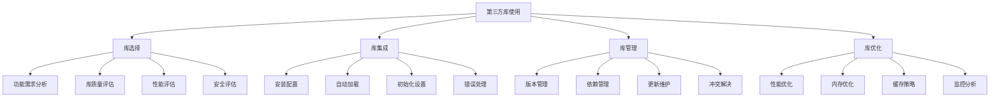

# 第三方库使用

## 🎯 学习目标
- 理解第三方库的选择和评估标准
- 掌握第三方库的集成和使用方法
- 学会处理第三方库的兼容性和安全问题
- 了解第三方库的最佳实践和优化策略

## 📚 核心概念

### 第三方库生态系统



### 第三方库分类

| 类别 | 描述 | 示例 | 特点 |
|------|------|------|------|
| HTTP客户端 | 处理HTTP请求 | Guzzle, cURL | 网络通信、API调用 |
| 数据库ORM | 数据库操作 | Eloquent, Doctrine | 数据持久化、查询构建 |
| 模板引擎 | 视图渲染 | Twig, Smarty | 模板分离、数据绑定 |
| 日志系统 | 日志记录 | Monolog, Log4php | 日志管理、级别控制 |
| 缓存系统 | 数据缓存 | Redis, Memcached | 性能提升、数据存储 |
| 验证库 | 数据验证 | Respect, Valitron | 输入验证、规则定义 |
| 加密库 | 数据加密 | OpenSSL, Sodium | 安全加密、哈希计算 |
| 图像处理 | 图像操作 | GD, Imagick | 图像处理、格式转换 |

## 🔧 第三方库使用实现

### 基础第三方库管理
```php
<?php
// 1. 第三方库管理器
class ThirdPartyLibraryManager {
    private array $libraries = [];
    private array $config = [];
    private array $dependencies = [];
    
    public function __construct(array $config = []) {
        $this->config = array_merge([
            'auto_load' => true,
            'error_handling' => true,
            'performance_monitoring' => false,
            'cache_enabled' => false
        ], $config);
    }
    
    // 注册第三方库
    public function registerLibrary(string $name, array $config): void {
        $this->libraries[$name] = array_merge([
            'name' => $name,
            'version' => '1.0.0',
            'enabled' => true,
            'auto_load' => true,
            'dependencies' => [],
            'config' => [],
            'initialized' => false
        ], $config);
    }
    
    // 初始化库
    public function initializeLibrary(string $name): bool {
        if (!isset($this->libraries[$name])) {
            throw new Exception("Library '{$name}' not registered");
        }
        
        $library = &$this->libraries[$name];
        
        if ($library['initialized']) {
            return true;
        }
        
        // 检查依赖
        if (!$this->checkDependencies($library['dependencies'])) {
            throw new Exception("Dependencies not met for library '{$name}'");
        }
        
        // 执行初始化
        if (isset($library['init_callback']) && is_callable($library['init_callback'])) {
            $library['init_callback']($library['config']);
        }
        
        $library['initialized'] = true;
        return true;
    }
    
    // 检查依赖
    private function checkDependencies(array $dependencies): bool {
        foreach ($dependencies as $dep) {
            if (!isset($this->libraries[$dep]) || !$this->libraries[$dep]['initialized']) {
                return false;
            }
        }
        return true;
    }
    
    // 获取库实例
    public function getLibrary(string $name) {
        if (!isset($this->libraries[$name])) {
            throw new Exception("Library '{$name}' not found");
        }
        
        $library = $this->libraries[$name];
        
        if (!$library['initialized']) {
            $this->initializeLibrary($name);
        }
        
        return $library['instance'] ?? null;
    }
    
    // 检查库是否可用
    public function isLibraryAvailable(string $name): bool {
        return isset($this->libraries[$name]) && 
               $this->libraries[$name]['enabled'] && 
               $this->libraries[$name]['initialized'];
    }
    
    // 获取所有库状态
    public function getLibraryStatus(): array {
        $status = [];
        foreach ($this->libraries as $name => $library) {
            $status[$name] = [
                'enabled' => $library['enabled'],
                'initialized' => $library['initialized'],
                'version' => $library['version'],
                'dependencies' => $library['dependencies']
            ];
        }
        return $status;
    }
    
    // 禁用库
    public function disableLibrary(string $name): void {
        if (isset($this->libraries[$name])) {
            $this->libraries[$name]['enabled'] = false;
        }
    }
    
    // 启用库
    public function enableLibrary(string $name): void {
        if (isset($this->libraries[$name])) {
            $this->libraries[$name]['enabled'] = true;
        }
    }
}

// 2. HTTP客户端库封装
class HttpClientWrapper {
    private $client;
    private array $config;
    private array $middleware = [];
    
    public function __construct(array $config = []) {
        $this->config = array_merge([
            'timeout' => 30,
            'verify' => true,
            'headers' => [],
            'base_uri' => null
        ], $config);
        
        $this->initializeClient();
    }
    
    // 初始化客户端
    private function initializeClient(): void {
        // 模拟HTTP客户端初始化
        $this->client = new stdClass();
        $this->client->config = $this->config;
        $this->client->middleware = [];
    }
    
    // 添加中间件
    public function addMiddleware(callable $middleware): void {
        $this->middleware[] = $middleware;
    }
    
    // 发送GET请求
    public function get(string $url, array $options = []): array {
        return $this->request('GET', $url, $options);
    }
    
    // 发送POST请求
    public function post(string $url, array $data = [], array $options = []): array {
        $options['json'] = $data;
        return $this->request('POST', $url, $options);
    }
    
    // 发送PUT请求
    public function put(string $url, array $data = [], array $options = []): array {
        $options['json'] = $data;
        return $this->request('PUT', $url, $options);
    }
    
    // 发送DELETE请求
    public function delete(string $url, array $options = []): array {
        return $this->request('DELETE', $url, $options);
    }
    
    // 发送请求
    private function request(string $method, string $url, array $options = []): array {
        $startTime = microtime(true);
        
        try {
            // 执行中间件
            foreach ($this->middleware as $middleware) {
                $options = $middleware($method, $url, $options);
            }
            
            // 模拟HTTP请求
            $response = $this->simulateHttpRequest($method, $url, $options);
            
            $endTime = microtime(true);
            $duration = ($endTime - $startTime) * 1000;
            
            return [
                'status_code' => $response['status_code'],
                'headers' => $response['headers'],
                'body' => $response['body'],
                'duration' => $duration,
                'success' => $response['status_code'] >= 200 && $response['status_code'] < 300
            ];
            
        } catch (Exception $e) {
            return [
                'status_code' => 0,
                'headers' => [],
                'body' => '',
                'error' => $e->getMessage(),
                'success' => false
            ];
        }
    }
    
    // 模拟HTTP请求
    private function simulateHttpRequest(string $method, string $url, array $options): array {
        // 模拟响应
        return [
            'status_code' => 200,
            'headers' => [
                'Content-Type' => 'application/json',
                'Content-Length' => '100'
            ],
            'body' => json_encode(['message' => 'Success', 'method' => $method, 'url' => $url])
        ];
    }
}

// 3. 数据库ORM封装
class DatabaseORMWrapper {
    private $connection;
    private array $config;
    private array $models = [];
    
    public function __construct(array $config) {
        $this->config = $config;
        $this->initializeConnection();
    }
    
    // 初始化数据库连接
    private function initializeConnection(): void {
        // 模拟数据库连接
        $this->connection = new stdClass();
        $this->connection->config = $this->config;
        $this->connection->connected = true;
    }
    
    // 定义模型
    public function defineModel(string $name, array $attributes): void {
        $this->models[$name] = [
            'name' => $name,
            'attributes' => $attributes,
            'table' => strtolower($name) . 's',
            'primary_key' => 'id',
            'timestamps' => true
        ];
    }
    
    // 创建记录
    public function create(string $model, array $data): array {
        if (!isset($this->models[$model])) {
            throw new Exception("Model '{$model}' not defined");
        }
        
        $modelConfig = $this->models[$model];
        
        // 添加时间戳
        if ($modelConfig['timestamps']) {
            $data['created_at'] = date('Y-m-d H:i:s');
            $data['updated_at'] = date('Y-m-d H:i:s');
        }
        
        // 模拟数据库插入
        $data['id'] = rand(1, 1000);
        
        return $data;
    }
    
    // 查找记录
    public function find(string $model, $id): ?array {
        if (!isset($this->models[$model])) {
            throw new Exception("Model '{$model}' not defined");
        }
        
        // 模拟数据库查询
        return [
            'id' => $id,
            'name' => 'Sample Record',
            'created_at' => date('Y-m-d H:i:s'),
            'updated_at' => date('Y-m-d H:i:s')
        ];
    }
    
    // 更新记录
    public function update(string $model, $id, array $data): bool {
        if (!isset($this->models[$model])) {
            throw new Exception("Model '{$model}' not defined");
        }
        
        $modelConfig = $this->models[$model];
        
        // 添加更新时间戳
        if ($modelConfig['timestamps']) {
            $data['updated_at'] = date('Y-m-d H:i:s');
        }
        
        // 模拟数据库更新
        return true;
    }
    
    // 删除记录
    public function delete(string $model, $id): bool {
        if (!isset($this->models[$model])) {
            throw new Exception("Model '{$model}' not defined");
        }
        
        // 模拟数据库删除
        return true;
    }
    
    // 查询构建器
    public function query(string $model): QueryBuilder {
        if (!isset($this->models[$model])) {
            throw new Exception("Model '{$model}' not defined");
        }
        
        return new QueryBuilder($model, $this->models[$model]);
    }
}

// 4. 查询构建器
class QueryBuilder {
    private string $model;
    private array $modelConfig;
    private array $conditions = [];
    private array $select = [];
    private array $orderBy = [];
    private int $limit = 0;
    private int $offset = 0;
    
    public function __construct(string $model, array $modelConfig) {
        $this->model = $model;
        $this->modelConfig = $modelConfig;
    }
    
    // 选择字段
    public function select(array $fields): self {
        $this->select = $fields;
        return $this;
    }
    
    // 添加条件
    public function where(string $field, string $operator, $value): self {
        $this->conditions[] = [
            'field' => $field,
            'operator' => $operator,
            'value' => $value
        ];
        return $this;
    }
    
    // 排序
    public function orderBy(string $field, string $direction = 'ASC'): self {
        $this->orderBy[] = [
            'field' => $field,
            'direction' => $direction
        ];
        return $this;
    }
    
    // 限制数量
    public function limit(int $limit): self {
        $this->limit = $limit;
        return $this;
    }
    
    // 偏移量
    public function offset(int $offset): self {
        $this->offset = $offset;
        return $this;
    }
    
    // 执行查询
    public function get(): array {
        // 模拟数据库查询
        return [
            [
                'id' => 1,
                'name' => 'Record 1',
                'created_at' => date('Y-m-d H:i:s')
            ],
            [
                'id' => 2,
                'name' => 'Record 2',
                'created_at' => date('Y-m-d H:i:s')
            ]
        ];
    }
    
    // 获取第一条记录
    public function first(): ?array {
        $results = $this->get();
        return $results[0] ?? null;
    }
    
    // 统计数量
    public function count(): int {
        return 2; // 模拟结果
    }
}

// 使用示例
echo "=== 第三方库使用示例 ===\n";

try {
    // 创建第三方库管理器
    $libraryManager = new ThirdPartyLibraryManager([
        'auto_load' => true,
        'error_handling' => true,
        'performance_monitoring' => true
    ]);
    
    // 注册HTTP客户端库
    $libraryManager->registerLibrary('http_client', [
        'version' => '7.0.0',
        'init_callback' => function($config) {
            return new HttpClientWrapper($config);
        },
        'config' => [
            'timeout' => 30,
            'verify' => true
        ]
    ]);
    
    // 注册数据库ORM库
    $libraryManager->registerLibrary('database_orm', [
        'version' => '2.0.0',
        'init_callback' => function($config) {
            return new DatabaseORMWrapper($config);
        },
        'config' => [
            'host' => 'localhost',
            'database' => 'test_db',
            'username' => 'root',
            'password' => 'password'
        ]
    ]);
    
    // 初始化库
    $libraryManager->initializeLibrary('http_client');
    $libraryManager->initializeLibrary('database_orm');
    
    // 获取库实例
    $httpClient = $libraryManager->getLibrary('http_client');
    $databaseORM = $libraryManager->getLibrary('database_orm');
    
    // 使用HTTP客户端
    $response = $httpClient->get('https://api.example.com/users');
    echo "HTTP响应状态: {$response['status_code']}\n";
    echo "响应时间: {$response['duration']}ms\n";
    
    // 使用数据库ORM
    $databaseORM->defineModel('User', [
        'id' => 'integer',
        'name' => 'string',
        'email' => 'string',
        'created_at' => 'datetime'
    ]);
    
    // 创建用户
    $user = $databaseORM->create('User', [
        'name' => 'John Doe',
        'email' => 'john@example.com'
    ]);
    echo "创建用户ID: {$user['id']}\n";
    
    // 查询用户
    $foundUser = $databaseORM->find('User', 1);
    if ($foundUser) {
        echo "找到用户: {$foundUser['name']}\n";
    }
    
    // 使用查询构建器
    $users = $databaseORM->query('User')
        ->select(['id', 'name', 'email'])
        ->where('name', '=', 'John Doe')
        ->orderBy('created_at', 'DESC')
        ->limit(10)
        ->get();
    
    echo "查询到用户数量: " . count($users) . "\n";
    
    // 获取库状态
    $status = $libraryManager->getLibraryStatus();
    echo "库状态:\n";
    foreach ($status as $name => $info) {
        echo "  {$name}: " . ($info['initialized'] ? '已初始化' : '未初始化') . "\n";
    }
    
} catch (Exception $e) {
    echo "错误: " . $e->getMessage() . "\n";
}
?>
```

## 📊 最佳实践

### 第三方库使用最佳实践
```php
<?php
// 第三方库使用最佳实践

class ThirdPartyLibraryBestPractices {
    // 1. 库选择最佳实践
    public static function getLibrarySelectionBestPractices() {
        return [
            '功能评估' => [
                '需求匹配' => '确保库功能完全匹配项目需求',
                '功能完整性' => '评估库功能的完整性和稳定性',
                '扩展性' => '考虑库的扩展性和定制能力',
                '文档质量' => '评估库文档的完整性和清晰度'
            ],
            '质量评估' => [
                '代码质量' => '检查库的代码质量和编码规范',
                '测试覆盖' => '评估库的测试覆盖率',
                '维护活跃度' => '检查库的维护活跃度和更新频率',
                '社区支持' => '评估社区支持和问题解决能力'
            ],
            '性能评估' => [
                '性能基准' => '进行性能基准测试',
                '内存使用' => '评估库的内存使用情况',
                'CPU消耗' => '测试库的CPU消耗',
                '网络开销' => '评估网络相关的开销'
            ],
            '安全评估' => [
                '安全漏洞' => '检查已知的安全漏洞',
                '安全更新' => '评估安全更新的及时性',
                '权限控制' => '检查权限控制机制',
                '数据保护' => '评估数据保护措施'
            ]
        ];
    }
    
    // 2. 集成最佳实践
    public static function getIntegrationBestPractices() {
        return [
            '安装配置' => [
                '版本锁定' => '锁定具体的库版本',
                '环境隔离' => '使用虚拟环境隔离依赖',
                '配置管理' => '集中管理库配置',
                '错误处理' => '实现完善的错误处理机制'
            ],
            '自动加载' => [
                'PSR标准' => '遵循PSR自动加载标准',
                '性能优化' => '优化自动加载性能',
                '命名空间' => '合理使用命名空间',
                '类映射' => '使用类映射提高性能'
            ],
            '初始化管理' => [
                '延迟加载' => '实现延迟加载机制',
                '依赖注入' => '使用依赖注入管理库',
                '配置验证' => '验证库配置的正确性',
                '状态管理' => '管理库的初始化状态'
            ]
        ];
    }
    
    // 3. 维护最佳实践
    public static function getMaintenanceBestPractices() {
        return [
            '版本管理' => [
                '版本跟踪' => '跟踪库版本变化',
                '兼容性测试' => '测试版本兼容性',
                '回滚策略' => '准备版本回滚策略',
                '更新计划' => '制定库更新计划'
            ],
            '监控分析' => [
                '性能监控' => '监控库性能指标',
                '错误监控' => '监控库相关错误',
                '使用统计' => '统计库使用情况',
                '资源监控' => '监控资源消耗'
            ],
            '优化策略' => [
                '性能优化' => '优化库使用性能',
                '内存优化' => '优化内存使用',
                '缓存策略' => '实现合适的缓存策略',
                '并发优化' => '优化并发使用'
            ]
        ];
    }
}

// 使用示例
echo "=== 第三方库使用最佳实践示例 ===\n";

try {
    $selectionPractices = ThirdPartyLibraryBestPractices::getLibrarySelectionBestPractices();
    echo "库选择最佳实践:\n";
    foreach ($selectionPractices as $category => $practices) {
        echo "  $category:\n";
        foreach ($practices as $practice => $description) {
            echo "    - $practice: $description\n";
        }
        echo "\n";
    }
    
} catch (Exception $e) {
    echo "错误: " . $e->getMessage() . "\n";
}
?>
```

## 🎓 学习建议

### 费曼学习法应用
1. **选择概念**: 选择第三方库使用中的核心概念
2. **简化解释**: 用简单语言解释第三方库的作用
3. **识别盲点**: 发现理解不深入的地方
4. **重新学习**: 针对盲点进行深入学习

### 刻意练习重点
1. **库选择**: 掌握第三方库的选择和评估方法
2. **库集成**: 学会第三方库的集成和使用
3. **库管理**: 掌握第三方库的管理和维护
4. **性能优化**: 学会第三方库的性能优化

## 🔗 相关链接
- [[01-Composer包管理|Composer包管理]]
- [[03-扩展开发|扩展开发]]
- [[04-社区资源|社区资源]]
- [[05-开源项目贡献|开源项目贡献]]
- [[06-技术选型指南|技术选型指南]]
