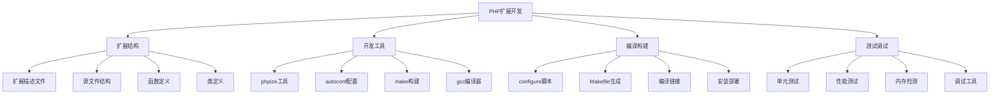

# 扩展开发

## 🎯 学习目标
- 理解PHP扩展开发的基本概念和架构
- 掌握PHP扩展开发的基本流程和工具
- 学会编写简单的PHP扩展
- 了解PHP扩展的性能优化和调试技巧

## 📚 核心概念

### PHP扩展架构



### PHP扩展类型

| 类型 | 描述 | 特点 | 示例 |
|------|------|------|------|
| 函数扩展 | 提供PHP函数 | 简单易用、性能高 | 数学函数、字符串函数 |
| 类扩展 | 提供PHP类 | 面向对象、功能丰富 | PDO、GD库 |
| 资源扩展 | 管理外部资源 | 资源管理、内存控制 | 文件句柄、数据库连接 |
| 流扩展 | 处理数据流 | 统一接口、可扩展 | 文件流、网络流 |
| 过滤器扩展 | 数据过滤处理 | 链式处理、可组合 | 压缩过滤器、加密过滤器 |

## 🔧 扩展开发实现

### 基础扩展开发
```php
<?php
// 1. PHP扩展开发工具
class PHPExtensionDevelopmentTool {
    private string $extensionName;
    private string $extensionPath;
    private array $config;
    
    public function __construct(string $name, string $path) {
        $this->extensionName = $name;
        $this->extensionPath = $path;
        $this->config = [
            'version' => '1.0.0',
            'author' => 'Developer',
            'email' => 'dev@example.com',
            'description' => 'A sample PHP extension',
            'php_version' => '7.4+',
            'dependencies' => []
        ];
    }
    
    // 创建扩展目录结构
    public function createExtensionStructure(): bool {
        $directories = [
            $this->extensionPath,
            $this->extensionPath . '/src',
            $this->extensionPath . '/tests',
            $this->extensionPath . '/docs'
        ];
        
        foreach ($directories as $dir) {
            if (!is_dir($dir)) {
                if (!mkdir($dir, 0755, true)) {
                    throw new Exception("Failed to create directory: {$dir}");
                }
            }
        }
        
        return true;
    }
    
    // 生成config.m4文件
    public function generateConfigM4(): string {
        $content = "PHP_ARG_ENABLE({$this->extensionName}, whether to enable {$this->extensionName} support,
[  --enable-{$this->extensionName}           Enable {$this->extensionName} support])

if test \"\$PHP_{$this->extensionName}\" != \"no\"; then
    PHP_NEW_EXTENSION({$this->extensionName}, src/{$this->extensionName}.c, \$ext_shared)
fi";
        
        return $content;
    }
    
    // 生成php_{$this->extensionName}.h头文件
    public function generateHeaderFile(): string {
        $upperName = strtoupper($this->extensionName);
        $content = "#ifndef PHP_{$upperName}_H
#define PHP_{$upperName}_H

extern zend_module_entry {$this->extensionName}_module_entry;
#define phpext_{$this->extensionName}_ptr &{$this->extensionName}_module_entry

#define PHP_{$upperName}_VERSION \"{$this->config['version']}\"

#ifdef PHP_WIN32
#   define PHP_{$upperName}_API __declspec(dllexport)
#elif defined(__GNUC__) && __GNUC__ >= 4
#   define PHP_{$upperName}_API __attribute__ ((visibility(\"default\")))
#else
#   define PHP_{$upperName}_API
#endif

#ifdef ZTS
#include \"TSRM.h\"
#endif

PHP_MINIT_FUNCTION({$this->extensionName});
PHP_MSHUTDOWN_FUNCTION({$this->extensionName});
PHP_RINIT_FUNCTION({$this->extensionName});
PHP_RSHUTDOWN_FUNCTION({$this->extensionName});
PHP_MINFO_FUNCTION({$this->extensionName});

#endif";
        
        return $content;
    }
    
    // 生成主源文件
    public function generateMainSourceFile(): string {
        $upperName = strtoupper($this->extensionName);
        $content = "#include \"php.h\"
#include \"php_{$this->extensionName}.h\"

/* {{{ {$this->extensionName}_functions[]
 */
static const zend_function_entry {$this->extensionName}_functions[] = {
    PHP_FE_END
};
/* }}} */

/* {{{ {$this->extensionName}_module_entry
 */
zend_module_entry {$this->extensionName}_module_entry = {
    STANDARD_MODULE_HEADER,
    \"{$this->extensionName}\",
    {$this->extensionName}_functions,
    PHP_MINIT({$this->extensionName}),
    PHP_MSHUTDOWN({$this->extensionName}),
    PHP_RINIT({$this->extensionName}),
    PHP_RSHUTDOWN({$this->extensionName}),
    PHP_MINFO({$this->extensionName}),
    PHP_{$upperName}_VERSION,
    STANDARD_MODULE_PROPERTIES
};
/* }}} */

#ifdef COMPILE_DL_{$upperName}
#ifdef ZTS
ZEND_TSRMLS_CACHE_DEFINE()
#endif
ZEND_GET_MODULE({$this->extensionName})
#endif

/* {{{ PHP_MINIT_FUNCTION
 */
PHP_MINIT_FUNCTION({$this->extensionName})
{
    return SUCCESS;
}
/* }}} */

/* {{{ PHP_MSHUTDOWN_FUNCTION
 */
PHP_MSHUTDOWN_FUNCTION({$this->extensionName})
{
    return SUCCESS;
}
/* }}} */

/* {{{ PHP_RINIT_FUNCTION
 */
PHP_RINIT_FUNCTION({$this->extensionName})
{
    return SUCCESS;
}
/* }}} */

/* {{{ PHP_RSHUTDOWN_FUNCTION
 */
PHP_RSHUTDOWN_FUNCTION({$this->extensionName})
{
    return SUCCESS;
}
/* }}} */

/* {{{ PHP_MINFO_FUNCTION
 */
PHP_MINFO_FUNCTION({$this->extensionName})
{
    php_info_print_table_start();
    php_info_print_table_header(2, \"{$this->extensionName} support\", \"enabled\");
    php_info_print_table_row(2, \"version\", PHP_{$upperName}_VERSION);
    php_info_print_table_end();
}
/* }}} */";
        
        return $content;
    }
    
    // 生成Makefile
    public function generateMakefile(): string {
        $content = "PHP_INCLUDE = \$(shell php-config --includes)
PHP_LIBS = \$(shell php-config --libs)
PHP_EXTENSION_DIR = \$(shell php-config --extension-dir)

CFLAGS = -Wall -fPIC \$(PHP_INCLUDE)
LDFLAGS = -shared \$(PHP_LIBS)

TARGET = {$this->extensionName}.so
SOURCES = src/{$this->extensionName}.c

\$(TARGET): \$(SOURCES)
\tgcc \$(CFLAGS) -o \$@ \$^ \$(LDFLAGS)

install: \$(TARGET)
\tcp \$(TARGET) \$(PHP_EXTENSION_DIR)/
\techo \"extension={$this->extensionName}.so\" >> /etc/php/conf.d/{$this->extensionName}.ini

clean:
\trm -f \$(TARGET)

.PHONY: install clean";
        
        return $content;
    }
    
    // 生成测试文件
    public function generateTestFile(): string {
        $content = "--TEST--
{$this->extensionName} extension test
--SKIPIF--
<?php
if (!extension_loaded('{$this->extensionName}')) {
    die('skip {$this->extensionName} extension not loaded');
}
?>
--FILE--
<?php
echo \"{$this->extensionName} extension loaded successfully\\n\";
?>
--EXPECT--
{$this->extensionName} extension loaded successfully
";
        
        return $content;
    }
    
    // 构建扩展
    public function buildExtension(): bool {
        $this->createExtensionStructure();
        
        // 生成文件
        file_put_contents($this->extensionPath . '/config.m4', $this->generateConfigM4());
        file_put_contents($this->extensionPath . '/php_' . $this->extensionName . '.h', $this->generateHeaderFile());
        file_put_contents($this->extensionPath . '/src/' . $this->extensionName . '.c', $this->generateMainSourceFile());
        file_put_contents($this->extensionPath . '/Makefile', $this->generateMakefile());
        file_put_contents($this->extensionPath . '/tests/' . $this->extensionName . '.phpt', $this->generateTestFile());
        
        return true;
    }
}

// 2. 扩展函数开发
class ExtensionFunctionDeveloper {
    private string $extensionName;
    private array $functions = [];
    
    public function __construct(string $extensionName) {
        $this->extensionName = $extensionName;
    }
    
    // 添加函数定义
    public function addFunction(string $name, array $config): void {
        $this->functions[$name] = array_merge([
            'name' => $name,
            'return_type' => 'void',
            'parameters' => [],
            'description' => '',
            'example' => ''
        ], $config);
    }
    
    // 生成函数声明
    public function generateFunctionDeclarations(): string {
        $declarations = [];
        
        foreach ($this->functions as $func) {
            $declarations[] = "PHP_FUNCTION({$func['name']});";
        }
        
        return implode("\n", $declarations);
    }
    
    // 生成函数实现
    public function generateFunctionImplementations(): string {
        $implementations = [];
        
        foreach ($this->functions as $func) {
            $implementation = $this->generateSingleFunctionImplementation($func);
            $implementations[] = $implementation;
        }
        
        return implode("\n\n", $implementations);
    }
    
    // 生成单个函数实现
    private function generateSingleFunctionImplementation(array $func): string {
        $name = $func['name'];
        $params = $func['parameters'];
        
        $content = "/* {{{ proto {$func['return_type']} {$name}(";
        
        $paramList = [];
        foreach ($params as $param) {
            $paramList[] = $param['type'] . ' ' . $param['name'];
        }
        $content .= implode(', ', $paramList) . ")\n   {$func['description']} */\n";
        
        $content .= "PHP_FUNCTION({$name})\n{\n";
        
        // 参数解析
        if (!empty($params)) {
            $content .= "    zend_string *arg;\n";
            $content .= "    ZEND_PARSE_PARAMETERS_START(" . count($params) . ", " . count($params) . ")\n";
            
            foreach ($params as $param) {
                $content .= "        Z_PARAM_STR({$param['name']})\n";
            }
            
            $content .= "    ZEND_PARSE_PARAMETERS_END();\n\n";
        }
        
        // 函数体
        $content .= "    // TODO: Implement function logic\n";
        $content .= "    RETURN_TRUE;\n";
        $content .= "}\n/* }}} */";
        
        return $content;
    }
    
    // 生成函数注册
    public function generateFunctionRegistration(): string {
        $registrations = [];
        
        foreach ($this->functions as $func) {
            $registrations[] = "    PHP_FE({$func['name']}, NULL)";
        }
        
        return implode(",\n", $registrations);
    }
}

// 3. 扩展类开发
class ExtensionClassDeveloper {
    private string $extensionName;
    private array $classes = [];
    
    public function __construct(string $extensionName) {
        $this->extensionName = $extensionName;
    }
    
    // 添加类定义
    public function addClass(string $name, array $config): void {
        $this->classes[$name] = array_merge([
            'name' => $name,
            'methods' => [],
            'properties' => [],
            'constants' => [],
            'parent' => null,
            'interfaces' => []
        ], $config);
    }
    
    // 生成类声明
    public function generateClassDeclarations(): string {
        $declarations = [];
        
        foreach ($this->classes as $class) {
            $declarations[] = "zend_class_entry *{$class['name']}_ce;";
        }
        
        return implode("\n", $declarations);
    }
    
    // 生成类注册
    public function generateClassRegistration(): string {
        $registrations = [];
        
        foreach ($this->classes as $class) {
            $registration = $this->generateSingleClassRegistration($class);
            $registrations[] = $registration;
        }
        
        return implode("\n\n", $registrations);
    }
    
    // 生成单个类注册
    private function generateSingleClassRegistration(array $class): string {
        $name = $class['name'];
        $content = "/* {{{ {$name} class registration */\n";
        $content .= "INIT_CLASS_ENTRY(ce, \"{$name}\", {$name}_methods);\n";
        $content .= "{$name}_ce = zend_register_internal_class(&ce);\n";
        
        // 注册属性
        foreach ($class['properties'] as $prop) {
            $content .= "zend_declare_property({$name}_ce, \"{$prop['name']}\", " . strlen($prop['name']) . ", ";
            $content .= "ZVAL_UNDEF, ZEND_ACC_{$prop['visibility']});\n";
        }
        
        // 注册常量
        foreach ($class['constants'] as $const) {
            $content .= "zend_declare_class_constant_string({$name}_ce, \"{$const['name']}\", ";
            $content .= strlen($const['name']) . ", \"{$const['value']}\");\n";
        }
        
        $content .= "/* }}} */";
        
        return $content;
    }
    
    // 生成方法实现
    public function generateMethodImplementations(): string {
        $implementations = [];
        
        foreach ($this->classes as $class) {
            foreach ($class['methods'] as $method) {
                $implementation = $this->generateSingleMethodImplementation($class['name'], $method);
                $implementations[] = $implementation;
            }
        }
        
        return implode("\n\n", $implementations);
    }
    
    // 生成单个方法实现
    private function generateSingleMethodImplementation(string $className, array $method): string {
        $methodName = $method['name'];
        $params = $method['parameters'] ?? [];
        
        $content = "/* {{{ proto {$method['return_type']} {$className}::{$methodName}(";
        
        $paramList = [];
        foreach ($params as $param) {
            $paramList[] = $param['type'] . ' ' . $param['name'];
        }
        $content .= implode(', ', $paramList) . ")\n   {$method['description']} */\n";
        
        $content .= "PHP_METHOD({$className}, {$methodName})\n{\n";
        
        // 参数解析
        if (!empty($params)) {
            $content .= "    ZEND_PARSE_PARAMETERS_START(" . count($params) . ", " . count($params) . ")\n";
            
            foreach ($params as $param) {
                $content .= "        Z_PARAM_STR({$param['name']})\n";
            }
            
            $content .= "    ZEND_PARSE_PARAMETERS_END();\n\n";
        }
        
        // 方法体
        $content .= "    // TODO: Implement method logic\n";
        $content .= "    RETURN_TRUE;\n";
        $content .= "}\n/* }}} */";
        
        return $content;
    }
}

// 使用示例
echo "=== PHP扩展开发示例 ===\n";

try {
    // 创建扩展开发工具
    $devTool = new PHPExtensionDevelopmentTool('myextension', './myextension');
    
    // 构建扩展
    $devTool->buildExtension();
    echo "扩展结构创建完成\n";
    
    // 创建函数开发器
    $funcDeveloper = new ExtensionFunctionDeveloper('myextension');
    
    // 添加函数
    $funcDeveloper->addFunction('myextension_hello', [
        'return_type' => 'string',
        'parameters' => [
            ['type' => 'string', 'name' => 'name']
        ],
        'description' => 'Say hello to someone'
    ]);
    
    $funcDeveloper->addFunction('myextension_add', [
        'return_type' => 'int',
        'parameters' => [
            ['type' => 'int', 'name' => 'a'],
            ['type' => 'int', 'name' => 'b']
        ],
        'description' => 'Add two numbers'
    ]);
    
    // 生成函数声明
    $declarations = $funcDeveloper->generateFunctionDeclarations();
    echo "函数声明:\n{$declarations}\n";
    
    // 生成函数实现
    $implementations = $funcDeveloper->generateFunctionImplementations();
    echo "函数实现:\n{$implementations}\n";
    
    // 创建类开发器
    $classDeveloper = new ExtensionClassDeveloper('myextension');
    
    // 添加类
    $classDeveloper->addClass('MyExtensionClass', [
        'methods' => [
            [
                'name' => 'greet',
                'return_type' => 'string',
                'parameters' => [
                    ['type' => 'string', 'name' => 'name']
                ],
                'description' => 'Greet someone'
            ]
        ],
        'properties' => [
            ['name' => 'name', 'visibility' => 'PUBLIC']
        ],
        'constants' => [
            ['name' => 'VERSION', 'value' => '1.0.0']
        ]
    ]);
    
    // 生成类声明
    $classDeclarations = $classDeveloper->generateClassDeclarations();
    echo "类声明:\n{$classDeclarations}\n";
    
    // 生成类注册
    $classRegistration = $classDeveloper->generateClassRegistration();
    echo "类注册:\n{$classRegistration}\n";
    
    // 生成方法实现
    $methodImplementations = $classDeveloper->generateMethodImplementations();
    echo "方法实现:\n{$methodImplementations}\n";
    
} catch (Exception $e) {
    echo "错误: " . $e->getMessage() . "\n";
}
?>
```

## 📊 最佳实践

### 扩展开发最佳实践
```php
<?php
// PHP扩展开发最佳实践

class PHPExtensionDevelopmentBestPractices {
    // 1. 开发流程最佳实践
    public static function getDevelopmentProcessBestPractices() {
        return [
            '项目规划' => [
                '需求分析' => '明确扩展的功能需求和性能要求',
                '架构设计' => '设计清晰的扩展架构和接口',
                '技术选型' => '选择合适的技术栈和工具',
                '开发计划' => '制定详细的开发计划和时间表'
            ],
            '代码开发' => [
                '编码规范' => '遵循PHP扩展编码规范',
                '错误处理' => '实现完善的错误处理机制',
                '内存管理' => '正确管理内存分配和释放',
                '性能优化' => '优化扩展性能和资源使用'
            ],
            '测试验证' => [
                '单元测试' => '编写全面的单元测试',
                '集成测试' => '进行集成测试验证',
                '性能测试' => '进行性能基准测试',
                '兼容性测试' => '测试不同PHP版本兼容性'
            ],
            '发布部署' => [
                '版本管理' => '使用语义化版本管理',
                '文档编写' => '编写完整的用户文档',
                '发布流程' => '建立规范的发布流程',
                '用户支持' => '提供用户支持和反馈渠道'
            ]
        ];
    }
    
    // 2. 性能优化最佳实践
    public static function getPerformanceOptimizationBestPractices() {
        return [
            '内存优化' => [
                '内存分配' => '合理分配和释放内存',
                '内存泄漏' => '避免内存泄漏问题',
                '内存池' => '使用内存池提高效率',
                '垃圾回收' => '配合PHP垃圾回收机制'
            ],
            'CPU优化' => [
                '算法优化' => '选择高效的算法和数据结构',
                '循环优化' => '优化循环和条件判断',
                '函数调用' => '减少不必要的函数调用',
                '缓存策略' => '实现合适的缓存策略'
            ],
            'I/O优化' => [
                '文件操作' => '优化文件读写操作',
                '网络通信' => '优化网络通信效率',
                '数据库访问' => '优化数据库访问性能',
                '缓存利用' => '充分利用系统缓存'
            ]
        ];
    }
    
    // 3. 调试技巧最佳实践
    public static function getDebuggingBestPractices() {
        return [
            '调试工具' => [
                'GDB调试' => '使用GDB进行C代码调试',
                'Valgrind检测' => '使用Valgrind检测内存问题',
                'PHP调试' => '使用PHP调试工具',
                '性能分析' => '使用性能分析工具'
            ],
            '调试技巧' => [
                '日志记录' => '添加详细的日志记录',
                '断点调试' => '使用断点进行调试',
                '内存检查' => '定期检查内存使用',
                '错误追踪' => '实现错误追踪机制'
            ],
            '问题排查' => [
                '崩溃分析' => '分析扩展崩溃原因',
                '性能瓶颈' => '定位性能瓶颈',
                '兼容性问题' => '解决兼容性问题',
                '用户反馈' => '处理用户反馈问题'
            ]
        ];
    }
}

// 使用示例
echo "=== PHP扩展开发最佳实践示例 ===\n";

try {
    $processPractices = PHPExtensionDevelopmentBestPractices::getDevelopmentProcessBestPractices();
    echo "开发流程最佳实践:\n";
    foreach ($processPractices as $category => $practices) {
        echo "  $category:\n";
        foreach ($practices as $practice => $description) {
            echo "    - $practice: $description\n";
        }
        echo "\n";
    }
    
} catch (Exception $e) {
    echo "错误: " . $e->getMessage() . "\n";
}
?>
```

## 🎓 学习建议

### 费曼学习法应用
1. **选择概念**: 选择PHP扩展开发中的核心概念
2. **简化解释**: 用简单语言解释PHP扩展的作用
3. **识别盲点**: 发现理解不深入的地方
4. **重新学习**: 针对盲点进行深入学习

### 刻意练习重点
1. **基础开发**: 掌握PHP扩展开发的基础知识
2. **函数开发**: 学会开发PHP扩展函数
3. **类开发**: 掌握PHP扩展类的开发
4. **性能优化**: 学会扩展性能优化技巧

## 🔗 相关链接
- [[01-Composer包管理|Composer包管理]]
- [[02-第三方库使用|第三方库使用]]
- [[04-社区资源|社区资源]]
- [[05-开源项目贡献|开源项目贡献]]
- [[06-技术选型指南|技术选型指南]]
