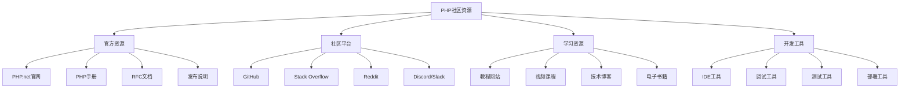

# 社区资源

## 🎯 学习目标
- 了解PHP社区的主要资源和平台
- 掌握社区资源的获取和利用方法
- 学会参与社区讨论和贡献
- 了解社区资源的最佳实践和规范

## 📚 核心概念

### PHP社区生态



### 社区资源分类

| 类别 | 描述 | 主要平台 | 特点 |
|------|------|----------|------|
| 官方文档 | PHP官方文档和规范 | PHP.net | 权威性、完整性、更新及时 |
| 代码仓库 | 开源代码和项目 | GitHub, GitLab | 代码质量高、社区活跃 |
| 问答社区 | 技术问题和解答 | Stack Overflow, 知乎 | 问题丰富、解答专业 |
| 学习平台 | 在线学习和教程 | Laracasts, PHP School | 系统性强、实践性好 |
| 技术博客 | 技术文章和分享 | Medium, 个人博客 | 深度分析、实践经验 |
| 会议活动 | 技术会议和活动 | PHP Conference, Meetup | 前沿技术、专家分享 |
| 社交媒体 | 实时讨论和交流 | Twitter, LinkedIn | 实时性强、互动性好 |

## 🔧 社区资源利用实现

### 基础社区资源管理
```php
<?php
// 1. 社区资源管理器
class CommunityResourceManager {
    private array $resources = [];
    private array $categories = [];
    private array $bookmarks = [];
    
    public function __construct() {
        $this->initializeCategories();
        $this->loadResources();
    }
    
    // 初始化分类
    private function initializeCategories(): void {
        $this->categories = [
            'official' => '官方资源',
            'documentation' => '文档资源',
            'tutorials' => '教程资源',
            'tools' => '开发工具',
            'libraries' => '第三方库',
            'forums' => '社区论坛',
            'blogs' => '技术博客',
            'videos' => '视频教程',
            'books' => '电子书籍',
            'events' => '会议活动'
        ];
    }
    
    // 加载资源
    private function loadResources(): void {
        $this->resources = [
            'official' => [
                [
                    'name' => 'PHP.net',
                    'url' => 'https://www.php.net',
                    'description' => 'PHP官方网站',
                    'type' => 'website',
                    'rating' => 5,
                    'tags' => ['official', 'documentation', 'reference']
                ],
                [
                    'name' => 'PHP Manual',
                    'url' => 'https://www.php.net/manual',
                    'description' => 'PHP官方手册',
                    'type' => 'documentation',
                    'rating' => 5,
                    'tags' => ['official', 'manual', 'reference']
                ],
                [
                    'name' => 'PHP RFC',
                    'url' => 'https://wiki.php.net/rfc',
                    'description' => 'PHP RFC文档',
                    'type' => 'documentation',
                    'rating' => 4,
                    'tags' => ['official', 'rfc', 'specification']
                ]
            ],
            'documentation' => [
                [
                    'name' => 'PHP The Right Way',
                    'url' => 'https://phptherightway.com',
                    'description' => 'PHP最佳实践指南',
                    'type' => 'guide',
                    'rating' => 5,
                    'tags' => ['best-practices', 'guide', 'standards']
                ],
                [
                    'name' => 'PSR Standards',
                    'url' => 'https://www.php-fig.org/psr',
                    'description' => 'PHP标准规范',
                    'type' => 'standards',
                    'rating' => 5,
                    'tags' => ['standards', 'psr', 'coding-standards']
                ]
            ],
            'tutorials' => [
                [
                    'name' => 'Laracasts',
                    'url' => 'https://laracasts.com',
                    'description' => 'PHP和Laravel视频教程',
                    'type' => 'video',
                    'rating' => 5,
                    'tags' => ['tutorials', 'laravel', 'video']
                ],
                [
                    'name' => 'PHP School',
                    'url' => 'https://www.phpschool.io',
                    'description' => '交互式PHP学习',
                    'type' => 'interactive',
                    'rating' => 4,
                    'tags' => ['tutorials', 'interactive', 'learning']
                ]
            ],
            'tools' => [
                [
                    'name' => 'Composer',
                    'url' => 'https://getcomposer.org',
                    'description' => 'PHP依赖管理工具',
                    'type' => 'tool',
                    'rating' => 5,
                    'tags' => ['dependency-management', 'package-manager']
                ],
                [
                    'name' => 'PHPUnit',
                    'url' => 'https://phpunit.de',
                    'description' => 'PHP单元测试框架',
                    'type' => 'testing',
                    'rating' => 5,
                    'tags' => ['testing', 'unit-testing', 'framework']
                ]
            ],
            'libraries' => [
                [
                    'name' => 'Packagist',
                    'url' => 'https://packagist.org',
                    'description' => 'PHP包仓库',
                    'type' => 'repository',
                    'rating' => 5,
                    'tags' => ['packages', 'repository', 'composer']
                ],
                [
                    'name' => 'Symfony Components',
                    'url' => 'https://symfony.com/components',
                    'description' => 'Symfony组件库',
                    'type' => 'library',
                    'rating' => 5,
                    'tags' => ['symfony', 'components', 'reusable']
                ]
            ],
            'forums' => [
                [
                    'name' => 'Stack Overflow',
                    'url' => 'https://stackoverflow.com/questions/tagged/php',
                    'description' => 'PHP技术问答',
                    'type' => 'q&a',
                    'rating' => 5,
                    'tags' => ['q&a', 'help', 'community']
                ],
                [
                    'name' => 'Reddit PHP',
                    'url' => 'https://www.reddit.com/r/PHP',
                    'description' => 'PHP社区讨论',
                    'type' => 'forum',
                    'rating' => 4,
                    'tags' => ['discussion', 'community', 'news']
                ]
            ],
            'blogs' => [
                [
                    'name' => 'Laravel News',
                    'url' => 'https://laravel-news.com',
                    'description' => 'Laravel和PHP新闻',
                    'type' => 'blog',
                    'rating' => 4,
                    'tags' => ['laravel', 'news', 'tutorials']
                ],
                [
                    'name' => 'PHP Architect',
                    'url' => 'https://www.phparch.com',
                    'description' => 'PHP技术杂志',
                    'type' => 'magazine',
                    'rating' => 4,
                    'tags' => ['magazine', 'articles', 'deep-dive']
                ]
            ],
            'videos' => [
                [
                    'name' => 'PHP Conference',
                    'url' => 'https://www.phpconference.com',
                    'description' => 'PHP会议视频',
                    'type' => 'conference',
                    'rating' => 5,
                    'tags' => ['conference', 'talks', 'expertise']
                ],
                [
                    'name' => 'YouTube PHP',
                    'url' => 'https://www.youtube.com/results?search_query=php+tutorial',
                    'description' => 'YouTube PHP教程',
                    'type' => 'video',
                    'rating' => 3,
                    'tags' => ['video', 'tutorials', 'free']
                ]
            ],
            'books' => [
                [
                    'name' => 'Modern PHP',
                    'url' => 'https://www.oreilly.com/library/view/modern-php/9781491905173',
                    'description' => '现代PHP开发指南',
                    'type' => 'book',
                    'rating' => 5,
                    'tags' => ['book', 'modern-php', 'best-practices']
                ],
                [
                    'name' => 'PHP The Right Way',
                    'url' => 'https://leanpub.com/phptherightway',
                    'description' => 'PHP最佳实践电子书',
                    'type' => 'ebook',
                    'rating' => 5,
                    'tags' => ['ebook', 'best-practices', 'free']
                ]
            ],
            'events' => [
                [
                    'name' => 'PHP Conference',
                    'url' => 'https://www.phpconference.com',
                    'description' => 'PHP国际会议',
                    'type' => 'conference',
                    'rating' => 5,
                    'tags' => ['conference', 'international', 'expertise']
                ],
                [
                    'name' => 'Laracon',
                    'url' => 'https://laracon.net',
                    'description' => 'Laravel会议',
                    'type' => 'conference',
                    'rating' => 4,
                    'tags' => ['laravel', 'conference', 'framework']
                ]
            ]
        ];
    }
    
    // 获取分类
    public function getCategories(): array {
        return $this->categories;
    }
    
    // 获取资源
    public function getResources(string $category = null): array {
        if ($category) {
            return $this->resources[$category] ?? [];
        }
        return $this->resources;
    }
    
    // 搜索资源
    public function searchResources(string $query, array $tags = []): array {
        $results = [];
        
        foreach ($this->resources as $category => $resources) {
            foreach ($resources as $resource) {
                $match = false;
                
                // 文本搜索
                if (stripos($resource['name'], $query) !== false ||
                    stripos($resource['description'], $query) !== false) {
                    $match = true;
                }
                
                // 标签搜索
                if (!empty($tags)) {
                    $tagMatch = false;
                    foreach ($tags as $tag) {
                        if (in_array($tag, $resource['tags'])) {
                            $tagMatch = true;
                            break;
                        }
                    }
                    $match = $match && $tagMatch;
                }
                
                if ($match) {
                    $results[] = array_merge($resource, ['category' => $category]);
                }
            }
        }
        
        return $results;
    }
    
    // 添加书签
    public function addBookmark(string $resourceName, string $category): void {
        $this->bookmarks[] = [
            'name' => $resourceName,
            'category' => $category,
            'added_at' => time()
        ];
    }
    
    // 获取书签
    public function getBookmarks(): array {
        return $this->bookmarks;
    }
    
    // 按评分排序
    public function sortByRating(array $resources): array {
        usort($resources, function($a, $b) {
            return $b['rating'] - $a['rating'];
        });
        return $resources;
    }
    
    // 获取推荐资源
    public function getRecommendedResources(int $limit = 10): array {
        $allResources = [];
        
        foreach ($this->resources as $category => $resources) {
            foreach ($resources as $resource) {
                $allResources[] = array_merge($resource, ['category' => $category]);
            }
        }
        
        $sorted = $this->sortByRating($allResources);
        return array_slice($sorted, 0, $limit);
    }
}

// 2. 社区参与工具
class CommunityParticipationTool {
    private array $platforms = [];
    private array $activities = [];
    
    public function __construct() {
        $this->initializePlatforms();
    }
    
    // 初始化平台
    private function initializePlatforms(): void {
        $this->platforms = [
            'github' => [
                'name' => 'GitHub',
                'type' => 'code_repository',
                'url' => 'https://github.com',
                'description' => '代码托管和协作平台',
                'activities' => ['contribute', 'issue', 'discussion', 'fork']
            ],
            'stackoverflow' => [
                'name' => 'Stack Overflow',
                'type' => 'q&a',
                'url' => 'https://stackoverflow.com',
                'description' => '技术问答社区',
                'activities' => ['ask', 'answer', 'vote', 'comment']
            ],
            'reddit' => [
                'name' => 'Reddit',
                'type' => 'forum',
                'url' => 'https://www.reddit.com/r/PHP',
                'description' => 'PHP社区讨论',
                'activities' => ['post', 'comment', 'vote', 'share']
            ],
            'discord' => [
                'name' => 'Discord',
                'type' => 'chat',
                'url' => 'https://discord.gg/php',
                'description' => '实时聊天社区',
                'activities' => ['chat', 'voice', 'screen_share', 'collaborate']
            ],
            'meetup' => [
                'name' => 'Meetup',
                'type' => 'events',
                'url' => 'https://www.meetup.com',
                'description' => '本地技术聚会',
                'activities' => ['attend', 'organize', 'speak', 'network']
            ]
        ];
    }
    
    // 获取平台
    public function getPlatforms(): array {
        return $this->platforms;
    }
    
    // 获取平台活动
    public function getPlatformActivities(string $platform): array {
        return $this->platforms[$platform]['activities'] ?? [];
    }
    
    // 记录活动
    public function recordActivity(string $platform, string $activity, array $details = []): void {
        $this->activities[] = [
            'platform' => $platform,
            'activity' => $activity,
            'details' => $details,
            'timestamp' => time()
        ];
    }
    
    // 获取活动历史
    public function getActivityHistory(): array {
        return $this->activities;
    }
    
    // 获取活动统计
    public function getActivityStats(): array {
        $stats = [
            'total_activities' => count($this->activities),
            'by_platform' => [],
            'by_activity' => [],
            'recent_activities' => []
        ];
        
        foreach ($this->activities as $activity) {
            $platform = $activity['platform'];
            $activityType = $activity['activity'];
            
            $stats['by_platform'][$platform] = ($stats['by_platform'][$platform] ?? 0) + 1;
            $stats['by_activity'][$activityType] = ($stats['by_activity'][$activityType] ?? 0) + 1;
        }
        
        // 最近活动
        $recent = array_slice($this->activities, -5);
        $stats['recent_activities'] = $recent;
        
        return $stats;
    }
    
    // 生成参与建议
    public function generateParticipationSuggestions(): array {
        $suggestions = [];
        
        $stats = $this->getActivityStats();
        
        // 基于活动历史生成建议
        if (empty($stats['by_platform'])) {
            $suggestions[] = [
                'type' => 'beginner',
                'platform' => 'github',
                'activity' => 'contribute',
                'description' => '开始参与开源项目贡献',
                'priority' => 'high'
            ];
        }
        
        if (!isset($stats['by_platform']['stackoverflow'])) {
            $suggestions[] = [
                'type' => 'learning',
                'platform' => 'stackoverflow',
                'activity' => 'answer',
                'description' => '在Stack Overflow回答问题',
                'priority' => 'medium'
            ];
        }
        
        if (!isset($stats['by_platform']['meetup'])) {
            $suggestions[] = [
                'type' => 'networking',
                'platform' => 'meetup',
                'activity' => 'attend',
                'description' => '参加本地PHP聚会',
                'priority' => 'medium'
            ];
        }
        
        return $suggestions;
    }
}

// 使用示例
echo "=== 社区资源利用示例 ===\n";

try {
    // 创建社区资源管理器
    $resourceManager = new CommunityResourceManager();
    
    // 获取分类
    $categories = $resourceManager->getCategories();
    echo "资源分类:\n";
    foreach ($categories as $key => $name) {
        echo "  {$key}: {$name}\n";
    }
    echo "\n";
    
    // 获取官方资源
    $officialResources = $resourceManager->getResources('official');
    echo "官方资源:\n";
    foreach ($officialResources as $resource) {
        echo "  {$resource['name']}: {$resource['description']} (评分: {$resource['rating']})\n";
    }
    echo "\n";
    
    // 搜索资源
    $searchResults = $resourceManager->searchResources('PHP', ['tutorials', 'video']);
    echo "搜索结果:\n";
    foreach ($searchResults as $result) {
        echo "  {$result['name']} ({$result['category']}): {$result['description']}\n";
    }
    echo "\n";
    
    // 获取推荐资源
    $recommended = $resourceManager->getRecommendedResources(5);
    echo "推荐资源:\n";
    foreach ($recommended as $resource) {
        echo "  {$resource['name']}: {$resource['description']} (评分: {$resource['rating']})\n";
    }
    echo "\n";
    
    // 创建社区参与工具
    $participationTool = new CommunityParticipationTool();
    
    // 获取平台
    $platforms = $participationTool->getPlatforms();
    echo "社区平台:\n";
    foreach ($platforms as $key => $platform) {
        echo "  {$key}: {$platform['name']} - {$platform['description']}\n";
    }
    echo "\n";
    
    // 记录活动
    $participationTool->recordActivity('github', 'contribute', [
        'repository' => 'php/php-src',
        'type' => 'pull_request',
        'status' => 'merged'
    ]);
    
    $participationTool->recordActivity('stackoverflow', 'answer', [
        'question_id' => 12345,
        'votes' => 5,
        'accepted' => true
    ]);
    
    // 获取活动统计
    $stats = $participationTool->getActivityStats();
    echo "活动统计:\n";
    echo "  总活动数: {$stats['total_activities']}\n";
    echo "  按平台分布:\n";
    foreach ($stats['by_platform'] as $platform => $count) {
        echo "    {$platform}: {$count}\n";
    }
    echo "  按活动类型分布:\n";
    foreach ($stats['by_activity'] as $activity => $count) {
        echo "    {$activity}: {$count}\n";
    }
    echo "\n";
    
    // 生成参与建议
    $suggestions = $participationTool->generateParticipationSuggestions();
    echo "参与建议:\n";
    foreach ($suggestions as $suggestion) {
        echo "  {$suggestion['platform']} - {$suggestion['activity']}: {$suggestion['description']} (优先级: {$suggestion['priority']})\n";
    }
    
} catch (Exception $e) {
    echo "错误: " . $e->getMessage() . "\n";
}
?>
```

## 📊 最佳实践

### 社区资源利用最佳实践
```php
<?php
// 社区资源利用最佳实践

class CommunityResourceBestPractices {
    // 1. 资源获取最佳实践
    public static function getResourceAcquisitionBestPractices() {
        return [
            '官方资源优先' => [
                '权威性' => '优先使用官方文档和资源',
                '准确性' => '确保信息的准确性和时效性',
                '完整性' => '获取完整的技术规范',
                '更新性' => '关注官方资源的更新'
            ],
            '多渠道验证' => [
                '交叉验证' => '通过多个渠道验证信息',
                '社区讨论' => '参与社区讨论获取反馈',
                '实践验证' => '通过实践验证理论',
                '专家咨询' => '向专家咨询疑难问题'
            ],
            '资源质量评估' => [
                '来源可靠性' => '评估资源来源的可靠性',
                '内容质量' => '评估内容的质量和深度',
                '更新频率' => '关注资源的更新频率',
                '社区反馈' => '查看社区对资源的反馈'
            ]
        ];
    }
    
    // 2. 社区参与最佳实践
    public static function getCommunityParticipationBestPractices() {
        return [
            '积极参与' => [
                '主动提问' => '主动提出有价值的问题',
                '积极回答' => '积极回答他人的问题',
                '分享经验' => '分享自己的实践经验',
                '贡献代码' => '为开源项目贡献代码'
            ],
            '尊重他人' => [
                '礼貌交流' => '保持礼貌和尊重的交流态度',
                '感谢帮助' => '感谢他人的帮助和指导',
                ' constructive' => '提供建设性的反馈',
                '避免争论' => '避免无意义的争论'
            ],
            '持续学习' => [
                '关注动态' => '关注技术发展动态',
                '学习新知识' => '持续学习新技术',
                '实践应用' => '将学到的知识应用到实践',
                '分享学习' => '分享学习心得和经验'
            ]
        ];
    }
    
    // 3. 资源贡献最佳实践
    public static function getResourceContributionBestPractices() {
        return [
            '内容质量' => [
                '准确性' => '确保内容的准确性',
                '完整性' => '提供完整的信息',
                '清晰性' => '保持内容的清晰易懂',
                '实用性' => '确保内容的实用性'
            ],
            '贡献方式' => [
                '代码贡献' => '为开源项目贡献代码',
                '文档贡献' => '改进和完善文档',
                '问题报告' => '报告bug和问题',
                '功能建议' => '提出功能改进建议'
            ],
            '社区建设' => [
                '帮助新人' => '帮助社区新人',
                '组织活动' => '组织技术交流活动',
                '知识分享' => '分享专业知识和经验',
                '社区维护' => '维护社区秩序和环境'
            ]
        ];
    }
}

// 使用示例
echo "=== 社区资源利用最佳实践示例 ===\n";

try {
    $acquisitionPractices = CommunityResourceBestPractices::getResourceAcquisitionBestPractices();
    echo "资源获取最佳实践:\n";
    foreach ($acquisitionPractices as $category => $practices) {
        echo "  $category:\n";
        foreach ($practices as $practice => $description) {
            echo "    - $practice: $description\n";
        }
        echo "\n";
    }
    
} catch (Exception $e) {
    echo "错误: " . $e->getMessage() . "\n";
}
?>
```

## 🎓 学习建议

### 费曼学习法应用
1. **选择概念**: 选择社区资源利用中的核心概念
2. **简化解释**: 用简单语言解释社区资源的作用
3. **识别盲点**: 发现理解不深入的地方
4. **重新学习**: 针对盲点进行深入学习

### 刻意练习重点
1. **资源获取**: 掌握社区资源的获取方法
2. **社区参与**: 学会积极参与社区活动
3. **资源贡献**: 掌握向社区贡献资源的方法
4. **网络建设**: 建立专业的技术网络

## 🔗 相关链接
- [[01-Composer包管理|Composer包管理]]
- [[02-第三方库使用|第三方库使用]]
- [[03-扩展开发|扩展开发]]
- [[05-开源项目贡献|开源项目贡献]]
- [[06-技术选型指南|技术选型指南]]
