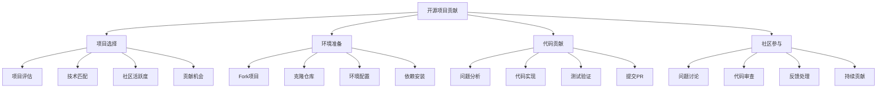

# 开源项目贡献

## 🎯 学习目标
- 理解开源项目贡献的意义和价值
- 掌握开源项目贡献的基本流程和方法
- 学会选择合适的开源项目进行贡献
- 了解开源项目贡献的最佳实践和规范

## 📚 核心概念

### 开源贡献流程



### 贡献类型

| 类型 | 描述 | 难度 | 价值 | 示例 |
|------|------|------|------|------|
| Bug修复 | 修复项目中的bug | 中等 | 高 | 修复内存泄漏、逻辑错误 |
| 功能开发 | 添加新功能 | 高 | 高 | 新API、新特性 |
| 文档改进 | 完善项目文档 | 低 | 中 | 更新README、API文档 |
| 测试用例 | 添加测试用例 | 中等 | 高 | 单元测试、集成测试 |
| 性能优化 | 优化代码性能 | 高 | 高 | 算法优化、内存优化 |
| 代码重构 | 重构现有代码 | 中等 | 中 | 代码清理、结构优化 |
| 国际化 | 多语言支持 | 中等 | 中 | 翻译、本地化 |
| 工具开发 | 开发辅助工具 | 高 | 中 | 构建工具、调试工具 |

## 🔧 开源贡献实现

### 基础开源贡献工具
```php
<?php
// 1. 开源项目贡献管理器
class OpenSourceContributionManager {
    private array $projects = [];
    private array $contributions = [];
    private array $skills = [];
    
    public function __construct() {
        $this->initializeSkills();
    }
    
    // 初始化技能
    private function initializeSkills(): void {
        $this->skills = [
            'php' => ['level' => 'expert', 'experience' => 5],
            'javascript' => ['level' => 'intermediate', 'experience' => 3],
            'python' => ['level' => 'beginner', 'experience' => 1],
            'git' => ['level' => 'expert', 'experience' => 4],
            'testing' => ['level' => 'intermediate', 'experience' => 2],
            'documentation' => ['level' => 'intermediate', 'experience' => 3]
        ];
    }
    
    // 添加项目
    public function addProject(string $name, array $config): void {
        $this->projects[$name] = array_merge([
            'name' => $name,
            'url' => '',
            'description' => '',
            'language' => 'php',
            'stars' => 0,
            'forks' => 0,
            'issues' => 0,
            'pull_requests' => 0,
            'last_commit' => '',
            'contributors' => 0,
            'license' => '',
            'difficulty' => 'medium',
            'contribution_opportunities' => [],
            'status' => 'active'
        ], $config);
    }
    
    // 评估项目适合度
    public function evaluateProjectFit(string $projectName): array {
        if (!isset($this->projects[$projectName])) {
            throw new Exception("Project '{$projectName}' not found");
        }
        
        $project = $this->projects[$projectName];
        $score = 0;
        $factors = [];
        
        // 技术匹配度
        $techMatch = $this->calculateTechMatch($project['language']);
        $score += $techMatch * 30;
        $factors['技术匹配度'] = $techMatch;
        
        // 项目活跃度
        $activity = $this->calculateActivity($project);
        $score += $activity * 25;
        $factors['项目活跃度'] = $activity;
        
        // 贡献机会
        $opportunities = $this->calculateOpportunities($project);
        $score += $opportunities * 20;
        $factors['贡献机会'] = $opportunities;
        
        // 社区友好度
        $community = $this->calculateCommunity($project);
        $score += $community * 15;
        $factors['社区友好度'] = $community;
        
        // 学习价值
        $learning = $this->calculateLearningValue($project);
        $score += $learning * 10;
        $factors['学习价值'] = $learning;
        
        return [
            'project' => $projectName,
            'total_score' => $score,
            'factors' => $factors,
            'recommendation' => $this->getRecommendation($score)
        ];
    }
    
    // 计算技术匹配度
    private function calculateTechMatch(string $language): float {
        $skill = $this->skills[$language] ?? ['level' => 'beginner', 'experience' => 0];
        
        $levelScores = [
            'beginner' => 0.3,
            'intermediate' => 0.6,
            'expert' => 1.0
        ];
        
        $baseScore = $levelScores[$skill['level']] ?? 0.3;
        $experienceBonus = min($skill['experience'] * 0.1, 0.3);
        
        return min($baseScore + $experienceBonus, 1.0);
    }
    
    // 计算项目活跃度
    private function calculateActivity(array $project): float {
        $stars = $project['stars'];
        $forks = $project['forks'];
        $issues = $project['issues'];
        $prs = $project['pull_requests'];
        
        // 活跃度评分
        $starScore = min($stars / 1000, 1.0);
        $forkScore = min($forks / 100, 1.0);
        $issueScore = min($issues / 50, 1.0);
        $prScore = min($prs / 20, 1.0);
        
        return ($starScore + $forkScore + $issueScore + $prScore) / 4;
    }
    
    // 计算贡献机会
    private function calculateOpportunities(array $project): float {
        $opportunities = count($project['contribution_opportunities']);
        
        if ($opportunities == 0) return 0.5; // 中等机会
        if ($opportunities <= 2) return 0.7; // 较好机会
        if ($opportunities <= 5) return 0.9; // 很好机会
        return 1.0; // 极好机会
    }
    
    // 计算社区友好度
    private function calculateCommunity(array $project): float {
        // 基于项目信息估算社区友好度
        $contributors = $project['contributors'];
        $license = $project['license'];
        
        $contributorScore = min($contributors / 50, 1.0);
        $licenseScore = in_array($license, ['MIT', 'Apache-2.0', 'BSD-3-Clause']) ? 1.0 : 0.7;
        
        return ($contributorScore + $licenseScore) / 2;
    }
    
    // 计算学习价值
    private function calculateLearningValue(array $project): float {
        $stars = $project['stars'];
        $difficulty = $project['difficulty'];
        
        $popularityScore = min($stars / 5000, 1.0);
        
        $difficultyScores = [
            'easy' => 0.3,
            'medium' => 0.7,
            'hard' => 1.0
        ];
        
        $difficultyScore = $difficultyScores[$difficulty] ?? 0.5;
        
        return ($popularityScore + $difficultyScore) / 2;
    }
    
    // 获取推荐
    private function getRecommendation(float $score): string {
        if ($score >= 80) return '强烈推荐';
        if ($score >= 60) return '推荐';
        if ($score >= 40) return '可以考虑';
        return '不推荐';
    }
    
    // 记录贡献
    public function recordContribution(string $project, array $contribution): void {
        $this->contributions[] = array_merge([
            'project' => $project,
            'type' => 'unknown',
            'status' => 'pending',
            'date' => date('Y-m-d'),
            'description' => '',
            'url' => '',
            'impact' => 'low'
        ], $contribution);
    }
    
    // 获取贡献历史
    public function getContributionHistory(): array {
        return $this->contributions;
    }
    
    // 获取贡献统计
    public function getContributionStats(): array {
        $stats = [
            'total_contributions' => count($this->contributions),
            'by_type' => [],
            'by_status' => [],
            'by_project' => [],
            'success_rate' => 0
        ];
        
        $successful = 0;
        
        foreach ($this->contributions as $contribution) {
            $type = $contribution['type'];
            $status = $contribution['status'];
            $project = $contribution['project'];
            
            $stats['by_type'][$type] = ($stats['by_type'][$type] ?? 0) + 1;
            $stats['by_status'][$status] = ($stats['by_status'][$status] ?? 0) + 1;
            $stats['by_project'][$project] = ($stats['by_project'][$project] ?? 0) + 1;
            
            if ($status === 'merged' || $status === 'accepted') {
                $successful++;
            }
        }
        
        if (count($this->contributions) > 0) {
            $stats['success_rate'] = $successful / count($this->contributions);
        }
        
        return $stats;
    }
}

// 2. 贡献工作流管理器
class ContributionWorkflowManager {
    private array $workflows = [];
    private array $currentWorkflow = null;
    
    public function __construct() {
        $this->initializeWorkflows();
    }
    
    // 初始化工作流
    private function initializeWorkflows(): void {
        $this->workflows = [
            'bug_fix' => [
                'name' => 'Bug修复工作流',
                'steps' => [
                    '1. 问题分析' => '分析bug报告，理解问题',
                    '2. 环境复现' => '在本地环境复现问题',
                    '3. 代码定位' => '定位问题代码位置',
                    '4. 修复实现' => '实现bug修复',
                    '5. 测试验证' => '编写测试验证修复',
                    '6. 提交PR' => '提交Pull Request',
                    '7. 代码审查' => '参与代码审查',
                    '8. 合并发布' => '等待合并和发布'
                ],
                'estimated_time' => '2-5天',
                'difficulty' => 'medium'
            ],
            'feature_development' => [
                'name' => '功能开发工作流',
                'steps' => [
                    '1. 需求分析' => '分析功能需求',
                    '2. 设计讨论' => '与社区讨论设计方案',
                    '3. 原型实现' => '实现功能原型',
                    '4. 完整实现' => '完成功能实现',
                    '5. 测试编写' => '编写完整测试',
                    '6. 文档更新' => '更新相关文档',
                    '7. 提交PR' => '提交Pull Request',
                    '8. 审查迭代' => '根据反馈迭代',
                    '9. 合并发布' => '等待合并和发布'
                ],
                'estimated_time' => '1-4周',
                'difficulty' => 'high'
            ],
            'documentation' => [
                'name' => '文档改进工作流',
                'steps' => [
                    '1. 文档分析' => '分析现有文档问题',
                    '2. 内容规划' => '规划改进内容',
                    '3. 内容编写' => '编写改进内容',
                    '4. 格式检查' => '检查格式和语法',
                    '5. 内容审查' => '自我审查内容',
                    '6. 提交PR' => '提交Pull Request',
                    '7. 社区反馈' => '收集社区反馈',
                    '8. 最终合并' => '根据反馈完善后合并'
                ],
                'estimated_time' => '1-3天',
                'difficulty' => 'low'
            ],
            'testing' => [
                'name' => '测试用例工作流',
                'steps' => [
                    '1. 测试分析' => '分析测试覆盖情况',
                    '2. 用例设计' => '设计测试用例',
                    '3. 用例实现' => '实现测试用例',
                    '4. 本地测试' => '在本地运行测试',
                    '5. 覆盖率检查' => '检查测试覆盖率',
                    '6. 提交PR' => '提交Pull Request',
                    '7. CI验证' => '等待CI验证',
                    '8. 合并发布' => '等待合并和发布'
                ],
                'estimated_time' => '3-7天',
                'difficulty' => 'medium'
            ]
        ];
    }
    
    // 开始工作流
    public function startWorkflow(string $workflowType, string $project): void {
        if (!isset($this->workflows[$workflowType])) {
            throw new Exception("Workflow '{$workflowType}' not found");
        }
        
        $this->currentWorkflow = [
            'type' => $workflowType,
            'project' => $project,
            'workflow' => $this->workflows[$workflowType],
            'current_step' => 0,
            'started_at' => time(),
            'completed_steps' => [],
            'notes' => []
        ];
    }
    
    // 完成当前步骤
    public function completeCurrentStep(string $notes = ''): void {
        if (!$this->currentWorkflow) {
            throw new Exception("No active workflow");
        }
        
        $currentStep = $this->currentWorkflow['current_step'];
        $steps = array_keys($this->currentWorkflow['workflow']['steps']);
        
        if ($currentStep < count($steps)) {
            $stepName = $steps[$currentStep];
            $this->currentWorkflow['completed_steps'][] = [
                'step' => $stepName,
                'completed_at' => time(),
                'notes' => $notes
            ];
            $this->currentWorkflow['current_step']++;
        }
    }
    
    // 获取当前步骤
    public function getCurrentStep(): ?array {
        if (!$this->currentWorkflow) {
            return null;
        }
        
        $currentStep = $this->currentWorkflow['current_step'];
        $steps = $this->currentWorkflow['workflow']['steps'];
        $stepNames = array_keys($steps);
        
        if ($currentStep < count($stepNames)) {
            $stepName = $stepNames[$currentStep];
            return [
                'step' => $stepName,
                'description' => $steps[$stepName],
                'progress' => $currentStep / count($stepNames)
            ];
        }
        
        return null;
    }
    
    // 获取工作流进度
    public function getWorkflowProgress(): array {
        if (!$this->currentWorkflow) {
            return ['active' => false];
        }
        
        $totalSteps = count($this->currentWorkflow['workflow']['steps']);
        $completedSteps = count($this->currentWorkflow['completed_steps']);
        
        return [
            'active' => true,
            'type' => $this->currentWorkflow['type'],
            'project' => $this->currentWorkflow['project'],
            'total_steps' => $totalSteps,
            'completed_steps' => $completedSteps,
            'current_step' => $this->currentWorkflow['current_step'],
            'progress' => $completedSteps / $totalSteps,
            'estimated_time' => $this->currentWorkflow['workflow']['estimated_time'],
            'difficulty' => $this->currentWorkflow['workflow']['difficulty']
        ];
    }
    
    // 完成工作流
    public function completeWorkflow(): array {
        if (!$this->currentWorkflow) {
            throw new Exception("No active workflow");
        }
        
        $result = [
            'type' => $this->currentWorkflow['type'],
            'project' => $this->currentWorkflow['project'],
            'started_at' => $this->currentWorkflow['started_at'],
            'completed_at' => time(),
            'duration' => time() - $this->currentWorkflow['started_at'],
            'completed_steps' => $this->currentWorkflow['completed_steps'],
            'total_steps' => count($this->currentWorkflow['workflow']['steps'])
        ];
        
        $this->currentWorkflow = null;
        
        return $result;
    }
    
    // 获取所有工作流
    public function getAllWorkflows(): array {
        return $this->workflows;
    }
}

// 使用示例
echo "=== 开源项目贡献示例 ===\n";

try {
    // 创建开源贡献管理器
    $contributionManager = new OpenSourceContributionManager();
    
    // 添加项目
    $contributionManager->addProject('laravel/framework', [
        'url' => 'https://github.com/laravel/framework',
        'description' => 'Laravel PHP Framework',
        'language' => 'php',
        'stars' => 50000,
        'forks' => 15000,
        'issues' => 200,
        'pull_requests' => 50,
        'contributors' => 500,
        'license' => 'MIT',
        'difficulty' => 'hard',
        'contribution_opportunities' => [
            'bug_fixes',
            'feature_development',
            'documentation',
            'testing',
            'performance_optimization'
        ]
    ]);
    
    $contributionManager->addProject('monolog/monolog', [
        'url' => 'https://github.com/Seldaek/monolog',
        'description' => 'Logging for PHP',
        'language' => 'php',
        'stars' => 15000,
        'forks' => 2000,
        'issues' => 50,
        'pull_requests' => 20,
        'contributors' => 100,
        'license' => 'MIT',
        'difficulty' => 'medium',
        'contribution_opportunities' => [
            'bug_fixes',
            'documentation',
            'testing'
        ]
    ]);
    
    // 评估项目适合度
    $laravelFit = $contributionManager->evaluateProjectFit('laravel/framework');
    echo "Laravel项目适合度评估:\n";
    echo "  总分: {$laravelFit['total_score']}\n";
    echo "  推荐: {$laravelFit['recommendation']}\n";
    echo "  详细评分:\n";
    foreach ($laravelFit['factors'] as $factor => $score) {
        echo "    {$factor}: {$score}\n";
    }
    echo "\n";
    
    $monologFit = $contributionManager->evaluateProjectFit('monolog/monolog');
    echo "Monolog项目适合度评估:\n";
    echo "  总分: {$monologFit['total_score']}\n";
    echo "  推荐: {$monologFit['recommendation']}\n";
    echo "  详细评分:\n";
    foreach ($monologFit['factors'] as $factor => $score) {
        echo "    {$factor}: {$score}\n";
    }
    echo "\n";
    
    // 记录贡献
    $contributionManager->recordContribution('monolog/monolog', [
        'type' => 'bug_fix',
        'status' => 'merged',
        'description' => '修复内存泄漏问题',
        'url' => 'https://github.com/Seldaek/monolog/pull/123',
        'impact' => 'high'
    ]);
    
    $contributionManager->recordContribution('laravel/framework', [
        'type' => 'documentation',
        'status' => 'merged',
        'description' => '更新API文档',
        'url' => 'https://github.com/laravel/framework/pull/456',
        'impact' => 'medium'
    ]);
    
    // 获取贡献统计
    $stats = $contributionManager->getContributionStats();
    echo "贡献统计:\n";
    echo "  总贡献数: {$stats['total_contributions']}\n";
    echo "  成功率: " . round($stats['success_rate'] * 100, 2) . "%\n";
    echo "  按类型分布:\n";
    foreach ($stats['by_type'] as $type => $count) {
        echo "    {$type}: {$count}\n";
    }
    echo "  按状态分布:\n";
    foreach ($stats['by_status'] as $status => $count) {
        echo "    {$status}: {$count}\n";
    }
    echo "\n";
    
    // 创建贡献工作流管理器
    $workflowManager = new ContributionWorkflowManager();
    
    // 开始bug修复工作流
    $workflowManager->startWorkflow('bug_fix', 'monolog/monolog');
    
    // 完成前几个步骤
    $workflowManager->completeCurrentStep('分析了bug报告，问题出现在内存管理部分');
    $workflowManager->completeCurrentStep('在本地环境成功复现了问题');
    $workflowManager->completeCurrentStep('定位到问题在Logger类的析构函数中');
    
    // 获取当前步骤
    $currentStep = $workflowManager->getCurrentStep();
    if ($currentStep) {
        echo "当前步骤: {$currentStep['step']}\n";
        echo "描述: {$currentStep['description']}\n";
        echo "进度: " . round($currentStep['progress'] * 100, 2) . "%\n";
    }
    
    // 获取工作流进度
    $progress = $workflowManager->getWorkflowProgress();
    echo "工作流进度:\n";
    echo "  类型: {$progress['type']}\n";
    echo "  项目: {$progress['project']}\n";
    echo "  总步骤: {$progress['total_steps']}\n";
    echo "  已完成: {$progress['completed_steps']}\n";
    echo "  当前步骤: {$progress['current_step']}\n";
    echo "  进度: " . round($progress['progress'] * 100, 2) . "%\n";
    echo "  预计时间: {$progress['estimated_time']}\n";
    echo "  难度: {$progress['difficulty']}\n";
    
} catch (Exception $e) {
    echo "错误: " . $e->getMessage() . "\n";
}
?>
```

## 📊 最佳实践

### 开源项目贡献最佳实践
```php
<?php
// 开源项目贡献最佳实践

class OpenSourceContributionBestPractices {
    // 1. 项目选择最佳实践
    public static function getProjectSelectionBestPractices() {
        return [
            '技术匹配' => [
                '技能匹配' => '选择与自身技能匹配的项目',
                '技术栈' => '选择熟悉的技术栈',
                '难度适中' => '选择难度适中的项目',
                '学习价值' => '选择有学习价值的项目'
            ],
            '项目评估' => [
                '活跃度' => '评估项目的活跃度',
                '社区友好' => '评估社区的友好程度',
                '贡献机会' => '评估贡献机会的多少',
                '项目质量' => '评估项目的代码质量'
            ],
            '个人目标' => [
                '技能提升' => '选择能提升技能的项目',
                '职业发展' => '选择有利于职业发展的项目',
                '兴趣匹配' => '选择感兴趣的项目',
                '时间投入' => '考虑时间投入的合理性'
            ]
        ];
    }
    
    // 2. 贡献流程最佳实践
    public static function getContributionProcessBestPractices() {
        return [
            '准备工作' => [
                '环境配置' => '正确配置开发环境',
                '代码规范' => '了解项目的代码规范',
                '贡献指南' => '阅读项目的贡献指南',
                '社区规则' => '了解社区的行为规则'
            ],
            '开发过程' => [
                '问题分析' => '深入分析问题或需求',
                '方案设计' => '设计合理的解决方案',
                '代码实现' => '编写高质量的代码',
                '测试验证' => '编写充分的测试'
            ],
            '提交过程' => [
                '提交信息' => '编写清晰的提交信息',
                'PR描述' => '提供详细的PR描述',
                '代码审查' => '积极参与代码审查',
                '反馈处理' => '及时处理反馈意见'
            ]
        ];
    }
    
    // 3. 社区参与最佳实践
    public static function getCommunityParticipationBestPractices() {
        return [
            '沟通交流' => [
                '礼貌尊重' => '保持礼貌和尊重的态度',
                '清晰表达' => '清晰表达自己的想法',
                '积极回应' => '积极回应他人的问题',
                '建设性反馈' => '提供建设性的反馈'
            ],
            '协作配合' => [
                '团队合作' => '积极参与团队协作',
                '知识分享' => '分享自己的知识和经验',
                '帮助他人' => '帮助其他贡献者',
                '持续学习' => '持续学习新技术'
            ],
            '社区建设' => [
                '维护秩序' => '维护社区的良好秩序',
                '推广项目' => '帮助推广项目',
                '新人指导' => '指导新加入的贡献者',
                '活动参与' => '参与社区活动'
            ]
        ];
    }
}

// 使用示例
echo "=== 开源项目贡献最佳实践示例 ===\n";

try {
    $selectionPractices = OpenSourceContributionBestPractices::getProjectSelectionBestPractices();
    echo "项目选择最佳实践:\n";
    foreach ($selectionPractices as $category => $practices) {
        echo "  $category:\n";
        foreach ($practices as $practice => $description) {
            echo "    - $practice: $description\n";
        }
        echo "\n";
    }
    
} catch (Exception $e) {
    echo "错误: " . $e->getMessage() . "\n";
}
?>
```

## 🎓 学习建议

### 费曼学习法应用
1. **选择概念**: 选择开源项目贡献中的核心概念
2. **简化解释**: 用简单语言解释开源贡献的意义
3. **识别盲点**: 发现理解不深入的地方
4. **重新学习**: 针对盲点进行深入学习

### 刻意练习重点
1. **项目选择**: 掌握选择合适的开源项目的方法
2. **贡献流程**: 熟悉开源贡献的完整流程
3. **社区参与**: 学会积极参与开源社区
4. **持续贡献**: 建立持续贡献的习惯

## 🔗 相关链接
- [[01-Composer包管理|Composer包管理]]
- [[02-第三方库使用|第三方库使用]]
- [[03-扩展开发|扩展开发]]
- [[04-社区资源|社区资源]]
- [[06-技术选型指南|技术选型指南]]
