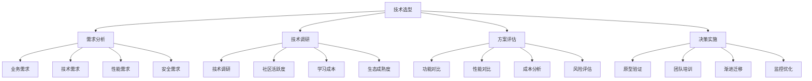

# 技术选型指南

## 🎯 学习目标
- 理解技术选型的重要性和基本原则
- 掌握技术选型的方法和评估标准
- 学会制定技术选型决策流程
- 了解技术选型的最佳实践和风险控制

## 📚 核心概念

### 技术选型决策流程



### 技术选型维度

| 维度 | 描述 | 评估指标 | 权重 | 示例 |
|------|------|----------|------|------|
| 功能完整性 | 技术是否满足功能需求 | 功能覆盖度、API完整性 | 30% | 框架功能、库特性 |
| 性能表现 | 技术的性能表现 | 响应时间、吞吐量、资源消耗 | 25% | 基准测试、性能报告 |
| 学习成本 | 团队学习技术的成本 | 学习曲线、文档质量、社区支持 | 20% | 培训时间、上手难度 |
| 生态成熟度 | 技术生态的成熟程度 | 社区活跃度、第三方支持 | 15% | 包数量、社区规模 |
| 维护成本 | 长期维护的成本 | 更新频率、向后兼容性 | 10% | 版本支持、迁移成本 |

## 🔧 技术选型实现

### 基础技术选型工具
```php
<?php
// 1. 技术选型决策器
class TechnologySelectionDecisionMaker {
    private array $requirements = [];
    private array $candidates = [];
    private array $criteria = [];
    private array $weights = [];
    
    public function __construct() {
        $this->initializeCriteria();
        $this->initializeWeights();
    }
    
    // 初始化评估标准
    private function initializeCriteria(): void {
        $this->criteria = [
            'functionality' => [
                'name' => '功能完整性',
                'description' => '技术是否满足功能需求',
                'metrics' => ['feature_coverage', 'api_completeness', 'customization']
            ],
            'performance' => [
                'name' => '性能表现',
                'description' => '技术的性能表现',
                'metrics' => ['response_time', 'throughput', 'resource_usage']
            ],
            'learning_cost' => [
                'name' => '学习成本',
                'description' => '团队学习技术的成本',
                'metrics' => ['learning_curve', 'documentation', 'community_support']
            ],
            'ecosystem' => [
                'name' => '生态成熟度',
                'description' => '技术生态的成熟程度',
                'metrics' => ['community_activity', 'third_party_support', 'package_count']
            ],
            'maintenance' => [
                'name' => '维护成本',
                'description' => '长期维护的成本',
                'metrics' => ['update_frequency', 'backward_compatibility', 'migration_cost']
            ]
        ];
    }
    
    // 初始化权重
    private function initializeWeights(): void {
        $this->weights = [
            'functionality' => 0.30,
            'performance' => 0.25,
            'learning_cost' => 0.20,
            'ecosystem' => 0.15,
            'maintenance' => 0.10
        ];
    }
    
    // 添加需求
    public function addRequirement(string $category, array $requirement): void {
        $this->requirements[$category][] = $requirement;
    }
    
    // 添加候选技术
    public function addCandidate(string $name, array $config): void {
        $this->candidates[$name] = array_merge([
            'name' => $name,
            'type' => 'framework',
            'description' => '',
            'version' => '1.0.0',
            'license' => 'MIT',
            'scores' => [],
            'pros' => [],
            'cons' => [],
            'use_cases' => [],
            'alternatives' => []
        ], $config);
    }
    
    // 评估技术
    public function evaluateTechnology(string $name, array $scores): void {
        if (!isset($this->candidates[$name])) {
            throw new Exception("Technology '{$name}' not found");
        }
        
        $this->candidates[$name]['scores'] = $scores;
    }
    
    // 计算综合得分
    public function calculateOverallScore(string $name): float {
        if (!isset($this->candidates[$name])) {
            throw new Exception("Technology '{$name}' not found");
        }
        
        $candidate = $this->candidates[$name];
        $scores = $candidate['scores'];
        
        $totalScore = 0;
        foreach ($this->weights as $criterion => $weight) {
            $score = $scores[$criterion] ?? 0;
            $totalScore += $score * $weight;
        }
        
        return $totalScore;
    }
    
    // 生成技术对比报告
    public function generateComparisonReport(): array {
        $report = [
            'summary' => [],
            'detailed_comparison' => [],
            'recommendations' => [],
            'risk_analysis' => []
        ];
        
        // 计算所有技术的综合得分
        $scores = [];
        foreach ($this->candidates as $name => $candidate) {
            $scores[$name] = $this->calculateOverallScore($name);
        }
        
        // 按得分排序
        arsort($scores);
        
        // 生成摘要
        $report['summary'] = [
            'total_candidates' => count($this->candidates),
            'top_choice' => array_key_first($scores),
            'top_score' => $scores[array_key_first($scores)],
            'score_distribution' => $scores
        ];
        
        // 生成详细对比
        foreach ($this->candidates as $name => $candidate) {
            $report['detailed_comparison'][$name] = [
                'overall_score' => $scores[$name],
                'criterion_scores' => $candidate['scores'],
                'pros' => $candidate['pros'],
                'cons' => $candidate['cons'],
                'use_cases' => $candidate['use_cases'],
                'alternatives' => $candidate['alternatives']
            ];
        }
        
        // 生成推荐
        $report['recommendations'] = $this->generateRecommendations($scores);
        
        // 生成风险分析
        $report['risk_analysis'] = $this->generateRiskAnalysis();
        
        return $report;
    }
    
    // 生成推荐
    private function generateRecommendations(array $scores): array {
        $recommendations = [];
        $topChoice = array_key_first($scores);
        $topScore = $scores[$topChoice];
        
        if ($topScore >= 8.0) {
            $recommendations[] = [
                'type' => 'strong_recommendation',
                'technology' => $topChoice,
                'reason' => '综合得分很高，强烈推荐使用'
            ];
        } elseif ($topScore >= 6.0) {
            $recommendations[] = [
                'type' => 'recommendation',
                'technology' => $topChoice,
                'reason' => '综合得分较高，推荐使用'
            ];
        } else {
            $recommendations[] = [
                'type' => 'caution',
                'technology' => $topChoice,
                'reason' => '综合得分较低，需要谨慎考虑'
            ];
        }
        
        return $recommendations;
    }
    
    // 生成风险分析
    private function generateRiskAnalysis(): array {
        $risks = [];
        
        foreach ($this->candidates as $name => $candidate) {
            $technologyRisks = [];
            
            // 分析各维度的风险
            $scores = $candidate['scores'];
            
            if (($scores['performance'] ?? 0) < 6.0) {
                $technologyRisks[] = [
                    'type' => 'performance_risk',
                    'description' => '性能表现可能不满足要求',
                    'severity' => 'medium'
                ];
            }
            
            if (($scores['learning_cost'] ?? 0) < 6.0) {
                $technologyRisks[] = [
                    'type' => 'learning_risk',
                    'description' => '学习成本较高，可能影响项目进度',
                    'severity' => 'high'
                ];
            }
            
            if (($scores['ecosystem'] ?? 0) < 6.0) {
                $technologyRisks[] = [
                    'type' => 'ecosystem_risk',
                    'description' => '生态不够成熟，可能缺乏支持',
                    'severity' => 'medium'
                ];
            }
            
            if (($scores['maintenance'] ?? 0) < 6.0) {
                $technologyRisks[] = [
                    'type' => 'maintenance_risk',
                    'description' => '维护成本较高，长期风险较大',
                    'severity' => 'high'
                ];
            }
            
            $risks[$name] = $technologyRisks;
        }
        
        return $risks;
    }
    
    // 获取需求
    public function getRequirements(): array {
        return $this->requirements;
    }
    
    // 获取候选技术
    public function getCandidates(): array {
        return $this->candidates;
    }
    
    // 获取评估标准
    public function getCriteria(): array {
        return $this->criteria;
    }
}

// 2. 技术选型决策支持系统
class TechnologySelectionDecisionSupportSystem {
    private array $decisionHistory = [];
    private array $decisionTemplates = [];
    private array $riskFactors = [];
    
    public function __construct() {
        $this->initializeDecisionTemplates();
        $this->initializeRiskFactors();
    }
    
    // 初始化决策模板
    private function initializeDecisionTemplates(): void {
        $this->decisionTemplates = [
            'web_framework' => [
                'name' => 'Web框架选型',
                'criteria' => [
                    'functionality' => '功能完整性',
                    'performance' => '性能表现',
                    'learning_cost' => '学习成本',
                    'ecosystem' => '生态成熟度',
                    'maintenance' => '维护成本'
                ],
                'weights' => [
                    'functionality' => 0.30,
                    'performance' => 0.25,
                    'learning_cost' => 0.20,
                    'ecosystem' => 0.15,
                    'maintenance' => 0.10
                ],
                'common_candidates' => [
                    'Laravel', 'Symfony', 'CodeIgniter', 'Yii', 'CakePHP'
                ]
            ],
            'database' => [
                'name' => '数据库选型',
                'criteria' => [
                    'performance' => '性能表现',
                    'scalability' => '可扩展性',
                    'reliability' => '可靠性',
                    'cost' => '成本',
                    'ecosystem' => '生态支持'
                ],
                'weights' => [
                    'performance' => 0.25,
                    'scalability' => 0.25,
                    'reliability' => 0.20,
                    'cost' => 0.15,
                    'ecosystem' => 0.15
                ],
                'common_candidates' => [
                    'MySQL', 'PostgreSQL', 'MongoDB', 'Redis', 'SQLite'
                ]
            ],
            'cache_system' => [
                'name' => '缓存系统选型',
                'criteria' => [
                    'performance' => '性能表现',
                    'scalability' => '可扩展性',
                    'reliability' => '可靠性',
                    'ease_of_use' => '易用性',
                    'cost' => '成本'
                ],
                'weights' => [
                    'performance' => 0.30,
                    'scalability' => 0.25,
                    'reliability' => 0.20,
                    'ease_of_use' => 0.15,
                    'cost' => 0.10
                ],
                'common_candidates' => [
                    'Redis', 'Memcached', 'APCu', 'File Cache', 'Database Cache'
                ]
            ]
        ];
    }
    
    // 初始化风险因素
    private function initializeRiskFactors(): void {
        $this->riskFactors = [
            'technical_risk' => [
                'name' => '技术风险',
                'description' => '技术本身的风险',
                'factors' => [
                    'maturity' => '技术成熟度',
                    'stability' => '技术稳定性',
                    'performance' => '性能风险',
                    'security' => '安全风险'
                ]
            ],
            'business_risk' => [
                'name' => '业务风险',
                'description' => '业务相关的风险',
                'factors' => [
                    'cost' => '成本风险',
                    'timeline' => '时间风险',
                    'team' => '团队风险',
                    'market' => '市场风险'
                ]
            ],
            'operational_risk' => [
                'name' => '运营风险',
                'description' => '运营相关的风险',
                'factors' => [
                    'maintenance' => '维护风险',
                    'scalability' => '扩展风险',
                    'integration' => '集成风险',
                    'support' => '支持风险'
                ]
            ]
        ];
    }
    
    // 使用决策模板
    public function useDecisionTemplate(string $templateName): array {
        if (!isset($this->decisionTemplates[$templateName])) {
            throw new Exception("Template '{$templateName}' not found");
        }
        
        return $this->decisionTemplates[$templateName];
    }
    
    // 记录决策历史
    public function recordDecision(array $decision): void {
        $this->decisionHistory[] = array_merge([
            'timestamp' => time(),
            'decision_id' => uniqid(),
            'context' => '',
            'outcome' => 'pending'
        ], $decision);
    }
    
    // 获取决策历史
    public function getDecisionHistory(): array {
        return $this->decisionHistory;
    }
    
    // 分析决策结果
    public function analyzeDecisionOutcome(string $decisionId): array {
        $decision = null;
        foreach ($this->decisionHistory as $d) {
            if ($d['decision_id'] === $decisionId) {
                $decision = $d;
                break;
            }
        }
        
        if (!$decision) {
            throw new Exception("Decision '{$decisionId}' not found");
        }
        
        return [
            'decision' => $decision,
            'success_factors' => $this->identifySuccessFactors($decision),
            'failure_factors' => $this->identifyFailureFactors($decision),
            'lessons_learned' => $this->extractLessonsLearned($decision),
            'recommendations' => $this->generateRecommendations($decision)
        ];
    }
    
    // 识别成功因素
    private function identifySuccessFactors(array $decision): array {
        $factors = [];
        
        if ($decision['outcome'] === 'success') {
            $factors[] = '技术选择符合需求';
            $factors[] = '团队技能匹配';
            $factors[] = '实施过程顺利';
            $factors[] = '性能表现良好';
        }
        
        return $factors;
    }
    
    // 识别失败因素
    private function identifyFailureFactors(array $decision): array {
        $factors = [];
        
        if ($decision['outcome'] === 'failure') {
            $factors[] = '技术选择不当';
            $factors[] = '团队技能不足';
            $factors[] = '实施过程困难';
            $factors[] = '性能表现不佳';
        }
        
        return $factors;
    }
    
    // 提取经验教训
    private function extractLessonsLearned(array $decision): array {
        $lessons = [];
        
        $lessons[] = '充分评估技术成熟度';
        $lessons[] = '考虑团队技能水平';
        $lessons[] = '制定详细的实施计划';
        $lessons[] = '建立风险控制机制';
        
        return $lessons;
    }
    
    // 生成推荐
    private function generateRecommendations(array $decision): array {
        $recommendations = [];
        
        $recommendations[] = '建立技术选型标准流程';
        $recommendations[] = '加强团队技术培训';
        $recommendations[] = '建立技术评估机制';
        $recommendations[] = '定期回顾技术选择';
        
        return $recommendations;
    }
    
    // 获取所有模板
    public function getAllTemplates(): array {
        return $this->decisionTemplates;
    }
    
    // 获取风险因素
    public function getRiskFactors(): array {
        return $this->riskFactors;
    }
}

// 使用示例
echo "=== 技术选型指南示例 ===\n";

try {
    // 创建技术选型决策器
    $decisionMaker = new TechnologySelectionDecisionMaker();
    
    // 添加需求
    $decisionMaker->addRequirement('business', [
        'type' => 'web_application',
        'description' => '构建企业级Web应用',
        'priority' => 'high'
    ]);
    
    $decisionMaker->addRequirement('technical', [
        'type' => 'performance',
        'description' => '支持高并发访问',
        'priority' => 'high'
    ]);
    
    $decisionMaker->addRequirement('team', [
        'type' => 'skill_level',
        'description' => '团队PHP技能水平中等',
        'priority' => 'medium'
    ]);
    
    // 添加候选技术
    $decisionMaker->addCandidate('Laravel', [
        'type' => 'web_framework',
        'description' => 'Laravel PHP框架',
        'version' => '9.0',
        'license' => 'MIT',
        'pros' => [
            '功能丰富',
            '文档完善',
            '社区活跃',
            '学习曲线平缓'
        ],
        'cons' => [
            '性能相对较低',
            '资源消耗较大',
            '学习成本较高'
        ],
        'use_cases' => [
            '企业级应用',
            '快速原型开发',
            '内容管理系统'
        ]
    ]);
    
    $decisionMaker->addCandidate('Symfony', [
        'type' => 'web_framework',
        'description' => 'Symfony PHP框架',
        'version' => '6.0',
        'license' => 'MIT',
        'pros' => [
            '性能优秀',
            '组件化设计',
            '企业级特性',
            '可扩展性强'
        ],
        'cons' => [
            '学习曲线陡峭',
            '配置复杂',
            '文档相对较少'
        ],
        'use_cases' => [
            '大型企业应用',
            '高性能系统',
            '微服务架构'
        ]
    ]);
    
    $decisionMaker->addCandidate('CodeIgniter', [
        'type' => 'web_framework',
        'description' => 'CodeIgniter PHP框架',
        'version' => '4.0',
        'license' => 'MIT',
        'pros' => [
            '轻量级',
            '学习成本低',
            '性能良好',
            '配置简单'
        ],
        'cons' => [
            '功能相对简单',
            '社区较小',
            '企业级特性不足'
        ],
        'use_cases' => [
            '小型项目',
            '快速开发',
            '学习项目'
        ]
    ]);
    
    // 评估技术
    $decisionMaker->evaluateTechnology('Laravel', [
        'functionality' => 9.0,
        'performance' => 6.0,
        'learning_cost' => 7.0,
        'ecosystem' => 9.0,
        'maintenance' => 8.0
    ]);
    
    $decisionMaker->evaluateTechnology('Symfony', [
        'functionality' => 8.0,
        'performance' => 9.0,
        'learning_cost' => 5.0,
        'ecosystem' => 8.0,
        'maintenance' => 7.0
    ]);
    
    $decisionMaker->evaluateTechnology('CodeIgniter', [
        'functionality' => 6.0,
        'performance' => 8.0,
        'learning_cost' => 9.0,
        'ecosystem' => 6.0,
        'maintenance' => 8.0
    ]);
    
    // 生成对比报告
    $report = $decisionMaker->generateComparisonReport();
    
    echo "技术选型对比报告:\n";
    echo "总候选技术: {$report['summary']['total_candidates']}\n";
    echo "推荐选择: {$report['summary']['top_choice']}\n";
    echo "综合得分: {$report['summary']['top_score']}\n";
    echo "\n";
    
    echo "详细对比:\n";
    foreach ($report['detailed_comparison'] as $name => $comparison) {
        echo "  {$name}:\n";
        echo "    综合得分: {$comparison['overall_score']}\n";
        echo "    优势: " . implode(', ', $comparison['pros']) . "\n";
        echo "    劣势: " . implode(', ', $comparison['cons']) . "\n";
    }
    echo "\n";
    
    echo "推荐建议:\n";
    foreach ($report['recommendations'] as $recommendation) {
        echo "  {$recommendation['type']}: {$recommendation['technology']} - {$recommendation['reason']}\n";
    }
    echo "\n";
    
    echo "风险分析:\n";
    foreach ($report['risk_analysis'] as $technology => $risks) {
        echo "  {$technology}:\n";
        foreach ($risks as $risk) {
            echo "    {$risk['type']}: {$risk['description']} (严重程度: {$risk['severity']})\n";
        }
    }
    echo "\n";
    
    // 创建决策支持系统
    $supportSystem = new TechnologySelectionDecisionSupportSystem();
    
    // 使用决策模板
    $template = $supportSystem->useDecisionTemplate('web_framework');
    echo "使用决策模板: {$template['name']}\n";
    echo "评估标准:\n";
    foreach ($template['criteria'] as $key => $name) {
        echo "  {$key}: {$name}\n";
    }
    echo "\n";
    
    // 记录决策
    $supportSystem->recordDecision([
        'technology' => 'Laravel',
        'context' => '企业级Web应用开发',
        'outcome' => 'success',
        'notes' => '选择Laravel框架，项目成功完成'
    ]);
    
    // 获取决策历史
    $history = $supportSystem->getDecisionHistory();
    echo "决策历史记录数: " . count($history) . "\n";
    
} catch (Exception $e) {
    echo "错误: " . $e->getMessage() . "\n";
}
?>
```

## 📊 最佳实践

### 技术选型最佳实践
```php
<?php
// 技术选型最佳实践

class TechnologySelectionBestPractices {
    // 1. 需求分析最佳实践
    public static function getRequirementAnalysisBestPractices() {
        return [
            '业务需求分析' => [
                '需求收集' => '全面收集业务需求',
                '需求优先级' => '明确需求优先级',
                '需求变更' => '建立需求变更机制',
                '需求验证' => '验证需求的合理性'
            ],
            '技术需求分析' => [
                '性能需求' => '明确性能要求',
                '安全需求' => '分析安全要求',
                '可扩展性' => '考虑未来扩展需求',
                '兼容性' => '考虑系统兼容性'
            ],
            '团队需求分析' => [
                '技能评估' => '评估团队技能水平',
                '学习能力' => '评估团队学习能力',
                '时间约束' => '考虑时间约束',
                '资源限制' => '考虑资源限制'
            ]
        ];
    }
    
    // 2. 技术调研最佳实践
    public static function getTechnologyResearchBestPractices() {
        return [
            '技术调研' => [
                '官方文档' => '深入研究官方文档',
                '社区资源' => '利用社区资源',
                '案例研究' => '研究成功案例',
                '专家咨询' => '咨询技术专家'
            ],
            '对比分析' => [
                '功能对比' => '详细对比功能特性',
                '性能对比' => '进行性能基准测试',
                '成本对比' => '分析总体拥有成本',
                '风险对比' => '评估各种风险'
            ],
            '验证测试' => [
                '原型验证' => '构建原型验证技术',
                '性能测试' => '进行性能测试',
                '集成测试' => '测试系统集成',
                '用户测试' => '进行用户接受测试'
            ]
        ];
    }
    
    // 3. 决策实施最佳实践
    public static function getDecisionImplementationBestPractices() {
        return [
            '决策制定' => [
                '多方案比较' => '比较多个技术方案',
                '风险评估' => '全面评估技术风险',
                '成本效益' => '分析成本效益',
                '团队共识' => '达成团队共识'
            ],
            '实施计划' => [
                '分阶段实施' => '制定分阶段实施计划',
                '风险控制' => '建立风险控制机制',
                '进度监控' => '监控实施进度',
                '质量保证' => '确保实施质量'
            ],
            '持续优化' => [
                '效果评估' => '评估技术选择效果',
                '问题解决' => '及时解决实施问题',
                '经验总结' => '总结实施经验',
                '持续改进' => '持续改进技术选择'
            ]
        ];
    }
}

// 使用示例
echo "=== 技术选型最佳实践示例 ===\n";

try {
    $requirementPractices = TechnologySelectionBestPractices::getRequirementAnalysisBestPractices();
    echo "需求分析最佳实践:\n";
    foreach ($requirementPractices as $category => $practices) {
        echo "  $category:\n";
        foreach ($practices as $practice => $description) {
            echo "    - $practice: $description\n";
        }
        echo "\n";
    }
    
} catch (Exception $e) {
    echo "错误: " . $e->getMessage() . "\n";
}
?>
```

## 🎓 学习建议

### 费曼学习法应用
1. **选择概念**: 选择技术选型中的核心概念
2. **简化解释**: 用简单语言解释技术选型的重要性
3. **识别盲点**: 发现理解不深入的地方
4. **重新学习**: 针对盲点进行深入学习

### 刻意练习重点
1. **需求分析**: 掌握技术需求分析的方法
2. **技术调研**: 学会进行深入的技术调研
3. **决策制定**: 掌握技术选型决策的方法
4. **风险控制**: 学会识别和控制技术风险

## 🔗 相关链接
- [[01-Composer包管理|Composer包管理]]
- [[02-第三方库使用|第三方库使用]]
- [[03-扩展开发|扩展开发]]
- [[04-社区资源|社区资源]]
- [[05-开源项目贡献|开源项目贡献]]
