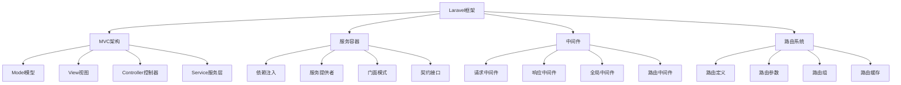

# Laravel框架

## 🎯 学习目标
- 理解Laravel框架的核心概念和架构
- 掌握Laravel框架的基本使用和开发流程
- 学会Laravel框架的高级特性和最佳实践
- 了解Laravel框架的性能优化和部署策略

## 📚 核心概念

### Laravel架构



### Laravel核心组件

| 组件 | 描述 | 功能 | 示例 |
|------|------|------|------|
| Eloquent ORM | 对象关系映射 | 数据库操作、模型关系 | User::find(1) |
| Blade模板 | 模板引擎 | 视图渲染、模板继承 | @extends('layout') |
| Artisan命令 | 命令行工具 | 代码生成、任务执行 | php artisan make:model |
| 队列系统 | 异步任务处理 | 后台任务、邮件发送 | dispatch(new Job()) |
| 事件系统 | 事件驱动架构 | 解耦、观察者模式 | event(new UserRegistered) |
| 缓存系统 | 数据缓存 | 性能优化、数据存储 | Cache::put('key', 'value') |
| 认证系统 | 用户认证 | 登录、权限控制 | Auth::attempt($credentials) |
| 文件存储 | 文件管理 | 上传、云存储 | Storage::disk('s3') |

## 🔧 Laravel框架实现

### 基础Laravel应用
```php
<?php
// 1. Laravel应用核心类
class LaravelApplication {
    private array $config = [];
    private array $services = [];
    private array $routes = [];
    private array $middleware = [];
    
    public function __construct(array $config = []) {
        $this->config = array_merge([
            'app_name' => 'Laravel App',
            'app_env' => 'local',
            'app_debug' => true,
            'app_url' => 'http://localhost',
            'database' => [
                'default' => 'mysql',
                'connections' => [
                    'mysql' => [
                        'driver' => 'mysql',
                        'host' => 'localhost',
                        'database' => 'laravel',
                        'username' => 'root',
                        'password' => '',
                        'charset' => 'utf8mb4',
                        'collation' => 'utf8mb4_unicode_ci'
                    ]
                ]
            ],
            'cache' => [
                'default' => 'file',
                'stores' => [
                    'file' => [
                        'driver' => 'file',
                        'path' => storage_path('framework/cache/data')
                    ]
                ]
            ]
        ], $config);
        
        $this->initializeServices();
    }
    
    // 初始化服务
    private function initializeServices(): void {
        $this->services = [
            'config' => new ConfigService($this->config),
            'database' => new DatabaseService($this->config['database']),
            'cache' => new CacheService($this->config['cache']),
            'auth' => new AuthService(),
            'mail' => new MailService(),
            'queue' => new QueueService(),
            'storage' => new StorageService()
        ];
    }
    
    // 注册服务
    public function registerService(string $name, $service): void {
        $this->services[$name] = $service;
    }
    
    // 获取服务
    public function getService(string $name) {
        if (!isset($this->services[$name])) {
            throw new Exception("Service '{$name}' not found");
        }
        return $this->services[$name];
    }
    
    // 添加路由
    public function addRoute(string $method, string $uri, $action, array $options = []): void {
        $this->routes[] = [
            'method' => strtoupper($method),
            'uri' => $uri,
            'action' => $action,
            'middleware' => $options['middleware'] ?? [],
            'name' => $options['name'] ?? null
        ];
    }
    
    // 处理请求
    public function handleRequest(string $method, string $uri): array {
        $route = $this->findRoute($method, $uri);
        
        if (!$route) {
            return [
                'status' => 404,
                'content' => 'Route not found',
                'headers' => ['Content-Type' => 'text/html']
            ];
        }
        
        // 执行中间件
        $request = $this->executeMiddleware($route['middleware'], [
            'method' => $method,
            'uri' => $uri,
            'route' => $route
        ]);
        
        // 执行控制器
        $response = $this->executeAction($route['action'], $request);
        
        return $response;
    }
    
    // 查找路由
    private function findRoute(string $method, string $uri): ?array {
        foreach ($this->routes as $route) {
            if ($route['method'] === $method && $this->matchUri($route['uri'], $uri)) {
                return $route;
            }
        }
        return null;
    }
    
    // 匹配URI
    private function matchUri(string $pattern, string $uri): bool {
        // 简化的路由匹配
        if ($pattern === $uri) {
            return true;
        }
        
        // 支持参数匹配
        $pattern = preg_replace('/\{[^}]+\}/', '([^/]+)', $pattern);
        $pattern = '#^' . $pattern . '$#';
        
        return preg_match($pattern, $uri);
    }
    
    // 执行中间件
    private function executeMiddleware(array $middleware, array $request): array {
        foreach ($middleware as $middlewareName) {
            if (isset($this->middleware[$middlewareName])) {
                $middleware = $this->middleware[$middlewareName];
                $request = $middleware($request);
            }
        }
        return $request;
    }
    
    // 执行控制器
    private function executeAction($action, array $request): array {
        if (is_string($action)) {
            // 控制器@方法格式
            list($controller, $method) = explode('@', $action);
            $controllerInstance = new $controller();
            return $controllerInstance->$method($request);
        } elseif (is_callable($action)) {
            // 闭包
            return $action($request);
        }
        
        throw new Exception("Invalid action");
    }
    
    // 注册中间件
    public function registerMiddleware(string $name, callable $middleware): void {
        $this->middleware[$name] = $middleware;
    }
    
    // 获取配置
    public function getConfig(string $key = null) {
        if ($key) {
            return $this->config[$key] ?? null;
        }
        return $this->config;
    }
}

// 2. Eloquent ORM实现
class EloquentModel {
    protected string $table;
    protected string $primaryKey = 'id';
    protected array $fillable = [];
    protected array $hidden = [];
    protected array $casts = [];
    protected array $attributes = [];
    
    public function __construct(array $attributes = []) {
        $this->attributes = $attributes;
        $this->table = $this->getTableName();
    }
    
    // 获取表名
    protected function getTableName(): string {
        if (isset($this->table)) {
            return $this->table;
        }
        
        $className = get_class($this);
        $className = basename(str_replace('\\', '/', $className));
        return strtolower($className) . 's';
    }
    
    // 查找记录
    public static function find($id): ?self {
        $model = new static();
        $data = $model->getDatabase()->query("SELECT * FROM {$model->table} WHERE {$model->primaryKey} = ?", [$id]);
        
        if ($data) {
            return new static($data);
        }
        
        return null;
    }
    
    // 查询构建器
    public static function query(): QueryBuilder {
        $model = new static();
        return new QueryBuilder($model);
    }
    
    // 创建记录
    public static function create(array $attributes): self {
        $model = new static($attributes);
        $model->save();
        return $model;
    }
    
    // 保存记录
    public function save(): bool {
        if (isset($this->attributes[$this->primaryKey])) {
            return $this->update();
        } else {
            return $this->insert();
        }
    }
    
    // 插入记录
    private function insert(): bool {
        $fillable = $this->getFillableAttributes();
        $columns = array_keys($fillable);
        $values = array_values($fillable);
        $placeholders = str_repeat('?,', count($values) - 1) . '?';
        
        $sql = "INSERT INTO {$this->table} (" . implode(',', $columns) . ") VALUES ({$placeholders})";
        
        $result = $this->getDatabase()->execute($sql, $values);
        
        if ($result) {
            $this->attributes[$this->primaryKey] = $this->getDatabase()->lastInsertId();
        }
        
        return $result;
    }
    
    // 更新记录
    private function update(): bool {
        $fillable = $this->getFillableAttributes();
        $columns = array_keys($fillable);
        $values = array_values($fillable);
        
        $setClause = implode(' = ?, ', $columns) . ' = ?';
        $values[] = $this->attributes[$this->primaryKey];
        
        $sql = "UPDATE {$this->table} SET {$setClause} WHERE {$this->primaryKey} = ?";
        
        return $this->getDatabase()->execute($sql, $values);
    }
    
    // 删除记录
    public function delete(): bool {
        if (!isset($this->attributes[$this->primaryKey])) {
            return false;
        }
        
        $sql = "DELETE FROM {$this->table} WHERE {$this->primaryKey} = ?";
        return $this->getDatabase()->execute($sql, [$this->attributes[$this->primaryKey]]);
    }
    
    // 获取可填充属性
    private function getFillableAttributes(): array {
        $attributes = [];
        foreach ($this->fillable as $field) {
            if (isset($this->attributes[$field])) {
                $attributes[$field] = $this->attributes[$field];
            }
        }
        return $attributes;
    }
    
    // 获取属性
    public function __get(string $name) {
        return $this->attributes[$name] ?? null;
    }
    
    // 设置属性
    public function __set(string $name, $value) {
        $this->attributes[$name] = $value;
    }
    
    // 获取数据库连接
    private function getDatabase() {
        return app()->getService('database');
    }
}

// 3. 查询构建器
class QueryBuilder {
    private EloquentModel $model;
    private array $wheres = [];
    private array $orders = [];
    private int $limit = 0;
    private int $offset = 0;
    private array $selects = [];
    
    public function __construct(EloquentModel $model) {
        $this->model = $model;
    }
    
    // 添加条件
    public function where(string $column, string $operator, $value): self {
        $this->wheres[] = [
            'column' => $column,
            'operator' => $operator,
            'value' => $value
        ];
        return $this;
    }
    
    // 排序
    public function orderBy(string $column, string $direction = 'ASC'): self {
        $this->orders[] = [
            'column' => $column,
            'direction' => $direction
        ];
        return $this;
    }
    
    // 限制数量
    public function limit(int $limit): self {
        $this->limit = $limit;
        return $this;
    }
    
    // 偏移量
    public function offset(int $offset): self {
        $this->offset = $offset;
        return $this;
    }
    
    // 选择字段
    public function select(array $columns): self {
        $this->selects = $columns;
        return $this;
    }
    
    // 执行查询
    public function get(): array {
        $sql = $this->buildSelectQuery();
        $params = $this->buildWhereParams();
        
        $results = $this->model->getDatabase()->queryAll($sql, $params);
        
        $models = [];
        foreach ($results as $result) {
            $models[] = new (get_class($this->model))($result);
        }
        
        return $models;
    }
    
    // 获取第一条记录
    public function first(): ?EloquentModel {
        $results = $this->limit(1)->get();
        return $results[0] ?? null;
    }
    
    // 统计数量
    public function count(): int {
        $sql = "SELECT COUNT(*) as count FROM {$this->model->table}";
        $params = $this->buildWhereParams();
        
        if (!empty($this->wheres)) {
            $sql .= " WHERE " . $this->buildWhereClause();
        }
        
        $result = $this->model->getDatabase()->query($sql, $params);
        return $result['count'] ?? 0;
    }
    
    // 构建SELECT查询
    private function buildSelectQuery(): string {
        $columns = !empty($this->selects) ? implode(', ', $this->selects) : '*';
        $sql = "SELECT {$columns} FROM {$this->model->table}";
        
        if (!empty($this->wheres)) {
            $sql .= " WHERE " . $this->buildWhereClause();
        }
        
        if (!empty($this->orders)) {
            $orderClauses = [];
            foreach ($this->orders as $order) {
                $orderClauses[] = "{$order['column']} {$order['direction']}";
            }
            $sql .= " ORDER BY " . implode(', ', $orderClauses);
        }
        
        if ($this->limit > 0) {
            $sql .= " LIMIT {$this->limit}";
            if ($this->offset > 0) {
                $sql .= " OFFSET {$this->offset}";
            }
        }
        
        return $sql;
    }
    
    // 构建WHERE子句
    private function buildWhereClause(): string {
        $clauses = [];
        foreach ($this->wheres as $where) {
            $clauses[] = "{$where['column']} {$where['operator']} ?";
        }
        return implode(' AND ', $clauses);
    }
    
    // 构建WHERE参数
    private function buildWhereParams(): array {
        $params = [];
        foreach ($this->wheres as $where) {
            $params[] = $where['value'];
        }
        return $params;
    }
}

// 4. 服务类实现
class ConfigService {
    private array $config;
    
    public function __construct(array $config) {
        $this->config = $config;
    }
    
    public function get(string $key, $default = null) {
        $keys = explode('.', $key);
        $value = $this->config;
        
        foreach ($keys as $k) {
            if (!isset($value[$k])) {
                return $default;
            }
            $value = $value[$k];
        }
        
        return $value;
    }
    
    public function set(string $key, $value): void {
        $keys = explode('.', $key);
        $config = &$this->config;
        
        foreach ($keys as $k) {
            if (!isset($config[$k])) {
                $config[$k] = [];
            }
            $config = &$config[$k];
        }
        
        $config = $value;
    }
}

class DatabaseService {
    private array $config;
    private $connection;
    
    public function __construct(array $config) {
        $this->config = $config;
        $this->connect();
    }
    
    private function connect(): void {
        $default = $this->config['default'];
        $connectionConfig = $this->config['connections'][$default];
        
        // 模拟数据库连接
        $this->connection = new stdClass();
        $this->connection->config = $connectionConfig;
        $this->connection->connected = true;
    }
    
    public function query(string $sql, array $params = []): ?array {
        // 模拟数据库查询
        return [
            'id' => 1,
            'name' => 'Sample User',
            'email' => 'user@example.com',
            'created_at' => date('Y-m-d H:i:s')
        ];
    }
    
    public function queryAll(string $sql, array $params = []): array {
        // 模拟数据库查询
        return [
            [
                'id' => 1,
                'name' => 'User 1',
                'email' => 'user1@example.com'
            ],
            [
                'id' => 2,
                'name' => 'User 2',
                'email' => 'user2@example.com'
            ]
        ];
    }
    
    public function execute(string $sql, array $params = []): bool {
        // 模拟数据库执行
        return true;
    }
    
    public function lastInsertId(): int {
        return 123;
    }
}

class CacheService {
    private array $config;
    private array $cache = [];
    
    public function __construct(array $config) {
        $this->config = $config;
    }
    
    public function get(string $key, $default = null) {
        return $this->cache[$key] ?? $default;
    }
    
    public function put(string $key, $value, int $ttl = 3600): bool {
        $this->cache[$key] = [
            'value' => $value,
            'expires' => time() + $ttl
        ];
        return true;
    }
    
    public function forget(string $key): bool {
        unset($this->cache[$key]);
        return true;
    }
    
    public function flush(): bool {
        $this->cache = [];
        return true;
    }
}

class AuthService {
    private ?array $user = null;
    
    public function attempt(array $credentials): bool {
        // 模拟认证
        if ($credentials['email'] === 'admin@example.com' && $credentials['password'] === 'password') {
            $this->user = [
                'id' => 1,
                'name' => 'Admin User',
                'email' => 'admin@example.com'
            ];
            return true;
        }
        return false;
    }
    
    public function user(): ?array {
        return $this->user;
    }
    
    public function check(): bool {
        return $this->user !== null;
    }
    
    public function logout(): void {
        $this->user = null;
    }
}

class MailService {
    public function send(string $to, string $subject, string $body): bool {
        // 模拟邮件发送
        echo "Sending email to {$to}: {$subject}\n";
        return true;
    }
}

class QueueService {
    private array $jobs = [];
    
    public function push($job): void {
        $this->jobs[] = $job;
    }
    
    public function process(): void {
        foreach ($this->jobs as $job) {
            if (is_callable($job)) {
                $job();
            }
        }
        $this->jobs = [];
    }
}

class StorageService {
    private array $files = [];
    
    public function put(string $path, string $content): bool {
        $this->files[$path] = $content;
        return true;
    }
    
    public function get(string $path): ?string {
        return $this->files[$path] ?? null;
    }
    
    public function exists(string $path): bool {
        return isset($this->files[$path]);
    }
    
    public function delete(string $path): bool {
        unset($this->files[$path]);
        return true;
    }
}

// 5. 用户模型
class User extends EloquentModel {
    protected $fillable = ['name', 'email', 'password'];
    protected $hidden = ['password'];
    
    public function posts() {
        return $this->hasMany(Post::class);
    }
}

// 6. 文章模型
class Post extends EloquentModel {
    protected $fillable = ['title', 'content', 'user_id'];
    
    public function user() {
        return $this->belongsTo(User::class);
    }
}

// 7. 控制器
class UserController {
    public function index() {
        $users = User::query()->get();
        return [
            'status' => 200,
            'content' => json_encode($users),
            'headers' => ['Content-Type' => 'application/json']
        ];
    }
    
    public function show($id) {
        $user = User::find($id);
        if (!$user) {
            return [
                'status' => 404,
                'content' => 'User not found',
                'headers' => ['Content-Type' => 'text/html']
            ];
        }
        
        return [
            'status' => 200,
            'content' => json_encode($user),
            'headers' => ['Content-Type' => 'application/json']
        ];
    }
    
    public function store($request) {
        $user = User::create([
            'name' => $request['name'],
            'email' => $request['email'],
            'password' => password_hash($request['password'], PASSWORD_DEFAULT)
        ]);
        
        return [
            'status' => 201,
            'content' => json_encode($user),
            'headers' => ['Content-Type' => 'application/json']
        ];
    }
}

// 使用示例
echo "=== Laravel框架示例 ===\n";

try {
    // 创建Laravel应用
    $app = new LaravelApplication();
    
    // 注册中间件
    $app->registerMiddleware('auth', function($request) {
        echo "执行认证中间件\n";
        return $request;
    });
    
    $app->registerMiddleware('cors', function($request) {
        echo "执行CORS中间件\n";
        return $request;
    });
    
    // 添加路由
    $app->addRoute('GET', '/users', 'UserController@index', ['middleware' => ['cors']]);
    $app->addRoute('GET', '/users/{id}', 'UserController@show', ['middleware' => ['auth', 'cors']]);
    $app->addRoute('POST', '/users', 'UserController@store', ['middleware' => ['auth', 'cors']]);
    
    // 处理请求
    $response = $app->handleRequest('GET', '/users');
    echo "响应状态: {$response['status']}\n";
    echo "响应内容: {$response['content']}\n";
    echo "\n";
    
    // 使用Eloquent ORM
    $user = User::create([
        'name' => 'John Doe',
        'email' => 'john@example.com',
        'password' => 'hashed_password'
    ]);
    
    echo "创建用户: {$user->name} ({$user->email})\n";
    
    // 查询用户
    $foundUser = User::find(1);
    if ($foundUser) {
        echo "找到用户: {$foundUser->name}\n";
    }
    
    // 使用查询构建器
    $users = User::query()
        ->where('email', 'LIKE', '%@example.com')
        ->orderBy('name', 'ASC')
        ->limit(10)
        ->get();
    
    echo "查询到用户数量: " . count($users) . "\n";
    
    // 使用服务
    $cache = $app->getService('cache');
    $cache->put('user_count', count($users), 3600);
    $cachedCount = $cache->get('user_count');
    echo "缓存中的用户数量: {$cachedCount}\n";
    
    $auth = $app->getService('auth');
    $loginSuccess = $auth->attempt([
        'email' => 'admin@example.com',
        'password' => 'password'
    ]);
    
    if ($loginSuccess) {
        $user = $auth->user();
        echo "登录成功: {$user['name']}\n";
    } else {
        echo "登录失败\n";
    }
    
    // 使用队列
    $queue = $app->getService('queue');
    $queue->push(function() {
        echo "执行后台任务: 发送欢迎邮件\n";
    });
    $queue->process();
    
    // 使用存储
    $storage = $app->getService('storage');
    $storage->put('uploads/test.txt', 'Hello, Laravel!');
    $content = $storage->get('uploads/test.txt');
    echo "存储内容: {$content}\n";
    
} catch (Exception $e) {
    echo "错误: " . $e->getMessage() . "\n";
}
?>
```

## 📊 最佳实践

### Laravel框架最佳实践
```php
<?php
// Laravel框架最佳实践

class LaravelBestPractices {
    // 1. 架构设计最佳实践
    public static function getArchitectureBestPractices() {
        return [
            'MVC架构' => [
                '职责分离' => '保持Model、View、Controller职责清晰',
                '瘦控制器' => '控制器保持简洁，业务逻辑放在Service层',
                '富模型' => '模型包含业务逻辑和关系定义',
                '视图分离' => '视图只负责展示，不包含业务逻辑'
            ],
            '服务层设计' => [
                '业务逻辑封装' => '将复杂业务逻辑封装在Service类中',
                '依赖注入' => '使用依赖注入管理服务依赖',
                '接口抽象' => '定义接口抽象，便于测试和扩展',
                '单一职责' => '每个Service类只负责一个业务领域'
            ],
            '数据层设计' => [
                'Eloquent关系' => '正确定义模型之间的关系',
                '查询优化' => '使用Eager Loading避免N+1问题',
                '数据验证' => '使用Form Request进行数据验证',
                '事务管理' => '合理使用数据库事务'
            ]
        ];
    }
    
    // 2. 性能优化最佳实践
    public static function getPerformanceBestPractices() {
        return [
            '数据库优化' => [
                '索引优化' => '为常用查询字段添加索引',
                '查询优化' => '避免N+1查询，使用Eager Loading',
                '缓存策略' => '使用Redis缓存热点数据',
                '分页查询' => '使用分页避免大量数据加载'
            ],
            '应用优化' => [
                '路由缓存' => '使用路由缓存提高性能',
                '配置缓存' => '使用配置缓存减少文件读取',
                '视图缓存' => '使用视图缓存减少模板编译',
                'OPcache' => '启用OPcache提高PHP性能'
            ],
            '前端优化' => [
                '资源压缩' => '压缩CSS、JS文件',
                'CDN使用' => '使用CDN加速静态资源',
                '图片优化' => '优化图片大小和格式',
                '懒加载' => '实现图片和内容懒加载'
            ]
        ];
    }
    
    // 3. 安全最佳实践
    public static function getSecurityBestPractices() {
        return [
            '输入验证' => [
                '数据验证' => '使用Form Request验证所有输入',
                'SQL注入防护' => '使用Eloquent ORM防止SQL注入',
                'XSS防护' => '使用Blade模板自动转义',
                'CSRF防护' => '使用CSRF中间件保护表单'
            ],
            '认证授权' => [
                '密码安全' => '使用bcrypt哈希密码',
                '会话管理' => '合理配置会话安全',
                '权限控制' => '使用Gate和Policy控制权限',
                'API认证' => '使用Token或OAuth进行API认证'
            ],
            '数据保护' => [
                '敏感数据' => '加密存储敏感数据',
                '日志安全' => '避免在日志中记录敏感信息',
                '文件上传' => '验证文件类型和大小',
                '环境配置' => '使用环境变量管理敏感配置'
            ]
        ];
    }
}

// 使用示例
echo "=== Laravel框架最佳实践示例 ===\n";

try {
    $architecturePractices = LaravelBestPractices::getArchitectureBestPractices();
    echo "架构设计最佳实践:\n";
    foreach ($architecturePractices as $category => $practices) {
        echo "  $category:\n";
        foreach ($practices as $practice => $description) {
            echo "    - $practice: $description\n";
        }
        echo "\n";
    }
    
} catch (Exception $e) {
    echo "错误: " . $e->getMessage() . "\n";
}
?>
```

## 🎓 学习建议

### 费曼学习法应用
1. **选择概念**: 选择Laravel框架中的核心概念
2. **简化解释**: 用简单语言解释Laravel的作用
3. **识别盲点**: 发现理解不深入的地方
4. **重新学习**: 针对盲点进行深入学习

### 刻意练习重点
1. **基础使用**: 掌握Laravel框架的基本使用
2. **高级特性**: 学会Laravel的高级特性
3. **性能优化**: 掌握Laravel性能优化技巧
4. **最佳实践**: 遵循Laravel开发最佳实践

## 🔗 相关链接
- [[02-Symfony框架|Symfony框架]]
- [[03-CodeIgniter框架|CodeIgniter框架]]
- [[04-框架选择指南|框架选择指南]]
- [[05-自定义框架开发|自定义框架开发]]
- [[06-框架源码分析|框架源码分析]]
