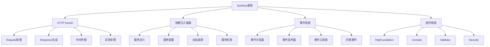

# Symfony框架

## 🎯 学习目标
- 理解Symfony框架的核心概念和架构
- 掌握Symfony框架的基本使用和开发流程
- 学会Symfony框架的高级特性和最佳实践
- 了解Symfony框架的性能优化和部署策略

## 📚 核心概念

### Symfony架构



### Symfony核心组件

| 组件 | 描述 | 功能 | 示例 |
|------|------|------|------|
| HttpFoundation | HTTP抽象层 | 请求/响应处理 | Request, Response |
| Console | 命令行工具 | CLI应用开发 | Command, Input, Output |
| Validator | 数据验证 | 数据验证和约束 | Assert, Validation |
| Security | 安全组件 | 认证和授权 | User, Token, Voter |
| Form | 表单处理 | 表单创建和验证 | Form, FormBuilder |
| Twig | 模板引擎 | 视图渲染 | Template, Extension |
| Doctrine | ORM集成 | 数据库操作 | Entity, Repository |
| Monolog | 日志记录 | 日志管理 | Logger, Handler |

## 🔧 Symfony框架实现

### 基础Symfony应用
```php
<?php
// 1. Symfony应用核心类
class SymfonyApplication {
    private array $config = [];
    private array $services = [];
    private array $routes = [];
    private array $events = [];
    private $container;
    
    public function __construct(array $config = []) {
        $this->config = array_merge([
            'app_name' => 'Symfony App',
            'app_env' => 'dev',
            'app_debug' => true,
            'app_secret' => 'your-secret-key',
            'database' => [
                'driver' => 'pdo_mysql',
                'host' => 'localhost',
                'dbname' => 'symfony',
                'user' => 'root',
                'password' => '',
                'charset' => 'utf8mb4'
            ],
            'cache' => [
                'driver' => 'filesystem',
                'path' => 'var/cache'
            ]
        ], $config);
        
        $this->container = new ServiceContainer();
        $this->initializeServices();
    }
    
    // 初始化服务
    private function initializeServices(): void {
        $this->container->set('config', new ConfigService($this->config));
        $this->container->set('database', new DatabaseService($this->config['database']));
        $this->container->set('cache', new CacheService($this->config['cache']));
        $this->container->set('security', new SecurityService());
        $this->container->set('validator', new ValidatorService());
        $this->container->set('form', new FormService());
        $this->container->set('twig', new TwigService());
        $this->container->set('logger', new LoggerService());
        $this->container->set('event_dispatcher', new EventDispatcher());
    }
    
    // 获取服务
    public function get(string $serviceId) {
        return $this->container->get($serviceId);
    }
    
    // 设置服务
    public function set(string $serviceId, $service): void {
        $this->container->set($serviceId, $service);
    }
    
    // 添加路由
    public function addRoute(string $name, string $path, $controller, array $methods = ['GET'], array $options = []): void {
        $this->routes[$name] = [
            'name' => $name,
            'path' => $path,
            'controller' => $controller,
            'methods' => $methods,
            'options' => $options
        ];
    }
    
    // 处理请求
    public function handleRequest(Request $request): Response {
        try {
            // 查找路由
            $route = $this->findRoute($request);
            
            if (!$route) {
                return new Response('Route not found', 404);
            }
            
            // 执行控制器
            $response = $this->executeController($route, $request);
            
            return $response;
            
        } catch (Exception $e) {
            return $this->handleException($e, $request);
        }
    }
    
    // 查找路由
    private function findRoute(Request $request): ?array {
        $path = $request->getPathInfo();
        $method = $request->getMethod();
        
        foreach ($this->routes as $route) {
            if (in_array($method, $route['methods']) && $this->matchPath($route['path'], $path)) {
                return $route;
            }
        }
        
        return null;
    }
    
    // 匹配路径
    private function matchPath(string $pattern, string $path): bool {
        // 简化的路径匹配
        if ($pattern === $path) {
            return true;
        }
        
        // 支持参数匹配
        $pattern = preg_replace('/\{[^}]+\}/', '([^/]+)', $pattern);
        $pattern = '#^' . $pattern . '$#';
        
        return preg_match($pattern, $path);
    }
    
    // 执行控制器
    private function executeController(array $route, Request $request): Response {
        $controller = $route['controller'];
        
        if (is_string($controller)) {
            // 控制器@方法格式
            list($controllerClass, $method) = explode('::', $controller);
            $controllerInstance = new $controllerClass();
            return $controllerInstance->$method($request);
        } elseif (is_callable($controller)) {
            // 闭包
            return $controller($request);
        }
        
        throw new Exception("Invalid controller");
    }
    
    // 处理异常
    private function handleException(Exception $e, Request $request): Response {
        $logger = $this->get('logger');
        $logger->error('Application error: ' . $e->getMessage());
        
        if ($this->config['app_debug']) {
            return new Response('Error: ' . $e->getMessage(), 500);
        }
        
        return new Response('Internal Server Error', 500);
    }
    
    // 获取配置
    public function getConfig(string $key = null) {
        if ($key) {
            return $this->config[$key] ?? null;
        }
        return $this->config;
    }
}

// 2. 服务容器
class ServiceContainer {
    private array $services = [];
    private array $parameters = [];
    
    public function set(string $id, $service): void {
        $this->services[$id] = $service;
    }
    
    public function get(string $id) {
        if (!isset($this->services[$id])) {
            throw new Exception("Service '{$id}' not found");
        }
        return $this->services[$id];
    }
    
    public function has(string $id): bool {
        return isset($this->services[$id]);
    }
    
    public function setParameter(string $name, $value): void {
        $this->parameters[$name] = $value;
    }
    
    public function getParameter(string $name) {
        return $this->parameters[$name] ?? null;
    }
}

// 3. HTTP Foundation
class Request {
    private string $method;
    private string $uri;
    private array $headers;
    private array $query;
    private array $request;
    private array $attributes;
    private array $cookies;
    private array $files;
    private string $content;
    
    public function __construct(string $method = 'GET', string $uri = '/', array $data = []) {
        $this->method = $method;
        $this->uri = $uri;
        $this->headers = $data['headers'] ?? [];
        $this->query = $data['query'] ?? [];
        $this->request = $data['request'] ?? [];
        $this->attributes = $data['attributes'] ?? [];
        $this->cookies = $data['cookies'] ?? [];
        $this->files = $data['files'] ?? [];
        $this->content = $data['content'] ?? '';
    }
    
    public function getMethod(): string {
        return $this->method;
    }
    
    public function getUri(): string {
        return $this->uri;
    }
    
    public function getPathInfo(): string {
        return parse_url($this->uri, PHP_URL_PATH);
    }
    
    public function get(string $key, $default = null) {
        return $this->request[$key] ?? $this->query[$key] ?? $default;
    }
    
    public function getQuery(string $key, $default = null) {
        return $this->query[$key] ?? $default;
    }
    
    public function getRequest(string $key, $default = null) {
        return $this->request[$key] ?? $default;
    }
    
    public function getHeader(string $name): ?string {
        return $this->headers[$name] ?? null;
    }
    
    public function getContent(): string {
        return $this->content;
    }
    
    public function isMethod(string $method): bool {
        return strtoupper($this->method) === strtoupper($method);
    }
    
    public function isXmlHttpRequest(): bool {
        return $this->getHeader('X-Requested-With') === 'XMLHttpRequest';
    }
}

class Response {
    private string $content;
    private int $statusCode;
    private array $headers;
    
    public function __construct(string $content = '', int $statusCode = 200, array $headers = []) {
        $this->content = $content;
        $this->statusCode = $statusCode;
        $this->headers = array_merge([
            'Content-Type' => 'text/html; charset=UTF-8'
        ], $headers);
    }
    
    public function getContent(): string {
        return $this->content;
    }
    
    public function getStatusCode(): int {
        return $this->statusCode;
    }
    
    public function getHeaders(): array {
        return $this->headers;
    }
    
    public function setContent(string $content): void {
        $this->content = $content;
    }
    
    public function setStatusCode(int $statusCode): void {
        $this->statusCode = $statusCode;
    }
    
    public function setHeader(string $name, string $value): void {
        $this->headers[$name] = $value;
    }
    
    public function send(): void {
        http_response_code($this->statusCode);
        
        foreach ($this->headers as $name => $value) {
            header("{$name}: {$value}");
        }
        
        echo $this->content;
    }
}

// 4. 事件系统
class EventDispatcher {
    private array $listeners = [];
    
    public function addListener(string $eventName, callable $listener, int $priority = 0): void {
        $this->listeners[$eventName][] = [
            'listener' => $listener,
            'priority' => $priority
        ];
        
        // 按优先级排序
        usort($this->listeners[$eventName], function($a, $b) {
            return $b['priority'] - $a['priority'];
        });
    }
    
    public function dispatch(string $eventName, Event $event = null): Event {
        if ($event === null) {
            $event = new Event();
        }
        
        if (isset($this->listeners[$eventName])) {
            foreach ($this->listeners[$eventName] as $listenerData) {
                $listener = $listenerData['listener'];
                $listener($event);
                
                if ($event->isPropagationStopped()) {
                    break;
                }
            }
        }
        
        return $event;
    }
    
    public function removeListener(string $eventName, callable $listener): void {
        if (isset($this->listeners[$eventName])) {
            foreach ($this->listeners[$eventName] as $key => $listenerData) {
                if ($listenerData['listener'] === $listener) {
                    unset($this->listeners[$eventName][$key]);
                    break;
                }
            }
        }
    }
}

class Event {
    private bool $propagationStopped = false;
    private array $data = [];
    
    public function stopPropagation(): void {
        $this->propagationStopped = true;
    }
    
    public function isPropagationStopped(): bool {
        return $this->propagationStopped;
    }
    
    public function setData(string $key, $value): void {
        $this->data[$key] = $value;
    }
    
    public function getData(string $key) {
        return $this->data[$key] ?? null;
    }
}

// 5. 服务类实现
class ConfigService {
    private array $config;
    
    public function __construct(array $config) {
        $this->config = $config;
    }
    
    public function get(string $key, $default = null) {
        $keys = explode('.', $key);
        $value = $this->config;
        
        foreach ($keys as $k) {
            if (!isset($value[$k])) {
                return $default;
            }
            $value = $value[$k];
        }
        
        return $value;
    }
}

class DatabaseService {
    private array $config;
    private $connection;
    
    public function __construct(array $config) {
        $this->config = $config;
        $this->connect();
    }
    
    private function connect(): void {
        // 模拟数据库连接
        $this->connection = new stdClass();
        $this->connection->config = $this->config;
        $this->connection->connected = true;
    }
    
    public function query(string $sql, array $params = []): ?array {
        // 模拟数据库查询
        return [
            'id' => 1,
            'name' => 'Sample User',
            'email' => 'user@example.com',
            'created_at' => date('Y-m-d H:i:s')
        ];
    }
    
    public function execute(string $sql, array $params = []): bool {
        // 模拟数据库执行
        return true;
    }
}

class CacheService {
    private array $config;
    private array $cache = [];
    
    public function __construct(array $config) {
        $this->config = $config;
    }
    
    public function get(string $key, $default = null) {
        return $this->cache[$key] ?? $default;
    }
    
    public function set(string $key, $value, int $ttl = 3600): bool {
        $this->cache[$key] = [
            'value' => $value,
            'expires' => time() + $ttl
        ];
        return true;
    }
    
    public function delete(string $key): bool {
        unset($this->cache[$key]);
        return true;
    }
}

class SecurityService {
    private ?array $user = null;
    
    public function authenticate(array $credentials): bool {
        // 模拟认证
        if ($credentials['email'] === 'admin@example.com' && $credentials['password'] === 'password') {
            $this->user = [
                'id' => 1,
                'name' => 'Admin User',
                'email' => 'admin@example.com',
                'roles' => ['ROLE_USER', 'ROLE_ADMIN']
            ];
            return true;
        }
        return false;
    }
    
    public function getUser(): ?array {
        return $this->user;
    }
    
    public function isGranted(string $role): bool {
        if (!$this->user) {
            return false;
        }
        
        return in_array($role, $this->user['roles']);
    }
    
    public function logout(): void {
        $this->user = null;
    }
}

class ValidatorService {
    public function validate($value, array $constraints): array {
        $violations = [];
        
        foreach ($constraints as $constraint) {
            $violation = $this->validateConstraint($value, $constraint);
            if ($violation) {
                $violations[] = $violation;
            }
        }
        
        return $violations;
    }
    
    private function validateConstraint($value, array $constraint): ?array {
        $type = $constraint['type'];
        
        switch ($type) {
            case 'NotBlank':
                if (empty($value)) {
                    return [
                        'message' => $constraint['message'] ?? 'This value should not be blank',
                        'code' => 'NOT_BLANK'
                    ];
                }
                break;
                
            case 'Email':
                if (!filter_var($value, FILTER_VALIDATE_EMAIL)) {
                    return [
                        'message' => $constraint['message'] ?? 'This value is not a valid email',
                        'code' => 'INVALID_EMAIL'
                    ];
                }
                break;
                
            case 'Length':
                $min = $constraint['min'] ?? 0;
                $max = $constraint['max'] ?? PHP_INT_MAX;
                
                if (strlen($value) < $min || strlen($value) > $max) {
                    return [
                        'message' => $constraint['message'] ?? "Length must be between {$min} and {$max}",
                        'code' => 'INVALID_LENGTH'
                    ];
                }
                break;
        }
        
        return null;
    }
}

class FormService {
    public function create(string $type, $data = null, array $options = []): Form {
        return new Form($type, $data, $options);
    }
    
    public function createBuilder(string $type, $data = null, array $options = []): FormBuilder {
        return new FormBuilder($type, $data, $options);
    }
}

class Form {
    private string $type;
    private $data;
    private array $options;
    private array $fields = [];
    private bool $submitted = false;
    private bool $valid = false;
    
    public function __construct(string $type, $data = null, array $options = []) {
        $this->type = $type;
        $this->data = $data;
        $this->options = $options;
    }
    
    public function add(string $name, string $type, array $options = []): self {
        $this->fields[$name] = [
            'type' => $type,
            'options' => $options,
            'value' => null
        ];
        return $this;
    }
    
    public function handleRequest(Request $request): self {
        if ($request->isMethod('POST')) {
            $this->submitted = true;
            
            foreach ($this->fields as $name => $field) {
                $this->fields[$name]['value'] = $request->get($name);
            }
            
            $this->valid = $this->validate();
        }
        
        return $this;
    }
    
    public function isValid(): bool {
        return $this->submitted && $this->valid;
    }
    
    public function isSubmitted(): bool {
        return $this->submitted;
    }
    
    public function getData(): array {
        $data = [];
        foreach ($this->fields as $name => $field) {
            $data[$name] = $field['value'];
        }
        return $data;
    }
    
    public function get(string $name) {
        return $this->fields[$name] ?? null;
    }
    
    private function validate(): bool {
        // 简化的验证逻辑
        foreach ($this->fields as $field) {
            if (isset($field['options']['required']) && $field['options']['required'] && empty($field['value'])) {
                return false;
            }
        }
        return true;
    }
}

class FormBuilder {
    private string $type;
    private $data;
    private array $options;
    private array $fields = [];
    
    public function __construct(string $type, $data = null, array $options = []) {
        $this->type = $type;
        $this->data = $data;
        $this->options = $options;
    }
    
    public function add(string $name, string $type, array $options = []): self {
        $this->fields[$name] = [
            'type' => $type,
            'options' => $options
        ];
        return $this;
    }
    
    public function getForm(): Form {
        $form = new Form($this->type, $this->data, $this->options);
        
        foreach ($this->fields as $name => $field) {
            $form->add($name, $field['type'], $field['options']);
        }
        
        return $form;
    }
}

class TwigService {
    private array $templates = [];
    
    public function render(string $template, array $context = []): string {
        if (!isset($this->templates[$template])) {
            $this->templates[$template] = $this->loadTemplate($template);
        }
        
        $content = $this->templates[$template];
        
        // 简单的模板变量替换
        foreach ($context as $key => $value) {
            $content = str_replace("{{ {$key} }}", $value, $content);
        }
        
        return $content;
    }
    
    private function loadTemplate(string $template): string {
        // 模拟模板加载
        $templates = [
            'user/index.html.twig' => '<h1>Users</h1><ul><li>{{ user.name }}</li></ul>',
            'user/show.html.twig' => '<h1>User: {{ user.name }}</h1><p>Email: {{ user.email }}</p>',
            'base.html.twig' => '<!DOCTYPE html><html><head><title>{{ title }}</title></head><body></body></html>'
        ];
        
        return $templates[$template] ?? '<p>Template not found</p>';
    }
}

class LoggerService {
    private array $logs = [];
    
    public function info(string $message, array $context = []): void {
        $this->log('INFO', $message, $context);
    }
    
    public function error(string $message, array $context = []): void {
        $this->log('ERROR', $message, $context);
    }
    
    public function warning(string $message, array $context = []): void {
        $this->log('WARNING', $message, $context);
    }
    
    public function debug(string $message, array $context = []): void {
        $this->log('DEBUG', $message, $context);
    }
    
    private function log(string $level, string $message, array $context = []): void {
        $this->logs[] = [
            'level' => $level,
            'message' => $message,
            'context' => $context,
            'timestamp' => date('Y-m-d H:i:s')
        ];
    }
    
    public function getLogs(): array {
        return $this->logs;
    }
}

// 6. 控制器
class UserController {
    private $twig;
    private $database;
    private $validator;
    
    public function __construct() {
        // 模拟依赖注入
        $this->twig = new TwigService();
        $this->database = new DatabaseService([]);
        $this->validator = new ValidatorService();
    }
    
    public function index(Request $request): Response {
        $users = [
            ['id' => 1, 'name' => 'John Doe', 'email' => 'john@example.com'],
            ['id' => 2, 'name' => 'Jane Smith', 'email' => 'jane@example.com']
        ];
        
        $content = $this->twig->render('user/index.html.twig', ['users' => $users]);
        
        return new Response($content);
    }
    
    public function show(Request $request): Response {
        $id = $request->getQuery('id');
        $user = ['id' => $id, 'name' => 'John Doe', 'email' => 'john@example.com'];
        
        $content = $this->twig->render('user/show.html.twig', ['user' => $user]);
        
        return new Response($content);
    }
    
    public function create(Request $request): Response {
        $form = $this->createUserForm();
        $form->handleRequest($request);
        
        if ($form->isValid()) {
            $data = $form->getData();
            // 保存用户
            return new Response('User created successfully', 201);
        }
        
        $content = $this->twig->render('user/create.html.twig', ['form' => $form]);
        
        return new Response($content);
    }
    
    private function createUserForm(): Form {
        $form = new Form('user');
        $form->add('name', 'text', ['required' => true]);
        $form->add('email', 'email', ['required' => true]);
        $form->add('password', 'password', ['required' => true]);
        
        return $form;
    }
}

// 使用示例
echo "=== Symfony框架示例 ===\n";

try {
    // 创建Symfony应用
    $app = new SymfonyApplication();
    
    // 添加路由
    $app->addRoute('user_index', '/users', 'UserController::index', ['GET']);
    $app->addRoute('user_show', '/users/{id}', 'UserController::show', ['GET']);
    $app->addRoute('user_create', '/users', 'UserController::create', ['POST']);
    
    // 创建请求
    $request = new Request('GET', '/users');
    
    // 处理请求
    $response = $app->handleRequest($request);
    
    echo "响应状态: {$response->getStatusCode()}\n";
    echo "响应内容: {$response->getContent()}\n";
    echo "\n";
    
    // 使用服务
    $config = $app->get('config');
    $appName = $config->get('app_name');
    echo "应用名称: {$appName}\n";
    
    $cache = $app->get('cache');
    $cache->set('user_count', 100, 3600);
    $userCount = $cache->get('user_count');
    echo "缓存中的用户数量: {$userCount}\n";
    
    $security = $app->get('security');
    $loginSuccess = $security->authenticate([
        'email' => 'admin@example.com',
        'password' => 'password'
    ]);
    
    if ($loginSuccess) {
        $user = $security->getUser();
        echo "登录成功: {$user['name']}\n";
        
        $isAdmin = $security->isGranted('ROLE_ADMIN');
        echo "是否为管理员: " . ($isAdmin ? '是' : '否') . "\n";
    } else {
        echo "登录失败\n";
    }
    
    // 使用验证器
    $validator = $app->get('validator');
    $violations = $validator->validate('test@example.com', [
        ['type' => 'Email', 'message' => 'Invalid email address']
    ]);
    
    if (empty($violations)) {
        echo "邮箱验证通过\n";
    } else {
        echo "邮箱验证失败: " . $violations[0]['message'] . "\n";
    }
    
    // 使用表单
    $form = $app->get('form')->create('user');
    $form->add('name', 'text', ['required' => true]);
    $form->add('email', 'email', ['required' => true]);
    
    $formRequest = new Request('POST', '/users', [
        'request' => [
            'name' => 'John Doe',
            'email' => 'john@example.com'
        ]
    ]);
    
    $form->handleRequest($formRequest);
    
    if ($form->isValid()) {
        $data = $form->getData();
        echo "表单验证通过，数据: " . json_encode($data) . "\n";
    } else {
        echo "表单验证失败\n";
    }
    
    // 使用事件系统
    $eventDispatcher = $app->get('event_dispatcher');
    
    $eventDispatcher->addListener('user.created', function(Event $event) {
        echo "用户创建事件触发\n";
    });
    
    $eventDispatcher->addListener('user.created', function(Event $event) {
        echo "发送欢迎邮件\n";
    }, 10); // 高优先级
    
    $eventDispatcher->dispatch('user.created');
    
    // 使用日志
    $logger = $app->get('logger');
    $logger->info('用户登录成功', ['user_id' => 1]);
    $logger->error('数据库连接失败', ['error' => 'Connection timeout']);
    
    $logs = $logger->getLogs();
    echo "日志记录数: " . count($logs) . "\n";
    
} catch (Exception $e) {
    echo "错误: " . $e->getMessage() . "\n";
}
?>
```

## 📊 最佳实践

### Symfony框架最佳实践
```php
<?php
// Symfony框架最佳实践

class SymfonyBestPractices {
    // 1. 架构设计最佳实践
    public static function getArchitectureBestPractices() {
        return [
            '组件化设计' => [
                '组件复用' => '充分利用Symfony组件，避免重复造轮子',
                '服务分离' => '将业务逻辑封装在独立的服务中',
                '接口抽象' => '定义清晰的接口，便于测试和扩展',
                '依赖注入' => '使用依赖注入管理服务依赖关系'
            ],
            '事件驱动' => [
                '事件解耦' => '使用事件系统解耦组件间的依赖',
                '事件监听' => '合理使用事件监听器处理业务逻辑',
                '事件优先级' => '设置合适的事件监听器优先级',
                '事件性能' => '注意事件系统的性能影响'
            ],
            '配置管理' => [
                '环境配置' => '使用不同环境配置文件',
                '参数化配置' => '将配置参数化，便于部署',
                '配置验证' => '验证配置的正确性',
                '配置缓存' => '在生产环境使用配置缓存'
            ]
        ];
    }
    
    // 2. 性能优化最佳实践
    public static function getPerformanceBestPractices() {
        return [
            '缓存策略' => [
                'HTTP缓存' => '使用HTTP缓存头优化响应',
                '应用缓存' => '使用Symfony缓存组件',
                '数据库缓存' => '使用查询缓存和结果缓存',
                '模板缓存' => '启用Twig模板缓存'
            ],
            '数据库优化' => [
                '连接池' => '使用数据库连接池',
                '查询优化' => '优化数据库查询性能',
                '索引优化' => '为常用查询添加索引',
                '分页查询' => '使用分页避免大量数据加载'
            ],
            '应用优化' => [
                'OPcache' => '启用PHP OPcache',
                'APCu缓存' => '使用APCu缓存配置和类',
                'Composer优化' => '使用Composer优化自动加载',
                '生产配置' => '使用生产环境优化配置'
            ]
        ];
    }
    
    // 3. 安全最佳实践
    public static function getSecurityBestPractices() {
        return [
            '认证授权' => [
                '用户认证' => '使用Symfony Security组件',
                '密码安全' => '使用安全的密码哈希算法',
                '会话管理' => '合理配置会话安全',
                '权限控制' => '使用Voter和Access Control'
            ],
            '输入验证' => [
                '表单验证' => '使用Symfony Validator组件',
                '数据过滤' => '过滤和清理用户输入',
                '类型验证' => '验证数据类型和格式',
                '业务验证' => '实现业务规则验证'
            ],
            '安全防护' => [
                'CSRF防护' => '启用CSRF保护',
                'XSS防护' => '使用Twig自动转义',
                'SQL注入' => '使用参数化查询',
                '文件上传' => '验证文件类型和大小'
            ]
        ];
    }
}

// 使用示例
echo "=== Symfony框架最佳实践示例 ===\n";

try {
    $architecturePractices = SymfonyBestPractices::getArchitectureBestPractices();
    echo "架构设计最佳实践:\n";
    foreach ($architecturePractices as $category => $practices) {
        echo "  $category:\n";
        foreach ($practices as $practice => $description) {
            echo "    - $practice: $description\n";
        }
        echo "\n";
    }
    
} catch (Exception $e) {
    echo "错误: " . $e->getMessage() . "\n";
}
?>
```

## 🎓 学习建议

### 费曼学习法应用
1. **选择概念**: 选择Symfony框架中的核心概念
2. **简化解释**: 用简单语言解释Symfony的作用
3. **识别盲点**: 发现理解不深入的地方
4. **重新学习**: 针对盲点进行深入学习

### 刻意练习重点
1. **基础使用**: 掌握Symfony框架的基本使用
2. **组件系统**: 学会使用Symfony组件
3. **事件系统**: 掌握事件驱动编程
4. **最佳实践**: 遵循Symfony开发最佳实践

## 🔗 相关链接
- [[01-Laravel框架|Laravel框架]]
- [[03-CodeIgniter框架|CodeIgniter框架]]
- [[04-框架选择指南|框架选择指南]]
- [[05-自定义框架开发|自定义框架开发]]
- [[06-框架源码分析|框架源码分析]]
