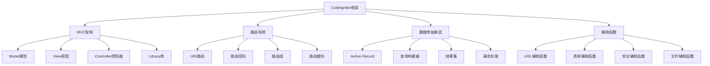

# CodeIgniter框架

## 🎯 学习目标
- 理解CodeIgniter框架的核心概念和架构
- 掌握CodeIgniter框架的基本使用和开发流程
- 学会CodeIgniter框架的高级特性和最佳实践
- 了解CodeIgniter框架的性能优化和部署策略

## 📚 核心概念

### CodeIgniter架构



### CodeIgniter核心组件

| 组件 | 描述 | 功能 | 示例 |
|------|------|------|------|
| 路由系统 | URL路由处理 | 请求分发、URL重写 | $route['default_controller'] |
| 数据库类 | 数据库操作 | 查询构建、结果处理 | $this->db->get('users') |
| 输入类 | 输入处理 | 请求数据、安全过滤 | $this->input->post('name') |
| 输出类 | 输出处理 | 响应生成、内容类型 | $this->output->set_content_type() |
| 安全类 | 安全防护 | XSS过滤、CSRF保护 | $this->security->xss_clean() |
| 会话类 | 会话管理 | 用户会话、数据存储 | $this->session->userdata('user_id') |
| 表单验证 | 数据验证 | 规则验证、错误处理 | $this->form_validation->run() |
| 文件上传 | 文件处理 | 文件上传、类型验证 | $this->upload->do_upload() |

## 🔧 CodeIgniter框架实现

### 基础CodeIgniter应用
```php
<?php
// 1. CodeIgniter应用核心类
class CodeIgniterApplication {
    private array $config = [];
    private array $routes = [];
    private array $libraries = [];
    private array $helpers = [];
    private $database;
    private $input;
    private $output;
    private $security;
    private $session;
    
    public function __construct(array $config = []) {
        $this->config = array_merge([
            'base_url' => 'http://localhost/',
            'index_page' => 'index.php',
            'uri_protocol' => 'REQUEST_URI',
            'url_suffix' => '',
            'language' => 'english',
            'charset' => 'UTF-8',
            'enable_hooks' => false,
            'subclass_prefix' => 'MY_',
            'composer_autoload' => false,
            'permitted_uri_chars' => 'a-z 0-9~%.:_\-',
            'enable_query_strings' => false,
            'controller_trigger' => 'c',
            'function_trigger' => 'm',
            'directory_trigger' => 'd',
            'allow_get_array' => true,
            'log_threshold' => 0,
            'log_path' => '',
            'log_file_extension' => '',
            'log_file_permissions' => 0644,
            'log_date_format' => 'Y-m-d H:i:s',
            'error_views_path' => '',
            'cache_path' => '',
            'cache_query_string' => false,
            'encryption_key' => '',
            'sess_driver' => 'files',
            'sess_cookie_name' => 'ci_session',
            'sess_expiration' => 7200,
            'sess_save_path' => null,
            'sess_match_ip' => false,
            'sess_time_to_update' => 300,
            'sess_regenerate_destroy' => false,
            'cookie_prefix' => '',
            'cookie_domain' => '',
            'cookie_path' => '/',
            'cookie_secure' => false,
            'cookie_httponly' => false,
            'standardize_newlines' => false,
            'global_xss_filtering' => false,
            'csrf_protection' => false,
            'csrf_token_name' => 'csrf_test_name',
            'csrf_cookie_name' => 'csrf_cookie_name',
            'csrf_expire' => 7200,
            'csrf_regenerate' => true,
            'csrf_exclude_uris' => array(),
            'compress_output' => false,
            'time_reference' => 'local',
            'rewrite_short_tags' => false,
            'proxy_ips' => '',
            'database' => [
                'hostname' => 'localhost',
                'username' => 'root',
                'password' => '',
                'database' => 'codeigniter',
                'dbdriver' => 'mysqli',
                'dbprefix' => '',
                'pconnect' => false,
                'db_debug' => true,
                'cache_on' => false,
                'cachedir' => '',
                'char_set' => 'utf8',
                'dbcollat' => 'utf8_general_ci',
                'swap_pre' => '',
                'encrypt' => false,
                'compress' => false,
                'stricton' => false,
                'failover' => array(),
                'save_queries' => true
            ]
        ], $config);
        
        $this->initializeLibraries();
        $this->loadHelpers();
    }
    
    // 初始化库
    private function initializeLibraries(): void {
        $this->database = new Database($this->config['database']);
        $this->input = new Input();
        $this->output = new Output();
        $this->security = new Security();
        $this->session = new Session($this->config);
    }
    
    // 加载辅助函数
    private function loadHelpers(): void {
        $this->helpers = [
            'url' => new UrlHelper(),
            'form' => new FormHelper(),
            'security' => new SecurityHelper(),
            'file' => new FileHelper(),
            'date' => new DateHelper(),
            'text' => new TextHelper()
        ];
    }
    
    // 添加路由
    public function addRoute(string $pattern, string $controller, array $options = []): void {
        $this->routes[$pattern] = [
            'controller' => $controller,
            'options' => $options
        ];
    }
    
    // 处理请求
    public function handleRequest(): void {
        $uri = $this->getUri();
        $route = $this->findRoute($uri);
        
        if ($route) {
            $this->executeController($route);
        } else {
            $this->show404();
        }
    }
    
    // 获取URI
    private function getUri(): string {
        $uri = $_SERVER['REQUEST_URI'] ?? '/';
        $uri = parse_url($uri, PHP_URL_PATH);
        return $uri;
    }
    
    // 查找路由
    private function findRoute(string $uri): ?array {
        // 默认路由
        if ($uri === '/' || $uri === '') {
            return ['controller' => 'Welcome/index'];
        }
        
        // 自定义路由
        foreach ($this->routes as $pattern => $route) {
            if ($this->matchRoute($pattern, $uri)) {
                return $route;
            }
        }
        
        // 默认控制器/方法路由
        $segments = explode('/', trim($uri, '/'));
        if (count($segments) >= 2) {
            return ['controller' => $segments[0] . '/' . $segments[1]];
        } elseif (count($segments) == 1) {
            return ['controller' => $segments[0] . '/index'];
        }
        
        return null;
    }
    
    // 匹配路由
    private function matchRoute(string $pattern, string $uri): bool {
        $pattern = preg_replace('/\{[^}]+\}/', '([^/]+)', $pattern);
        $pattern = '#^' . $pattern . '$#';
        return preg_match($pattern, $uri);
    }
    
    // 执行控制器
    private function executeController(array $route): void {
        $controller = $route['controller'];
        list($controllerName, $method) = explode('/', $controller);
        
        $controllerClass = ucfirst($controllerName) . 'Controller';
        
        if (class_exists($controllerClass)) {
            $controllerInstance = new $controllerClass();
            $controllerInstance->setApplication($this);
            
            if (method_exists($controllerInstance, $method)) {
                $controllerInstance->$method();
            } else {
                $this->show404();
            }
        } else {
            $this->show404();
        }
    }
    
    // 显示404页面
    private function show404(): void {
        http_response_code(404);
        echo '<h1>404 - Page Not Found</h1>';
    }
    
    // 获取库
    public function getLibrary(string $name) {
        switch ($name) {
            case 'database':
                return $this->database;
            case 'input':
                return $this->input;
            case 'output':
                return $this->output;
            case 'security':
                return $this->security;
            case 'session':
                return $this->session;
            default:
                return $this->libraries[$name] ?? null;
        }
    }
    
    // 获取辅助函数
    public function getHelper(string $name) {
        return $this->helpers[$name] ?? null;
    }
    
    // 获取配置
    public function getConfig(string $key = null) {
        if ($key) {
            return $this->config[$key] ?? null;
        }
        return $this->config;
    }
}

// 2. 数据库类
class Database {
    private array $config;
    private $connection;
    private string $lastQuery = '';
    private array $queryHistory = [];
    
    public function __construct(array $config) {
        $this->config = $config;
        $this->connect();
    }
    
    // 连接数据库
    private function connect(): void {
        // 模拟数据库连接
        $this->connection = new stdClass();
        $this->connection->config = $this->config;
        $this->connection->connected = true;
    }
    
    // 获取表数据
    public function get(string $table, int $limit = null, int $offset = null): array {
        $sql = "SELECT * FROM {$table}";
        
        if ($limit) {
            $sql .= " LIMIT {$limit}";
            if ($offset) {
                $sql .= " OFFSET {$offset}";
            }
        }
        
        return $this->query($sql);
    }
    
    // 获取单条记录
    public function getWhere(string $table, array $where, int $limit = null, int $offset = null): array {
        $sql = "SELECT * FROM {$table} WHERE ";
        $conditions = [];
        
        foreach ($where as $key => $value) {
            $conditions[] = "{$key} = '{$value}'";
        }
        
        $sql .= implode(' AND ', $conditions);
        
        if ($limit) {
            $sql .= " LIMIT {$limit}";
            if ($offset) {
                $sql .= " OFFSET {$offset}";
            }
        }
        
        return $this->query($sql);
    }
    
    // 插入数据
    public function insert(string $table, array $data): bool {
        $columns = array_keys($data);
        $values = array_values($data);
        
        $sql = "INSERT INTO {$table} (" . implode(', ', $columns) . ") VALUES ('" . implode("', '", $values) . "')";
        
        return $this->execute($sql);
    }
    
    // 更新数据
    public function update(string $table, array $data, array $where): bool {
        $setClause = [];
        foreach ($data as $key => $value) {
            $setClause[] = "{$key} = '{$value}'";
        }
        
        $whereClause = [];
        foreach ($where as $key => $value) {
            $whereClause[] = "{$key} = '{$value}'";
        }
        
        $sql = "UPDATE {$table} SET " . implode(', ', $setClause) . " WHERE " . implode(' AND ', $whereClause);
        
        return $this->execute($sql);
    }
    
    // 删除数据
    public function delete(string $table, array $where): bool {
        $whereClause = [];
        foreach ($where as $key => $value) {
            $whereClause[] = "{$key} = '{$value}'";
        }
        
        $sql = "DELETE FROM {$table} WHERE " . implode(' AND ', $whereClause);
        
        return $this->execute($sql);
    }
    
    // 执行查询
    public function query(string $sql): array {
        $this->lastQuery = $sql;
        $this->queryHistory[] = $sql;
        
        // 模拟查询结果
        if (stripos($sql, 'SELECT') === 0) {
            return [
                ['id' => 1, 'name' => 'John Doe', 'email' => 'john@example.com'],
                ['id' => 2, 'name' => 'Jane Smith', 'email' => 'jane@example.com']
            ];
        }
        
        return [];
    }
    
    // 执行SQL
    public function execute(string $sql): bool {
        $this->lastQuery = $sql;
        $this->queryHistory[] = $sql;
        
        // 模拟执行
        return true;
    }
    
    // 获取最后查询
    public function lastQuery(): string {
        return $this->lastQuery;
    }
    
    // 获取查询历史
    public function queryHistory(): array {
        return $this->queryHistory;
    }
    
    // 开始事务
    public function transStart(): void {
        $this->execute('START TRANSACTION');
    }
    
    // 提交事务
    public function transComplete(): bool {
        $this->execute('COMMIT');
        return true;
    }
    
    // 回滚事务
    public function transRollback(): bool {
        $this->execute('ROLLBACK');
        return true;
    }
}

// 3. 输入类
class Input {
    // 获取POST数据
    public function post(string $index = null, bool $xss_clean = false) {
        if ($index === null) {
            return $_POST;
        }
        
        $value = $_POST[$index] ?? null;
        
        if ($xss_clean && $value !== null) {
            $value = $this->xss_clean($value);
        }
        
        return $value;
    }
    
    // 获取GET数据
    public function get(string $index = null, bool $xss_clean = false) {
        if ($index === null) {
            return $_GET;
        }
        
        $value = $_GET[$index] ?? null;
        
        if ($xss_clean && $value !== null) {
            $value = $this->xss_clean($value);
        }
        
        return $value;
    }
    
    // 获取请求数据
    public function request(string $index = null, bool $xss_clean = false) {
        if ($index === null) {
            return $_REQUEST;
        }
        
        $value = $_REQUEST[$index] ?? null;
        
        if ($xss_clean && $value !== null) {
            $value = $this->xss_clean($value);
        }
        
        return $value;
    }
    
    // 获取Cookie数据
    public function cookie(string $index = null, bool $xss_clean = false) {
        if ($index === null) {
            return $_COOKIE;
        }
        
        $value = $_COOKIE[$index] ?? null;
        
        if ($xss_clean && $value !== null) {
            $value = $this->xss_clean($value);
        }
        
        return $value;
    }
    
    // 获取服务器数据
    public function server(string $index = null) {
        if ($index === null) {
            return $_SERVER;
        }
        
        return $_SERVER[$index] ?? null;
    }
    
    // 获取IP地址
    public function ipAddress(): string {
        $ipKeys = ['HTTP_CLIENT_IP', 'HTTP_X_FORWARDED_FOR', 'REMOTE_ADDR'];
        
        foreach ($ipKeys as $key) {
            if (!empty($_SERVER[$key])) {
                return $_SERVER[$key];
            }
        }
        
        return '0.0.0.0';
    }
    
    // 获取用户代理
    public function userAgent(): string {
        return $_SERVER['HTTP_USER_AGENT'] ?? '';
    }
    
    // 检查是否为AJAX请求
    public function isAjax(): bool {
        return !empty($_SERVER['HTTP_X_REQUESTED_WITH']) && 
               strtolower($_SERVER['HTTP_X_REQUESTED_WITH']) === 'xmlhttprequest';
    }
    
    // 检查是否为POST请求
    public function isPost(): bool {
        return $_SERVER['REQUEST_METHOD'] === 'POST';
    }
    
    // 检查是否为GET请求
    public function isGet(): bool {
        return $_SERVER['REQUEST_METHOD'] === 'GET';
    }
    
    // XSS清理
    private function xss_clean($data): string {
        // 简化的XSS清理
        return htmlspecialchars($data, ENT_QUOTES, 'UTF-8');
    }
}

// 4. 输出类
class Output {
    private string $content = '';
    private array $headers = [];
    
    // 设置内容
    public function setOutput(string $output): void {
        $this->content = $output;
    }
    
    // 获取内容
    public function getOutput(): string {
        return $this->content;
    }
    
    // 设置内容类型
    public function setContentType(string $mimeType, string $charset = 'UTF-8'): void {
        $this->setHeader('Content-Type', $mimeType . '; charset=' . $charset);
    }
    
    // 设置状态码
    public function setStatusHeader(int $code, string $text = ''): void {
        $this->setHeader('Status', $code . ' ' . $text);
    }
    
    // 设置响应头
    public function setHeader(string $header, string $value): void {
        $this->headers[$header] = $value;
    }
    
    // 获取响应头
    public function getHeaders(): array {
        return $this->headers;
    }
    
    // 输出内容
    public function _display(): void {
        foreach ($this->headers as $header => $value) {
            header("{$header}: {$value}");
        }
        
        echo $this->content;
    }
    
    // 启用压缩
    public function enableCompression(): void {
        if (extension_loaded('zlib') && !ob_get_level()) {
            ob_start('ob_gzhandler');
        }
    }
    
    // 禁用压缩
    public function disableCompression(): void {
        if (ob_get_level()) {
            ob_end_clean();
        }
    }
}

// 5. 安全类
class Security {
    // XSS清理
    public function xss_clean($str): string {
        // 简化的XSS清理
        return htmlspecialchars($str, ENT_QUOTES, 'UTF-8');
    }
    
    // 生成CSRF令牌
    public function getCsrfHash(): string {
        return bin2hex(random_bytes(32));
    }
    
    // 验证CSRF令牌
    public function csrfVerify(): bool {
        $token = $_POST['csrf_token'] ?? '';
        $hash = $_SESSION['csrf_hash'] ?? '';
        
        return hash_equals($hash, $token);
    }
    
    // 生成随机字符串
    public function getRandomBytes(int $length = 32): string {
        return bin2hex(random_bytes($length));
    }
    
    // 密码哈希
    public function hashPassword(string $password): string {
        return password_hash($password, PASSWORD_DEFAULT);
    }
    
    // 验证密码
    public function verifyPassword(string $password, string $hash): bool {
        return password_verify($password, $hash);
    }
}

// 6. 会话类
class Session {
    private array $config;
    private array $sessionData = [];
    
    public function __construct(array $config) {
        $this->config = $config;
        $this->start();
    }
    
    // 启动会话
    private function start(): void {
        if (session_status() === PHP_SESSION_NONE) {
            session_start();
        }
        
        $this->sessionData = $_SESSION;
    }
    
    // 设置会话数据
    public function setUserdata(string $key, $value = null): void {
        if (is_array($key)) {
            foreach ($key as $k => $v) {
                $this->sessionData[$k] = $v;
                $_SESSION[$k] = $v;
            }
        } else {
            $this->sessionData[$key] = $value;
            $_SESSION[$key] = $value;
        }
    }
    
    // 获取会话数据
    public function userdata(string $key = null) {
        if ($key === null) {
            return $this->sessionData;
        }
        
        return $this->sessionData[$key] ?? null;
    }
    
    // 删除会话数据
    public function unsetUserdata(string $key): void {
        unset($this->sessionData[$key]);
        unset($_SESSION[$key]);
    }
    
    // 销毁会话
    public function sessDestroy(): void {
        session_destroy();
        $this->sessionData = [];
    }
    
    // 设置Flash数据
    public function setFlashdata(string $key, $value): void {
        $this->setUserdata('_ci_flash_' . $key, $value);
    }
    
    // 获取Flash数据
    public function flashdata(string $key = null) {
        if ($key === null) {
            $flashData = [];
            foreach ($this->sessionData as $k => $v) {
                if (strpos($k, '_ci_flash_') === 0) {
                    $flashData[substr($k, 10)] = $v;
                }
            }
            return $flashData;
        }
        
        return $this->userdata('_ci_flash_' . $key);
    }
}

// 7. 辅助函数类
class UrlHelper {
    public function baseUrl(string $uri = ''): string {
        return 'http://localhost/' . ltrim($uri, '/');
    }
    
    public function siteUrl(string $uri = ''): string {
        return $this->baseUrl($uri);
    }
    
    public function anchor(string $uri = '', string $title = '', array $attributes = []): string {
        $url = $this->siteUrl($uri);
        $attr = '';
        
        foreach ($attributes as $key => $value) {
            $attr .= " {$key}=\"{$value}\"";
        }
        
        return "<a href=\"{$url}\"{$attr}>{$title}</a>";
    }
}

class FormHelper {
    public function formOpen(string $action = '', array $attributes = []): string {
        $attr = '';
        foreach ($attributes as $key => $value) {
            $attr .= " {$key}=\"{$value}\"";
        }
        
        return "<form action=\"{$action}\"{$attr}>";
    }
    
    public function formClose(): string {
        return '</form>';
    }
    
    public function input(string $data = '', string $value = '', array $extra = []): string {
        $attr = '';
        foreach ($extra as $key => $val) {
            $attr .= " {$key}=\"{$val}\"";
        }
        
        return "<input name=\"{$data}\" value=\"{$value}\"{$attr} />";
    }
}

class SecurityHelper {
    public function csrfToken(): string {
        return '<input type="hidden" name="csrf_token" value="' . bin2hex(random_bytes(32)) . '" />';
    }
    
    public function csrfHash(): string {
        return bin2hex(random_bytes(32));
    }
}

class FileHelper {
    public function readFile(string $file): string {
        return file_get_contents($file);
    }
    
    public function writeFile(string $file, string $data): bool {
        return file_put_contents($file, $data) !== false;
    }
}

class DateHelper {
    public function now(string $format = 'Y-m-d H:i:s'): string {
        return date($format);
    }
    
    public function timeAgo(string $datetime): string {
        $time = time() - strtotime($datetime);
        
        if ($time < 60) return '刚刚';
        if ($time < 3600) return floor($time / 60) . '分钟前';
        if ($time < 86400) return floor($time / 3600) . '小时前';
        
        return floor($time / 86400) . '天前';
    }
}

class TextHelper {
    public function wordLimiter(string $str, int $limit = 100, string $endChar = '&#8230;'): string {
        if (strlen($str) <= $limit) {
            return $str;
        }
        
        return substr($str, 0, $limit) . $endChar;
    }
    
    public function characterLimiter(string $str, int $n = 500, string $endChar = '&#8230;'): string {
        if (strlen($str) <= $n) {
            return $str;
        }
        
        return substr($str, 0, $n) . $endChar;
    }
}

// 8. 基础控制器
class CI_Controller {
    protected $app;
    
    public function setApplication($app): void {
        $this->app = $app;
    }
    
    protected function loadLibrary(string $name) {
        return $this->app->getLibrary($name);
    }
    
    protected function loadHelper(string $name) {
        return $this->app->getHelper($name);
    }
    
    protected function loadView(string $view, array $data = []): string {
        // 简化的视图加载
        $content = "<h1>{$view}</h1>";
        
        foreach ($data as $key => $value) {
            $content .= "<p>{$key}: {$value}</p>";
        }
        
        return $content;
    }
}

// 9. 用户控制器
class UserController extends CI_Controller {
    public function index(): void {
        $db = $this->loadLibrary('database');
        $users = $db->get('users');
        
        $data = [
            'title' => '用户列表',
            'users' => $users
        ];
        
        $content = $this->loadView('users/index', $data);
        
        $output = $this->loadLibrary('output');
        $output->setOutput($content);
        $output->_display();
    }
    
    public function show(): void {
        $db = $this->loadLibrary('database');
        $input = $this->loadLibrary('input');
        
        $id = $input->get('id');
        $user = $db->getWhere('users', ['id' => $id]);
        
        if (empty($user)) {
            $output = $this->loadLibrary('output');
            $output->setStatusHeader(404);
            $output->setOutput('用户不存在');
            $output->_display();
            return;
        }
        
        $data = [
            'title' => '用户详情',
            'user' => $user[0]
        ];
        
        $content = $this->loadView('users/show', $data);
        
        $output = $this->loadLibrary('output');
        $output->setOutput($content);
        $output->_display();
    }
    
    public function create(): void {
        $input = $this->loadLibrary('input');
        $security = $this->loadLibrary('security');
        
        if ($input->isPost()) {
            $name = $input->post('name', true);
            $email = $input->post('email', true);
            $password = $input->post('password');
            
            if ($name && $email && $password) {
                $db = $this->loadLibrary('database');
                
                $data = [
                    'name' => $name,
                    'email' => $email,
                    'password' => $security->hashPassword($password),
                    'created_at' => date('Y-m-d H:i:s')
                ];
                
                if ($db->insert('users', $data)) {
                    $session = $this->loadLibrary('session');
                    $session->setFlashdata('success', '用户创建成功');
                    
                    $url = $this->loadHelper('url');
                    header('Location: ' . $url->siteUrl('user/index'));
                    exit;
                }
            }
        }
        
        $data = ['title' => '创建用户'];
        $content = $this->loadView('users/create', $data);
        
        $output = $this->loadLibrary('output');
        $output->setOutput($content);
        $output->_display();
    }
}

// 使用示例
echo "=== CodeIgniter框架示例 ===\n";

try {
    // 创建CodeIgniter应用
    $app = new CodeIgniterApplication();
    
    // 添加路由
    $app->addRoute('users', 'UserController/index');
    $app->addRoute('users/{id}', 'UserController/show');
    $app->addRoute('users/create', 'UserController/create');
    
    // 模拟请求处理
    $_SERVER['REQUEST_URI'] = '/users';
    $_SERVER['REQUEST_METHOD'] = 'GET';
    
    // 处理请求
    $app->handleRequest();
    
    echo "\n";
    
    // 使用数据库
    $db = $app->getLibrary('database');
    $users = $db->get('users', 10);
    echo "查询用户数量: " . count($users) . "\n";
    
    // 使用输入类
    $input = $app->getLibrary('input');
    $userAgent = $input->userAgent();
    echo "用户代理: {$userAgent}\n";
    
    $ipAddress = $input->ipAddress();
    echo "IP地址: {$ipAddress}\n";
    
    // 使用安全类
    $security = $app->getLibrary('security');
    $hashedPassword = $security->hashPassword('password123');
    echo "密码哈希: {$hashedPassword}\n";
    
    $isValid = $security->verifyPassword('password123', $hashedPassword);
    echo "密码验证: " . ($isValid ? '成功' : '失败') . "\n";
    
    // 使用会话
    $session = $app->getLibrary('session');
    $session->setUserdata('user_id', 1);
    $session->setUserdata('username', 'admin');
    
    $userId = $session->userdata('user_id');
    $username = $session->userdata('username');
    echo "会话数据 - 用户ID: {$userId}, 用户名: {$username}\n";
    
    // 使用辅助函数
    $url = $app->getHelper('url');
    $baseUrl = $url->baseUrl('users');
    echo "基础URL: {$baseUrl}\n";
    
    $form = $app->getHelper('form');
    $formOpen = $form->formOpen('/users/create', ['method' => 'POST']);
    echo "表单开始标签: {$formOpen}\n";
    
    $text = $app->getHelper('text');
    $limitedText = $text->wordLimiter('这是一个很长的文本内容，需要限制显示长度', 10);
    echo "文本限制: {$limitedText}\n";
    
    $date = $app->getHelper('date');
    $now = $date->now();
    echo "当前时间: {$now}\n";
    
    $timeAgo = $date->timeAgo('2023-01-01 10:00:00');
    echo "时间差: {$timeAgo}\n";
    
} catch (Exception $e) {
    echo "错误: " . $e->getMessage() . "\n";
}
?>
```

## 📊 最佳实践

### CodeIgniter框架最佳实践
```php
<?php
// CodeIgniter框架最佳实践

class CodeIgniterBestPractices {
    // 1. 架构设计最佳实践
    public static function getArchitectureBestPractices() {
        return [
            'MVC架构' => [
                '职责分离' => '保持Model、View、Controller职责清晰',
                '瘦控制器' => '控制器保持简洁，业务逻辑放在Model中',
                '富模型' => 'Model包含业务逻辑和数据操作',
                '视图分离' => '视图只负责展示，不包含业务逻辑'
            ],
            '库和辅助函数' => [
                '库封装' => '将复杂功能封装在Library中',
                '辅助函数' => '使用Helper处理通用功能',
                '自动加载' => '合理配置自动加载机制',
                '命名规范' => '遵循CodeIgniter命名规范'
            ],
            '配置管理' => [
                '环境配置' => '使用不同环境配置文件',
                '配置分离' => '将敏感配置分离到环境变量',
                '配置缓存' => '在生产环境使用配置缓存',
                '配置验证' => '验证配置的正确性'
            ]
        ];
    }
    
    // 2. 性能优化最佳实践
    public static function getPerformanceBestPractices() {
        return [
            '数据库优化' => [
                '查询优化' => '优化数据库查询性能',
                '索引使用' => '为常用查询字段添加索引',
                '连接池' => '使用数据库连接池',
                '查询缓存' => '使用查询结果缓存'
            ],
            '应用优化' => [
                'OPcache' => '启用PHP OPcache',
                '输出压缩' => '启用Gzip压缩',
                '静态资源' => '优化静态资源加载',
                '缓存策略' => '实现多级缓存策略'
            ],
            '代码优化' => [
                '自动加载' => '优化自动加载性能',
                '内存管理' => '注意内存使用和释放',
                '循环优化' => '优化循环和条件判断',
                '函数调用' => '减少不必要的函数调用'
            ]
        ];
    }
    
    // 3. 安全最佳实践
    public static function getSecurityBestPractices() {
        return [
            '输入验证' => [
                'XSS防护' => '使用XSS过滤保护输入',
                'SQL注入' => '使用参数化查询防止SQL注入',
                '数据验证' => '验证所有用户输入',
                '类型检查' => '检查数据类型和格式'
            ],
            '认证授权' => [
                '密码安全' => '使用安全的密码哈希',
                '会话管理' => '合理配置会话安全',
                '权限控制' => '实现细粒度权限控制',
                '登录保护' => '防止暴力破解攻击'
            ],
            '数据保护' => [
                '敏感数据' => '加密存储敏感数据',
                '日志安全' => '避免在日志中记录敏感信息',
                '文件上传' => '验证文件类型和大小',
                'CSRF防护' => '启用CSRF保护机制'
            ]
        ];
    }
}

// 使用示例
echo "=== CodeIgniter框架最佳实践示例 ===\n";

try {
    $architecturePractices = CodeIgniterBestPractices::getArchitectureBestPractices();
    echo "架构设计最佳实践:\n";
    foreach ($architecturePractices as $category => $practices) {
        echo "  $category:\n";
        foreach ($practices as $practice => $description) {
            echo "    - $practice: $description\n";
        }
        echo "\n";
    }
    
} catch (Exception $e) {
    echo "错误: " . $e->getMessage() . "\n";
}
?>
```

## 🎓 学习建议

### 费曼学习法应用
1. **选择概念**: 选择CodeIgniter框架中的核心概念
2. **简化解释**: 用简单语言解释CodeIgniter的作用
3. **识别盲点**: 发现理解不深入的地方
4. **重新学习**: 针对盲点进行深入学习

### 刻意练习重点
1. **基础使用**: 掌握CodeIgniter框架的基本使用
2. **MVC架构**: 理解MVC架构在CodeIgniter中的应用
3. **数据库操作**: 掌握CodeIgniter的数据库操作
4. **最佳实践**: 遵循CodeIgniter开发最佳实践

## 🔗 相关链接
- [[01-Laravel框架|Laravel框架]]
- [[02-Symfony框架|Symfony框架]]
- [[04-框架选择指南|框架选择指南]]
- [[05-自定义框架开发|自定义框架开发]]
- [[06-框架源码分析|框架源码分析]]
