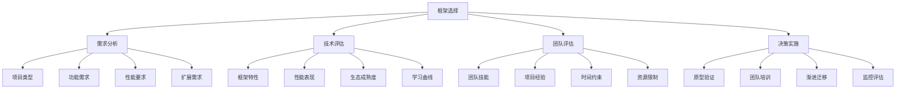

# 框架选择指南

## 🎯 学习目标
- 理解PHP框架选择的重要性和影响因素
- 掌握框架选择的评估标准和方法
- 学会制定框架选择决策流程
- 了解不同框架的特点和适用场景

## 📚 核心概念

### 框架选择决策流程



### 框架选择维度

| 维度 | 描述 | 权重 | 评估指标 | 示例 |
|------|------|------|----------|------|
| 功能完整性 | 框架功能是否满足需求 | 25% | 功能覆盖度、API完整性 | 路由、ORM、模板引擎 |
| 性能表现 | 框架的性能表现 | 20% | 响应时间、内存使用、并发能力 | 基准测试、性能报告 |
| 学习成本 | 团队学习框架的成本 | 20% | 学习曲线、文档质量、社区支持 | 培训时间、上手难度 |
| 生态成熟度 | 框架生态的成熟程度 | 15% | 社区活跃度、第三方支持 | 包数量、社区规模 |
| 维护成本 | 长期维护的成本 | 10% | 更新频率、向后兼容性 | 版本支持、迁移成本 |
| 团队适配 | 团队技能与框架的匹配度 | 10% | 技能匹配、经验积累 | 团队评估、技能测试 |

## 🔧 框架选择实现

### 基础框架选择工具
```php
<?php
// 1. 框架选择决策器
class FrameworkSelectionDecisionMaker {
    private array $requirements = [];
    private array $candidates = [];
    private array $criteria = [];
    private array $weights = [];
    private array $teamProfile = [];
    
    public function __construct() {
        $this->initializeCriteria();
        $this->initializeWeights();
    }
    
    // 初始化评估标准
    private function initializeCriteria(): void {
        $this->criteria = [
            'functionality' => [
                'name' => '功能完整性',
                'description' => '框架功能是否满足项目需求',
                'metrics' => [
                    'routing' => '路由系统',
                    'orm' => 'ORM支持',
                    'template' => '模板引擎',
                    'validation' => '数据验证',
                    'authentication' => '认证授权',
                    'caching' => '缓存支持',
                    'testing' => '测试支持',
                    'cli' => '命令行工具'
                ]
            ],
            'performance' => [
                'name' => '性能表现',
                'description' => '框架的性能表现',
                'metrics' => [
                    'response_time' => '响应时间',
                    'memory_usage' => '内存使用',
                    'concurrency' => '并发能力',
                    'scalability' => '可扩展性',
                    'optimization' => '优化特性'
                ]
            ],
            'learning_cost' => [
                'name' => '学习成本',
                'description' => '团队学习框架的成本',
                'metrics' => [
                    'learning_curve' => '学习曲线',
                    'documentation' => '文档质量',
                    'community' => '社区支持',
                    'tutorials' => '教程资源',
                    'examples' => '示例代码'
                ]
            ],
            'ecosystem' => [
                'name' => '生态成熟度',
                'description' => '框架生态的成熟程度',
                'metrics' => [
                    'community_activity' => '社区活跃度',
                    'package_count' => '包数量',
                    'third_party' => '第三方支持',
                    'enterprise' => '企业采用',
                    'longevity' => '长期维护'
                ]
            ],
            'maintenance' => [
                'name' => '维护成本',
                'description' => '长期维护的成本',
                'metrics' => [
                    'update_frequency' => '更新频率',
                    'backward_compatibility' => '向后兼容性',
                    'migration_cost' => '迁移成本',
                    'support' => '技术支持',
                    'security' => '安全更新'
                ]
            ],
            'team_fit' => [
                'name' => '团队适配',
                'description' => '团队技能与框架的匹配度',
                'metrics' => [
                    'skill_match' => '技能匹配',
                    'experience' => '项目经验',
                    'preference' => '团队偏好',
                    'training' => '培训需求',
                    'productivity' => '生产力影响'
                ]
            ]
        ];
    }
    
    // 初始化权重
    private function initializeWeights(): void {
        $this->weights = [
            'functionality' => 0.25,
            'performance' => 0.20,
            'learning_cost' => 0.20,
            'ecosystem' => 0.15,
            'maintenance' => 0.10,
            'team_fit' => 0.10
        ];
    }
    
    // 添加项目需求
    public function addRequirement(string $category, array $requirement): void {
        $this->requirements[$category][] = $requirement;
    }
    
    // 添加候选框架
    public function addCandidate(string $name, array $config): void {
        $this->candidates[$name] = array_merge([
            'name' => $name,
            'version' => '1.0.0',
            'license' => 'MIT',
            'description' => '',
            'type' => 'full_stack',
            'scores' => [],
            'pros' => [],
            'cons' => [],
            'use_cases' => [],
            'alternatives' => [],
            'learning_resources' => [],
            'community_info' => []
        ], $config);
    }
    
    // 设置团队档案
    public function setTeamProfile(array $profile): void {
        $this->teamProfile = array_merge([
            'size' => 5,
            'experience_level' => 'intermediate',
            'php_experience' => '3-5 years',
            'framework_experience' => '1-2 years',
            'preferred_paradigms' => ['MVC', 'OOP'],
            'learning_capacity' => 'medium',
            'time_constraints' => 'normal',
            'budget_constraints' => 'normal'
        ], $profile);
    }
    
    // 评估框架
    public function evaluateFramework(string $name, array $scores): void {
        if (!isset($this->candidates[$name])) {
            throw new Exception("Framework '{$name}' not found");
        }
        
        $this->candidates[$name]['scores'] = $scores;
    }
    
    // 计算综合得分
    public function calculateOverallScore(string $name): float {
        if (!isset($this->candidates[$name])) {
            throw new Exception("Framework '{$name}' not found");
        }
        
        $candidate = $this->candidates[$name];
        $scores = $candidate['scores'];
        
        $totalScore = 0;
        foreach ($this->weights as $criterion => $weight) {
            $score = $this->calculateCriterionScore($criterion, $scores[$criterion] ?? []);
            $totalScore += $score * $weight;
        }
        
        return $totalScore;
    }
    
    // 计算标准得分
    private function calculateCriterionScore(string $criterion, array $scores): float {
        $metrics = $this->criteria[$criterion]['metrics'];
        $totalScore = 0;
        $count = 0;
        
        foreach ($metrics as $metric => $description) {
            if (isset($scores[$metric])) {
                $totalScore += $scores[$metric];
                $count++;
            }
        }
        
        return $count > 0 ? $totalScore / $count : 0;
    }
    
    // 生成框架对比报告
    public function generateComparisonReport(): array {
        $report = [
            'summary' => [],
            'detailed_comparison' => [],
            'recommendations' => [],
            'risk_analysis' => [],
            'implementation_plan' => []
        ];
        
        // 计算所有框架的综合得分
        $scores = [];
        foreach ($this->candidates as $name => $candidate) {
            $scores[$name] = $this->calculateOverallScore($name);
        }
        
        // 按得分排序
        arsort($scores);
        
        // 生成摘要
        $report['summary'] = [
            'total_candidates' => count($this->candidates),
            'top_choice' => array_key_first($scores),
            'top_score' => $scores[array_key_first($scores)],
            'score_distribution' => $scores,
            'team_profile' => $this->teamProfile
        ];
        
        // 生成详细对比
        foreach ($this->candidates as $name => $candidate) {
            $report['detailed_comparison'][$name] = [
                'overall_score' => $scores[$name],
                'criterion_scores' => $this->calculateCriterionScores($name),
                'pros' => $candidate['pros'],
                'cons' => $candidate['cons'],
                'use_cases' => $candidate['use_cases'],
                'learning_resources' => $candidate['learning_resources'],
                'community_info' => $candidate['community_info']
            ];
        }
        
        // 生成推荐
        $report['recommendations'] = $this->generateRecommendations($scores);
        
        // 生成风险分析
        $report['risk_analysis'] = $this->generateRiskAnalysis();
        
        // 生成实施计划
        $report['implementation_plan'] = $this->generateImplementationPlan();
        
        return $report;
    }
    
    // 计算标准得分
    private function calculateCriterionScores(string $name): array {
        $candidate = $this->candidates[$name];
        $scores = $candidate['scores'];
        $criterionScores = [];
        
        foreach ($this->criteria as $criterion => $config) {
            $criterionScores[$criterion] = $this->calculateCriterionScore($criterion, $scores[$criterion] ?? []);
        }
        
        return $criterionScores;
    }
    
    // 生成推荐
    private function generateRecommendations(array $scores): array {
        $recommendations = [];
        $topChoice = array_key_first($scores);
        $topScore = $scores[$topChoice];
        
        if ($topScore >= 8.0) {
            $recommendations[] = [
                'type' => 'strong_recommendation',
                'framework' => $topChoice,
                'reason' => '综合得分很高，强烈推荐使用',
                'confidence' => 'high'
            ];
        } elseif ($topScore >= 6.0) {
            $recommendations[] = [
                'type' => 'recommendation',
                'framework' => $topChoice,
                'reason' => '综合得分较高，推荐使用',
                'confidence' => 'medium'
            ];
        } else {
            $recommendations[] = [
                'type' => 'caution',
                'framework' => $topChoice,
                'reason' => '综合得分较低，需要谨慎考虑',
                'confidence' => 'low'
            ];
        }
        
        // 基于团队档案的推荐
        $teamRecommendations = $this->generateTeamBasedRecommendations($scores);
        $recommendations = array_merge($recommendations, $teamRecommendations);
        
        return $recommendations;
    }
    
    // 基于团队的推荐
    private function generateTeamBasedRecommendations(array $scores): array {
        $recommendations = [];
        
        // 基于团队经验水平的推荐
        if ($this->teamProfile['experience_level'] === 'beginner') {
            $recommendations[] = [
                'type' => 'team_consideration',
                'framework' => 'Laravel',
                'reason' => '团队经验较少，建议选择学习曲线平缓的框架',
                'confidence' => 'medium'
            ];
        }
        
        // 基于时间约束的推荐
        if ($this->teamProfile['time_constraints'] === 'tight') {
            $recommendations[] = [
                'type' => 'time_consideration',
                'framework' => 'Laravel',
                'reason' => '时间紧张，建议选择开发效率高的框架',
                'confidence' => 'medium'
            ];
        }
        
        return $recommendations;
    }
    
    // 生成风险分析
    private function generateRiskAnalysis(): array {
        $risks = [];
        
        foreach ($this->candidates as $name => $candidate) {
            $frameworkRisks = [];
            $scores = $candidate['scores'];
            
            // 分析各维度的风险
            if (($scores['performance']['response_time'] ?? 0) < 6.0) {
                $frameworkRisks[] = [
                    'type' => 'performance_risk',
                    'description' => '性能表现可能不满足要求',
                    'severity' => 'medium',
                    'mitigation' => '进行性能优化和基准测试'
                ];
            }
            
            if (($scores['learning_cost']['learning_curve'] ?? 0) < 6.0) {
                $frameworkRisks[] = [
                    'type' => 'learning_risk',
                    'description' => '学习成本较高，可能影响项目进度',
                    'severity' => 'high',
                    'mitigation' => '制定详细的培训计划和资源投入'
                ];
            }
            
            if (($scores['ecosystem']['community_activity'] ?? 0) < 6.0) {
                $frameworkRisks[] = [
                    'type' => 'ecosystem_risk',
                    'description' => '生态不够成熟，可能缺乏支持',
                    'severity' => 'medium',
                    'mitigation' => '建立内部技术支持和知识库'
                ];
            }
            
            if (($scores['maintenance']['update_frequency'] ?? 0) < 6.0) {
                $frameworkRisks[] = [
                    'type' => 'maintenance_risk',
                    'description' => '维护成本较高，长期风险较大',
                    'severity' => 'high',
                    'mitigation' => '制定长期维护计划和预算'
                ];
            }
            
            $risks[$name] = $frameworkRisks;
        }
        
        return $risks;
    }
    
    // 生成实施计划
    private function generateImplementationPlan(): array {
        return [
            'phase_1' => [
                'name' => '准备阶段',
                'duration' => '1-2周',
                'tasks' => [
                    '环境搭建',
                    '团队培训',
                    '原型开发',
                    '技术验证'
                ]
            ],
            'phase_2' => [
                'name' => '开发阶段',
                'duration' => '4-8周',
                'tasks' => [
                    '核心功能开发',
                    '集成测试',
                    '性能优化',
                    '安全加固'
                ]
            ],
            'phase_3' => [
                'name' => '部署阶段',
                'duration' => '1-2周',
                'tasks' => [
                    '生产环境部署',
                    '监控配置',
                    '文档完善',
                    '团队交接'
                ]
            ]
        ];
    }
    
    // 获取需求
    public function getRequirements(): array {
        return $this->requirements;
    }
    
    // 获取候选框架
    public function getCandidates(): array {
        return $this->candidates;
    }
    
    // 获取评估标准
    public function getCriteria(): array {
        return $this->criteria;
    }
    
    // 获取团队档案
    public function getTeamProfile(): array {
        return $this->teamProfile;
    }
}

// 2. 框架特性分析器
class FrameworkFeatureAnalyzer {
    private array $frameworks = [];
    
    public function __construct() {
        $this->initializeFrameworks();
    }
    
    // 初始化框架数据
    private function initializeFrameworks(): void {
        $this->frameworks = [
            'Laravel' => [
                'name' => 'Laravel',
                'type' => 'full_stack',
                'version' => '9.0',
                'license' => 'MIT',
                'description' => '优雅的PHP Web应用框架',
                'features' => [
                    'routing' => ['RESTful路由', '路由缓存', '路由组', '中间件'],
                    'orm' => ['Eloquent ORM', '关系映射', '查询构建器', '迁移'],
                    'template' => ['Blade模板', '模板继承', '组件系统', '指令'],
                    'validation' => ['表单验证', '规则验证', '自定义验证', '错误处理'],
                    'authentication' => ['用户认证', '权限控制', 'API认证', '社交登录'],
                    'caching' => ['多驱动缓存', '标签缓存', '缓存事件', '性能优化'],
                    'testing' => ['PHPUnit集成', '功能测试', '浏览器测试', '模拟'],
                    'cli' => ['Artisan命令', '代码生成', '任务调度', '队列管理']
                ],
                'pros' => [
                    '学习曲线平缓',
                    '文档完善',
                    '社区活跃',
                    '功能丰富',
                    '开发效率高'
                ],
                'cons' => [
                    '性能相对较低',
                    '资源消耗较大',
                    '学习成本较高',
                    '配置复杂'
                ],
                'use_cases' => [
                    '企业级应用',
                    '快速原型开发',
                    '内容管理系统',
                    'API开发'
                ],
                'learning_resources' => [
                    '官方文档',
                    'Laracasts视频教程',
                    '社区教程',
                    '示例项目'
                ],
                'community_info' => [
                    'GitHub Stars' => '70000+',
                    'Packagist Downloads' => '100M+',
                    'Community Size' => 'Large',
                    'Enterprise Adoption' => 'High'
                ]
            ],
            'Symfony' => [
                'name' => 'Symfony',
                'type' => 'component_based',
                'version' => '6.0',
                'license' => 'MIT',
                'description' => '可重用的PHP组件和框架',
                'features' => [
                    'routing' => ['灵活路由', '路由注解', '路由缓存', '路由调试'],
                    'orm' => ['Doctrine集成', '实体映射', '查询构建器', '迁移'],
                    'template' => ['Twig模板', '模板继承', '扩展系统', '国际化'],
                    'validation' => ['验证组件', '约束验证', '自定义验证', '错误处理'],
                    'authentication' => ['安全组件', '用户提供者', '权限控制', '防火墙'],
                    'caching' => ['缓存组件', '多驱动支持', '标签缓存', '性能优化'],
                    'testing' => ['PHPUnit集成', '功能测试', '浏览器测试', '模拟'],
                    'cli' => ['Console组件', '命令系统', '任务调度', '交互式命令']
                ],
                'pros' => [
                    '组件化设计',
                    '性能优秀',
                    '企业级特性',
                    '可扩展性强',
                    '标准遵循'
                ],
                'cons' => [
                    '学习曲线陡峭',
                    '配置复杂',
                    '文档相对较少',
                    '开发效率较低'
                ],
                'use_cases' => [
                    '大型企业应用',
                    '高性能系统',
                    '微服务架构',
                    '组件开发'
                ],
                'learning_resources' => [
                    '官方文档',
                    'SymfonyCasts教程',
                    '社区教程',
                    '组件文档'
                ],
                'community_info' => [
                    'GitHub Stars' => '25000+',
                    'Packagist Downloads' => '50M+',
                    'Community Size' => 'Medium',
                    'Enterprise Adoption' => 'Very High'
                ]
            ],
            'CodeIgniter' => [
                'name' => 'CodeIgniter',
                'type' => 'lightweight',
                'version' => '4.0',
                'license' => 'MIT',
                'description' => '轻量级PHP框架',
                'features' => [
                    'routing' => ['简单路由', '路由规则', '路由组', '路由缓存'],
                    'orm' => ['查询构建器', 'Active Record', '结果集', '事务处理'],
                    'template' => ['简单模板', '模板解析', '变量替换', '模板缓存'],
                    'validation' => ['表单验证', '规则验证', '错误处理', '自定义规则'],
                    'authentication' => ['用户认证', '权限控制', '会话管理', '安全防护'],
                    'caching' => ['页面缓存', '数据库缓存', '查询缓存', '文件缓存'],
                    'testing' => ['PHPUnit集成', '单元测试', '功能测试', '模拟'],
                    'cli' => ['命令行工具', '代码生成', '任务调度', '数据库迁移']
                ],
                'pros' => [
                    '轻量级',
                    '学习成本低',
                    '性能良好',
                    '配置简单',
                    '快速开发'
                ],
                'cons' => [
                    '功能相对简单',
                    '社区较小',
                    '企业级特性不足',
                    '扩展性有限'
                ],
                'use_cases' => [
                    '小型项目',
                    '快速开发',
                    '学习项目',
                    '原型开发'
                ],
                'learning_resources' => [
                    '官方文档',
                    '用户指南',
                    '社区教程',
                    '示例代码'
                ],
                'community_info' => [
                    'GitHub Stars' => '18000+',
                    'Packagist Downloads' => '10M+',
                    'Community Size' => 'Small',
                    'Enterprise Adoption' => 'Medium'
                ]
            ]
        ];
    }
    
    // 获取框架特性
    public function getFrameworkFeatures(string $name): array {
        return $this->frameworks[$name] ?? [];
    }
    
    // 比较框架特性
    public function compareFeatures(array $frameworks): array {
        $comparison = [];
        
        foreach ($frameworks as $framework) {
            $features = $this->getFrameworkFeatures($framework);
            if (!empty($features)) {
                $comparison[$framework] = $features;
            }
        }
        
        return $comparison;
    }
    
    // 分析框架适用性
    public function analyzeSuitability(string $framework, array $requirements): array {
        $features = $this->getFrameworkFeatures($framework);
        if (empty($features)) {
            return [];
        }
        
        $suitability = [
            'framework' => $framework,
            'score' => 0,
            'matches' => [],
            'gaps' => [],
            'recommendations' => []
        ];
        
        $totalRequirements = count($requirements);
        $matchedRequirements = 0;
        
        foreach ($requirements as $requirement) {
            $matched = false;
            
            // 检查框架是否支持该需求
            foreach ($features['features'] as $category => $featureList) {
                if (in_array($requirement, $featureList)) {
                    $matched = true;
                    $matchedRequirements++;
                    $suitability['matches'][] = $requirement;
                    break;
                }
            }
            
            if (!$matched) {
                $suitability['gaps'][] = $requirement;
            }
        }
        
        $suitability['score'] = $totalRequirements > 0 ? ($matchedRequirements / $totalRequirements) * 100 : 0;
        
        // 生成推荐
        if ($suitability['score'] >= 80) {
            $suitability['recommendations'][] = '框架非常适合项目需求';
        } elseif ($suitability['score'] >= 60) {
            $suitability['recommendations'][] = '框架基本满足项目需求，但需要额外开发';
        } else {
            $suitability['recommendations'][] = '框架可能不适合项目需求，建议考虑其他选项';
        }
        
        return $suitability;
    }
    
    // 获取所有框架
    public function getAllFrameworks(): array {
        return $this->frameworks;
    }
}

// 使用示例
echo "=== 框架选择指南示例 ===\n";

try {
    // 创建框架选择决策器
    $decisionMaker = new FrameworkSelectionDecisionMaker();
    
    // 添加项目需求
    $decisionMaker->addRequirement('functional', [
        'type' => 'web_application',
        'description' => '构建企业级Web应用',
        'priority' => 'high'
    ]);
    
    $decisionMaker->addRequirement('performance', [
        'type' => 'high_concurrency',
        'description' => '支持高并发访问',
        'priority' => 'high'
    ]);
    
    $decisionMaker->addRequirement('team', [
        'type' => 'skill_level',
        'description' => '团队PHP技能水平中等',
        'priority' => 'medium'
    ]);
    
    // 设置团队档案
    $decisionMaker->setTeamProfile([
        'size' => 8,
        'experience_level' => 'intermediate',
        'php_experience' => '3-5 years',
        'framework_experience' => '1-2 years',
        'preferred_paradigms' => ['MVC', 'OOP'],
        'learning_capacity' => 'medium',
        'time_constraints' => 'normal',
        'budget_constraints' => 'normal'
    ]);
    
    // 添加候选框架
    $decisionMaker->addCandidate('Laravel', [
        'version' => '9.0',
        'license' => 'MIT',
        'description' => '优雅的PHP Web应用框架',
        'type' => 'full_stack',
        'pros' => [
            '学习曲线平缓',
            '文档完善',
            '社区活跃',
            '功能丰富',
            '开发效率高'
        ],
        'cons' => [
            '性能相对较低',
            '资源消耗较大',
            '学习成本较高',
            '配置复杂'
        ],
        'use_cases' => [
            '企业级应用',
            '快速原型开发',
            '内容管理系统',
            'API开发'
        ],
        'learning_resources' => [
            '官方文档',
            'Laracasts视频教程',
            '社区教程',
            '示例项目'
        ],
        'community_info' => [
            'GitHub Stars' => '70000+',
            'Packagist Downloads' => '100M+',
            'Community Size' => 'Large',
            'Enterprise Adoption' => 'High'
        ]
    ]);
    
    $decisionMaker->addCandidate('Symfony', [
        'version' => '6.0',
        'license' => 'MIT',
        'description' => '可重用的PHP组件和框架',
        'type' => 'component_based',
        'pros' => [
            '组件化设计',
            '性能优秀',
            '企业级特性',
            '可扩展性强',
            '标准遵循'
        ],
        'cons' => [
            '学习曲线陡峭',
            '配置复杂',
            '文档相对较少',
            '开发效率较低'
        ],
        'use_cases' => [
            '大型企业应用',
            '高性能系统',
            '微服务架构',
            '组件开发'
        ],
        'learning_resources' => [
            '官方文档',
            'SymfonyCasts教程',
            '社区教程',
            '组件文档'
        ],
        'community_info' => [
            'GitHub Stars' => '25000+',
            'Packagist Downloads' => '50M+',
            'Community Size' => 'Medium',
            'Enterprise Adoption' => 'Very High'
        ]
    ]);
    
    $decisionMaker->addCandidate('CodeIgniter', [
        'version' => '4.0',
        'license' => 'MIT',
        'description' => '轻量级PHP框架',
        'type' => 'lightweight',
        'pros' => [
            '轻量级',
            '学习成本低',
            '性能良好',
            '配置简单',
            '快速开发'
        ],
        'cons' => [
            '功能相对简单',
            '社区较小',
            '企业级特性不足',
            '扩展性有限'
        ],
        'use_cases' => [
            '小型项目',
            '快速开发',
            '学习项目',
            '原型开发'
        ],
        'learning_resources' => [
            '官方文档',
            '用户指南',
            '社区教程',
            '示例代码'
        ],
        'community_info' => [
            'GitHub Stars' => '18000+',
            'Packagist Downloads' => '10M+',
            'Community Size' => 'Small',
            'Enterprise Adoption' => 'Medium'
        ]
    ]);
    
    // 评估框架
    $decisionMaker->evaluateFramework('Laravel', [
        'functionality' => [
            'routing' => 9,
            'orm' => 9,
            'template' => 8,
            'validation' => 8,
            'authentication' => 9,
            'caching' => 8,
            'testing' => 8,
            'cli' => 9
        ],
        'performance' => [
            'response_time' => 6,
            'memory_usage' => 6,
            'concurrency' => 7,
            'scalability' => 7,
            'optimization' => 8
        ],
        'learning_cost' => [
            'learning_curve' => 8,
            'documentation' => 9,
            'community' => 9,
            'tutorials' => 9,
            'examples' => 8
        ],
        'ecosystem' => [
            'community_activity' => 9,
            'package_count' => 9,
            'third_party' => 8,
            'enterprise' => 8,
            'longevity' => 8
        ],
        'maintenance' => [
            'update_frequency' => 8,
            'backward_compatibility' => 7,
            'migration_cost' => 6,
            'support' => 8,
            'security' => 8
        ],
        'team_fit' => [
            'skill_match' => 8,
            'experience' => 7,
            'preference' => 8,
            'training' => 7,
            'productivity' => 8
        ]
    ]);
    
    $decisionMaker->evaluateFramework('Symfony', [
        'functionality' => [
            'routing' => 8,
            'orm' => 8,
            'template' => 8,
            'validation' => 9,
            'authentication' => 9,
            'caching' => 8,
            'testing' => 8,
            'cli' => 8
        ],
        'performance' => [
            'response_time' => 8,
            'memory_usage' => 8,
            'concurrency' => 8,
            'scalability' => 9,
            'optimization' => 9
        ],
        'learning_cost' => [
            'learning_curve' => 5,
            'documentation' => 7,
            'community' => 7,
            'tutorials' => 6,
            'examples' => 6
        ],
        'ecosystem' => [
            'community_activity' => 7,
            'package_count' => 8,
            'third_party' => 8,
            'enterprise' => 9,
            'longevity' => 9
        ],
        'maintenance' => [
            'update_frequency' => 8,
            'backward_compatibility' => 8,
            'migration_cost' => 7,
            'support' => 8,
            'security' => 9
        ],
        'team_fit' => [
            'skill_match' => 6,
            'experience' => 5,
            'preference' => 6,
            'training' => 5,
            'productivity' => 6
        ]
    ]);
    
    $decisionMaker->evaluateFramework('CodeIgniter', [
        'functionality' => [
            'routing' => 7,
            'orm' => 6,
            'template' => 6,
            'validation' => 7,
            'authentication' => 7,
            'caching' => 7,
            'testing' => 6,
            'cli' => 6
        ],
        'performance' => [
            'response_time' => 8,
            'memory_usage' => 8,
            'concurrency' => 7,
            'scalability' => 6,
            'optimization' => 7
        ],
        'learning_cost' => [
            'learning_curve' => 9,
            'documentation' => 7,
            'community' => 6,
            'tutorials' => 6,
            'examples' => 7
        ],
        'ecosystem' => [
            'community_activity' => 6,
            'package_count' => 6,
            'third_party' => 6,
            'enterprise' => 6,
            'longevity' => 7
        ],
        'maintenance' => [
            'update_frequency' => 7,
            'backward_compatibility' => 8,
            'migration_cost' => 8,
            'support' => 6,
            'security' => 7
        ],
        'team_fit' => [
            'skill_match' => 8,
            'experience' => 8,
            'preference' => 7,
            'training' => 8,
            'productivity' => 7
        ]
    ]);
    
    // 生成对比报告
    $report = $decisionMaker->generateComparisonReport();
    
    echo "框架选择对比报告:\n";
    echo "总候选框架: {$report['summary']['total_candidates']}\n";
    echo "推荐选择: {$report['summary']['top_choice']}\n";
    echo "综合得分: {$report['summary']['top_score']}\n";
    echo "\n";
    
    echo "详细对比:\n";
    foreach ($report['detailed_comparison'] as $name => $comparison) {
        echo "  {$name}:\n";
        echo "    综合得分: {$comparison['overall_score']}\n";
        echo "    优势: " . implode(', ', $comparison['pros']) . "\n";
        echo "    劣势: " . implode(', ', $comparison['cons']) . "\n";
    }
    echo "\n";
    
    echo "推荐建议:\n";
    foreach ($report['recommendations'] as $recommendation) {
        echo "  {$recommendation['type']}: {$recommendation['framework']} - {$recommendation['reason']} (置信度: {$recommendation['confidence']})\n";
    }
    echo "\n";
    
    echo "风险分析:\n";
    foreach ($report['risk_analysis'] as $framework => $risks) {
        echo "  {$framework}:\n";
        foreach ($risks as $risk) {
            echo "    {$risk['type']}: {$risk['description']} (严重程度: {$risk['severity']})\n";
            echo "      缓解措施: {$risk['mitigation']}\n";
        }
    }
    echo "\n";
    
    echo "实施计划:\n";
    foreach ($report['implementation_plan'] as $phase => $details) {
        echo "  {$phase}: {$details['name']} (持续时间: {$details['duration']})\n";
        echo "    任务: " . implode(', ', $details['tasks']) . "\n";
    }
    echo "\n";
    
    // 创建框架特性分析器
    $analyzer = new FrameworkFeatureAnalyzer();
    
    // 分析框架适用性
    $requirements = ['RESTful路由', 'ORM支持', '模板引擎', '数据验证', '用户认证'];
    $suitability = $analyzer->analyzeSuitability('Laravel', $requirements);
    
    echo "Laravel适用性分析:\n";
    echo "  适用性得分: {$suitability['score']}%\n";
    echo "  匹配需求: " . implode(', ', $suitability['matches']) . "\n";
    echo "  缺失需求: " . implode(', ', $suitability['gaps']) . "\n";
    echo "  推荐: " . implode(', ', $suitability['recommendations']) . "\n";
    
} catch (Exception $e) {
    echo "错误: " . $e->getMessage() . "\n";
}
?>
```

## 📊 最佳实践

### 框架选择最佳实践
```php
<?php
// 框架选择最佳实践

class FrameworkSelectionBestPractices {
    // 1. 需求分析最佳实践
    public static function getRequirementAnalysisBestPractices() {
        return [
            '项目需求分析' => [
                '功能需求' => '明确项目功能需求和技术要求',
                '性能需求' => '分析性能要求和约束条件',
                '扩展需求' => '考虑未来扩展和升级需求',
                '集成需求' => '评估与现有系统的集成需求'
            ],
            '技术需求分析' => [
                '技术栈' => '确定技术栈和开发工具',
                '架构模式' => '选择适合的架构模式',
                '数据库需求' => '分析数据库和存储需求',
                '安全需求' => '评估安全要求和防护措施'
            ],
            '业务需求分析' => [
                '业务逻辑' => '分析业务逻辑的复杂性',
                '用户体验' => '考虑用户体验和界面需求',
                '业务流程' => '梳理业务流程和操作流程',
                '业务规则' => '明确业务规则和约束条件'
            ]
        ];
    }
    
    // 2. 技术评估最佳实践
    public static function getTechnicalEvaluationBestPractices() {
        return [
            '框架特性评估' => [
                '功能完整性' => '评估框架功能的完整性和覆盖度',
                '性能表现' => '测试框架的性能表现和资源消耗',
                '可扩展性' => '评估框架的可扩展性和灵活性',
                '稳定性' => '分析框架的稳定性和可靠性'
            ],
            '生态评估' => [
                '社区活跃度' => '评估社区活跃度和支持情况',
                '第三方支持' => '分析第三方库和工具支持',
                '企业采用' => '了解企业采用情况和成功案例',
                '长期维护' => '评估框架的长期维护和更新'
            ],
            '技术评估' => [
                '学习曲线' => '评估学习曲线和上手难度',
                '文档质量' => '分析文档质量和完整性',
                '开发效率' => '评估开发效率和生产力',
                '维护成本' => '分析长期维护成本'
            ]
        ];
    }
    
    // 3. 决策实施最佳实践
    public static function getDecisionImplementationBestPractices() {
        return [
            '决策制定' => [
                '多方案比较' => '比较多个框架方案',
                '风险评估' => '全面评估技术风险',
                '成本效益' => '分析成本效益和ROI',
                '团队共识' => '达成团队共识和决策'
            ],
            '实施计划' => [
                '分阶段实施' => '制定分阶段实施计划',
                '风险控制' => '建立风险控制机制',
                '进度监控' => '监控实施进度和质量',
                '质量保证' => '确保实施质量和效果'
            ],
            '持续优化' => [
                '效果评估' => '评估框架选择效果',
                '问题解决' => '及时解决实施问题',
                '经验总结' => '总结实施经验和教训',
                '持续改进' => '持续改进和优化'
            ]
        ];
    }
}

// 使用示例
echo "=== 框架选择最佳实践示例 ===\n";

try {
    $requirementPractices = FrameworkSelectionBestPractices::getRequirementAnalysisBestPractices();
    echo "需求分析最佳实践:\n";
    foreach ($requirementPractices as $category => $practices) {
        echo "  $category:\n";
        foreach ($practices as $practice => $description) {
            echo "    - $practice: $description\n";
        }
        echo "\n";
    }
    
} catch (Exception $e) {
    echo "错误: " . $e->getMessage() . "\n";
}
?>
```

## 🎓 学习建议

### 费曼学习法应用
1. **选择概念**: 选择框架选择中的核心概念
2. **简化解释**: 用简单语言解释框架选择的重要性
3. **识别盲点**: 发现理解不深入的地方
4. **重新学习**: 针对盲点进行深入学习

### 刻意练习重点
1. **需求分析**: 掌握项目需求分析的方法
2. **技术评估**: 学会进行技术评估和对比
3. **决策制定**: 掌握框架选择决策的方法
4. **实施管理**: 学会框架选择的实施管理

## 🔗 相关链接
- [[01-Laravel框架|Laravel框架]]
- [[02-Symfony框架|Symfony框架]]
- [[03-CodeIgniter框架|CodeIgniter框架]]
- [[05-自定义框架开发|自定义框架开发]]
- [[06-框架源码分析|框架源码分析]]
