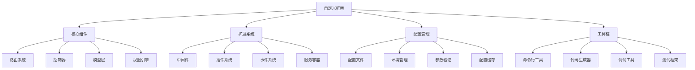

# 自定义框架开发

## 🎯 学习目标
- 理解自定义框架开发的核心概念和架构
- 掌握框架开发的基本流程和设计模式
- 学会实现框架的核心组件和功能
- 了解框架开发的最佳实践和优化策略

## 📚 核心概念

### 自定义框架架构



### 框架核心组件

| 组件 | 描述 | 功能 | 实现要点 |
|------|------|------|----------|
| 路由系统 | 请求路由和分发 | URL解析、路由匹配、参数提取 | 正则匹配、路由缓存、中间件支持 |
| 控制器 | 请求处理逻辑 | 业务逻辑处理、响应生成 | 依赖注入、方法调用、异常处理 |
| 模型层 | 数据访问抽象 | 数据库操作、ORM支持 | 查询构建器、关系映射、事务管理 |
| 视图引擎 | 模板渲染 | 模板解析、变量替换、布局支持 | 模板继承、组件系统、缓存机制 |
| 中间件 | 请求处理管道 | 请求预处理、响应后处理 | 管道模式、优先级控制、条件执行 |
| 服务容器 | 依赖管理 | 服务注册、依赖注入、生命周期管理 | 反射机制、单例模式、工厂模式 |

## 🔧 自定义框架实现

### 基础框架核心
```php
<?php
// 1. 框架核心类
class Framework {
    private array $config = [];
    private Router $router;
    private Container $container;
    private array $middleware = [];
    private array $services = [];
    
    public function __construct(array $config = []) {
        $this->config = array_merge([
            'app_name' => 'Custom Framework',
            'app_env' => 'development',
            'app_debug' => true,
            'base_path' => __DIR__,
            'config_path' => __DIR__ . '/config',
            'routes_path' => __DIR__ . '/routes',
            'views_path' => __DIR__ . '/views',
            'cache_path' => __DIR__ . '/cache'
        ], $config);
        
        $this->initializeComponents();
    }
    
    // 初始化组件
    private function initializeComponents(): void {
        $this->container = new Container();
        $this->router = new Router();
        
        // 注册核心服务
        $this->container->singleton('config', function() {
            return new Config($this->config);
        });
        
        $this->container->singleton('router', function() {
            return $this->router;
        });
        
        $this->container->singleton('view', function() {
            return new ViewEngine($this->config['views_path']);
        });
        
        $this->container->singleton('database', function() {
            return new Database($this->config['database'] ?? []);
        });
    }
    
    // 运行框架
    public function run(): void {
        try {
            $request = Request::createFromGlobals();
            $response = $this->handleRequest($request);
            $response->send();
        } catch (Exception $e) {
            $this->handleException($e);
        }
    }
    
    // 处理请求
    private function handleRequest(Request $request): Response {
        // 执行全局中间件
        $request = $this->executeMiddleware($request, 'global');
        
        // 路由匹配
        $route = $this->router->match($request);
        
        if (!$route) {
            return new Response('Not Found', 404);
        }
        
        // 执行路由中间件
        $request = $this->executeMiddleware($request, $route->getMiddleware());
        
        // 执行控制器
        $response = $this->executeController($route, $request);
        
        // 执行响应中间件
        $response = $this->executeResponseMiddleware($response, 'global');
        
        return $response;
    }
    
    // 执行中间件
    private function executeMiddleware(Request $request, $middleware): Request {
        if (is_string($middleware)) {
            $middleware = [$middleware];
        }
        
        foreach ($middleware as $name) {
            if (isset($this->middleware[$name])) {
                $middlewareInstance = $this->container->make($this->middleware[$name]);
                $request = $middlewareInstance->handle($request);
            }
        }
        
        return $request;
    }
    
    // 执行响应中间件
    private function executeResponseMiddleware(Response $response, $middleware): Response {
        if (is_string($middleware)) {
            $middleware = [$middleware];
        }
        
        foreach ($middleware as $name) {
            if (isset($this->middleware[$name])) {
                $middlewareInstance = $this->container->make($this->middleware[$name]);
                $response = $middlewareInstance->handleResponse($response);
            }
        }
        
        return $response;
    }
    
    // 执行控制器
    private function executeController(Route $route, Request $request): Response {
        $controller = $route->getController();
        $method = $route->getMethod();
        $parameters = $route->getParameters();
        
        $controllerInstance = $this->container->make($controller);
        
        if (!method_exists($controllerInstance, $method)) {
            throw new Exception("Method {$method} not found in controller {$controller}");
        }
        
        return $controllerInstance->$method($request, ...$parameters);
    }
    
    // 注册中间件
    public function middleware(string $name, string $class): void {
        $this->middleware[$name] = $class;
    }
    
    // 注册服务
    public function service(string $name, $service): void {
        $this->container->bind($name, $service);
    }
    
    // 获取服务
    public function get(string $name) {
        return $this->container->get($name);
    }
    
    // 处理异常
    private function handleException(Exception $e): void {
        if ($this->config['app_debug']) {
            echo "Error: " . $e->getMessage() . "\n";
            echo "File: " . $e->getFile() . ":" . $e->getLine() . "\n";
            echo "Trace:\n" . $e->getTraceAsString() . "\n";
        } else {
            echo "Internal Server Error";
        }
    }
}

// 2. 路由系统
class Router {
    private array $routes = [];
    private array $namedRoutes = [];
    
    // 添加路由
    public function add(string $method, string $path, $handler, array $options = []): Route {
        $route = new Route($method, $path, $handler, $options);
        $this->routes[] = $route;
        
        if (isset($options['name'])) {
            $this->namedRoutes[$options['name']] = $route;
        }
        
        return $route;
    }
    
    // GET路由
    public function get(string $path, $handler, array $options = []): Route {
        return $this->add('GET', $path, $handler, $options);
    }
    
    // POST路由
    public function post(string $path, $handler, array $options = []): Route {
        return $this->add('POST', $path, $handler, $options);
    }
    
    // PUT路由
    public function put(string $path, $handler, array $options = []): Route {
        return $this->add('PUT', $path, $handler, $options);
    }
    
    // DELETE路由
    public function delete(string $path, $handler, array $options = []): Route {
        return $this->add('DELETE', $path, $handler, $options);
    }
    
    // 匹配路由
    public function match(Request $request): ?Route {
        $method = $request->getMethod();
        $path = $request->getPath();
        
        foreach ($this->routes as $route) {
            if ($route->matches($method, $path)) {
                return $route;
            }
        }
        
        return null;
    }
    
    // 生成URL
    public function url(string $name, array $parameters = []): string {
        if (!isset($this->namedRoutes[$name])) {
            throw new Exception("Route '{$name}' not found");
        }
        
        return $this->namedRoutes[$name]->url($parameters);
    }
}

// 3. 路由类
class Route {
    private string $method;
    private string $path;
    private $handler;
    private array $options;
    private array $parameters = [];
    
    public function __construct(string $method, string $path, $handler, array $options = []) {
        $this->method = $method;
        $this->path = $path;
        $this->handler = $handler;
        $this->options = $options;
    }
    
    // 匹配路由
    public function matches(string $method, string $path): bool {
        if ($this->method !== $method) {
            return false;
        }
        
        $pattern = $this->path;
        $pattern = preg_replace('/\{([^}]+)\}/', '([^/]+)', $pattern);
        $pattern = '#^' . $pattern . '$#';
        
        if (preg_match($pattern, $path, $matches)) {
            array_shift($matches);
            $this->parameters = $matches;
            return true;
        }
        
        return false;
    }
    
    // 获取控制器
    public function getController(): string {
        if (is_string($this->handler)) {
            return explode('@', $this->handler)[0];
        }
        
        throw new Exception("Invalid controller handler");
    }
    
    // 获取方法
    public function getMethod(): string {
        if (is_string($this->handler)) {
            return explode('@', $this->handler)[1] ?? 'index';
        }
        
        throw new Exception("Invalid method handler");
    }
    
    // 获取参数
    public function getParameters(): array {
        return $this->parameters;
    }
    
    // 获取中间件
    public function getMiddleware(): array {
        return $this->options['middleware'] ?? [];
    }
    
    // 生成URL
    public function url(array $parameters = []): string {
        $path = $this->path;
        
        foreach ($parameters as $key => $value) {
            $path = str_replace('{' . $key . '}', $value, $path);
        }
        
        return $path;
    }
}

// 4. 服务容器
class Container {
    private array $bindings = [];
    private array $instances = [];
    
    // 绑定服务
    public function bind(string $name, $concrete): void {
        $this->bindings[$name] = $concrete;
    }
    
    // 单例绑定
    public function singleton(string $name, $concrete): void {
        $this->bind($name, $concrete);
        $this->instances[$name] = null;
    }
    
    // 获取服务
    public function get(string $name) {
        if (isset($this->instances[$name])) {
            return $this->instances[$name];
        }
        
        if (isset($this->bindings[$name])) {
            $concrete = $this->bindings[$name];
            
            if (is_callable($concrete)) {
                $instance = $concrete();
            } else {
                $instance = $concrete;
            }
            
            if (array_key_exists($name, $this->instances)) {
                $this->instances[$name] = $instance;
            }
            
            return $instance;
        }
        
        throw new Exception("Service '{$name}' not found");
    }
    
    // 创建实例
    public function make(string $class, array $parameters = []) {
        $reflection = new ReflectionClass($class);
        
        if (!$reflection->isInstantiable()) {
            throw new Exception("Class '{$class}' is not instantiable");
        }
        
        $constructor = $reflection->getConstructor();
        
        if (!$constructor) {
            return new $class();
        }
        
        $dependencies = [];
        foreach ($constructor->getParameters() as $parameter) {
            $type = $parameter->getType();
            
            if ($type && !$type->isBuiltin()) {
                $dependencies[] = $this->get($type->getName());
            } elseif (isset($parameters[$parameter->getName()])) {
                $dependencies[] = $parameters[$parameter->getName()];
            } elseif ($parameter->isDefaultValueAvailable()) {
                $dependencies[] = $parameter->getDefaultValue();
            } else {
                throw new Exception("Cannot resolve parameter '{$parameter->getName()}'");
            }
        }
        
        return $reflection->newInstanceArgs($dependencies);
    }
}

// 5. 请求类
class Request {
    private string $method;
    private string $path;
    private array $headers;
    private array $query;
    private array $post;
    private array $files;
    private string $content;
    
    public function __construct(string $method = 'GET', string $path = '/', array $data = []) {
        $this->method = $method;
        $this->path = $path;
        $this->headers = $data['headers'] ?? [];
        $this->query = $data['query'] ?? [];
        $this->post = $data['post'] ?? [];
        $this->files = $data['files'] ?? [];
        $this->content = $data['content'] ?? '';
    }
    
    // 从全局变量创建请求
    public static function createFromGlobals(): self {
        return new self(
            $_SERVER['REQUEST_METHOD'] ?? 'GET',
            $_SERVER['REQUEST_URI'] ?? '/',
            [
                'headers' => getallheaders() ?: [],
                'query' => $_GET,
                'post' => $_POST,
                'files' => $_FILES,
                'content' => file_get_contents('php://input')
            ]
        );
    }
    
    // 获取方法
    public function getMethod(): string {
        return $this->method;
    }
    
    // 获取路径
    public function getPath(): string {
        return parse_url($this->path, PHP_URL_PATH);
    }
    
    // 获取查询参数
    public function getQuery(string $key = null, $default = null) {
        if ($key === null) {
            return $this->query;
        }
        
        return $this->query[$key] ?? $default;
    }
    
    // 获取POST数据
    public function getPost(string $key = null, $default = null) {
        if ($key === null) {
            return $this->post;
        }
        
        return $this->post[$key] ?? $default;
    }
    
    // 获取文件
    public function getFiles(string $key = null) {
        if ($key === null) {
            return $this->files;
        }
        
        return $this->files[$key] ?? null;
    }
    
    // 获取内容
    public function getContent(): string {
        return $this->content;
    }
    
    // 获取头部
    public function getHeader(string $name): ?string {
        return $this->headers[$name] ?? null;
    }
    
    // 是否为AJAX请求
    public function isAjax(): bool {
        return $this->getHeader('X-Requested-With') === 'XMLHttpRequest';
    }
}

// 6. 响应类
class Response {
    private string $content;
    private int $statusCode;
    private array $headers;
    
    public function __construct(string $content = '', int $statusCode = 200, array $headers = []) {
        $this->content = $content;
        $this->statusCode = $statusCode;
        $this->headers = array_merge([
            'Content-Type' => 'text/html; charset=UTF-8'
        ], $headers);
    }
    
    // 发送响应
    public function send(): void {
        http_response_code($this->statusCode);
        
        foreach ($this->headers as $name => $value) {
            header("{$name}: {$value}");
        }
        
        echo $this->content;
    }
    
    // 设置内容
    public function setContent(string $content): void {
        $this->content = $content;
    }
    
    // 获取内容
    public function getContent(): string {
        return $this->content;
    }
    
    // 设置状态码
    public function setStatusCode(int $statusCode): void {
        $this->statusCode = $statusCode;
    }
    
    // 设置头部
    public function setHeader(string $name, string $value): void {
        $this->headers[$name] = $value;
    }
    
    // JSON响应
    public static function json(array $data, int $statusCode = 200): self {
        return new self(
            json_encode($data),
            $statusCode,
            ['Content-Type' => 'application/json']
        );
    }
}

// 使用示例
echo "=== 自定义框架开发示例 ===\n";

try {
    // 创建框架实例
    $app = new Framework([
        'app_name' => 'My Custom Framework',
        'app_debug' => true
    ]);
    
    // 注册中间件
    $app->middleware('cors', CorsMiddleware::class);
    $app->middleware('auth', AuthMiddleware::class);
    
    // 添加路由
    $router = $app->get('router');
    $router->get('/', 'HomeController@index');
    $router->get('/users', 'UserController@index');
    $router->get('/users/{id}', 'UserController@show');
    $router->post('/users', 'UserController@store');
    
    // 注册服务
    $app->service('database', new Database());
    $app->service('view', new ViewEngine());
    
    echo "框架初始化完成\n";
    echo "路由数量: " . count($router->routes) . "\n";
    
} catch (Exception $e) {
    echo "错误: " . $e->getMessage() . "\n";
}
?>
```

## 📊 最佳实践

### 自定义框架开发最佳实践
```php
<?php
// 自定义框架开发最佳实践

class CustomFrameworkBestPractices {
    // 1. 架构设计最佳实践
    public static function getArchitectureBestPractices() {
        return [
            '组件设计' => [
                '单一职责' => '每个组件只负责一个功能',
                '松耦合' => '组件间保持松耦合关系',
                '高内聚' => '组件内部保持高内聚',
                '可扩展' => '设计可扩展的组件接口'
            ],
            '设计模式' => [
                '依赖注入' => '使用依赖注入管理组件依赖',
                '工厂模式' => '使用工厂模式创建对象',
                '观察者模式' => '使用观察者模式处理事件',
                '策略模式' => '使用策略模式实现算法切换'
            ],
            '性能优化' => [
                '延迟加载' => '实现组件的延迟加载',
                '缓存机制' => '实现多级缓存机制',
                '内存管理' => '优化内存使用和释放',
                '并发处理' => '支持并发请求处理'
            ]
        ];
    }
    
    // 2. 开发流程最佳实践
    public static function getDevelopmentProcessBestPractices() {
        return [
            '开发阶段' => [
                '需求分析' => '明确框架需求和功能',
                '架构设计' => '设计清晰的架构和接口',
                '原型开发' => '开发核心功能原型',
                '迭代开发' => '采用迭代开发方式'
            ],
            '测试策略' => [
                '单元测试' => '编写全面的单元测试',
                '集成测试' => '进行组件集成测试',
                '性能测试' => '进行性能基准测试',
                '兼容性测试' => '测试不同环境兼容性'
            ],
            '文档维护' => [
                'API文档' => '维护完整的API文档',
                '使用指南' => '编写详细的使用指南',
                '示例代码' => '提供丰富的示例代码',
                '更新日志' => '维护详细的更新日志'
            ]
        ];
    }
}

// 使用示例
echo "=== 自定义框架开发最佳实践示例 ===\n";

try {
    $architecturePractices = CustomFrameworkBestPractices::getArchitectureBestPractices();
    echo "架构设计最佳实践:\n";
    foreach ($architecturePractices as $category => $practices) {
        echo "  $category:\n";
        foreach ($practices as $practice => $description) {
            echo "    - $practice: $description\n";
        }
        echo "\n";
    }
    
} catch (Exception $e) {
    echo "错误: " . $e->getMessage() . "\n";
}
?>
```

## 🎓 学习建议

### 费曼学习法应用
1. **选择概念**: 选择自定义框架开发中的核心概念
2. **简化解释**: 用简单语言解释框架开发的重要性
3. **识别盲点**: 发现理解不深入的地方
4. **重新学习**: 针对盲点进行深入学习

### 刻意练习重点
1. **架构设计**: 掌握框架架构设计方法
2. **组件开发**: 学会开发框架核心组件
3. **设计模式**: 掌握框架开发中的设计模式
4. **性能优化**: 学会框架性能优化技巧

## 🔗 相关链接
- [[01-Laravel框架|Laravel框架]]
- [[02-Symfony框架|Symfony框架]]
- [[03-CodeIgniter框架|CodeIgniter框架]]
- [[04-框架选择指南|框架选择指南]]
- [[06-框架源码分析|框架源码分析]]
