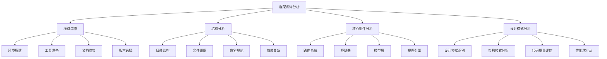

# 框架源码分析

## 🎯 学习目标
- 理解框架源码分析的重要性和方法
- 掌握源码分析的基本技巧和工具
- 学会分析框架的核心架构和设计模式
- 了解源码分析的最佳实践和注意事项

## 📚 核心概念

### 源码分析流程



### 源码分析维度

| 维度 | 描述 | 分析重点 | 工具方法 |
|------|------|----------|----------|
| 架构分析 | 整体架构和设计 | 模块划分、依赖关系、接口设计 | 类图、时序图、架构图 |
| 代码质量 | 代码质量和规范 | 编码规范、复杂度、可读性 | 静态分析、代码审查 |
| 性能分析 | 性能特征和瓶颈 | 算法复杂度、内存使用、执行效率 | 性能测试、代码分析 |
| 安全分析 | 安全机制和漏洞 | 输入验证、权限控制、数据保护 | 安全扫描、代码审计 |
| 扩展性分析 | 扩展性和灵活性 | 插件机制、配置系统、API设计 | 接口分析、扩展点识别 |

## 🔧 框架源码分析实现

### 基础源码分析工具
```php
<?php
// 1. 源码分析器
class SourceCodeAnalyzer {
    private string $frameworkPath;
    private array $config = [];
    private array $analysisResults = [];
    
    public function __construct(string $frameworkPath, array $config = []) {
        $this->frameworkPath = $frameworkPath;
        $this->config = array_merge([
            'exclude_dirs' => ['vendor', 'node_modules', '.git'],
            'include_extensions' => ['php', 'js', 'css', 'html'],
            'max_file_size' => 1024 * 1024, // 1MB
            'analysis_depth' => 'deep'
        ], $config);
    }
    
    // 执行完整分析
    public function analyze(): array {
        $this->analysisResults = [
            'structure' => $this->analyzeStructure(),
            'components' => $this->analyzeComponents(),
            'patterns' => $this->analyzeDesignPatterns(),
            'quality' => $this->analyzeCodeQuality(),
            'performance' => $this->analyzePerformance(),
            'security' => $this->analyzeSecurity()
        ];
        
        return $this->analysisResults;
    }
    
    // 分析目录结构
    private function analyzeStructure(): array {
        $structure = [
            'directories' => [],
            'files' => [],
            'total_files' => 0,
            'total_lines' => 0,
            'total_size' => 0
        ];
        
        $iterator = new RecursiveIteratorIterator(
            new RecursiveDirectoryIterator($this->frameworkPath)
        );
        
        foreach ($iterator as $file) {
            if ($file->isFile() && $this->shouldAnalyzeFile($file)) {
                $relativePath = str_replace($this->frameworkPath . '/', '', $file->getPathname());
                $extension = $file->getExtension();
                
                $structure['files'][] = [
                    'path' => $relativePath,
                    'size' => $file->getSize(),
                    'extension' => $extension,
                    'lines' => $this->countLines($file->getPathname())
                ];
                
                $structure['total_files']++;
                $structure['total_size'] += $file->getSize();
                $structure['total_lines'] += $this->countLines($file->getPathname());
            }
        }
        
        return $structure;
    }
    
    // 分析核心组件
    private function analyzeComponents(): array {
        $components = [
            'routing' => $this->analyzeRoutingSystem(),
            'controller' => $this->analyzeControllerSystem(),
            'model' => $this->analyzeModelSystem(),
            'view' => $this->analyzeViewSystem(),
            'middleware' => $this->analyzeMiddlewareSystem(),
            'container' => $this->analyzeContainerSystem()
        ];
        
        return $components;
    }
    
    // 分析路由系统
    private function analyzeRoutingSystem(): array {
        $routingFiles = $this->findFilesByPattern(['*Router*', '*Route*', '*routing*']);
        $routingAnalysis = [
            'files' => $routingFiles,
            'classes' => [],
            'methods' => [],
            'complexity' => 0
        ];
        
        foreach ($routingFiles as $file) {
            $content = file_get_contents($file);
            $classes = $this->extractClasses($content);
            $methods = $this->extractMethods($content);
            
            $routingAnalysis['classes'] = array_merge($routingAnalysis['classes'], $classes);
            $routingAnalysis['methods'] = array_merge($routingAnalysis['methods'], $methods);
            $routingAnalysis['complexity'] += $this->calculateComplexity($content);
        }
        
        return $routingAnalysis;
    }
    
    // 分析控制器系统
    private function analyzeControllerSystem(): array {
        $controllerFiles = $this->findFilesByPattern(['*Controller*', '*controller*']);
        $controllerAnalysis = [
            'files' => $controllerFiles,
            'classes' => [],
            'methods' => [],
            'inheritance' => [],
            'dependencies' => []
        ];
        
        foreach ($controllerFiles as $file) {
            $content = file_get_contents($file);
            $classes = $this->extractClasses($content);
            $methods = $this->extractMethods($content);
            $inheritance = $this->extractInheritance($content);
            $dependencies = $this->extractDependencies($content);
            
            $controllerAnalysis['classes'] = array_merge($controllerAnalysis['classes'], $classes);
            $controllerAnalysis['methods'] = array_merge($controllerAnalysis['methods'], $methods);
            $controllerAnalysis['inheritance'] = array_merge($controllerAnalysis['inheritance'], $inheritance);
            $controllerAnalysis['dependencies'] = array_merge($controllerAnalysis['dependencies'], $dependencies);
        }
        
        return $controllerAnalysis;
    }
    
    // 分析模型系统
    private function analyzeModelSystem(): array {
        $modelFiles = $this->findFilesByPattern(['*Model*', '*model*', '*Entity*', '*entity*']);
        $modelAnalysis = [
            'files' => $modelFiles,
            'classes' => [],
            'properties' => [],
            'methods' => [],
            'relationships' => []
        ];
        
        foreach ($modelFiles as $file) {
            $content = file_get_contents($file);
            $classes = $this->extractClasses($content);
            $properties = $this->extractProperties($content);
            $methods = $this->extractMethods($content);
            $relationships = $this->extractRelationships($content);
            
            $modelAnalysis['classes'] = array_merge($modelAnalysis['classes'], $classes);
            $modelAnalysis['properties'] = array_merge($modelAnalysis['properties'], $properties);
            $modelAnalysis['methods'] = array_merge($modelAnalysis['methods'], $methods);
            $modelAnalysis['relationships'] = array_merge($modelAnalysis['relationships'], $relationships);
        }
        
        return $modelAnalysis;
    }
    
    // 分析视图系统
    private function analyzeViewSystem(): array {
        $viewFiles = $this->findFilesByPattern(['*View*', '*view*', '*Template*', '*template*']);
        $viewAnalysis = [
            'files' => $viewFiles,
            'classes' => [],
            'methods' => [],
            'templates' => [],
            'engines' => []
        ];
        
        foreach ($viewFiles as $file) {
            $content = file_get_contents($file);
            $classes = $this->extractClasses($content);
            $methods = $this->extractMethods($content);
            $templates = $this->extractTemplates($content);
            $engines = $this->extractEngines($content);
            
            $viewAnalysis['classes'] = array_merge($viewAnalysis['classes'], $classes);
            $viewAnalysis['methods'] = array_merge($viewAnalysis['methods'], $methods);
            $viewAnalysis['templates'] = array_merge($viewAnalysis['templates'], $templates);
            $viewAnalysis['engines'] = array_merge($viewAnalysis['engines'], $engines);
        }
        
        return $viewAnalysis;
    }
    
    // 分析中间件系统
    private function analyzeMiddlewareSystem(): array {
        $middlewareFiles = $this->findFilesByPattern(['*Middleware*', '*middleware*']);
        $middlewareAnalysis = [
            'files' => $middlewareFiles,
            'classes' => [],
            'methods' => [],
            'pipeline' => [],
            'execution_order' => []
        ];
        
        foreach ($middlewareFiles as $file) {
            $content = file_get_contents($file);
            $classes = $this->extractClasses($content);
            $methods = $this->extractMethods($content);
            $pipeline = $this->extractPipeline($content);
            $executionOrder = $this->extractExecutionOrder($content);
            
            $middlewareAnalysis['classes'] = array_merge($middlewareAnalysis['classes'], $classes);
            $middlewareAnalysis['methods'] = array_merge($middlewareAnalysis['methods'], $methods);
            $middlewareAnalysis['pipeline'] = array_merge($middlewareAnalysis['pipeline'], $pipeline);
            $middlewareAnalysis['execution_order'] = array_merge($middlewareAnalysis['execution_order'], $executionOrder);
        }
        
        return $middlewareAnalysis;
    }
    
    // 分析容器系统
    private function analyzeContainerSystem(): array {
        $containerFiles = $this->findFilesByPattern(['*Container*', '*container*', '*Service*', '*service*']);
        $containerAnalysis = [
            'files' => $containerFiles,
            'classes' => [],
            'methods' => [],
            'bindings' => [],
            'resolutions' => []
        ];
        
        foreach ($containerFiles as $file) {
            $content = file_get_contents($file);
            $classes = $this->extractClasses($content);
            $methods = $this->extractMethods($content);
            $bindings = $this->extractBindings($content);
            $resolutions = $this->extractResolutions($content);
            
            $containerAnalysis['classes'] = array_merge($containerAnalysis['classes'], $classes);
            $containerAnalysis['methods'] = array_merge($containerAnalysis['methods'], $methods);
            $containerAnalysis['bindings'] = array_merge($containerAnalysis['bindings'], $bindings);
            $containerAnalysis['resolutions'] = array_merge($containerAnalysis['resolutions'], $resolutions);
        }
        
        return $containerAnalysis;
    }
    
    // 分析设计模式
    private function analyzeDesignPatterns(): array {
        $patterns = [
            'singleton' => $this->analyzeSingletonPattern(),
            'factory' => $this->analyzeFactoryPattern(),
            'observer' => $this->analyzeObserverPattern(),
            'strategy' => $this->analyzeStrategyPattern(),
            'decorator' => $this->analyzeDecoratorPattern(),
            'adapter' => $this->analyzeAdapterPattern()
        ];
        
        return $patterns;
    }
    
    // 分析单例模式
    private function analyzeSingletonPattern(): array {
        $singletonFiles = $this->findFilesByPattern(['*Singleton*', '*singleton*']);
        $singletonAnalysis = [
            'files' => $singletonFiles,
            'classes' => [],
            'instances' => [],
            'usage' => []
        ];
        
        foreach ($singletonFiles as $file) {
            $content = file_get_contents($file);
            $classes = $this->extractSingletonClasses($content);
            $instances = $this->extractSingletonInstances($content);
            $usage = $this->extractSingletonUsage($content);
            
            $singletonAnalysis['classes'] = array_merge($singletonAnalysis['classes'], $classes);
            $singletonAnalysis['instances'] = array_merge($singletonAnalysis['instances'], $instances);
            $singletonAnalysis['usage'] = array_merge($singletonAnalysis['usage'], $usage);
        }
        
        return $singletonAnalysis;
    }
    
    // 分析工厂模式
    private function analyzeFactoryPattern(): array {
        $factoryFiles = $this->findFilesByPattern(['*Factory*', '*factory*']);
        $factoryAnalysis = [
            'files' => $factoryFiles,
            'classes' => [],
            'methods' => [],
            'products' => []
        ];
        
        foreach ($factoryFiles as $file) {
            $content = file_get_contents($file);
            $classes = $this->extractFactoryClasses($content);
            $methods = $this->extractFactoryMethods($content);
            $products = $this->extractFactoryProducts($content);
            
            $factoryAnalysis['classes'] = array_merge($factoryAnalysis['classes'], $classes);
            $factoryAnalysis['methods'] = array_merge($factoryAnalysis['methods'], $methods);
            $factoryAnalysis['products'] = array_merge($factoryAnalysis['products'], $products);
        }
        
        return $factoryAnalysis;
    }
    
    // 分析观察者模式
    private function analyzeObserverPattern(): array {
        $observerFiles = $this->findFilesByPattern(['*Observer*', '*observer*', '*Event*', '*event*']);
        $observerAnalysis = [
            'files' => $observerFiles,
            'classes' => [],
            'events' => [],
            'listeners' => []
        ];
        
        foreach ($observerFiles as $file) {
            $content = file_get_contents($file);
            $classes = $this->extractObserverClasses($content);
            $events = $this->extractEvents($content);
            $listeners = $this->extractListeners($content);
            
            $observerAnalysis['classes'] = array_merge($observerAnalysis['classes'], $classes);
            $observerAnalysis['events'] = array_merge($observerAnalysis['events'], $events);
            $observerAnalysis['listeners'] = array_merge($observerAnalysis['listeners'], $listeners);
        }
        
        return $observerAnalysis;
    }
    
    // 分析策略模式
    private function analyzeStrategyPattern(): array {
        $strategyFiles = $this->findFilesByPattern(['*Strategy*', '*strategy*']);
        $strategyAnalysis = [
            'files' => $strategyFiles,
            'classes' => [],
            'strategies' => [],
            'contexts' => []
        ];
        
        foreach ($strategyFiles as $file) {
            $content = file_get_contents($file);
            $classes = $this->extractStrategyClasses($content);
            $strategies = $this->extractStrategies($content);
            $contexts = $this->extractContexts($content);
            
            $strategyAnalysis['classes'] = array_merge($strategyAnalysis['classes'], $classes);
            $strategyAnalysis['strategies'] = array_merge($strategyAnalysis['strategies'], $strategies);
            $strategyAnalysis['contexts'] = array_merge($strategyAnalysis['contexts'], $contexts);
        }
        
        return $strategyAnalysis;
    }
    
    // 分析装饰器模式
    private function analyzeDecoratorPattern(): array {
        $decoratorFiles = $this->findFilesByPattern(['*Decorator*', '*decorator*']);
        $decoratorAnalysis = [
            'files' => $decoratorFiles,
            'classes' => [],
            'decorators' => [],
            'components' => []
        ];
        
        foreach ($decoratorFiles as $file) {
            $content = file_get_contents($file);
            $classes = $this->extractDecoratorClasses($content);
            $decorators = $this->extractDecorators($content);
            $components = $this->extractComponents($content);
            
            $decoratorAnalysis['classes'] = array_merge($decoratorAnalysis['classes'], $classes);
            $decoratorAnalysis['decorators'] = array_merge($decoratorAnalysis['decorators'], $decorators);
            $decoratorAnalysis['components'] = array_merge($decoratorAnalysis['components'], $components);
        }
        
        return $decoratorAnalysis;
    }
    
    // 分析适配器模式
    private function analyzeAdapterPattern(): array {
        $adapterFiles = $this->findFilesByPattern(['*Adapter*', '*adapter*']);
        $adapterAnalysis = [
            'files' => $adapterFiles,
            'classes' => [],
            'adapters' => [],
            'targets' => []
        ];
        
        foreach ($adapterFiles as $file) {
            $content = file_get_contents($file);
            $classes = $this->extractAdapterClasses($content);
            $adapters = $this->extractAdapters($content);
            $targets = $this->extractTargets($content);
            
            $adapterAnalysis['classes'] = array_merge($adapterAnalysis['classes'], $classes);
            $adapterAnalysis['adapters'] = array_merge($adapterAnalysis['adapters'], $adapters);
            $adapterAnalysis['targets'] = array_merge($adapterAnalysis['targets'], $targets);
        }
        
        return $adapterAnalysis;
    }
    
    // 分析代码质量
    private function analyzeCodeQuality(): array {
        $qualityAnalysis = [
            'complexity' => $this->analyzeComplexity(),
            'duplication' => $this->analyzeDuplication(),
            'maintainability' => $this->analyzeMaintainability(),
            'readability' => $this->analyzeReadability(),
            'testability' => $this->analyzeTestability()
        ];
        
        return $qualityAnalysis;
    }
    
    // 分析复杂度
    private function analyzeComplexity(): array {
        $complexityAnalysis = [
            'cyclomatic' => [],
            'cognitive' => [],
            'nested' => [],
            'overall' => 0
        ];
        
        $phpFiles = $this->findFilesByExtension('php');
        
        foreach ($phpFiles as $file) {
            $content = file_get_contents($file);
            $cyclomatic = $this->calculateCyclomaticComplexity($content);
            $cognitive = $this->calculateCognitiveComplexity($content);
            $nested = $this->calculateNestedComplexity($content);
            
            $complexityAnalysis['cyclomatic'][$file] = $cyclomatic;
            $complexityAnalysis['cognitive'][$file] = $cognitive;
            $complexityAnalysis['nested'][$file] = $nested;
            $complexityAnalysis['overall'] += $cyclomatic + $cognitive + $nested;
        }
        
        return $complexityAnalysis;
    }
    
    // 分析重复代码
    private function analyzeDuplication(): array {
        $duplicationAnalysis = [
            'duplicated_lines' => 0,
            'duplicated_blocks' => [],
            'similarity_threshold' => 0.8
        ];
        
        $phpFiles = $this->findFilesByExtension('php');
        
        for ($i = 0; $i < count($phpFiles); $i++) {
            for ($j = $i + 1; $j < count($phpFiles); $j++) {
                $similarity = $this->calculateSimilarity($phpFiles[$i], $phpFiles[$j]);
                
                if ($similarity > $duplicationAnalysis['similarity_threshold']) {
                    $duplicationAnalysis['duplicated_blocks'][] = [
                        'file1' => $phpFiles[$i],
                        'file2' => $phpFiles[$j],
                        'similarity' => $similarity
                    ];
                }
            }
        }
        
        return $duplicationAnalysis;
    }
    
    // 分析可维护性
    private function analyzeMaintainability(): array {
        $maintainabilityAnalysis = [
            'coupling' => $this->analyzeCoupling(),
            'cohesion' => $this->analyzeCohesion(),
            'dependencies' => $this->analyzeDependencies(),
            'interfaces' => $this->analyzeInterfaces()
        ];
        
        return $maintainabilityAnalysis;
    }
    
    // 分析可读性
    private function analyzeReadability(): array {
        $readabilityAnalysis = [
            'naming' => $this->analyzeNaming(),
            'comments' => $this->analyzeComments(),
            'structure' => $this->analyzeStructure(),
            'formatting' => $this->analyzeFormatting()
        ];
        
        return $readabilityAnalysis;
    }
    
    // 分析可测试性
    private function analyzeTestability(): array {
        $testabilityAnalysis = [
            'dependencies' => $this->analyzeTestDependencies(),
            'isolation' => $this->analyzeIsolation(),
            'mocking' => $this->analyzeMocking(),
            'coverage' => $this->analyzeCoverage()
        ];
        
        return $testabilityAnalysis;
    }
    
    // 分析性能
    private function analyzePerformance(): array {
        $performanceAnalysis = [
            'algorithms' => $this->analyzeAlgorithms(),
            'memory_usage' => $this->analyzeMemoryUsage(),
            'execution_time' => $this->analyzeExecutionTime(),
            'bottlenecks' => $this->analyzeBottlenecks()
        ];
        
        return $performanceAnalysis;
    }
    
    // 分析安全
    private function analyzeSecurity(): array {
        $securityAnalysis = [
            'vulnerabilities' => $this->analyzeVulnerabilities(),
            'input_validation' => $this->analyzeInputValidation(),
            'authentication' => $this->analyzeAuthentication(),
            'authorization' => $this->analyzeAuthorization()
        ];
        
        return $securityAnalysis;
    }
    
    // 辅助方法
    private function shouldAnalyzeFile(SplFileInfo $file): bool {
        $extension = $file->getExtension();
        $size = $file->getSize();
        $path = $file->getPathname();
        
        // 检查扩展名
        if (!in_array($extension, $this->config['include_extensions'])) {
            return false;
        }
        
        // 检查文件大小
        if ($size > $this->config['max_file_size']) {
            return false;
        }
        
        // 检查排除目录
        foreach ($this->config['exclude_dirs'] as $excludeDir) {
            if (strpos($path, $excludeDir) !== false) {
                return false;
            }
        }
        
        return true;
    }
    
    private function countLines(string $filePath): int {
        $content = file_get_contents($filePath);
        return substr_count($content, "\n") + 1;
    }
    
    private function findFilesByPattern(array $patterns): array {
        $files = [];
        $iterator = new RecursiveIteratorIterator(
            new RecursiveDirectoryIterator($this->frameworkPath)
        );
        
        foreach ($iterator as $file) {
            if ($file->isFile()) {
                $filename = $file->getFilename();
                
                foreach ($patterns as $pattern) {
                    if (fnmatch($pattern, $filename)) {
                        $files[] = $file->getPathname();
                        break;
                    }
                }
            }
        }
        
        return $files;
    }
    
    private function findFilesByExtension(string $extension): array {
        $files = [];
        $iterator = new RecursiveIteratorIterator(
            new RecursiveDirectoryIterator($this->frameworkPath)
        );
        
        foreach ($iterator as $file) {
            if ($file->isFile() && $file->getExtension() === $extension) {
                $files[] = $file->getPathname();
            }
        }
        
        return $files;
    }
    
    // 提取类信息
    private function extractClasses(string $content): array {
        $classes = [];
        preg_match_all('/class\s+(\w+)/', $content, $matches);
        
        foreach ($matches[1] as $class) {
            $classes[] = $class;
        }
        
        return $classes;
    }
    
    // 提取方法信息
    private function extractMethods(string $content): array {
        $methods = [];
        preg_match_all('/function\s+(\w+)/', $content, $matches);
        
        foreach ($matches[1] as $method) {
            $methods[] = $method;
        }
        
        return $methods;
    }
    
    // 提取属性信息
    private function extractProperties(string $content): array {
        $properties = [];
        preg_match_all('/\$(\w+)/', $content, $matches);
        
        foreach ($matches[1] as $property) {
            $properties[] = $property;
        }
        
        return $properties;
    }
    
    // 计算复杂度
    private function calculateComplexity(string $content): int {
        $complexity = 1; // 基础复杂度
        
        // 计算条件语句
        $complexity += substr_count($content, 'if');
        $complexity += substr_count($content, 'elseif');
        $complexity += substr_count($content, 'switch');
        $complexity += substr_count($content, 'case');
        
        // 计算循环语句
        $complexity += substr_count($content, 'for');
        $complexity += substr_count($content, 'while');
        $complexity += substr_count($content, 'foreach');
        
        // 计算逻辑运算符
        $complexity += substr_count($content, '&&');
        $complexity += substr_count($content, '||');
        
        return $complexity;
    }
    
    // 计算相似度
    private function calculateSimilarity(string $file1, string $file2): float {
        $content1 = file_get_contents($file1);
        $content2 = file_get_contents($file2);
        
        $similar = similar_text($content1, $content2, $percent);
        return $percent / 100;
    }
    
    // 获取分析结果
    public function getResults(): array {
        return $this->analysisResults;
    }
    
    // 生成报告
    public function generateReport(): string {
        $report = "# 框架源码分析报告\n\n";
        
        if (isset($this->analysisResults['structure'])) {
            $structure = $this->analysisResults['structure'];
            $report .= "## 结构分析\n\n";
            $report .= "- 总文件数: {$structure['total_files']}\n";
            $report .= "- 总行数: {$structure['total_lines']}\n";
            $report .= "- 总大小: " . number_format($structure['total_size'] / 1024, 2) . " KB\n\n";
        }
        
        if (isset($this->analysisResults['components'])) {
            $components = $this->analysisResults['components'];
            $report .= "## 组件分析\n\n";
            
            foreach ($components as $name => $component) {
                $report .= "### {$name}\n";
                $report .= "- 文件数: " . count($component['files']) . "\n";
                $report .= "- 类数: " . count($component['classes']) . "\n";
                $report .= "- 方法数: " . count($component['methods']) . "\n\n";
            }
        }
        
        if (isset($this->analysisResults['patterns'])) {
            $patterns = $this->analysisResults['patterns'];
            $report .= "## 设计模式分析\n\n";
            
            foreach ($patterns as $name => $pattern) {
                $report .= "### {$name}\n";
                $report .= "- 文件数: " . count($pattern['files']) . "\n";
                $report .= "- 类数: " . count($pattern['classes']) . "\n\n";
            }
        }
        
        return $report;
    }
}

// 使用示例
echo "=== 框架源码分析示例 ===\n";

try {
    // 创建源码分析器
    $analyzer = new SourceCodeAnalyzer('/path/to/framework', [
        'exclude_dirs' => ['vendor', 'node_modules', '.git'],
        'include_extensions' => ['php'],
        'max_file_size' => 1024 * 1024,
        'analysis_depth' => 'deep'
    ]);
    
    // 执行分析
    $results = $analyzer->analyze();
    
    echo "分析完成\n";
    echo "结构分析:\n";
    if (isset($results['structure'])) {
        $structure = $results['structure'];
        echo "  总文件数: {$structure['total_files']}\n";
        echo "  总行数: {$structure['total_lines']}\n";
        echo "  总大小: " . number_format($structure['total_size'] / 1024, 2) . " KB\n";
    }
    
    echo "\n组件分析:\n";
    if (isset($results['components'])) {
        foreach ($results['components'] as $name => $component) {
            echo "  {$name}: " . count($component['files']) . " 个文件\n";
        }
    }
    
    echo "\n设计模式分析:\n";
    if (isset($results['patterns'])) {
        foreach ($results['patterns'] as $name => $pattern) {
            echo "  {$name}: " . count($pattern['files']) . " 个文件\n";
        }
    }
    
    // 生成报告
    $report = $analyzer->generateReport();
    echo "\n报告生成完成\n";
    
} catch (Exception $e) {
    echo "错误: " . $e->getMessage() . "\n";
}
?>
```

## 📊 最佳实践

### 框架源码分析最佳实践
```php
<?php
// 框架源码分析最佳实践

class SourceCodeAnalysisBestPractices {
    // 1. 分析准备最佳实践
    public static function getAnalysisPreparationBestPractices() {
        return [
            '环境准备' => [
                '工具安装' => '安装必要的分析工具和IDE',
                '环境配置' => '配置开发环境和分析环境',
                '版本选择' => '选择稳定的框架版本进行分析',
                '文档收集' => '收集框架文档和参考资料'
            ],
            '分析计划' => [
                '目标设定' => '明确分析目标和重点',
                '范围确定' => '确定分析范围和深度',
                '时间安排' => '制定合理的时间安排',
                '资源分配' => '合理分配分析资源'
            ],
            '工具选择' => [
                '静态分析' => '选择静态代码分析工具',
                '动态分析' => '选择动态分析工具',
                '可视化工具' => '选择代码可视化工具',
                '文档工具' => '选择文档生成工具'
            ]
        ];
    }
    
    // 2. 分析执行最佳实践
    public static function getAnalysisExecutionBestPractices() {
        return [
            '分析方法' => [
                '自顶向下' => '从整体架构开始分析',
                '自底向上' => '从具体实现开始分析',
                '分层分析' => '按层次结构进行分析',
                '模块分析' => '按功能模块进行分析'
            ],
            '分析技巧' => [
                '代码追踪' => '追踪代码执行流程',
                '依赖分析' => '分析组件依赖关系',
                '模式识别' => '识别设计模式和架构模式',
                '质量评估' => '评估代码质量和性能'
            ],
            '记录方法' => [
                '笔记记录' => '记录分析过程和发现',
                '图表绘制' => '绘制架构图和流程图',
                '代码标注' => '标注重要代码和注释',
                '问题记录' => '记录发现的问题和改进点'
            ]
        ];
    }
    
    // 3. 结果应用最佳实践
    public static function getResultApplicationBestPractices() {
        return [
            '知识总结' => [
                '架构理解' => '总结框架架构和设计思想',
                '模式学习' => '学习框架中的设计模式',
                '最佳实践' => '提取框架的最佳实践',
                '经验积累' => '积累源码分析经验'
            ],
            '实践应用' => [
                '项目参考' => '将分析结果应用到项目中',
                '框架选择' => '基于分析结果选择框架',
                '自定义开发' => '参考框架设计自定义解决方案',
                '性能优化' => '应用性能优化技巧'
            ],
            '持续改进' => [
                '定期分析' => '定期分析新版本框架',
                '经验分享' => '分享分析经验和发现',
                '工具改进' => '改进分析工具和方法',
                '知识更新' => '持续更新技术知识'
            ]
        ];
    }
}

// 使用示例
echo "=== 框架源码分析最佳实践示例 ===\n";

try {
    $preparationPractices = SourceCodeAnalysisBestPractices::getAnalysisPreparationBestPractices();
    echo "分析准备最佳实践:\n";
    foreach ($preparationPractices as $category => $practices) {
        echo "  $category:\n";
        foreach ($practices as $practice => $description) {
            echo "    - $practice: $description\n";
        }
        echo "\n";
    }
    
} catch (Exception $e) {
    echo "错误: " . $e->getMessage() . "\n";
}
?>
```

## 🎓 学习建议

### 费曼学习法应用
1. **选择概念**: 选择框架源码分析中的核心概念
2. **简化解释**: 用简单语言解释源码分析的重要性
3. **识别盲点**: 发现理解不深入的地方
4. **重新学习**: 针对盲点进行深入学习

### 刻意练习重点
1. **分析技巧**: 掌握源码分析的基本技巧
2. **工具使用**: 学会使用各种分析工具
3. **模式识别**: 提高设计模式识别能力
4. **架构理解**: 深入理解框架架构设计

## 🔗 相关链接
- [[01-Laravel框架|Laravel框架]]
- [[02-Symfony框架|Symfony框架]]
- [[03-CodeIgniter框架|CodeIgniter框架]]
- [[04-框架选择指南|框架选择指南]]
- [[05-自定义框架开发|自定义框架开发]]
