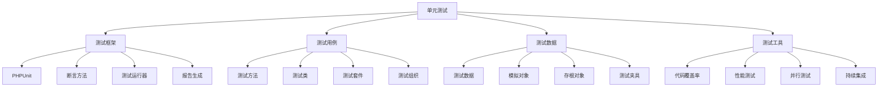

# 单元测试

## 🎯 学习目标
- 理解单元测试的核心概念和重要性
- 掌握PHPUnit单元测试框架的使用
- 学会编写高质量的单元测试用例
- 了解单元测试的最佳实践和设计模式

## 📚 核心概念

### 单元测试架构



### 单元测试类型

| 类型 | 描述 | 测试重点 | 示例 |
|------|------|----------|------|
| 功能测试 | 测试函数功能 | 输入输出、边界条件 | 计算函数、验证函数 |
| 逻辑测试 | 测试业务逻辑 | 条件分支、循环逻辑 | 业务规则、算法逻辑 |
| 异常测试 | 测试异常处理 | 异常抛出、错误处理 | 参数验证、错误处理 |
| 集成测试 | 测试组件集成 | 组件协作、接口调用 | 服务调用、数据库操作 |
| 性能测试 | 测试性能表现 | 执行时间、内存使用 | 算法性能、资源消耗 |

## 🔧 单元测试实现

### 基础单元测试框架
```php
<?php
// 1. 基础测试类
abstract class TestCase {
    protected array $data = [];
    protected array $mocks = [];
    protected array $stubs = [];
    
    // 设置测试环境
    protected function setUp(): void {
        $this->data = [];
        $this->mocks = [];
        $this->stubs = [];
    }
    
    // 清理测试环境
    protected function tearDown(): void {
        $this->data = [];
        $this->mocks = [];
        $this->stubs = [];
    }
    
    // 断言方法
    protected function assertTrue($condition, string $message = ''): void {
        if (!$condition) {
            throw new AssertionException("Assertion failed: " . $message);
        }
    }
    
    protected function assertFalse($condition, string $message = ''): void {
        if ($condition) {
            throw new AssertionException("Assertion failed: " . $message);
        }
    }
    
    protected function assertEquals($expected, $actual, string $message = ''): void {
        if ($expected !== $actual) {
            throw new AssertionException("Expected: " . var_export($expected, true) . 
                                       ", Actual: " . var_export($actual, true) . 
                                       " " . $message);
        }
    }
    
    protected function assertNotEquals($expected, $actual, string $message = ''): void {
        if ($expected === $actual) {
            throw new AssertionException("Values should not be equal: " . $message);
        }
    }
    
    protected function assertNull($value, string $message = ''): void {
        if ($value !== null) {
            throw new AssertionException("Expected null, got: " . var_export($value, true) . " " . $message);
        }
    }
    
    protected function assertNotNull($value, string $message = ''): void {
        if ($value === null) {
            throw new AssertionException("Expected not null, got null " . $message);
        }
    }
    
    protected function assertArrayHasKey($key, array $array, string $message = ''): void {
        if (!array_key_exists($key, $array)) {
            throw new AssertionException("Array does not have key: " . $key . " " . $message);
        }
    }
    
    protected function assertContains($needle, $haystack, string $message = ''): void {
        if (is_array($haystack)) {
            if (!in_array($needle, $haystack)) {
                throw new AssertionException("Array does not contain: " . var_export($needle, true) . " " . $message);
            }
        } else {
            if (strpos($haystack, $needle) === false) {
                throw new AssertionException("String does not contain: " . $needle . " " . $message);
            }
        }
    }
    
    protected function assertInstanceOf(string $expected, $actual, string $message = ''): void {
        if (!($actual instanceof $expected)) {
            throw new AssertionException("Expected instance of " . $expected . 
                                       ", got " . get_class($actual) . " " . $message);
        }
    }
    
    protected function assertException(callable $callback, string $expectedException = 'Exception'): void {
        $exceptionThrown = false;
        
        try {
            $callback();
        } catch (Exception $e) {
            $exceptionThrown = true;
            if (get_class($e) !== $expectedException) {
                throw new AssertionException("Expected " . $expectedException . 
                                           ", got " . get_class($e));
            }
        }
        
        if (!$exceptionThrown) {
            throw new AssertionException("Expected exception " . $expectedException . " was not thrown");
        }
    }
    
    // 创建模拟对象
    protected function createMock(string $className): MockObject {
        return new MockObject($className);
    }
    
    // 创建存根对象
    protected function createStub(string $className): StubObject {
        return new StubObject($className);
    }
    
    // 设置测试数据
    protected function setTestData(string $key, $value): void {
        $this->data[$key] = $value;
    }
    
    // 获取测试数据
    protected function getTestData(string $key) {
        return $this->data[$key] ?? null;
    }
}

// 2. 模拟对象类
class MockObject {
    private string $className;
    private array $methods = [];
    private array $expectations = [];
    
    public function __construct(string $className) {
        $this->className = $className;
    }
    
    // 设置方法期望
    public function expects($invocation): MethodExpectation {
        $expectation = new MethodExpectation($this);
        $this->expectations[] = $expectation;
        return $expectation;
    }
    
    // 调用方法
    public function __call(string $method, array $args) {
        // 查找匹配的期望
        foreach ($this->expectations as $expectation) {
            if ($expectation->matches($method, $args)) {
                return $expectation->execute($args);
            }
        }
        
        // 如果没有找到期望，返回默认值
        return null;
    }
    
    // 验证所有期望
    public function verify(): void {
        foreach ($this->expectations as $expectation) {
            $expectation->verify();
        }
    }
}

// 3. 方法期望类
class MethodExpectation {
    private MockObject $mock;
    private string $method;
    private array $args;
    private int $times;
    private $returnValue;
    private int $callCount = 0;
    
    public function __construct(MockObject $mock) {
        $this->mock = $mock;
        $this->times = 1;
    }
    
    // 设置方法名
    public function method(string $method): self {
        $this->method = $method;
        return $this;
    }
    
    // 设置参数
    public function with(...$args): self {
        $this->args = $args;
        return $this;
    }
    
    // 设置调用次数
    public function times(int $times): self {
        $this->times = $times;
        return $this;
    }
    
    // 设置返回值
    public function willReturn($value): self {
        $this->returnValue = $value;
        return $this;
    }
    
    // 匹配方法调用
    public function matches(string $method, array $args): bool {
        if ($this->method !== $method) {
            return false;
        }
        
        if (isset($this->args)) {
            if (count($this->args) !== count($args)) {
                return false;
            }
            
            for ($i = 0; $i < count($this->args); $i++) {
                if ($this->args[$i] !== $args[$i]) {
                    return false;
                }
            }
        }
        
        return true;
    }
    
    // 执行方法
    public function execute(array $args) {
        $this->callCount++;
        return $this->returnValue;
    }
    
    // 验证期望
    public function verify(): void {
        if ($this->callCount !== $this->times) {
            throw new AssertionException("Expected method {$this->method} to be called {$this->times} times, " .
                                       "but was called {$this->callCount} times");
        }
    }
}

// 4. 存根对象类
class StubObject {
    private string $className;
    private array $methods = [];
    
    public function __construct(string $className) {
        $this->className = $className;
    }
    
    // 设置方法返回值
    public function method(string $method, $returnValue): self {
        $this->methods[$method] = $returnValue;
        return $this;
    }
    
    // 调用方法
    public function __call(string $method, array $args) {
        if (isset($this->methods[$method])) {
            $returnValue = $this->methods[$method];
            
            if (is_callable($returnValue)) {
                return $returnValue(...$args);
            }
            
            return $returnValue;
        }
        
        return null;
    }
}

// 5. 测试运行器
class TestRunner {
    private array $testClasses = [];
    private array $results = [];
    
    // 添加测试类
    public function addTestClass(string $className): void {
        $this->testClasses[] = $className;
    }
    
    // 运行所有测试
    public function runAll(): TestResult {
        $result = new TestResult();
        
        foreach ($this->testClasses as $className) {
            $classResult = $this->runTestClass($className);
            $result->merge($classResult);
        }
        
        return $result;
    }
    
    // 运行测试类
    private function runTestClass(string $className): TestResult {
        $result = new TestResult();
        $reflection = new ReflectionClass($className);
        $testMethods = $this->getTestMethods($reflection);
        
        foreach ($testMethods as $method) {
            try {
                $this->runTestMethod($reflection, $method);
                $result->addPassed($className . '::' . $method->getName());
            } catch (Exception $e) {
                $result->addFailed($className . '::' . $method->getName(), $e->getMessage());
            }
        }
        
        return $result;
    }
    
    // 运行测试方法
    private function runTestMethod(ReflectionClass $class, ReflectionMethod $method): void {
        $instance = $class->newInstance();
        
        // 调用setUp方法
        if ($class->hasMethod('setUp')) {
            $instance->setUp();
        }
        
        try {
            // 运行测试方法
            $method->invoke($instance);
        } finally {
            // 调用tearDown方法
            if ($class->hasMethod('tearDown')) {
                $instance->tearDown();
            }
        }
    }
    
    // 获取测试方法
    private function getTestMethods(ReflectionClass $class): array {
        $methods = [];
        
        foreach ($class->getMethods() as $method) {
            if (strpos($method->getName(), 'test') === 0) {
                $methods[] = $method;
            }
        }
        
        return $methods;
    }
}

// 6. 测试结果类
class TestResult {
    private array $passed = [];
    private array $failed = [];
    
    // 添加通过的测试
    public function addPassed(string $testName): void {
        $this->passed[] = $testName;
    }
    
    // 添加失败的测试
    public function addFailed(string $testName, string $message): void {
        $this->failed[] = [
            'test' => $testName,
            'message' => $message
        ];
    }
    
    // 合并结果
    public function merge(TestResult $other): void {
        $this->passed = array_merge($this->passed, $other->passed);
        $this->failed = array_merge($this->failed, $other->failed);
    }
    
    // 获取通过的测试数
    public function getPassedCount(): int {
        return count($this->passed);
    }
    
    // 获取失败的测试数
    public function getFailedCount(): int {
        return count($this->failed);
    }
    
    // 获取总测试数
    public function getTotalCount(): int {
        return $this->getPassedCount() + $this->getFailedCount();
    }
    
    // 是否全部通过
    public function isSuccess(): bool {
        return $this->getFailedCount() === 0;
    }
    
    // 生成报告
    public function generateReport(): string {
        $report = "Test Results:\n";
        $report .= "Total: " . $this->getTotalCount() . "\n";
        $report .= "Passed: " . $this->getPassedCount() . "\n";
        $report .= "Failed: " . $this->getFailedCount() . "\n\n";
        
        if (!empty($this->failed)) {
            $report .= "Failed Tests:\n";
            foreach ($this->failed as $failure) {
                $report .= "- " . $failure['test'] . ": " . $failure['message'] . "\n";
            }
        }
        
        return $report;
    }
}

// 7. 断言异常类
class AssertionException extends Exception {
    public function __construct(string $message = '', int $code = 0, Exception $previous = null) {
        parent::__construct($message, $code, $previous);
    }
}

// 8. 示例测试类
class CalculatorTest extends TestCase {
    private Calculator $calculator;
    
    protected function setUp(): void {
        parent::setUp();
        $this->calculator = new Calculator();
    }
    
    public function testAdd(): void {
        $result = $this->calculator->add(2, 3);
        $this->assertEquals(5, $result);
    }
    
    public function testSubtract(): void {
        $result = $this->calculator->subtract(5, 3);
        $this->assertEquals(2, $result);
    }
    
    public function testMultiply(): void {
        $result = $this->calculator->multiply(4, 5);
        $this->assertEquals(20, $result);
    }
    
    public function testDivide(): void {
        $result = $this->calculator->divide(10, 2);
        $this->assertEquals(5, $result);
    }
    
    public function testDivideByZero(): void {
        $this->assertException(function() {
            $this->calculator->divide(10, 0);
        }, 'DivisionByZeroError');
    }
    
    public function testAddWithMock(): void {
        $mock = $this->createMock('Calculator');
        $mock->expects($this->once())
             ->method('add')
             ->with(2, 3)
             ->willReturn(5);
        
        $result = $mock->add(2, 3);
        $this->assertEquals(5, $result);
        $mock->verify();
    }
}

// 9. 示例计算器类
class Calculator {
    public function add(float $a, float $b): float {
        return $a + $b;
    }
    
    public function subtract(float $a, float $b): float {
        return $a - $b;
    }
    
    public function multiply(float $a, float $b): float {
        return $a * $b;
    }
    
    public function divide(float $a, float $b): float {
        if ($b == 0) {
            throw new DivisionByZeroError("Division by zero");
        }
        return $a / $b;
    }
}

// 使用示例
echo "=== 单元测试示例 ===\n";

try {
    // 创建测试运行器
    $runner = new TestRunner();
    $runner->addTestClass('CalculatorTest');
    
    // 运行测试
    $result = $runner->runAll();
    
    // 输出结果
    echo $result->generateReport();
    
    if ($result->isSuccess()) {
        echo "All tests passed!\n";
    } else {
        echo "Some tests failed!\n";
    }
    
} catch (Exception $e) {
    echo "Error: " . $e->getMessage() . "\n";
}
?>
```

## 📊 最佳实践

### 单元测试最佳实践
```php
<?php
// 单元测试最佳实践

class UnitTestBestPractices {
    // 1. 测试设计最佳实践
    public static function getTestDesignBestPractices() {
        return [
            '测试命名' => [
                '描述性命名' => '使用描述性的测试方法名',
                '测试意图' => '测试名应该表达测试意图',
                '命名规范' => '遵循一致的命名规范',
                '避免缩写' => '避免使用缩写和简写'
            ],
            '测试结构' => [
                'AAA模式' => '使用Arrange-Act-Assert模式',
                '单一职责' => '每个测试只测试一个功能',
                '独立性' => '测试之间保持独立',
                '可重复性' => '测试结果应该可重复'
            ],
            '测试数据' => [
                '测试数据' => '使用有意义的测试数据',
                '边界值' => '测试边界值和特殊情况',
                '异常情况' => '测试异常和错误情况',
                '数据隔离' => '确保测试数据隔离'
            ]
        ];
    }
    
    // 2. 测试实现最佳实践
    public static function getTestImplementationBestPractices() {
        return [
            '断言使用' => [
                '具体断言' => '使用具体的断言方法',
                '断言消息' => '提供有意义的断言消息',
                '断言数量' => '控制每个测试的断言数量',
                '断言顺序' => '按照逻辑顺序组织断言'
            ],
            '模拟对象' => [
                '适度使用' => '适度使用模拟对象',
                '接口模拟' => '优先模拟接口而非具体类',
                '行为验证' => '验证对象行为而非实现',
                '模拟清理' => '及时清理模拟对象'
            ],
            '测试组织' => [
                '测试分组' => '按功能分组测试',
                '测试套件' => '使用测试套件组织测试',
                '测试标签' => '使用标签标记测试',
                '测试顺序' => '控制测试执行顺序'
            ]
        ];
    }
    
    // 3. 测试维护最佳实践
    public static function getTestMaintenanceBestPractices() {
        return [
            '测试维护' => [
                '及时更新' => '及时更新测试代码',
                '重构测试' => '定期重构测试代码',
                '删除冗余' => '删除冗余和过时的测试',
                '文档更新' => '更新测试文档和注释'
            ],
            '测试质量' => [
                '代码审查' => '对测试代码进行代码审查',
                '质量指标' => '监控测试质量指标',
                '覆盖率' => '保持适当的测试覆盖率',
                '性能测试' => '监控测试执行性能'
            ],
            '持续改进' => [
                '反馈收集' => '收集测试反馈和建议',
                '工具改进' => '改进测试工具和流程',
                '经验分享' => '分享测试经验和最佳实践',
                '培训提升' => '持续提升测试技能'
            ]
        ];
    }
}

// 使用示例
echo "=== 单元测试最佳实践示例 ===\n";

try {
    $designPractices = UnitTestBestPractices::getTestDesignBestPractices();
    echo "测试设计最佳实践:\n";
    foreach ($designPractices as $category => $practices) {
        echo "  $category:\n";
        foreach ($practices as $practice => $description) {
            echo "    - $practice: $description\n";
        }
        echo "\n";
    }
    
} catch (Exception $e) {
    echo "错误: " . $e->getMessage() . "\n";
}
?>
```

## 🎓 学习建议

### 费曼学习法应用
1. **选择概念**: 选择单元测试中的核心概念
2. **简化解释**: 用简单语言解释单元测试的作用
3. **识别盲点**: 发现理解不深入的地方
4. **重新学习**: 针对盲点进行深入学习

### 刻意练习重点
1. **测试编写**: 掌握单元测试的编写方法
2. **断言使用**: 学会使用各种断言方法
3. **模拟对象**: 掌握模拟对象的使用技巧
4. **测试组织**: 学会组织和维护测试代码

## 🔗 相关链接
- [[02-集成测试|集成测试]]
- [[03-功能测试|功能测试]]
- [[04-TDD开发模式|TDD开发模式]]
- [[05-PHPUnit使用|PHPUnit使用]]
- [[06-测试覆盖率|测试覆盖率]]
- [[07-测试策略规划|测试策略规划]]
