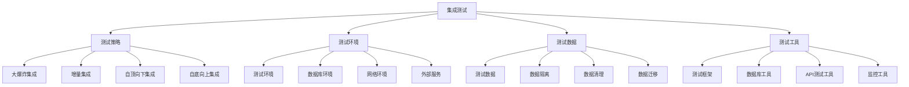

# 集成测试

## 🎯 学习目标
- 理解集成测试的核心概念和重要性
- 掌握集成测试的设计方法和实施策略
- 学会编写高质量的集成测试用例
- 了解集成测试的最佳实践和工具使用

## 📚 核心概念

### 集成测试架构



### 集成测试类型

| 类型 | 描述 | 测试重点 | 示例 |
|------|------|----------|------|
| 组件集成 | 测试组件间协作 | 接口调用、数据传递 | 服务调用、模块集成 |
| 系统集成 | 测试系统间集成 | 系统接口、数据同步 | API集成、数据库集成 |
| 数据库集成 | 测试数据库操作 | 数据持久化、事务处理 | ORM测试、查询测试 |
| API集成 | 测试API接口 | 请求响应、错误处理 | REST API、GraphQL |
| 第三方集成 | 测试第三方服务 | 外部服务调用、数据交换 | 支付接口、邮件服务 |

## 🔧 集成测试实现

### 基础集成测试框架
```php
<?php
// 1. 集成测试基类
abstract class IntegrationTestCase {
    protected array $config = [];
    protected $database;
    protected $httpClient;
    protected array $testData = [];
    
    public function __construct() {
        $this->config = [
            'database' => [
                'host' => 'localhost',
                'database' => 'test_db',
                'username' => 'test_user',
                'password' => 'test_pass'
            ],
            'api' => [
                'base_url' => 'http://localhost:8000',
                'timeout' => 30
            ]
        ];
        
        $this->initializeEnvironment();
    }
    
    // 初始化测试环境
    protected function initializeEnvironment(): void {
        $this->database = new TestDatabase($this->config['database']);
        $this->httpClient = new TestHttpClient($this->config['api']);
    }
    
    // 设置测试环境
    protected function setUp(): void {
        $this->database->beginTransaction();
        $this->loadTestData();
    }
    
    // 清理测试环境
    protected function tearDown(): void {
        $this->database->rollback();
        $this->testData = [];
    }
    
    // 加载测试数据
    protected function loadTestData(): void {
        // 子类实现具体的测试数据加载
    }
    
    // 创建测试用户
    protected function createTestUser(array $data = []): array {
        $userData = array_merge([
            'name' => 'Test User',
            'email' => 'test@example.com',
            'password' => password_hash('password123', PASSWORD_DEFAULT)
        ], $data);
        
        $userId = $this->database->insert('users', $userData);
        $userData['id'] = $userId;
        
        $this->testData['users'][] = $userData;
        return $userData;
    }
    
    // 创建测试订单
    protected function createTestOrder(array $data = []): array {
        $orderData = array_merge([
            'user_id' => 1,
            'total' => 100.00,
            'status' => 'pending'
        ], $data);
        
        $orderId = $this->database->insert('orders', $orderData);
        $orderData['id'] = $orderId;
        
        $this->testData['orders'][] = $orderData;
        return $orderData;
    }
    
    // 发送HTTP请求
    protected function makeRequest(string $method, string $url, array $data = [], array $headers = []): array {
        return $this->httpClient->request($method, $url, $data, $headers);
    }
    
    // 断言HTTP响应
    protected function assertHttpResponse(array $response, int $expectedStatus, array $expectedData = []): void {
        if ($response['status'] !== $expectedStatus) {
            throw new AssertionException("Expected status {$expectedStatus}, got {$response['status']}");
        }
        
        if (!empty($expectedData)) {
            $actualData = json_decode($response['body'], true);
            foreach ($expectedData as $key => $value) {
                if (!isset($actualData[$key]) || $actualData[$key] !== $value) {
                    throw new AssertionException("Expected {$key} to be " . var_export($value, true) . 
                                               ", got " . var_export($actualData[$key] ?? null, true));
                }
            }
        }
    }
    
    // 断言数据库记录
    protected function assertDatabaseHas(string $table, array $conditions): void {
        $record = $this->database->find($table, $conditions);
        if (!$record) {
            throw new AssertionException("Record not found in table {$table} with conditions: " . 
                                       json_encode($conditions));
        }
    }
    
    // 断言数据库记录不存在
    protected function assertDatabaseMissing(string $table, array $conditions): void {
        $record = $this->database->find($table, $conditions);
        if ($record) {
            throw new AssertionException("Record found in table {$table} with conditions: " . 
                                       json_encode($conditions));
        }
    }
}

// 2. 测试数据库类
class TestDatabase {
    private PDO $connection;
    private array $transactions = [];
    
    public function __construct(array $config) {
        $dsn = "mysql:host={$config['host']};dbname={$config['database']};charset=utf8mb4";
        $this->connection = new PDO($dsn, $config['username'], $config['password'], [
            PDO::ATTR_ERRMODE => PDO::ERRMODE_EXCEPTION,
            PDO::ATTR_DEFAULT_FETCH_MODE => PDO::FETCH_ASSOC
        ]);
    }
    
    // 开始事务
    public function beginTransaction(): void {
        $this->connection->beginTransaction();
        $this->transactions[] = true;
    }
    
    // 提交事务
    public function commit(): void {
        if (!empty($this->transactions)) {
            $this->connection->commit();
            array_pop($this->transactions);
        }
    }
    
    // 回滚事务
    public function rollback(): void {
        if (!empty($this->transactions)) {
            $this->connection->rollBack();
            array_pop($this->transactions);
        }
    }
    
    // 插入记录
    public function insert(string $table, array $data): int {
        $columns = array_keys($data);
        $values = array_values($data);
        $placeholders = str_repeat('?,', count($values) - 1) . '?';
        
        $sql = "INSERT INTO {$table} (" . implode(',', $columns) . ") VALUES ({$placeholders})";
        $stmt = $this->connection->prepare($sql);
        $stmt->execute($values);
        
        return $this->connection->lastInsertId();
    }
    
    // 查找记录
    public function find(string $table, array $conditions): ?array {
        $whereClause = '';
        $values = [];
        
        if (!empty($conditions)) {
            $whereParts = [];
            foreach ($conditions as $column => $value) {
                $whereParts[] = "{$column} = ?";
                $values[] = $value;
            }
            $whereClause = 'WHERE ' . implode(' AND ', $whereParts);
        }
        
        $sql = "SELECT * FROM {$table} {$whereClause} LIMIT 1";
        $stmt = $this->connection->prepare($sql);
        $stmt->execute($values);
        
        $result = $stmt->fetch();
        return $result ?: null;
    }
    
    // 更新记录
    public function update(string $table, array $data, array $conditions): int {
        $setParts = [];
        $values = [];
        
        foreach ($data as $column => $value) {
            $setParts[] = "{$column} = ?";
            $values[] = $value;
        }
        
        $whereParts = [];
        foreach ($conditions as $column => $value) {
            $whereParts[] = "{$column} = ?";
            $values[] = $value;
        }
        
        $sql = "UPDATE {$table} SET " . implode(', ', $setParts) . 
               " WHERE " . implode(' AND ', $whereParts);
        $stmt = $this->connection->prepare($sql);
        $stmt->execute($values);
        
        return $stmt->rowCount();
    }
    
    // 删除记录
    public function delete(string $table, array $conditions): int {
        $whereParts = [];
        $values = [];
        
        foreach ($conditions as $column => $value) {
            $whereParts[] = "{$column} = ?";
            $values[] = $value;
        }
        
        $sql = "DELETE FROM {$table} WHERE " . implode(' AND ', $whereParts);
        $stmt = $this->connection->prepare($sql);
        $stmt->execute($values);
        
        return $stmt->rowCount();
    }
    
    // 执行查询
    public function query(string $sql, array $params = []): array {
        $stmt = $this->connection->prepare($sql);
        $stmt->execute($params);
        return $stmt->fetchAll();
    }
    
    // 清理表
    public function truncate(string $table): void {
        $this->connection->exec("TRUNCATE TABLE {$table}");
    }
    
    // 清理所有表
    public function truncateAll(): void {
        $tables = $this->query("SHOW TABLES");
        foreach ($tables as $table) {
            $tableName = array_values($table)[0];
            $this->truncate($tableName);
        }
    }
}

// 3. 测试HTTP客户端
class TestHttpClient {
    private array $config;
    private array $cookies = [];
    
    public function __construct(array $config) {
        $this->config = $config;
    }
    
    // 发送HTTP请求
    public function request(string $method, string $url, array $data = [], array $headers = []): array {
        $fullUrl = $this->config['base_url'] . $url;
        
        $ch = curl_init();
        curl_setopt_array($ch, [
            CURLOPT_URL => $fullUrl,
            CURLOPT_RETURNTRANSFER => true,
            CURLOPT_TIMEOUT => $this->config['timeout'],
            CURLOPT_CUSTOMREQUEST => $method,
            CURLOPT_HTTPHEADER => $this->buildHeaders($headers),
            CURLOPT_COOKIE => $this->buildCookies()
        ]);
        
        if (in_array($method, ['POST', 'PUT', 'PATCH'])) {
            curl_setopt($ch, CURLOPT_POSTFIELDS, json_encode($data));
        }
        
        $response = curl_exec($ch);
        $status = curl_getinfo($ch, CURLINFO_HTTP_CODE);
        $error = curl_error($ch);
        curl_close($ch);
        
        if ($error) {
            throw new Exception("HTTP request failed: {$error}");
        }
        
        // 保存cookies
        $this->saveCookies($response);
        
        return [
            'status' => $status,
            'body' => $response,
            'headers' => $this->extractHeaders($response)
        ];
    }
    
    // 构建请求头
    private function buildHeaders(array $headers): array {
        $defaultHeaders = [
            'Content-Type: application/json',
            'Accept: application/json'
        ];
        
        $builtHeaders = [];
        foreach ($defaultHeaders as $header) {
            $builtHeaders[] = $header;
        }
        
        foreach ($headers as $name => $value) {
            $builtHeaders[] = "{$name}: {$value}";
        }
        
        return $builtHeaders;
    }
    
    // 构建cookies
    private function buildCookies(): string {
        $cookies = [];
        foreach ($this->cookies as $name => $value) {
            $cookies[] = "{$name}={$value}";
        }
        return implode('; ', $cookies);
    }
    
    // 保存cookies
    private function saveCookies(string $response): void {
        // 简化的cookie处理
        if (preg_match_all('/Set-Cookie:\s*([^;]+)/', $response, $matches)) {
            foreach ($matches[1] as $cookie) {
                list($name, $value) = explode('=', $cookie, 2);
                $this->cookies[trim($name)] = trim($value);
            }
        }
    }
    
    // 提取响应头
    private function extractHeaders(string $response): array {
        $headers = [];
        $lines = explode("\n", $response);
        
        foreach ($lines as $line) {
            if (strpos($line, ':') !== false) {
                list($name, $value) = explode(':', $line, 2);
                $headers[trim($name)] = trim($value);
            }
        }
        
        return $headers;
    }
    
    // 设置认证
    public function setAuth(string $token): void {
        $this->cookies['auth_token'] = $token;
    }
    
    // 清除认证
    public function clearAuth(): void {
        unset($this->cookies['auth_token']);
    }
}

// 4. 用户集成测试
class UserIntegrationTest extends IntegrationTestCase {
    protected function loadTestData(): void {
        // 加载用户测试数据
        $this->createTestUser(['name' => 'John Doe', 'email' => 'john@example.com']);
        $this->createTestUser(['name' => 'Jane Smith', 'email' => 'jane@example.com']);
    }
    
    public function testUserRegistration(): void {
        $userData = [
            'name' => 'New User',
            'email' => 'newuser@example.com',
            'password' => 'password123'
        ];
        
        $response = $this->makeRequest('POST', '/api/users', $userData);
        
        $this->assertHttpResponse($response, 201, [
            'name' => 'New User',
            'email' => 'newuser@example.com'
        ]);
        
        $this->assertDatabaseHas('users', [
            'name' => 'New User',
            'email' => 'newuser@example.com'
        ]);
    }
    
    public function testUserLogin(): void {
        $loginData = [
            'email' => 'john@example.com',
            'password' => 'password123'
        ];
        
        $response = $this->makeRequest('POST', '/api/auth/login', $loginData);
        
        $this->assertHttpResponse($response, 200);
        
        $responseData = json_decode($response['body'], true);
        $this->assertNotNull($responseData['token']);
    }
    
    public function testGetUserProfile(): void {
        // 先登录获取token
        $loginResponse = $this->makeRequest('POST', '/api/auth/login', [
            'email' => 'john@example.com',
            'password' => 'password123'
        ]);
        
        $loginData = json_decode($loginResponse['body'], true);
        $token = $loginData['token'];
        
        // 使用token获取用户信息
        $response = $this->makeRequest('GET', '/api/users/profile', [], [
            'Authorization' => "Bearer {$token}"
        ]);
        
        $this->assertHttpResponse($response, 200, [
            'name' => 'John Doe',
            'email' => 'john@example.com'
        ]);
    }
    
    public function testUpdateUserProfile(): void {
        // 先登录获取token
        $loginResponse = $this->makeRequest('POST', '/api/auth/login', [
            'email' => 'john@example.com',
            'password' => 'password123'
        ]);
        
        $loginData = json_decode($loginResponse['body'], true);
        $token = $loginData['token'];
        
        // 更新用户信息
        $updateData = [
            'name' => 'John Updated',
            'email' => 'john.updated@example.com'
        ];
        
        $response = $this->makeRequest('PUT', '/api/users/profile', $updateData, [
            'Authorization' => "Bearer {$token}"
        ]);
        
        $this->assertHttpResponse($response, 200);
        
        $this->assertDatabaseHas('users', [
            'name' => 'John Updated',
            'email' => 'john.updated@example.com'
        ]);
    }
}

// 5. 订单集成测试
class OrderIntegrationTest extends IntegrationTestCase {
    protected function loadTestData(): void {
        // 加载订单测试数据
        $user = $this->createTestUser(['name' => 'Order User', 'email' => 'order@example.com']);
        $this->createTestOrder(['user_id' => $user['id'], 'total' => 150.00]);
        $this->createTestOrder(['user_id' => $user['id'], 'total' => 200.00, 'status' => 'completed']);
    }
    
    public function testCreateOrder(): void {
        $user = $this->createTestUser(['name' => 'New Order User', 'email' => 'neworder@example.com']);
        
        $orderData = [
            'user_id' => $user['id'],
            'items' => [
                ['product_id' => 1, 'quantity' => 2, 'price' => 50.00],
                ['product_id' => 2, 'quantity' => 1, 'price' => 30.00]
            ],
            'total' => 130.00
        ];
        
        $response = $this->makeRequest('POST', '/api/orders', $orderData);
        
        $this->assertHttpResponse($response, 201);
        
        $responseData = json_decode($response['body'], true);
        $this->assertNotNull($responseData['id']);
        
        $this->assertDatabaseHas('orders', [
            'user_id' => $user['id'],
            'total' => 130.00,
            'status' => 'pending'
        ]);
    }
    
    public function testGetUserOrders(): void {
        $user = $this->testData['users'][0];
        
        $response = $this->makeRequest('GET', "/api/users/{$user['id']}/orders");
        
        $this->assertHttpResponse($response, 200);
        
        $responseData = json_decode($response['body'], true);
        $this->assertCount(2, $responseData['orders']);
    }
    
    public function testUpdateOrderStatus(): void {
        $order = $this->testData['orders'][0];
        
        $updateData = [
            'status' => 'shipped'
        ];
        
        $response = $this->makeRequest('PUT', "/api/orders/{$order['id']}", $updateData);
        
        $this->assertHttpResponse($response, 200);
        
        $this->assertDatabaseHas('orders', [
            'id' => $order['id'],
            'status' => 'shipped'
        ]);
    }
}

// 6. 数据库集成测试
class DatabaseIntegrationTest extends IntegrationTestCase {
    public function testDatabaseTransaction(): void {
        $this->database->beginTransaction();
        
        try {
            $userId = $this->database->insert('users', [
                'name' => 'Transaction User',
                'email' => 'transaction@example.com'
            ]);
            
            $orderId = $this->database->insert('orders', [
                'user_id' => $userId,
                'total' => 100.00,
                'status' => 'pending'
            ]);
            
            $this->assertDatabaseHas('users', ['id' => $userId]);
            $this->assertDatabaseHas('orders', ['id' => $orderId]);
            
            $this->database->commit();
            
        } catch (Exception $e) {
            $this->database->rollback();
            throw $e;
        }
    }
    
    public function testDatabaseRollback(): void {
        $this->database->beginTransaction();
        
        $userId = $this->database->insert('users', [
            'name' => 'Rollback User',
            'email' => 'rollback@example.com'
        ]);
        
        $this->assertDatabaseHas('users', ['id' => $userId]);
        
        $this->database->rollback();
        
        $this->assertDatabaseMissing('users', ['id' => $userId]);
    }
    
    public function testDatabaseConstraints(): void {
        // 测试外键约束
        $this->assertException(function() {
            $this->database->insert('orders', [
                'user_id' => 99999, // 不存在的用户ID
                'total' => 100.00,
                'status' => 'pending'
            ]);
        });
    }
}

// 使用示例
echo "=== 集成测试示例 ===\n";

try {
    // 创建集成测试运行器
    $runner = new TestRunner();
    $runner->addTestClass('UserIntegrationTest');
    $runner->addTestClass('OrderIntegrationTest');
    $runner->addTestClass('DatabaseIntegrationTest');
    
    // 运行测试
    $result = $runner->runAll();
    
    // 输出结果
    echo $result->generateReport();
    
    if ($result->isSuccess()) {
        echo "All integration tests passed!\n";
    } else {
        echo "Some integration tests failed!\n";
    }
    
} catch (Exception $e) {
    echo "Error: " . $e->getMessage() . "\n";
}
?>
```

## 📊 最佳实践

### 集成测试最佳实践
```php
<?php
// 集成测试最佳实践

class IntegrationTestBestPractices {
    // 1. 测试环境最佳实践
    public static function getTestEnvironmentBestPractices() {
        return [
            '环境隔离' => [
                '独立环境' => '使用独立的测试环境',
                '数据隔离' => '确保测试数据隔离',
                '服务隔离' => '隔离外部服务依赖',
                '配置隔离' => '使用独立的配置文件'
            ],
            '环境管理' => [
                '环境准备' => '自动化环境准备和清理',
                '数据管理' => '管理测试数据的生命周期',
                '服务管理' => '管理测试服务的启动和停止',
                '监控管理' => '监控测试环境状态'
            ],
            '环境优化' => [
                '性能优化' => '优化测试环境性能',
                '资源管理' => '合理管理测试资源',
                '并行执行' => '支持并行测试执行',
                '缓存策略' => '实现测试环境缓存'
            ]
        ];
    }
    
    // 2. 测试设计最佳实践
    public static function getTestDesignBestPractices() {
        return [
            '测试策略' => [
                '测试范围' => '明确集成测试的范围',
                '测试层次' => '设计合理的测试层次',
                '测试优先级' => '确定测试优先级',
                '测试覆盖' => '确保测试覆盖关键路径'
            ],
            '测试数据' => [
                '数据设计' => '设计有意义的测试数据',
                '数据管理' => '管理测试数据的创建和清理',
                '数据隔离' => '确保测试数据隔离',
                '数据一致性' => '保持测试数据一致性'
            ],
            '测试组织' => [
                '测试分组' => '按功能模块分组测试',
                '测试依赖' => '管理测试间的依赖关系',
                '测试顺序' => '控制测试执行顺序',
                '测试并行' => '支持测试并行执行'
            ]
        ];
    }
    
    // 3. 测试实施最佳实践
    public static function getTestImplementationBestPractices() {
        return [
            '测试执行' => [
                '执行策略' => '制定合理的测试执行策略',
                '执行监控' => '监控测试执行过程',
                '执行优化' => '优化测试执行性能',
                '执行报告' => '生成详细的执行报告'
            ],
            '错误处理' => [
                '错误捕获' => '捕获和处理测试错误',
                '错误分析' => '分析测试错误原因',
                '错误修复' => '及时修复测试错误',
                '错误预防' => '预防测试错误发生'
            ],
            '持续改进' => [
                '反馈收集' => '收集测试反馈和建议',
                '流程优化' => '优化测试流程和方法',
                '工具改进' => '改进测试工具和框架',
                '经验分享' => '分享测试经验和最佳实践'
            ]
        ];
    }
}

// 使用示例
echo "=== 集成测试最佳实践示例 ===\n";

try {
    $environmentPractices = IntegrationTestBestPractices::getTestEnvironmentBestPractices();
    echo "测试环境最佳实践:\n";
    foreach ($environmentPractices as $category => $practices) {
        echo "  $category:\n";
        foreach ($practices as $practice => $description) {
            echo "    - $practice: $description\n";
        }
        echo "\n";
    }
    
} catch (Exception $e) {
    echo "错误: " . $e->getMessage() . "\n";
}
?>
```

## 🎓 学习建议

### 费曼学习法应用
1. **选择概念**: 选择集成测试中的核心概念
2. **简化解释**: 用简单语言解释集成测试的作用
3. **识别盲点**: 发现理解不深入的地方
4. **重新学习**: 针对盲点进行深入学习

### 刻意练习重点
1. **测试设计**: 掌握集成测试的设计方法
2. **环境管理**: 学会管理测试环境
3. **数据管理**: 掌握测试数据管理技巧
4. **工具使用**: 学会使用集成测试工具

## 🔗 相关链接
- [[01-单元测试|单元测试]]
- [[03-功能测试|功能测试]]
- [[04-TDD开发模式|TDD开发模式]]
- [[05-PHPUnit使用|PHPUnit使用]]
- [[06-测试覆盖率|测试覆盖率]]
- [[07-测试策略规划|测试策略规划]]
