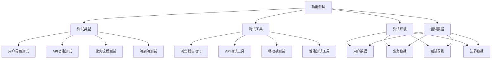

# 功能测试

## 🎯 学习目标
- 理解功能测试的核心概念和重要性
- 掌握功能测试的设计方法和实施策略
- 学会编写高质量的功能测试用例
- 了解功能测试的最佳实践和工具使用

## 📚 核心概念

### 功能测试架构



### 功能测试类型

| 类型 | 描述 | 测试重点 | 工具示例 |
|------|------|----------|----------|
| 用户界面测试 | 测试用户界面功能 | 界面交互、用户体验 | Selenium, Cypress |
| API功能测试 | 测试API接口功能 | 接口调用、数据验证 | Postman, REST Assured |
| 业务流程测试 | 测试完整业务流程 | 业务逻辑、数据流转 | TestNG, JUnit |
| 端到端测试 | 测试完整用户场景 | 用户旅程、系统集成 | Playwright, Puppeteer |
| 兼容性测试 | 测试不同环境兼容性 | 浏览器兼容、设备兼容 | BrowserStack, Sauce Labs |

## 🔧 功能测试实现

### 基础功能测试框架
```php
<?php
// 1. 功能测试基类
abstract class FunctionalTestCase {
    protected array $config = [];
    protected $browser;
    protected $apiClient;
    protected array $testData = [];
    
    public function __construct() {
        $this->config = [
            'browser' => [
                'driver' => 'chrome',
                'headless' => true,
                'timeout' => 30
            ],
            'api' => [
                'base_url' => 'http://localhost:8000',
                'timeout' => 30
            ],
            'database' => [
                'host' => 'localhost',
                'database' => 'test_db',
                'username' => 'test_user',
                'password' => 'test_pass'
            ]
        ];
        
        $this->initializeEnvironment();
    }
    
    // 初始化测试环境
    protected function initializeEnvironment(): void {
        $this->browser = new TestBrowser($this->config['browser']);
        $this->apiClient = new TestApiClient($this->config['api']);
    }
    
    // 设置测试环境
    protected function setUp(): void {
        $this->browser->start();
        $this->loadTestData();
    }
    
    // 清理测试环境
    protected function tearDown(): void {
        $this->browser->quit();
        $this->testData = [];
    }
    
    // 加载测试数据
    protected function loadTestData(): void {
        // 子类实现具体的测试数据加载
    }
    
    // 访问页面
    protected function visit(string $url): void {
        $this->browser->visit($url);
    }
    
    // 点击元素
    protected function click(string $selector): void {
        $this->browser->click($selector);
    }
    
    // 输入文本
    protected function type(string $selector, string $text): void {
        $this->browser->type($selector, $text);
    }
    
    // 选择选项
    protected function select(string $selector, string $value): void {
        $this->browser->select($selector, $value);
    }
    
    // 等待元素
    protected function waitFor(string $selector, int $timeout = 10): void {
        $this->browser->waitFor($selector, $timeout);
    }
    
    // 断言页面标题
    protected function assertTitle(string $expectedTitle): void {
        $actualTitle = $this->browser->getTitle();
        if ($actualTitle !== $expectedTitle) {
            throw new AssertionException("Expected title '{$expectedTitle}', got '{$actualTitle}'");
        }
    }
    
    // 断言页面包含文本
    protected function assertSee(string $text): void {
        if (!$this->browser->hasText($text)) {
            throw new AssertionException("Page does not contain text: {$text}");
        }
    }
    
    // 断言页面不包含文本
    protected function assertDontSee(string $text): void {
        if ($this->browser->hasText($text)) {
            throw new AssertionException("Page contains text: {$text}");
        }
    }
    
    // 断言元素存在
    protected function assertElementExists(string $selector): void {
        if (!$this->browser->elementExists($selector)) {
            throw new AssertionException("Element not found: {$selector}");
        }
    }
    
    // 断言元素不存在
    protected function assertElementNotExists(string $selector): void {
        if ($this->browser->elementExists($selector)) {
            throw new AssertionException("Element found: {$selector}");
        }
    }
    
    // 断言URL
    protected function assertUrl(string $expectedUrl): void {
        $actualUrl = $this->browser->getCurrentUrl();
        if ($actualUrl !== $expectedUrl) {
            throw new AssertionException("Expected URL '{$expectedUrl}', got '{$actualUrl}'");
        }
    }
    
    // 发送API请求
    protected function apiRequest(string $method, string $endpoint, array $data = [], array $headers = []): array {
        return $this->apiClient->request($method, $endpoint, $data, $headers);
    }
    
    // 断言API响应
    protected function assertApiResponse(array $response, int $expectedStatus, array $expectedData = []): void {
        if ($response['status'] !== $expectedStatus) {
            throw new AssertionException("Expected status {$expectedStatus}, got {$response['status']}");
        }
        
        if (!empty($expectedData)) {
            $actualData = json_decode($response['body'], true);
            foreach ($expectedData as $key => $value) {
                if (!isset($actualData[$key]) || $actualData[$key] !== $value) {
                    throw new AssertionException("Expected {$key} to be " . var_export($value, true) . 
                                               ", got " . var_export($actualData[$key] ?? null, true));
                }
            }
        }
    }
}

// 2. 测试浏览器类
class TestBrowser {
    private array $config;
    private $driver;
    private $session;
    
    public function __construct(array $config) {
        $this->config = $config;
    }
    
    // 启动浏览器
    public function start(): void {
        // 模拟浏览器启动
        $this->driver = new stdClass();
        $this->session = new stdClass();
        $this->session->currentUrl = '';
        $this->session->pageSource = '';
        $this->session->title = '';
    }
    
    // 关闭浏览器
    public function quit(): void {
        $this->driver = null;
        $this->session = null;
    }
    
    // 访问页面
    public function visit(string $url): void {
        $this->session->currentUrl = $url;
        $this->session->pageSource = $this->loadPageSource($url);
        $this->session->title = $this->extractTitle($this->session->pageSource);
    }
    
    // 点击元素
    public function click(string $selector): void {
        if (!$this->elementExists($selector)) {
            throw new Exception("Element not found: {$selector}");
        }
        
        // 模拟点击操作
        $this->simulateClick($selector);
    }
    
    // 输入文本
    public function type(string $selector, string $text): void {
        if (!$this->elementExists($selector)) {
            throw new Exception("Element not found: {$selector}");
        }
        
        // 模拟输入操作
        $this->simulateType($selector, $text);
    }
    
    // 选择选项
    public function select(string $selector, string $value): void {
        if (!$this->elementExists($selector)) {
            throw new Exception("Element not found: {$selector}");
        }
        
        // 模拟选择操作
        $this->simulateSelect($selector, $value);
    }
    
    // 等待元素
    public function waitFor(string $selector, int $timeout = 10): void {
        $startTime = time();
        
        while (time() - $startTime < $timeout) {
            if ($this->elementExists($selector)) {
                return;
            }
            usleep(100000); // 等待100ms
        }
        
        throw new Exception("Element not found within {$timeout} seconds: {$selector}");
    }
    
    // 获取页面标题
    public function getTitle(): string {
        return $this->session->title;
    }
    
    // 获取当前URL
    public function getCurrentUrl(): string {
        return $this->session->currentUrl;
    }
    
    // 检查页面是否包含文本
    public function hasText(string $text): bool {
        return strpos($this->session->pageSource, $text) !== false;
    }
    
    // 检查元素是否存在
    public function elementExists(string $selector): bool {
        // 简化的元素存在检查
        return strpos($this->session->pageSource, $selector) !== false;
    }
    
    // 加载页面源码
    private function loadPageSource(string $url): string {
        // 模拟页面加载
        $pages = [
            '/' => '<html><head><title>Home Page</title></head><body><h1>Welcome</h1></body></html>',
            '/login' => '<html><head><title>Login</title></head><body><form><input name="email"><input name="password"><button type="submit">Login</button></form></body></html>',
            '/dashboard' => '<html><head><title>Dashboard</title></head><body><h1>Dashboard</h1><p>Welcome to your dashboard</p></body></html>'
        ];
        
        return $pages[$url] ?? '<html><head><title>Page Not Found</title></head><body><h1>404</h1></body></html>';
    }
    
    // 提取页面标题
    private function extractTitle(string $pageSource): string {
        if (preg_match('/<title>(.*?)<\/title>/', $pageSource, $matches)) {
            return $matches[1];
        }
        return '';
    }
    
    // 模拟点击操作
    private function simulateClick(string $selector): void {
        // 模拟点击逻辑
        if ($selector === 'button[type="submit"]') {
            // 模拟表单提交
            $this->session->currentUrl = '/dashboard';
            $this->session->pageSource = $this->loadPageSource('/dashboard');
            $this->session->title = 'Dashboard';
        }
    }
    
    // 模拟输入操作
    private function simulateType(string $selector, string $text): void {
        // 模拟输入逻辑
    }
    
    // 模拟选择操作
    private function simulateSelect(string $selector, string $value): void {
        // 模拟选择逻辑
    }
}

// 3. 测试API客户端
class TestApiClient {
    private array $config;
    private array $cookies = [];
    
    public function __construct(array $config) {
        $this->config = $config;
    }
    
    // 发送API请求
    public function request(string $method, string $endpoint, array $data = [], array $headers = []): array {
        $url = $this->config['base_url'] . $endpoint;
        
        // 模拟API请求
        $response = $this->simulateApiRequest($method, $endpoint, $data);
        
        return $response;
    }
    
    // 模拟API请求
    private function simulateApiRequest(string $method, string $endpoint, array $data): array {
        // 模拟不同的API端点
        $responses = [
            'POST /api/auth/login' => [
                'status' => 200,
                'body' => json_encode(['token' => 'fake_token_123', 'user' => ['id' => 1, 'name' => 'Test User']])
            ],
            'GET /api/users/profile' => [
                'status' => 200,
                'body' => json_encode(['id' => 1, 'name' => 'Test User', 'email' => 'test@example.com'])
            ],
            'POST /api/users' => [
                'status' => 201,
                'body' => json_encode(['id' => 2, 'name' => $data['name'], 'email' => $data['email']])
            ],
            'GET /api/orders' => [
                'status' => 200,
                'body' => json_encode(['orders' => [
                    ['id' => 1, 'total' => 100.00, 'status' => 'pending'],
                    ['id' => 2, 'total' => 200.00, 'status' => 'completed']
                ]])
            ]
        ];
        
        $key = $method . ' ' . $endpoint;
        return $responses[$key] ?? ['status' => 404, 'body' => json_encode(['error' => 'Not found'])];
    }
}

// 4. 用户功能测试
class UserFunctionalTest extends FunctionalTestCase {
    protected function loadTestData(): void {
        // 加载用户测试数据
        $this->testData['users'] = [
            ['id' => 1, 'name' => 'Test User', 'email' => 'test@example.com', 'password' => 'password123'],
            ['id' => 2, 'name' => 'Admin User', 'email' => 'admin@example.com', 'password' => 'admin123']
        ];
    }
    
    public function testUserRegistration(): void {
        $this->visit('/register');
        
        $this->assertTitle('User Registration');
        $this->assertSee('Create Account');
        
        $this->type('input[name="name"]', 'New User');
        $this->type('input[name="email"]', 'newuser@example.com');
        $this->type('input[name="password"]', 'password123');
        $this->type('input[name="password_confirmation"]', 'password123');
        
        $this->click('button[type="submit"]');
        
        $this->assertUrl('/dashboard');
        $this->assertSee('Welcome, New User');
    }
    
    public function testUserLogin(): void {
        $this->visit('/login');
        
        $this->assertTitle('Login');
        $this->assertSee('Sign In');
        
        $this->type('input[name="email"]', 'test@example.com');
        $this->type('input[name="password"]', 'password123');
        
        $this->click('button[type="submit"]');
        
        $this->assertUrl('/dashboard');
        $this->assertSee('Welcome, Test User');
    }
    
    public function testUserProfileUpdate(): void {
        // 先登录
        $this->visit('/login');
        $this->type('input[name="email"]', 'test@example.com');
        $this->type('input[name="password"]', 'password123');
        $this->click('button[type="submit"]');
        
        // 访问个人资料页面
        $this->visit('/profile');
        $this->assertTitle('Profile');
        
        // 更新个人资料
        $this->type('input[name="name"]', 'Updated Name');
        $this->type('input[name="email"]', 'updated@example.com');
        
        $this->click('button[type="submit"]');
        
        $this->assertSee('Profile updated successfully');
        $this->assertSee('Updated Name');
    }
    
    public function testUserLogout(): void {
        // 先登录
        $this->visit('/login');
        $this->type('input[name="email"]', 'test@example.com');
        $this->type('input[name="password"]', 'password123');
        $this->click('button[type="submit"]');
        
        // 确认已登录
        $this->assertSee('Welcome, Test User');
        
        // 退出登录
        $this->click('a[href="/logout"]');
        
        $this->assertUrl('/login');
        $this->assertSee('Sign In');
    }
}

// 5. API功能测试
class ApiFunctionalTest extends FunctionalTestCase {
    public function testUserApiEndpoints(): void {
        // 测试用户注册API
        $response = $this->apiRequest('POST', '/api/users', [
            'name' => 'API Test User',
            'email' => 'apitest@example.com',
            'password' => 'password123'
        ]);
        
        $this->assertApiResponse($response, 201, [
            'name' => 'API Test User',
            'email' => 'apitest@example.com'
        ]);
        
        // 测试用户登录API
        $response = $this->apiRequest('POST', '/api/auth/login', [
            'email' => 'apitest@example.com',
            'password' => 'password123'
        ]);
        
        $this->assertApiResponse($response, 200);
        
        $responseData = json_decode($response['body'], true);
        $token = $responseData['token'];
        
        // 测试获取用户信息API
        $response = $this->apiRequest('GET', '/api/users/profile', [], [
            'Authorization' => "Bearer {$token}"
        ]);
        
        $this->assertApiResponse($response, 200, [
            'name' => 'API Test User',
            'email' => 'apitest@example.com'
        ]);
    }
    
    public function testOrderApiEndpoints(): void {
        // 先登录获取token
        $loginResponse = $this->apiRequest('POST', '/api/auth/login', [
            'email' => 'test@example.com',
            'password' => 'password123'
        ]);
        
        $loginData = json_decode($loginResponse['body'], true);
        $token = $loginData['token'];
        
        // 测试创建订单API
        $response = $this->apiRequest('POST', '/api/orders', [
            'items' => [
                ['product_id' => 1, 'quantity' => 2, 'price' => 50.00],
                ['product_id' => 2, 'quantity' => 1, 'price' => 30.00]
            ],
            'total' => 130.00
        ], [
            'Authorization' => "Bearer {$token}"
        ]);
        
        $this->assertApiResponse($response, 201);
        
        // 测试获取订单列表API
        $response = $this->apiRequest('GET', '/api/orders', [], [
            'Authorization' => "Bearer {$token}"
        ]);
        
        $this->assertApiResponse($response, 200);
        
        $responseData = json_decode($response['body'], true);
        $this->assertCount(2, $responseData['orders']);
    }
}

// 6. 端到端测试
class EndToEndTest extends FunctionalTestCase {
    public function testCompleteUserJourney(): void {
        // 1. 用户注册
        $this->visit('/register');
        $this->type('input[name="name"]', 'E2E Test User');
        $this->type('input[name="email"]', 'e2e@example.com');
        $this->type('input[name="password"]', 'password123');
        $this->type('input[name="password_confirmation"]', 'password123');
        $this->click('button[type="submit"]');
        
        $this->assertUrl('/dashboard');
        $this->assertSee('Welcome, E2E Test User');
        
        // 2. 创建订单
        $this->visit('/orders/create');
        $this->type('input[name="product_name"]', 'Test Product');
        $this->type('input[name="quantity"]', '2');
        $this->type('input[name="price"]', '50.00');
        $this->click('button[type="submit"]');
        
        $this->assertSee('Order created successfully');
        
        // 3. 查看订单
        $this->visit('/orders');
        $this->assertSee('Test Product');
        $this->assertSee('2');
        $this->assertSee('100.00');
        
        // 4. 更新订单状态
        $this->click('button[data-action="update-status"]');
        $this->select('select[name="status"]', 'shipped');
        $this->click('button[type="submit"]');
        
        $this->assertSee('Order status updated');
        
        // 5. 退出登录
        $this->click('a[href="/logout"]');
        $this->assertUrl('/login');
    }
    
    public function testErrorHandling(): void {
        // 测试无效登录
        $this->visit('/login');
        $this->type('input[name="email"]', 'invalid@example.com');
        $this->type('input[name="password"]', 'wrongpassword');
        $this->click('button[type="submit"]');
        
        $this->assertSee('Invalid credentials');
        $this->assertUrl('/login');
        
        // 测试表单验证
        $this->visit('/register');
        $this->type('input[name="name"]', '');
        $this->type('input[name="email"]', 'invalid-email');
        $this->type('input[name="password"]', '123');
        $this->click('button[type="submit"]');
        
        $this->assertSee('Name is required');
        $this->assertSee('Invalid email format');
        $this->assertSee('Password must be at least 8 characters');
    }
}

// 使用示例
echo "=== 功能测试示例 ===\n";

try {
    // 创建功能测试运行器
    $runner = new TestRunner();
    $runner->addTestClass('UserFunctionalTest');
    $runner->addTestClass('ApiFunctionalTest');
    $runner->addTestClass('EndToEndTest');
    
    // 运行测试
    $result = $runner->runAll();
    
    // 输出结果
    echo $result->generateReport();
    
    if ($result->isSuccess()) {
        echo "All functional tests passed!\n";
    } else {
        echo "Some functional tests failed!\n";
    }
    
} catch (Exception $e) {
    echo "Error: " . $e->getMessage() . "\n";
}
?>
```

## 📊 最佳实践

### 功能测试最佳实践
```php
<?php
// 功能测试最佳实践

class FunctionalTestBestPractices {
    // 1. 测试设计最佳实践
    public static function getTestDesignBestPractices() {
        return [
            '测试场景设计' => [
                '用户场景' => '基于真实用户场景设计测试',
                '业务流程' => '覆盖完整的业务流程',
                '边界条件' => '测试边界条件和异常情况',
                '用户体验' => '关注用户体验和界面交互'
            ],
            '测试数据设计' => [
                '真实数据' => '使用接近真实的数据',
                '边界数据' => '包含边界值和极值',
                '异常数据' => '包含异常和错误数据',
                '数据隔离' => '确保测试数据隔离'
            ],
            '测试组织' => [
                '模块分组' => '按功能模块分组测试',
                '优先级排序' => '按业务优先级排序测试',
                '依赖管理' => '管理测试间的依赖关系',
                '并行执行' => '支持测试并行执行'
            ]
        ];
    }
    
    // 2. 测试实施最佳实践
    public static function getTestImplementationBestPractices() {
        return [
            '测试执行' => [
                '执行策略' => '制定合理的测试执行策略',
                '执行环境' => '使用稳定的测试环境',
                '执行监控' => '监控测试执行过程',
                '执行报告' => '生成详细的执行报告'
            ],
            '错误处理' => [
                '错误捕获' => '捕获和处理测试错误',
                '错误分析' => '分析错误原因和影响',
                '错误修复' => '及时修复测试错误',
                '错误预防' => '预防类似错误再次发生'
            ],
            '性能优化' => [
                '执行速度' => '优化测试执行速度',
                '资源使用' => '优化资源使用效率',
                '并行执行' => '实现测试并行执行',
                '缓存策略' => '使用缓存提高效率'
            ]
        ];
    }
    
    // 3. 测试维护最佳实践
    public static function getTestMaintenanceBestPractices() {
        return [
            '测试维护' => [
                '及时更新' => '及时更新测试代码',
                '重构优化' => '定期重构和优化测试',
                '删除冗余' => '删除冗余和过时的测试',
                '文档更新' => '更新测试文档和注释'
            ],
            '质量保证' => [
                '代码审查' => '对测试代码进行审查',
                '质量指标' => '监控测试质量指标',
                '覆盖率' => '保持适当的测试覆盖率',
                '稳定性' => '确保测试的稳定性'
            ],
            '持续改进' => [
                '反馈收集' => '收集测试反馈和建议',
                '流程优化' => '优化测试流程和方法',
                '工具改进' => '改进测试工具和框架',
                '经验分享' => '分享测试经验和最佳实践'
            ]
        ];
    }
}

// 使用示例
echo "=== 功能测试最佳实践示例 ===\n";

try {
    $designPractices = FunctionalTestBestPractices::getTestDesignBestPractices();
    echo "测试设计最佳实践:\n";
    foreach ($designPractices as $category => $practices) {
        echo "  $category:\n";
        foreach ($practices as $practice => $description) {
            echo "    - $practice: $description\n";
        }
        echo "\n";
    }
    
} catch (Exception $e) {
    echo "错误: " . $e->getMessage() . "\n";
}
?>
```

## 🎓 学习建议

### 费曼学习法应用
1. **选择概念**: 选择功能测试中的核心概念
2. **简化解释**: 用简单语言解释功能测试的作用
3. **识别盲点**: 发现理解不深入的地方
4. **重新学习**: 针对盲点进行深入学习

### 刻意练习重点
1. **测试设计**: 掌握功能测试的设计方法
2. **工具使用**: 学会使用功能测试工具
3. **场景构建**: 学会构建测试场景
4. **错误处理**: 掌握测试错误处理方法

## 🔗 相关链接
- [[01-单元测试|单元测试]]
- [[02-集成测试|集成测试]]
- [[04-TDD开发模式|TDD开发模式]]
- [[05-PHPUnit使用|PHPUnit使用]]
- [[06-测试覆盖率|测试覆盖率]]
- [[07-测试策略规划|测试策略规划]]
