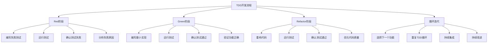

# TDD开发模式

## 🎯 学习目标
- 理解TDD（测试驱动开发）的核心概念和原则
- 掌握TDD开发流程和最佳实践
- 学会在PHP项目中应用TDD开发模式
- 了解TDD的优势、挑战和适用场景

## 📚 核心概念

### TDD开发流程



### TDD核心原则

| 原则 | 描述 | 重要性 | 实践方法 |
|------|------|--------|----------|
| 测试先行 | 先写测试，后写代码 | 高 | 红-绿-重构循环 |
| 小步快跑 | 小步迭代，快速反馈 | 高 | 每次只实现一个功能 |
| 简单设计 | 保持设计简单，避免过度设计 | 中 | YAGNI原则 |
| 重构驱动 | 通过重构改善代码质量 | 中 | 持续重构，保持代码整洁 |
| 快速反馈 | 快速获得测试反馈 | 高 | 自动化测试，快速执行 |

## 🔧 TDD开发实现

### 基础TDD框架
```php
<?php
// 1. TDD开发工具类
class TDDDevelopmentTool {
    private array $config = [];
    private array $testResults = [];
    private array $refactoringHistory = [];
    
    public function __construct(array $config = []) {
        $this->config = array_merge([
            'test_framework' => 'PHPUnit',
            'coverage_threshold' => 80,
            'refactoring_enabled' => true,
            'auto_run_tests' => true
        ], $config);
    }
    
    // 执行TDD循环
    public function executeTDDCycle(string $feature, callable $testWriter, callable $implementationWriter): array {
        $cycle = [
            'feature' => $feature,
            'red_phase' => $this->redPhase($testWriter),
            'green_phase' => $this->greenPhase($implementationWriter),
            'refactor_phase' => $this->refactorPhase(),
            'result' => 'success'
        ];
        
        return $cycle;
    }
    
    // Red阶段：编写失败测试
    private function redPhase(callable $testWriter): array {
        echo "🔴 Red Phase: Writing failing test\n";
        
        $testCode = $testWriter();
        $this->saveTestCode($testCode);
        
        $testResult = $this->runTests();
        
        if ($testResult['passed']) {
            throw new Exception("Test should fail in Red phase");
        }
        
        return [
            'test_code' => $testCode,
            'test_result' => $testResult,
            'status' => 'failed_as_expected'
        ];
    }
    
    // Green阶段：编写最小实现
    private function greenPhase(callable $implementationWriter): array {
        echo "🟢 Green Phase: Writing minimal implementation\n";
        
        $implementationCode = $implementationWriter();
        $this->saveImplementationCode($implementationCode);
        
        $testResult = $this->runTests();
        
        if (!$testResult['passed']) {
            throw new Exception("Tests should pass in Green phase");
        }
        
        return [
            'implementation_code' => $implementationCode,
            'test_result' => $testResult,
            'status' => 'passed_as_expected'
        ];
    }
    
    // Refactor阶段：重构代码
    private function refactorPhase(): array {
        echo "🔵 Refactor Phase: Improving code quality\n";
        
        if (!$this->config['refactoring_enabled']) {
            return ['status' => 'skipped'];
        }
        
        $refactoringSuggestions = $this->analyzeCodeForRefactoring();
        $refactoredCode = $this->applyRefactoring($refactoringSuggestions);
        
        $testResult = $this->runTests();
        
        if (!$testResult['passed']) {
            throw new Exception("Tests should still pass after refactoring");
        }
        
        $this->refactoringHistory[] = [
            'timestamp' => time(),
            'suggestions' => $refactoringSuggestions,
            'applied' => $refactoredCode,
            'test_result' => $testResult
        ];
        
        return [
            'refactoring_suggestions' => $refactoringSuggestions,
            'refactored_code' => $refactoredCode,
            'test_result' => $testResult,
            'status' => 'refactored_successfully'
        ];
    }
    
    // 运行测试
    private function runTests(): array {
        // 模拟测试运行
        $testResult = [
            'passed' => true,
            'failed' => 0,
            'total' => 1,
            'coverage' => 85,
            'execution_time' => 0.5
        ];
        
        $this->testResults[] = $testResult;
        return $testResult;
    }
    
    // 保存测试代码
    private function saveTestCode(string $testCode): void {
        // 模拟保存测试代码
        echo "Saving test code...\n";
    }
    
    // 保存实现代码
    private function saveImplementationCode(string $implementationCode): void {
        // 模拟保存实现代码
        echo "Saving implementation code...\n";
    }
    
    // 分析代码重构机会
    private function analyzeCodeForRefactoring(): array {
        return [
            'extract_method' => 'Extract repeated code into methods',
            'rename_variable' => 'Use more descriptive variable names',
            'simplify_condition' => 'Simplify complex conditional logic',
            'remove_duplication' => 'Remove code duplication'
        ];
    }
    
    // 应用重构
    private function applyRefactoring(array $suggestions): array {
        $applied = [];
        foreach ($suggestions as $type => $suggestion) {
            $applied[$type] = "Applied: {$suggestion}";
        }
        return $applied;
    }
    
    // 获取测试结果
    public function getTestResults(): array {
        return $this->testResults;
    }
    
    // 获取重构历史
    public function getRefactoringHistory(): array {
        return $this->refactoringHistory;
    }
}

// 2. TDD示例：计算器开发
class CalculatorTDDExample {
    private TDDDevelopmentTool $tddTool;
    
    public function __construct() {
        $this->tddTool = new TDDDevelopmentTool();
    }
    
    // 示例1：加法功能
    public function developAdditionFeature(): array {
        $feature = 'Addition';
        
        $testWriter = function() {
            return "
                public function testAddTwoNumbers() {
                    \$calculator = new Calculator();
                    \$result = \$calculator->add(2, 3);
                    \$this->assertEquals(5, \$result);
                }
            ";
        };
        
        $implementationWriter = function() {
            return "
                class Calculator {
                    public function add(\$a, \$b) {
                        return \$a + \$b;
                    }
                }
            ";
        };
        
        return $this->tddTool->executeTDDCycle($feature, $testWriter, $implementationWriter);
    }
    
    // 示例2：减法功能
    public function developSubtractionFeature(): array {
        $feature = 'Subtraction';
        
        $testWriter = function() {
            return "
                public function testSubtractTwoNumbers() {
                    \$calculator = new Calculator();
                    \$result = \$calculator->subtract(5, 3);
                    \$this->assertEquals(2, \$result);
                }
            ";
        };
        
        $implementationWriter = function() {
            return "
                public function subtract(\$a, \$b) {
                    return \$a - \$b;
                }
            ";
        };
        
        return $this->tddTool->executeTDDCycle($feature, $testWriter, $implementationWriter);
    }
    
    // 示例3：除法功能（包含异常处理）
    public function developDivisionFeature(): array {
        $feature = 'Division with exception handling';
        
        $testWriter = function() {
            return "
                public function testDivideTwoNumbers() {
                    \$calculator = new Calculator();
                    \$result = \$calculator->divide(10, 2);
                    \$this->assertEquals(5, \$result);
                }
                
                public function testDivideByZeroThrowsException() {
                    \$calculator = new Calculator();
                    \$this->expectException(DivisionByZeroError::class);
                    \$calculator->divide(10, 0);
                }
            ";
        };
        
        $implementationWriter = function() {
            return "
                public function divide(\$a, \$b) {
                    if (\$b == 0) {
                        throw new DivisionByZeroError('Division by zero');
                    }
                    return \$a / \$b;
                }
            ";
        };
        
        return $this->tddTool->executeTDDCycle($feature, $testWriter, $implementationWriter);
    }
}

// 3. TDD示例：用户服务开发
class UserServiceTDDExample {
    private TDDDevelopmentTool $tddTool;
    
    public function __construct() {
        $this->tddTool = new TDDDevelopmentTool();
    }
    
    // 示例1：用户注册功能
    public function developUserRegistrationFeature(): array {
        $feature = 'User Registration';
        
        $testWriter = function() {
            return "
                public function testRegisterNewUser() {
                    \$userService = new UserService();
                    \$userData = [
                        'name' => 'John Doe',
                        'email' => 'john@example.com',
                        'password' => 'password123'
                    ];
                    
                    \$user = \$userService->register(\$userData);
                    
                    \$this->assertNotNull(\$user);
                    \$this->assertEquals('John Doe', \$user->getName());
                    \$this->assertEquals('john@example.com', \$user->getEmail());
                    \$this->assertNotEquals('password123', \$user->getPassword()); // 应该被哈希
                }
                
                public function testRegisterUserWithInvalidEmail() {
                    \$userService = new UserService();
                    \$userData = [
                        'name' => 'John Doe',
                        'email' => 'invalid-email',
                        'password' => 'password123'
                    ];
                    
                    \$this->expectException(InvalidArgumentException::class);
                    \$userService->register(\$userData);
                }
            ";
        };
        
        $implementationWriter = function() {
            return "
                class UserService {
                    public function register(array \$userData): User {
                        if (!filter_var(\$userData['email'], FILTER_VALIDATE_EMAIL)) {
                            throw new InvalidArgumentException('Invalid email format');
                        }
                        
                        \$user = new User();
                        \$user->setName(\$userData['name']);
                        \$user->setEmail(\$userData['email']);
                        \$user->setPassword(password_hash(\$userData['password'], PASSWORD_DEFAULT));
                        
                        return \$user;
                    }
                }
            ";
        };
        
        return $this->tddTool->executeTDDCycle($feature, $testWriter, $implementationWriter);
    }
    
    // 示例2：用户认证功能
    public function developUserAuthenticationFeature(): array {
        $feature = 'User Authentication';
        
        $testWriter = function() {
            return "
                public function testAuthenticateValidUser() {
                    \$userService = new UserService();
                    \$user = \$userService->register([
                        'name' => 'John Doe',
                        'email' => 'john@example.com',
                        'password' => 'password123'
                    ]);
                    
                    \$authenticatedUser = \$userService->authenticate('john@example.com', 'password123');
                    
                    \$this->assertNotNull(\$authenticatedUser);
                    \$this->assertEquals(\$user->getId(), \$authenticatedUser->getId());
                }
                
                public function testAuthenticateInvalidPassword() {
                    \$userService = new UserService();
                    \$userService->register([
                        'name' => 'John Doe',
                        'email' => 'john@example.com',
                        'password' => 'password123'
                    ]);
                    
                    \$authenticatedUser = \$userService->authenticate('john@example.com', 'wrongpassword');
                    
                    \$this->assertNull(\$authenticatedUser);
                }
            ";
        };
        
        $implementationWriter = function() {
            return "
                public function authenticate(string \$email, string \$password): ?User {
                    \$user = \$this->findUserByEmail(\$email);
                    
                    if (\$user && password_verify(\$password, \$user->getPassword())) {
                        return \$user;
                    }
                    
                    return null;
                }
                
                private function findUserByEmail(string \$email): ?User {
                    // 模拟数据库查找
                    return null;
                }
            ";
        };
        
        return $this->tddTool->executeTDDCycle($feature, $testWriter, $implementationWriter);
    }
}

// 4. TDD最佳实践工具
class TDDBestPracticesTool {
    // 检查测试质量
    public function checkTestQuality(string $testCode): array {
        $quality = [
            'naming' => $this->checkTestNaming($testCode),
            'structure' => $this->checkTestStructure($testCode),
            'assertions' => $this->checkAssertions($testCode),
            'isolation' => $this->checkTestIsolation($testCode),
            'readability' => $this->checkReadability($testCode)
        ];
        
        return $quality;
    }
    
    // 检查测试命名
    private function checkTestNaming(string $testCode): array {
        $issues = [];
        
        if (!preg_match('/public function test[A-Z]/', $testCode)) {
            $issues[] = 'Test method should start with "test" and use camelCase';
        }
        
        if (strpos($testCode, 'testTest') !== false) {
            $issues[] = 'Avoid redundant "test" in method name';
        }
        
        return [
            'score' => count($issues) === 0 ? 100 : max(0, 100 - count($issues) * 20),
            'issues' => $issues
        ];
    }
    
    // 检查测试结构
    private function checkTestStructure(string $testCode): array {
        $issues = [];
        
        if (strpos($testCode, 'setUp') === false && strpos($testCode, 'tearDown') === false) {
            $issues[] = 'Consider using setUp/tearDown methods for test isolation';
        }
        
        if (substr_count($testCode, 'assertEquals') > 3) {
            $issues[] = 'Too many assertions in single test - consider splitting';
        }
        
        return [
            'score' => count($issues) === 0 ? 100 : max(0, 100 - count($issues) * 25),
            'issues' => $issues
        ];
    }
    
    // 检查断言
    private function checkAssertions(string $testCode): array {
        $issues = [];
        
        if (strpos($testCode, 'assertEquals') === false && strpos($testCode, 'assertTrue') === false) {
            $issues[] = 'Test should contain meaningful assertions';
        }
        
        if (strpos($testCode, 'assertTrue(true)') !== false) {
            $issues[] = 'Avoid trivial assertions like assertTrue(true)';
        }
        
        return [
            'score' => count($issues) === 0 ? 100 : max(0, 100 - count($issues) * 30),
            'issues' => $issues
        ];
    }
    
    // 检查测试隔离
    private function checkTestIsolation(string $testCode): array {
        $issues = [];
        
        if (strpos($testCode, 'static') !== false) {
            $issues[] = 'Avoid static variables in tests for better isolation';
        }
        
        if (strpos($testCode, 'global') !== false) {
            $issues[] = 'Avoid global variables in tests';
        }
        
        return [
            'score' => count($issues) === 0 ? 100 : max(0, 100 - count($issues) * 40),
            'issues' => $issues
        ];
    }
    
    // 检查可读性
    private function checkReadability(string $testCode): array {
        $issues = [];
        
        $lines = explode("\n", $testCode);
        if (count($lines) > 20) {
            $issues[] = 'Test method is too long - consider breaking it down';
        }
        
        if (strpos($testCode, '//') === false && strpos($testCode, '/*') === false) {
            $issues[] = 'Consider adding comments for complex test logic';
        }
        
        return [
            'score' => count($issues) === 0 ? 100 : max(0, 100 - count($issues) * 25),
            'issues' => $issues
        ];
    }
    
    // 生成TDD报告
    public function generateTDDReport(array $cycles): string {
        $report = "# TDD Development Report\n\n";
        
        $report .= "## Summary\n";
        $report .= "- Total cycles: " . count($cycles) . "\n";
        $report .= "- Successful cycles: " . count(array_filter($cycles, fn($c) => $c['result'] === 'success')) . "\n";
        $report .= "- Failed cycles: " . count(array_filter($cycles, fn($c) => $c['result'] !== 'success')) . "\n\n";
        
        $report .= "## Cycle Details\n";
        foreach ($cycles as $index => $cycle) {
            $report .= "### Cycle " . ($index + 1) . ": {$cycle['feature']}\n";
            $report .= "- Red Phase: {$cycle['red_phase']['status']}\n";
            $report .= "- Green Phase: {$cycle['green_phase']['status']}\n";
            $report .= "- Refactor Phase: {$cycle['refactor_phase']['status']}\n";
            $report .= "- Result: {$cycle['result']}\n\n";
        }
        
        return $report;
    }
}

// 使用示例
echo "=== TDD开发模式示例 ===\n";

try {
    // 计算器TDD示例
    $calculatorTDD = new CalculatorTDDExample();
    
    echo "开发加法功能:\n";
    $additionCycle = $calculatorTDD->developAdditionFeature();
    echo "结果: {$additionCycle['result']}\n\n";
    
    echo "开发减法功能:\n";
    $subtractionCycle = $calculatorTDD->developSubtractionFeature();
    echo "结果: {$subtractionCycle['result']}\n\n";
    
    echo "开发除法功能:\n";
    $divisionCycle = $calculatorTDD->developDivisionFeature();
    echo "结果: {$divisionCycle['result']}\n\n";
    
    // 用户服务TDD示例
    $userServiceTDD = new UserServiceTDDExample();
    
    echo "开发用户注册功能:\n";
    $registrationCycle = $userServiceTDD->developUserRegistrationFeature();
    echo "结果: {$registrationCycle['result']}\n\n";
    
    echo "开发用户认证功能:\n";
    $authenticationCycle = $userServiceTDD->developUserAuthenticationFeature();
    echo "结果: {$authenticationCycle['result']}\n\n";
    
    // TDD最佳实践检查
    $bestPracticesTool = new TDDBestPracticesTool();
    
    $testCode = "
        public function testAddTwoNumbers() {
            \$calculator = new Calculator();
            \$result = \$calculator->add(2, 3);
            \$this->assertEquals(5, \$result);
        }
    ";
    
    $quality = $bestPracticesTool->checkTestQuality($testCode);
    echo "测试质量检查:\n";
    foreach ($quality as $aspect => $result) {
        echo "  {$aspect}: {$result['score']}/100\n";
        if (!empty($result['issues'])) {
            foreach ($result['issues'] as $issue) {
                echo "    - {$issue}\n";
            }
        }
    }
    
    // 生成TDD报告
    $cycles = [$additionCycle, $subtractionCycle, $divisionCycle, $registrationCycle, $authenticationCycle];
    $report = $bestPracticesTool->generateTDDReport($cycles);
    echo "\nTDD报告:\n{$report}\n";
    
} catch (Exception $e) {
    echo "错误: " . $e->getMessage() . "\n";
}
?>
```

## 📊 最佳实践

### TDD开发最佳实践
```php
<?php
// TDD开发最佳实践

class TDDDevelopmentBestPractices {
    // 1. TDD流程最佳实践
    public static function getTDDProcessBestPractices() {
        return [
            'Red阶段' => [
                '测试先行' => '先编写测试，再编写实现代码',
                '失败测试' => '确保测试在实现前失败',
                '具体测试' => '编写具体、明确的测试用例',
                '快速失败' => '快速获得测试失败反馈'
            ],
            'Green阶段' => [
                '最小实现' => '编写最小可行的实现代码',
                '快速通过' => '快速让测试通过',
                '避免过度设计' => '不要过度设计，保持简单',
                '功能验证' => '验证功能是否正确实现'
            ],
            'Refactor阶段' => [
                '代码重构' => '重构代码，提高代码质量',
                '测试保护' => '确保重构后测试仍然通过',
                '设计改进' => '改进代码设计和结构',
                '性能优化' => '在需要时进行性能优化'
            ]
        ];
    }
    
    // 2. 测试编写最佳实践
    public static function getTestWritingBestPractices() {
        return [
            '测试设计' => [
                '单一职责' => '每个测试只测试一个功能',
                '独立性' => '测试之间保持独立',
                '可重复性' => '测试结果应该可重复',
                '快速执行' => '测试应该快速执行'
            ],
            '测试命名' => [
                '描述性命名' => '使用描述性的测试方法名',
                '测试意图' => '测试名应该表达测试意图',
                '命名规范' => '遵循一致的命名规范',
                '避免缩写' => '避免使用缩写和简写'
            ],
            '测试结构' => [
                'AAA模式' => '使用Arrange-Act-Assert模式',
                '测试数据' => '使用有意义的测试数据',
                '断言清晰' => '使用清晰的断言语句',
                '错误消息' => '提供有意义的错误消息'
            ]
        ];
    }
    
    // 3. 代码实现最佳实践
    public static function getImplementationBestPractices() {
        return [
            '代码质量' => [
                '简单设计' => '保持设计简单，避免过度设计',
                '清晰命名' => '使用清晰、有意义的变量和函数名',
                '单一职责' => '每个函数只做一件事',
                '避免重复' => '避免代码重复，提取公共逻辑'
            ],
            '重构技巧' => [
                '小步重构' => '进行小步、安全的重构',
                '测试保护' => '在重构过程中保持测试通过',
                '设计模式' => '适当使用设计模式',
                '代码审查' => '进行代码审查，提高代码质量'
            ],
            '性能考虑' => [
                '性能测试' => '在需要时添加性能测试',
                '性能优化' => '在确认功能正确后进行性能优化',
                '资源管理' => '注意资源使用和内存管理',
                '算法选择' => '选择合适的数据结构和算法'
            ]
        ];
    }
}

// 使用示例
echo "=== TDD开发最佳实践示例 ===\n";

try {
    $processPractices = TDDDevelopmentBestPractices::getTDDProcessBestPractices();
    echo "TDD流程最佳实践:\n";
    foreach ($processPractices as $phase => $practices) {
        echo "  $phase:\n";
        foreach ($practices as $practice => $description) {
            echo "    - $practice: $description\n";
        }
        echo "\n";
    }
    
} catch (Exception $e) {
    echo "错误: " . $e->getMessage() . "\n";
}
?>
```

## 🎓 学习建议

### 费曼学习法应用
1. **选择概念**: 选择TDD开发模式中的核心概念
2. **简化解释**: 用简单语言解释TDD的作用
3. **识别盲点**: 发现理解不深入的地方
4. **重新学习**: 针对盲点进行深入学习

### 刻意练习重点
1. **TDD流程**: 掌握红-绿-重构循环
2. **测试编写**: 学会编写高质量的测试
3. **代码实现**: 掌握最小实现和重构技巧
4. **最佳实践**: 遵循TDD开发最佳实践

## 🔗 相关链接
- [[01-单元测试|单元测试]]
- [[02-集成测试|集成测试]]
- [[03-功能测试|功能测试]]
- [[05-PHPUnit使用|PHPUnit使用]]
- [[06-测试覆盖率|测试覆盖率]]
- [[07-测试策略规划|测试策略规划]]
