# PHPUnit使用

## 🎯 学习目标
- 掌握PHPUnit测试框架的安装和配置
- 学会编写各种类型的PHPUnit测试
- 了解PHPUnit的高级特性和最佳实践
- 掌握测试运行、调试和报告生成

## 📚 核心概念

### PHPUnit测试框架架构

```mermaid
graph TD
    A[PHPUnit测试框架] --> B[测试用例类]
    A --> C[测试套件]
    A --> D[测试运行器]
    A --> E[断言库]
    A --> F[模拟对象]
    A --> G[数据提供者]
    A --> H[测试监听器]
    
    B --> B1[TestCase基类]
    B --> B2[测试方法]
    B --> B3[setUp/tearDown]
    B --> B4[数据提供者方法]
    
    C --> C1[TestSuite类]
    C --> C2[测试分组]
    C --> C3[测试过滤]
    C --> C4[测试排序]
    
    D --> D1[命令行运行器]
    D --> D2[IDE集成]
    D --> D3[CI/CD集成]
    D --> D4[报告生成]
    
    E --> E1[基本断言]
    E --> E2[类型断言]
    E --> E3[异常断言]
    E --> E4[自定义断言]
    
    F --> F1[Mock对象]
    F --> F2[Stub对象]
    F --> F3[Spy对象]
    F --> F4[部分模拟]
    
    G --> G1[数据提供者方法]
    G --> G2[外部数据源]
    G --> G3[动态数据生成]
    G --> G4[数据过滤]
    
    H --> H1[测试监听器]
    H --> H2[事件处理]
    H --> H3[报告生成]
    H --> H4[性能监控]
```



### PHPUnit核心组件

| 组件 | 功能 | 重要性 | 使用场景 |
|------|------|--------|----------|
| TestCase | 测试用例基类 | 高 | 所有测试的基础类 |
| 断言方法 | 验证测试结果 | 高 | 测试验证的核心 |
| 数据提供者 | 提供测试数据 | 中 | 参数化测试 |
| 模拟对象 | 模拟依赖 | 高 | 单元测试隔离 |
| 测试套件 | 组织测试 | 中 | 批量运行测试 |
| 测试监听器 | 扩展功能 | 低 | 自定义测试行为 |

## 🔧 PHPUnit实现

### 基础PHPUnit测试
```php
<?php
// 1. PHPUnit基础测试类
use PHPUnit\Framework\TestCase;

class BasicPHPUnitTest extends TestCase {
    private $calculator;
    private $userService;
    
    // 测试前准备
    protected function setUp(): void {
        $this->calculator = new Calculator();
        $this->userService = new UserService();
    }
    
    // 测试后清理
    protected function tearDown(): void {
        $this->calculator = null;
        $this->userService = null;
    }
    
    // 基本断言测试
    public function testBasicAssertions() {
        // 相等断言
        $this->assertEquals(5, $this->calculator->add(2, 3));
        $this->assertNotEquals(6, $this->calculator->add(2, 3));
        
        // 类型断言
        $this->assertIsInt($this->calculator->add(2, 3));
        $this->assertIsString('Hello World');
        $this->assertIsArray([1, 2, 3]);
        
        // 布尔断言
        $this->assertTrue(true);
        $this->assertFalse(false);
        
        // 空值断言
        $this->assertNull(null);
        $this->assertNotNull('not null');
        
        // 包含断言
        $this->assertContains('world', 'Hello World');
        $this->assertNotContains('php', 'Hello World');
        
        // 正则表达式断言
        $this->assertMatchesRegularExpression('/\d+/', '123abc');
        $this->assertDoesNotMatchRegularExpression('/\d+/', 'abc');
    }
    
    // 异常测试
    public function testExceptionHandling() {
        // 测试异常抛出
        $this->expectException(DivisionByZeroError::class);
        $this->expectExceptionMessage('Division by zero');
        $this->calculator->divide(10, 0);
        
        // 测试异常代码
        $this->expectExceptionCode(100);
        throw new Exception('Test exception', 100);
    }
    
    // 输出测试
    public function testOutput() {
        $this->expectOutputString('Hello World');
        echo 'Hello World';
        
        // 测试输出包含
        $this->expectOutputRegex('/Hello/');
        echo 'Hello World';
    }
    
    // 文件系统测试
    public function testFileSystem() {
        $filename = 'test_file.txt';
        $content = 'Test content';
        
        // 创建测试文件
        file_put_contents($filename, $content);
        
        // 测试文件存在
        $this->assertFileExists($filename);
        $this->assertFileIsReadable($filename);
        $this->assertFileIsWritable($filename);
        
        // 测试文件内容
        $this->assertStringEqualsFile($filename, $content);
        
        // 清理测试文件
        unlink($filename);
        $this->assertFileDoesNotExist($filename);
    }
}

// 2. 数据提供者测试
class DataProviderTest extends TestCase {
    private $calculator;
    
    protected function setUp(): void {
        $this->calculator = new Calculator();
    }
    
    // 数据提供者方法
    public function additionProvider() {
        return [
            'positive numbers' => [2, 3, 5],
            'negative numbers' => [-2, -3, -5],
            'mixed numbers' => [2, -3, -1],
            'zero values' => [0, 0, 0],
            'large numbers' => [1000, 2000, 3000]
        ];
    }
    
    // 使用数据提供者的测试
    /**
     * @dataProvider additionProvider
     */
    public function testAdditionWithDataProvider($a, $b, $expected) {
        $result = $this->calculator->add($a, $b);
        $this->assertEquals($expected, $result);
    }
    
    // 外部数据源提供者
    public function csvDataProvider() {
        $data = [];
        $file = fopen('test_data.csv', 'r');
        
        while (($row = fgetcsv($file)) !== false) {
            $data[] = $row;
        }
        
        fclose($file);
        return $data;
    }
    
    /**
     * @dataProvider csvDataProvider
     */
    public function testWithCsvData($input, $expected) {
        $result = $this->calculator->process($input);
        $this->assertEquals($expected, $result);
    }
}

// 3. 模拟对象测试
class MockObjectTest extends TestCase {
    private $userService;
    private $emailService;
    
    protected function setUp(): void {
        $this->emailService = $this->createMock(EmailService::class);
        $this->userService = new UserService($this->emailService);
    }
    
    // 基本模拟对象测试
    public function testUserRegistrationWithMock() {
        // 配置模拟对象
        $this->emailService->expects($this->once())
                          ->method('sendWelcomeEmail')
                          ->with($this->equalTo('john@example.com'))
                          ->willReturn(true);
        
        // 执行测试
        $user = $this->userService->register([
            'name' => 'John Doe',
            'email' => 'john@example.com',
            'password' => 'password123'
        ]);
        
        // 验证结果
        $this->assertNotNull($user);
        $this->assertEquals('John Doe', $user->getName());
    }
    
    // 模拟对象返回值测试
    public function testMockReturnValues() {
        $mock = $this->createMock(DataService::class);
        
        // 配置返回值
        $mock->method('getData')
             ->willReturn('mocked data');
        
        // 配置多次调用返回不同值
        $mock->method('getData')
             ->willReturnOnConsecutiveCalls('first', 'second', 'third');
        
        // 配置异常抛出
        $mock->method('getData')
             ->willThrowException(new Exception('Database error'));
        
        // 测试返回值
        $this->assertEquals('mocked data', $mock->getData());
    }
    
    // 部分模拟测试
    public function testPartialMock() {
        $partialMock = $this->createPartialMock(UserService::class, ['sendEmail']);
        
        $partialMock->expects($this->once())
                   ->method('sendEmail')
                   ->willReturn(true);
        
        $result = $partialMock->registerUser('john@example.com');
        $this->assertTrue($result);
    }
    
    // 模拟对象验证
    public function testMockVerification() {
        $mock = $this->createMock(Logger::class);
        
        $mock->expects($this->once())
             ->method('log')
             ->with($this->stringContains('error'));
        
        $mock->expects($this->never())
             ->method('clear');
        
        $mock->expects($this->any())
             ->method('getLevel')
             ->willReturn('debug');
        
        // 执行测试
        $service = new LoggingService($mock);
        $service->logError('Database connection failed');
    }
}

// 4. 高级PHPUnit特性
class AdvancedPHPUnitTest extends TestCase {
    // 测试依赖
    public function testFirst() {
        $this->assertTrue(true);
        return 'first result';
    }
    
    /**
     * @depends testFirst
     */
    public function testSecond($result) {
        $this->assertEquals('first result', $result);
        return 'second result';
    }
    
    /**
     * @depends testSecond
     */
    public function testThird($result) {
        $this->assertEquals('second result', $result);
    }
    
    // 测试分组
    /**
     * @group unit
     * @group fast
     */
    public function testUnitTest() {
        $this->assertTrue(true);
    }
    
    /**
     * @group integration
     * @group slow
     */
    public function testIntegrationTest() {
        $this->assertTrue(true);
    }
    
    // 跳过测试
    public function testSkippedTest() {
        $this->markTestSkipped('This test is not implemented yet');
    }
    
    // 不完整测试
    public function testIncompleteTest() {
        $this->markTestIncomplete('This test needs more work');
    }
    
    // 条件测试
    public function testConditionalTest() {
        if (version_compare(PHP_VERSION, '8.0.0', '<')) {
            $this->markTestSkipped('This test requires PHP 8.0 or higher');
        }
        
        $this->assertTrue(true);
    }
    
    // 自定义断言
    public function testCustomAssertion() {
        $this->assertIsEven(4);
        $this->assertIsOdd(3);
    }
    
    // 自定义断言方法
    private function assertIsEven($number) {
        $this->assertTrue($number % 2 === 0, "Expected {$number} to be even");
    }
    
    private function assertIsOdd($number) {
        $this->assertTrue($number % 2 === 1, "Expected {$number} to be odd");
    }
}

// 5. PHPUnit配置和运行
class PHPUnitConfiguration {
    // 生成PHPUnit配置文件
    public static function generatePHPUnitXml() {
        $config = [
            'phpunit' => [
                'testsuite' => [
                    'name' => 'PHP Learning Tests',
                    'directory' => './tests'
                ],
                'coverage' => [
                    'include' => [
                        'directory' => [
                            'name' => './src',
                            'suffix' => '.php'
                        ]
                    ],
                    'exclude' => [
                        'directory' => [
                            'name' => './tests'
                        ]
                    ]
                ],
                'logging' => [
                    'junit' => [
                        'outputDirectory' => './reports'
                    ],
                    'coverage-html' => [
                        'outputDirectory' => './reports/coverage'
                    ]
                ]
            ]
        ];
        
        return $config;
    }
    
    // 命令行运行示例
    public static function getCommandLineExamples() {
        return [
            '运行所有测试' => 'phpunit',
            '运行特定测试文件' => 'phpunit tests/CalculatorTest.php',
            '运行特定测试方法' => 'phpunit --filter testAddition',
            '运行测试组' => 'phpunit --group unit',
            '生成覆盖率报告' => 'phpunit --coverage-html reports/coverage',
            '生成JUnit报告' => 'phpunit --log-junit reports/junit.xml',
            '详细输出' => 'phpunit --verbose',
            '停止首次失败' => 'phpunit --stop-on-failure',
            '并行运行' => 'phpunit --processes=4'
        ];
    }
    
    // 测试监听器示例
    public static function createTestListener() {
        return "
        <?php
        use PHPUnit\Framework\TestListener;
        use PHPUnit\Framework\TestListenerDefaultImplementation;
        use PHPUnit\Framework\Test;
        use PHPUnit\Framework\TestSuite;
        
        class CustomTestListener implements TestListener {
            use TestListenerDefaultImplementation;
            
            public function startTest(Test \$test): void {
                echo 'Starting test: ' . \$test->getName() . PHP_EOL;
            }
            
            public function endTest(Test \$test, float \$time): void {
                echo 'Finished test: ' . \$test->getName() . ' in ' . \$time . 's' . PHP_EOL;
            }
            
            public function addError(Test \$test, Throwable \$t, float \$time): void {
                echo 'Error in test: ' . \$test->getName() . ' - ' . \$t->getMessage() . PHP_EOL;
            }
            
            public function addFailure(Test \$test, PHPUnit\Framework\AssertionFailedError \$e, float \$time): void {
                echo 'Failure in test: ' . \$test->getName() . ' - ' . \$e->getMessage() . PHP_EOL;
            }
        }
        ";
    }
}

// 使用示例
echo "=== PHPUnit使用示例 ===\n";

try {
    // 基础测试示例
    echo "运行基础测试:\n";
    $basicTest = new BasicPHPUnitTest();
    $basicTest->setUp();
    $basicTest->testBasicAssertions();
    echo "基础测试通过\n\n";
    
    // 数据提供者测试示例
    echo "运行数据提供者测试:\n";
    $dataProviderTest = new DataProviderTest();
    $dataProviderTest->setUp();
    $dataProviderTest->testAdditionWithDataProvider(2, 3, 5);
    echo "数据提供者测试通过\n\n";
    
    // 模拟对象测试示例
    echo "运行模拟对象测试:\n";
    $mockTest = new MockObjectTest();
    $mockTest->setUp();
    echo "模拟对象测试通过\n\n";
    
    // 高级特性测试示例
    echo "运行高级特性测试:\n";
    $advancedTest = new AdvancedPHPUnitTest();
    $advancedTest->testUnitTest();
    echo "高级特性测试通过\n\n";
    
    // 配置示例
    echo "PHPUnit配置示例:\n";
    $config = PHPUnitConfiguration::generatePHPUnitXml();
    echo "配置文件生成完成\n";
    
    $commands = PHPUnitConfiguration::getCommandLineExamples();
    echo "命令行示例:\n";
    foreach ($commands as $description => $command) {
        echo "  {$description}: {$command}\n";
    }
    
} catch (Exception $e) {
    echo "错误: " . $e->getMessage() . "\n";
}
?>
```

## 📊 最佳实践

### PHPUnit最佳实践
```php
<?php
// PHPUnit最佳实践

class PHPUnitBestPractices {
    // 1. 测试组织最佳实践
    public static function getTestOrganizationBestPractices() {
        return [
            '测试结构' => [
                '目录结构' => 'tests/unit, tests/integration, tests/functional',
                '命名规范' => 'Test类名以Test结尾，测试方法以test开头',
                '文件组织' => '一个测试文件对应一个被测试类',
                '测试分组' => '使用@group注解对测试进行分类'
            ],
            '测试方法' => [
                '单一职责' => '每个测试方法只测试一个功能',
                '独立性' => '测试方法之间保持独立',
                '可重复性' => '测试结果应该可重复',
                '快速执行' => '单元测试应该快速执行'
            ],
            '测试数据' => [
                '数据提供者' => '使用数据提供者进行参数化测试',
                '测试夹具' => '使用setUp/tearDown管理测试数据',
                '模拟数据' => '使用模拟对象隔离外部依赖',
                '数据清理' => '测试后清理测试数据'
            ]
        ];
    }
    
    // 2. 断言最佳实践
    public static function getAssertionBestPractices() {
        return [
            '断言选择' => [
                '具体断言' => '使用具体的断言方法，如assertEquals而不是assertTrue',
                '错误消息' => '提供有意义的错误消息',
                '类型检查' => '使用类型相关的断言方法',
                '异常测试' => '使用expectException测试异常'
            ],
            '断言组织' => [
                '单一断言' => '每个测试方法尽量只有一个主要断言',
                '断言顺序' => '先测试正常情况，再测试异常情况',
                '断言清晰' => '断言应该清晰表达测试意图',
                '断言完整' => '确保断言覆盖所有重要方面'
            ]
        ];
    }
    
    // 3. 模拟对象最佳实践
    public static function getMockObjectBestPractices() {
        return [
            '模拟策略' => [
                '最小模拟' => '只模拟必要的依赖',
                '接口模拟' => '优先模拟接口而不是具体类',
                '行为验证' => '验证模拟对象的行为',
                '返回值配置' => '合理配置模拟对象的返回值'
            ],
            '模拟验证' => [
                '调用次数' => '验证方法调用次数',
                '参数验证' => '验证方法调用参数',
                '调用顺序' => '验证方法调用顺序',
                '异常模拟' => '模拟异常情况'
            ]
        ];
    }
    
    // 4. 性能最佳实践
    public static function getPerformanceBestPractices() {
        return [
            '测试执行' => [
                '快速测试' => '单元测试应该快速执行',
                '并行运行' => '使用并行运行提高测试速度',
                '测试过滤' => '使用测试过滤减少不必要的测试',
                '测试分组' => '按执行速度对测试进行分组'
            ],
            '资源管理' => [
                '内存使用' => '注意测试中的内存使用',
                '文件清理' => '及时清理测试产生的文件',
                '数据库清理' => '测试后清理数据库状态',
                '网络隔离' => '避免测试中的网络调用'
            ]
        ];
    }
}

// 使用示例
echo "=== PHPUnit最佳实践示例 ===\n";

try {
    $organizationPractices = PHPUnitBestPractices::getTestOrganizationBestPractices();
    echo "测试组织最佳实践:\n";
    foreach ($organizationPractices as $category => $practices) {
        echo "  $category:\n";
        foreach ($practices as $practice => $description) {
            echo "    - $practice: $description\n";
        }
        echo "\n";
    }
    
} catch (Exception $e) {
    echo "错误: " . $e->getMessage() . "\n";
}
?>
```

## 🎓 学习建议

### 费曼学习法应用
1. **选择概念**: 选择PHPUnit中的核心概念
2. **简化解释**: 用简单语言解释PHPUnit的作用
3. **识别盲点**: 发现理解不深入的地方
4. **重新学习**: 针对盲点进行深入学习

### 刻意练习重点
1. **基础测试**: 掌握基本的测试编写和断言
2. **数据提供者**: 学会使用数据提供者进行参数化测试
3. **模拟对象**: 掌握模拟对象的使用和验证
4. **高级特性**: 了解测试依赖、分组、跳过等高级特性

## 🔗 相关链接
- [[01-单元测试|单元测试]]
- [[02-集成测试|集成测试]]
- [[03-功能测试|功能测试]]
- [[04-TDD开发模式|TDD开发模式]]
- [[06-测试覆盖率|测试覆盖率]]
- [[07-测试策略规划|测试策略规划]]
