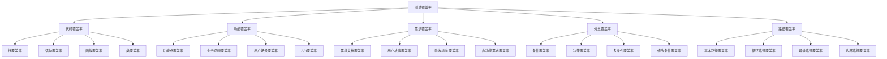

# 测试覆盖率

## 🎯 学习目标
- 理解测试覆盖率的概念和重要性
- 掌握各种测试覆盖率指标的计算方法
- 学会使用工具生成和分析测试覆盖率报告
- 了解测试覆盖率的最佳实践和局限性

## 📚 核心概念

### 测试覆盖率类型



### 覆盖率指标对比

| 覆盖率类型 | 定义 | 计算方式 | 优点 | 缺点 |
|------------|------|----------|------|------|
| 行覆盖率 | 执行过的代码行数比例 | 执行行数/总行数 | 简单直观 | 可能误导 |
| 分支覆盖率 | 执行过的分支数比例 | 执行分支数/总分支数 | 更准确 | 计算复杂 |
| 函数覆盖率 | 调用过的函数数比例 | 调用函数数/总函数数 | 易于理解 | 不够细致 |
| 类覆盖率 | 使用过的类数比例 | 使用类数/总类数 | 面向对象 | 粒度较粗 |
| 条件覆盖率 | 条件表达式覆盖率 | 条件组合数/总组合数 | 逻辑完整 | 组合爆炸 |

## 🔧 测试覆盖率实现

### 基础覆盖率工具
```php
<?php
// 1. 基础覆盖率计算器
class CoverageCalculator {
    private array $executedLines = [];
    private array $totalLines = [];
    private array $executedBranches = [];
    private array $totalBranches = [];
    private array $executedFunctions = [];
    private array $totalFunctions = [];
    
    // 记录执行的代码行
    public function recordExecutedLine(string $file, int $line): void {
        $key = "{$file}:{$line}";
        $this->executedLines[$key] = true;
    }
    
    // 记录总代码行
    public function recordTotalLine(string $file, int $line): void {
        $key = "{$file}:{$line}";
        $this->totalLines[$key] = true;
    }
    
    // 记录执行的分支
    public function recordExecutedBranch(string $file, int $line, string $branch): void {
        $key = "{$file}:{$line}:{$branch}";
        $this->executedBranches[$key] = true;
    }
    
    // 记录总分支
    public function recordTotalBranch(string $file, int $line, string $branch): void {
        $key = "{$file}:{$line}:{$branch}";
        $this->totalBranches[$key] = true;
    }
    
    // 记录执行的函数
    public function recordExecutedFunction(string $file, string $function): void {
        $key = "{$file}:{$function}";
        $this->executedFunctions[$key] = true;
    }
    
    // 记录总函数
    public function recordTotalFunction(string $file, string $function): void {
        $key = "{$file}:{$function}";
        $this->totalFunctions[$key] = true;
    }
    
    // 计算行覆盖率
    public function calculateLineCoverage(): float {
        $executedCount = count($this->executedLines);
        $totalCount = count($this->totalLines);
        
        if ($totalCount === 0) {
            return 0.0;
        }
        
        return ($executedCount / $totalCount) * 100;
    }
    
    // 计算分支覆盖率
    public function calculateBranchCoverage(): float {
        $executedCount = count($this->executedBranches);
        $totalCount = count($this->totalBranches);
        
        if ($totalCount === 0) {
            return 0.0;
        }
        
        return ($executedCount / $totalCount) * 100;
    }
    
    // 计算函数覆盖率
    public function calculateFunctionCoverage(): float {
        $executedCount = count($this->executedFunctions);
        $totalCount = count($this->totalFunctions);
        
        if ($totalCount === 0) {
            return 0.0;
        }
        
        return ($executedCount / $totalCount) * 100;
    }
    
    // 计算总体覆盖率
    public function calculateOverallCoverage(): array {
        return [
            'line_coverage' => $this->calculateLineCoverage(),
            'branch_coverage' => $this->calculateBranchCoverage(),
            'function_coverage' => $this->calculateFunctionCoverage(),
            'executed_lines' => count($this->executedLines),
            'total_lines' => count($this->totalLines),
            'executed_branches' => count($this->executedBranches),
            'total_branches' => count($this->totalBranches),
            'executed_functions' => count($this->executedFunctions),
            'total_functions' => count($this->totalFunctions)
        ];
    }
    
    // 生成覆盖率报告
    public function generateCoverageReport(): string {
        $coverage = $this->calculateOverallCoverage();
        
        $report = "# 测试覆盖率报告\n\n";
        $report .= "## 总体覆盖率\n";
        $report .= "- 行覆盖率: " . number_format($coverage['line_coverage'], 2) . "%\n";
        $report .= "- 分支覆盖率: " . number_format($coverage['branch_coverage'], 2) . "%\n";
        $report .= "- 函数覆盖率: " . number_format($coverage['function_coverage'], 2) . "%\n\n";
        
        $report .= "## 详细统计\n";
        $report .= "- 执行行数: {$coverage['executed_lines']}\n";
        $report .= "- 总行数: {$coverage['total_lines']}\n";
        $report .= "- 执行分支数: {$coverage['executed_branches']}\n";
        $report .= "- 总分支数: {$coverage['total_branches']}\n";
        $report .= "- 执行函数数: {$coverage['executed_functions']}\n";
        $report .= "- 总函数数: {$coverage['total_functions']}\n\n";
        
        return $report;
    }
}

// 2. 高级覆盖率分析器
class AdvancedCoverageAnalyzer {
    private CoverageCalculator $calculator;
    private array $coverageHistory = [];
    private array $coverageThresholds = [];
    
    public function __construct(CoverageCalculator $calculator) {
        $this->calculator = $calculator;
        $this->coverageThresholds = [
            'line_coverage' => 80,
            'branch_coverage' => 70,
            'function_coverage' => 90
        ];
    }
    
    // 分析覆盖率趋势
    public function analyzeCoverageTrend(): array {
        $currentCoverage = $this->calculator->calculateOverallCoverage();
        $this->coverageHistory[] = [
            'timestamp' => time(),
            'coverage' => $currentCoverage
        ];
        
        $trend = [
            'current' => $currentCoverage,
            'trend' => 'stable',
            'improvement' => 0,
            'recommendations' => []
        ];
        
        if (count($this->coverageHistory) > 1) {
            $previousCoverage = $this->coverageHistory[count($this->coverageHistory) - 2]['coverage'];
            
            $lineImprovement = $currentCoverage['line_coverage'] - $previousCoverage['line_coverage'];
            $branchImprovement = $currentCoverage['branch_coverage'] - $previousCoverage['branch_coverage'];
            $functionImprovement = $currentCoverage['function_coverage'] - $previousCoverage['function_coverage'];
            
            $trend['improvement'] = ($lineImprovement + $branchImprovement + $functionImprovement) / 3;
            
            if ($trend['improvement'] > 1) {
                $trend['trend'] = 'improving';
            } elseif ($trend['improvement'] < -1) {
                $trend['trend'] = 'declining';
            }
        }
        
        // 生成建议
        $trend['recommendations'] = $this->generateRecommendations($currentCoverage);
        
        return $trend;
    }
    
    // 生成改进建议
    private function generateRecommendations(array $coverage): array {
        $recommendations = [];
        
        if ($coverage['line_coverage'] < $this->coverageThresholds['line_coverage']) {
            $recommendations[] = "行覆盖率低于阈值，建议增加单元测试";
        }
        
        if ($coverage['branch_coverage'] < $this->coverageThresholds['branch_coverage']) {
            $recommendations[] = "分支覆盖率低于阈值，建议测试条件分支";
        }
        
        if ($coverage['function_coverage'] < $this->coverageThresholds['function_coverage']) {
            $recommendations[] = "函数覆盖率低于阈值，建议测试所有函数";
        }
        
        if (empty($recommendations)) {
            $recommendations[] = "覆盖率良好，继续保持";
        }
        
        return $recommendations;
    }
    
    // 检查覆盖率阈值
    public function checkCoverageThresholds(): array {
        $coverage = $this->calculator->calculateOverallCoverage();
        $results = [];
        
        foreach ($this->coverageThresholds as $type => $threshold) {
            $current = $coverage[$type];
            $results[$type] = [
                'current' => $current,
                'threshold' => $threshold,
                'passed' => $current >= $threshold,
                'gap' => $threshold - $current
            ];
        }
        
        return $results;
    }
    
    // 生成覆盖率报告
    public function generateDetailedReport(): string {
        $coverage = $this->calculator->calculateOverallCoverage();
        $trend = $this->analyzeCoverageTrend();
        $thresholds = $this->checkCoverageThresholds();
        
        $report = "# 详细测试覆盖率报告\n\n";
        
        $report .= "## 覆盖率概览\n";
        $report .= "| 类型 | 当前值 | 阈值 | 状态 | 差距 |\n";
        $report .= "|------|--------|------|------|------|\n";
        
        foreach ($thresholds as $type => $data) {
            $status = $data['passed'] ? '✅ 通过' : '❌ 未通过';
            $report .= "| {$type} | " . number_format($data['current'], 2) . "% | {$data['threshold']}% | {$status} | " . number_format($data['gap'], 2) . "% |\n";
        }
        
        $report .= "\n## 趋势分析\n";
        $report .= "- 趋势: {$trend['trend']}\n";
        $report .= "- 改进: " . number_format($trend['improvement'], 2) . "%\n";
        
        $report .= "\n## 改进建议\n";
        foreach ($trend['recommendations'] as $recommendation) {
            $report .= "- {$recommendation}\n";
        }
        
        return $report;
    }
}

// 3. 覆盖率可视化工具
class CoverageVisualizer {
    private array $coverageData = [];
    
    // 生成覆盖率图表数据
    public function generateCoverageChartData(array $coverageHistory): array {
        $chartData = [
            'labels' => [],
            'datasets' => [
                [
                    'label' => '行覆盖率',
                    'data' => [],
                    'borderColor' => 'rgb(75, 192, 192)',
                    'backgroundColor' => 'rgba(75, 192, 192, 0.2)'
                ],
                [
                    'label' => '分支覆盖率',
                    'data' => [],
                    'borderColor' => 'rgb(255, 99, 132)',
                    'backgroundColor' => 'rgba(255, 99, 132, 0.2)'
                ],
                [
                    'label' => '函数覆盖率',
                    'data' => [],
                    'borderColor' => 'rgb(54, 162, 235)',
                    'backgroundColor' => 'rgba(54, 162, 235, 0.2)'
                ]
            ]
        ];
        
        foreach ($coverageHistory as $entry) {
            $chartData['labels'][] = date('Y-m-d H:i', $entry['timestamp']);
            $chartData['datasets'][0]['data'][] = $entry['coverage']['line_coverage'];
            $chartData['datasets'][1]['data'][] = $entry['coverage']['branch_coverage'];
            $chartData['datasets'][2]['data'][] = $entry['coverage']['function_coverage'];
        }
        
        return $chartData;
    }
    
    // 生成覆盖率热力图数据
    public function generateCoverageHeatmapData(array $fileCoverage): array {
        $heatmapData = [];
        
        foreach ($fileCoverage as $file => $coverage) {
            $heatmapData[] = [
                'file' => $file,
                'line_coverage' => $coverage['line_coverage'],
                'branch_coverage' => $coverage['branch_coverage'],
                'function_coverage' => $coverage['function_coverage'],
                'overall_coverage' => ($coverage['line_coverage'] + $coverage['branch_coverage'] + $coverage['function_coverage']) / 3
            ];
        }
        
        // 按总体覆盖率排序
        usort($heatmapData, function($a, $b) {
            return $b['overall_coverage'] <=> $a['overall_coverage'];
        });
        
        return $heatmapData;
    }
    
    // 生成覆盖率报告HTML
    public function generateCoverageReportHTML(array $coverageData): string {
        $html = "
        <!DOCTYPE html>
        <html>
        <head>
            <title>测试覆盖率报告</title>
            <style>
                body { font-family: Arial, sans-serif; margin: 20px; }
                .coverage-summary { background: #f5f5f5; padding: 20px; border-radius: 5px; }
                .coverage-item { margin: 10px 0; }
                .coverage-bar { background: #ddd; height: 20px; border-radius: 10px; overflow: hidden; }
                .coverage-fill { height: 100%; transition: width 0.3s; }
                .coverage-high { background: #4CAF50; }
                .coverage-medium { background: #FF9800; }
                .coverage-low { background: #F44336; }
                table { width: 100%; border-collapse: collapse; margin: 20px 0; }
                th, td { border: 1px solid #ddd; padding: 8px; text-align: left; }
                th { background-color: #f2f2f2; }
            </style>
        </head>
        <body>
            <h1>测试覆盖率报告</h1>
            
            <div class='coverage-summary'>
                <h2>覆盖率概览</h2>
                <div class='coverage-item'>
                    <label>行覆盖率: {$coverageData['line_coverage']}%</label>
                    <div class='coverage-bar'>
                        <div class='coverage-fill coverage-high' style='width: {$coverageData['line_coverage']}%'></div>
                    </div>
                </div>
                <div class='coverage-item'>
                    <label>分支覆盖率: {$coverageData['branch_coverage']}%</label>
                    <div class='coverage-bar'>
                        <div class='coverage-fill coverage-medium' style='width: {$coverageData['branch_coverage']}%'></div>
                    </div>
                </div>
                <div class='coverage-item'>
                    <label>函数覆盖率: {$coverageData['function_coverage']}%</label>
                    <div class='coverage-bar'>
                        <div class='coverage-fill coverage-low' style='width: {$coverageData['function_coverage']}%'></div>
                    </div>
                </div>
            </div>
            
            <h2>详细统计</h2>
            <table>
                <tr>
                    <th>指标</th>
                    <th>执行数</th>
                    <th>总数</th>
                    <th>覆盖率</th>
                </tr>
                <tr>
                    <td>代码行</td>
                    <td>{$coverageData['executed_lines']}</td>
                    <td>{$coverageData['total_lines']}</td>
                    <td>{$coverageData['line_coverage']}%</td>
                </tr>
                <tr>
                    <td>分支</td>
                    <td>{$coverageData['executed_branches']}</td>
                    <td>{$coverageData['total_branches']}</td>
                    <td>{$coverageData['branch_coverage']}%</td>
                </tr>
                <tr>
                    <td>函数</td>
                    <td>{$coverageData['executed_functions']}</td>
                    <td>{$coverageData['total_functions']}</td>
                    <td>{$coverageData['function_coverage']}%</td>
                </tr>
            </table>
        </body>
        </html>
        ";
        
        return $html;
    }
}

// 4. 覆盖率集成工具
class CoverageIntegrationTool {
    private CoverageCalculator $calculator;
    private AdvancedCoverageAnalyzer $analyzer;
    private CoverageVisualizer $visualizer;
    
    public function __construct() {
        $this->calculator = new CoverageCalculator();
        $this->analyzer = new AdvancedCoverageAnalyzer($this->calculator);
        $this->visualizer = new CoverageVisualizer();
    }
    
    // 模拟测试执行并记录覆盖率
    public function simulateTestExecution(): void {
        // 模拟执行Calculator类的测试
        $this->calculator->recordTotalLine('Calculator.php', 10);
        $this->calculator->recordTotalLine('Calculator.php', 11);
        $this->calculator->recordTotalLine('Calculator.php', 12);
        $this->calculator->recordTotalLine('Calculator.php', 13);
        
        $this->calculator->recordExecutedLine('Calculator.php', 10);
        $this->calculator->recordExecutedLine('Calculator.php', 11);
        $this->calculator->recordExecutedLine('Calculator.php', 12);
        // 第13行未执行
        
        // 记录函数
        $this->calculator->recordTotalFunction('Calculator.php', 'add');
        $this->calculator->recordTotalFunction('Calculator.php', 'subtract');
        $this->calculator->recordTotalFunction('Calculator.php', 'multiply');
        
        $this->calculator->recordExecutedFunction('Calculator.php', 'add');
        $this->calculator->recordExecutedFunction('Calculator.php', 'subtract');
        // multiply函数未执行
        
        // 记录分支
        $this->calculator->recordTotalBranch('Calculator.php', 15, 'if');
        $this->calculator->recordTotalBranch('Calculator.php', 15, 'else');
        $this->calculator->recordTotalBranch('Calculator.php', 20, 'if');
        $this->calculator->recordTotalBranch('Calculator.php', 20, 'else');
        
        $this->calculator->recordExecutedBranch('Calculator.php', 15, 'if');
        $this->calculator->recordExecutedBranch('Calculator.php', 20, 'if');
        // else分支未执行
    }
    
    // 生成完整覆盖率报告
    public function generateCompleteReport(): string {
        $this->simulateTestExecution();
        
        $coverage = $this->calculator->calculateOverallCoverage();
        $trend = $this->analyzer->analyzeCoverageTrend();
        $thresholds = $this->analyzer->checkCoverageThresholds();
        
        $report = "# 完整测试覆盖率报告\n\n";
        
        $report .= "## 执行时间\n";
        $report .= "生成时间: " . date('Y-m-d H:i:s') . "\n\n";
        
        $report .= "## 覆盖率概览\n";
        $report .= "- 行覆盖率: " . number_format($coverage['line_coverage'], 2) . "%\n";
        $report .= "- 分支覆盖率: " . number_format($coverage['branch_coverage'], 2) . "%\n";
        $report .= "- 函数覆盖率: " . number_format($coverage['function_coverage'], 2) . "%\n\n";
        
        $report .= "## 阈值检查\n";
        foreach ($thresholds as $type => $data) {
            $status = $data['passed'] ? '✅ 通过' : '❌ 未通过';
            $report .= "- {$type}: {$data['current']}% (阈值: {$data['threshold']}%) - {$status}\n";
        }
        
        $report .= "\n## 趋势分析\n";
        $report .= "- 趋势: {$trend['trend']}\n";
        $report .= "- 改进: " . number_format($trend['improvement'], 2) . "%\n";
        
        $report .= "\n## 改进建议\n";
        foreach ($trend['recommendations'] as $recommendation) {
            $report .= "- {$recommendation}\n";
        }
        
        return $report;
    }
    
    // 导出覆盖率数据
    public function exportCoverageData(string $format = 'json'): string {
        $coverage = $this->calculator->calculateOverallCoverage();
        
        switch ($format) {
            case 'json':
                return json_encode($coverage, JSON_PRETTY_PRINT);
            case 'xml':
                return $this->generateXMLReport($coverage);
            case 'csv':
                return $this->generateCSVReport($coverage);
            default:
                throw new InvalidArgumentException("Unsupported format: {$format}");
        }
    }
    
    // 生成XML报告
    private function generateXMLReport(array $coverage): string {
        $xml = new SimpleXMLElement('<coverage></coverage>');
        $xml->addAttribute('generated', date('c'));
        
        $summary = $xml->addChild('summary');
        $summary->addAttribute('line-coverage', $coverage['line_coverage']);
        $summary->addAttribute('branch-coverage', $coverage['branch_coverage']);
        $summary->addAttribute('function-coverage', $coverage['function_coverage']);
        
        $details = $xml->addChild('details');
        $details->addChild('executed-lines', $coverage['executed_lines']);
        $details->addChild('total-lines', $coverage['total_lines']);
        $details->addChild('executed-branches', $coverage['executed_branches']);
        $details->addChild('total-branches', $coverage['total_branches']);
        $details->addChild('executed-functions', $coverage['executed_functions']);
        $details->addChild('total-functions', $coverage['total_functions']);
        
        return $xml->asXML();
    }
    
    // 生成CSV报告
    private function generateCSVReport(array $coverage): string {
        $csv = "Metric,Executed,Total,Coverage\n";
        $csv .= "Lines,{$coverage['executed_lines']},{$coverage['total_lines']},{$coverage['line_coverage']}%\n";
        $csv .= "Branches,{$coverage['executed_branches']},{$coverage['total_branches']},{$coverage['branch_coverage']}%\n";
        $csv .= "Functions,{$coverage['executed_functions']},{$coverage['total_functions']},{$coverage['function_coverage']}%\n";
        
        return $csv;
    }
}

// 使用示例
echo "=== 测试覆盖率示例 ===\n";

try {
    // 创建覆盖率集成工具
    $coverageTool = new CoverageIntegrationTool();
    
    // 生成完整报告
    $report = $coverageTool->generateCompleteReport();
    echo $report . "\n";
    
    // 导出不同格式的数据
    echo "JSON格式:\n";
    echo $coverageTool->exportCoverageData('json') . "\n\n";
    
    echo "CSV格式:\n";
    echo $coverageTool->exportCoverageData('csv') . "\n\n";
    
} catch (Exception $e) {
    echo "错误: " . $e->getMessage() . "\n";
}
?>
```

## 📊 最佳实践

### 测试覆盖率最佳实践
```php
<?php
// 测试覆盖率最佳实践

class CoverageBestPractices {
    // 1. 覆盖率目标设定
    public static function getCoverageTargets() {
        return [
            '行覆盖率' => [
                '最低目标' => 70,
                '推荐目标' => 80,
                '优秀目标' => 90,
                '说明' => '确保大部分代码被执行'
            ],
            '分支覆盖率' => [
                '最低目标' => 60,
                '推荐目标' => 70,
                '优秀目标' => 80,
                '说明' => '确保条件分支被测试'
            ],
            '函数覆盖率' => [
                '最低目标' => 80,
                '推荐目标' => 90,
                '优秀目标' => 95,
                '说明' => '确保所有函数被调用'
            ],
            '类覆盖率' => [
                '最低目标' => 85,
                '推荐目标' => 90,
                '优秀目标' => 95,
                '说明' => '确保所有类被使用'
            ]
        ];
    }
    
    // 2. 覆盖率分析策略
    public static function getCoverageAnalysisStrategy() {
        return [
            '覆盖率分析' => [
                '趋势分析' => '跟踪覆盖率变化趋势',
                '阈值检查' => '设置覆盖率阈值并检查',
                '热点分析' => '识别覆盖率低的代码区域',
                '质量评估' => '结合覆盖率评估代码质量'
            ],
            '改进策略' => [
                '优先级排序' => '按重要性排序改进项',
                '增量改进' => '逐步提高覆盖率',
                '测试补充' => '补充缺失的测试用例',
                '代码重构' => '重构难以测试的代码'
            ]
        ];
    }
    
    // 3. 覆盖率工具使用
    public static function getCoverageToolUsage() {
        return [
            '工具选择' => [
                'Xdebug' => 'PHP代码覆盖率分析',
                'PHPUnit' => '测试框架集成覆盖率',
                'Codecov' => '在线覆盖率报告',
                'SonarQube' => '代码质量分析平台'
            ],
            '报告生成' => [
                'HTML报告' => '可视化覆盖率报告',
                'XML报告' => '机器可读的覆盖率数据',
                'JSON报告' => 'API集成的覆盖率数据',
                'CSV报告' => '数据分析的覆盖率数据'
            ]
        ];
    }
}

// 使用示例
echo "=== 测试覆盖率最佳实践示例 ===\n";

try {
    $targets = CoverageBestPractices::getCoverageTargets();
    echo "覆盖率目标设定:\n";
    foreach ($targets as $type => $target) {
        echo "  $type:\n";
        foreach ($target as $key => $value) {
            echo "    - $key: $value\n";
        }
        echo "\n";
    }
    
} catch (Exception $e) {
    echo "错误: " . $e->getMessage() . "\n";
}
?>
```

## 🎓 学习建议

### 费曼学习法应用
1. **选择概念**: 选择测试覆盖率中的核心概念
2. **简化解释**: 用简单语言解释测试覆盖率的作用
3. **识别盲点**: 发现理解不深入的地方
4. **重新学习**: 针对盲点进行深入学习

### 刻意练习重点
1. **覆盖率计算**: 掌握各种覆盖率指标的计算方法
2. **工具使用**: 学会使用覆盖率分析工具
3. **报告生成**: 掌握覆盖率报告的生成和分析
4. **最佳实践**: 遵循测试覆盖率的最佳实践

## 🔗 相关链接
- [[01-单元测试|单元测试]]
- [[02-集成测试|集成测试]]
- [[03-功能测试|功能测试]]
- [[04-TDD开发模式|TDD开发模式]]
- [[05-PHPUnit使用|PHPUnit使用]]
- [[07-测试策略规划|测试策略规划]]
