# 测试策略规划

## 🎯 学习目标
- 理解测试策略规划的重要性和原则
- 掌握测试策略制定的方法和步骤
- 学会根据项目特点制定合适的测试策略
- 了解测试策略的执行、监控和优化

## 📚 核心概念

### 测试策略规划框架

```mermaid
graph TD
    A[测试策略规划] --> B[需求分析]
    A --> C[风险评估]
    A --> D[资源规划]
    A --> E[测试设计]
    A --> F[执行计划]
    A --> G[质量保证]
    A --> H[持续改进]
    
    B --> B1[功能需求分析]
    B --> B2[非功能需求分析]
    B --> B3[用户需求分析]
    B --> B4[业务需求分析]
    
    C --> C1[技术风险识别]
    C --> C2[业务风险识别]
    C --> C3[质量风险识别]
    C --> C4[进度风险识别]
    
    D --> D1[人力资源规划]
    D --> D2[时间资源规划]
    D --> D3[工具资源规划]
    D --> D4[环境资源规划]
    
    E --> E1[测试类型设计]
    E --> E2[测试方法设计]
    E --> E3[测试用例设计]
    E --> E4[测试数据设计]
    
    F --> F1[测试执行计划]
    F --> F2[测试环境计划]
    F --> F3[测试工具计划]
    F --> F4[测试进度计划]
    
    G --> G1[质量标准制定]
    G --> G2[质量检查机制]
    G --> G3[质量报告机制]
    G --> G4[质量改进机制]
    
    H --> H1[策略评估]
    H --> H2[策略调整]
    H --> H3[经验总结]
    H --> H4[最佳实践]
```



### 测试策略类型对比

| 策略类型 | 适用场景 | 优势 | 劣势 | 实施难度 |
|----------|----------|------|------|----------|
| 瀑布式测试 | 需求明确、变更少 | 计划性强、质量可控 | 灵活性差、响应慢 | 低 |
| 敏捷测试 | 需求变化频繁 | 灵活响应、快速反馈 | 计划性弱、质量风险 | 中 |
| 风险驱动测试 | 高风险项目 | 重点突出、效率高 | 可能遗漏低风险问题 | 高 |
| 探索性测试 | 创新性项目 | 发现未知问题 | 难以量化、重复性差 | 中 |
| 自动化测试 | 重复性测试 | 效率高、一致性好 | 初期投入大、维护成本高 | 高 |

## 🔧 测试策略实现

### 基础测试策略规划器
```php
<?php
// 1. 测试策略规划器
class TestStrategyPlanner {
    private array $projectRequirements = [];
    private array $riskAssessment = [];
    private array $resourceConstraints = [];
    private array $qualityGoals = [];
    private array $testStrategy = [];
    
    // 设置项目需求
    public function setProjectRequirements(array $requirements): void {
        $this->projectRequirements = $requirements;
    }
    
    // 设置风险评估
    public function setRiskAssessment(array $risks): void {
        $this->riskAssessment = $risks;
    }
    
    // 设置资源约束
    public function setResourceConstraints(array $constraints): void {
        $this->resourceConstraints = $constraints;
    }
    
    // 设置质量目标
    public function setQualityGoals(array $goals): void {
        $this->qualityGoals = $goals;
    }
    
    // 制定测试策略
    public function developTestStrategy(): array {
        $this->testStrategy = [
            'strategy_type' => $this->determineStrategyType(),
            'test_levels' => $this->defineTestLevels(),
            'test_types' => $this->defineTestTypes(),
            'test_approach' => $this->defineTestApproach(),
            'test_environment' => $this->defineTestEnvironment(),
            'test_tools' => $this->defineTestTools(),
            'test_schedule' => $this->defineTestSchedule(),
            'quality_criteria' => $this->defineQualityCriteria(),
            'risk_mitigation' => $this->defineRiskMitigation(),
            'success_metrics' => $this->defineSuccessMetrics()
        ];
        
        return $this->testStrategy;
    }
    
    // 确定策略类型
    private function determineStrategyType(): string {
        $projectType = $this->projectRequirements['type'] ?? 'web';
        $complexity = $this->projectRequirements['complexity'] ?? 'medium';
        $timeline = $this->projectRequirements['timeline'] ?? 'normal';
        
        if ($timeline === 'agile' || $timeline === 'short') {
            return 'agile_testing';
        } elseif ($complexity === 'high' || $this->hasHighRisks()) {
            return 'risk_driven_testing';
        } elseif ($projectType === 'enterprise' || $projectType === 'critical') {
            return 'comprehensive_testing';
        } else {
            return 'balanced_testing';
        }
    }
    
    // 定义测试级别
    private function defineTestLevels(): array {
        $levels = ['unit', 'integration', 'system', 'acceptance'];
        
        // 根据项目特点调整测试级别
        if ($this->projectRequirements['type'] === 'api') {
            $levels = ['unit', 'integration', 'api', 'contract'];
        } elseif ($this->projectRequirements['type'] === 'mobile') {
            $levels = ['unit', 'integration', 'system', 'mobile', 'usability'];
        }
        
        return $levels;
    }
    
    // 定义测试类型
    private function defineTestTypes(): array {
        $types = [
            'functional' => ['priority' => 'high', 'coverage' => 80],
            'non_functional' => ['priority' => 'medium', 'coverage' => 60],
            'security' => ['priority' => 'high', 'coverage' => 70],
            'performance' => ['priority' => 'medium', 'coverage' => 50],
            'usability' => ['priority' => 'low', 'coverage' => 30]
        ];
        
        // 根据风险评估调整测试类型优先级
        foreach ($this->riskAssessment as $risk) {
            if ($risk['type'] === 'security' && $risk['level'] === 'high') {
                $types['security']['priority'] = 'critical';
                $types['security']['coverage'] = 90;
            }
        }
        
        return $types;
    }
    
    // 定义测试方法
    private function defineTestApproach(): array {
        $approach = [
            'test_design' => 'black_box',
            'test_execution' => 'manual',
            'test_automation' => 'partial',
            'test_data' => 'synthetic',
            'test_environment' => 'staged'
        ];
        
        // 根据资源约束调整测试方法
        if ($this->resourceConstraints['budget'] === 'low') {
            $approach['test_automation'] = 'high';
            $approach['test_execution'] = 'automated';
        }
        
        if ($this->resourceConstraints['time'] === 'short') {
            $approach['test_design'] = 'risk_based';
            $approach['test_execution'] = 'parallel';
        }
        
        return $approach;
    }
    
    // 定义测试环境
    private function defineTestEnvironment(): array {
        return [
            'development' => [
                'purpose' => '单元测试和开发测试',
                'data' => 'synthetic',
                'access' => 'developers'
            ],
            'staging' => [
                'purpose' => '集成测试和系统测试',
                'data' => 'anonymized_production',
                'access' => 'testers'
            ],
            'production' => [
                'purpose' => '用户验收测试',
                'data' => 'production',
                'access' => 'limited'
            ]
        ];
    }
    
    // 定义测试工具
    private function defineTestTools(): array {
        $tools = [
            'unit_testing' => 'PHPUnit',
            'integration_testing' => 'PHPUnit + Mockery',
            'api_testing' => 'Postman + Newman',
            'performance_testing' => 'JMeter',
            'security_testing' => 'OWASP ZAP',
            'code_coverage' => 'Xdebug',
            'test_management' => 'TestRail',
            'ci_cd' => 'Jenkins'
        ];
        
        // 根据预算调整工具选择
        if ($this->resourceConstraints['budget'] === 'low') {
            $tools['test_management'] = 'Excel';
            $tools['ci_cd'] = 'GitHub Actions';
        }
        
        return $tools;
    }
    
    // 定义测试计划
    private function defineTestSchedule(): array {
        $schedule = [
            'planning_phase' => [
                'duration' => '1 week',
                'activities' => ['需求分析', '测试设计', '环境准备']
            ],
            'execution_phase' => [
                'duration' => '4 weeks',
                'activities' => ['单元测试', '集成测试', '系统测试']
            ],
            'reporting_phase' => [
                'duration' => '1 week',
                'activities' => ['测试报告', '缺陷分析', '质量评估']
            ]
        ];
        
        // 根据项目时间调整计划
        if ($this->projectRequirements['timeline'] === 'short') {
            $schedule['planning_phase']['duration'] = '3 days';
            $schedule['execution_phase']['duration'] = '2 weeks';
            $schedule['reporting_phase']['duration'] = '2 days';
        }
        
        return $schedule;
    }
    
    // 定义质量标准
    private function defineQualityCriteria(): array {
        return [
            'defect_density' => [
                'target' => '< 5 defects/KLOC',
                'threshold' => '< 10 defects/KLOC'
            ],
            'test_coverage' => [
                'line_coverage' => '>= 80%',
                'branch_coverage' => '>= 70%',
                'function_coverage' => '>= 90%'
            ],
            'performance_criteria' => [
                'response_time' => '< 2 seconds',
                'throughput' => '> 1000 requests/minute',
                'availability' => '> 99.9%'
            ],
            'security_criteria' => [
                'vulnerability_scan' => '0 critical, < 5 high',
                'penetration_test' => 'pass',
                'compliance' => 'meet requirements'
            ]
        ];
    }
    
    // 定义风险缓解
    private function defineRiskMitigation(): array {
        $mitigation = [];
        
        foreach ($this->riskAssessment as $risk) {
            $mitigation[$risk['id']] = [
                'risk' => $risk['description'],
                'impact' => $risk['impact'],
                'probability' => $risk['probability'],
                'mitigation_strategy' => $this->getMitigationStrategy($risk),
                'contingency_plan' => $this->getContingencyPlan($risk)
            ];
        }
        
        return $mitigation;
    }
    
    // 定义成功指标
    private function defineSuccessMetrics(): array {
        return [
            'quality_metrics' => [
                'defect_escape_rate' => '< 5%',
                'customer_satisfaction' => '> 4.0/5.0',
                'post_release_defects' => '< 10'
            ],
            'efficiency_metrics' => [
                'test_automation_rate' => '> 70%',
                'test_execution_time' => '< 4 hours',
                'defect_fix_time' => '< 2 days'
            ],
            'coverage_metrics' => [
                'requirements_coverage' => '100%',
                'code_coverage' => '> 80%',
                'test_case_coverage' => '> 90%'
            ]
        ];
    }
    
    // 检查是否有高风险
    private function hasHighRisks(): bool {
        foreach ($this->riskAssessment as $risk) {
            if ($risk['level'] === 'high' || $risk['level'] === 'critical') {
                return true;
            }
        }
        return false;
    }
    
    // 获取缓解策略
    private function getMitigationStrategy(array $risk): string {
        switch ($risk['type']) {
            case 'technical':
                return '增加技术审查和代码质量检查';
            case 'schedule':
                return '调整测试计划，增加并行测试';
            case 'resource':
                return '重新分配资源，使用自动化工具';
            case 'quality':
                return '加强质量检查，增加测试覆盖';
            default:
                return '制定专门的风险缓解计划';
        }
    }
    
    // 获取应急计划
    private function getContingencyPlan(array $risk): string {
        switch ($risk['type']) {
            case 'technical':
                return '启用备用技术方案，寻求外部支持';
            case 'schedule':
                return '压缩非关键功能测试，延长测试时间';
            case 'resource':
                return '临时增加人员，外包部分测试工作';
            case 'quality':
                return '降低质量要求，增加后续维护';
            default:
                return '启动应急响应程序';
        }
    }
    
    // 生成测试策略报告
    public function generateStrategyReport(): string {
        $strategy = $this->testStrategy;
        
        $report = "# 测试策略规划报告\n\n";
        
        $report .= "## 项目概述\n";
        $report .= "- 项目类型: {$this->projectRequirements['type']}\n";
        $report .= "- 项目复杂度: {$this->projectRequirements['complexity']}\n";
        $report .= "- 项目时间线: {$this->projectRequirements['timeline']}\n\n";
        
        $report .= "## 测试策略\n";
        $report .= "- 策略类型: {$strategy['strategy_type']}\n";
        $report .= "- 测试级别: " . implode(', ', $strategy['test_levels']) . "\n";
        $report .= "- 测试方法: {$strategy['test_approach']['test_design']}\n\n";
        
        $report .= "## 测试类型和优先级\n";
        foreach ($strategy['test_types'] as $type => $config) {
            $report .= "- {$type}: 优先级({$config['priority']}), 覆盖率({$config['coverage']}%)\n";
        }
        $report .= "\n";
        
        $report .= "## 测试工具\n";
        foreach ($strategy['test_tools'] as $category => $tool) {
            $report .= "- {$category}: {$tool}\n";
        }
        $report .= "\n";
        
        $report .= "## 测试计划\n";
        foreach ($strategy['test_schedule'] as $phase => $details) {
            $report .= "- {$phase}: {$details['duration']}\n";
            foreach ($details['activities'] as $activity) {
                $report .= "  - {$activity}\n";
            }
        }
        $report .= "\n";
        
        $report .= "## 质量标准\n";
        foreach ($strategy['quality_criteria'] as $category => $criteria) {
            $report .= "- {$category}:\n";
            foreach ($criteria as $metric => $value) {
                $report .= "  - {$metric}: {$value}\n";
            }
        }
        $report .= "\n";
        
        $report .= "## 风险缓解\n";
        foreach ($strategy['risk_mitigation'] as $riskId => $mitigation) {
            $report .= "- 风险 {$riskId}: {$mitigation['risk']}\n";
            $report .= "  - 影响: {$mitigation['impact']}\n";
            $report .= "  - 概率: {$mitigation['probability']}\n";
            $report .= "  - 缓解策略: {$mitigation['mitigation_strategy']}\n";
            $report .= "  - 应急计划: {$mitigation['contingency_plan']}\n";
        }
        $report .= "\n";
        
        $report .= "## 成功指标\n";
        foreach ($strategy['success_metrics'] as $category => $metrics) {
            $report .= "- {$category}:\n";
            foreach ($metrics as $metric => $target) {
                $report .= "  - {$metric}: {$target}\n";
            }
        }
        
        return $report;
    }
}

// 2. 测试策略执行监控器
class TestStrategyMonitor {
    private array $strategy;
    private array $executionStatus = [];
    private array $metrics = [];
    private array $issues = [];
    
    public function __construct(array $strategy) {
        $this->strategy = $strategy;
    }
    
    // 监控测试执行状态
    public function monitorExecution(): array {
        $this->executionStatus = [
            'current_phase' => 'execution',
            'progress' => 65,
            'completed_tests' => 130,
            'total_tests' => 200,
            'passed_tests' => 120,
            'failed_tests' => 10,
            'blocked_tests' => 0,
            'defects_found' => 15,
            'defects_fixed' => 12,
            'defects_open' => 3
        ];
        
        return $this->executionStatus;
    }
    
    // 收集测试指标
    public function collectMetrics(): array {
        $this->metrics = [
            'quality_metrics' => [
                'defect_density' => 3.2,
                'test_coverage' => 85,
                'defect_escape_rate' => 2.1
            ],
            'efficiency_metrics' => [
                'test_automation_rate' => 75,
                'test_execution_time' => 3.5,
                'defect_fix_time' => 1.8
            ],
            'progress_metrics' => [
                'schedule_adherence' => 95,
                'budget_utilization' => 88,
                'resource_utilization' => 92
            ]
        ];
        
        return $this->metrics;
    }
    
    // 识别问题和风险
    public function identifyIssues(): array {
        $this->issues = [];
        
        // 检查进度问题
        if ($this->executionStatus['progress'] < 70 && $this->executionStatus['current_phase'] === 'execution') {
            $this->issues[] = [
                'type' => 'schedule',
                'severity' => 'high',
                'description' => '测试进度滞后，可能影响交付时间',
                'recommendation' => '增加测试资源或调整测试范围'
            ];
        }
        
        // 检查质量问题
        if ($this->metrics['quality_metrics']['defect_density'] > 5) {
            $this->issues[] = [
                'type' => 'quality',
                'severity' => 'medium',
                'description' => '缺陷密度超过目标值',
                'recommendation' => '加强代码审查和测试覆盖'
            ];
        }
        
        // 检查效率问题
        if ($this->metrics['efficiency_metrics']['test_automation_rate'] < 70) {
            $this->issues[] = [
                'type' => 'efficiency',
                'severity' => 'low',
                'description' => '测试自动化率低于目标',
                'recommendation' => '增加自动化测试投入'
            ];
        }
        
        return $this->issues;
    }
    
    // 生成监控报告
    public function generateMonitoringReport(): string {
        $status = $this->monitorExecution();
        $metrics = $this->collectMetrics();
        $issues = $this->identifyIssues();
        
        $report = "# 测试策略执行监控报告\n\n";
        
        $report .= "## 执行状态\n";
        $report .= "- 当前阶段: {$status['current_phase']}\n";
        $report .= "- 完成进度: {$status['progress']}%\n";
        $report .= "- 已完成测试: {$status['completed_tests']}/{$status['total_tests']}\n";
        $report .= "- 通过测试: {$status['passed_tests']}\n";
        $report .= "- 失败测试: {$status['failed_tests']}\n";
        $report .= "- 发现缺陷: {$status['defects_found']}\n";
        $report .= "- 已修复缺陷: {$status['defects_fixed']}\n";
        $report .= "- 开放缺陷: {$status['defects_open']}\n\n";
        
        $report .= "## 关键指标\n";
        $report .= "### 质量指标\n";
        foreach ($metrics['quality_metrics'] as $metric => $value) {
            $report .= "- {$metric}: {$value}\n";
        }
        
        $report .= "\n### 效率指标\n";
        foreach ($metrics['efficiency_metrics'] as $metric => $value) {
            $report .= "- {$metric}: {$value}\n";
        }
        
        $report .= "\n### 进度指标\n";
        foreach ($metrics['progress_metrics'] as $metric => $value) {
            $report .= "- {$metric}: {$value}%\n";
        }
        
        $report .= "\n## 问题和风险\n";
        if (empty($issues)) {
            $report .= "未发现重大问题\n";
        } else {
            foreach ($issues as $issue) {
                $report .= "- **{$issue['type']}** (严重程度: {$issue['severity']})\n";
                $report .= "  - 问题: {$issue['description']}\n";
                $report .= "  - 建议: {$issue['recommendation']}\n";
            }
        }
        
        return $report;
    }
}

// 3. 测试策略优化器
class TestStrategyOptimizer {
    private array $strategy;
    private array $executionData;
    private array $optimizationSuggestions = [];
    
    public function __construct(array $strategy, array $executionData) {
        $this->strategy = $strategy;
        $this->executionData = $executionData;
    }
    
    // 分析策略效果
    public function analyzeStrategyEffectiveness(): array {
        $analysis = [
            'effectiveness_score' => 0,
            'strengths' => [],
            'weaknesses' => [],
            'improvement_areas' => []
        ];
        
        // 计算效果分数
        $qualityScore = $this->calculateQualityScore();
        $efficiencyScore = $this->calculateEfficiencyScore();
        $coverageScore = $this->calculateCoverageScore();
        
        $analysis['effectiveness_score'] = ($qualityScore + $efficiencyScore + $coverageScore) / 3;
        
        // 识别优势和劣势
        if ($qualityScore > 80) {
            $analysis['strengths'][] = '质量目标达成良好';
        } else {
            $analysis['weaknesses'][] = '质量目标未完全达成';
        }
        
        if ($efficiencyScore > 80) {
            $analysis['strengths'][] = '测试效率较高';
        } else {
            $analysis['weaknesses'][] = '测试效率有待提高';
        }
        
        if ($coverageScore > 80) {
            $analysis['strengths'][] = '测试覆盖充分';
        } else {
            $analysis['weaknesses'][] = '测试覆盖不足';
        }
        
        return $analysis;
    }
    
    // 生成优化建议
    public function generateOptimizationSuggestions(): array {
        $suggestions = [];
        
        // 基于效果分析生成建议
        $analysis = $this->analyzeStrategyEffectiveness();
        
        if ($analysis['effectiveness_score'] < 70) {
            $suggestions[] = [
                'category' => 'strategy',
                'priority' => 'high',
                'suggestion' => '重新评估测试策略，考虑调整测试方法和工具',
                'impact' => 'high',
                'effort' => 'medium'
            ];
        }
        
        if (in_array('质量目标未完全达成', $analysis['weaknesses'])) {
            $suggestions[] = [
                'category' => 'quality',
                'priority' => 'high',
                'suggestion' => '加强质量检查，增加测试覆盖和审查',
                'impact' => 'high',
                'effort' => 'low'
            ];
        }
        
        if (in_array('测试效率有待提高', $analysis['weaknesses'])) {
            $suggestions[] = [
                'category' => 'efficiency',
                'priority' => 'medium',
                'suggestion' => '增加自动化测试，优化测试流程',
                'impact' => 'medium',
                'effort' => 'high'
            ];
        }
        
        if (in_array('测试覆盖不足', $analysis['weaknesses'])) {
            $suggestions[] = [
                'category' => 'coverage',
                'priority' => 'medium',
                'suggestion' => '补充测试用例，增加边界和异常测试',
                'impact' => 'medium',
                'effort' => 'medium'
            ];
        }
        
        $this->optimizationSuggestions = $suggestions;
        return $suggestions;
    }
    
    // 计算质量分数
    private function calculateQualityScore(): float {
        $defectDensity = $this->executionData['metrics']['quality_metrics']['defect_density'] ?? 5;
        $defectEscapeRate = $this->executionData['metrics']['quality_metrics']['defect_escape_rate'] ?? 5;
        
        $score = 100;
        $score -= max(0, ($defectDensity - 3) * 10);
        $score -= max(0, ($defectEscapeRate - 2) * 15);
        
        return max(0, min(100, $score));
    }
    
    // 计算效率分数
    private function calculateEfficiencyScore(): float {
        $automationRate = $this->executionData['metrics']['efficiency_metrics']['test_automation_rate'] ?? 50;
        $executionTime = $this->executionData['metrics']['efficiency_metrics']['test_execution_time'] ?? 8;
        
        $score = 100;
        $score -= max(0, (70 - $automationRate) * 0.5);
        $score -= max(0, ($executionTime - 4) * 5);
        
        return max(0, min(100, $score));
    }
    
    // 计算覆盖分数
    private function calculateCoverageScore(): float {
        $testCoverage = $this->executionData['metrics']['quality_metrics']['test_coverage'] ?? 60;
        
        return max(0, min(100, $testCoverage));
    }
    
    // 生成优化报告
    public function generateOptimizationReport(): string {
        $analysis = $this->analyzeStrategyEffectiveness();
        $suggestions = $this->generateOptimizationSuggestions();
        
        $report = "# 测试策略优化报告\n\n";
        
        $report .= "## 策略效果分析\n";
        $report .= "- 效果分数: " . number_format($analysis['effectiveness_score'], 1) . "/100\n";
        
        $report .= "\n### 优势\n";
        if (empty($analysis['strengths'])) {
            $report .= "无明显优势\n";
        } else {
            foreach ($analysis['strengths'] as $strength) {
                $report .= "- {$strength}\n";
            }
        }
        
        $report .= "\n### 劣势\n";
        if (empty($analysis['weaknesses'])) {
            $report .= "无明显劣势\n";
        } else {
            foreach ($analysis['weaknesses'] as $weakness) {
                $report .= "- {$weakness}\n";
            }
        }
        
        $report .= "\n## 优化建议\n";
        if (empty($suggestions)) {
            $report .= "当前策略表现良好，无需重大调整\n";
        } else {
            foreach ($suggestions as $suggestion) {
                $report .= "### {$suggestion['category']} (优先级: {$suggestion['priority']})\n";
                $report .= "- 建议: {$suggestion['suggestion']}\n";
                $report .= "- 影响: {$suggestion['impact']}\n";
                $report .= "- 工作量: {$suggestion['effort']}\n\n";
            }
        }
        
        return $report;
    }
}

// 使用示例
echo "=== 测试策略规划示例 ===\n";

try {
    // 创建测试策略规划器
    $planner = new TestStrategyPlanner();
    
    // 设置项目需求
    $planner->setProjectRequirements([
        'type' => 'web',
        'complexity' => 'high',
        'timeline' => 'normal',
        'budget' => 'medium'
    ]);
    
    // 设置风险评估
    $planner->setRiskAssessment([
        [
            'id' => 'R001',
            'type' => 'technical',
            'level' => 'high',
            'description' => '新技术栈学习成本高',
            'impact' => 'high',
            'probability' => 'medium'
        ],
        [
            'id' => 'R002',
            'type' => 'schedule',
            'level' => 'medium',
            'description' => '需求变更频繁',
            'impact' => 'medium',
            'probability' => 'high'
        ]
    ]);
    
    // 设置资源约束
    $planner->setResourceConstraints([
        'budget' => 'medium',
        'time' => 'normal',
        'personnel' => 3,
        'tools' => 'standard'
    ]);
    
    // 设置质量目标
    $planner->setQualityGoals([
        'defect_density' => '< 5 defects/KLOC',
        'test_coverage' => '> 80%',
        'performance' => '< 2s response time'
    ]);
    
    // 制定测试策略
    $strategy = $planner->developTestStrategy();
    
    // 生成策略报告
    $strategyReport = $planner->generateStrategyReport();
    echo $strategyReport . "\n";
    
    // 创建监控器
    $monitor = new TestStrategyMonitor($strategy);
    
    // 生成监控报告
    $monitoringReport = $monitor->generateMonitoringReport();
    echo $monitoringReport . "\n";
    
    // 创建优化器
    $executionData = [
        'metrics' => [
            'quality_metrics' => [
                'defect_density' => 3.2,
                'defect_escape_rate' => 2.1
            ],
            'efficiency_metrics' => [
                'test_automation_rate' => 75,
                'test_execution_time' => 3.5
            ],
            'quality_metrics' => [
                'test_coverage' => 85
            ]
        ]
    ];
    
    $optimizer = new TestStrategyOptimizer($strategy, $executionData);
    
    // 生成优化报告
    $optimizationReport = $optimizer->generateOptimizationReport();
    echo $optimizationReport . "\n";
    
} catch (Exception $e) {
    echo "错误: " . $e->getMessage() . "\n";
}
?>
```

## 📊 最佳实践

### 测试策略规划最佳实践
```php
<?php
// 测试策略规划最佳实践

class TestStrategyBestPractices {
    // 1. 策略制定最佳实践
    public static function getStrategyDevelopmentBestPractices() {
        return [
            '需求分析' => [
                '全面性' => '全面分析功能和非功能需求',
                '优先级' => '明确需求优先级和重要性',
                '变更管理' => '建立需求变更管理机制',
                '干系人参与' => '确保所有干系人参与需求分析'
            ],
            '风险评估' => [
                '系统性' => '系统性地识别和评估风险',
                '定量化' => '尽可能量化风险影响和概率',
                '动态更新' => '定期更新风险评估结果',
                '缓解计划' => '为每个风险制定缓解计划'
            ],
            '资源规划' => [
                '现实性' => '基于实际情况制定资源计划',
                '灵活性' => '保持资源分配的灵活性',
                '备份方案' => '制定资源不足的备份方案',
                '成本效益' => '平衡成本和质量要求'
            ]
        ];
    }
    
    // 2. 策略执行最佳实践
    public static function getStrategyExecutionBestPractices() {
        return [
            '执行监控' => [
                '实时监控' => '实时监控测试执行状态',
                '指标跟踪' => '跟踪关键质量指标',
                '问题识别' => '及时识别问题和风险',
                '快速响应' => '快速响应执行中的问题'
            ],
            '质量控制' => [
                '标准执行' => '严格按照质量标准执行',
                '检查机制' => '建立多层次的质量检查',
                '持续改进' => '持续改进测试过程',
                '经验总结' => '总结测试经验和教训'
            ],
            '沟通协调' => [
                '定期沟通' => '定期与干系人沟通',
                '状态报告' => '及时提供状态报告',
                '问题升级' => '建立问题升级机制',
                '决策支持' => '为决策提供数据支持'
            ]
        ];
    }
    
    // 3. 策略优化最佳实践
    public static function getStrategyOptimizationBestPractices() {
        return [
            '效果评估' => [
                '数据驱动' => '基于数据评估策略效果',
                '多维度评估' => '从多个维度评估策略',
                '对比分析' => '与历史数据对比分析',
                '基准比较' => '与行业基准比较'
            ],
            '持续改进' => [
                '定期评估' => '定期评估策略效果',
                '反馈收集' => '收集各方反馈意见',
                '最佳实践' => '学习和应用最佳实践',
                '创新尝试' => '尝试新的测试方法'
            ],
            '知识管理' => [
                '经验积累' => '积累测试经验和教训',
                '知识分享' => '分享测试知识和经验',
                '文档化' => '文档化测试策略和过程',
                '培训提升' => '持续提升团队能力'
            ]
        ];
    }
}

// 使用示例
echo "=== 测试策略规划最佳实践示例 ===\n";

try {
    $developmentPractices = TestStrategyBestPractices::getStrategyDevelopmentBestPractices();
    echo "策略制定最佳实践:\n";
    foreach ($developmentPractices as $category => $practices) {
        echo "  $category:\n";
        foreach ($practices as $practice => $description) {
            echo "    - $practice: $description\n";
        }
        echo "\n";
    }
    
} catch (Exception $e) {
    echo "错误: " . $e->getMessage() . "\n";
}
?>
```

## 🎓 学习建议

### 费曼学习法应用
1. **选择概念**: 选择测试策略规划中的核心概念
2. **简化解释**: 用简单语言解释测试策略的作用
3. **识别盲点**: 发现理解不深入的地方
4. **重新学习**: 针对盲点进行深入学习

### 刻意练习重点
1. **策略制定**: 掌握测试策略制定的方法和步骤
2. **风险评估**: 学会识别和评估测试风险
3. **资源规划**: 掌握测试资源的规划和分配
4. **执行监控**: 学会监控和优化测试策略执行

## 🔗 相关链接
- [[01-单元测试|单元测试]]
- [[02-集成测试|集成测试]]
- [[03-功能测试|功能测试]]
- [[04-TDD开发模式|TDD开发模式]]
- [[05-PHPUnit使用|PHPUnit使用]]
- [[06-测试覆盖率|测试覆盖率]]
