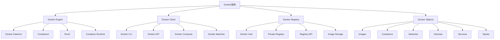

# Docker容器化

## 🎯 学习目标
- 理解Docker容器化的核心概念和优势
- 掌握Docker的基本操作和命令
- 学会为PHP应用创建和管理Docker容器
- 了解Docker Compose、Docker Swarm等高级特性

## 📚 核心概念

### Docker架构体系



### Docker核心组件

| 组件 | 功能 | 重要性 | 使用场景 |
|------|------|--------|----------|
| Image | 只读模板 | 高 | 应用打包和分发 |
| Container | 运行实例 | 高 | 应用运行环境 |
| Dockerfile | 构建指令 | 高 | 自动化构建 |
| Volume | 数据持久化 | 中 | 数据存储 |
| Network | 网络通信 | 中 | 容器间通信 |
| Compose | 多容器编排 | 高 | 开发环境管理 |

## 🔧 Docker实现

### 基础Docker操作
```php
<?php
// 1. Docker基础操作类
class DockerBasicOperations {
    private string $dockerPath;
    private array $config;
    
    public function __construct(array $config = []) {
        $this->dockerPath = $config['docker_path'] ?? 'docker';
        $this->config = array_merge([
            'timeout' => 300,
            'verbose' => false,
            'registry' => 'docker.io'
        ], $config);
    }
    
    // 执行Docker命令
    private function executeCommand(string $command): array {
        $fullCommand = "{$this->dockerPath} {$command}";
        
        if ($this->config['verbose']) {
            echo "执行命令: {$fullCommand}\n";
        }
        
        $output = [];
        $returnCode = 0;
        
        exec($fullCommand . ' 2>&1', $output, $returnCode);
        
        return [
            'command' => $fullCommand,
            'output' => $output,
            'return_code' => $returnCode,
            'success' => $returnCode === 0
        ];
    }
    
    // 检查Docker状态
    public function checkDockerStatus(): array {
        $result = $this->executeCommand('version');
        
        if (!$result['success']) {
            return [
                'status' => 'error',
                'message' => 'Docker未安装或未运行',
                'details' => implode("\n", $result['output'])
            ];
        }
        
        // 解析版本信息
        $versionInfo = [];
        foreach ($result['output'] as $line) {
            if (strpos($line, ':') !== false) {
                [$key, $value] = explode(':', $line, 2);
                $versionInfo[trim($key)] = trim($value);
            }
        }
        
        return [
            'status' => 'running',
            'version' => $versionInfo,
            'details' => implode("\n", $result['output'])
        ];
    }
    
    // 拉取镜像
    public function pullImage(string $imageName, string $tag = 'latest'): array {
        $fullImageName = "{$imageName}:{$tag}";
        $result = $this->executeCommand("pull {$fullImageName}");
        
        return [
            'image' => $fullImageName,
            'success' => $result['success'],
            'output' => implode("\n", $result['output']),
            'message' => $result['success'] ? "镜像 {$fullImageName} 拉取成功" : "镜像拉取失败"
        ];
    }
    
    // 列出镜像
    public function listImages(): array {
        $result = $this->executeCommand('images --format "table {{.Repository}}\t{{.Tag}}\t{{.ID}}\t{{.Size}}\t{{.CreatedAt}}"');
        
        if (!$result['success']) {
            return [
                'success' => false,
                'images' => [],
                'error' => implode("\n", $result['output'])
            ];
        }
        
        $images = [];
        $lines = $result['output'];
        
        // 跳过表头
        for ($i = 1; $i < count($lines); $i++) {
            $parts = preg_split('/\s+/', trim($lines[$i]));
            if (count($parts) >= 5) {
                $images[] = [
                    'repository' => $parts[0],
                    'tag' => $parts[1],
                    'id' => $parts[2],
                    'size' => $parts[3],
                    'created' => $parts[4]
                ];
            }
        }
        
        return [
            'success' => true,
            'images' => $images,
            'count' => count($images)
        ];
    }
    
    // 运行容器
    public function runContainer(string $image, array $options = []): array {
        $command = "run";
        
        // 添加选项
        if (isset($options['name'])) {
            $command .= " --name {$options['name']}";
        }
        
        if (isset($options['detach']) && $options['detach']) {
            $command .= " -d";
        }
        
        if (isset($options['ports'])) {
            foreach ($options['ports'] as $hostPort => $containerPort) {
                $command .= " -p {$hostPort}:{$containerPort}";
            }
        }
        
        if (isset($options['volumes'])) {
            foreach ($options['volumes'] as $hostPath => $containerPath) {
                $command .= " -v {$hostPath}:{$containerPath}";
            }
        }
        
        if (isset($options['environment'])) {
            foreach ($options['environment'] as $key => $value) {
                $command .= " -e {$key}={$value}";
            }
        }
        
        if (isset($options['network'])) {
            $command .= " --network {$options['network']}";
        }
        
        $command .= " {$image}";
        
        if (isset($options['command'])) {
            $command .= " {$options['command']}";
        }
        
        $result = $this->executeCommand($command);
        
        return [
            'success' => $result['success'],
            'container_id' => $result['success'] ? trim($result['output'][0]) : null,
            'output' => implode("\n", $result['output']),
            'command' => $command
        ];
    }
    
    // 列出容器
    public function listContainers(bool $all = false): array {
        $command = $all ? 'ps -a' : 'ps';
        $result = $this->executeCommand($command . ' --format "table {{.ID}}\t{{.Image}}\t{{.Command}}\t{{.CreatedAt}}\t{{.Status}}\t{{.Ports}}\t{{.Names}}"');
        
        if (!$result['success']) {
            return [
                'success' => false,
                'containers' => [],
                'error' => implode("\n", $result['output'])
            ];
        }
        
        $containers = [];
        $lines = $result['output'];
        
        // 跳过表头
        for ($i = 1; $i < count($lines); $i++) {
            $parts = preg_split('/\s+/', trim($lines[$i]), 7);
            if (count($parts) >= 7) {
                $containers[] = [
                    'id' => $parts[0],
                    'image' => $parts[1],
                    'command' => $parts[2],
                    'created' => $parts[3],
                    'status' => $parts[4],
                    'ports' => $parts[5],
                    'names' => $parts[6]
                ];
            }
        }
        
        return [
            'success' => true,
            'containers' => $containers,
            'count' => count($containers)
        ];
    }
    
    // 停止容器
    public function stopContainer(string $containerId): array {
        $result = $this->executeCommand("stop {$containerId}");
        
        return [
            'success' => $result['success'],
            'output' => implode("\n", $result['output']),
            'message' => $result['success'] ? "容器 {$containerId} 已停止" : "停止容器失败"
        ];
    }
    
    // 删除容器
    public function removeContainer(string $containerId, bool $force = false): array {
        $command = $force ? "rm -f {$containerId}" : "rm {$containerId}";
        $result = $this->executeCommand($command);
        
        return [
            'success' => $result['success'],
            'output' => implode("\n", $result['output']),
            'message' => $result['success'] ? "容器 {$containerId} 已删除" : "删除容器失败"
        ];
    }
    
    // 查看容器日志
    public function getContainerLogs(string $containerId, int $lines = 100): array {
        $result = $this->executeCommand("logs --tail {$lines} {$containerId}");
        
        return [
            'success' => $result['success'],
            'logs' => $result['output'],
            'message' => $result['success'] ? "获取日志成功" : "获取日志失败"
        ];
    }
    
    // 进入容器
    public function execContainer(string $containerId, string $command = '/bin/bash'): array {
        $result = $this->executeCommand("exec -it {$containerId} {$command}");
        
        return [
            'success' => $result['success'],
            'output' => implode("\n", $result['output']),
            'message' => $result['success'] ? "进入容器成功" : "进入容器失败"
        ];
    }
}

// 2. PHP应用Docker化工具
class PHPDockerizationTool {
    private DockerBasicOperations $docker;
    private array $phpConfig;
    
    public function __construct(DockerBasicOperations $docker, array $phpConfig = []) {
        $this->docker = $docker;
        $this->phpConfig = array_merge([
            'php_version' => '8.1',
            'web_server' => 'nginx',
            'database' => 'mysql',
            'cache' => 'redis',
            'composer' => true,
            'xdebug' => false
        ], $phpConfig);
    }
    
    // 生成PHP Dockerfile
    public function generatePHPDockerfile(): string {
        $dockerfile = "FROM php:{$this->phpConfig['php_version']}-fpm\n\n";
        
        // 安装系统依赖
        $dockerfile .= "# 安装系统依赖\n";
        $dockerfile .= "RUN apt-get update && apt-get install -y \\\n";
        $dockerfile .= "    git \\\n";
        $dockerfile .= "    curl \\\n";
        $dockerfile .= "    libpng-dev \\\n";
        $dockerfile .= "    libonig-dev \\\n";
        $dockerfile .= "    libxml2-dev \\\n";
        $dockerfile .= "    zip \\\n";
        $dockerfile .= "    unzip \\\n";
        $dockerfile .= "    && rm -rf /var/lib/apt/lists/*\n\n";
        
        // 安装PHP扩展
        $dockerfile .= "# 安装PHP扩展\n";
        $dockerfile .= "RUN docker-php-ext-install pdo_mysql mbstring exif pcntl bcmath gd\n\n";
        
        // 安装Composer
        if ($this->phpConfig['composer']) {
            $dockerfile .= "# 安装Composer\n";
            $dockerfile .= "COPY --from=composer:latest /usr/bin/composer /usr/bin/composer\n\n";
        }
        
        // 安装Xdebug
        if ($this->phpConfig['xdebug']) {
            $dockerfile .= "# 安装Xdebug\n";
            $dockerfile .= "RUN pecl install xdebug && docker-php-ext-enable xdebug\n";
            $dockerfile .= "RUN echo \"xdebug.mode=debug\" >> /usr/local/etc/php/conf.d/docker-php-ext-xdebug.ini\n";
            $dockerfile .= "RUN echo \"xdebug.client_host=host.docker.internal\" >> /usr/local/etc/php/conf.d/docker-php-ext-xdebug.ini\n\n";
        }
        
        // 设置工作目录
        $dockerfile .= "# 设置工作目录\n";
        $dockerfile .= "WORKDIR /var/www\n\n";
        
        // 复制应用代码
        $dockerfile .= "# 复制应用代码\n";
        $dockerfile .= "COPY . /var/www\n\n";
        
        // 设置权限
        $dockerfile .= "# 设置权限\n";
        $dockerfile .= "RUN chown -R www-data:www-data /var/www\n";
        $dockerfile .= "RUN chmod -R 755 /var/www\n\n";
        
        // 安装依赖
        if ($this->phpConfig['composer']) {
            $dockerfile .= "# 安装PHP依赖\n";
            $dockerfile .= "RUN composer install --no-dev --optimize-autoloader\n\n";
        }
        
        // 暴露端口
        $dockerfile .= "# 暴露端口\n";
        $dockerfile .= "EXPOSE 9000\n\n";
        
        // 启动命令
        $dockerfile .= "# 启动命令\n";
        $dockerfile .= "CMD [\"php-fpm\"]\n";
        
        return $dockerfile;
    }
    
    // 生成Nginx配置
    public function generateNginxConfig(): string {
        $config = "server {\n";
        $config .= "    listen 80;\n";
        $config .= "    server_name localhost;\n";
        $config .= "    root /var/www/public;\n";
        $config .= "    index index.php index.html;\n\n";
        
        $config .= "    location / {\n";
        $config .= "        try_files \$uri \$uri/ /index.php?\$query_string;\n";
        $config .= "    }\n\n";
        
        $config .= "    location ~ \\.php$ {\n";
        $config .= "        fastcgi_pass php:9000;\n";
        $config .= "        fastcgi_index index.php;\n";
        $config .= "        fastcgi_param SCRIPT_FILENAME \$document_root\$fastcgi_script_name;\n";
        $config .= "        include fastcgi_params;\n";
        $config .= "    }\n\n";
        
        $config .= "    location ~ /\\.ht {\n";
        $config .= "        deny all;\n";
        $config .= "    }\n";
        $config .= "}\n";
        
        return $config;
    }
    
    // 生成Docker Compose配置
    public function generateDockerComposeConfig(): string {
        $compose = "version: '3.8'\n\n";
        $compose .= "services:\n\n";
        
        // PHP服务
        $compose .= "  php:\n";
        $compose .= "    build: .\n";
        $compose .= "    container_name: php_app\n";
        $compose .= "    restart: unless-stopped\n";
        $compose .= "    working_dir: /var/www\n";
        $compose .= "    volumes:\n";
        $compose .= "      - ./:/var/www\n";
        $compose .= "      - ./docker/php/local.ini:/usr/local/etc/php/conf.d/local.ini\n";
        $compose .= "    networks:\n";
        $compose .= "      - app-network\n\n";
        
        // Nginx服务
        $compose .= "  nginx:\n";
        $compose .= "    image: nginx:alpine\n";
        $compose .= "    container_name: nginx_app\n";
        $compose .= "    restart: unless-stopped\n";
        $compose .= "    ports:\n";
        $compose .= "      - \"8080:80\"\n";
        $compose .= "    volumes:\n";
        $compose .= "      - ./:/var/www\n";
        $compose .= "      - ./docker/nginx/default.conf:/etc/nginx/conf.d/default.conf\n";
        $compose .= "    depends_on:\n";
        $compose .= "      - php\n";
        $compose .= "    networks:\n";
        $compose .= "      - app-network\n\n";
        
        // MySQL服务
        if ($this->phpConfig['database'] === 'mysql') {
            $compose .= "  mysql:\n";
            $compose .= "    image: mysql:8.0\n";
            $compose .= "    container_name: mysql_db\n";
            $compose .= "    restart: unless-stopped\n";
            $compose .= "    environment:\n";
            $compose .= "      MYSQL_DATABASE: laravel\n";
            $compose .= "      MYSQL_ROOT_PASSWORD: root\n";
            $compose .= "      MYSQL_USER: laravel\n";
            $compose .= "      MYSQL_PASSWORD: laravel\n";
            $compose .= "    volumes:\n";
            $compose .= "      - mysql_data:/var/lib/mysql\n";
            $compose .= "    ports:\n";
            $compose .= "      - \"3306:3306\"\n";
            $compose .= "    networks:\n";
            $compose .= "      - app-network\n\n";
        }
        
        // Redis服务
        if ($this->phpConfig['cache'] === 'redis') {
            $compose .= "  redis:\n";
            $compose .= "    image: redis:alpine\n";
            $compose .= "    container_name: redis_cache\n";
            $compose .= "    restart: unless-stopped\n";
            $compose .= "    ports:\n";
            $compose .= "      - \"6379:6379\"\n";
            $compose .= "    networks:\n";
            $compose .= "      - app-network\n\n";
        }
        
        // 网络配置
        $compose .= "networks:\n";
        $compose .= "  app-network:\n";
        $compose .= "    driver: bridge\n\n";
        
        // 数据卷配置
        $compose .= "volumes:\n";
        if ($this->phpConfig['database'] === 'mysql') {
            $compose .= "  mysql_data:\n";
            $compose .= "    driver: local\n";
        }
        
        return $compose;
    }
    
    // 创建完整的Docker环境
    public function createDockerEnvironment(string $projectPath): array {
        $results = [];
        
        // 创建目录结构
        $directories = [
            $projectPath . '/docker/php',
            $projectPath . '/docker/nginx',
            $projectPath . '/docker/mysql'
        ];
        
        foreach ($directories as $dir) {
            if (!is_dir($dir)) {
                mkdir($dir, 0755, true);
                $results[] = "创建目录: {$dir}";
            }
        }
        
        // 生成Dockerfile
        $dockerfile = $this->generatePHPDockerfile();
        file_put_contents($projectPath . '/Dockerfile', $dockerfile);
        $results[] = "生成Dockerfile";
        
        // 生成Nginx配置
        $nginxConfig = $this->generateNginxConfig();
        file_put_contents($projectPath . '/docker/nginx/default.conf', $nginxConfig);
        $results[] = "生成Nginx配置";
        
        // 生成Docker Compose配置
        $composeConfig = $this->generateDockerComposeConfig();
        file_put_contents($projectPath . '/docker-compose.yml', $composeConfig);
        $results[] = "生成Docker Compose配置";
        
        // 生成PHP配置
        $phpConfig = "upload_max_filesize=40M\n";
        $phpConfig .= "post_max_size=40M\n";
        $phpConfig .= "memory_limit=256M\n";
        $phpConfig .= "max_execution_time=300\n";
        file_put_contents($projectPath . '/docker/php/local.ini', $phpConfig);
        $results[] = "生成PHP配置";
        
        return [
            'success' => true,
            'results' => $results,
            'message' => 'Docker环境创建成功'
        ];
    }
    
    // 构建和启动应用
    public function buildAndStartApplication(string $projectPath): array {
        $results = [];
        
        // 构建镜像
        $buildResult = $this->docker->executeCommand("build -t php-app {$projectPath}");
        if ($buildResult['success']) {
            $results[] = "镜像构建成功";
        } else {
            return [
                'success' => false,
                'error' => '镜像构建失败',
                'details' => implode("\n", $buildResult['output'])
            ];
        }
        
        // 启动服务
        $startResult = $this->docker->executeCommand("compose -f {$projectPath}/docker-compose.yml up -d");
        if ($startResult['success']) {
            $results[] = "服务启动成功";
        } else {
            return [
                'success' => false,
                'error' => '服务启动失败',
                'details' => implode("\n", $startResult['output'])
            ];
        }
        
        return [
            'success' => true,
            'results' => $results,
            'message' => '应用构建和启动成功'
        ];
    }
}

// 3. Docker管理工具
class DockerManagementTool {
    private DockerBasicOperations $docker;
    private array $containers = [];
    private array $images = [];
    
    public function __construct(DockerBasicOperations $docker) {
        $this->docker = $docker;
    }
    
    // 系统清理
    public function systemCleanup(): array {
        $results = [];
        
        // 清理未使用的容器
        $containerResult = $this->docker->executeCommand('container prune -f');
        if ($containerResult['success']) {
            $results[] = "清理未使用的容器";
        }
        
        // 清理未使用的镜像
        $imageResult = $this->docker->executeCommand('image prune -f');
        if ($imageResult['success']) {
            $results[] = "清理未使用的镜像";
        }
        
        // 清理未使用的网络
        $networkResult = $this->docker->executeCommand('network prune -f');
        if ($networkResult['success']) {
            $results[] = "清理未使用的网络";
        }
        
        // 清理未使用的数据卷
        $volumeResult = $this->docker->executeCommand('volume prune -f');
        if ($volumeResult['success']) {
            $results[] = "清理未使用的数据卷";
        }
        
        return [
            'success' => true,
            'results' => $results,
            'message' => '系统清理完成'
        ];
    }
    
    // 获取系统信息
    public function getSystemInfo(): array {
        $infoResult = $this->docker->executeCommand('system df');
        $versionResult = $this->docker->executeCommand('version');
        
        return [
            'disk_usage' => $infoResult['output'],
            'version_info' => $versionResult['output'],
            'success' => $infoResult['success'] && $versionResult['success']
        ];
    }
    
    // 监控容器状态
    public function monitorContainers(): array {
        $containers = $this->docker->listContainers(true);
        
        if (!$containers['success']) {
            return [
                'success' => false,
                'error' => '获取容器列表失败'
            ];
        }
        
        $status = [
            'running' => 0,
            'stopped' => 0,
            'total' => count($containers['containers'])
        ];
        
        foreach ($containers['containers'] as $container) {
            if (strpos($container['status'], 'Up') === 0) {
                $status['running']++;
            } else {
                $status['stopped']++;
            }
        }
        
        return [
            'success' => true,
            'status' => $status,
            'containers' => $containers['containers']
        ];
    }
    
    // 备份容器数据
    public function backupContainerData(string $containerId, string $backupPath): array {
        $backupFile = "{$backupPath}/container_{$containerId}_" . date('Y-m-d_H-i-s') . ".tar";
        
        $result = $this->docker->executeCommand("export {$containerId} -o {$backupFile}");
        
        return [
            'success' => $result['success'],
            'backup_file' => $backupFile,
            'message' => $result['success'] ? '容器数据备份成功' : '容器数据备份失败'
        ];
    }
    
    // 恢复容器数据
    public function restoreContainerData(string $backupFile, string $imageName): array {
        $result = $this->docker->executeCommand("import {$backupFile} {$imageName}");
        
        return [
            'success' => $result['success'],
            'message' => $result['success'] ? '容器数据恢复成功' : '容器数据恢复失败'
        ];
    }
}

// 使用示例
echo "=== Docker容器化示例 ===\n";

try {
    // 创建Docker操作实例
    $docker = new DockerBasicOperations(['verbose' => true]);
    
    // 检查Docker状态
    $status = $docker->checkDockerStatus();
    echo "Docker状态: {$status['status']}\n";
    
    if ($status['status'] === 'running') {
        // 列出镜像
        $images = $docker->listImages();
        echo "镜像数量: {$images['count']}\n";
        
        // 列出容器
        $containers = $docker->listContainers();
        echo "容器数量: {$containers['count']}\n";
    }
    
    // 创建PHP Docker化工具
    $phpDocker = new PHPDockerizationTool($docker, [
        'php_version' => '8.1',
        'web_server' => 'nginx',
        'database' => 'mysql',
        'cache' => 'redis',
        'composer' => true,
        'xdebug' => true
    ]);
    
    // 生成Dockerfile
    $dockerfile = $phpDocker->generatePHPDockerfile();
    echo "Dockerfile生成完成\n";
    
    // 生成Docker Compose配置
    $composeConfig = $phpDocker->generateDockerComposeConfig();
    echo "Docker Compose配置生成完成\n";
    
    // 创建Docker环境
    $envResult = $phpDocker->createDockerEnvironment('./test-project');
    echo "Docker环境创建结果: {$envResult['message']}\n";
    
    // 创建Docker管理工具
    $management = new DockerManagementTool($docker);
    
    // 系统清理
    $cleanupResult = $management->systemCleanup();
    echo "系统清理结果: {$cleanupResult['message']}\n";
    
    // 监控容器状态
    $monitorResult = $management->monitorContainers();
    if ($monitorResult['success']) {
        echo "运行中容器: {$monitorResult['status']['running']}\n";
        echo "已停止容器: {$monitorResult['status']['stopped']}\n";
    }
    
} catch (Exception $e) {
    echo "错误: " . $e->getMessage() . "\n";
}
?>
```

## 📊 最佳实践

### Docker最佳实践
```php
<?php
// Docker最佳实践

class DockerBestPractices {
    // 1. 镜像构建最佳实践
    public static function getImageBuildBestPractices() {
        return [
            'Dockerfile优化' => [
                '多阶段构建' => '使用多阶段构建减少镜像大小',
                '层缓存优化' => '合理排序指令以利用层缓存',
                '基础镜像选择' => '选择合适的基础镜像',
                '清理缓存' => '及时清理包管理器和构建缓存'
            ],
            '安全考虑' => [
                '非root用户' => '使用非root用户运行应用',
                '最小权限' => '遵循最小权限原则',
                '镜像扫描' => '定期扫描镜像漏洞',
                '密钥管理' => '安全处理敏感信息'
            ],
            '性能优化' => [
                '镜像大小' => '优化镜像大小',
                '构建速度' => '提高构建速度',
                '启动时间' => '减少容器启动时间',
                '资源使用' => '优化资源使用'
            ]
        ];
    }
    
    // 2. 容器运行最佳实践
    public static function getContainerRuntimeBestPractices() {
        return [
            '资源管理' => [
                '内存限制' => '设置适当的内存限制',
                'CPU限制' => '设置CPU使用限制',
                '存储限制' => '监控存储使用情况',
                '网络限制' => '配置网络访问控制'
            ],
            '数据管理' => [
                '数据卷' => '使用数据卷持久化数据',
                '备份策略' => '制定数据备份策略',
                '数据迁移' => '规划数据迁移方案',
                '数据安全' => '保护敏感数据'
            ],
            '监控日志' => [
                '日志管理' => '集中管理容器日志',
                '监控指标' => '监控容器性能指标',
                '告警机制' => '建立告警机制',
                '故障排查' => '快速故障排查'
            ]
        ];
    }
    
    // 3. 编排管理最佳实践
    public static function getOrchestrationBestPractices() {
        return [
            '服务编排' => [
                '服务发现' => '实现服务自动发现',
                '负载均衡' => '配置负载均衡',
                '健康检查' => '设置健康检查',
                '滚动更新' => '实现滚动更新'
            ],
            '网络管理' => [
                '网络隔离' => '实现网络隔离',
                '服务通信' => '优化服务间通信',
                '安全策略' => '实施网络安全策略',
                '流量管理' => '管理网络流量'
            ],
            '存储管理' => [
                '存储类型' => '选择合适的存储类型',
                '数据持久化' => '确保数据持久化',
                '存储性能' => '优化存储性能',
                '存储安全' => '保护存储安全'
            ]
        ];
    }
}

// 使用示例
echo "=== Docker最佳实践示例 ===\n";

try {
    $imagePractices = DockerBestPractices::getImageBuildBestPractices();
    echo "镜像构建最佳实践:\n";
    foreach ($imagePractices as $category => $practices) {
        echo "  $category:\n";
        foreach ($practices as $practice => $description) {
            echo "    - $practice: $description\n";
        }
        echo "\n";
    }
    
} catch (Exception $e) {
    echo "错误: " . $e->getMessage() . "\n";
}
?>
```

## 🎓 学习建议

### 费曼学习法应用
1. **选择概念**: 选择Docker容器化中的核心概念
2. **简化解释**: 用简单语言解释Docker的作用
3. **识别盲点**: 发现理解不深入的地方
4. **重新学习**: 针对盲点进行深入学习

### 刻意练习重点
1. **基础操作**: 掌握Docker的基本命令和操作
2. **镜像构建**: 学会编写Dockerfile和构建镜像
3. **容器管理**: 掌握容器的创建、运行和管理
4. **编排工具**: 了解Docker Compose等编排工具

## 🔗 相关链接
- [[02-CI_CD流水线|CI/CD流水线]]
- [[03-生产环境配置|生产环境配置]]
- [[04-负载均衡|负载均衡]]
- [[05-监控与日志|监控与日志]]
- [[06-备份与恢复|备份与恢复]]
- [[07-运维自动化|运维自动化]]
